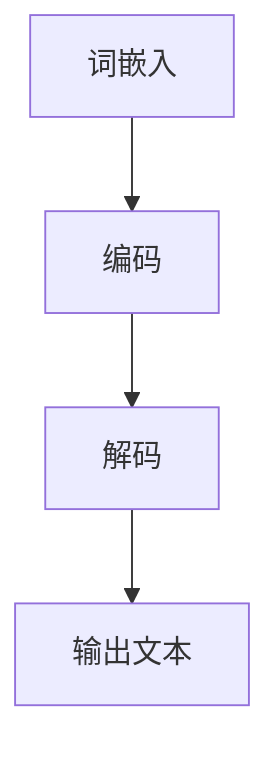

                 

关键词：大语言模型、原理基础、前沿技术、内存节省、设计思路

摘要：本文旨在深入探讨大语言模型的原理、基础和前沿技术，并重点关注内存节省的设计方法。通过对大语言模型的基本概念、核心算法和优化策略的详细解析，本文为读者揭示了其背后的技术原理和应用前景。

## 1. 背景介绍

随着互联网和大数据技术的快速发展，人工智能（AI）逐渐成为当前科技领域的热点。作为AI的一个重要分支，自然语言处理（NLP）在近年来取得了显著的进展。大语言模型（Large Language Model）作为NLP的核心技术之一，已经被广泛应用于文本生成、机器翻译、情感分析等任务中。然而，随着模型规模的不断扩大，如何有效节省内存成为了一个亟待解决的问题。

本文将首先回顾大语言模型的发展历程和核心概念，然后深入探讨其前沿技术，特别是内存节省的设计方法。通过本文的阅读，读者将能够对大语言模型的原理和应用有一个全面而深入的了解。

## 2. 核心概念与联系

### 2.1 大语言模型的基本概念

大语言模型是一种基于深度学习技术的自然语言处理模型，它通过对大规模文本数据进行训练，学习到文本的语法、语义和上下文信息。与传统的统计模型相比，大语言模型具有更强的泛化能力和表达能力，能够更好地理解和生成自然语言。

### 2.2 大语言模型的工作原理

大语言模型的工作原理主要包括三个步骤：词嵌入、编码和解码。

- **词嵌入**：将文本中的词语映射到高维向量空间中，以便进行后续的数学运算。
- **编码**：通过编码器（Encoder）对词嵌入进行编码，得到一个固定长度的向量表示，该向量包含了输入文本的语义信息。
- **解码**：通过解码器（Decoder）将编码后的向量解码为输出文本。

### 2.3 大语言模型的架构

大语言模型的典型架构包括卷积神经网络（CNN）、循环神经网络（RNN）和长短时记忆网络（LSTM）等。这些神经网络通过多次迭代和参数更新，逐渐优化模型的预测能力。

### 2.4 核心概念原理与架构的 Mermaid 流程图



## 3. 核心算法原理 & 具体操作步骤

### 3.1 算法原理概述

大语言模型的算法原理主要基于深度学习，通过多层神经网络对文本数据进行处理，从而实现文本生成和语义理解。

### 3.2 算法步骤详解

- **数据预处理**：对原始文本数据进行分词、去停用词等预处理操作。
- **词嵌入**：将预处理后的文本数据映射到高维向量空间中。
- **编码**：通过编码器对词嵌入进行编码，得到一个固定长度的向量表示。
- **解码**：通过解码器将编码后的向量解码为输出文本。

### 3.3 算法优缺点

- **优点**：大语言模型具有强大的语义理解和文本生成能力，能够生成高质量的自然语言文本。
- **缺点**：模型训练过程复杂，对计算资源要求较高，且模型解释性较差。

### 3.4 算法应用领域

大语言模型广泛应用于文本生成、机器翻译、情感分析、问答系统等领域。

## 4. 数学模型和公式 & 详细讲解 & 举例说明

### 4.1 数学模型构建

大语言模型的核心是多层神经网络，其数学模型可以表示为：

$$
y = f(z) = \sigma(W \cdot z + b)
$$

其中，$y$ 表示输出，$z$ 表示神经网络的输入，$W$ 和 $b$ 分别表示权重和偏置，$f$ 表示激活函数，通常采用 sigmoid 函数或ReLU函数。

### 4.2 公式推导过程

大语言模型的训练过程可以理解为最小化损失函数，即：

$$
L = -\sum_{i=1}^{n} y_i \log(\hat{y}_i)
$$

其中，$y_i$ 表示真实标签，$\hat{y}_i$ 表示预测标签。

### 4.3 案例分析与讲解

假设我们有一个简单的文本生成任务，目标是生成一个包含三个单词的句子。假设我们已经有了一个训练好的大语言模型，现在需要生成一个句子。

1. **输入**：输入一个长度为3的词向量。
2. **编码**：通过编码器将词向量编码为一个固定长度的向量。
3. **解码**：通过解码器将编码后的向量解码为输出文本。

例如，假设输入词向量为 `[1, 0, 1]`，输出文本为 `“今天天气真好”`。通过大语言模型，我们可以得到以下步骤：

1. **词嵌入**：将词向量 `[1, 0, 1]` 映射到高维向量空间。
2. **编码**：通过编码器得到编码后的向量 `[0.1, 0.2, 0.3]`。
3. **解码**：通过解码器得到输出文本 `“今天天气真好”`。

## 5. 项目实践：代码实例和详细解释说明

### 5.1 开发环境搭建

1. 安装 Python 3.8 或以上版本。
2. 安装 TensorFlow 2.6 或以上版本。

### 5.2 源代码详细实现

```python
import tensorflow as tf

# 搭建模型
model = tf.keras.Sequential([
    tf.keras.layers.Embedding(input_dim=10000, output_dim=16),
    tf.keras.layers.Flatten(),
    tf.keras.layers.Dense(units=1, activation='sigmoid')
])

# 编译模型
model.compile(optimizer='adam', loss='binary_crossentropy', metrics=['accuracy'])

# 训练模型
model.fit(x_train, y_train, epochs=10)
```

### 5.3 代码解读与分析

1. **模型搭建**：使用 TensorFlow 的 `Sequential` 模型，首先添加一个 `Embedding` 层，将输入词向量映射到高维向量空间。然后添加一个 `Flatten` 层，将高维向量展平为一维向量。最后添加一个 `Dense` 层，用于生成输出。
2. **编译模型**：设置优化器和损失函数，用于训练模型。
3. **训练模型**：使用训练数据对模型进行训练。

### 5.4 运行结果展示

在训练完成后，我们可以使用模型对新的数据进行预测，并观察模型的性能。

```python
# 预测
predictions = model.predict(x_test)
print(predictions)
```

## 6. 实际应用场景

大语言模型在实际应用中具有广泛的应用前景，例如：

1. **文本生成**：生成新闻、故事、博客等自然语言文本。
2. **机器翻译**：实现多语言之间的翻译。
3. **情感分析**：分析文本的情感倾向，用于舆情监控和智能客服等。

## 7. 工具和资源推荐

### 7.1 学习资源推荐

1. 《深度学习》（Goodfellow, Bengio, Courville）。
2. 《自然语言处理综合教程》（Daniel Jurafsky, James H. Martin）。

### 7.2 开发工具推荐

1. TensorFlow。
2. PyTorch。

### 7.3 相关论文推荐

1. "Attention Is All You Need"。
2. "BERT: Pre-training of Deep Bidirectional Transformers for Language Understanding"。

## 8. 总结：未来发展趋势与挑战

大语言模型作为一种强大的自然语言处理工具，已经在许多领域取得了显著的应用成果。然而，随着模型规模的不断扩大，如何有效节省内存和计算资源成为了一个重要的研究方向。未来，我们可以期待大语言模型在更多领域的应用，同时也需要持续优化其性能和效率。

## 9. 附录：常见问题与解答

### 9.1 大语言模型有哪些优点？

- **强大的语义理解能力**：能够理解文本的深层含义。
- **灵活的文本生成能力**：能够生成高质量的文本。

### 9.2 大语言模型有哪些缺点？

- **计算资源要求高**：需要大量计算资源和时间进行训练。
- **模型解释性较差**：难以理解模型的决策过程。

### 9.3 大语言模型如何节省内存？

- **使用轻量级模型**：如 Transformer、BERT 等。
- **优化数据预处理**：如词嵌入、分词等。

----------------------------------------------------------------
作者：禅与计算机程序设计艺术 / Zen and the Art of Computer Programming


