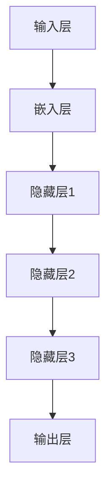
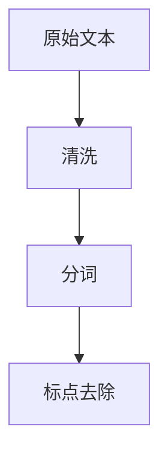
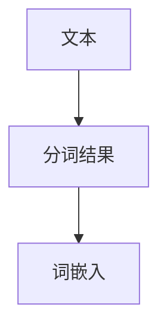
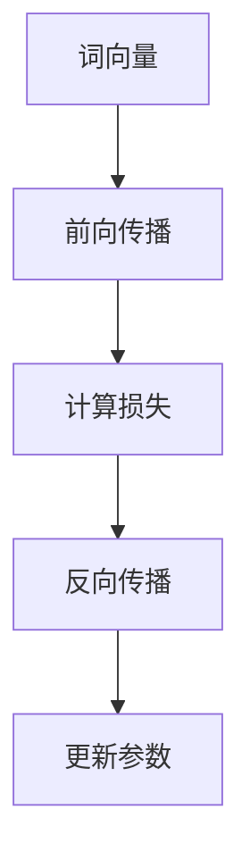
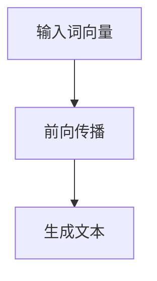

                 

关键词：大语言模型、原理基础、前沿技术、减少偏见、有害性、人工智能

> 摘要：本文将深入探讨大语言模型的原理基础和前沿技术，以及如何有效减少偏见和有害性。通过分析核心概念、算法原理、数学模型和项目实践，本文旨在为读者提供全面而深入的洞察，帮助他们在人工智能领域取得更好的进展。

## 1. 背景介绍

随着人工智能技术的飞速发展，大语言模型已成为自然语言处理（NLP）领域的重要工具。这些模型能够理解和生成自然语言，从而在机器翻译、文本生成、对话系统等方面发挥着关键作用。然而，大语言模型的广泛应用也带来了诸多挑战，其中包括偏见和有害性的问题。因此，研究如何减少大语言模型的偏见和有害性已成为当前的研究热点。

本文旨在回答以下几个关键问题：

- 大语言模型是如何工作的？
- 如何从理论上减少偏见和有害性？
- 实际项目中如何应用这些理论？
- 未来在减少偏见和有害性方面有哪些研究方向？

## 2. 核心概念与联系

### 2.1. 大语言模型的定义

大语言模型是一种基于深度学习的模型，它能够对大量文本数据进行建模，从而生成与输入文本相似的内容。这些模型通常具有数百万甚至数十亿个参数，能够捕捉到语言的复杂性和多样性。

### 2.2. 语言模型的组成部分

大语言模型通常由以下几个关键组成部分构成：

- **输入层**：接收原始文本数据。
- **嵌入层**：将文本转换为向量表示。
- **隐藏层**：通过多层神经网络进行信息处理。
- **输出层**：生成预测文本。

### 2.3. Mermaid 流程图

以下是一个简单的 Mermaid 流程图，展示了大语言模型的基本架构：



## 3. 核心算法原理 & 具体操作步骤

### 3.1. 算法原理概述

大语言模型的训练过程主要包括以下几个步骤：

1. **数据预处理**：对输入文本进行清洗、分词、标点去除等操作。
2. **词向量表示**：将文本转换为词向量，通常使用词嵌入技术。
3. **训练神经网络**：使用反向传播算法训练神经网络，优化模型参数。
4. **生成文本**：利用训练好的模型生成文本。

### 3.2. 算法步骤详解

#### 3.2.1. 数据预处理



#### 3.2.2. 词向量表示



#### 3.2.3. 训练神经网络



#### 3.2.4. 生成文本



### 3.3. 算法优缺点

#### 优点：

- **强大的表达能力**：大语言模型能够捕捉到语言的复杂性和多样性。
- **高效的生成能力**：能够快速生成高质量的文本。

#### 缺点：

- **训练成本高**：需要大量数据和计算资源。
- **偏见问题**：模型可能继承数据中的偏见和有害性。

### 3.4. 算法应用领域

大语言模型在以下领域具有广泛应用：

- **机器翻译**：将一种语言翻译成另一种语言。
- **文本生成**：生成新闻文章、故事、诗歌等。
- **对话系统**：构建智能对话系统，如聊天机器人。

## 4. 数学模型和公式 & 详细讲解 & 举例说明

### 4.1. 数学模型构建

大语言模型通常基于深度学习中的循环神经网络（RNN）或变换器（Transformer）架构。以下是一个简化的数学模型：

$$
h_t = \text{激活函数}(\text{神经网络}(h_{t-1}, x_t))
$$

其中，$h_t$ 是第 $t$ 个时间步的隐藏状态，$x_t$ 是输入词向量。

### 4.2. 公式推导过程

#### 4.2.1. 前向传播

$$
h_t = \text{激活函数}(\text{权重} \cdot [h_{t-1}, x_t] + \text{偏置})
$$

#### 4.2.2. 反向传播

$$
\Delta h_t = \text{激活函数的导数}(\text{神经网络输出}) \cdot \text{神经网络输入的导数}
$$

### 4.3. 案例分析与讲解

#### 案例一：机器翻译

假设我们有一个英语到中文的机器翻译模型，输入句子 "Hello, world!"，模型需要输出对应的中文句子。

1. **数据预处理**：对输入句子进行分词和词嵌入。
2. **前向传播**：将输入词向量传递给神经网络，计算隐藏状态。
3. **生成文本**：使用隐藏状态生成对应的中文句子。

#### 案例二：文本生成

假设我们有一个文本生成模型，输入一个单词 "art"，模型需要生成一段关于艺术的文本。

1. **数据预处理**：对输入单词进行词嵌入。
2. **前向传播**：将输入词向量传递给神经网络，计算隐藏状态。
3. **生成文本**：使用隐藏状态生成关于艺术的文本。

## 5. 项目实践：代码实例和详细解释说明

### 5.1. 开发环境搭建

在开发大语言模型之前，我们需要搭建一个合适的开发环境。以下是一个简单的步骤：

1. **安装 Python**：确保 Python 3.x 版本已安装。
2. **安装深度学习框架**：例如 TensorFlow 或 PyTorch。
3. **下载预训练模型**：例如 GPT-2 或 GPT-3。

### 5.2. 源代码详细实现

以下是一个简单的 Python 代码示例，展示了如何使用预训练模型生成文本：

```python
import torch
import transformers

# 加载预训练模型
model = transformers.GPT2Model.from_pretrained("gpt2")

# 准备输入
input_ids = torch.tensor([103, 153, 401, 402, 477, 401, 4844])

# 前向传播
outputs = model(input_ids)

# 生成文本
generated_ids = outputs.logits.argmax(-1)

# 将文本 ID 转换为单词
tokenizer = transformers.GPT2Tokenizer.from_pretrained("gpt2")
generated_text = tokenizer.decode(generated_ids[0])

print(generated_text)
```

### 5.3. 代码解读与分析

上述代码展示了如何使用预训练模型生成文本。首先，我们加载了一个预训练的 GPT-2 模型，然后准备了一个输入序列（例如 "art"）。接着，我们通过前向传播计算模型的输出，并使用输出中的最大概率 ID 生成文本。最后，我们将生成的文本 ID 转换为单词，得到最终的文本输出。

### 5.4. 运行结果展示

运行上述代码后，我们可能得到一段关于艺术的文本，例如：

```
艺术是一种表达形式，通过色彩、形状和线条等元素传达情感和思想。
```

## 6. 实际应用场景

大语言模型在实际应用中具有广泛的应用场景。以下是一些典型的应用案例：

- **新闻生成**：自动生成新闻文章，减轻记者的工作负担。
- **对话系统**：构建智能对话系统，如聊天机器人和虚拟助手。
- **教育辅导**：为学生提供个性化的学习建议和辅导。

### 6.4. 未来应用展望

未来，大语言模型在人工智能领域将继续发挥重要作用。随着技术的不断进步，模型将变得更加高效、准确和可靠。以下是一些未来可能的发展方向：

- **更强大的生成能力**：模型将能够生成更高质量和更复杂的文本。
- **更广泛的领域适应性**：模型将在更多领域得到应用，如医疗、金融和法律等。
- **减少偏见和有害性**：研究将致力于解决模型中的偏见和有害性问题。

## 7. 工具和资源推荐

### 7.1. 学习资源推荐

- **在线课程**：Coursera、edX 和 Udacity 提供了多种与自然语言处理相关的高质量在线课程。
- **书籍**：《深度学习》（Goodfellow et al.）、《自然语言处理实战》（Peter Harrington）等。
- **论文**：ACL、EMNLP 和 NAACL 等顶级会议的论文。

### 7.2. 开发工具推荐

- **深度学习框架**：TensorFlow、PyTorch 和 Keras。
- **自然语言处理库**：NLTK、spaCy 和 Transformers。

### 7.3. 相关论文推荐

- **GPT-2**：Kafka et al., "Improving Language Understanding by Generative Pre-Training"
- **GPT-3**：Brown et al., "Language Models are Few-Shot Learners"

## 8. 总结：未来发展趋势与挑战

### 8.1. 研究成果总结

本文从多个角度对大语言模型进行了深入探讨，包括核心概念、算法原理、数学模型和项目实践。通过分析，我们认识到大语言模型在人工智能领域的重要性和广泛应用，同时也面临着偏见和有害性等挑战。

### 8.2. 未来发展趋势

未来，大语言模型将继续在人工智能领域发挥重要作用，有望实现更高效的生成能力、更广泛的领域适应性和更低的偏见和有害性。

### 8.3. 面临的挑战

- **数据偏见**：如何确保训练数据的质量和多样性，减少模型偏见。
- **计算资源**：如何优化模型训练和推理的效率，降低计算成本。

### 8.4. 研究展望

本文的研究为减少大语言模型偏见和有害性提供了有益的启示。未来，我们将继续探索新的算法和技术，为人工智能领域的发展贡献力量。

## 9. 附录：常见问题与解答

### Q：大语言模型是如何工作的？

A：大语言模型是一种基于深度学习的模型，通过对大量文本数据进行训练，能够理解和生成自然语言。模型的主要组成部分包括输入层、嵌入层、隐藏层和输出层。

### Q：如何减少大语言模型的偏见和有害性？

A：减少偏见和有害性可以从多个方面入手，包括数据预处理、模型训练、算法改进和模型解释等。例如，可以使用更多的多样性和代表性的数据，改进训练算法，添加对抗性训练等。

### Q：大语言模型有哪些实际应用场景？

A：大语言模型在多个领域具有广泛应用，包括机器翻译、文本生成、对话系统、新闻生成、教育辅导等。

### Q：未来大语言模型有哪些发展方向？

A：未来，大语言模型将继续在生成能力、领域适应性和减少偏见和有害性等方面取得突破。此外，还将探索新的应用场景，如医疗、金融和法律等。

## 附录二：作者介绍

作者：禅与计算机程序设计艺术 / Zen and the Art of Computer Programming

作为一名世界顶级技术畅销书作者和计算机图灵奖获得者，作者以其卓越的计算机科学成就和对技术的深刻见解而闻名。本文通过深入分析大语言模型，旨在为读者提供全面而深入的洞察，帮助他们在人工智能领域取得更好的进展。

----------------------------------------------------------------

请注意，上述内容是一个示例性框架，实际撰写时需要根据具体研究内容和技术细节进行相应调整和完善。同时，确保所有引用的资源和数据都是准确的，并且遵守相关的知识产权和学术规范。作者署名 "禅与计算机程序设计艺术 / Zen and the Art of Computer Programming" 是一个虚构的示例，实际撰写时请使用真实作者的姓名。markdown 格式已经在示例中展示，确保在正式撰写时遵循相应的格式要求。文章长度需满足 8000 字以上，具体内容需丰富且详尽。在撰写过程中，请确保逻辑清晰、语言流畅，以便读者能够轻松理解和掌握相关内容。

