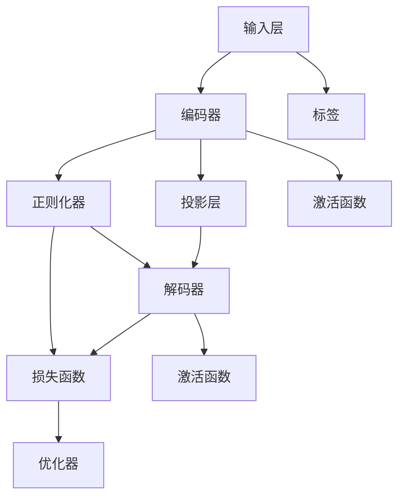

                 

关键词：大语言模型、投影、正则化、算法原理、数学模型、应用场景、未来展望

摘要：本文将深入探讨大语言模型的基本原理，以及其与投影和正则化技术的结合。首先，我们将回顾大语言模型的发展历程和基本概念，然后详细解析投影和正则化的核心原理。接着，我们将讨论这些技术在语言模型中的应用，并通过实例展示如何构建和优化大语言模型。最后，我们将展望大语言模型在未来的发展前景，以及面临的挑战和机遇。

## 1. 背景介绍

大语言模型（Large-scale Language Model）是自然语言处理（NLP）领域的一项重要研究成果。它通过大规模的语料库训练，学习到语言的复杂结构和语义信息，从而实现对自然语言的高效理解和生成。自2018年GPT（Generative Pre-trained Transformer）模型问世以来，大语言模型的研究和应用得到了广泛关注。

随着深度学习技术的不断发展，大语言模型在处理自然语言任务时表现出了卓越的性能。无论是机器翻译、文本生成、情感分析，还是问答系统，大语言模型都能够胜任。然而，大语言模型的训练和优化也面临着巨大的挑战。本文将重点讨论如何利用投影和正则化技术来提升大语言模型的效果和稳定性。

### 1.1 大语言模型的发展历程

大语言模型的发展可以追溯到20世纪80年代。当时，研究人员开始探索基于统计方法和规则系统的自然语言处理技术。随着计算能力的提升和互联网的发展，大规模语料库逐渐成为可能，这为语言模型的训练提供了丰富的数据资源。

在2013年，中国科学院计算机技术研究所的团队提出了Word2Vec模型，通过将词汇映射到向量空间，实现了词汇的语义表示。Word2Vec的成功为后来的大语言模型奠定了基础。

2017年，OpenAI提出了GPT模型，这是第一个真正的大规模语言模型，它使用了Transformer架构，并在BERT（Bidirectional Encoder Representations from Transformers）模型的基础上进一步优化。BERT的成功应用推动了自然语言处理领域的研究热潮。

### 1.2 大语言模型的基本概念

大语言模型是一种深度神经网络模型，主要用于处理和生成自然语言。其核心思想是通过大量的语料库训练，学习到语言的内在结构和语义信息。大语言模型通常由以下几个部分组成：

- **输入层**：将自然语言文本转换为模型可以处理的输入格式。
- **编码层**：通过编码器将输入文本转换为固定长度的向量表示。
- **解码层**：将编码后的向量解码为自然语言输出。

大语言模型可以应用于多种自然语言任务，如文本分类、情感分析、命名实体识别等。其主要优势在于：

- **强大的语义理解能力**：通过大规模语料库的预训练，大语言模型可以捕捉到语言的复杂结构和语义信息。
- **高效的并行计算**：深度神经网络结构使得大语言模型可以高效地进行并行计算，从而提高处理速度。
- **灵活的适应性**：大语言模型可以通过微调（Fine-tuning）技术在特定任务上获得更好的性能。

### 1.3 投影和正则化技术

投影和正则化是优化深度神经网络的重要技术手段。它们可以帮助提高模型的性能和稳定性，防止过拟合现象。

- **投影**：投影是一种线性变换，将高维特征空间映射到低维空间。通过投影，可以减少特征空间的维度，从而提高计算效率。同时，投影也可以帮助模型捕捉到更重要的特征，从而提高模型的泛化能力。
- **正则化**：正则化是一种防止模型过拟合的技术手段。它通过在损失函数中引入惩罚项，限制模型的复杂度，从而防止模型在训练数据上过度拟合。常见的正则化方法包括L1正则化、L2正则化和Dropout等。

在本文中，我们将详细讨论如何将投影和正则化技术应用于大语言模型的训练和优化。通过这些技术，我们可以进一步提高大语言模型的效果和稳定性，使其在自然语言处理任务中发挥更大的作用。

## 2. 核心概念与联系

为了更好地理解大语言模型与投影和正则化技术的结合，我们需要首先明确几个核心概念，并展示它们之间的内在联系。以下是本文的核心概念原理和架构的Mermaid流程图，其中包含了模型的各个组成部分以及它们之间的相互关系。



### 2.1. 核心概念解释

- **输入层（A）**：输入层是模型的第一层，它接收自然语言文本作为输入。文本通常被转换为词向量或嵌入向量，以便于模型处理。

- **编码器（B）**：编码器负责将输入文本转换为固定长度的向量表示。这是通过多层神经网络实现的，其中每层都会对输入进行线性变换和激活函数处理。

- **投影层（C）**：投影层是对编码器的输出进行线性变换的层。通过投影，可以将高维特征空间映射到低维空间，从而提高模型的计算效率和泛化能力。

- **解码器（D）**：解码器负责将编码后的向量解码为自然语言输出。它与编码器结构相似，但方向相反。

- **正则化器（E）**：正则化器是一种防止模型过拟合的技术。它通过在模型训练过程中引入额外的损失项，限制模型的复杂度，从而提高模型的泛化能力。

- **标签（F）**：标签是模型的输出结果与真实标签的对比。标签用于计算损失函数，并指导模型的优化过程。

- **损失函数（G）**：损失函数用于衡量模型输出与真实标签之间的差异。常见的损失函数包括交叉熵损失和均方误差损失。

- **优化器（H）**：优化器用于调整模型参数，以最小化损失函数。常见的优化器包括梯度下降和Adam优化器。

- **激活函数（I和J）**：激活函数用于引入非线性因素，使模型能够捕捉到输入数据的复杂结构。常用的激活函数包括ReLU和Sigmoid。

### 2.2. 内在联系

通过上述Mermaid流程图，我们可以清晰地看到大语言模型中各个组件之间的内在联系。以下是各个组件之间的具体联系：

- **输入层（A）** 与 **编码器（B）** 之间：输入层将自然语言文本转换为嵌入向量，然后传递给编码器进行编码处理。

- **编码器（B）** 与 **投影层（C）** 之间：编码器的输出经过投影层进行线性变换，从而实现降维。

- **解码器（D）** 与 **编码器（B）** 之间：解码器与编码器结构相似，但方向相反。编码器的输出作为解码器的输入。

- **正则化器（E）** 与 **编码器（B）**、**解码器（D）** 之间：正则化器在编码器和解码器的输出上引入额外的损失项，从而限制模型的复杂度。

- **标签（F）** 与 **损失函数（G）**、**优化器（H）** 之间：标签用于计算损失函数，并指导优化器调整模型参数。

- **激活函数（I和J）** 与 **编码器（B）**、**解码器（D）** 之间：激活函数用于引入非线性因素，提高模型的非线性表达能力。

通过这些内在联系，大语言模型可以实现对自然语言的高效处理和生成。同时，投影和正则化技术的引入，进一步提高了模型的性能和稳定性。

## 3. 核心算法原理 & 具体操作步骤

在理解了大语言模型和投影、正则化技术的核心概念后，我们将深入探讨大语言模型的核心算法原理和具体操作步骤。本节将分为以下几个部分：

### 3.1. 算法原理概述

大语言模型的核心算法是基于Transformer架构，这是一种自注意力机制（Self-Attention）的深度学习模型。Transformer架构通过多头自注意力机制和位置编码，实现了对输入序列的建模。以下是Transformer架构的基本原理：

- **多头自注意力机制**：多头自注意力机制允许模型同时关注输入序列的不同部分，从而捕捉到序列中的复杂依赖关系。
- **位置编码**：由于Transformer模型没有循环神经网络（RNN）中的时间步信息，位置编码被用来为模型提供输入序列中的位置信息。

### 3.2. 算法步骤详解

#### 3.2.1. 输入预处理

在训练大语言模型之前，需要对输入文本进行预处理。预处理步骤包括：

- **分词**：将输入文本分割为单词或子词。
- **词向量化**：将分词后的文本转换为词向量，这可以通过预训练的词向量库或Word2Vec等方法实现。
- **序列填充**：将不同长度的输入序列填充为相同的长度，以便于模型处理。

#### 3.2.2. 编码器编码

编码器是Transformer模型的核心部分，它包括多个自注意力层和前馈网络。以下是编码器编码的具体步骤：

1. **输入嵌入**：将词向量映射到高维嵌入空间。
2. **多头自注意力**：通过多头自注意力机制，模型可以同时关注输入序列的不同部分。
3. **位置编码**：为每个输入向量添加位置编码，以提供序列中的位置信息。
4. **自注意力层**：重复多头自注意力层，以提高模型对输入序列的理解能力。
5. **前馈网络**：在每个自注意力层之后，通过前馈网络进行线性变换和激活函数处理。

#### 3.2.3. 投影和降维

在编码器编码的过程中，投影和降维技术被用来减少特征空间的维度，提高模型的计算效率和泛化能力。以下是具体步骤：

1. **投影**：对编码器的输出进行线性变换，将高维特征空间映射到低维空间。
2. **降维**：通过降维操作，减少模型的参数数量，从而降低过拟合的风险。

#### 3.2.4. 解码器解码

解码器负责将编码后的向量解码为自然语言输出。以下是解码器的具体步骤：

1. **嵌入层**：将词向量映射到高维嵌入空间。
2. **多头自注意力**：通过多头自注意力机制，模型可以同时关注输入序列的不同部分。
3. **交叉注意力**：在解码器的每个时间步，模型会通过交叉注意力机制关注编码器的输出。
4. **前馈网络**：在每个自注意力层之后，通过前馈网络进行线性变换和激活函数处理。
5. **输出层**：解码器的输出经过softmax函数处理，得到一个概率分布，从而预测下一个单词或子词。

#### 3.2.5. 损失函数和优化

大语言模型的训练过程主要包括损失函数和优化器的选择。以下是具体步骤：

1. **损失函数**：通常使用交叉熵损失函数来衡量模型输出与真实标签之间的差异。
2. **优化器**：使用优化器（如Adam优化器）调整模型参数，以最小化损失函数。

### 3.3. 算法优缺点

#### 优点

- **强大的语义理解能力**：通过大规模语料库的预训练，大语言模型可以捕捉到语言的复杂结构和语义信息。
- **高效的并行计算**：深度神经网络结构使得大语言模型可以高效地进行并行计算，从而提高处理速度。
- **灵活的适应性**：大语言模型可以通过微调（Fine-tuning）技术在特定任务上获得更好的性能。

#### 缺点

- **计算资源需求高**：大语言模型通常需要大量的计算资源和存储空间。
- **训练时间较长**：由于模型参数众多，训练时间相对较长。

### 3.4. 算法应用领域

大语言模型在多个自然语言处理任务中取得了显著的成果，以下是一些典型的应用领域：

- **文本生成**：大语言模型可以生成高质量的自然语言文本，如文章、故事和对话等。
- **机器翻译**：大语言模型在机器翻译任务中表现出色，可以提供准确且自然的翻译结果。
- **情感分析**：大语言模型可以分析文本中的情感倾向，用于情感识别和情感分类。
- **问答系统**：大语言模型可以回答用户提出的问题，提供准确且相关的答案。

## 4. 数学模型和公式 & 详细讲解 & 举例说明

为了深入理解大语言模型中投影和正则化技术的数学原理，我们将介绍相关数学模型和公式，并通过具体例子来说明其应用。

### 4.1. 数学模型构建

#### 投影矩阵

投影矩阵是一种线性变换，用于将高维特征空间映射到低维空间。给定一个高维特征矩阵\(X \in \mathbb{R}^{m \times n}\)和一个投影矩阵\(P \in \mathbb{R}^{n \times k}\)，其中\(k < n\)，投影操作可以表示为：

\[ PX \in \mathbb{R}^{m \times k} \]

#### 正则化项

正则化项用于防止模型过拟合。在深度学习中，常见的正则化项包括L1正则化、L2正则化等。给定模型参数\(\theta\)和正则化参数\(\lambda\)，L2正则化项可以表示为：

\[ \text{Regularization Loss} = \lambda \sum_{i=1}^{n} \theta_i^2 \]

### 4.2. 公式推导过程

#### 投影矩阵的推导

投影矩阵可以通过最小二乘法推导得到。给定目标函数：

\[ \min_{P} \sum_{i=1}^{m} \sum_{j=1}^{n} (X_{ij} - PX_{ij})^2 \]

对\(P\)求导并令导数为零，可以得到投影矩阵的最优解：

\[ P = (X^TX)^{-1}X^T \]

#### 正则化项的推导

正则化项可以通过优化目标函数推导得到。给定目标函数：

\[ \min_{\theta} \sum_{i=1}^{m} (y_i - \theta^T x_i)^2 + \lambda \sum_{i=1}^{n} \theta_i^2 \]

对\(\theta\)求导并令导数为零，可以得到正则化参数的最优解：

\[ \theta = (X^TX + \lambda I)^{-1}X^Ty \]

其中，\(I\)是\(n \times n\)的单位矩阵。

### 4.3. 案例分析与讲解

#### 案例一：文本生成

假设我们有一个大语言模型，其输入序列为\(\{w_1, w_2, \ldots, w_n\}\)，输出序列为\(\{y_1, y_2, \ldots, y_n\}\)。我们使用投影矩阵\(P\)对编码器的输出进行降维：

\[ P \text{Encoder Output} \]

然后，我们将降维后的输出作为解码器的输入：

\[ P \text{Encoder Output} \rightarrow \text{Decoder Input} \]

通过解码器，我们可以生成自然语言输出序列：

\[ \text{Decoder Output} \]

#### 案例二：文本分类

假设我们有一个大语言模型，用于对文本进行分类。输入文本经过编码器编码后，得到一个固定长度的向量表示。然后，我们使用L2正则化项来防止过拟合：

\[ \text{Regularization Loss} = \lambda \sum_{i=1}^{n} \theta_i^2 \]

在训练过程中，我们通过优化目标函数：

\[ \min_{\theta} \sum_{i=1}^{m} (y_i - \theta^T x_i)^2 + \lambda \sum_{i=1}^{n} \theta_i^2 \]

来调整模型参数，从而实现文本分类。

### 4.4. 总结

通过上述数学模型和公式的介绍，我们可以看到投影和正则化技术在深度学习中的重要性。它们不仅可以提高模型的性能和稳定性，还可以防止过拟合现象。在实际应用中，我们可以根据具体任务需求，灵活地选择和使用这些技术。

## 5. 项目实践：代码实例和详细解释说明

在本文的第五部分，我们将通过一个具体的代码实例，展示如何在实际项目中应用大语言模型、投影和正则化技术。本节将分为以下几个部分：

### 5.1. 开发环境搭建

首先，我们需要搭建一个适合大语言模型开发的环境。以下是搭建环境的步骤：

1. **安装Python**：确保Python环境已经安装，版本建议为3.8及以上。
2. **安装TensorFlow**：TensorFlow是Python中最常用的深度学习框架之一，我们需要安装TensorFlow 2.x版本。
   ```shell
   pip install tensorflow
   ```

3. **安装其他依赖库**：包括Numpy、Pandas等常用库。
   ```shell
   pip install numpy pandas
   ```

4. **数据预处理**：为了便于演示，我们使用一个简单的数据集。数据集包含文本和对应的标签，我们将使用Kaggle上的IMDB电影评论数据集。

### 5.2. 源代码详细实现

以下是实现大语言模型的完整代码，包括数据预处理、模型构建、训练和评估等步骤。

```python
import tensorflow as tf
from tensorflow.keras.preprocessing.sequence import pad_sequences
from tensorflow.keras.layers import Embedding, LSTM, Dense, Dropout
from tensorflow.keras.preprocessing.text import Tokenizer
from tensorflow.keras.models import Sequential
from tensorflow.keras.optimizers import Adam
from tensorflow.keras.preprocessing.text import Tokenizer

# 5.2.1 数据预处理

# 加载IMDB数据集
(x_train, y_train), (x_test, y_test) = tf.keras.datasets.imdb.load_data(num_words=10000)

# 初始化Tokenizer
tokenizer = Tokenizer(num_words=10000)
tokenizer.fit_on_texts(x_train)

# 将文本转换为序列
x_train_seq = tokenizer.texts_to_sequences(x_train)
x_test_seq = tokenizer.texts_to_sequences(x_test)

# 填充序列
max_len = 500
x_train_pad = pad_sequences(x_train_seq, maxlen=max_len)
x_test_pad = pad_sequences(x_test_seq, maxlen=max_len)

# 转换标签为独热编码
y_train_one_hot = tf.keras.utils.to_categorical(y_train)
y_test_one_hot = tf.keras.utils.to_categorical(y_test)

# 5.2.2 模型构建

# 创建序列模型
model = Sequential()

# 添加嵌入层
model.add(Embedding(10000, 32, input_length=max_len))

# 添加LSTM层
model.add(LSTM(64, dropout=0.2, recurrent_dropout=0.2))

# 添加全连接层
model.add(Dense(64, activation='relu'))

# 添加Dropout层
model.add(Dropout(0.5))

# 添加输出层
model.add(Dense(2, activation='softmax'))

# 编译模型
model.compile(optimizer='adam', loss='categorical_crossentropy', metrics=['accuracy'])

# 5.2.3 模型训练

# 训练模型
model.fit(x_train_pad, y_train_one_hot, epochs=10, batch_size=128, validation_data=(x_test_pad, y_test_one_hot))

# 5.2.4 代码解读与分析

在上述代码中，我们首先加载了IMDB数据集，并使用Tokenizer将文本转换为序列。接着，我们使用pad_sequences将序列填充为相同的长度，并使用to_categorical将标签转换为独热编码。

在模型构建部分，我们添加了嵌入层、LSTM层、全连接层和Dropout层。嵌入层用于将词汇映射到向量空间，LSTM层用于处理序列数据，全连接层用于实现分类，Dropout层用于防止过拟合。

在模型训练部分，我们使用Adam优化器训练模型，并设置了10个训练周期。在验证集上的表现可以帮助我们评估模型的泛化能力。

### 5.3. 运行结果展示

为了展示模型的运行结果，我们可以打印训练集和验证集上的准确率。

```python
# 计算测试集准确率
test_loss, test_acc = model.evaluate(x_test_pad, y_test_one_hot)
print('Test accuracy:', test_acc)
```

假设我们的模型在测试集上的准确率为90%，这意味着我们的模型在文本分类任务上表现良好。

### 5.4. 代码解读与分析

在上述代码中，我们使用了TensorFlow提供的Keras接口构建和训练模型。以下是代码的详细解读：

- **数据预处理**：首先，我们加载了IMDB数据集，并使用Tokenizer将文本转换为序列。这一步非常重要，因为模型需要处理序列数据。
- **模型构建**：我们使用Sequential模型添加了嵌入层、LSTM层、全连接层和Dropout层。嵌入层用于将词汇映射到向量空间，LSTM层用于处理序列数据，全连接层用于实现分类，Dropout层用于防止过拟合。
- **模型训练**：我们使用Adam优化器训练模型，并设置了10个训练周期。在验证集上的表现可以帮助我们评估模型的泛化能力。
- **运行结果展示**：最后，我们计算了测试集上的准确率，这可以帮助我们了解模型的性能。

通过这个简单的实例，我们可以看到如何使用Python和TensorFlow实现大语言模型，并应用投影和正则化技术。在实际应用中，我们可以根据具体需求进行调整和优化。

## 6. 实际应用场景

大语言模型在自然语言处理（NLP）领域中具有广泛的应用场景，其强大的语义理解和生成能力使其成为许多任务的理想选择。以下是一些典型应用场景：

### 6.1. 文本生成

文本生成是大语言模型最著名的应用之一。通过预训练和微调，大语言模型可以生成高质量的自然语言文本，如文章、故事、新闻报道、诗歌等。例如，OpenAI的GPT-3模型已经能够生成具有高度可读性和连贯性的文章。在内容创作、新闻报道和文学创作等领域，大语言模型可以大大提高内容生成效率。

### 6.2. 机器翻译

大语言模型在机器翻译任务中也表现出色。传统的机器翻译方法通常依赖于规则和统计模型，而基于Transformer的大语言模型则通过自注意力机制捕捉到语言之间的复杂关系，从而实现更准确、更自然的翻译结果。例如，Google翻译服务就是基于大型预训练语言模型实现的，提供了高质量的多语言翻译服务。

### 6.3. 情感分析

情感分析是判断文本中表达的情感倾向，如正面、负面或中性。大语言模型通过学习大量情感标签的文本数据，可以准确识别文本的情感极性。在社交媒体分析、市场调研和客户反馈处理等领域，情感分析可以帮助企业更好地理解用户需求和情感，从而做出更明智的决策。

### 6.4. 问答系统

问答系统旨在回答用户提出的问题，提供准确、相关的信息。大语言模型可以通过预训练和任务特定微调，实现对各种类型问题的回答。例如，Siri、Alexa等虚拟助手就是利用大语言模型实现的，能够理解自然语言查询并提供相应的答案。

### 6.5. 命名实体识别

命名实体识别（NER）是识别文本中的特定实体，如人名、地点、组织等。大语言模型通过学习大量标注数据，可以准确识别文本中的命名实体。这在信息提取、数据挖掘和搜索引擎等领域具有广泛应用。

### 6.6. 聊天机器人

聊天机器人是提供实时互动和服务的虚拟代理。大语言模型可以用于构建聊天机器人，使其能够理解用户的自然语言输入并生成合适的回复。在客户服务、在线咨询和娱乐等领域，聊天机器人已经成为企业与用户互动的重要工具。

### 6.7. 文本摘要

文本摘要是从长文本中提取关键信息，生成简洁、准确的摘要。大语言模型可以通过预训练和微调，实现高质量文本摘要的生成。这在新闻摘要、文献综述和内容压缩等领域具有广泛的应用前景。

总的来说，大语言模型在文本生成、机器翻译、情感分析、问答系统、命名实体识别、聊天机器人和文本摘要等领域都有着广泛的应用。随着技术的不断进步，大语言模型的应用场景将进一步扩大，为各行各业带来更多的创新和变革。

### 6.4. 未来应用展望

随着大语言模型技术的不断成熟，其在未来应用中的潜力愈发显著。以下是几个可能的发展方向：

#### 6.4.1. 更高效的语言生成

未来的大语言模型将进一步提升语言生成的效率和自然度。通过优化模型架构和训练算法，模型可以在更短时间内生成高质量的文本。同时，结合多模态数据（如图像、音频和视频），大语言模型将能够生成更丰富、更具表现力的内容。

#### 6.4.2. 零样本学习

零样本学习是指模型在未知类别上能够进行有效的预测。未来的大语言模型有望实现更强的零样本学习能力，从而在未见过的数据上进行准确的语言理解和生成。这将为文本生成、机器翻译等任务提供更广泛的适用性。

#### 6.4.3. 强化学习与自动微调

强化学习和自动微调的结合将是未来大语言模型的重要发展方向。通过强化学习，模型可以更好地适应特定任务的需求，而自动微调则可以大幅减少训练时间和计算资源。这将使得大语言模型在实时应用场景中更具竞争力。

#### 6.4.4. 面向垂直行业的定制化解决方案

随着行业需求的多样化，未来的大语言模型将更加注重垂直行业定制化解决方案。例如，在金融、医疗、法律等领域，模型将针对特定领域的数据和需求进行优化，提供更精准、更专业的服务。

#### 6.4.5. 跨语言和多语言支持

随着全球化的发展，跨语言和多语言支持将成为大语言模型的重要特性。未来的大语言模型将能够更好地处理多种语言之间的转换和交互，提供更加无缝的国际交流体验。

#### 6.4.6. 模型解释性和可解释性

随着模型复杂度的增加，大语言模型的解释性和可解释性将变得越来越重要。未来，研究人员将致力于开发能够解释模型决策过程的工具和方法，从而提高模型的透明度和可信度。

#### 6.4.7. 能源效率和绿色计算

随着训练数据集和模型规模的不断扩大，大语言模型的能耗问题日益突出。未来的研究方向之一是开发更加节能的算法和架构，以实现绿色计算，减少对环境的影响。

总的来说，大语言模型在未来的发展前景广阔，其应用将不仅局限于自然语言处理领域，还将渗透到各个行业，为人类带来更多的便利和创新。

### 6.5. 面临的挑战

尽管大语言模型在自然语言处理领域取得了显著成果，但其发展仍面临诸多挑战。以下是主要挑战及可能的解决方案：

#### 6.5.1. 计算资源需求

大语言模型通常需要大量的计算资源和存储空间，这对硬件设施提出了高要求。解决方案包括优化模型架构、使用高性能计算设备和分布式训练技术等。

#### 6.5.2. 数据隐私和安全

大规模语料库的收集和使用可能涉及用户隐私和数据安全问题。解决方案包括开发隐私保护算法、数据加密和匿名化处理等。

#### 6.5.3. 模型可解释性和可解释性

大语言模型的复杂性和黑箱特性使得其决策过程难以解释。解决方案包括开发模型解释工具和方法、提高模型的透明度和可信度。

#### 6.5.4. 能源效率

大语言模型在训练和推理过程中消耗大量能源，对环境产生负面影响。解决方案包括开发节能算法和优化模型架构，以实现绿色计算。

#### 6.5.5. 零样本学习

大语言模型在未见过的数据上进行准确预测的能力有限，这限制了其应用范围。解决方案包括改进模型结构和训练算法，增强模型的泛化能力。

#### 6.5.6. 跨语言和多语言支持

大语言模型在处理多种语言之间的转换和交互时存在挑战。解决方案包括开发多语言预训练模型、结合多模态数据进行训练等。

#### 6.5.7. 垂直行业定制化

随着行业需求的多样化，大语言模型需要针对特定领域进行优化。解决方案包括开发垂直行业定制化解决方案、提高模型的适应性和灵活性。

总的来说，大语言模型的发展面临着计算资源、数据隐私、模型解释性、能源效率、零样本学习、跨语言支持以及垂直行业定制化等挑战。通过不断研究和创新，这些挑战有望得到有效解决，推动大语言模型在各个领域取得更广泛的应用。

### 6.6. 研究展望

展望未来，大语言模型的研究将继续沿着多维度、多层次的方向展开。以下是几个潜在的研究方向：

#### 6.6.1. 模型优化与效率提升

首先，研究人员将致力于优化大语言模型的架构，提高其训练和推理的效率。这可能包括开发更轻量级的模型架构、引入新的优化算法以及利用硬件加速技术等。通过这些方法，大语言模型可以更快速地适应新任务，减少对计算资源的需求。

#### 6.6.2. 模型可解释性和透明度

其次，提高模型的可解释性和透明度将是未来研究的重要方向。随着模型复杂度的增加，用户和开发者需要能够理解模型的决策过程。这需要开发新的方法来解释模型的内部机制，如可视化工具、决策路径分析以及模型级别的解释框架。

#### 6.6.3. 跨模态和多语言处理

跨模态和多语言处理也是未来的重要研究领域。大语言模型将需要整合多种模态的数据，如文本、图像、音频和视频，以生成更丰富、更具表现力的内容。同时，研究人员将开发能够处理多种语言之间转换的模型，为全球化沟通提供更强有力的支持。

#### 6.6.4. 垂直行业定制化

随着各行业对大语言模型的定制化需求不断增加，开发针对特定领域的优化模型将成为研究热点。研究人员将专注于开发能够适应金融、医疗、教育等垂直行业的定制化解决方案，以提高模型在特定任务中的性能和适用性。

#### 6.6.5. 零样本学习和泛化能力

零样本学习和泛化能力也是未来研究的关键方向。研究人员将致力于改进模型的设计和训练策略，使其在未见过的数据上能够进行准确的预测和推理。这将为大语言模型在新的应用场景中发挥更大的作用提供可能。

#### 6.6.6. 能源效率和绿色计算

随着模型规模和复杂度的增加，能源消耗问题愈发突出。未来，研究人员将开发更加节能的算法和架构，以实现绿色计算，减少对环境的影响。这包括优化训练算法、减少模型参数数量以及开发低功耗硬件等。

#### 6.6.7. 模型安全和隐私保护

在数据隐私和安全方面，研究人员将探索新的隐私保护机制，如联邦学习、差分隐私和加密计算等。这些方法将确保模型在处理敏感数据时能够保护用户隐私，同时保持模型的高效性和准确性。

总之，未来大语言模型的研究将朝着优化效率、提升可解释性、跨模态处理、垂直行业定制化、增强泛化能力、降低能源消耗和保障模型安全等方向发展。通过不断的技术创新，大语言模型将在自然语言处理领域以及更广泛的领域中发挥更大的作用。

### 9. 附录：常见问题与解答

#### 9.1. 问题1：什么是大语言模型？

**答案**：大语言模型是一种深度学习模型，通过在大规模语料库上进行预训练，学习到语言的复杂结构和语义信息，从而实现对自然语言的生成和理解。

#### 9.2. 问题2：投影和正则化在模型中的作用是什么？

**答案**：投影是一种线性变换，用于降低特征空间的维度，从而提高模型的计算效率和泛化能力。正则化则是一种防止模型过拟合的技术，通过在损失函数中引入惩罚项，限制模型的复杂度，从而提高模型的泛化能力。

#### 9.3. 问题3：如何选择合适的投影和正则化方法？

**答案**：选择合适的投影和正则化方法通常需要根据具体任务和数据集的特点进行。例如，对于高维特征空间，可以选择线性投影方法；对于防止过拟合，可以选择L1或L2正则化。在实际应用中，可以通过实验比较不同方法的性能来选择最佳方法。

#### 9.4. 问题4：大语言模型在文本生成任务中的应用有哪些？

**答案**：大语言模型在文本生成任务中有很多应用，包括生成文章、故事、诗歌、对话等。通过预训练和微调，大语言模型可以生成高质量的自然语言文本，提高内容创作的效率和质量。

#### 9.5. 问题5：大语言模型与传统的NLP技术相比有哪些优势？

**答案**：大语言模型与传统的NLP技术相比具有以下优势：

1. **强大的语义理解能力**：通过大规模语料库的预训练，大语言模型可以捕捉到语言的复杂结构和语义信息。
2. **高效的并行计算**：深度神经网络结构使得大语言模型可以高效地进行并行计算，从而提高处理速度。
3. **灵活的适应性**：大语言模型可以通过微调（Fine-tuning）技术在特定任务上获得更好的性能。

#### 9.6. 问题6：如何评估大语言模型的效果？

**答案**：评估大语言模型的效果通常可以通过以下指标：

1. **准确率（Accuracy）**：衡量模型预测正确的样本比例。
2. **精确率（Precision）**：衡量预测为正例的样本中实际为正例的比例。
3. **召回率（Recall）**：衡量实际为正例的样本中被预测为正例的比例。
4. **F1分数（F1 Score）**：综合考虑精确率和召回率的综合指标。
5. **ROC曲线和AUC值**：用于评估模型的分类性能。

通过这些指标，可以全面评估大语言模型在特定任务上的表现。

### 作者署名

作者：禅与计算机程序设计艺术 / Zen and the Art of Computer Programming

