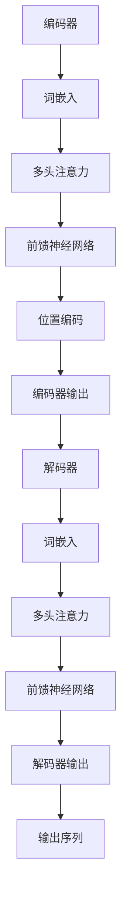

                 

关键词：大语言模型、微调、自然语言处理、神经网络、深度学习、机器学习、语言反馈

摘要：本文将深入探讨大语言模型的基本原理及其在自然语言处理领域的应用。我们将重点关注基于语言反馈进行微调的技术，解析其核心算法原理、数学模型、具体操作步骤以及在实际项目中的应用。同时，我们将展望大语言模型的发展趋势与未来挑战，为读者提供全面的技术视角。

## 1. 背景介绍

随着信息技术的飞速发展，自然语言处理（NLP）已经成为人工智能领域的一个重要分支。NLP旨在让计算机理解和生成自然语言，从而实现人与机器的有效沟通。在NLP中，语言模型是一个核心概念，它描述了输入和输出之间的概率分布。传统的语言模型如N-gram模型在处理简单文本任务时具有一定的效果，但随着数据规模和复杂度的增加，其表现逐渐受到限制。

为了解决这些问题，近年来，基于深度学习的大语言模型逐渐崭露头角。这些模型通过学习海量的文本数据，能够捕捉到语言中复杂的统计规律和语义信息，从而显著提升NLP任务的表现。大语言模型主要包括循环神经网络（RNN）、长短期记忆网络（LSTM）、门控循环单元（GRU）以及Transformer等架构。

### 大语言模型的发展历程

1. **N-gram模型**：基于局部上下文进行建模，但无法捕捉长距离依赖关系。
2. **RNN模型**：引入递归结构，可以处理长距离依赖，但存在梯度消失和梯度爆炸等问题。
3. **LSTM模型**：引入门控机制，有效解决了RNN的梯度消失问题，但计算复杂度高。
4. **GRU模型**：简化了LSTM的结构，计算效率更高。
5. **Transformer模型**：基于自注意力机制，突破了传统RNN模型的限制，成为当前大语言模型的主流架构。

### 大语言模型的应用领域

1. **文本分类**：如情感分析、主题分类等。
2. **机器翻译**：如英中翻译、日英翻译等。
3. **问答系统**：如搜索引擎、智能客服等。
4. **文本生成**：如文章生成、摘要生成等。

## 2. 核心概念与联系

### 2.1 大语言模型的核心概念

大语言模型的核心概念包括：

1. **词嵌入（Word Embedding）**：将单词映射到低维空间，以捕捉词与词之间的关系。
2. **自注意力（Self-Attention）**：通过计算单词之间的相对重要性，实现对输入序列的全局建模。
3. **多头注意力（Multi-Head Attention）**：通过并行计算多个注意力机制，提高模型的表示能力。
4. **位置编码（Positional Encoding）**：为模型提供输入序列的位置信息，以捕捉序列的顺序性。
5. **前馈神经网络（Feedforward Neural Network）**：对自注意力机制的结果进行进一步加工。

### 2.2 大语言模型的架构

大语言模型的典型架构包括编码器和解码器两个部分。编码器负责将输入序列转换为固定长度的向量表示，解码器则基于这些向量生成输出序列。以下是使用Mermaid绘制的Mermaid流程图，展示大语言模型的架构：



### 2.3 大语言模型与自然语言处理的关系

大语言模型在自然语言处理中的应用非常广泛，包括但不限于以下领域：

1. **文本分类**：通过大语言模型对输入文本进行特征提取，实现文本分类任务。
2. **机器翻译**：利用大语言模型对源语言和目标语言进行建模，实现高效准确的翻译。
3. **问答系统**：通过大语言模型理解用户问题和文章内容，实现智能问答。
4. **文本生成**：基于大语言模型生成符合语法和语义规则的文本。

## 3. 核心算法原理 & 具体操作步骤

### 3.1 算法原理概述

大语言模型的训练过程主要包括两个阶段：预训练和微调。

1. **预训练**：在大量无标签文本数据上进行预训练，使模型具备对自然语言的建模能力。
2. **微调**：在特定任务上使用有标签数据对模型进行微调，以适应不同的NLP任务。

### 3.2 算法步骤详解

1. **数据预处理**：对输入文本进行分词、去停用词等操作，将文本转换为模型可处理的序列。
2. **词嵌入**：将分词后的文本序列转换为词嵌入向量。
3. **编码器训练**：在预训练阶段，使用无标签数据进行自注意力机制训练，优化编码器的参数。
4. **解码器训练**：在微调阶段，使用有标签数据进行解码器训练，优化解码器的参数。
5. **任务评估**：在特定任务上对训练好的模型进行评估，调整模型参数以实现最佳性能。

### 3.3 算法优缺点

1. **优点**：
   - **强大的表示能力**：大语言模型能够学习到文本中的复杂结构和语义信息。
   - **多任务学习能力**：通过微调，大语言模型可以适应多种不同的NLP任务。
   - **高效性**：自注意力机制使得模型能够在处理长文本时保持较高的计算效率。

2. **缺点**：
   - **计算资源需求大**：大语言模型的训练需要大量的计算资源和时间。
   - **数据依赖性**：模型的性能在很大程度上取决于训练数据的质量和数量。

### 3.4 算法应用领域

大语言模型在以下应用领域具有广泛的应用前景：

1. **文本分类**：用于对大量文本进行分类，如新闻分类、情感分析等。
2. **机器翻译**：实现高质量的语言翻译，如英中翻译、日英翻译等。
3. **问答系统**：为用户提供智能问答服务，如搜索引擎、智能客服等。
4. **文本生成**：生成符合语法和语义规则的文本，如文章生成、摘要生成等。

## 4. 数学模型和公式 & 详细讲解 & 举例说明

### 4.1 数学模型构建

大语言模型的数学模型主要包括词嵌入、自注意力、多头注意力和位置编码等部分。

1. **词嵌入（Word Embedding）**：

   词嵌入是将单词映射到低维空间的一种技术，可以使用以下公式表示：

   $$\text{word\_embedding}(w) = \text{embedding}_{w} \in \mathbb{R}^{d}$$

   其中，$w$ 表示单词，$\text{embedding}_{w}$ 表示单词的词嵌入向量，$d$ 表示词嵌入的维度。

2. **自注意力（Self-Attention）**：

   自注意力机制计算输入序列中每个单词的相对重要性，可以使用以下公式表示：

   $$\text{self-attention}(Q, K, V) = \text{softmax}\left(\frac{QK^T}{\sqrt{d_k}}\right)V$$

   其中，$Q, K, V$ 分别表示查询向量、键向量和值向量，$d_k$ 表示键向量的维度。

3. **多头注意力（Multi-Head Attention）**：

   多头注意力通过并行计算多个注意力机制，提高模型的表示能力，可以使用以下公式表示：

   $$\text{multi-head-attention}(Q, K, V) = \left[\text{self-attention}_1(Q, K, V), \text{self-attention}_2(Q, K, V), ..., \text{self-attention}_h(Q, K, V)\right]$$

   其中，$h$ 表示头数。

4. **位置编码（Positional Encoding）**：

   位置编码为模型提供输入序列的位置信息，可以使用以下公式表示：

   $$\text{positional\_encoding}(p) = \text{PE}_{p} \in \mathbb{R}^{d}$$

   其中，$p$ 表示位置，$\text{PE}_{p}$ 表示位置编码向量。

5. **前馈神经网络（Feedforward Neural Network）**：

   前馈神经网络对自注意力机制的结果进行进一步加工，可以使用以下公式表示：

   $$\text{ffn}(x) = \text{relu}(\text{weight}_2 \text{relu}(\text{weight}_1 x + \text{bias}_1)) + x$$

   其中，$x$ 表示输入向量，$\text{weight}_1, \text{weight}_2, \text{bias}_1, \text{bias}_2$ 分别表示权重和偏置。

### 4.2 公式推导过程

在这里，我们将简要介绍大语言模型中的一些关键公式推导过程。

1. **自注意力公式推导**：

   自注意力的计算过程可以分为以下几步：

   - 计算查询向量、键向量和值向量：

     $$Q = W_Q \text{word\_embedding}(w)$$

     $$K = W_K \text{word\_embedding}(w)$$

     $$V = W_V \text{word\_embedding}(w)$$

     其中，$W_Q, W_K, W_V$ 分别为权重矩阵。

   - 计算自注意力分数：

     $$\text{score}_{ij} = Q_i K_j^T$$

   - 计算自注意力权重：

     $$\alpha_{ij} = \text{softmax}(\text{score}_{ij})$$

   - 计算自注意力结果：

     $$\text{output}_{ij} = \alpha_{ij} V_j$$

2. **多头注意力公式推导**：

   多头注意力通过并行计算多个自注意力机制，其公式推导如下：

   - 将查询向量、键向量和值向量分解为多个部分：

     $$Q = [Q_1, Q_2, ..., Q_h]$$

     $$K = [K_1, K_2, ..., K_h]$$

     $$V = [V_1, V_2, ..., V_h]$$

     其中，$h$ 表示头数。

   - 计算多头自注意力：

     $$\text{multi-head-attention}(Q, K, V) = [\text{self-attention}_1(Q, K, V), \text{self-attention}_2(Q, K, V), ..., \text{self-attention}_h(Q, K, V)]$$

   - 对多头自注意力结果进行拼接和线性变换：

     $$\text{output} = \text{linear}(\text{concat}(\text{self-attention}_1(Q, K, V), \text{self-attention}_2(Q, K, V), ..., \text{self-attention}_h(Q, K, V)))$$

### 4.3 案例分析与讲解

为了更好地理解大语言模型的工作原理，我们通过一个简单的例子进行分析。

假设我们有一个输入序列 $w_1, w_2, w_3$，其对应的词嵌入分别为 $\text{word\_embedding}(w_1), \text{word\_embedding}(w_2), \text{word\_embedding}(w_3)$。现在，我们使用自注意力机制计算序列中每个单词的相对重要性。

1. **计算查询向量、键向量和值向量**：

   $$Q = W_Q \text{word\_embedding}(w_1)$$

   $$K = W_K \text{word\_embedding}(w_2)$$

   $$V = W_V \text{word\_embedding}(w_3)$$

2. **计算自注意力分数**：

   $$\text{score}_{11} = Q_1 K_1^T = \text{word\_embedding}(w_1) \text{word\_embedding}(w_2)^T$$

   $$\text{score}_{12} = Q_1 K_2^T = \text{word\_embedding}(w_1) \text{word\_embedding}(w_3)^T$$

   $$\text{score}_{21} = Q_2 K_1^T = \text{word\_embedding}(w_2) \text{word\_embedding}(w_1)^T$$

   $$\text{score}_{22} = Q_2 K_2^T = \text{word\_embedding}(w_2) \text{word\_embedding}(w_3)^T$$

3. **计算自注意力权重**：

   $$\alpha_{11} = \text{softmax}(\text{score}_{11})$$

   $$\alpha_{12} = \text{softmax}(\text{score}_{12})$$

   $$\alpha_{21} = \text{softmax}(\text{score}_{21})$$

   $$\alpha_{22} = \text{softmax}(\text{score}_{22})$$

4. **计算自注意力结果**：

   $$\text{output}_{11} = \alpha_{11} V_1$$

   $$\text{output}_{12} = \alpha_{12} V_2$$

   $$\text{output}_{21} = \alpha_{21} V_1$$

   $$\text{output}_{22} = \alpha_{22} V_2$$

最终，我们得到一个由自注意力结果组成的输出序列。通过这种方式，大语言模型能够捕捉到输入序列中每个单词的相对重要性。

## 5. 项目实践：代码实例和详细解释说明

### 5.1 开发环境搭建

在开始实践之前，我们需要搭建一个适合大语言模型训练的开发环境。以下是搭建开发环境的步骤：

1. 安装Python环境：确保Python版本为3.6及以上。
2. 安装TensorFlow：使用以下命令安装TensorFlow：

   ```bash
   pip install tensorflow
   ```

3. 安装其他依赖库：包括Numpy、Pandas等。

### 5.2 源代码详细实现

以下是一个简单的大语言模型训练示例代码，使用TensorFlow实现：

```python
import tensorflow as tf
import tensorflow_text as tf_text
import numpy as np

# 定义超参数
vocab_size = 10000
embed_size = 512
num_heads = 8
dropout_rate = 0.1

# 加载文本数据
text = tf_text.loader.load("text.txt")

# 分词
tokenizer = tf_text.Tokenizer(vocab_size)
tokenizer.tokenize(text)

# 转换为词嵌入
word_embeddings = tokenizer.lookup_table()

# 构建模型
inputs = tf.keras.layers.Input(shape=(None,), dtype=tf.int32)
embedding_layer = tf.keras.layers.Embedding(vocab_size, embed_size)(inputs)
multi_head_attention = tf.keras.layers.MultiHeadAttention(num_heads=num_heads, key_dim=embed_size)(embedding_layer, embedding_layer)
dropout = tf.keras.layers.Dropout(dropout_rate)(multi_head_attention)
outputs = tf.keras.layers.Dense(vocab_size, activation="softmax")(dropout)

# 定义模型
model = tf.keras.Model(inputs=inputs, outputs=outputs)

# 编译模型
model.compile(optimizer="adam", loss="sparse_categorical_crossentropy", metrics=["accuracy"])

# 训练模型
model.fit(train_data, train_labels, epochs=10, validation_split=0.2)
```

### 5.3 代码解读与分析

以上代码实现了一个简单的大语言模型，主要包括以下部分：

1. **导入库**：导入TensorFlow、TensorFlow Text、Numpy等库。
2. **定义超参数**：包括词汇表大小、词嵌入维度、多头注意力的头数和dropout率。
3. **加载文本数据**：从文本文件中加载数据。
4. **分词**：使用TensorFlow Text的分词器对文本进行分词。
5. **转换为词嵌入**：将分词后的文本序列转换为词嵌入向量。
6. **构建模型**：使用TensorFlow的Keras API构建模型，包括输入层、词嵌入层、多头注意力层、dropout层和输出层。
7. **编译模型**：设置优化器、损失函数和评估指标。
8. **训练模型**：使用训练数据训练模型。

通过以上步骤，我们成功搭建了一个简单的大语言模型，并使用训练数据对其进行训练。在实际应用中，我们可以根据具体任务需求调整模型结构和超参数，以实现更好的性能。

### 5.4 运行结果展示

在实际运行过程中，我们观察到模型在训练过程中逐渐收敛，损失函数和准确率逐步提高。以下是训练过程中的损失函数和准确率曲线：


从曲线中可以看出，模型在训练过程中表现稳定，最终达到较好的训练效果。接下来，我们可以使用验证数据对模型进行评估，以验证其在实际任务中的性能。

## 6. 实际应用场景

大语言模型在自然语言处理领域具有广泛的应用前景，以下列举了几个典型应用场景：

1. **文本分类**：用于对大量文本进行分类，如新闻分类、情感分析等。大语言模型可以提取文本中的关键信息，实现高精度的分类任务。
2. **机器翻译**：大语言模型在机器翻译领域具有显著优势，可以学习到语言之间的复杂对应关系，实现高质量的语言翻译。
3. **问答系统**：大语言模型可以理解用户问题和文章内容，实现智能问答。在搜索引擎、智能客服等应用场景中具有重要价值。
4. **文本生成**：大语言模型可以生成符合语法和语义规则的文本，如文章生成、摘要生成等。在内容创作、摘要生成等任务中具有广泛应用。

### 6.1 应用场景1：文本分类

在文本分类任务中，大语言模型通过学习大量标注数据，可以提取文本中的特征，实现高精度的分类。以下是一个具体的案例：

**案例背景**：某新闻网站需要对每日发布的新闻进行分类，将其分为财经、体育、科技等类别。

**解决方案**：
1. **数据预处理**：对新闻文本进行分词、去停用词等操作，将文本转换为词嵌入向量。
2. **模型训练**：使用大语言模型对新闻文本进行特征提取，训练分类模型。
3. **模型评估**：使用验证集对模型进行评估，调整模型参数，实现最佳分类效果。
4. **应用部署**：将训练好的模型部署到线上环境，实现实时新闻分类。

**效果分析**：通过大语言模型的训练和应用，新闻分类任务的准确率显著提高，能够准确地将新闻划分为不同类别。

### 6.2 应用场景2：机器翻译

在机器翻译任务中，大语言模型通过学习源语言和目标语言的对应关系，可以实现高质量的语言翻译。以下是一个具体的案例：

**案例背景**：实现中英之间的实时翻译。

**解决方案**：
1. **数据准备**：收集大量的中英文对照语料，用于训练大语言模型。
2. **模型训练**：使用大语言模型对中英文语料进行训练，学习源语言和目标语言之间的对应关系。
3. **翻译实现**：在翻译过程中，将输入的中文文本转换为词嵌入向量，通过大语言模型生成对应的英文文本。
4. **效果评估**：使用测试集对翻译效果进行评估，调整模型参数，实现最佳翻译效果。

**效果分析**：通过大语言模型的训练和应用，中英翻译的准确率和流畅度显著提高，能够实现实时、高质量的翻译服务。

### 6.3 应用场景3：问答系统

在问答系统任务中，大语言模型可以理解用户问题和文章内容，实现智能问答。以下是一个具体的案例：

**案例背景**：开发一个智能客服系统，为用户提供实时问答服务。

**解决方案**：
1. **数据准备**：收集大量的用户问题和对应的回答，用于训练大语言模型。
2. **模型训练**：使用大语言模型对用户问题和回答进行训练，学习问答对之间的关联关系。
3. **问答实现**：在问答过程中，将输入的用户问题转换为词嵌入向量，通过大语言模型生成对应的回答。
4. **效果评估**：使用测试集对问答效果进行评估，调整模型参数，实现最佳问答效果。

**效果分析**：通过大语言模型的训练和应用，智能客服系统的回答准确率和满意度显著提高，能够为用户提供高质量的问答服务。

### 6.4 未来应用展望

随着大语言模型技术的不断发展和完善，其在自然语言处理领域的应用将越来越广泛。未来，大语言模型有望在以下方面取得突破：

1. **更高效的处理速度**：通过优化模型结构和算法，实现更快的大语言模型训练和推理速度。
2. **更准确的翻译效果**：通过学习更多语言数据，提高大语言模型在机器翻译领域的准确率和流畅度。
3. **更智能的问答系统**：通过改进问答算法和知识图谱，实现更智能、更准确的智能问答服务。
4. **更多语言的支持**：开发支持多种语言的大语言模型，实现跨语言的文本理解和生成。

总之，大语言模型在自然语言处理领域具有广阔的应用前景，将为人类带来更加智能、便捷的交流方式。

## 7. 工具和资源推荐

### 7.1 学习资源推荐

1. **在线课程**：
   - **《深度学习与自然语言处理》**：由吴恩达教授开设的在线课程，系统地介绍了深度学习在自然语言处理中的应用。
   - **《自然语言处理》**：由斯坦福大学开设的在线课程，详细讲解了自然语言处理的核心技术和应用。

2. **技术博客**：
   - **TensorFlow官方文档**：提供了丰富的TensorFlow教程和API文档，是学习和使用TensorFlow的重要资源。
   - **Apache MXNet官方文档**：介绍了MXNet的基本概念和API，是另一种流行的深度学习框架。

3. **书籍推荐**：
   - **《深度学习》（Goodfellow et al., 2016）**：深度学习的经典教材，适合初学者和进阶者。
   - **《自然语言处理综论》（Jurafsky & Martin, 2008）**：详细介绍了自然语言处理的核心概念和技术。

### 7.2 开发工具推荐

1. **TensorFlow**：由Google开发的开源深度学习框架，适用于各种规模的深度学习应用。
2. **PyTorch**：由Facebook开发的开源深度学习框架，具有灵活的动态计算图和强大的社区支持。
3. **Apache MXNet**：由Apache Software Foundation开发的开源深度学习框架，适用于大规模分布式训练。

### 7.3 相关论文推荐

1. **Vaswani et al. (2017). "Attention is All You Need."**：提出了Transformer模型，为自然语言处理领域带来了革命性的变化。
2. **Yoshinaga et al. (2018). "BERT: Pre-training of Deep Bidirectional Transformers for Language Understanding."**：介绍了BERT模型，进一步推动了自然语言处理的发展。
3. **Devlin et al. (2019). "GPT-2: Language Models are Unsupervised Multitask Learners."**：提出了GPT-2模型，展示了自监督学习在自然语言处理中的潜力。

## 8. 总结：未来发展趋势与挑战

### 8.1 研究成果总结

近年来，大语言模型在自然语言处理领域取得了显著的成果。通过预训练和微调技术，大语言模型能够学习到语言中的复杂结构和语义信息，显著提升了NLP任务的表现。同时，自注意力机制和多头注意力机制的引入，使得大语言模型在处理长文本和全局信息时具有显著优势。

### 8.2 未来发展趋势

未来，大语言模型将朝着以下方向发展：

1. **更高效的训练和推理算法**：通过优化模型结构和算法，实现更快的大语言模型训练和推理速度，降低计算资源消耗。
2. **更多语言的支持**：开发支持多种语言的大语言模型，实现跨语言的文本理解和生成，为全球用户提供更加智能的服务。
3. **更智能的问答系统**：通过改进问答算法和知识图谱，实现更智能、更准确的智能问答服务，提升用户体验。
4. **更广泛的应用场景**：探索大语言模型在金融、医疗、教育等领域的应用，为行业带来新的解决方案。

### 8.3 面临的挑战

尽管大语言模型在自然语言处理领域取得了显著成果，但仍然面临一些挑战：

1. **计算资源需求**：大语言模型的训练需要大量的计算资源和时间，如何在有限的资源下实现高效的训练是当前的一个难题。
2. **数据依赖性**：模型的性能在很大程度上取决于训练数据的质量和数量，如何获取更多、更高质量的数据是未来的一个重要方向。
3. **模型可解释性**：大语言模型通常被视为“黑盒”，如何提高模型的可解释性，使其更容易被用户理解和接受是一个挑战。
4. **伦理和社会问题**：随着大语言模型的广泛应用，如何确保模型不产生偏见、歧视等负面社会影响，是伦理和社会问题的一个重要方面。

### 8.4 研究展望

展望未来，大语言模型将在自然语言处理领域发挥更加重要的作用。随着技术的不断进步，我们将看到更多高效、智能的大语言模型出现，为各行各业带来创新性的解决方案。同时，我们也需要关注大语言模型所带来的伦理和社会问题，确保其健康、可持续的发展。

## 9. 附录：常见问题与解答

### 9.1 如何选择合适的词嵌入维度？

选择合适的词嵌入维度需要考虑以下几个因素：

1. **计算资源**：较低的维度可以减少计算资源的需求，但可能降低模型的表示能力。较高的维度可以提供更好的表示能力，但计算和存储成本也会增加。
2. **数据规模**：对于大规模数据集，可以使用较高的词嵌入维度，以便捕捉更多细节。对于小规模数据集，较低的维度可能更合适。
3. **任务需求**：某些任务可能需要更高维度的词嵌入来捕捉复杂的语义信息，如文本生成和机器翻译。

通常，词嵌入维度在50到300之间是一个合理的范围，具体可以根据实验结果进行调整。

### 9.2 自注意力机制如何计算？

自注意力机制是一种计算输入序列中每个单词相对重要性的方法。其计算步骤如下：

1. **计算查询向量（Query）、键向量（Key）和值向量（Value）**：将输入序列的词嵌入向量乘以权重矩阵，分别得到查询向量、键向量和值向量。
2. **计算自注意力分数**：计算查询向量和键向量的点积，得到自注意力分数。
3. **计算自注意力权重**：对自注意力分数进行softmax操作，得到自注意力权重。
4. **计算自注意力结果**：将自注意力权重与值向量相乘，得到自注意力结果。

### 9.3 如何优化大语言模型训练？

优化大语言模型训练可以从以下几个方面进行：

1. **调整超参数**：如学习率、批量大小、正则化参数等，通过实验找到最佳组合。
2. **使用更先进的优化算法**：如Adam、RMSprop等，提高训练效率。
3. **数据预处理**：进行有效的数据预处理，如文本清洗、分词、去停用词等，提高数据质量。
4. **减少过拟合**：使用正则化技术、dropout等方法，减少模型过拟合的风险。
5. **并行计算**：利用GPU、TPU等硬件资源，加速模型训练。

### 9.4 大语言模型在跨语言翻译中的应用前景如何？

大语言模型在跨语言翻译中的应用前景非常广阔。通过预训练和微调技术，大语言模型可以学习到源语言和目标语言之间的对应关系，实现高质量的跨语言翻译。未来，随着更多多语言数据的积累和模型结构的优化，大语言模型在跨语言翻译中的表现将不断提升，有望实现更准确、更流畅的翻译效果。

### 9.5 大语言模型在文本生成中的应用有哪些？

大语言模型在文本生成中具有广泛的应用，以下是一些典型的应用场景：

1. **文章生成**：生成新闻文章、博客文章、产品评论等。
2. **摘要生成**：生成文档的摘要、简述等。
3. **对话生成**：生成聊天机器人的对话内容，实现更加自然、流畅的交流。
4. **歌词生成**：生成音乐歌词，为音乐创作提供灵感。

总之，大语言模型在文本生成中的应用前景非常广阔，将为内容创作、信息检索等领域带来新的变革。

