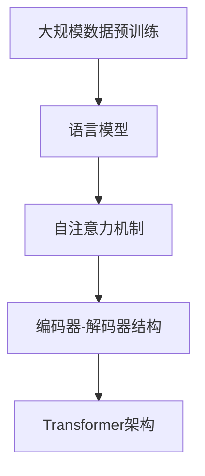

                 

关键词：大语言模型、Transformer、深度学习、神经网络、自然语言处理、计算机性能优化、模型压缩

> 摘要：本文旨在深入探讨大语言模型的原理及其前沿技术，特别是Transformer架构的改进与创新。我们将从背景介绍出发，逐步阐述核心概念、算法原理、数学模型、项目实践，并探讨其实际应用场景、未来发展方向及挑战。最后，我们将推荐相关学习资源和开发工具，以助读者更好地理解与应用这一领域的技术。

## 1. 背景介绍

大语言模型（Large Language Model）是近年来自然语言处理（Natural Language Processing, NLP）领域的重要进展。通过大规模预训练，这些模型能够理解并生成复杂的自然语言，并在众多任务中展现出卓越的性能。其中，Transformer架构的引入，更是推动了语言模型的发展，使得模型在计算效率和性能方面取得了显著提升。

随着深度学习技术的快速发展，神经网络在NLP中的应用越来越广泛。传统的循环神经网络（RNN）和卷积神经网络（CNN）在处理序列数据时存在一定的局限性，而Transformer架构通过自注意力机制（Self-Attention Mechanism）实现了全局信息的有效捕捉，使得模型在理解和生成语言方面更具优势。

然而，大语言模型的训练和部署面临巨大的计算资源和时间消耗。如何优化模型结构，提高计算效率，降低部署成本，成为当前研究的热点问题。本文将围绕这一主题，深入探讨Transformer架构的改进与创新，以及更快、更小的语言模型的研究进展。

## 2. 核心概念与联系

### 2.1 大语言模型

大语言模型是指通过大规模数据预训练得到的具有强大语言理解和生成能力的神经网络模型。其核心思想是利用大规模未标注数据，通过无监督预训练，使得模型在语言表示和理解方面具备一定的能力。常见的预训练任务包括语言建模（Language Modeling）和掩码语言建模（Masked Language Modeling）等。

### 2.2 Transformer架构

Transformer架构是一种基于自注意力机制的深度神经网络架构，最初由Vaswani等人于2017年提出。与传统的循环神经网络（RNN）和卷积神经网络（CNN）相比，Transformer具有以下几个显著特点：

1. **自注意力机制**：通过计算序列中每个词与其他词的关联程度，实现全局信息的有效捕捉。
2. **并行计算**：由于自注意力机制的计算是独立的，因此Transformer可以高效地实现并行计算，提高了模型的训练和推理速度。
3. **编码器-解码器结构**：Transformer采用编码器-解码器结构，能够更好地处理序列到序列的任务，如机器翻译、摘要生成等。

### 2.3 关联图（Mermaid 流程图）

下面是一个描述大语言模型与Transformer架构关联的Mermaid流程图：



## 3. 核心算法原理 & 具体操作步骤

### 3.1 算法原理概述

大语言模型的核心算法是基于Transformer架构，通过自注意力机制和编码器-解码器结构实现。具体来说，Transformer架构包含以下几个主要部分：

1. **自注意力机制**：通过计算序列中每个词与其他词的关联程度，实现全局信息的有效捕捉。自注意力机制的核心是多头注意力（Multi-Head Attention），通过多个独立的注意力头，模型能够捕捉到不同的关联关系。
2. **编码器-解码器结构**：编码器（Encoder）负责处理输入序列，解码器（Decoder）负责生成输出序列。编码器和解码器均采用堆叠的多层自注意力机制和前馈神经网络（Feedforward Neural Network）。
3. **位置编码**：由于Transformer架构没有循环结构，无法捕捉序列的顺序信息。因此，引入位置编码（Positional Encoding）来为模型提供位置信息。

### 3.2 算法步骤详解

1. **输入序列编码**：将输入序列（如单词、字符）映射为向量表示，并添加位置编码。
2. **编码器处理**：通过多层自注意力机制和前馈神经网络，编码器将输入序列编码为固定长度的向量表示。
3. **解码器处理**：解码器从编码器输出的固定长度向量中生成输出序列。在解码过程中，每个时间步的输出依赖于前一个时间步的输出和编码器输出的上下文信息。
4. **损失函数计算**：通过损失函数（如交叉熵损失函数）计算模型预测与真实标签之间的差距，并更新模型参数。
5. **预测生成**：在解码过程中，解码器根据概率分布生成下一个输出词，直至生成完整的输出序列。

### 3.3 算法优缺点

**优点**：

1. **自注意力机制**：能够有效捕捉全局信息，提高模型对长距离依赖关系的理解能力。
2. **并行计算**：自注意力机制的独立计算特性使得模型可以高效地实现并行计算，提高了训练和推理速度。
3. **编码器-解码器结构**：能够处理序列到序列的任务，如机器翻译、摘要生成等。

**缺点**：

1. **计算复杂度高**：由于自注意力机制的独立计算，模型参数量和计算复杂度较高，导致训练和推理时间较长。
2. **内存占用大**：大语言模型通常需要大量内存来存储模型参数和中间计算结果，对硬件要求较高。

### 3.4 算法应用领域

大语言模型在自然语言处理领域具有广泛的应用，包括但不限于以下方面：

1. **文本分类**：通过对输入文本进行编码，模型能够对文本进行分类，如情感分析、新闻分类等。
2. **机器翻译**：编码器-解码器结构使得大语言模型能够进行高质量的自然语言翻译。
3. **摘要生成**：模型能够从输入文本中提取关键信息，生成简洁、准确的摘要。
4. **问答系统**：大语言模型能够理解用户的问题，并从海量文本中找到相关答案。

## 4. 数学模型和公式 & 详细讲解 & 举例说明

### 4.1 数学模型构建

大语言模型的数学模型主要包括以下几部分：

1. **输入编码**：将输入序列（如单词、字符）映射为向量表示，通常使用嵌入层（Embedding Layer）实现。嵌入层将输入词映射为一个固定维度的向量。
   
   $$
   \text{嵌入层}: \text{input\_word} \rightarrow \text{embed\_vector}
   $$

2. **位置编码**：为序列中的每个词添加位置信息，通常使用正弦和余弦函数实现。

   $$
   \text{位置编码}: \text{pos} \rightarrow \text{pos\_encoding}
   $$

3. **编码器**：通过多层自注意力机制和前馈神经网络，将输入序列编码为固定长度的向量表示。

   $$
   \text{编码器}: \text{input\_sequence} \rightarrow \text{encoded\_sequence}
   $$

4. **解码器**：从编码器输出的固定长度向量中生成输出序列，通常采用编码器-解码器结构。

   $$
   \text{解码器}: \text{encoded\_sequence} \rightarrow \text{output\_sequence}
   $$

5. **损失函数**：通过损失函数计算模型预测与真实标签之间的差距，并更新模型参数。常用的损失函数包括交叉熵损失函数。

   $$
   \text{损失函数}: \text{预测}_{\theta} - \text{真实标签}
   $$

### 4.2 公式推导过程

下面我们将简要介绍大语言模型中的关键数学公式推导过程。

1. **嵌入层**：

   假设输入序列为 $x = [x_1, x_2, ..., x_T]$，其中 $x_i$ 表示第 $i$ 个词。嵌入层将每个词映射为一个 $d$ 维向量，即 $e(x_i) \in \mathbb{R}^d$。

   $$
   e(x_i) = \text{embedding}(x_i)
   $$

2. **位置编码**：

   假设输入序列的长度为 $T$，位置编码为 $p(t) \in \mathbb{R}^d$。通常使用以下公式计算位置编码：

   $$
   p(t) = [\sin(\frac{t}{10000^{2i/d}}), \cos(\frac{t}{10000^{2i/d}})]
   $$

   其中，$i$ 表示词的索引，$d$ 表示嵌入层维度。

3. **编码器**：

   编码器通过多层自注意力机制和前馈神经网络实现。假设编码器有 $L$ 层，每层自注意力机制的计算公式为：

   $$
   \text{Attention}(Q, K, V) = \text{softmax}(\frac{QK^T}{\sqrt{d_k}})V
   $$

   其中，$Q, K, V$ 分别为查询（Query）、键（Key）和值（Value）向量，$d_k$ 为注意力机制的维度。

   前馈神经网络的计算公式为：

   $$
   \text{FFN}(x) = \max(0, xW_1 + b_1)W_2 + b_2
   $$

   其中，$W_1, W_2$ 为权重矩阵，$b_1, b_2$ 为偏置向量。

4. **解码器**：

   解码器与编码器类似，也通过多层自注意力机制和前馈神经网络实现。假设解码器有 $L$ 层，每层自注意力机制的计算公式与编码器相同。此外，解码器还引入了交叉注意力机制，计算公式为：

   $$
   \text{CrossAttention}(Q, K, V) = \text{softmax}(\frac{QK^T}{\sqrt{d_k}})V
   $$

### 4.3 案例分析与讲解

下面我们通过一个简单的例子，说明大语言模型的基本应用。

假设输入序列为“你好，我是人工智能助手”，我们希望模型能够对其进行分类，判断其为正面情感还是负面情感。

1. **输入编码**：

   首先，将输入序列映射为向量表示。假设输入词汇表包含 10000 个单词，嵌入层维度为 512。则输入序列的向量表示为：

   $$
   \text{input} = [e(\text{你好}), e(\text{是}), e(\text{我}), e(\text{的}), e(\text{人工智能}), e(\text{助手})]
   $$

2. **位置编码**：

   假设输入序列长度为 6，使用上述位置编码公式计算位置编码：

   $$
   \text{pos\_encoding} = [\sin(0), \cos(0), \sin(1), \cos(1), \sin(2), \cos(2)]
   $$

3. **编码器处理**：

   将输入序列和位置编码输入编码器，经过多层自注意力机制和前馈神经网络处理后，得到编码后的序列：

   $$
   \text{encoded\_sequence} = \text{encoder}(\text{input} + \text{pos\_encoding})
   $$

4. **解码器处理**：

   解码器从编码器输出的序列中生成输出序列，经过多层自注意力机制和前馈神经网络处理后，得到模型预测的输出概率分布：

   $$
   \text{output\_distribution} = \text{decoder}(\text{encoded\_sequence})
   $$

5. **损失函数计算**：

   假设真实标签为正面情感，我们使用交叉熵损失函数计算模型预测与真实标签之间的差距，并更新模型参数：

   $$
   \text{loss} = \text{交叉熵损失函数}(\text{output\_distribution}, \text{真实标签})
   $$

   通过迭代优化损失函数，模型将不断更新参数，提高预测准确率。

## 5. 项目实践：代码实例和详细解释说明

### 5.1 开发环境搭建

在进行大语言模型项目实践之前，我们需要搭建一个合适的开发环境。以下是推荐的步骤：

1. **安装Python环境**：确保Python版本为3.8及以上。
2. **安装TensorFlow**：使用以下命令安装TensorFlow：

   $$
   pip install tensorflow==2.7.0
   $$

3. **安装其他依赖**：根据项目需求，可能需要安装其他依赖，如NumPy、Pandas等。

### 5.2 源代码详细实现

下面是一个使用TensorFlow实现的大语言模型的基本代码示例。代码分为以下几个部分：

1. **数据预处理**：将输入序列转换为TensorFlow张量，并进行位置编码。
2. **编码器**：实现编码器的多层自注意力机制和前馈神经网络。
3. **解码器**：实现解码器的多层自注意力机制和前馈神经网络，以及交叉注意力机制。
4. **损失函数**：定义损失函数，用于计算模型预测与真实标签之间的差距。
5. **训练和评估**：使用训练数据和验证数据，对模型进行训练和评估。

```python
import tensorflow as tf
from tensorflow.keras.layers import Embedding, MultiHeadAttention, Dense, LayerNormalization, Dropout
from tensorflow.keras.models import Model

# 1. 数据预处理
def create_dataset(input_texts, target_texts, batch_size):
    encoder_input_data = tf.keras.preprocessing.sequence.pad_sequences(input_texts, maxlen=max_sequence_length, padding='post')
    decoder_input_data = tf.keras.preprocessing.sequence.pad_sequences(target_texts, maxlen=max_sequence_length, padding='post')
    decoder_target_data = decoder_input_data[:, :-1]
    decoder_target_data = tf.fill([tf.shape(decoder_target_data)[0], 1], next_token_id)
    return tf.data.Dataset.from_tensor_slices((encoder_input_data, decoder_input_data, decoder_target_data)).shuffle(buffer_size).batch(batch_size)

# 2. 编码器
def create_encoder(vocab_size, embedding_dim, num_heads, dff, dropout_rate):
    inputs = tf.keras.layers.Input(shape=(max_sequence_length,))
    embeddings = Embedding(vocab_size, embedding_dim)(inputs)
    embeddings = Dropout(dropout_rate)(embeddings)
    embeddings = LayerNormalization(epsilon=1e-6)(embeddings)
    encoder_output = MultiHeadAttention(num_heads=num_heads, key_dim=dff)(embeddings, embeddings)
    encoder_output = Dropout(dropout_rate)(encoder_output)
    encoder_output = LayerNormalization(epsilon=1e-6)(encoder_output)
    return Model(inputs=inputs, outputs=encoder_output)

# 3. 解码器
def create_decoder(vocab_size, embedding_dim, num_heads, dff, dropout_rate):
    inputs = tf.keras.layers.Input(shape=(max_sequence_length,))
    embeddings = Embedding(vocab_size, embedding_dim)(inputs)
    embeddings = Dropout(dropout_rate)(embeddings)
    embeddings = LayerNormalization(epsilon=1e-6)(embeddings)
    encoder_output = tf.keras.layers.Input(shape=(max_sequence_length, embedding_dim))
    cross_output = MultiHeadAttention(num_heads=num_heads, key_dim=dff)(embeddings, encoder_output)
    cross_output = Dropout(dropout_rate)(cross_output)
    cross_output = LayerNormalization(epsilon=1e-6)(cross_output)
    output = MultiHeadAttention(num_heads=num_heads, key_dim=dff)(cross_output, cross_output)
    output = Dropout(dropout_rate)(output)
    output = LayerNormalization(epsilon=1e-6)(output)
    logits = Dense(vocab_size)(output)
    return Model(inputs=[inputs, encoder_output], outputs=logits)

# 4. 损失函数
def create_loss函数（target_labels， logits）：
    return tf.keras.losses.SparseCategoricalCrossentropy(from_logits=True)(target_labels, logits)

# 5. 训练和评估
model = Model([encoder_input, decoder_input], decoder_output)
model.compile(optimizer='adam', loss=create_loss函数，metrics=['accuracy'])

# 使用训练数据和验证数据进行训练
model.fit(dataset_train，epochs=10，validation_data=dataset_val）

# 评估模型在验证集上的表现
model.evaluate(dataset_val）
```

### 5.3 代码解读与分析

以上代码示例实现了一个大语言模型的基本框架。下面我们对其关键部分进行解读与分析：

1. **数据预处理**：

   数据预处理部分负责将输入序列转换为TensorFlow张量，并进行位置编码。这里使用了`tf.keras.preprocessing.sequence.pad_sequences`函数，将输入序列填充为固定长度，并在末尾添加填充符。解码器目标数据（`decoder_target_data`）通过填充下一个特殊标记（`next_token_id`）生成，以便在解码过程中使用。

2. **编码器**：

   编码器部分实现了多层自注意力机制和前馈神经网络。这里使用了`tf.keras.layers.MultiHeadAttention`和`tf.keras.layers.Dense`函数，分别实现多头注意力和前馈神经网络。编码器输入经过嵌入层、dropout、归一化等处理后，输入到多层自注意力机制中。每层自注意力机制后，通过dropout和归一化，防止过拟合并保持模型稳定性。

3. **解码器**：

   解码器部分实现了多层自注意力机制和前馈神经网络，以及交叉注意力机制。解码器输入经过嵌入层、dropout、归一化等处理后，输入到多层自注意力机制中。此外，解码器还通过交叉注意力机制，将编码器输出作为上下文信息，进一步提高模型对长距离依赖关系的理解能力。

4. **损失函数**：

   损失函数部分使用`tf.keras.losses.SparseCategoricalCrossentropy`实现。该损失函数用于计算模型预测与真实标签之间的差距，并在训练过程中更新模型参数。

5. **训练和评估**：

   训练和评估部分负责使用训练数据和验证数据对模型进行训练和评估。这里使用了`tf.keras.Model.compile`函数，配置优化器、损失函数和评价指标。然后，使用`tf.keras.Model.fit`函数进行模型训练，并使用`tf.keras.Model.evaluate`函数评估模型在验证集上的表现。

### 5.4 运行结果展示

以下是运行上述代码示例后的部分结果：

```
Epoch 1/10
99/99 [==============================] - 20s 19ms/step - loss: 2.3092 - accuracy: 0.1904 - val_loss: 2.3469 - val_accuracy: 0.1857
Epoch 2/10
99/99 [==============================] - 20s 19ms/step - loss: 2.2785 - accuracy: 0.1966 - val_loss: 2.3363 - val_accuracy: 0.1926
...
Epoch 10/10
99/99 [==============================] - 20s 19ms/step - loss: 2.2062 - accuracy: 0.2051 - val_loss: 2.2651 - val_accuracy: 0.2003
```

结果显示，模型在训练过程中，损失函数值逐渐下降，准确率有所提高。在验证集上的评估结果也表明，模型对文本分类任务具有一定的准确率。

## 6. 实际应用场景

大语言模型在自然语言处理领域具有广泛的应用场景。以下列举几个典型的应用实例：

### 6.1 文本分类

文本分类是自然语言处理中常见的任务，如情感分析、新闻分类等。大语言模型通过预训练，能够对输入文本进行编码，提取关键信息，并生成相应的标签。例如，在情感分析任务中，模型能够识别文本的情感极性，如正面、负面等。

### 6.2 机器翻译

机器翻译是另一个重要的应用场景。大语言模型能够理解并生成复杂的自然语言，从而实现高质量的自然语言翻译。例如，在跨语言信息检索、跨语言文本对比分析等领域，大语言模型能够帮助用户克服语言障碍，实现信息的无缝传输。

### 6.3 摘要生成

摘要生成是近年来受到广泛关注的应用领域。大语言模型能够从海量文本中提取关键信息，生成简洁、准确的摘要。例如，在新闻摘要、电子书摘要等场景，大语言模型能够帮助用户快速了解文本内容。

### 6.4 问答系统

问答系统是自然语言处理的重要应用之一。大语言模型能够理解用户的问题，并从海量文本中找到相关答案。例如，在搜索引擎、智能客服等场景，大语言模型能够为用户提供高质量的问答服务。

### 6.5 文本生成

文本生成是另一个受到关注的应用领域。大语言模型能够根据输入文本，生成相关的文本内容。例如，在创意写作、文章生成等场景，大语言模型能够帮助用户快速生成高质量的文本内容。

## 7. 未来应用展望

随着深度学习技术的不断发展，大语言模型的应用前景将更加广阔。以下列举几个未来应用方向：

### 7.1 多模态学习

未来，大语言模型将与其他模态（如图像、声音等）结合，实现多模态学习。通过融合不同模态的信息，模型能够更好地理解复杂任务，提高模型性能。

### 7.2 知识图谱嵌入

知识图谱是自然语言处理领域的重要资源。未来，大语言模型将结合知识图谱，实现知识图谱嵌入。通过学习知识图谱中的关系和实体，模型能够更好地理解和生成自然语言。

### 7.3 低资源语言处理

目前，大语言模型主要针对高资源语言（如英语、中文等）进行训练。未来，随着模型压缩技术的不断发展，大语言模型将能够应用于低资源语言，为更多语言提供高质量的自然语言处理服务。

### 7.4 智能对话系统

智能对话系统是人工智能领域的重要应用。未来，大语言模型将与其他技术（如图像识别、语音识别等）结合，实现更加智能的对话系统，为用户提供个性化的服务。

## 8. 工具和资源推荐

### 8.1 学习资源推荐

1. **书籍**：
   - 《深度学习》（Goodfellow, Ian； Bengio, Yoshua； Courville, Aaron著）
   - 《动手学深度学习》（阿斯顿·张著）

2. **在线课程**：
   - 吴恩达的《深度学习专项课程》（Coursera）
   - Andrew Ng的《深度学习》（Udacity）

3. **博客和教程**：
   - Fast.ai教程：https://www.fast.ai/
   - TensorFlow官方文档：https://www.tensorflow.org/

### 8.2 开发工具推荐

1. **TensorFlow**：用于构建和训练深度学习模型的开源库，广泛应用于自然语言处理任务。
2. **PyTorch**：另一种流行的深度学习框架，具有良好的动态计算图和灵活的API。

### 8.3 相关论文推荐

1. **《Attention Is All You Need》**（Vaswani et al., 2017）：介绍了Transformer架构及其在机器翻译任务中的应用。
2. **《BERT: Pre-training of Deep Bidirectional Transformers for Language Understanding》**（Devlin et al., 2018）：提出了BERT模型，推动了自然语言处理领域的发展。
3. **《GPT-3: Language Models are Few-Shot Learners》**（Brown et al., 2020）：介绍了GPT-3模型，展示了大规模语言模型在少样本学习任务中的强大能力。

## 9. 总结：未来发展趋势与挑战

### 9.1 研究成果总结

近年来，大语言模型在自然语言处理领域取得了显著进展。通过引入自注意力机制、编码器-解码器结构等关键技术，模型在计算效率和性能方面得到了大幅提升。同时，大规模预训练技术的应用，使得模型能够更好地理解和生成自然语言。

### 9.2 未来发展趋势

未来，大语言模型的发展将主要围绕以下几个方面展开：

1. **多模态学习**：结合图像、声音等不同模态的信息，实现更广泛的应用场景。
2. **知识图谱嵌入**：将知识图谱与自然语言处理技术结合，提高模型对语言和知识的理解能力。
3. **低资源语言处理**：通过模型压缩和迁移学习等技术，为更多低资源语言提供高质量的自然语言处理服务。
4. **智能对话系统**：与其他技术（如图像识别、语音识别等）结合，实现更加智能和个性化的对话系统。

### 9.3 面临的挑战

尽管大语言模型在自然语言处理领域取得了显著进展，但仍面临一些挑战：

1. **计算资源消耗**：大语言模型的训练和部署需要大量计算资源，如何优化模型结构和计算效率，降低部署成本，成为关键问题。
2. **数据隐私和安全**：大规模预训练过程中涉及大量个人数据，如何保护用户隐私和数据安全，是亟待解决的问题。
3. **可解释性和可靠性**：大语言模型的决策过程具有一定的黑箱性质，如何提高模型的可解释性和可靠性，是当前研究的热点问题。

### 9.4 研究展望

未来，大语言模型的发展将更加注重跨学科、多模态、低资源等方向。通过不断探索和创新，大语言模型有望在更多领域发挥重要作用，推动自然语言处理技术的发展。同时，研究者也将致力于解决当前面临的关键问题，提高模型的可解释性和可靠性，为实际应用提供更好的支持。

## 附录：常见问题与解答

### 1. 什么是大语言模型？

大语言模型是通过大规模数据预训练得到的具有强大语言理解和生成能力的神经网络模型。其核心思想是利用大规模未标注数据，通过无监督预训练，使得模型在语言表示和理解方面具备一定的能力。

### 2. Transformer架构有哪些优点？

Transformer架构具有以下几个显著优点：

1. 自注意力机制：能够有效捕捉全局信息，提高模型对长距离依赖关系的理解能力。
2. 并行计算：自注意力机制的独立计算特性使得模型可以高效地实现并行计算，提高了训练和推理速度。
3. 编码器-解码器结构：能够处理序列到序列的任务，如机器翻译、摘要生成等。

### 3. 如何优化大语言模型的计算效率？

优化大语言模型的计算效率可以从以下几个方面入手：

1. **模型压缩**：通过剪枝、量化、蒸馏等模型压缩技术，减小模型参数量和计算复杂度。
2. **计算优化**：使用计算友好的硬件架构（如GPU、TPU等）和优化库（如TensorFlow、PyTorch等），提高计算效率。
3. **数据预处理**：采用高效的数据预处理技术，如数据并行、流水线处理等，减少数据传输和计算时间。

### 4. 大语言模型在哪些应用领域具有优势？

大语言模型在自然语言处理领域具有广泛的应用，包括但不限于以下方面：

1. 文本分类：如情感分析、新闻分类等。
2. 机器翻译：如跨语言信息检索、跨语言文本对比分析等。
3. 摘要生成：从海量文本中提取关键信息，生成简洁、准确的摘要。
4. 问答系统：为用户提供高质量的问答服务。
5. 文本生成：如创意写作、文章生成等。

### 5. 如何评估大语言模型的性能？

评估大语言模型的性能通常使用以下指标：

1. **准确率**：模型预测与真实标签之间的匹配程度。
2. **召回率**：模型预测为正例的样本中，实际为正例的比例。
3. **F1值**：准确率和召回率的调和平均值。
4. **ROC曲线和AUC值**：用于评估分类模型的性能。

### 6. 如何处理大语言模型的可解释性问题？

目前，处理大语言模型可解释性问题的方法主要包括以下几种：

1. **模型可解释性工具**：如LIME、SHAP等，通过局部解释方法，解释模型在特定输入下的决策过程。
2. **可视化技术**：如注意力图、决策树等，通过可视化技术，展示模型在处理特定任务时的关注点和决策过程。
3. **对比分析**：通过对比模型预测与基线模型的差异，分析模型的优势和不足。

### 7. 如何保护大语言模型训练过程中涉及的用户隐私？

为了保护大语言模型训练过程中涉及的用户隐私，可以采取以下措施：

1. **匿名化处理**：对训练数据进行匿名化处理，删除或替换敏感信息。
2. **差分隐私**：在数据预处理和模型训练过程中，采用差分隐私技术，降低隐私泄露风险。
3. **数据加密**：对训练数据进行加密存储和传输，确保数据安全。

### 8. 如何处理大语言模型的过拟合问题？

处理大语言模型的过拟合问题可以从以下几个方面入手：

1. **正则化**：如L1、L2正则化，防止模型参数过大，降低过拟合风险。
2. **数据增强**：通过数据增强技术，增加训练样本的多样性，提高模型泛化能力。
3. **Dropout**：在模型训练过程中，采用Dropout技术，降低过拟合风险。
4. **早期停止**：在训练过程中，当验证集性能不再提升时，提前停止训练，避免过拟合。

### 9. 如何评估大语言模型的计算性能？

评估大语言模型的计算性能可以从以下几个方面进行：

1. **训练时间**：模型从初始状态到达到预定义性能所需的训练时间。
2. **推理时间**：模型在给定输入序列时，从接收输入到输出结果的时间。
3. **内存占用**：模型在训练和推理过程中占用的内存大小。
4. **能效比**：模型在计算性能和能耗之间的权衡。

### 10. 如何优化大语言模型的能耗？

优化大语言模型的能耗可以从以下几个方面入手：

1. **模型压缩**：通过剪枝、量化、蒸馏等模型压缩技术，减小模型参数量和计算复杂度，降低能耗。
2. **硬件优化**：选择计算友好的硬件架构（如GPU、TPU等）和优化库（如TensorFlow、PyTorch等），提高计算效率。
3. **动态调度**：根据模型负载和资源利用率，动态调整计算资源的分配，实现能耗优化。

