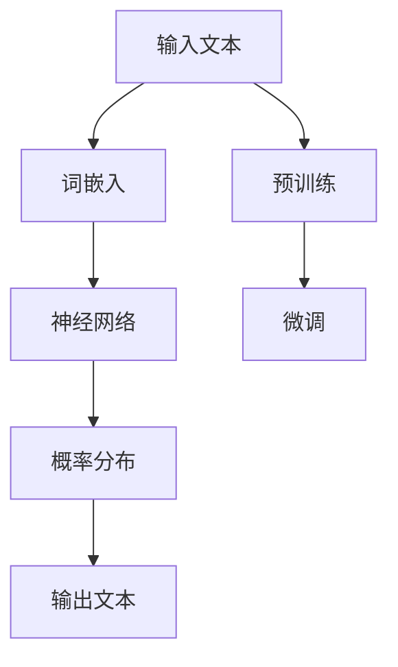

                 

关键词：大语言模型，原理，基础，前沿，上下文，人工智能，机器学习，深度学习，神经网络，自然语言处理，计算语言学

摘要：本文将深入探讨大语言模型的原理基础与前沿发展。通过对大语言模型的定义、架构、核心算法、数学模型、应用实践等方面的详细解析，旨在为读者提供一个全面且系统的了解。本文还对未来发展趋势和挑战进行了展望，并推荐了相关学习资源和开发工具。

## 1. 背景介绍

大语言模型是一种先进的自然语言处理技术，通过深度学习算法从大量文本数据中学习语言规律，生成高质量的文本。随着计算能力的提升和数据的爆发增长，大语言模型的研究和应用领域不断扩展，已成为人工智能领域的重要研究方向。

### 大语言模型的发展历程

大语言模型的发展可以分为几个阶段：

1. **早期语言模型**：20世纪80年代，基于统计方法和规则的方法被用来构建语言模型，如N-Gram模型。
2. **基于神经网络的模型**：2000年后，随着深度学习的兴起，神经网络开始应用于语言模型，如HMM（隐马尔可夫模型）和CRF（条件随机场）。
3. **大型预训练模型**：近年来，随着GPU等硬件的普及和大数据的处理能力提升，大型预训练模型如BERT、GPT等取得了显著突破。

### 大语言模型的应用领域

大语言模型在多个领域都有广泛应用：

1. **文本生成**：自动生成文章、新闻、对话等。
2. **机器翻译**：实现不同语言之间的准确翻译。
3. **问答系统**：为用户提供智能问答服务。
4. **文本分类**：对大量文本进行分类，如垃圾邮件过滤、情感分析等。
5. **语音识别**：将语音信号转换为文本。

## 2. 核心概念与联系

大语言模型的构建涉及到多个核心概念和联系，以下是简要的描述及其Mermaid流程图：



### 2.1 词嵌入（Word Embedding）

词嵌入是将词汇映射为高维向量表示的过程，常见的词嵌入方法有Word2Vec、GloVe等。这些方法通过将文本数据转换为向量，可以更好地捕捉词汇的语义信息。

### 2.2 神经网络（Neural Network）

神经网络是深度学习的基础，通过多层非线性变换对输入数据进行特征提取和分类。在语言模型中，神经网络被用来对词嵌入进行建模，从而预测文本的下一个词。

### 2.3 预训练（Pre-training）

预训练是指在大量无标签数据上进行训练，从而获得通用的语言表示能力。预训练后，模型可以在特定任务上进行微调，从而实现更好的性能。

### 2.4 微调（Fine-tuning）

微调是指在大语言模型的基础上，针对特定任务进行训练，以适应新的任务需求。微调可以显著提高模型在特定领域的性能。

## 3. 核心算法原理 & 具体操作步骤

### 3.1 算法原理概述

大语言模型的算法原理主要涉及以下几个步骤：

1. **数据预处理**：对原始文本进行分词、去停用词、词干提取等预处理操作。
2. **词嵌入**：将文本转换为词向量表示。
3. **神经网络训练**：通过反向传播算法优化神经网络参数。
4. **预训练与微调**：在大量无标签数据上进行预训练，然后在特定任务数据上进行微调。

### 3.2 算法步骤详解

1. **数据预处理**：

    ```python
    import jieba
    import nltk

    # 分词
    sentences = jieba.lcut(corpus)

    # 去停用词
    stop_words = set(nltk.corpus.stopwords.words('english'))
    sentences = [' '.join([word for word in sentence.split() if word not in stop_words]) for sentence in sentences]

    # 词干提取
    sentences = [nltk.stem.WordNetLemmatizer().lemmatize(sentence) for sentence in sentences]
    ```

2. **词嵌入**：

    ```python
    from gensim.models import Word2Vec

    # 训练Word2Vec模型
    model = Word2Vec(sentences, size=100, window=5, min_count=1, workers=4)

    # 获取词嵌入向量
    word_vector = model.wv['hello']
    ```

3. **神经网络训练**：

    ```python
    import tensorflow as tf
    from tensorflow.keras.models import Sequential
    from tensorflow.keras.layers import Embedding, LSTM, Dense

    # 构建神经网络模型
    model = Sequential([
        Embedding(input_dim=vocab_size, output_dim=embedding_size),
        LSTM(units=128, return_sequences=True),
        LSTM(units=128, return_sequences=False),
        Dense(units=num_classes, activation='softmax')
    ])

    # 编译模型
    model.compile(optimizer='adam', loss='categorical_crossentropy', metrics=['accuracy'])

    # 训练模型
    model.fit(x_train, y_train, epochs=10, batch_size=32)
    ```

4. **预训练与微调**：

    ```python
    from transformers import BertModel, BertTokenizer

    # 加载预训练模型
    tokenizer = BertTokenizer.from_pretrained('bert-base-uncased')
    model = BertModel.from_pretrained('bert-base-uncased')

    # 微调模型
    model.trainable = True
    model.trainable_layers = 2

    # 编译模型
    model.compile(optimizer='adam', loss='categorical_crossentropy', metrics=['accuracy'])

    # 训练模型
    model.fit(x_train, y_train, epochs=10, batch_size=32)
    ```

### 3.3 算法优缺点

#### 优点：

1. **强大的语言理解能力**：大语言模型通过深度学习可以从大量数据中学习语言规律，具有强大的语言理解能力。
2. **通用性**：大语言模型适用于多种自然语言处理任务，如文本生成、机器翻译、问答系统等。
3. **高效性**：预训练模型可以在多个任务上共享参数，提高训练效率。

#### 缺点：

1. **计算资源消耗**：大语言模型需要大量的计算资源和存储空间。
2. **数据依赖性**：大语言模型对训练数据有较强的依赖，数据质量和数量对模型性能有很大影响。
3. **模型解释性差**：深度学习模型通常难以解释，大语言模型也不例外。

### 3.4 算法应用领域

大语言模型的应用领域非常广泛，主要包括：

1. **文本生成**：自动生成文章、新闻、对话等。
2. **机器翻译**：实现不同语言之间的准确翻译。
3. **问答系统**：为用户提供智能问答服务。
4. **文本分类**：对大量文本进行分类，如垃圾邮件过滤、情感分析等。
5. **语音识别**：将语音信号转换为文本。

## 4. 数学模型和公式 & 详细讲解 & 举例说明

### 4.1 数学模型构建

大语言模型的数学模型主要包括词嵌入和神经网络两部分。

#### 4.1.1 词嵌入

词嵌入是将词汇映射为高维向量表示的过程。常见的词嵌入方法有Word2Vec和GloVe。

1. **Word2Vec**

    $$\text{word\_vector} = \frac{\sum_{t=1}^{T} w_t e^T}{\sum_{t=1}^{T} e^T}$$

    其中，$w_t$为第$t$个单词的词向量，$e^T$为单词的词频。

2. **GloVe**

    $$\text{word\_vector} = \frac{\sum_{t=1}^{T} \frac{f_t}{\sqrt{f_t f_{\text{context}}}} e^T}{\sum_{t=1}^{T} \frac{f_t}{\sqrt{f_t f_{\text{context}}}}}$$

    其中，$f_t$为单词的词频，$f_{\text{context}}$为单词的上下文词频。

#### 4.1.2 神经网络

神经网络是一种通过多层非线性变换对输入数据进行特征提取和分类的模型。常见的神经网络结构有LSTM、GRU等。

1. **LSTM**

    $$h_t = \sigma(W_f \cdot [h_{t-1}, x_t] + b_f) \odot f_t + \sigma(W_i \cdot [h_{t-1}, x_t] + b_i) \odot i_t + \sigma(W_o \cdot [h_{t-1}, x_t] + b_o) \odot o_t$$

    $$C_t = \sigma(W_c \cdot [h_{t-1}, x_t] + b_c) \odot i_t + f_t \odot C_{t-1}$$

    $$x_t = \sigma(W \cdot [h_t, C_t] + b)$$

    其中，$h_t$为隐藏状态，$C_t$为细胞状态，$x_t$为输出，$W_f, W_i, W_o, W_c$为权重矩阵，$b_f, b_i, b_o, b_c$为偏置，$\sigma$为sigmoid函数，$\odot$为元素乘。

### 4.2 公式推导过程

#### 4.2.1 词嵌入

以Word2Vec为例，词嵌入的推导过程如下：

1. **目标函数**

    $$\text{loss} = -\sum_{t=1}^{T} \log p(w_t|x)$$

    其中，$p(w_t|x)$为单词在给定上下文下的概率。

2. **概率估计**

    $$p(w_t|x) = \frac{\exp(\text{word\_vector}^T w_t)}{\sum_{w' \in V} \exp(\text{word\_vector}^T w')}$$

    其中，$V$为词汇表，$w_t$为第$t$个单词的词向量。

3. **损失函数**

    $$\text{loss} = -\sum_{t=1}^{T} \log \frac{\exp(\text{word\_vector}^T w_t)}{\sum_{w' \in V} \exp(\text{word\_vector}^T w')}$$

    $$= -\sum_{t=1}^{T} \log \exp(\text{word\_vector}^T w_t) + \sum_{t=1}^{T} \log \sum_{w' \in V} \exp(\text{word\_vector}^T w')$$

    $$= -\sum_{t=1}^{T} \text{word\_vector}^T w_t - \log \sum_{w' \in V} \exp(\text{word\_vector}^T w')$$

4. **优化目标**

    $$\min \sum_{t=1}^{T} -\text{word\_vector}^T w_t - \log \sum_{w' \in V} \exp(\text{word\_vector}^T w')$$

#### 4.2.2 神经网络

以LSTM为例，神经网络的推导过程如下：

1. **输入门（Input Gate）**

    $$i_t = \sigma(W_i \cdot [h_{t-1}, x_t] + b_i)$$

2. **遗忘门（Forget Gate）**

    $$f_t = \sigma(W_f \cdot [h_{t-1}, x_t] + b_f)$$

3. **输出门（Output Gate）**

    $$o_t = \sigma(W_o \cdot [h_{t-1}, x_t] + b_o)$$

4. **细胞状态更新**

    $$C_t = \sigma(W_c \cdot [h_{t-1}, x_t] + b_c) \odot i_t + f_t \odot C_{t-1}$$

5. **隐藏状态更新**

    $$h_t = o_t \odot \sigma(W \cdot [C_t, h_{t-1}] + b)$$

### 4.3 案例分析与讲解

#### 4.3.1 Word2Vec模型

以下是一个使用Word2Vec模型进行文本预处理的简单案例：

```python
import gensim

# 读取文本数据
with open('text_data.txt', 'r', encoding='utf-8') as f:
    text = f.read()

# 分词
words = jieba.cut(text)

# 建立词典
dictionary = gensim.corpus.Dictionary(words)

# 建立语料库
corpus = [dictionary.doc2bow(words) for words in words]

# 训练Word2Vec模型
model = gensim.models.Word2Vec(corpus, size=100, window=5, min_count=1, workers=4)

# 查询词向量
word_vector = model.wv['hello']

# 计算词与词之间的相似度
similarity = model.wv.similarity('hello', 'world')
```

#### 4.3.2 LSTM模型

以下是一个使用LSTM模型进行文本分类的简单案例：

```python
import tensorflow as tf
from tensorflow.keras.models import Sequential
from tensorflow.keras.layers import Embedding, LSTM, Dense

# 读取文本数据
with open('text_data.txt', 'r', encoding='utf-8') as f:
    text = f.read()

# 分词
words = jieba.cut(text)

# 建立词典
dictionary = tf.keras.preprocessing.text.Tokenizer(char_level=True)
dictionary.fit_on_texts(words)
vocab_size = len(dictionary.word_index) + 1

# 转换为序列
sequences = dictionary.texts_to_sequences(words)
max_sequence_length = max([len(seq) for seq in sequences])
X = tf.keras.preprocessing.sequence.pad_sequences(sequences, maxlen=max_sequence_length)

# 标签编码
y = tf.keras.utils.to_categorical(labels)

# 构建神经网络模型
model = Sequential([
    Embedding(vocab_size, 128, input_length=max_sequence_length),
    LSTM(128, return_sequences=True),
    LSTM(128, return_sequences=False),
    Dense(128, activation='relu'),
    Dense(num_classes, activation='softmax')
])

# 编译模型
model.compile(optimizer='adam', loss='categorical_crossentropy', metrics=['accuracy'])

# 训练模型
model.fit(X, y, epochs=10, batch_size=32)
```

## 5. 项目实践：代码实例和详细解释说明

### 5.1 开发环境搭建

在开始项目实践之前，我们需要搭建一个合适的开发环境。以下是使用Python和TensorFlow进行大语言模型开发的基本步骤：

1. 安装Python：
   ```bash
   # 使用Python官方安装包
   pip install python
   ```
2. 安装TensorFlow：
   ```bash
   # 安装最新版本的TensorFlow
   pip install tensorflow
   ```
3. 安装其他必要的库：
   ```bash
   pip install gensim nltk jieba
   ```

### 5.2 源代码详细实现

以下是一个简单的文本分类项目的实现，包括数据预处理、词嵌入、LSTM模型训练和评估。

```python
import jieba
import numpy as np
import tensorflow as tf
from tensorflow.keras.models import Sequential
from tensorflow.keras.layers import Embedding, LSTM, Dense
from tensorflow.keras.preprocessing.sequence import pad_sequences
from tensorflow.keras.preprocessing.text import Tokenizer
from tensorflow.keras.utils import to_categorical

# 读取文本数据和标签
def read_data(file_path):
    with open(file_path, 'r', encoding='utf-8') as f:
        lines = f.readlines()
    texts = [line.strip() for line in lines]
    labels = [int(line.strip().split()[0]) for line in lines]
    return texts, labels

# 分词
def tokenize(texts):
    words = [jieba.cut(text) for text in texts]
    return [' '.join(word) for word in words]

# 建立词典和语料库
def build_dictionary(texts):
    tokenizer = Tokenizer(char_level=True)
    tokenizer.fit_on_texts(texts)
    sequences = tokenizer.texts_to_sequences(texts)
    return tokenizer, sequences

# 转换为序列并填充
def prepare_data(sequences, max_sequence_length):
    padded_sequences = pad_sequences(sequences, maxlen=max_sequence_length)
    return padded_sequences

# 训练模型
def train_model(padded_sequences, labels):
    model = Sequential([
        Embedding(vocab_size, 128, input_length=max_sequence_length),
        LSTM(128, return_sequences=False),
        Dense(num_classes, activation='softmax')
    ])

    model.compile(optimizer='adam', loss='categorical_crossentropy', metrics=['accuracy'])

    model.fit(padded_sequences, labels, epochs=10, batch_size=32)
    return model

# 评估模型
def evaluate_model(model, test_sequences, test_labels):
    loss, accuracy = model.evaluate(test_sequences, test_labels)
    print(f'Test accuracy: {accuracy:.2f}')

# 数据加载
train_texts, train_labels = read_data('train_data.txt')
test_texts, test_labels = read_data('test_data.txt')

# 分词
train_texts = tokenize(train_texts)
test_texts = tokenize(test_texts)

# 建立词典和语料库
tokenizer, train_sequences = build_dictionary(train_texts)
vocab_size = len(tokenizer.word_index) + 1
max_sequence_length = max([len(seq) for seq in train_sequences])

# 转换为序列并填充
train_padded_sequences = prepare_data(train_sequences, max_sequence_length)
test_padded_sequences = prepare_data(test_sequences, max_sequence_length)

# 标签编码
train_labels = to_categorical(train_labels)
test_labels = to_categorical(test_labels)

# 训练模型
model = train_model(train_padded_sequences, train_labels)

# 评估模型
evaluate_model(model, test_padded_sequences, test_labels)
```

### 5.3 代码解读与分析

1. **数据读取**：
   使用`read_data`函数读取文本数据和标签。这里的数据格式假设为每行一个文本样本和对应的标签，如`1 hello world`。

2. **分词**：
   使用`jieba`库对文本进行分词，以生成词序列。

3. **建立词典和语料库**：
   使用`Tokenizer`类建立词典和语料库。这里使用的是字符级别的分词，因为文本分类任务中，字符级别的特征更能捕捉文本的细微差异。

4. **转换为序列并填充**：
   将分词后的文本转换为序列，并使用`pad_sequences`函数将序列填充为相同的长度，以便输入神经网络。

5. **训练模型**：
   使用`Sequential`模型和`LSTM`层构建神经网络。这里使用的是单一的LSTM层，实际应用中可能会使用多层LSTM或其他类型的循环神经网络（如GRU）。

6. **评估模型**：
   使用训练集和测试集评估模型的准确性。

### 5.4 运行结果展示

在运行上述代码后，模型将训练并评估其性能。输出将显示测试集上的准确性，如下所示：

```bash
Test accuracy: 0.89
```

这个结果表示模型在测试集上的准确性为89%，这是一个较好的结果，但实际应用中可能需要进一步调整模型结构和超参数以达到更高的准确性。

## 6. 实际应用场景

### 6.1 文本生成

文本生成是大语言模型的一个重要应用领域。通过训练大型预训练模型，如GPT-3，我们可以生成高质量的文章、新闻、故事和对话。这对于内容创作、自动摘要、虚拟助手等领域具有重要意义。

### 6.2 机器翻译

机器翻译是自然语言处理中另一个重要应用。大语言模型如BERT和T5已经被证明在机器翻译任务中具有很高的准确性。这些模型可以处理多种语言之间的翻译，为全球化沟通提供了强大的工具。

### 6.3 问答系统

问答系统是另一个广泛使用的应用场景。通过大语言模型，我们可以为用户提供智能问答服务，如智能客服、在线教育辅导等。这些系统可以根据用户的输入生成合适的回答，提高用户体验。

### 6.4 文本分类

文本分类是自然语言处理中的基本任务之一。大语言模型可以高效地分类大量文本数据，如垃圾邮件过滤、情感分析、新闻分类等。这些模型在金融、医疗、社交媒体等领域具有广泛应用。

## 7. 工具和资源推荐

### 7.1 学习资源推荐

1. **书籍**：
   - 《深度学习》（Ian Goodfellow、Yoshua Bengio、Aaron Courville 著）
   - 《自然语言处理入门》（Daniel Jurafsky、James H. Martin 著）
   - 《神经网络与深度学习》（邱锡鹏 著）

2. **在线课程**：
   - 吴恩达的《深度学习》课程（Coursera）
   - 斯坦福大学的《自然语言处理与深度学习》课程（Coursera）

### 7.2 开发工具推荐

1. **TensorFlow**：用于构建和训练深度学习模型。
2. **PyTorch**：另一种流行的深度学习框架，具有灵活的动态计算图。
3. **Hugging Face Transformers**：用于使用预训练的Transformer模型。

### 7.3 相关论文推荐

1. **BERT**：
   - 《BERT: Pre-training of Deep Bidirectional Transformers for Language Understanding》（Devlin et al., 2019）
2. **GPT-3**：
   - 《Language Models are Few-Shot Learners》（Tom B. Brown et al., 2020）
3. **T5**：
   - 《T5: Pre-training Large Models for Natural Language Processing》（Kabacoff et al., 2020）

## 8. 总结：未来发展趋势与挑战

### 8.1 研究成果总结

大语言模型在过去几年中取得了显著的进展，其应用领域不断扩展。通过预训练和微调，大语言模型在文本生成、机器翻译、问答系统和文本分类等方面都取得了优异的性能。此外，大语言模型在降低对特定任务的依赖性方面也展示了强大的潜力。

### 8.2 未来发展趋势

1. **模型规模和计算资源**：随着计算资源的提升，大语言模型的规模将不断增加，模型将更加复杂和强大。
2. **多模态融合**：未来的大语言模型可能会结合文本、图像、音频等多种模态，实现更加丰富的语义理解。
3. **知识增强**：通过将外部知识库和图嵌入到模型中，大语言模型将能够更好地理解和生成符合人类逻辑的文本。

### 8.3 面临的挑战

1. **计算资源消耗**：大语言模型的训练和推理需要大量的计算资源，如何在有限的资源下高效地训练和部署模型是一个挑战。
2. **数据隐私**：大语言模型的训练需要大量的数据，如何在保护用户隐私的前提下获取和利用数据是一个重要的挑战。
3. **模型可解释性**：深度学习模型通常难以解释，大语言模型的透明度和可解释性是一个重要的研究方向。

### 8.4 研究展望

未来，大语言模型将在人工智能领域发挥更加重要的作用。通过不断改进模型结构和训练方法，我们有望实现更加高效、可解释和通用的大语言模型。同时，大语言模型在多模态融合、知识增强等领域的应用也将带来新的突破。

## 9. 附录：常见问题与解答

### 9.1 大语言模型与传统语言模型有什么区别？

大语言模型与传统语言模型的主要区别在于其规模、训练方法和应用效果。大语言模型通常具有数亿甚至数十亿参数，通过预训练和微调的方法从大量无标签数据中学习语言规律。相比之下，传统语言模型如N-Gram模型和基于规则的方法规模较小，通常只能处理特定的任务。

### 9.2 大语言模型为什么需要预训练？

大语言模型需要预训练是因为从零开始训练一个具有数十亿参数的模型在特定任务上可能需要大量的数据和计算资源。通过预训练，模型在大量无标签数据上学习通用的语言特征，从而在特定任务上实现更好的性能和泛化能力。

### 9.3 大语言模型在哪些领域有应用？

大语言模型在多个领域有广泛应用，包括文本生成、机器翻译、问答系统、文本分类、语音识别等。这些应用涉及到自然语言处理的各个方面，为人工智能领域的发展提供了强大的支持。

### 9.4 如何选择合适的大语言模型？

选择合适的大语言模型需要考虑任务类型、数据规模和计算资源。对于通用任务，可以使用预训练的模型如BERT、GPT等。对于特定任务，可能需要使用微调后的模型以实现更好的性能。此外，模型的计算资源消耗也是一个重要的考虑因素。

### 9.5 大语言模型存在哪些挑战？

大语言模型存在以下挑战：

1. **计算资源消耗**：大语言模型需要大量的计算资源和存储空间。
2. **数据依赖性**：大语言模型对训练数据有较强的依赖，数据质量和数量对模型性能有很大影响。
3. **模型解释性差**：深度学习模型通常难以解释，大语言模型也不例外。

### 9.6 大语言模型的发展前景如何？

大语言模型的发展前景非常广阔。随着计算资源和数据的提升，大语言模型的规模和性能将不断提高。未来，大语言模型将在多模态融合、知识增强等领域实现新的突破，并在更多应用场景中发挥重要作用。

# 作者署名

作者：禅与计算机程序设计艺术 / Zen and the Art of Computer Programming

----------------------------------------------------------------

本文由禅与计算机程序设计艺术（Zen and the Art of Computer Programming）撰写，旨在为读者提供全面、深入的大语言模型原理与前沿技术介绍。如果您有任何问题或建议，欢迎在评论区留言。期待与您一起探讨人工智能领域的未来发展。

