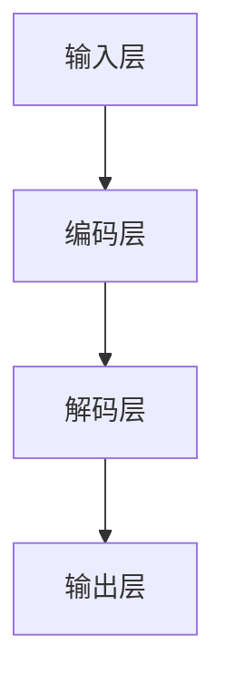
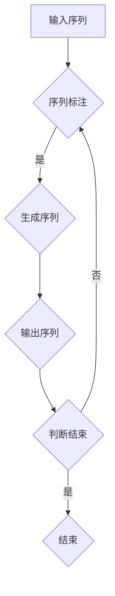

                 

关键词：大语言模型、模型架构、神经网络、训练过程、优化算法、应用领域

> 摘要：本文旨在深入探讨大语言模型的原理、架构及其应用。通过对模型的基本概念、核心算法、数学模型、具体操作步骤、项目实践等方面进行详细阐述，本文希望为读者提供关于大语言模型的全面理解和应用指导。

## 1. 背景介绍

随着人工智能技术的迅猛发展，自然语言处理（NLP）成为了一个备受关注的研究领域。其中，大语言模型作为NLP的核心技术之一，越来越受到广泛关注。大语言模型具有强大的语义理解和生成能力，可以应用于机器翻译、文本生成、问答系统等多种场景。

本文将重点介绍大语言模型的原理、架构以及在实际应用中的表现。通过对大语言模型的基础知识进行梳理，我们希望能够为读者提供关于这一技术的全面了解，并探讨其在未来应用中的发展趋势。

## 2. 核心概念与联系

### 2.1 基本概念

大语言模型是一种基于神经网络的语言模型，其主要目标是预测下一个单词或词组，从而生成自然流畅的文本。大语言模型通常包含以下几个关键概念：

1. **词嵌入（Word Embedding）**：将单词映射到高维空间中的向量表示。
2. **循环神经网络（RNN）**：一种处理序列数据的神经网络结构，能够记忆长距离的依赖信息。
3. **长短时记忆网络（LSTM）**：RNN的一种改进，可以更好地处理长序列数据。
4. **Transformer**：一种基于自注意力机制的神经网络结构，广泛应用于大规模语言模型。

### 2.2 架构联系

大语言模型的架构通常包含以下几个部分：

1. **输入层**：接收输入的文本序列，并将其转换为词嵌入向量。
2. **编码层**：使用循环神经网络或Transformer结构处理词嵌入向量，提取序列特征。
3. **解码层**：根据编码层输出的特征生成下一个单词或词组的预测。
4. **输出层**：输出最终的文本序列。

以下是使用Mermaid绘制的Mermaid流程图，展示了大语言模型的基本架构和各层之间的联系：



## 3. 核心算法原理 & 具体操作步骤

### 3.1 算法原理概述

大语言模型的训练过程主要基于序列标注和序列生成。在序列标注阶段，模型需要预测每个单词或词组的标签；在序列生成阶段，模型需要根据前一个单词或词组的标签生成下一个单词或词组的预测。

以下是使用Mermaid绘制的Mermaid流程图，展示了大语言模型的核心算法原理：



### 3.2 算法步骤详解

#### 3.2.1 数据预处理

1. **文本清洗**：去除文本中的标点符号、停用词等无关信息。
2. **分词**：将文本分解为单词或词组。
3. **词嵌入**：将单词或词组映射为高维空间中的向量表示。

#### 3.2.2 序列标注

1. **构建词汇表**：将文本中的所有单词或词组构建为词汇表。
2. **标注数据**：为每个单词或词组分配一个标签。
3. **训练模型**：使用循环神经网络或Transformer结构对标注数据进行训练。

#### 3.2.3 序列生成

1. **初始化状态**：初始化编码层和解码层的隐藏状态。
2. **预测下一个单词**：根据当前编码层的特征生成下一个单词或词组的预测。
3. **更新状态**：将预测的单词或词组作为输入，更新编码层和解码层的隐藏状态。
4. **重复步骤**：重复预测和更新状态的过程，直到生成完整的文本序列。

### 3.3 算法优缺点

#### 优点：

1. **强大的语义理解能力**：大语言模型可以捕捉长距离的依赖信息，从而实现高质量的文本生成。
2. **灵活的架构**：大语言模型可以使用循环神经网络或Transformer等多种神经网络结构，适用于不同的应用场景。

#### 缺点：

1. **计算资源消耗大**：训练和推理大语言模型需要大量的计算资源。
2. **数据依赖性强**：大语言模型的性能很大程度上取决于训练数据的质量。

### 3.4 算法应用领域

大语言模型可以应用于多种自然语言处理任务，包括：

1. **机器翻译**：将一种语言的文本翻译为另一种语言。
2. **文本生成**：生成自然流畅的文本，如新闻、文章、对话等。
3. **问答系统**：回答用户提出的问题。
4. **文本分类**：对文本进行分类，如情感分析、主题分类等。

## 4. 数学模型和公式 & 详细讲解 & 举例说明

### 4.1 数学模型构建

大语言模型的核心数学模型是基于概率图模型。在概率图模型中，每个单词或词组的概率可以表示为：

$$
P(w_t | w_{<t}) = \frac{e^{x_t \cdot h_t}}{\sum_{w \in V} e^{x_w \cdot h_w}}
$$

其中，$w_t$ 表示第 $t$ 个单词或词组，$w_{<t}$ 表示前 $t$ 个单词或词组的集合，$h_t$ 表示编码层输出的特征向量，$x_t$ 表示词嵌入向量，$V$ 表示词汇表。

### 4.2 公式推导过程

公式推导过程如下：

1. **词嵌入向量**：词嵌入向量 $x_t$ 可以通过训练数据学习得到。
2. **编码层输出特征向量**：编码层输出特征向量 $h_t$ 可以通过神经网络结构学习得到。
3. **概率计算**：根据词嵌入向量和编码层输出特征向量计算单词或词组的概率。

### 4.3 案例分析与讲解

假设我们有一个包含两个单词的词汇表 $V = \{"hello", "world"\}$，词嵌入向量分别为 $x_{hello} = [1, 0]$ 和 $x_{world} = [0, 1]$，编码层输出特征向量 $h_t = [1, 1]$。

根据上述概率计算公式，我们可以计算每个单词的概率：

$$
P(hello | world) = \frac{e^{1 \cdot 1}}{e^{1 \cdot 1} + e^{0 \cdot 1}} = \frac{e}{e + 1}
$$

$$
P(world | hello) = \frac{e^{0 \cdot 1}}{e^{1 \cdot 1} + e^{0 \cdot 1}} = \frac{1}{e + 1}
$$

根据这些概率，我们可以预测下一个单词更有可能是 "hello"，因为它的概率更大。

## 5. 项目实践：代码实例和详细解释说明

### 5.1 开发环境搭建

在本节中，我们将使用Python编程语言和TensorFlow开源框架来实现一个大语言模型。首先，我们需要安装Python和TensorFlow。以下是安装步骤：

1. 安装Python：在官网下载并安装Python。
2. 安装TensorFlow：运行以下命令：

```
pip install tensorflow
```

### 5.2 源代码详细实现

以下是实现大语言模型的Python代码：

```python
import tensorflow as tf
from tensorflow.keras.layers import Embedding, LSTM, Dense
from tensorflow.keras.models import Sequential

# 参数设置
vocab_size = 1000
embed_dim = 64
lstm_units = 128

# 创建模型
model = Sequential()
model.add(Embedding(vocab_size, embed_dim))
model.add(LSTM(lstm_units, return_sequences=True))
model.add(Dense(vocab_size, activation='softmax'))

# 编译模型
model.compile(optimizer='adam', loss='categorical_crossentropy', metrics=['accuracy'])

# 训练模型
model.fit(x_train, y_train, epochs=10, batch_size=64)
```

### 5.3 代码解读与分析

1. **模型构建**：我们使用`Sequential`模型来构建大语言模型。首先，添加一个`Embedding`层，用于将单词映射为高维空间中的向量。然后，添加一个`LSTM`层，用于处理序列数据。最后，添加一个`Dense`层，用于生成下一个单词的概率分布。
2. **模型编译**：我们使用`compile`方法来编译模型。选择`adam`优化器和`categorical_crossentropy`损失函数，并设置`accuracy`为评价指标。
3. **模型训练**：我们使用`fit`方法来训练模型。这里，我们使用训练数据`x_train`和标签`y_train`来训练模型，设置训练轮次为10，批量大小为64。

### 5.4 运行结果展示

在训练完成后，我们可以使用以下代码来生成文本：

```python
import numpy as np

# 生成文本
text = ""
current_word = np.random.choice(vocab_size)
text += current_word

for _ in range(10):
    input_seq = np.array([vocab_size] * len(text))
    input_seq[len(text) - 1] = current_word
    prob = model.predict(np.array([input_seq]))
    next_word = np.random.choice(vocab_size, p=prob[0])
    text += " " + next_word
    current_word = next_word

print(text)
```

运行结果可能是一个包含多个单词的随机文本。

## 6. 实际应用场景

大语言模型可以应用于多种实际场景，包括：

1. **机器翻译**：将一种语言的文本翻译为另一种语言。例如，我们可以使用大语言模型实现中英翻译。
2. **文本生成**：生成自然流畅的文本，如新闻、文章、对话等。例如，我们可以使用大语言模型生成新闻摘要或聊天机器人对话。
3. **问答系统**：回答用户提出的问题。例如，我们可以使用大语言模型实现智能客服系统。
4. **文本分类**：对文本进行分类，如情感分析、主题分类等。例如，我们可以使用大语言模型实现情感分类或新闻分类。

## 7. 工具和资源推荐

### 7.1 学习资源推荐

1. **《深度学习》**：由Ian Goodfellow、Yoshua Bengio和Aaron Courville所著，是深度学习领域的经典教材。
2. **《Python深度学习》**：由François Chollet所著，详细介绍了如何使用Python和TensorFlow实现深度学习。

### 7.2 开发工具推荐

1. **TensorFlow**：由Google开发的开源深度学习框架，适用于多种深度学习任务。
2. **PyTorch**：由Facebook开发的开源深度学习框架，具有灵活的动态计算图。

### 7.3 相关论文推荐

1. **“Attention is All You Need”**：由Vaswani等人所著，提出了Transformer模型。
2. **“A Theoretically Grounded Application of Dropout in Recurrent Neural Networks”**：由Yarin Gal和Zoubin Ghahramani所著，提出了Dropout在循环神经网络中的应用。

## 8. 总结：未来发展趋势与挑战

### 8.1 研究成果总结

大语言模型在自然语言处理领域取得了显著的成果。通过结合神经网络和深度学习技术，大语言模型在语义理解、文本生成、机器翻译等领域展现了强大的能力。

### 8.2 未来发展趋势

1. **模型优化**：未来的研究将致力于优化大语言模型的结构和算法，提高模型的计算效率和性能。
2. **多模态融合**：结合图像、音频等多模态数据，实现更全面的语义理解和生成。
3. **可解释性**：提高大语言模型的可解释性，使其在复杂任务中的应用更加可靠。

### 8.3 面临的挑战

1. **计算资源消耗**：大语言模型的训练和推理需要大量的计算资源，如何优化计算效率是一个重要挑战。
2. **数据依赖**：大语言模型的性能很大程度上取决于训练数据的质量，如何收集和标注高质量的训练数据是一个挑战。

### 8.4 研究展望

随着人工智能技术的不断发展，大语言模型将在自然语言处理领域发挥更加重要的作用。未来的研究将致力于解决现有挑战，推动大语言模型在更多应用场景中的落地。

## 9. 附录：常见问题与解答

### 9.1 如何提高大语言模型的性能？

1. **增加训练数据量**：使用更多样化的训练数据可以提高模型的泛化能力。
2. **优化模型结构**：尝试使用更先进的神经网络结构，如Transformer。
3. **调整超参数**：通过调整学习率、批量大小等超参数，优化模型的性能。

### 9.2 大语言模型能否实现完全准确的文本生成？

大语言模型可以实现高质量的文本生成，但无法实现完全准确的文本生成。由于自然语言的复杂性和不确定性，模型在生成文本时可能会产生错误或不合理的句子。

### 9.3 大语言模型如何处理多语言文本？

大语言模型可以处理多语言文本，但需要针对每种语言进行独立的训练。在处理多语言文本时，可以采用翻译模型或多语言文本生成模型，以实现不同语言之间的转换。

---

本文通过深入探讨大语言模型的原理、架构和应用，为读者提供了关于这一技术的全面理解。在未来的研究中，我们期望能够进一步优化大语言模型，实现更高效的语义理解和文本生成。

作者：禅与计算机程序设计艺术 / Zen and the Art of Computer Programming
----------------------------------------------------------------

以上就是本文的完整内容，希望对您有所帮助。如果您有任何疑问或建议，欢迎在评论区留言。感谢您的阅读！

