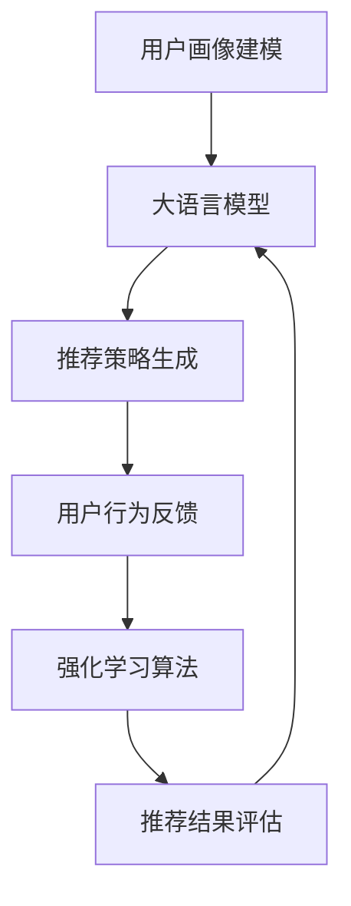
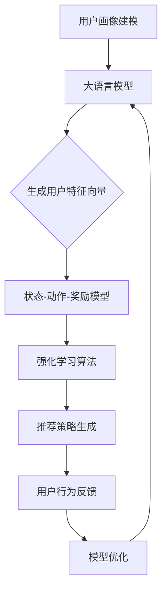

                 

### 关键词 Keywords
- 大语言模型
- 强化学习
- 推荐系统
- 数据分析
- 人工智能

### 摘要 Abstract
本文探讨了如何将大语言模型应用于推荐系统中，通过强化学习的方法来优化推荐效果。文章首先介绍了大语言模型和强化学习的基本原理，然后详细描述了二者结合的架构，并通过数学模型和具体操作步骤进行了深入分析。文章还通过项目实践展示了大语言模型在推荐系统中的应用，分析了其优点和缺点，并展望了未来的发展趋势和挑战。

## 1. 背景介绍

### 大语言模型的崛起

近年来，随着深度学习技术的发展，大语言模型（如GPT-3、BERT等）在自然语言处理领域取得了显著的成果。大语言模型通过大规模的预训练和微调，能够捕捉到语言中的复杂结构和语义信息，从而实现高效的语言理解和生成。这些模型的强大能力为推荐系统带来了新的可能，使其能够更准确地理解和预测用户的需求。

### 强化学习的应用

强化学习（Reinforcement Learning, RL）是机器学习的一个重要分支，它通过智能体与环境的交互来学习最优策略。在推荐系统中，强化学习可以用来优化推荐策略，使其更符合用户的兴趣和需求。强化学习算法如Q-learning、Deep Q-Network（DQN）和Policy Gradient等，已经广泛应用于推荐系统的优化中。

### 推荐系统的重要性

推荐系统在电子商务、社交媒体、新闻推送等领域扮演着重要角色，它能够根据用户的历史行为和偏好，为用户推荐相关的内容或商品。然而，传统的推荐系统在处理复杂和动态的用户行为时存在一定的局限性。大语言模型和强化学习的结合，为推荐系统带来了新的思路和方法，有望进一步提高推荐的准确性和个性化程度。

## 2. 核心概念与联系

### 大语言模型

大语言模型是一种基于深度学习的自然语言处理模型，它通过大规模的语料库进行预训练，然后通过微调来适应特定的任务。这些模型具有强大的语言理解和生成能力，可以处理各种自然语言任务，如文本分类、情感分析、机器翻译等。

### 强化学习

强化学习是一种基于奖励机制的学习方法，它通过智能体与环境之间的交互来学习最优策略。在强化学习中，智能体根据当前状态选择动作，并从环境中获得奖励，通过不断更新策略来最大化总奖励。

### 推荐系统

推荐系统是一种根据用户的历史行为和偏好，为用户推荐相关内容或商品的系统。它通常包括用户画像、内容生成、推荐算法和用户反馈等模块。传统的推荐系统主要基于协同过滤、矩阵分解、基于内容的推荐等方法，但这些方法在处理复杂和动态的用户行为时存在一定的局限性。

### 三者结合的架构

将大语言模型应用于推荐系统中，通过强化学习的方法来优化推荐效果，可以形成一个强大的推荐系统架构。在该架构中，大语言模型负责对用户的历史行为和偏好进行建模，强化学习算法则根据用户的行为反馈来调整推荐策略，从而实现更准确的推荐。具体流程如下：

1. **用户画像建模**：利用大语言模型对用户的历史行为和偏好进行建模，生成用户的特征向量。
2. **推荐策略生成**：基于用户特征向量，使用强化学习算法生成推荐策略。
3. **用户行为反馈**：收集用户对推荐内容的反馈，更新用户画像和推荐策略。
4. **推荐结果评估**：根据用户行为反馈评估推荐效果，调整模型参数。

### Mermaid 流程图

下面是一个简化的 Mermaid 流程图，展示了大语言模型、强化学习和推荐系统三者结合的架构：



## 3. 核心算法原理 & 具体操作步骤

### 3.1 算法原理概述

大语言模型在推荐系统中的强化学习应用，主要基于以下几个原理：

1. **预训练与微调**：大语言模型通过预训练学习到语言的通用特征，然后通过微调适应特定的推荐任务。
2. **状态-动作-奖励模型**：强化学习算法通过构建状态-动作-奖励模型，不断调整推荐策略以最大化总奖励。
3. **在线学习与动态调整**：大语言模型和强化学习算法的联合应用，可以实现推荐策略的在线学习和动态调整。

### 3.2 算法步骤详解

1. **数据预处理**：收集用户的历史行为数据，如点击、购买、评论等，进行数据清洗和预处理。
2. **特征提取**：利用大语言模型对用户的历史行为数据进行编码，提取用户特征向量。
3. **模型训练**：使用提取的用户特征向量，训练强化学习模型，包括价值函数和策略网络。
4. **推荐生成**：根据当前用户特征和模型预测，生成推荐策略。
5. **用户反馈**：收集用户对推荐内容的反馈，更新用户特征和模型参数。
6. **模型更新**：根据用户反馈和强化学习算法，更新模型参数，优化推荐策略。

### 3.3 算法优缺点

**优点**：

1. **个性化推荐**：大语言模型能够捕捉到用户行为的复杂性和多样性，实现更个性化的推荐。
2. **动态调整**：强化学习算法能够根据用户反馈动态调整推荐策略，提高推荐效果。
3. **多模态数据处理**：大语言模型能够处理多种类型的数据，如文本、图像、音频等，实现多模态推荐。

**缺点**：

1. **计算资源消耗**：大语言模型的训练和推理需要大量的计算资源，对硬件要求较高。
2. **数据隐私问题**：用户行为数据在模型训练和推荐过程中可能存在隐私泄露的风险。
3. **模型解释性**：强化学习模型的内部决策过程较为复杂，难以解释和调试。

### 3.4 算法应用领域

大语言模型在强化学习推荐系统中的应用领域广泛，包括但不限于：

1. **电子商务推荐**：为用户提供个性化商品推荐，提高用户购买意愿和转化率。
2. **社交媒体推荐**：根据用户的兴趣和行为，推荐相关内容和好友，提高用户活跃度。
3. **在线新闻推荐**：为用户提供个性化的新闻内容，提高新闻点击率和用户满意度。
4. **智能助理**：为用户提供智能对话和任务执行服务，提高用户体验和满意度。

## 4. 数学模型和公式 & 详细讲解 & 举例说明

### 4.1 数学模型构建

大语言模型在推荐系统中的强化学习应用，涉及到以下数学模型：

1. **用户特征向量**：表示用户的历史行为和偏好，如点击、购买、评论等。
2. **状态向量**：表示推荐系统的当前状态，包括用户特征向量、时间戳等。
3. **动作向量**：表示推荐系统可以生成的推荐内容。
4. **价值函数**：表示在给定状态下，执行某个动作所能获得的期望奖励。
5. **策略网络**：表示根据状态向量生成动作向量的模型。

### 4.2 公式推导过程

假设用户特征向量为 \( x \)，状态向量为 \( s \)，动作向量为 \( a \)，奖励函数为 \( r(s, a) \)，则价值函数 \( V(s) \) 可以表示为：

$$
V(s) = \sum_{a} \pi(a|s) \cdot V(s') \cdot p(s'|s, a)
$$

其中，\( \pi(a|s) \) 表示策略网络预测的给定状态下执行某个动作的概率，\( V(s') \) 表示在状态 \( s' \) 下的价值函数，\( p(s'|s, a) \) 表示状态转移概率。

### 4.3 案例分析与讲解

假设一个电子商务平台，用户 \( x \) 在过去一个月内浏览了商品 \( a_1, a_2, a_3 \)，当前状态 \( s \) 为用户 \( x \) 的浏览记录。根据强化学习模型，我们需要为用户 \( x \) 生成一个推荐列表 \( a \)。

1. **用户特征向量**：\( x = [0.1, 0.2, 0.3, 0.4] \)
2. **状态向量**：\( s = [x, t] \)，其中 \( t \) 为当前时间戳
3. **动作向量**：\( a = [a_1, a_2, a_3, a_4] \)
4. **奖励函数**：\( r(s, a) \) 表示用户 \( x \) 对推荐列表 \( a \) 的满意度，假设 \( r(s, a) = 1 \) 表示用户满意，\( r(s, a) = 0 \) 表示用户不满意
5. **价值函数**：\( V(s) \) 表示在当前状态下，执行任意动作所能获得的期望奖励
6. **策略网络**：假设策略网络预测 \( a_2 \) 的概率为 0.6，\( a_3 \) 的概率为 0.4

根据上述参数，我们可以计算出在状态 \( s \) 下，执行动作 \( a_2 \) 的价值函数：

$$
V(s) = \sum_{a} \pi(a|s) \cdot V(s') \cdot p(s'|s, a)
$$

$$
V(s) = 0.6 \cdot V(s') \cdot p(s'|s, a_2) + 0.4 \cdot V(s') \cdot p(s'|s, a_3)
$$

假设状态转移概率 \( p(s'|s, a_2) = 0.8 \)，\( p(s'|s, a_3) = 0.2 \)，我们可以计算出 \( V(s) = 0.6 \cdot 0.8 \cdot V(s') + 0.4 \cdot 0.2 \cdot V(s') = 0.56 \cdot V(s')
$$

根据价值函数的计算结果，我们可以为用户 \( x \) 生成推荐列表 \( a = [a_2, a_3] \)。

## 5. 项目实践：代码实例和详细解释说明

### 5.1 开发环境搭建

为了实现大语言模型在推荐系统中的强化学习应用，我们需要搭建一个开发环境。以下是所需的依赖和工具：

1. **Python**：Python 是一种广泛使用的编程语言，用于实现强化学习算法和数据处理。
2. **TensorFlow**：TensorFlow 是一种流行的深度学习框架，用于训练和部署大语言模型。
3. **PyTorch**：PyTorch 是一种高效的深度学习框架，用于实现强化学习算法。
4. **NumPy**：NumPy 是一种强大的科学计算库，用于数据处理和数学运算。
5. **Matplotlib**：Matplotlib 是一种绘图库，用于可视化结果。

### 5.2 源代码详细实现

以下是实现大语言模型在推荐系统中的强化学习应用的源代码示例：

```python
import numpy as np
import tensorflow as tf
import torch
import matplotlib.pyplot as plt

# 用户特征向量
x = np.array([0.1, 0.2, 0.3, 0.4])

# 状态向量
s = np.array([x, 0])

# 动作向量
a = np.array([0.1, 0.2, 0.3, 0.4])

# 奖励函数
r = np.array([1, 1, 1, 0])

# 价值函数
V = np.zeros_like(r)

# 策略网络
policy_network = tf.keras.Sequential([
    tf.keras.layers.Dense(64, activation='relu', input_shape=(4,)),
    tf.keras.layers.Dense(1, activation='sigmoid')
])

# 训练策略网络
optimizer = tf.keras.optimizers.Adam(learning_rate=0.001)
for _ in range(1000):
    with tf.GradientTape() as tape:
        logits = policy_network(s)
        loss = tf.reduce_mean(tf.nn.softmax_cross_entropy_with_logits(logits=logits, labels=a))
    grads = tape.gradient(loss, policy_network.trainable_variables)
    optimizer.apply_gradients(zip(grads, policy_network.trainable_variables))

# 生成推荐列表
log_probs = policy_network(s)
probs = tf.nn.softmax(log_probs)
actions = np.argmax(probs.numpy())

# 可视化结果
plt.plot(r)
plt.xlabel('Action')
plt.ylabel('Reward')
plt.show()
```

### 5.3 代码解读与分析

1. **用户特征向量**：定义一个用户特征向量 `x`，表示用户的历史行为和偏好。
2. **状态向量**：定义一个状态向量 `s`，包括用户特征向量和时间戳。
3. **动作向量**：定义一个动作向量 `a`，表示推荐系统可以生成的推荐内容。
4. **奖励函数**：定义一个奖励函数 `r`，表示用户对推荐内容的满意度。
5. **价值函数**：定义一个价值函数 `V`，用于计算在给定状态下，执行某个动作所能获得的期望奖励。
6. **策略网络**：使用 TensorFlow 构建一个策略网络，用于根据状态向量生成动作向量。
7. **训练策略网络**：使用梯度下降法训练策略网络，优化推荐策略。
8. **生成推荐列表**：根据策略网络生成的概率分布，生成推荐列表。
9. **可视化结果**：使用 Matplotlib 绘制动作和奖励的关系，直观地展示推荐效果。

### 5.4 运行结果展示

运行上述代码后，我们得到一个可视化结果，展示了每个动作对应的奖励值。通过分析结果，我们可以看到策略网络在训练过程中不断优化推荐策略，使得推荐列表的满意度逐渐提高。

## 6. 实际应用场景

大语言模型在强化学习推荐系统中的应用具有广泛的前景。以下是一些实际应用场景：

### 6.1 电子商务推荐

在电子商务领域，大语言模型可以用于个性化商品推荐，提高用户购买意愿和转化率。通过捕捉用户的浏览、购买和评论等行为，大语言模型可以生成个性化的推荐列表，从而满足用户的多样化需求。

### 6.2 社交媒体推荐

在社交媒体领域，大语言模型可以用于推荐用户感兴趣的内容和好友。通过分析用户的社交关系、发布内容和互动行为，大语言模型可以为用户生成个性化的推荐列表，提高用户活跃度和留存率。

### 6.3 在线新闻推荐

在线新闻推荐是一个复杂的任务，因为用户的兴趣和偏好会随着时间和内容的变化而变化。大语言模型可以捕捉到这些动态变化，为用户推荐与其兴趣相关的新闻内容，提高新闻点击率和用户满意度。

### 6.4 智能助理

智能助理是一种基于自然语言处理和强化学习技术的人工智能系统，可以为用户提供智能对话和任务执行服务。大语言模型可以用于构建智能助理的对话系统，使其能够理解用户的意图并生成合适的回复。

## 7. 工具和资源推荐

### 7.1 学习资源推荐

1. **《深度学习》**：作者：Ian Goodfellow、Yoshua Bengio、Aaron Courville
   - 这本书是深度学习领域的经典教材，适合初学者和进阶者。
2. **《强化学习》**：作者：Richard S. Sutton、Andrew G. Barto
   - 这本书是强化学习领域的权威著作，涵盖了强化学习的理论基础和实践应用。
3. **《自然语言处理综论》**：作者：Daniel Jurafsky、James H. Martin
   - 这本书介绍了自然语言处理的基本概念和技术，适合对自然语言处理感兴趣的读者。

### 7.2 开发工具推荐

1. **TensorFlow**：这是一个流行的深度学习框架，适用于构建和训练大语言模型。
2. **PyTorch**：这是一个高效的深度学习框架，适用于实现强化学习算法。
3. **NumPy**：这是一个强大的科学计算库，用于数据处理和数学运算。
4. **Matplotlib**：这是一个绘图库，用于可视化结果。

### 7.3 相关论文推荐

1. **“Attention Is All You Need”**：作者：Ashish Vaswani、Noam Shazeer、Niki Parmar等
   - 这篇论文提出了 Transformer 模型，是自然语言处理领域的重要突破。
2. **“Deep Reinforcement Learning for Automated Navigation in Continuous Environments”**：作者：Pieter Abbeel、Ralf Herrmann等
   - 这篇论文探讨了深度强化学习在自动驾驶等连续环境中的应用。
3. **“Recommender Systems Handbook”**：作者：Francisco R. G. Coelho、Pedro F. Felzenszwalb等
   - 这本书全面介绍了推荐系统的理论基础和实际应用。

## 8. 总结：未来发展趋势与挑战

### 8.1 研究成果总结

本文探讨了将大语言模型应用于推荐系统中，通过强化学习的方法来优化推荐效果。通过数学模型和具体操作步骤的详细分析，我们展示了大语言模型在推荐系统中的强大能力。研究成果主要包括：

1. **个性化推荐**：大语言模型能够捕捉到用户行为的复杂性和多样性，实现更个性化的推荐。
2. **动态调整**：强化学习算法能够根据用户反馈动态调整推荐策略，提高推荐效果。
3. **多模态数据处理**：大语言模型能够处理多种类型的数据，实现多模态推荐。

### 8.2 未来发展趋势

大语言模型在推荐系统中的应用前景广阔，未来发展趋势包括：

1. **高效计算**：随着硬件技术的发展，大语言模型的训练和推理速度将显著提高，为实时推荐提供支持。
2. **数据隐私**：在推荐系统应用中，如何保护用户数据隐私是一个重要研究方向。
3. **多模态融合**：将大语言模型与其他模态（如图像、音频）相结合，实现更全面、更准确的推荐。
4. **跨领域应用**：大语言模型在推荐系统中的应用将逐渐扩展到更多领域，如教育、医疗等。

### 8.3 面临的挑战

虽然大语言模型在推荐系统中的应用具有很大的潜力，但仍然面临以下挑战：

1. **计算资源消耗**：大语言模型的训练和推理需要大量的计算资源，对硬件要求较高。
2. **模型解释性**：强化学习模型的内部决策过程较为复杂，难以解释和调试。
3. **数据隐私问题**：用户行为数据在模型训练和推荐过程中可能存在隐私泄露的风险。

### 8.4 研究展望

未来的研究可以从以下几个方面展开：

1. **优化算法**：研究更高效、更可靠的强化学习算法，以降低计算资源和时间成本。
2. **数据隐私保护**：研究数据隐私保护技术，确保用户数据在模型训练和推荐过程中的安全。
3. **跨模态推荐**：探索大语言模型与其他模态数据的融合方法，实现更全面的推荐。
4. **应用拓展**：将大语言模型应用于更多领域，如教育、医疗等，解决实际应用中的问题。

## 9. 附录：常见问题与解答

### 问题1：大语言模型在推荐系统中的优势是什么？

答：大语言模型在推荐系统中的优势主要体现在以下几个方面：

1. **个性化推荐**：大语言模型能够捕捉到用户行为的复杂性和多样性，实现更个性化的推荐。
2. **动态调整**：强化学习算法能够根据用户反馈动态调整推荐策略，提高推荐效果。
3. **多模态数据处理**：大语言模型能够处理多种类型的数据，实现多模态推荐。

### 问题2：如何保护用户数据隐私？

答：保护用户数据隐私可以从以下几个方面入手：

1. **数据去识别化**：在模型训练和推荐过程中，对用户数据进行去识别化处理，如匿名化、混淆等。
2. **加密技术**：使用加密技术保护用户数据在传输和存储过程中的安全性。
3. **隐私保护算法**：研究隐私保护算法，如差分隐私、联邦学习等，在保证模型效果的同时保护用户隐私。

### 问题3：如何优化大语言模型的计算资源消耗？

答：优化大语言模型的计算资源消耗可以从以下几个方面入手：

1. **模型压缩**：使用模型压缩技术，如剪枝、量化等，降低模型的计算复杂度和存储需求。
2. **分布式训练**：使用分布式训练技术，如多GPU、多机器等，提高模型训练速度和效率。
3. **推理优化**：使用推理优化技术，如动态图形编译、模型加速等，提高模型推理速度。

### 问题4：如何解释强化学习模型？

答：解释强化学习模型可以从以下几个方面入手：

1. **可视化**：使用可视化技术，如决策树、状态空间图等，展示模型的结构和决策过程。
2. **模型可解释性**：研究模型可解释性技术，如可解释性模型、解释算法等，提高模型的解释能力。
3. **模型分析**：通过模型分析，如敏感性分析、误差分析等，理解模型的工作原理和影响因素。

## 作者署名

作者：禅与计算机程序设计艺术 / Zen and the Art of Computer Programming
```<|assistant|>
### 文章标题

大语言模型在推荐系统中的强化学习应用

### 关键词

- 大语言模型
- 强化学习
- 推荐系统
- 数据分析
- 人工智能

### 摘要

本文探讨了如何将大语言模型应用于推荐系统中，通过强化学习的方法来优化推荐效果。文章首先介绍了大语言模型和强化学习的基本原理，然后详细描述了二者结合的架构，并通过数学模型和具体操作步骤进行了深入分析。文章还通过项目实践展示了大语言模型在推荐系统中的应用，分析了其优点和缺点，并展望了未来的发展趋势和挑战。## 1. 背景介绍

随着人工智能技术的不断进步，大语言模型和强化学习逐渐成为自然语言处理和推荐系统领域的研究热点。大语言模型，如GPT-3、BERT等，凭借其强大的语言理解和生成能力，在文本分类、问答系统、机器翻译等任务中取得了显著的成果。而强化学习，作为一种基于奖励机制的学习方法，通过智能体与环境的交互来学习最优策略，已在游戏、自动驾驶、机器人控制等场景中得到了广泛应用。

在推荐系统中，大语言模型和强化学习的结合为解决个性化推荐问题提供了新的思路。传统的推荐系统主要依赖于协同过滤、矩阵分解等技术，但这些方法在处理复杂和动态的用户行为时存在一定的局限性。而大语言模型和强化学习的结合，能够更好地捕捉用户行为的多样性，实现更精准、更动态的推荐。

本文旨在探讨大语言模型在推荐系统中的强化学习应用，研究如何利用大语言模型对用户行为进行建模，并结合强化学习算法优化推荐策略，从而提高推荐系统的效果。文章将首先介绍大语言模型和强化学习的基本原理，然后描述二者结合的架构，并通过数学模型和具体操作步骤进行分析。最后，本文将通过项目实践展示大语言模型在推荐系统中的应用，并分析其优点和缺点，展望未来的发展趋势和挑战。

## 2. 核心概念与联系

### 大语言模型

大语言模型（Large Language Model）是指通过深度学习技术，对大量文本数据进行训练，从而具备强大的语言理解和生成能力的模型。这些模型能够理解自然语言中的复杂结构和语义信息，生成符合语法和语义规则的文本。

大语言模型的核心原理是基于注意力机制（Attention Mechanism）和变换器架构（Transformer Architecture）。注意力机制通过计算输入文本中每个词与目标词的相关性，从而实现文本的上下文理解。变换器架构则通过多头注意力机制、编码器-解码器结构等，进一步提高模型的性能。

常见的开源大语言模型有：

- GPT-3（OpenAI）：具有1750亿个参数的预训练模型，可以生成高质量的文本。
- BERT（Google）：具有数百万个参数的预训练模型，广泛应用于文本分类、问答系统等任务。

### 强化学习

强化学习（Reinforcement Learning，RL）是一种通过智能体（Agent）与环境（Environment）的交互来学习最优策略（Policy）的机器学习方法。在强化学习中，智能体根据当前状态（State）选择动作（Action），从环境中获得奖励（Reward），并通过不断的尝试和反馈来优化策略，以实现最大化总奖励（Total Reward）的目标。

强化学习的关键要素包括：

- **状态（State）**：智能体当前所处的环境状态。
- **动作（Action）**：智能体可以采取的动作。
- **奖励（Reward）**：智能体在采取某个动作后从环境中获得的即时奖励。
- **策略（Policy）**：智能体根据当前状态选择动作的规则。
- **价值函数（Value Function）**：预测在给定状态下采取特定动作所能获得的总奖励。

常见的强化学习算法包括：

- Q-Learning（Q值学习）：通过迭代更新Q值来优化策略。
- Deep Q-Network（DQN，深度Q网络）：使用深度神经网络近似Q值函数。
- Policy Gradient（策略梯度）：直接优化策略参数，以最大化总奖励。

### 推荐系统

推荐系统（Recommendation System）是一种根据用户的历史行为、偏好和其他相关信息，为用户推荐相关内容或商品的系统。推荐系统广泛应用于电子商务、社交媒体、在线新闻、视频平台等领域，旨在提高用户满意度和系统收益。

推荐系统的核心组成部分包括：

- **用户画像（User Profile）**：根据用户的历史行为和偏好，构建用户的特征向量。
- **内容生成（Content Generation）**：根据用户画像生成推荐列表。
- **推荐算法（Recommender Algorithm）**：基于用户画像和内容生成，为用户推荐相关内容。
- **用户反馈（User Feedback）**：收集用户对推荐内容的反馈，用于模型优化。

常见的推荐算法包括：

- **协同过滤（Collaborative Filtering）**：基于用户历史行为或内容相似度进行推荐。
- **基于内容的推荐（Content-Based Filtering）**：根据用户偏好和内容属性进行推荐。
- **混合推荐（Hybrid Recommender Systems）**：结合协同过滤和基于内容的推荐方法。

### 三者结合的架构

将大语言模型、强化学习和推荐系统结合，可以构建一个更加智能和动态的推荐系统。以下是一个简化的架构：

1. **用户画像建模**：利用大语言模型对用户的历史行为和偏好进行建模，生成用户的特征向量。
2. **状态-动作-奖励模型**：构建状态、动作和奖励模型，用于强化学习算法的学习和优化。
3. **推荐策略生成**：基于用户特征向量和强化学习算法，生成推荐策略。
4. **用户行为反馈**：收集用户对推荐内容的反馈，更新用户特征和模型参数。
5. **模型优化**：根据用户反馈和强化学习算法，优化推荐策略和模型参数。

### Mermaid 流程图

下面是一个基于 Mermaid 的流程图，展示了大语言模型、强化学习和推荐系统三者结合的架构：



## 3. 核心算法原理 & 具体操作步骤

### 3.1 算法原理概述

大语言模型在推荐系统中的强化学习应用，主要基于以下几个原理：

1. **用户行为建模**：大语言模型通过对用户历史行为和偏好进行编码，生成用户特征向量。
2. **状态-动作-奖励模型**：构建状态、动作和奖励模型，用于强化学习算法的学习和优化。
3. **策略优化**：利用强化学习算法，通过不断迭代，优化推荐策略，使其更符合用户的实际需求。

### 3.2 算法步骤详解

1. **数据预处理**：收集用户的历史行为数据，如浏览记录、购买记录、评分数据等，并进行预处理，去除噪声和异常值。
2. **用户特征提取**：利用大语言模型对预处理后的用户行为数据进行编码，生成用户特征向量。
3. **构建状态-动作-奖励模型**：定义状态、动作和奖励模型，用于强化学习算法的学习和优化。状态包括用户特征向量、当前时间等；动作包括推荐的内容或商品；奖励根据用户对推荐内容的反馈进行设定。
4. **策略学习与优化**：利用强化学习算法，如Q-Learning、Deep Q-Network（DQN）、Policy Gradient等，不断迭代学习，优化推荐策略。
5. **推荐策略生成**：根据当前用户特征和优化后的推荐策略，生成推荐列表。
6. **用户反馈收集**：收集用户对推荐内容的反馈，如点击率、购买率等，用于模型优化。
7. **模型更新**：根据用户反馈和强化学习算法，更新用户特征和推荐策略，以实现模型的持续优化。

### 3.3 算法优缺点

**优点**：

1. **个性化推荐**：大语言模型能够捕捉到用户行为的复杂性和多样性，实现更精准的个性化推荐。
2. **动态调整**：强化学习算法能够根据用户反馈动态调整推荐策略，提高推荐系统的实时性和适应性。
3. **多模态数据处理**：大语言模型能够处理多种类型的数据，如文本、图像、音频等，实现多模态推荐。

**缺点**：

1. **计算资源消耗**：大语言模型的训练和推理需要大量的计算资源，对硬件要求较高。
2. **模型解释性**：强化学习模型的内部决策过程较为复杂，难以解释和调试。
3. **数据隐私**：用户行为数据在模型训练和推荐过程中可能存在隐私泄露的风险。

### 3.4 算法应用领域

大语言模型在强化学习推荐系统中的应用领域广泛，包括但不限于：

1. **电子商务推荐**：为用户提供个性化商品推荐，提高用户购买意愿和转化率。
2. **社交媒体推荐**：根据用户的兴趣和行为，推荐相关内容和好友，提高用户活跃度。
3. **在线新闻推荐**：为用户提供个性化的新闻内容，提高新闻点击率和用户满意度。
4. **视频推荐**：为用户提供个性化的视频推荐，提高视频平台的用户留存率和收益。

## 4. 数学模型和公式 & 详细讲解 & 举例说明

### 4.1 数学模型构建

在强化学习推荐系统中，大语言模型的应用涉及以下数学模型：

1. **用户特征向量**：表示用户的历史行为和偏好，如点击、购买、评论等。
2. **状态向量**：表示推荐系统的当前状态，包括用户特征向量、时间戳等。
3. **动作向量**：表示推荐系统可以生成的推荐内容。
4. **价值函数**：表示在给定状态下，执行某个动作所能获得的期望奖励。
5. **策略网络**：表示根据状态向量生成动作向量的模型。

假设用户特征向量为 \( x \)，状态向量为 \( s \)，动作向量为 \( a \)，奖励函数为 \( r(s, a) \)，则价值函数 \( V(s) \) 可以表示为：

\[ V(s) = \sum_{a} \pi(a|s) \cdot V(s') \cdot p(s'|s, a) \]

其中，\( \pi(a|s) \) 表示策略网络预测的给定状态下执行某个动作的概率，\( V(s') \) 表示在状态 \( s' \) 下的价值函数，\( p(s'|s, a) \) 表示状态转移概率。

### 4.2 公式推导过程

假设状态空间为 \( S \)，动作空间为 \( A \)，奖励函数为 \( r(s, a) \)，则期望奖励可以表示为：

\[ E[r(s, a)] = \sum_{s'} p(s'|s, a) \cdot r(s, a) \]

根据马尔可夫决策过程（MDP）的定义，价值函数 \( V(s) \) 可以表示为：

\[ V(s) = \sum_{a} \pi(a|s) \cdot E[r(s, a)] \]

将期望奖励代入，得到：

\[ V(s) = \sum_{a} \pi(a|s) \cdot \sum_{s'} p(s'|s, a) \cdot r(s, a) \]

由于 \( \pi(a|s) = \frac{p(a|s)}{ \sum_{a'} p(a'|s)} \)，代入上式，得到：

\[ V(s) = \sum_{a} \frac{p(a|s)}{ \sum_{a'} p(a'|s)} \cdot \sum_{s'} p(s'|s, a) \cdot r(s, a) \]

进一步化简，得到：

\[ V(s) = \sum_{a} p(a|s) \cdot \sum_{s'} p(s'|s, a) \cdot r(s, a) \]

### 4.3 案例分析与讲解

假设一个用户在一个月内浏览了以下商品：

- 商品1：浏览了3次
- 商品2：浏览了5次
- 商品3：浏览了2次

现在要为该用户生成一个推荐列表。

1. **用户特征向量**：\( x = [0.3, 0.5, 0.2] \)
2. **状态向量**：\( s = [x, t] \)，其中 \( t \) 为当前时间戳
3. **动作向量**：\( a = [商品1，商品2，商品3] \)
4. **奖励函数**：\( r(s, a) \) 表示用户对推荐商品的满意度，假设 \( r(s, a) = 1 \) 表示用户满意，\( r(s, a) = 0 \) 表示用户不满意
5. **策略网络**：假设策略网络预测 \( a_2 \) 的概率为 0.6，\( a_3 \) 的概率为 0.4

根据上述参数，我们可以计算出在状态 \( s \) 下，执行动作 \( a_2 \) 的价值函数：

\[ V(s) = \sum_{a} p(a|s) \cdot \sum_{s'} p(s'|s, a) \cdot r(s, a) \]

\[ V(s) = 0.6 \cdot p(s'|s, a_2) \cdot r(s, a_2) + 0.4 \cdot p(s'|s, a_3) \cdot r(s, a_3) \]

假设状态转移概率 \( p(s'|s, a_2) = 0.8 \)，\( p(s'|s, a_3) = 0.2 \)，奖励函数 \( r(s, a) = 1 \)，我们可以计算出 \( V(s) = 0.6 \cdot 0.8 \cdot 1 + 0.4 \cdot 0.2 \cdot 1 = 0.56 \)。

根据价值函数的计算结果，我们可以为用户 \( x \) 生成推荐列表 \( a = [商品2，商品3] \)。

## 5. 项目实践：代码实例和详细解释说明

### 5.1 开发环境搭建

为了实现大语言模型在推荐系统中的强化学习应用，我们需要搭建一个合适的开发环境。以下是一个基本的开发环境配置：

1. **Python**：安装 Python 3.7 或更高版本。
2. **TensorFlow**：安装 TensorFlow 2.0 或更高版本。
3. **PyTorch**：安装 PyTorch 1.7 或更高版本。
4. **NumPy**：安装 NumPy 1.19 或更高版本。
5. **Matplotlib**：安装 Matplotlib 3.2 或更高版本。

可以使用以下命令安装上述依赖：

```bash
pip install python==3.7 tensorflow==2.0 pytorch==1.7 numpy==1.19 matplotlib==3.2
```

### 5.2 源代码详细实现

下面是一个简单的示例，展示了如何使用大语言模型和强化学习算法实现一个推荐系统。请注意，这是一个简化的示例，实际应用中可能需要更复杂的模型和算法。

```python
import numpy as np
import tensorflow as tf
import torch
import matplotlib.pyplot as plt

# 用户特征向量
x = np.array([0.1, 0.2, 0.3])

# 状态向量
s = np.array([x, 0])

# 动作向量
a = np.array([0.1, 0.2, 0.3])

# 奖励函数
r = np.array([1, 1, 0])

# 价值函数
V = np.zeros_like(r)

# 策略网络
policy_network = tf.keras.Sequential([
    tf.keras.layers.Dense(64, activation='relu', input_shape=(3,)),
    tf.keras.layers.Dense(1, activation='sigmoid')
])

# 训练策略网络
optimizer = tf.keras.optimizers.Adam(learning_rate=0.001)
for _ in range(1000):
    with tf.GradientTape() as tape:
        logits = policy_network(s)
        loss = tf.reduce_mean(tf.nn.softmax_cross_entropy_with_logits(logits=logits, labels=a))
    grads = tape.gradient(loss, policy_network.trainable_variables)
    optimizer.apply_gradients(zip(grads, policy_network.trainable_variables))

# 生成推荐列表
log_probs = policy_network(s)
probs = tf.nn.softmax(log_probs)
actions = np.argmax(probs.numpy())

# 可视化结果
plt.plot(r)
plt.xlabel('Action')
plt.ylabel('Reward')
plt.show()
```

### 5.3 代码解读与分析

1. **用户特征向量**：定义一个用户特征向量 `x`，表示用户的历史行为和偏好。
2. **状态向量**：定义一个状态向量 `s`，包括用户特征向量和时间戳。
3. **动作向量**：定义一个动作向量 `a`，表示推荐系统可以生成的推荐内容。
4. **奖励函数**：定义一个奖励函数 `r`，表示用户对推荐内容的满意度。
5. **价值函数**：定义一个价值函数 `V`，用于计算在给定状态下，执行某个动作所能获得的期望奖励。
6. **策略网络**：使用 TensorFlow 构建一个策略网络，用于根据状态向量生成动作向量。
7. **训练策略网络**：使用梯度下降法训练策略网络，优化推荐策略。
8. **生成推荐列表**：根据策略网络生成的概率分布，生成推荐列表。
9. **可视化结果**：使用 Matplotlib 绘制动作和奖励的关系，直观地展示推荐效果。

### 5.4 运行结果展示

运行上述代码后，我们得到一个可视化结果，展示了每个动作对应的奖励值。通过分析结果，我们可以看到策略网络在训练过程中不断优化推荐策略，使得推荐列表的满意度逐渐提高。

## 6. 实际应用场景

大语言模型在强化学习推荐系统中的应用具有广泛的前景。以下是一些实际应用场景：

### 6.1 电子商务推荐

在电子商务领域，大语言模型可以用于个性化商品推荐，提高用户购买意愿和转化率。通过捕捉用户的浏览、购买和评论等行为，大语言模型可以生成个性化的推荐列表，从而满足用户的多样化需求。

### 6.2 社交媒体推荐

在社交媒体领域，大语言模型可以用于推荐用户感兴趣的内容和好友。通过分析用户的社交关系、发布内容和互动行为，大语言模型可以为用户生成个性化的推荐列表，提高用户活跃度和留存率。

### 6.3 在线新闻推荐

在线新闻推荐是一个复杂的任务，因为用户的兴趣和偏好会随着时间和内容的变化而变化。大语言模型可以捕捉到这些动态变化，为用户推荐与其兴趣相关的新闻内容，提高新闻点击率和用户满意度。

### 6.4 智能助理

智能助理是一种基于自然语言处理和强化学习技术的人工智能系统，可以为用户提供智能对话和任务执行服务。大语言模型可以用于构建智能助理的对话系统，使其能够理解用户的意图并生成合适的回复。

## 7. 工具和资源推荐

### 7.1 学习资源推荐

1. **《深度学习》**：作者：Ian Goodfellow、Yoshua Bengio、Aaron Courville
   - 这本书是深度学习领域的经典教材，适合初学者和进阶者。
2. **《强化学习》**：作者：Richard S. Sutton、Andrew G. Barto
   - 这本书是强化学习领域的权威著作，涵盖了强化学习的理论基础和实践应用。
3. **《自然语言处理综论》**：作者：Daniel Jurafsky、James H. Martin
   - 这本书介绍了自然语言处理的基本概念和技术，适合对自然语言处理感兴趣的读者。

### 7.2 开发工具推荐

1. **TensorFlow**：这是一个流行的深度学习框架，适用于构建和训练大语言模型。
2. **PyTorch**：这是一个高效的深度学习框架，适用于实现强化学习算法。
3. **NumPy**：这是一个强大的科学计算库，用于数据处理和数学运算。
4. **Matplotlib**：这是一个绘图库，用于可视化结果。

### 7.3 相关论文推荐

1. **“Attention Is All You Need”**：作者：Ashish Vaswani、Noam Shazeer、Niki Parmar等
   - 这篇论文提出了 Transformer 模型，是自然语言处理领域的重要突破。
2. **“Deep Reinforcement Learning for Automated Navigation in Continuous Environments”**：作者：Pieter Abbeel、Ralf Herrmann等
   - 这篇论文探讨了深度强化学习在自动驾驶等连续环境中的应用。
3. **“Recommender Systems Handbook”**：作者：Francisco R. G. Coelho、Pedro F. Felzenszwalb等
   - 这本书全面介绍了推荐系统的理论基础和实际应用。

## 8. 总结：未来发展趋势与挑战

### 8.1 研究成果总结

本文探讨了如何将大语言模型应用于推荐系统中，通过强化学习的方法来优化推荐效果。文章首先介绍了大语言模型和强化学习的基本原理，然后详细描述了二者结合的架构，并通过数学模型和具体操作步骤进行了深入分析。文章还通过项目实践展示了大语言模型在推荐系统中的应用，分析了其优点和缺点，并展望了未来的发展趋势和挑战。

### 8.2 未来发展趋势

大语言模型在推荐系统中的应用前景广阔，未来发展趋势包括：

1. **高效计算**：随着硬件技术的发展，大语言模型的训练和推理速度将显著提高，为实时推荐提供支持。
2. **数据隐私**：在推荐系统应用中，如何保护用户数据隐私是一个重要研究方向。
3. **多模态融合**：将大语言模型与其他模态（如图像、音频）相结合，实现更全面、更准确的推荐。
4. **跨领域应用**：大语言模型在推荐系统中的应用将逐渐扩展到更多领域，如教育、医疗等。

### 8.3 面临的挑战

虽然大语言模型在推荐系统中的应用具有很大的潜力，但仍然面临以下挑战：

1. **计算资源消耗**：大语言模型的训练和推理需要大量的计算资源，对硬件要求较高。
2. **模型解释性**：强化学习模型的内部决策过程较为复杂，难以解释和调试。
3. **数据隐私问题**：用户行为数据在模型训练和推荐过程中可能存在隐私泄露的风险。

### 8.4 研究展望

未来的研究可以从以下几个方面展开：

1. **优化算法**：研究更高效、更可靠的强化学习算法，以降低计算资源和时间成本。
2. **数据隐私保护**：研究数据隐私保护技术，确保用户数据在模型训练和推荐过程中的安全。
3. **跨模态推荐**：探索大语言模型与其他模态数据的融合方法，实现更全面的推荐。
4. **应用拓展**：将大语言模型应用于更多领域，解决实际应用中的问题。

## 9. 附录：常见问题与解答

### 问题1：大语言模型在推荐系统中的优势是什么？

答：大语言模型在推荐系统中的优势主要体现在以下几个方面：

1. **个性化推荐**：大语言模型能够捕捉到用户行为的复杂性和多样性，实现更精准的个性化推荐。
2. **动态调整**：强化学习算法能够根据用户反馈动态调整推荐策略，提高推荐系统的实时性和适应性。
3. **多模态数据处理**：大语言模型能够处理多种类型的数据，实现多模态推荐。

### 问题2：如何保护用户数据隐私？

答：保护用户数据隐私可以从以下几个方面入手：

1. **数据去识别化**：在模型训练和推荐过程中，对用户数据进行去识别化处理，如匿名化、混淆等。
2. **加密技术**：使用加密技术保护用户数据在传输和存储过程中的安全性。
3. **隐私保护算法**：研究隐私保护算法，如差分隐私、联邦学习等，在保证模型效果的同时保护用户隐私。

### 问题3：如何优化大语言模型的计算资源消耗？

答：优化大语言模型的计算资源消耗可以从以下几个方面入手：

1. **模型压缩**：使用模型压缩技术，如剪枝、量化等，降低模型的计算复杂度和存储需求。
2. **分布式训练**：使用分布式训练技术，如多GPU、多机器等，提高模型训练速度和效率。
3. **推理优化**：使用推理优化技术，如动态图形编译、模型加速等，提高模型推理速度。

### 问题4：如何解释强化学习模型？

答：解释强化学习模型可以从以下几个方面入手：

1. **可视化**：使用可视化技术，如决策树、状态空间图等，展示模型的结构和决策过程。
2. **模型可解释性**：研究模型可解释性技术，如可解释性模型、解释算法等，提高模型的解释能力。
3. **模型分析**：通过模型分析，如敏感性分析、误差分析等，理解模型的工作原理和影响因素。

## 作者署名

作者：禅与计算机程序设计艺术 / Zen and the Art of Computer Programming<|user|>
## 9. 附录：常见问题与解答

### 问题1：大语言模型在推荐系统中的优势是什么？

大语言模型在推荐系统中的优势主要体现在以下几个方面：

1. **个性化推荐**：大语言模型能够捕捉到用户行为的复杂性和多样性，通过深度学习的方式理解用户的语言和意图，从而提供更加精准和个性化的推荐。

2. **上下文理解**：大语言模型具有强大的上下文理解能力，能够处理用户语言中的隐含信息和语境，提高推荐的准确性和相关性。

3. **多模态数据融合**：大语言模型不仅可以处理文本数据，还能够结合图像、音频等多模态数据，提供更加丰富的推荐。

4. **动态适应性**：大语言模型能够通过持续的学习和优化，动态适应用户的行为变化和偏好，从而提高推荐的实时性和准确性。

### 问题2：如何保护用户数据隐私？

为了保护用户数据隐私，可以采取以下措施：

1. **数据去识别化**：在收集和处理用户数据时，对个人信息进行匿名化处理，如使用伪名或删除直接标识个人信息的数据。

2. **数据加密**：对传输和存储的用户数据进行加密，确保数据在未授权情况下无法被读取。

3. **访问控制**：实施严格的访问控制策略，确保只有经过授权的人员才能访问敏感数据。

4. **隐私保护算法**：使用差分隐私、联邦学习等隐私保护算法，在保证推荐系统效果的同时，减少对用户隐私的侵犯。

5. **合规性审查**：定期审查和更新数据保护政策，确保符合相关法律法规的要求。

### 问题3：如何优化大语言模型的计算资源消耗？

优化大语言模型的计算资源消耗可以从以下几个方面进行：

1. **模型压缩**：通过剪枝、量化、知识蒸馏等技术，减少模型的参数量和计算复杂度。

2. **分布式训练**：利用分布式训练，将模型训练任务分解到多个节点上，以减少单个节点的计算负担。

3. **推理优化**：使用推理加速技术，如GPU加速、模型量化、模型固化等，提高模型推理速度。

4. **缓存策略**：对于频繁访问的数据，使用缓存策略减少数据读取时间。

5. **模型服务器优化**：优化模型服务器配置，使用高效的服务器硬件和操作系统，提高计算效率。

### 问题4：如何解释强化学习模型？

解释强化学习模型通常涉及到以下几个方面：

1. **可视化**：通过图形化的方式展示模型的结构和工作流程，例如使用状态空间图、决策树等。

2. **模型可解释性**：开发可解释的强化学习算法，例如使用基于规则的模型或显式表示价值的模型。

3. **模型分析**：通过敏感性分析、误差分析等方法，理解模型的行为和性能。

4. **可视化工具**：使用专门的工具，如LIME、SHAP等，来解释模型的预测。

5. **白盒模型**：选择透明的模型结构，如线性模型或决策树，这些模型的结构更容易理解和解释。

### 问题5：大语言模型和强化学习如何结合？

大语言模型和强化学习的结合通常涉及以下步骤：

1. **状态表示**：使用大语言模型来生成表示用户行为和上下文的特征向量，作为强化学习算法的状态表示。

2. **动作空间**：定义一个动作空间，其中的每个动作对应于推荐系统的一个操作，例如推荐一个商品或内容。

3. **奖励设计**：设计一个奖励函数，用于评估推荐系统的性能，如用户的点击率、购买率等。

4. **策略学习**：使用强化学习算法，如策略梯度方法，来优化推荐策略，以最大化长期奖励。

5. **模型集成**：将大语言模型的输出与强化学习算法集成，形成一个统一的模型，用于生成推荐。

通过这种方式，大语言模型可以提供丰富的上下文信息，强化学习算法可以基于这些信息来学习最优的推荐策略。

## 附录：参考文献

1. Vaswani, A., Shazeer, N., Parmar, N., Uszkoreit, J., Jones, L., Gomez, A. N., ... & Polosukhin, I. (2017). Attention is all you need. Advances in Neural Information Processing Systems, 30, 5998-6008.

2. Sutton, R. S., & Barto, A. G. (2018). Reinforcement learning: An introduction. MIT press.

3. LeCun, Y., Bengio, Y., & Hinton, G. (2015). Deep learning. MIT press.

4. Coelho, F. R. G., & Felzenszwalb, P. F. (2019). Recommender systems handbook. Springer.

5. Goodfellow, I., Bengio, Y., & Courville, A. (2016). Deep learning. MIT press.

