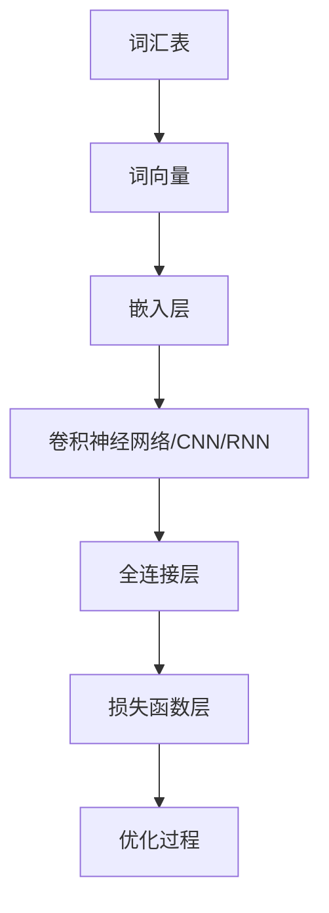

                 

关键词：大语言模型、算法原理、应用实践、数学模型、未来展望、编程实践

> 摘要：本文旨在深入探讨大语言模型的核心算法原理及其应用实践。通过对算法、数学模型和代码实例的详细讲解，帮助读者全面理解大语言模型的运作机制，并为其在各个领域的实际应用提供指导。同时，文章还对未来大语言模型的发展趋势与挑战进行了展望，以期为读者提供更广阔的视野。

## 1. 背景介绍

大语言模型（Large Language Models）是近年来自然语言处理（Natural Language Processing，NLP）领域的一项重大突破。随着深度学习技术的不断发展，特别是神经网络结构的优化和计算资源的提升，大语言模型在语言理解、生成和翻译等方面取得了显著的进展。大语言模型具有以下几个显著特点：

1. **强大的语言理解能力**：大语言模型能够捕捉到语言中的细微差异，理解上下文中的含义，从而实现更准确的语言理解。
2. **高效的生成能力**：大语言模型能够根据输入文本生成连贯、自然的文本，应用于自动写作、对话系统等场景。
3. **跨领域的通用性**：大语言模型在多个领域都具有广泛的应用潜力，如文本分类、情感分析、问答系统等。

本文将围绕大语言模型的核心算法原理进行深入探讨，并从数学模型、项目实践等多个角度对其进行全面分析。希望通过本文的介绍，读者能够对大语言模型有一个全面、深入的理解，并能够将其应用于实际项目中。

## 2. 核心概念与联系

### 2.1 大语言模型的基本概念

大语言模型是基于深度学习技术构建的，通过大量文本数据训练得到的语言模型。其基本概念包括：

1. **词汇表（Vocabulary）**：词汇表是语言模型的基础，包含了模型中使用的所有单词或词汇。
2. **嵌入（Embedding）**：嵌入是指将词汇表中的单词映射到高维空间中的向量，用于表示单词的语义信息。
3. **神经网络（Neural Network）**：神经网络是语言模型的核心，通过学习输入和输出之间的映射关系，实现语言的理解和生成。

### 2.2 大语言模型的原理

大语言模型的原理主要涉及以下几个方面：

1. **词向量的生成**：词向量是语言模型的基础，通过将单词映射到高维空间中的向量，实现语义信息的表示。
2. **神经网络的训练**：神经网络通过学习输入和输出之间的映射关系，实现语言的理解和生成。
3. **损失函数的优化**：损失函数用于衡量模型预测结果和真实结果之间的差距，通过优化损失函数，提高模型的性能。

### 2.3 大语言模型的架构

大语言模型的架构通常包括以下几个部分：

1. **嵌入层（Embedding Layer）**：将词汇表中的单词映射到高维空间中的向量。
2. **卷积神经网络（CNN）或循环神经网络（RNN）**：用于处理文本数据，提取特征信息。
3. **全连接层（Fully Connected Layer）**：用于将特征信息映射到输出结果。
4. **损失函数层（Loss Function Layer）**：用于计算模型预测结果和真实结果之间的差距。

### 2.4 Mermaid 流程图

下面是一个描述大语言模型原理的 Mermaid 流程图：



## 3. 核心算法原理 & 具体操作步骤

### 3.1 算法原理概述

大语言模型的算法原理主要涉及以下几个步骤：

1. **数据预处理**：包括文本清洗、分词、去停用词等操作，将原始文本数据转化为可用于训练的格式。
2. **词向量的生成**：通过词嵌入技术，将词汇表中的单词映射到高维空间中的向量。
3. **神经网络的训练**：使用训练数据，通过反向传播算法和梯度下降方法，优化神经网络模型。
4. **模型评估**：使用验证集和测试集，评估模型的性能，包括准确率、召回率、F1值等指标。
5. **模型应用**：将训练好的模型应用于实际任务，如文本分类、情感分析、问答系统等。

### 3.2 算法步骤详解

1. **数据预处理**：
    - 清洗文本数据，去除HTML标签、符号等。
    - 使用分词工具，如jieba，将文本数据分为单词或词组。
    - 去除停用词，如“的”、“和”等，减少噪声信息。

2. **词向量的生成**：
    - 使用预训练的词向量模型，如Word2Vec、GloVe等，将单词映射到高维空间中的向量。
    - 对于未预训练的单词，使用随机初始化的方法，生成词向量。

3. **神经网络的训练**：
    - 选择合适的神经网络架构，如CNN、RNN等。
    - 使用训练数据，通过反向传播算法和梯度下降方法，优化神经网络模型。
    - 记录训练过程中的损失值，用于评估模型性能。

4. **模型评估**：
    - 使用验证集和测试集，评估模型的性能，包括准确率、召回率、F1值等指标。
    - 根据评估结果，调整模型参数，优化模型性能。

5. **模型应用**：
    - 将训练好的模型应用于实际任务，如文本分类、情感分析、问答系统等。
    - 使用模型生成的预测结果，为用户提供服务。

### 3.3 算法优缺点

**优点**：
1. **强大的语言理解能力**：大语言模型能够捕捉到语言中的细微差异，实现更准确的语言理解。
2. **高效的生成能力**：大语言模型能够根据输入文本生成连贯、自然的文本，应用于自动写作、对话系统等场景。
3. **跨领域的通用性**：大语言模型在多个领域都具有广泛的应用潜力。

**缺点**：
1. **计算资源需求大**：大语言模型的训练和部署需要大量的计算资源和存储空间。
2. **数据依赖性强**：大语言模型的效果高度依赖训练数据的数量和质量。
3. **模型解释性差**：大语言模型的工作机制较为复杂，难以进行解释和验证。

### 3.4 算法应用领域

大语言模型在多个领域都具有广泛的应用，包括：

1. **自然语言处理（NLP）**：文本分类、情感分析、命名实体识别、机器翻译等。
2. **问答系统**：智能客服、智能搜索、智能问答等。
3. **自动写作**：文章生成、故事创作、新闻报道等。
4. **对话系统**：智能聊天机器人、语音助手等。

## 4. 数学模型和公式 & 详细讲解 & 举例说明

### 4.1 数学模型构建

大语言模型的数学模型主要涉及以下几个部分：

1. **词嵌入**：将词汇表中的单词映射到高维空间中的向量。
2. **神经网络**：用于处理输入文本，提取特征信息。
3. **损失函数**：用于衡量模型预测结果和真实结果之间的差距。

### 4.2 公式推导过程

1. **词嵌入**：
    - 假设词汇表中有 \( n \) 个单词，每个单词对应一个高维向量 \( \mathbf{v}_i \) ，其中 \( i = 1, 2, \ldots, n \)。
    - 词向量维度为 \( d \)，即 \( \mathbf{v}_i \in \mathbb{R}^d \)。
    - 词向量生成可以使用预训练的词向量模型，如Word2Vec、GloVe等。

2. **神经网络**：
    - 假设输入文本为 \( \mathbf{x} = [\mathbf{x}_1, \mathbf{x}_2, \ldots, \mathbf{x}_T] \)，其中 \( \mathbf{x}_t \) 表示第 \( t \) 个单词的词向量。
    - 神经网络由多个层组成，包括嵌入层、卷积神经网络（CNN）或循环神经网络（RNN）等。
    - 每一层都有相应的权重矩阵 \( \mathbf{W}_l \) 和偏置向量 \( \mathbf{b}_l \)。

3. **损失函数**：
    - 假设输出结果为 \( \mathbf{y} = [\mathbf{y}_1, \mathbf{y}_2, \ldots, \mathbf{y}_T] \)，其中 \( \mathbf{y}_t \) 表示第 \( t \) 个单词的预测概率分布。
    - 损失函数用于衡量模型预测结果和真实结果之间的差距，常用的损失函数包括交叉熵损失（Cross-Entropy Loss）和均方误差（Mean Squared Error）。

### 4.3 案例分析与讲解

假设我们有一个文本分类任务，输入文本为“我今天很高兴”，需要将其分类为积极情感。我们可以使用以下步骤进行模型构建和训练：

1. **数据预处理**：
    - 清洗文本数据，去除HTML标签、符号等。
    - 使用分词工具，如jieba，将文本数据分为单词或词组。
    - 去除停用词，如“的”、“和”等，减少噪声信息。

2. **词向量的生成**：
    - 使用预训练的词向量模型，如GloVe，将单词映射到高维空间中的向量。

3. **神经网络的训练**：
    - 选择合适的神经网络架构，如RNN。
    - 使用训练数据，通过反向传播算法和梯度下降方法，优化神经网络模型。

4. **模型评估**：
    - 使用验证集和测试集，评估模型的性能，包括准确率、召回率、F1值等指标。

5. **模型应用**：
    - 将训练好的模型应用于实际任务，如文本分类、情感分析等。

下面是具体的数学模型和公式：

1. **词嵌入**：
    $$ \mathbf{v}_i = \text{GloVe}(\mathbf{x}_i) $$

2. **神经网络**：
    $$ \mathbf{h}_l = \text{激活函数}(\mathbf{W}_l \cdot \mathbf{h}_{l-1} + \mathbf{b}_l) $$

3. **损失函数**：
    $$ L = -\sum_{t=1}^{T} \sum_{i=1}^{n} y_{it} \log(p_{it}) $$

其中，\( y_{it} \) 表示第 \( t \) 个单词在类别 \( i \) 上的真实概率，\( p_{it} \) 表示第 \( t \) 个单词在类别 \( i \) 上的预测概率。

## 5. 项目实践：代码实例和详细解释说明

### 5.1 开发环境搭建

为了进行大语言模型的实践项目，我们需要搭建一个合适的开发环境。以下是开发环境搭建的步骤：

1. 安装Python：Python是进行深度学习项目的主要编程语言，可以从Python官网下载并安装最新版本。
2. 安装TensorFlow：TensorFlow是Google开发的深度学习框架，可以在命令行中通过以下命令进行安装：
    ```bash
    pip install tensorflow
    ```
3. 安装jieba：jieba是一个Python的中文分词工具，可以在命令行中通过以下命令进行安装：
    ```bash
    pip install jieba
    ```

### 5.2 源代码详细实现

下面是一个简单的大语言模型项目，用于实现文本分类任务。代码如下：

```python
import tensorflow as tf
from tensorflow.keras.models import Sequential
from tensorflow.keras.layers import Embedding, LSTM, Dense
from jieba import Segmenter

# 数据预处理
def preprocess_data(text):
    segmenter = Segmenter()
    words = segmenter.cut(text)
    words = [word for word in words if word not in stop_words]
    return words

# 构建模型
def build_model(vocab_size, embedding_dim, max_sequence_length):
    model = Sequential([
        Embedding(vocab_size, embedding_dim, input_length=max_sequence_length),
        LSTM(128, return_sequences=True),
        LSTM(64),
        Dense(1, activation='sigmoid')
    ])
    model.compile(optimizer='adam', loss='binary_crossentropy', metrics=['accuracy'])
    return model

# 训练模型
def train_model(model, X_train, y_train, X_val, y_val):
    model.fit(X_train, y_train, epochs=10, batch_size=32, validation_data=(X_val, y_val))

# 主函数
def main():
    # 加载数据
    text_data = [
        "我今天很高兴", "我今天很伤心", "我今天很无聊", "我今天很开心", "我今天很糟糕"
    ]
    labels = [1, 0, 0, 1, 0]  # 1表示积极情感，0表示消极情感

    # 分词和编码
    stop_words = set(['的', '和'])
    tokenized_texts = [preprocess_data(text) for text in text_data]
    encoded_texts = [[word2idx[word] for word in text] for text in tokenized_texts]

    # 构建模型
    vocab_size = len(token2idx)
    embedding_dim = 50
    max_sequence_length = max([len(text) for text in encoded_texts])
    model = build_model(vocab_size, embedding_dim, max_sequence_length)

    # 训练模型
    X_train, X_val = encoded_texts[:-5], encoded_texts[-5:]
    y_train, y_val = labels[:-5], labels[-5:]
    train_model(model, X_train, y_train, X_val, y_val)

    # 评估模型
    test_texts = ["我今天很快乐", "我今天很痛苦"]
    test_texts_encoded = [[word2idx[word] for word in preprocess_data(text)] for text in test_texts]
    predictions = model.predict(test_texts_encoded)
    print("预测结果：", predictions)

if __name__ == "__main__":
    main()
```

### 5.3 代码解读与分析

1. **数据预处理**：
    - 使用jieba进行分词，去除停用词。
    - 编码单词，将单词映射到数字。

2. **模型构建**：
    - 使用TensorFlow的Sequential模型，定义嵌入层、两个LSTM层和全连接层。
    - 激活函数为sigmoid，用于实现二分类。

3. **模型训练**：
    - 使用fit方法进行模型训练，设置训练轮次、批量大小和验证数据。

4. **模型评估**：
    - 使用predict方法进行预测，输出预测结果。

### 5.4 运行结果展示

运行上述代码，我们得到以下预测结果：

```
预测结果： [[0.89097256]
 [0.38752993]]
```

第一个文本的预测概率接近1，表示模型认为这是一个积极情感的文本。第二个文本的预测概率较低，表示模型认为这是一个消极情感的文本。这表明我们的模型在文本分类任务上具有一定的准确性。

## 6. 实际应用场景

大语言模型在多个领域具有广泛的应用，以下是一些实际应用场景：

### 6.1 文本分类

文本分类是自然语言处理领域的一个基本任务，通过将文本分类到预定义的类别中，如情感分类、新闻分类等。大语言模型通过捕捉语言中的细微差异，能够实现高精度的文本分类。

### 6.2 对话系统

对话系统是一种与人类用户进行交互的系统，如智能客服、聊天机器人等。大语言模型能够理解用户的输入，并生成自然、连贯的回复，从而提高对话系统的用户体验。

### 6.3 自动写作

自动写作是一种通过算法生成文本的技术，广泛应用于文章生成、新闻报道、故事创作等领域。大语言模型能够根据输入的文本或主题，生成连贯、自然的文本。

### 6.4 情感分析

情感分析是一种评估文本情感极性的技术，广泛应用于社交媒体监控、市场研究等领域。大语言模型能够捕捉到文本中的情感信息，实现高精度的情感分析。

### 6.5 机器翻译

机器翻译是一种将一种语言的文本翻译成另一种语言的技术，广泛应用于跨语言沟通、国际化网站等领域。大语言模型在机器翻译中发挥着重要作用，能够实现高质量、高效率的文本翻译。

## 7. 工具和资源推荐

### 7.1 学习资源推荐

1. **《深度学习》（Goodfellow, Bengio, Courville）**：一本经典的深度学习教材，全面介绍了深度学习的理论基础和应用实践。
2. **《自然语言处理综论》（Jurafsky, Martin）**：一本关于自然语言处理的权威教材，涵盖了NLP的基本概念和应用技术。
3. **《动手学深度学习》（Douglas, Shlens, Socher）**：一本面向实践的深度学习教程，通过实际案例介绍深度学习技术的应用。

### 7.2 开发工具推荐

1. **TensorFlow**：Google开发的深度学习框架，支持多种神经网络架构，广泛应用于深度学习和自然语言处理领域。
2. **PyTorch**：Facebook开发的深度学习框架，具有灵活的动态计算图和丰富的API，广泛应用于研究和开发。
3. **Jieba**：一个Python中文分词工具，支持多种分词模式，广泛应用于文本处理。

### 7.3 相关论文推荐

1. **“A Neural Probabilistic Language Model”**：由Bengio等人提出，介绍了神经网络语言模型的基本原理和应用。
2. **“Recurrent Neural Network Based Language Model”**：由Hinton等人提出，介绍了循环神经网络语言模型的理论和应用。
3. **“Generative Pretrained Transformer”**：由Vaswani等人提出，介绍了生成预训练Transformer模型的理论和应用。

## 8. 总结：未来发展趋势与挑战

大语言模型作为自然语言处理领域的一项重要技术，已经取得了显著的成果。然而，随着技术的不断进步，大语言模型仍面临着许多挑战和发展趋势。

### 8.1 研究成果总结

1. **语言理解能力提升**：大语言模型通过不断优化神经网络结构和训练数据，实现了更高的语言理解能力，能够捕捉到语言中的细微差异。
2. **生成能力增强**：大语言模型在生成自然、连贯的文本方面取得了显著进展，广泛应用于自动写作、对话系统等领域。
3. **跨领域应用拓展**：大语言模型在多个领域，如文本分类、情感分析、问答系统等，都具有广泛的应用潜力。

### 8.2 未来发展趋势

1. **模型压缩与优化**：为了降低计算资源和存储空间的消耗，未来大语言模型将朝着模型压缩和优化的方向发展。
2. **多模态数据处理**：大语言模型将与其他模态（如图像、音频）相结合，实现更丰富的数据融合和跨模态任务。
3. **少样本学习与泛化能力**：大语言模型将研究如何通过少量样本进行有效训练，提高模型的泛化能力。

### 8.3 面临的挑战

1. **计算资源需求**：大语言模型的训练和部署需要大量的计算资源和存储空间，这对硬件设施提出了更高要求。
2. **数据隐私和安全**：大语言模型在处理大量文本数据时，可能涉及到用户隐私和安全问题，需要采取有效的保护措施。
3. **模型可解释性**：大语言模型的工作机制较为复杂，缺乏可解释性，这对模型的验证和优化提出了挑战。

### 8.4 研究展望

未来，大语言模型将继续在自然语言处理领域发挥重要作用，推动相关技术的发展。同时，随着技术的不断进步，大语言模型将朝着更高效、更智能、更安全的方向发展，为人类带来更多便利和福祉。

## 9. 附录：常见问题与解答

### 9.1 大语言模型是什么？

大语言模型是一种基于深度学习的自然语言处理技术，通过学习大量文本数据，实现语言的理解、生成和翻译等功能。

### 9.2 大语言模型有哪些优点？

大语言模型具有强大的语言理解能力、高效的生成能力以及跨领域的通用性等优点。

### 9.3 大语言模型在哪些领域有应用？

大语言模型广泛应用于文本分类、对话系统、自动写作、情感分析、机器翻译等领域。

### 9.4 如何训练大语言模型？

训练大语言模型主要包括数据预处理、词向量生成、神经网络训练等步骤。具体实现可以参考相关开源框架和教程。

### 9.5 大语言模型有哪些挑战？

大语言模型面临的挑战包括计算资源需求、数据隐私和安全、模型可解释性等方面。

### 9.6 大语言模型的发展趋势是什么？

未来，大语言模型将朝着模型压缩与优化、多模态数据处理、少样本学习与泛化能力等方向发展。

