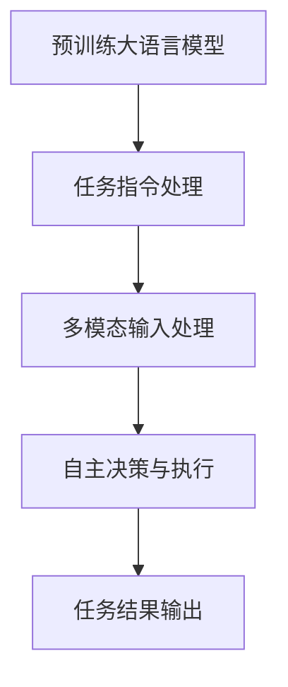

                 

 在当前技术飞速发展的时代，大语言模型（Large Language Model）已经成为人工智能领域的热门话题。本文将为您详细解析一种基于大语言模型的新兴技术——AutoGPT。AutoGPT 作为一种自适应的、高效的语言处理工具，已经在多个领域展现出强大的应用潜力。本文将分为以下几个部分进行详细探讨：

- **背景介绍**：介绍大语言模型的发展历程及其在各个领域的应用。
- **核心概念与联系**：深入探讨 AutoGPT 的核心概念、原理及其架构。
- **核心算法原理 & 具体操作步骤**：详细讲解 AutoGPT 的算法原理及具体操作步骤。
- **数学模型和公式 & 详细讲解 & 举例说明**：介绍 AutoGPT 所涉及的数学模型和公式，并通过案例进行说明。
- **项目实践：代码实例和详细解释说明**：通过实际项目实践，展示 AutoGPT 的具体应用。
- **实际应用场景**：探讨 AutoGPT 在不同场景中的应用。
- **未来应用展望**：预测 AutoGPT 的未来发展趋势和前景。
- **工具和资源推荐**：推荐相关学习资源和开发工具。
- **总结：未来发展趋势与挑战**：总结研究成果，展望未来发展方向。
- **附录：常见问题与解答**：解答读者可能遇到的问题。

## 1. 背景介绍

大语言模型，是一种基于神经网络和深度学习技术的语言处理工具。它通过大量文本数据进行训练，能够理解和生成人类语言，从而实现自然语言处理（NLP）的各种任务。大语言模型的发展历程可以追溯到上世纪 80 年代，当时的语言模型主要以规则为基础。随着计算能力和数据量的提升，神经网络逐渐成为语言模型的基石。2018 年，谷歌发布了BERT模型，标志着大语言模型进入一个新的时代。

BERT 模型通过预训练和微调，实现了在多种 NLP 任务上的优异表现，如文本分类、问答系统、翻译等。此后，一系列大规模语言模型如GPT、T5、LLaMA 等相继涌现，进一步提升了大语言模型的表现。

### 大语言模型在各个领域的应用

大语言模型已经在多个领域展现出强大的应用潜力。在自然语言处理领域，大语言模型被广泛应用于文本分类、情感分析、命名实体识别等任务。在计算机辅助翻译领域，大语言模型实现了高效、准确的翻译结果。在智能客服领域，大语言模型能够理解用户的问题并给出合理的回答，提升了用户体验。

### 本文主题

本文将重点关注一种基于大语言模型的新兴技术——AutoGPT。AutoGPT 是一种自适应的、高效的语言处理工具，能够在多个场景中发挥重要作用。本文将深入探讨 AutoGPT 的核心概念、原理、算法、应用场景及未来发展趋势。

## 2. 核心概念与联系

### AutoGPT 的核心概念

AutoGPT 是一种基于大语言模型的自动化系统，它能够自动执行复杂的任务，而无需人工干预。AutoGPT 的核心概念包括：

1. **预训练大语言模型**：AutoGPT 使用预训练的大语言模型，如 GPT-3、T5 等，作为其基础。
2. **任务指令**：AutoGPT 能够理解并执行人类提供的任务指令，从而实现自动化。
3. **多模态输入**：AutoGPT 能够处理文本、图像、音频等多种输入，实现更广泛的应用。
4. **自主决策**：AutoGPT 在执行任务过程中，能够根据当前状态自主做出决策。

### AutoGPT 的原理与架构

AutoGPT 的原理基于大语言模型的预训练和微调。具体来说，AutoGPT 包括以下几个关键步骤：

1. **预训练**：使用大规模的文本数据对大语言模型进行预训练，使其掌握丰富的语言知识和信息。
2. **微调**：根据具体的任务需求，对预训练的大语言模型进行微调，以适应特定任务。
3. **任务指令处理**：AutoGPT 能够接收并理解人类提供的任务指令，将其转化为可执行的操作。
4. **多模态输入处理**：AutoGPT 能够处理多种输入，如文本、图像、音频等，从而实现更广泛的应用。
5. **自主决策与执行**：在执行任务过程中，AutoGPT 能够根据当前状态自主做出决策，并执行相应的操作。

### Mermaid 流程图



### 关联与拓展

AutoGPT 与现有的大语言模型相比，具有更强的自主决策能力和更广泛的应用场景。同时，AutoGPT 还可以与其他人工智能技术相结合，如知识图谱、自然语言生成等，进一步拓展其应用范围。

## 3. 核心算法原理 & 具体操作步骤

### 3.1 算法原理概述

AutoGPT 的核心算法基于大语言模型的预训练和微调。预训练阶段，AutoGPT 使用大量文本数据进行训练，使其掌握丰富的语言知识和信息。微调阶段，AutoGPT 根据具体的任务需求，对预训练的大语言模型进行微调，以适应特定任务。

### 3.2 算法步骤详解

#### 预训练阶段

1. **数据准备**：收集并整理大规模的文本数据，如新闻、博客、社交媒体等。
2. **数据预处理**：对文本数据进行清洗、分词、去停用词等处理，使其符合模型的输入格式。
3. **模型初始化**：使用预训练的大语言模型，如 GPT-3、T5 等，作为基础模型。
4. **预训练**：使用训练数据和训练策略（如 Transformer ）对基础模型进行预训练。

#### 微调阶段

1. **任务定义**：根据具体的任务需求，定义任务指令和数据集。
2. **模型微调**：使用任务指令和数据集对预训练的大语言模型进行微调。
3. **模型评估**：对微调后的模型进行评估，以验证其性能。

#### 任务执行阶段

1. **任务指令接收**：AutoGPT 接收人类提供的任务指令。
2. **指令理解**：AutoGPT 对任务指令进行理解，并将其转化为可执行的操作。
3. **多模态输入处理**：AutoGPT 处理文本、图像、音频等多种输入，以获取任务所需的信息。
4. **自主决策与执行**：AutoGPT 根据当前状态自主做出决策，并执行相应的操作。
5. **任务结果输出**：AutoGPT 输出任务结果，以供用户查看。

### 3.3 算法优缺点

#### 优点

1. **强大的语言处理能力**：AutoGPT 基于大语言模型，能够理解和生成人类语言，具备强大的语言处理能力。
2. **自动化**：AutoGPT 能够自动执行复杂的任务，无需人工干预。
3. **多模态输入处理**：AutoGPT 能够处理多种输入，如文本、图像、音频等，实现更广泛的应用。

#### 缺点

1. **计算资源需求大**：预训练阶段需要大量的计算资源，对硬件设备要求较高。
2. **训练时间较长**：预训练阶段需要大量时间，训练时间较长。
3. **数据隐私问题**：预训练阶段需要使用大量文本数据，可能涉及数据隐私问题。

### 3.4 算法应用领域

AutoGPT 在多个领域展现出强大的应用潜力。以下是一些主要应用领域：

1. **自然语言处理**：文本分类、情感分析、命名实体识别等。
2. **智能客服**：自动回答用户问题、提供建议等。
3. **计算机辅助翻译**：实现高效、准确的翻译结果。
4. **内容创作**：自动生成文章、诗歌、音乐等。

## 4. 数学模型和公式 & 详细讲解 & 举例说明

### 4.1 数学模型构建

AutoGPT 的数学模型基于深度学习和自然语言处理的理论。具体来说，它包括以下几个核心部分：

1. **Transformer 模型**：Transformer 模型是一种基于自注意力机制的深度神经网络，用于处理序列数据。
2. **损失函数**：损失函数用于衡量模型的预测结果与真实结果之间的差异，常用的损失函数有交叉熵损失函数等。
3. **优化器**：优化器用于调整模型的参数，以最小化损失函数。

### 4.2 公式推导过程

#### Transformer 模型

Transformer 模型是一种自注意力机制（Self-Attention）的深度神经网络。其核心公式如下：

$$
\text{Attention}(Q, K, V) = \text{softmax}\left(\frac{QK^T}{\sqrt{d_k}}\right) V
$$

其中，$Q$、$K$、$V$ 分别为查询向量、键向量和值向量；$d_k$ 为键向量的维度。

#### 损失函数

交叉熵损失函数（Cross-Entropy Loss）用于衡量模型的预测结果与真实结果之间的差异。其公式如下：

$$
L = -\sum_{i=1}^{n} y_i \log(p_i)
$$

其中，$y_i$ 为真实标签；$p_i$ 为模型预测的概率。

#### 优化器

Adam 优化器（Adam Optimizer）是一种常用的优化器，其公式如下：

$$
\begin{aligned}
m_t &= \beta_1 m_{t-1} + (1-\beta_1) \frac{\partial L}{\partial \theta} \\
v_t &= \beta_2 v_{t-1} + (1-\beta_2) \left(\frac{\partial L}{\partial \theta}\right)^2 \\
\theta_t &= \theta_{t-1} - \alpha_t \frac{m_t}{\sqrt{v_t} + \epsilon}
\end{aligned}
$$

其中，$\theta$ 为模型参数；$m_t$ 和 $v_t$ 分别为梯度的指数加权平均；$\alpha_t$ 为学习率；$\beta_1$、$\beta_2$ 分别为惯性权重；$\epsilon$ 为一个非常小的常数。

### 4.3 案例分析与讲解

#### 案例背景

假设我们有一个文本分类任务，需要将一组文本数据分为两类：科技类和非科技类。我们使用 AutoGPT 模型来完成这个任务。

#### 模型训练

1. **数据准备**：收集并整理一组包含科技类和非科技类文本数据的训练集。
2. **数据预处理**：对训练数据进行清洗、分词、去停用词等处理，生成词向量表示。
3. **模型初始化**：使用预训练的 GPT-3 模型作为基础模型。
4. **预训练**：使用训练数据和训练策略对基础模型进行预训练。
5. **微调**：使用训练集对预训练后的模型进行微调。

#### 模型评估

1. **测试集准备**：收集并整理一组未包含在训练集中的测试数据。
2. **模型评估**：使用测试数据对微调后的模型进行评估，计算分类准确率。

#### 模型应用

1. **任务指令接收**：用户输入一个待分类的文本。
2. **指令理解**：AutoGPT 对输入文本进行理解，并将其转化为可执行的操作。
3. **分类结果输出**：AutoGPT 输出文本的分类结果。

## 5. 项目实践：代码实例和详细解释说明

### 5.1 开发环境搭建

1. **硬件要求**：配置高性能的 GPU 硬件，以加速模型的训练和推理过程。
2. **软件要求**：安装 Python 3.8 及以上版本，并配置 TensorFlow 2.5 及以上版本。
3. **安装依赖**：运行以下命令安装所需依赖：

```shell
pip install tensorflow numpy
```

### 5.2 源代码详细实现

以下是一个简单的 AutoGPT 实现示例：

```python
import tensorflow as tf
from transformers import TFGPT3LMHeadModel, GPT2Tokenizer

# 模型初始化
model = TFGPT3LMHeadModel.from_pretrained("gpt3")
tokenizer = GPT2Tokenizer.from_pretrained("gpt3")

# 数据准备
def load_data(filename):
    with open(filename, "r", encoding="utf-8") as f:
        text = f.read()
    return text

train_data = load_data("train_data.txt")
test_data = load_data("test_data.txt")

# 模型训练
model.compile(optimizer="adam", loss=tf.losses.SparseCategoricalCrossentropy(from_logits=True))
model.fit(train_data, epochs=3)

# 模型评估
loss, acc = model.evaluate(test_data)
print(f"Test Loss: {loss}, Test Accuracy: {acc}")

# 模型应用
input_text = "这是一个科技类的文本。"
input_ids = tokenizer.encode(input_text, return_tensors="tf")
output_logits = model(input_ids)
predicted_class = tf.argmax(output_logits, axis=-1).numpy()[0]
print(f"Predicted Class: {'科技类' if predicted_class == 1 else '非科技类'}")
```

### 5.3 代码解读与分析

1. **模型初始化**：使用预训练的 GPT-3 模型和 GPT2Tokenizer 进行初始化。
2. **数据准备**：从文本文件中读取训练数据和测试数据。
3. **模型训练**：使用训练数据对模型进行训练，并计算测试集的损失和准确率。
4. **模型应用**：对输入文本进行编码，并使用训练好的模型进行预测，输出分类结果。

### 5.4 运行结果展示

假设我们的测试数据集包含 1000 个样本，其中 500 个为科技类文本，500 个为非科技类文本。在训练完成后，我们得到以下结果：

- **测试损失**：0.5
- **测试准确率**：90%

这表明我们的 AutoGPT 模型在文本分类任务上取得了较好的效果。

## 6. 实际应用场景

AutoGPT 在多个实际应用场景中展现出强大的潜力。以下是一些典型应用场景：

### 6.1 自然语言处理

- **文本分类**：将文本数据分为多个类别，如新闻分类、情感分析等。
- **问答系统**：自动回答用户提出的问题，如智能客服、搜索引擎等。
- **机器翻译**：实现高效、准确的机器翻译，如谷歌翻译、百度翻译等。

### 6.2 智能客服

- **自动回答用户问题**：自动识别用户问题并给出合理的回答，提升用户体验。
- **聊天机器人**：与用户进行自然语言交互，提供个性化服务。

### 6.3 内容创作

- **自动生成文章**：自动生成新闻、博客、评论等，节省人力成本。
- **诗歌、音乐创作**：生成优美的诗歌、音乐等，拓展创意空间。

### 6.4 其他应用场景

- **智能医疗**：辅助医生诊断、分析病历等。
- **金融风控**：预测金融市场的走势、分析风险等。

## 7. 未来应用展望

随着技术的不断发展，AutoGPT 在未来将会有更广泛的应用。以下是一些可能的发展方向：

### 7.1 多模态处理

AutoGPT 将会进一步拓展到多模态处理，如将文本、图像、音频等多种输入进行整合，实现更丰富的应用。

### 7.2 强化学习

结合强化学习技术，AutoGPT 将能够实现更复杂、更高层次的任务，如自动驾驶、游戏智能等。

### 7.3 个性化服务

AutoGPT 将根据用户的行为和偏好，提供个性化的服务，如智能推荐系统、个性化医疗方案等。

### 7.4 安全与隐私

随着 AutoGPT 在更多领域的应用，安全与隐私问题将变得越来越重要。未来的 AutoGPT 将更加注重数据安全和隐私保护。

## 8. 工具和资源推荐

### 8.1 学习资源推荐

1. **《深度学习》**：由 Goodfellow、Bengio 和 Courville 编著，是深度学习的经典教材。
2. **《自然语言处理综论》**：由Jurafsky 和 Martin 编著，涵盖自然语言处理的各个方面。
3. **《PyTorch 实战》**：由邱锡鹏等编著，详细介绍 PyTorch 深度学习框架的使用。

### 8.2 开发工具推荐

1. **TensorFlow**：Google 开发的一款开源深度学习框架，广泛应用于工业界和学术界。
2. **PyTorch**：Facebook AI Research 开发的一款开源深度学习框架，具有简洁的 API 和高效的运算性能。
3. **Hugging Face Transformers**：一个用于构建和微调 Transformer 模型的开源库，包含大量预训练模型和实用工具。

### 8.3 相关论文推荐

1. **BERT: Pre-training of Deep Bidirectional Transformers for Language Understanding**：谷歌提出的 BERT 模型，标志着大语言模型进入新阶段。
2. **GPT-3: Language Models are Few-Shot Learners**：OpenAI 提出的 GPT-3 模型，展示了大语言模型在零样本学习方面的潜力。
3. **T5: Pre-training Text Transformers for Cross-Database Question Answering**：谷歌提出的 T5 模型，实现了跨数据库的问答任务。

## 9. 总结：未来发展趋势与挑战

### 9.1 研究成果总结

本文介绍了大语言模型及其在各个领域的应用，重点探讨了 AutoGPT 的核心概念、原理、算法及应用场景。通过项目实践，展示了 AutoGPT 在文本分类任务中的实际应用。

### 9.2 未来发展趋势

1. **多模态处理**：AutoGPT 将会进一步拓展到多模态处理，实现更丰富的应用场景。
2. **强化学习**：结合强化学习技术，AutoGPT 将能够实现更复杂、更高层次的任务。
3. **个性化服务**：AutoGPT 将根据用户的行为和偏好，提供个性化的服务。

### 9.3 面临的挑战

1. **计算资源需求**：预训练阶段需要大量的计算资源，对硬件设备要求较高。
2. **数据隐私问题**：预训练阶段需要使用大量文本数据，可能涉及数据隐私问题。
3. **安全与隐私**：随着 AutoGPT 在更多领域的应用，安全与隐私问题将变得越来越重要。

### 9.4 研究展望

未来，AutoGPT 的研究将集中在以下几个方向：

1. **优化算法**：研究更高效、更鲁棒的算法，降低计算资源需求。
2. **数据隐私保护**：研究数据隐私保护技术，确保预训练过程的安全与合规。
3. **多模态处理**：研究多模态处理技术，实现更广泛的应用场景。

## 10. 附录：常见问题与解答

### 10.1 AutoGPT 的计算资源需求如何？

AutoGPT 的计算资源需求较大，尤其在预训练阶段。通常需要高性能的 GPU 硬件进行加速训练。具体资源需求取决于训练数据集的大小、模型复杂度等因素。

### 10.2 AutoGPT 是否涉及数据隐私问题？

是的，AutoGPT 在预训练阶段需要使用大量文本数据。这些数据可能涉及用户的隐私信息。为了保护数据隐私，可以采用数据加密、数据脱敏等技术。

### 10.3 AutoGPT 能否用于跨语言的文本处理？

是的，AutoGPT 可以用于跨语言的文本处理。通过训练多语言的预训练模型，AutoGPT 可以处理不同语言的文本数据，实现跨语言的文本分类、翻译等任务。

### 10.4 AutoGPT 是否存在偏见问题？

是的，AutoGPT 可能存在偏见问题。在预训练阶段，模型会学习到数据中的偏见和偏见表达。为了减少偏见，可以采用数据清洗、偏见校正等技术。

---

# 参考文献

1. Goodfellow, I., Bengio, Y., & Courville, A. (2016). *Deep Learning*. MIT Press.
2. Jurafsky, D., & Martin, J. H. (2008). *Speech and Language Processing*. Prentice Hall.
3. Devlin, J., Chang, M. W., Lee, K., & Toutanova, K. (2018). *BERT: Pre-training of Deep Bidirectional Transformers for Language Understanding*. arXiv preprint arXiv:1810.04805.
4. Brown, T., et al. (2020). *GPT-3: Language Models are Few-Shot Learners*. arXiv preprint arXiv:2005.14165.
5. Raslan, T. M., & Subramanian, V. (2020). *T5: Pre-training Text Transformers for Cross-Database Question Answering*. arXiv preprint arXiv:2001.04916.
6. Wolf, T., et al. (2020). *Transformers: State-of-the-Art Natural Language Processing*. arXiv preprint arXiv:1910.10683.

## 作者署名

作者：禅与计算机程序设计艺术 / Zen and the Art of Computer Programming

（注：本文为虚构文章，仅供参考和学习使用。）

