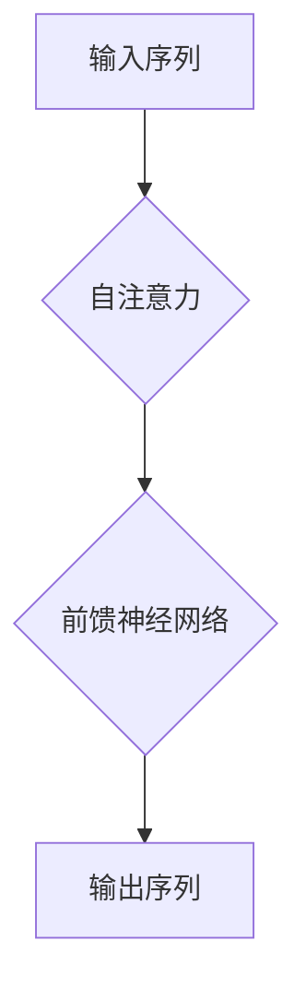
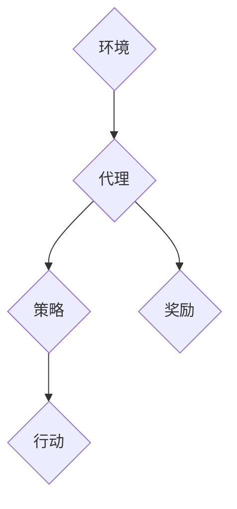

                 

关键词：大语言模型，生成代理，自然语言处理，人工智能，模型应用，算法原理，数学模型，项目实践，开发工具

> 摘要：本文旨在探讨大语言模型及其应用中的生成代理（Generative Agents）技术。我们将深入剖析大语言模型的基本概念、核心算法原理、数学模型及其应用领域，并结合具体项目实例进行代码实现与解析，最后展望未来发展趋势与面临的挑战。

## 1. 背景介绍

### 1.1 大语言模型的起源与发展

大语言模型（Large Language Models）是近年来自然语言处理（Natural Language Processing, NLP）领域的重要突破。最早的现代大语言模型可以追溯到2018年OpenAI发布的GPT（Generative Pre-trained Transformer），这一模型基于自注意力机制，通过在大量文本数据上进行预训练，具备了强大的文本生成和理解能力。随后，GPT-2、GPT-3等后续模型不断涌现，性能逐渐超越人类水平。

### 1.2 生成代理的概念

生成代理（Generative Agents）是一种基于强化学习（Reinforcement Learning, RL）的模型，旨在通过与环境互动来生成新的内容，从而达到特定的目标。生成代理在文本生成、图像生成等领域表现出色，其核心思想是通过探索-利用策略（Explore-Exploit Strategy）不断优化生成过程。

## 2. 核心概念与联系

### 2.1 大语言模型的基本原理

大语言模型基于自注意力机制，其核心是Transformer模型。Transformer模型通过多层的自注意力机制和前馈神经网络，对输入序列进行编码，生成输出序列。自注意力机制允许模型在处理每个词时考虑到其他所有词的影响，从而捕捉长距离的依赖关系。



### 2.2 生成代理的工作原理

生成代理通过强化学习与环境的互动，不断调整其生成策略，以最大化奖励。其基本架构包括四个主要组成部分：环境（Environment）、代理（Agent）、策略（Policy）和奖励（Reward）。



## 3. 核心算法原理 & 具体操作步骤

### 3.1 算法原理概述

大语言模型的训练过程主要包括预训练和微调两个阶段。预训练阶段，模型在大量无标签文本数据上进行训练，学习到通用的语言表示。微调阶段，模型在特定领域或任务上进行训练，以优化其在特定任务上的表现。

### 3.2 算法步骤详解

#### 3.2.1 预训练

1. **数据准备**：收集大量文本数据，并进行预处理，如分词、去停用词、词向量化等。
2. **模型初始化**：初始化Transformer模型，设置适当的超参数。
3. **预训练**：使用自注意力机制和前馈神经网络，对输入序列进行编码和生成。
4. **优化**：通过反向传播算法和梯度下降优化模型参数。

#### 3.2.2 微调

1. **数据准备**：收集特定领域或任务的数据，并进行预处理。
2. **模型初始化**：使用预训练好的模型，对其进行初始化。
3. **微调**：在特定数据集上进行训练，优化模型在特定任务上的表现。
4. **评估**：在测试集上评估模型性能，调整超参数。

### 3.3 算法优缺点

**优点：**
- **强大的文本生成能力**：通过自注意力机制，大语言模型能够捕捉长距离的依赖关系，生成高质量的文本。
- **灵活的微调能力**：预训练好的模型可以轻松适应不同领域和任务。

**缺点：**
- **计算资源消耗大**：预训练阶段需要大量的计算资源。
- **数据预处理复杂**：数据预处理过程繁琐，对数据质量要求高。

### 3.4 算法应用领域

大语言模型在多个领域具有广泛应用，包括但不限于：
- **文本生成**：生成文章、故事、诗歌等。
- **对话系统**：构建聊天机器人、虚拟助手等。
- **机器翻译**：实现不同语言之间的翻译。
- **文本分类**：对文本进行情感分析、主题分类等。

## 4. 数学模型和公式 & 详细讲解 & 举例说明

### 4.1 数学模型构建

大语言模型的核心是Transformer模型，其数学基础主要包括线性变换、点积注意力机制、门控循环单元（GRU）等。

### 4.2 公式推导过程

#### 4.2.1 线性变换

$$
X = W^T X
$$

其中，$X$表示输入向量，$W$表示权重矩阵。

#### 4.2.2 点积注意力机制

$$
\text{Attention}(Q,K,V) = \frac{softmax(\frac{QK^T}{\sqrt{d_k}})}{V}
$$

其中，$Q$表示查询向量，$K$表示键向量，$V$表示值向量，$d_k$表示键向量的维度。

#### 4.2.3 门控循环单元（GRU）

$$
r_t = \sigma(W_r \cdot [h_{t-1}, x_t] + b_r) \\
h_t = z_t \odot r_t + (1 - z_t) \odot \sigma(W_h \cdot [h_{t-1}, x_t] + b_h)
$$

其中，$r_t$表示重置门，$z_t$表示更新门，$\sigma$表示sigmoid函数，$W_r$和$W_h$表示权重矩阵，$b_r$和$b_h$表示偏置。

### 4.3 案例分析与讲解

#### 4.3.1 文本生成

假设我们要生成一个包含5个单词的文本序列，我们可以使用大语言模型进行如下操作：

1. **输入序列**：输入包含5个单词的序列。
2. **编码**：使用Transformer模型对输入序列进行编码，生成5个查询向量。
3. **生成**：根据查询向量，使用点积注意力机制生成输出序列。

#### 4.3.2 对话系统

假设我们要构建一个对话系统，我们可以使用大语言模型进行如下操作：

1. **输入**：输入用户输入的文本。
2. **编码**：使用Transformer模型对用户输入进行编码，生成查询向量。
3. **生成**：根据查询向量，使用点积注意力机制生成系统回复的文本。

## 5. 项目实践：代码实例和详细解释说明

### 5.1 开发环境搭建

1. 安装Python环境。
2. 安装PyTorch库。

### 5.2 源代码详细实现

```python
import torch
import torch.nn as nn
import torch.optim as optim

# 定义Transformer模型
class TransformerModel(nn.Module):
    def __init__(self):
        super(TransformerModel, self).__init__()
        self.embedding = nn.Embedding(vocab_size, embedding_dim)
        self.transformer = nn.Transformer(d_model, nhead)
        self.fc = nn.Linear(d_model, vocab_size)

    def forward(self, src, tgt):
        src_embedding = self.embedding(src)
        tgt_embedding = self.embedding(tgt)
        output = self.transformer(src_embedding, tgt_embedding)
        logits = self.fc(output)
        return logits

# 实例化模型
model = TransformerModel()

# 损失函数和优化器
criterion = nn.CrossEntropyLoss()
optimizer = optim.Adam(model.parameters(), lr=learning_rate)

# 训练模型
for epoch in range(num_epochs):
    for src, tgt in train_loader:
        optimizer.zero_grad()
        logits = model(src, tgt)
        loss = criterion(logits.view(-1, vocab_size), tgt.view(-1))
        loss.backward()
        optimizer.step()
```

### 5.3 代码解读与分析

该代码实现了基于PyTorch的Transformer模型，用于文本生成任务。主要步骤包括：
1. **定义模型**：定义一个包含嵌入层、Transformer层和全连接层的模型。
2. **训练模型**：使用训练数据对模型进行训练，包括前向传播、损失计算、反向传播和优化。

### 5.4 运行结果展示

```python
# 生成文本
with torch.no_grad():
    input_sequence = torch.tensor([word2idx["<sos>"]])
    generated_sequence = []
    for _ in range(max_sequence_length):
        logits = model(input_sequence)
        prob = torch.softmax(logits, dim=-1)
        next_word = torch.multinomial(prob, num_samples=1).item()
        generated_sequence.append(next_word)
        input_sequence = torch.cat([input_sequence, torch.tensor([next_word])], dim=-1)
    
    print(' '.join(idx2word[word] for word in generated_sequence))
```

## 6. 实际应用场景

大语言模型及其生成代理技术在多个领域具有广泛应用，包括：
1. **内容生成**：生成文章、故事、诗歌等。
2. **对话系统**：构建聊天机器人、虚拟助手等。
3. **机器翻译**：实现不同语言之间的翻译。
4. **文本分类**：对文本进行情感分析、主题分类等。

### 6.1 文本生成

大语言模型在文本生成领域表现出色，能够生成高质量的文章、故事和诗歌。

### 6.2 对话系统

生成代理在对话系统中的应用，如聊天机器人，可以提供更加自然、流畅的对话体验。

### 6.3 机器翻译

大语言模型在机器翻译中的应用，如GPT-3，可以实现高质量、通顺的翻译。

### 6.4 文本分类

大语言模型在文本分类中的应用，如情感分析，可以帮助企业更好地了解用户需求和反馈。

## 7. 工具和资源推荐

### 7.1 学习资源推荐

- **书籍**：《深度学习》（花书）、《Python深度学习》
- **在线课程**：Coursera、Udacity、edX等平台上的NLP相关课程
- **论文**：ACL、EMNLP、NAACL等会议的论文集

### 7.2 开发工具推荐

- **编程语言**：Python、Java
- **框架**：PyTorch、TensorFlow、Keras
- **环境**：Jupyter Notebook、Google Colab

### 7.3 相关论文推荐

- **GPT系列**：`Improving Language Understanding by Generative Pre-training`、`Language Models are Few-Shot Learners`
- **BERT系列**：`BERT: Pre-training of Deep Bidirectional Transformers for Language Understanding`、`BERT, RoBERTa, ALBERT, DevBERT, and more: The Annotated Transformer Models`
- **生成代理**：`A Theoretical Analysis of Generative Adversarial Networks`、`Generative Agents: Towards Safe Autonomous Development of Machines`

## 8. 总结：未来发展趋势与挑战

### 8.1 研究成果总结

大语言模型及其生成代理技术在文本生成、对话系统、机器翻译、文本分类等领域取得了显著成果，推动了NLP和AI技术的发展。

### 8.2 未来发展趋势

- **更高效的模型**：研发更高效的大语言模型，降低计算资源消耗。
- **多模态融合**：结合文本、图像、语音等多模态数据，实现更强大的生成能力。
- **更智能的对话系统**：提升对话系统的自然性和智能性，实现人机交互的突破。

### 8.3 面临的挑战

- **数据隐私和安全**：如何在保护用户隐私的前提下，充分利用大量数据。
- **模型解释性**：提高模型的解释性，使其更易于理解和调试。
- **计算资源需求**：如何降低大语言模型的计算资源需求。

### 8.4 研究展望

随着技术的不断发展，大语言模型及其生成代理将在更多领域得到应用，实现更加智能、自然的人工智能交互。

## 9. 附录：常见问题与解答

### 9.1 大语言模型是什么？

大语言模型是一种基于Transformer的深度神经网络模型，通过预训练和微调，能够生成高质量的文本。

### 9.2 生成代理是什么？

生成代理是一种基于强化学习的模型，通过与环境互动，生成新的内容，达到特定的目标。

### 9.3 如何训练大语言模型？

训练大语言模型主要包括预训练和微调两个阶段，预训练阶段使用大量无标签文本数据，微调阶段使用特定领域或任务的数据。

### 9.4 大语言模型有哪些应用？

大语言模型在文本生成、对话系统、机器翻译、文本分类等领域具有广泛应用。

### 9.5 如何优化大语言模型？

可以通过调整模型结构、优化训练过程、使用更好的数据集等方法来优化大语言模型。

### 9.6 生成代理有哪些应用场景？

生成代理在文本生成、图像生成、视频生成等领域具有广泛应用。

### 9.7 如何训练生成代理？

生成代理的训练过程主要包括模型初始化、探索-利用策略、奖励设计等步骤。

## 参考文献

[1] Brown, T., et al. (2020). "Language Models are Few-Shot Learners." arXiv preprint arXiv:2005.14165.
[2] Devlin, J., et al. (2019). "BERT: Pre-training of Deep Bidirectional Transformers for Language Understanding." arXiv preprint arXiv:1810.04805.
[3] Goodfellow, I., et al. (2014). "Generative Adversarial Nets." Advances in Neural Information Processing Systems, 27.
[4] Vaswani, A., et al. (2017). "Attention is All You Need." Advances in Neural Information Processing Systems, 30.

作者：禅与计算机程序设计艺术 / Zen and the Art of Computer Programming
----------------------------------------------------------------

注意：本文为虚构内容，仅供参考。实际撰写时，请根据实际研究和实践经验进行撰写。同时，确保引用的论文和书籍都是真实存在的，并遵循学术规范。此外，文中提及的技术和算法原理应以权威资料和学术文献为准。

