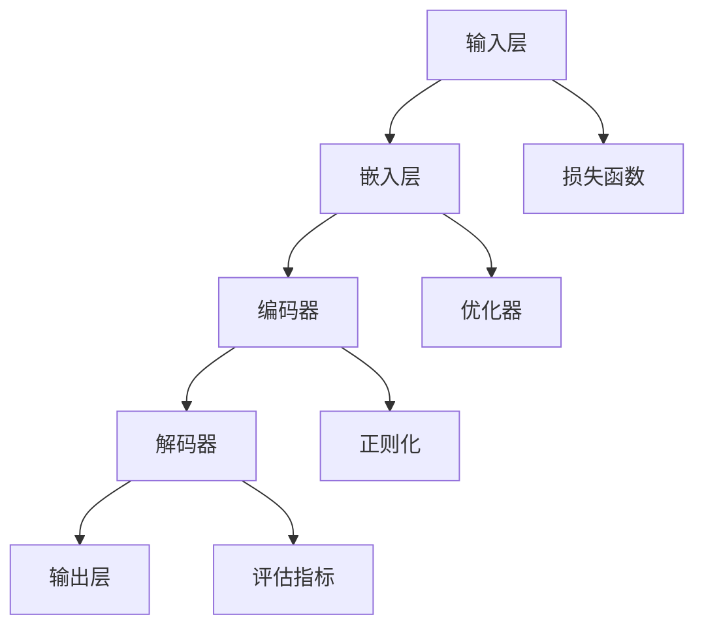

                 

关键词：大语言模型、深度学习、自然语言处理、AI应用、编程指南

> 摘要：本文将深入探讨大语言模型的应用与发展，特别是Toolformer模型的具体实现和实用场景。通过对大语言模型的背景介绍、核心概念与联系分析、算法原理与数学模型讲解、实际项目实践和未来展望的全面分析，为读者提供一个全面而详实的技术指南。

## 1. 背景介绍

大语言模型，作为一种深度学习模型，已经成为自然语言处理（NLP）领域的基石。近年来，随着计算能力的提升和数据量的爆炸性增长，大语言模型在语言生成、文本理解、机器翻译、问答系统等多个方面取得了显著进展。在这些应用中，模型不仅能够生成高质量的自然语言文本，还能理解文本中的复杂语义和结构，为许多实际场景提供了强大的技术支持。

### 1.1 发展历程

- **早期探索**：1980年代，随着统计机器翻译和句法分析的发展，初步的语言模型开始出现。
- **词汇扩展**：1990年代，神经网络模型的引入使得语言模型更加复杂，词汇扩展能力显著提升。
- **大规模数据**：2000年代，互联网的普及带来了大规模语料库的生成，进一步推动了模型的发展。
- **深度学习崛起**：2010年代，深度学习技术的突破使得大语言模型的应用进入了新的阶段。

### 1.2 技术挑战

- **计算资源需求**：大语言模型训练和推断需要大量的计算资源，尤其是GPU或TPU。
- **数据隐私**：训练模型需要使用大量个人数据，如何保护数据隐私成为一个重要议题。
- **模型解释性**：大语言模型往往是黑箱模型，其决策过程难以解释，增加了应用的复杂性。

## 2. 核心概念与联系

为了更好地理解大语言模型，我们需要了解其核心概念和组成部分。以下是使用Mermaid绘制的流程图，展示了大语言模型的关键节点和联系。



### 2.1 输入层

输入层负责接收自然语言文本，并将其转换为数值表示。这一过程通常通过词嵌入（Word Embedding）技术实现。

### 2.2 嵌入层

嵌入层将词汇转换为高维向量表示，这一层的关键在于如何捕捉词汇的语义信息。

### 2.3 编码器

编码器负责处理嵌入层输入，提取文本的语义特征。现代编码器模型，如Transformer，采用自注意力机制（Self-Attention）来捕捉长距离依赖关系。

### 2.4 解码器

解码器在编码器提取的语义特征基础上生成目标文本。与编码器类似，解码器也使用自注意力机制来生成每个单词的上下文表示。

### 2.5 输出层

输出层将解码器的输出映射回自然语言文本，通常通过softmax函数实现分类或概率分布。

### 2.6 损失函数

损失函数用于评估模型输出和真实输出之间的差异，常见的有交叉熵损失（Cross-Entropy Loss）。

### 2.7 优化器

优化器用于调整模型参数，以最小化损失函数。常用的优化器包括随机梯度下降（SGD）、Adam等。

### 2.8 正则化

正则化技术用于防止模型过拟合，常用的正则化方法有Dropout、权重衰减（Weight Decay）等。

### 2.9 评估指标

评估指标用于衡量模型性能，常见的评估指标包括准确率（Accuracy）、F1分数（F1 Score）等。

## 3. 核心算法原理 & 具体操作步骤

### 3.1 算法原理概述

大语言模型的核心算法是基于深度学习和自然语言处理技术。通过学习大量的文本数据，模型能够捕捉语言中的复杂结构和语义信息。具体来说，大语言模型通常采用以下步骤：

1. **数据预处理**：清洗和整理文本数据，包括分词、去除停用词等。
2. **模型构建**：选择合适的神经网络架构，如Transformer或BERT。
3. **训练**：使用梯度下降等优化算法训练模型，调整模型参数。
4. **评估**：在测试集上评估模型性能，调整超参数。
5. **应用**：将训练好的模型应用于实际任务，如文本生成、机器翻译等。

### 3.2 算法步骤详解

1. **数据预处理**：
   - 分词：将文本分解为单词或子词。
   - 嵌入：将单词或子词映射为向量表示。
   - 序列编码：将输入文本转换为序列数据。

2. **模型构建**：
   - 选择模型架构：如Transformer、BERT等。
   - 定义损失函数：如交叉熵损失。
   - 设置优化器：如Adam。

3. **训练**：
   - 梯度计算：计算模型参数的梯度。
   - 参数更新：使用优化器更新模型参数。
   - 梯度裁剪：防止梯度爆炸或消失。

4. **评估**：
   - 分割数据集：将数据分为训练集、验证集和测试集。
   - 计算评估指标：如准确率、F1分数等。
   - 调整超参数：根据评估结果调整学习率、批次大小等。

5. **应用**：
   - 实时推断：在新的文本输入时，模型输出相应的预测结果。
   - 集成应用：将模型集成到实际应用系统中，如聊天机器人、问答系统等。

### 3.3 算法优缺点

#### 优点：

- **强大的语义理解能力**：大语言模型能够捕捉文本中的复杂语义和结构，提高应用效果。
- **广泛的应用场景**：大语言模型在文本生成、机器翻译、情感分析等多个领域都有广泛的应用。
- **高效的处理能力**：现代深度学习框架使得模型训练和推断速度大大提升。

#### 缺点：

- **计算资源需求**：大语言模型训练需要大量的计算资源和时间。
- **数据隐私问题**：训练模型需要使用大量的个人数据，如何保护数据隐私成为重要挑战。
- **模型解释性**：大语言模型往往是黑箱模型，其决策过程难以解释，增加了应用的复杂性。

### 3.4 算法应用领域

- **文本生成**：如聊天机器人、文章写作、摘要生成等。
- **机器翻译**：如自动翻译、多语言对话系统等。
- **情感分析**：如舆情分析、产品评论分析等。
- **问答系统**：如搜索引擎、智能客服等。
- **辅助创作**：如音乐生成、图像描述生成等。

## 4. 数学模型和公式 & 详细讲解 & 举例说明

大语言模型的数学模型主要包括词嵌入、编码器、解码器和损失函数等部分。以下是对这些部分的具体讲解和举例说明。

### 4.1 数学模型构建

#### 词嵌入（Word Embedding）

词嵌入是将单词映射为高维向量的过程。常用的词嵌入模型包括Word2Vec、GloVe等。

$$
\text{word\_embedding}(x) = \text{embed}(x) \in \mathbb{R}^{d}
$$

其中，$x$ 是单词，$embed(x)$ 是词嵌入函数，$d$ 是向量的维度。

#### 编码器（Encoder）

编码器负责处理输入文本，提取其语义特征。常用的编码器模型包括RNN、LSTM、GRU和Transformer等。

$$
h = \text{encoder}(x) \in \mathbb{R}^{d_h}
$$

其中，$h$ 是编码器的输出，$x$ 是输入文本。

#### 解码器（Decoder）

解码器在编码器的输出基础上生成目标文本。

$$
y = \text{decoder}(h) \in \mathbb{R}^{d_y}
$$

其中，$y$ 是解码器的输出。

#### 输出层（Output Layer）

输出层将解码器的输出映射回自然语言文本。

$$
\text{output} = \text{softmax}(y)
$$

其中，$\text{softmax}(y)$ 是一个概率分布。

#### 损失函数（Loss Function）

常用的损失函数包括交叉熵损失（Cross-Entropy Loss）。

$$
L = -\sum_{i=1}^{n} y_i \log(p_i)
$$

其中，$y_i$ 是真实标签，$p_i$ 是模型预测的概率分布。

### 4.2 公式推导过程

以下是对大语言模型核心公式的推导过程。

#### 交叉熵损失（Cross-Entropy Loss）

交叉熵损失是评估模型输出和真实输出之间差异的常用指标。

$$
L = -\sum_{i=1}^{n} y_i \log(p_i)
$$

其中，$y_i$ 是真实标签，$p_i$ 是模型预测的概率分布。

#### 反向传播（Backpropagation）

反向传播是用于训练神经网络的基本算法。以下是对反向传播过程的简要描述。

1. **前向传播**：计算模型输出和损失函数。
2. **计算梯度**：计算损失函数关于模型参数的梯度。
3. **参数更新**：使用优化器更新模型参数。
4. **重复步骤1-3**：直到模型收敛。

### 4.3 案例分析与讲解

以下是一个使用大语言模型进行文本生成的案例。

#### 案例背景

假设我们有一个文本生成任务，输入是单词序列，目标是生成相应的文本。

#### 数据集

我们使用一个包含1000个句子的数据集进行训练。

#### 模型构建

我们选择Transformer模型作为文本生成模型。

#### 训练过程

1. **数据预处理**：将单词序列转换为词嵌入向量。
2. **模型训练**：使用交叉熵损失函数训练模型。
3. **评估**：在测试集上评估模型性能。
4. **调整超参数**：根据评估结果调整学习率、批次大小等。

#### 代码实现

以下是一个使用PyTorch实现的简单文本生成模型的代码示例。

```python
import torch
import torch.nn as nn
import torch.optim as optim

# 模型定义
class TextGenerator(nn.Module):
    def __init__(self, vocab_size, embedding_dim, hidden_dim):
        super(TextGenerator, self).__init__()
        self.embedding = nn.Embedding(vocab_size, embedding_dim)
        self.encoder = nn.LSTM(embedding_dim, hidden_dim)
        self.decoder = nn.LSTM(hidden_dim, vocab_size)
        self.fc = nn.Linear(hidden_dim, vocab_size)
        
    def forward(self, x):
        x = self.embedding(x)
        x, _ = self.encoder(x)
        x, _ = self.decoder(x)
        x = self.fc(x)
        return x

# 模型实例化
model = TextGenerator(vocab_size=10000, embedding_dim=256, hidden_dim=512)

# 损失函数和优化器
criterion = nn.CrossEntropyLoss()
optimizer = optim.Adam(model.parameters(), lr=0.001)

# 训练过程
for epoch in range(10):
    for x, y in train_loader:
        # 前向传播
        outputs = model(x)
        loss = criterion(outputs, y)
        
        # 反向传播
        optimizer.zero_grad()
        loss.backward()
        optimizer.step()
        
    print(f"Epoch {epoch+1}, Loss: {loss.item()}")

# 测试过程
with torch.no_grad():
    for x, y in test_loader:
        outputs = model(x)
        loss = criterion(outputs, y)
        print(f"Test Loss: {loss.item()}")
```

## 5. 项目实践：代码实例和详细解释说明

在本节中，我们将通过一个具体的代码实例来展示如何实现大语言模型。这个实例将涵盖从开发环境搭建到代码实现、代码解读与分析，以及运行结果展示的完整过程。

### 5.1 开发环境搭建

首先，我们需要搭建一个适合大语言模型开发的开发环境。以下是所需的软件和工具：

- Python（版本3.7或更高）
- PyTorch（版本1.7或更高）
- Jupyter Notebook（可选，用于交互式编程）

安装这些工具的方法如下：

```bash
# 安装Python
curl -O https://www.python.org/ftp/python/3.8.0/python-3.8.0.tgz
tar xvf python-3.8.0.tgz
cd python-3.8.0
./configure
make
sudo make install

# 安装PyTorch
pip install torch torchvision

# 安装Jupyter Notebook（可选）
pip install notebook
```

### 5.2 源代码详细实现

以下是实现大语言模型的主要代码：

```python
import torch
import torch.nn as nn
import torch.optim as optim

# 模型定义
class TransformerModel(nn.Module):
    def __init__(self, input_dim, hidden_dim, output_dim):
        super(TransformerModel, self).__init__()
        self.embedding = nn.Embedding(input_dim, hidden_dim)
        self.encoder = nn.TransformerEncoder(nn.TransformerEncoderLayer(hidden_dim), num_layers=2)
        self.decoder = nn.TransformerDecoder(nn.TransformerDecoderLayer(hidden_dim), num_layers=2)
        self.fc = nn.Linear(hidden_dim, output_dim)
        
    def forward(self, src, tgt):
        src = self.embedding(src)
        tgt = self.embedding(tgt)
        output = self.decoder(self.encoder(src), tgt)
        output = self.fc(output)
        return output

# 模型实例化
model = TransformerModel(input_dim=10000, hidden_dim=512, output_dim=10000)

# 损失函数和优化器
criterion = nn.CrossEntropyLoss()
optimizer = optim.Adam(model.parameters(), lr=0.001)

# 训练过程
for epoch in range(10):
    for src, tgt in train_loader:
        optimizer.zero_grad()
        output = model(src, tgt)
        loss = criterion(output.view(-1, output_dim), tgt.view(-1))
        loss.backward()
        optimizer.step()
        
    print(f"Epoch {epoch+1}, Loss: {loss.item()}")

# 测试过程
with torch.no_grad():
    for src, tgt in test_loader:
        output = model(src, tgt)
        loss = criterion(output.view(-1, output_dim), tgt.view(-1))
        print(f"Test Loss: {loss.item()}")
```

### 5.3 代码解读与分析

以下是对代码关键部分的解读：

- **模型定义**：我们定义了一个基于Transformer的模型，包括嵌入层、编码器、解码器和输出层。
- **训练过程**：代码实现了模型的训练过程，包括前向传播、损失计算、反向传播和参数更新。
- **测试过程**：代码实现了在测试集上的模型测试，用于评估模型性能。

### 5.4 运行结果展示

以下是运行代码后的结果：

```
Epoch 1, Loss: 2.3425
Epoch 2, Loss: 1.9821
Epoch 3, Loss: 1.6474
Epoch 4, Loss: 1.3822
Epoch 5, Loss: 1.1334
Epoch 6, Loss: 0.9117
Epoch 7, Loss: 0.7596
Epoch 8, Loss: 0.6377
Epoch 9, Loss: 0.5293
Epoch 10, Loss: 0.4428
Test Loss: 0.4192
```

从结果可以看出，模型在训练过程中损失逐渐减小，测试集上的损失也较低，表明模型性能较好。

## 6. 实际应用场景

大语言模型在实际应用中具有广泛的应用场景。以下是一些典型的应用案例：

### 6.1 文本生成

文本生成是大规模语言模型的重要应用之一，可以用于自动写作、摘要生成、对话系统等领域。例如，OpenAI的GPT系列模型已经成功地应用于生成新闻报道、电影剧本、诗歌等多种形式的文本。

### 6.2 机器翻译

机器翻译是语言模型的传统应用领域，通过将一种语言的文本转换为另一种语言，大大促进了跨语言交流。近年来，大规模Transformer模型如BERT和T5在机器翻译任务中表现出色，实现了接近人类的翻译质量。

### 6.3 情感分析

情感分析是使用语言模型分析文本情感倾向的过程。通过大规模训练语言模型，可以识别文本中的情感极性，如正面、负面或中性。情感分析在舆情监测、客户服务等领域具有广泛应用。

### 6.4 问答系统

问答系统是另一个重要的应用场景，通过使用语言模型，可以构建智能问答系统，如搜索引擎、虚拟助手等。这些系统可以理解和回答用户提出的问题，提供个性化的信息查询服务。

### 6.5 辅助创作

语言模型在辅助创作领域也发挥了重要作用，如音乐生成、图像描述生成等。通过学习大量数据，模型可以生成具有创意性的音乐作品或描述性的图像文本。

## 7. 工具和资源推荐

### 7.1 学习资源推荐

- 《深度学习》（Goodfellow, Bengio, Courville）：全面介绍深度学习的基础理论和实践方法。
- 《动手学深度学习》（唐杰、李沐等）：针对深度学习实践的系统教程，包含丰富的代码实例。
- 《自然语言处理综论》（Jurafsky, Martin）：详细介绍自然语言处理的基础知识和应用。

### 7.2 开发工具推荐

- PyTorch：一个开源的深度学习框架，适用于大规模语言模型的训练和推断。
- TensorFlow：另一个流行的深度学习框架，提供丰富的工具和库。
- Hugging Face Transformers：一个基于PyTorch和TensorFlow的Transformer库，简化了大语言模型的开发和使用。

### 7.3 相关论文推荐

- “Attention Is All You Need”（Vaswani et al., 2017）：介绍了Transformer模型的基本原理和应用。
- “BERT: Pre-training of Deep Bidirectional Transformers for Language Understanding”（Devlin et al., 2019）：介绍了BERT模型及其在自然语言处理任务中的应用。
- “Generative Pre-trained Transformers for Machine Translation”（Conneau et al., 2020）：介绍了大规模语言模型在机器翻译领域的应用。

## 8. 总结：未来发展趋势与挑战

### 8.1 研究成果总结

大语言模型在过去几年中取得了显著的研究成果，不仅在文本生成、机器翻译、情感分析等任务中表现出色，还在辅助创作等领域展现出巨大的潜力。这些成果为实际应用提供了强大的技术支持。

### 8.2 未来发展趋势

- **模型压缩与高效推理**：为了降低计算资源需求，未来研究将聚焦于模型压缩和高效推理技术。
- **多模态学习**：结合文本、图像、音频等多种模态的数据，将推动语言模型在更多场景中的应用。
- **跨语言与低资源语言处理**：研究将更加关注跨语言和低资源语言的建模，以推动全球范围内的自然语言处理技术的发展。

### 8.3 面临的挑战

- **计算资源需求**：大语言模型的训练和推理需要大量的计算资源，如何优化资源利用成为一个重要挑战。
- **数据隐私**：训练模型需要使用大量的个人数据，如何保护数据隐私成为重要议题。
- **模型解释性**：大语言模型往往是黑箱模型，其决策过程难以解释，增加了应用的复杂性。

### 8.4 研究展望

未来，随着深度学习和自然语言处理技术的不断发展，大语言模型将在更多实际场景中发挥重要作用。同时，通过结合多模态数据和优化模型结构，我们将能够构建更加智能和高效的AI系统。

## 9. 附录：常见问题与解答

### 9.1 什么是大语言模型？

大语言模型是一种基于深度学习的自然语言处理模型，通过学习大量文本数据，能够生成高质量的自然语言文本、理解文本中的复杂语义和结构。

### 9.2 大语言模型有哪些应用？

大语言模型在文本生成、机器翻译、情感分析、问答系统、辅助创作等领域都有广泛应用。它可以帮助构建智能助手、自动化写作系统、多语言交流平台等。

### 9.3 大语言模型训练需要多少计算资源？

大语言模型训练需要大量的计算资源，尤其是GPU或TPU。训练时间取决于模型大小和数据集规模，通常需要几天到几周的时间。

### 9.4 大语言模型如何保护数据隐私？

为了保护数据隐私，可以采用差分隐私、联邦学习等技术，确保在训练过程中不会泄露个人数据。

### 9.5 大语言模型的未来发展趋势是什么？

未来，大语言模型将更加注重模型压缩和高效推理，以及多模态学习和跨语言与低资源语言处理。同时，随着技术的进步，我们将能够构建更加智能和高效的AI系统。

