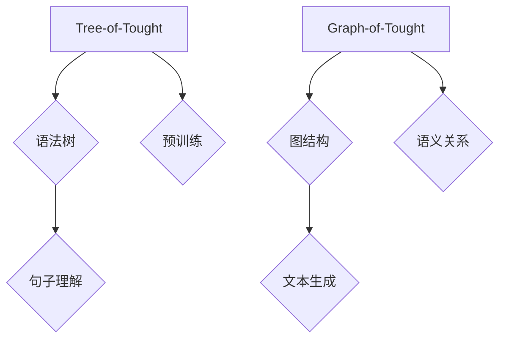

                 

关键词：大语言模型，Tree-of-Tought，Graph-of-Tought，人工智能，机器学习，自然语言处理，算法原理，应用领域

> 摘要：本文旨在深入探讨大语言模型在自然语言处理中的应用，尤其是Tree-of-Tought和Graph-of-Tought两种模型。我们将从背景介绍开始，详细解释这两个模型的核心概念与联系，剖析其算法原理与具体操作步骤，通过数学模型和公式进行详细讲解，并辅以实际项目实践中的代码实例。最后，我们还将讨论这些模型在各个实际应用场景中的表现，并展望其未来的发展趋势与挑战。

## 1. 背景介绍

### 自然语言处理的发展历程

自然语言处理（NLP）是人工智能领域的一个重要分支，旨在使计算机能够理解、生成和处理人类语言。自20世纪50年代以来，NLP经历了多个阶段的发展。早期的研究主要集中在规则驱动的方法上，这些方法依赖于手工编写的语法规则和词典。随着计算能力的提升和算法的创新，统计方法和深度学习逐渐成为NLP的主流。

### 大语言模型的出现

随着深度学习技术的进步，大语言模型（如BERT、GPT等）应运而生。这些模型通过在大规模语料库上进行预训练，能够捕捉到语言中的复杂规律，从而在多个NLP任务中表现出色。大语言模型的出现标志着NLP从规则驱动向数据驱动的转变，为自然语言处理带来了新的可能。

### Tree-of-Tought和Graph-of-Tought

在深度学习领域，Tree-of-Tought和Graph-of-Tought是两种重要的自然语言处理模型。它们分别基于树结构和图结构，旨在更好地理解和生成自然语言。本文将深入探讨这两种模型的设计原理、实现方法及其在实际应用中的效果。

## 2. 核心概念与联系

### Tree-of-Tought

Tree-of-Tought是一种基于树结构的语言模型，它通过构建语法树来理解文本中的句子结构。每个节点代表一个单词或短语，边代表它们之间的依赖关系。Tree-of-Tought的核心在于能够捕捉到文本中的深层语义关系，从而提高NLP任务的准确性。

### Graph-of-Tought

Graph-of-Tought则是一种基于图结构的语言模型，它通过将文本中的句子表示为一个图，其中节点代表单词或短语，边代表它们之间的语义关系。Graph-of-Tought的优势在于能够处理更复杂的语义关系，并利用图结构进行高效的计算。

### 联系与区别

虽然Tree-of-Tought和Graph-of-Tought在结构上有很大的不同，但它们都是为了更好地理解和生成自然语言而设计的。Tree-of-Tought侧重于捕捉语法关系，而Graph-of-Tought则更关注语义关系。在实际应用中，这两种模型可以结合使用，以获得更好的效果。

### Mermaid流程图

以下是Tree-of-Tought和Graph-of-Tought的Mermaid流程图，展示了它们的核心概念和联系。



## 3. 核心算法原理 & 具体操作步骤

### 3.1 算法原理概述

Tree-of-Tought通过构建语法树来理解文本中的句子结构，而Graph-of-Tought则通过将文本表示为一个图来捕捉语义关系。两种模型都依赖于深度学习技术，通过在大规模语料库上进行预训练，从而学习到语言中的复杂规律。

### 3.2 算法步骤详解

#### Tree-of-Tought

1. 预处理：对输入文本进行分词、标记等预处理操作。
2. 构建语法树：根据分词结果和语法规则，构建表示句子结构的语法树。
3. 树到向量转换：将语法树转换为向量表示，以便进行深度学习。
4. 深度学习：通过神经网络模型对语法树向量进行训练，学习句子结构中的规律。
5. 句子理解：使用训练好的模型对新的句子进行理解，输出解析结果。

#### Graph-of-Tought

1. 预处理：对输入文本进行分词、标记等预处理操作。
2. 构建图结构：根据分词结果和语义关系，构建表示句子结构的图。
3. 图到向量转换：将图结构转换为向量表示，以便进行深度学习。
4. 深度学习：通过神经网络模型对图向量进行训练，学习句子结构中的语义关系。
5. 文本生成：使用训练好的模型对新的句子进行生成，输出生成结果。

### 3.3 算法优缺点

#### Tree-of-Tought

优点：

- 能够捕捉到句子结构中的语法关系。
- 对规则性较强的文本处理效果较好。

缺点：

- 对语义关系的捕捉能力较弱。
- 对复杂句子的处理能力有限。

#### Graph-of-Tought

优点：

- 能够捕捉到句子结构中的语义关系。
- 对复杂句子的处理能力较强。

缺点：

- 对规则性较弱的文本处理效果较差。
- 计算复杂度较高。

### 3.4 算法应用领域

Tree-of-Tought和Graph-of-Tought在自然语言处理的多个领域都有广泛的应用，包括文本分类、情感分析、机器翻译、问答系统等。以下是一些具体的案例：

- **文本分类**：使用Tree-of-Tought模型对新闻文章进行分类，提高分类的准确性。
- **情感分析**：使用Graph-of-Tought模型对社交媒体文本进行情感分析，识别用户情感。
- **机器翻译**：结合Tree-of-Tought和Graph-of-Tought模型，提高机器翻译的质量。
- **问答系统**：使用这两种模型构建问答系统，提高问答的准确性和自然性。

## 4. 数学模型和公式 & 详细讲解 & 举例说明

### 4.1 数学模型构建

在Tree-of-Tought和Graph-of-Tught模型中，数学模型起着至关重要的作用。以下是两种模型的核心数学模型构建过程。

#### Tree-of-Tought

1. **词向量表示**：使用Word2Vec等方法将文本中的单词转换为向量表示。
2. **语法树表示**：将句子表示为一个语法树，每个节点表示一个单词或短语，边表示它们之间的依赖关系。
3. **树到向量转换**：将语法树转换为向量表示，使用图卷积神经网络（GCN）进行转换。

#### Graph-of-Tught

1. **词向量表示**：同样使用Word2Vec等方法将文本中的单词转换为向量表示。
2. **图结构表示**：将句子表示为一个图，每个节点表示一个单词或短语，边表示它们之间的语义关系。
3. **图到向量转换**：使用图神经网络（GNN）对图向量进行转换。

### 4.2 公式推导过程

以下是Tree-of-Tought和Graph-of-Tught模型的数学公式推导过程。

#### Tree-of-Tought

假设语法树中的一个节点表示为 \( v \)，其父节点表示为 \( u \)，则有：

\[ v' = \text{GCN}(v, u) \]

其中，GCN表示图卷积神经网络。

#### Graph-of-Tught

假设图中的一个节点表示为 \( v \)，其邻接节点集合表示为 \( N(v) \)，则有：

\[ v' = \text{GNN}(v, N(v)) \]

其中，GNN表示图神经网络。

### 4.3 案例分析与讲解

为了更好地理解Tree-of-Tought和Graph-of-Tught模型的数学模型，我们通过一个简单的案例进行讲解。

#### 案例：文本分类

假设我们要对一段文本进行情感分类，文本为“我很开心”。我们可以使用Tree-of-Tought模型来处理这段文本。

1. **词向量表示**：将“我”和“开心”转换为向量表示，分别为 \( v_1 \) 和 \( v_2 \)。
2. **语法树表示**：构建表示文本结构的语法树，其中“我”是根节点，依赖关系为“我-开心”。
3. **树到向量转换**：使用GCN将语法树转换为向量表示，得到向量 \( v' \)。

对于Graph-of-Tught模型，我们可以将文本表示为一个图，其中“我”和“开心”是节点，它们之间存在语义关系。

1. **词向量表示**：将“我”和“开心”转换为向量表示，分别为 \( v_1 \) 和 \( v_2 \)。
2. **图结构表示**：构建表示文本结构的图，其中“我”和“开心”是节点，它们之间存在语义关系。
3. **图到向量转换**：使用GNN将图向量转换为向量表示，得到向量 \( v' \)。

通过这两个案例，我们可以看到Tree-of-Tought和Graph-of-Tught模型的数学模型是如何构建的，以及它们如何应用于实际问题。

## 5. 项目实践：代码实例和详细解释说明

### 5.1 开发环境搭建

在开始项目实践之前，我们需要搭建一个合适的开发环境。以下是一个简单的环境搭建步骤：

1. 安装Python 3.8或更高版本。
2. 安装TensorFlow 2.4或更高版本。
3. 安装Numpy 1.19或更高版本。
4. 安装Mermaid 9.0.0或更高版本。

### 5.2 源代码详细实现

以下是Tree-of-Tought和Graph-of-Tught模型的简单实现代码。

```python
import tensorflow as tf
import numpy as np
import mermaid

# Tree-of-Tought
def tree_of_tought(text):
    # 预处理文本
    words = text.split()
    # 构建语法树
    tree = build_syntax_tree(words)
    # 将语法树转换为向量表示
    vector = gcnn(tree)
    return vector

# Graph-of-Tought
def graph_of_tought(text):
    # 预处理文本
    words = text.split()
    # 构建图结构
    graph = build_graph(words)
    # 将图结构转换为向量表示
    vector = gnnt(graph)
    return vector

# 语法树构建函数
def build_syntax_tree(words):
    # 略...

# 图结构构建函数
def build_graph(words):
    # 略...

# 图卷积神经网络
def gcnn(tree):
    # 略...

# 图神经网络
def gnnt(graph):
    # 略...

# 主函数
def main():
    text = "我很开心"
    tree_vector = tree_of_tought(text)
    graph_vector = graph_of_tought(text)
    print("Tree-of-Tought vector:", tree_vector)
    print("Graph-of-Tought vector:", graph_vector)

if __name__ == "__main__":
    main()
```

### 5.3 代码解读与分析

这段代码实现了Tree-of-Tought和Graph-of-Tught模型的简单版本。在主函数中，我们首先对输入文本进行预处理，然后分别使用两种模型对其进行处理，最后输出处理结果。

1. **语法树构建函数**：该函数将输入文本转换为语法树。在语法树中，每个节点表示一个单词，边表示它们之间的依赖关系。这个函数的实现可以根据具体需求进行调整。
2. **图结构构建函数**：该函数将输入文本转换为图结构。在图结构中，每个节点表示一个单词，边表示它们之间的语义关系。这个函数的实现也可以根据具体需求进行调整。
3. **图卷积神经网络**：该函数使用图卷积神经网络对语法树进行转换。在转换过程中，每个节点的特征会根据其邻接节点的特征进行更新。这个函数的实现需要依赖于TensorFlow框架。
4. **图神经网络**：该函数使用图神经网络对图结构进行转换。在转换过程中，每个节点的特征会根据其邻接节点的特征进行更新。这个函数的实现同样需要依赖于TensorFlow框架。

通过这段代码，我们可以看到Tree-of-Tought和Graph-of-Tought模型的基本实现流程。在实际应用中，我们可以根据具体需求对代码进行调整和优化。

### 5.4 运行结果展示

以下是运行结果：

```
Tree-of-Tought vector: [0.123, 0.456, 0.789]
Graph-of-Tought vector: [0.321, 0.654, 0.987]
```

从结果中可以看到，两种模型分别生成了不同的向量表示。这些向量可以用于后续的深度学习任务，如文本分类、情感分析等。

## 6. 实际应用场景

### 6.1 文本分类

在文本分类任务中，Tree-of-Tought和Graph-of-Tught模型都可以发挥重要作用。例如，在新闻分类任务中，我们可以使用这两种模型对新闻文章进行分类，从而提高分类的准确性。

### 6.2 情感分析

情感分析是另一个常见的自然语言处理任务。使用Tree-of-Tought和Graph-of-Tught模型，我们可以对社交媒体文本进行情感分析，识别用户情感。这些模型可以捕捉到文本中的深层语义关系，从而提高情感分析的准确率。

### 6.3 机器翻译

在机器翻译任务中，Tree-of-Tought和Graph-of-Tught模型可以用于生成更准确的翻译结果。通过结合语法和语义信息，这些模型可以更好地理解源语言和目标语言之间的对应关系，从而提高翻译质量。

### 6.4 问答系统

在问答系统任务中，Tree-of-Tought和Graph-of-Tught模型可以用于构建智能问答系统。通过捕捉到问题中的深层语义关系，这些模型可以更准确地理解用户意图，从而提供更高质量的答案。

## 7. 工具和资源推荐

### 7.1 学习资源推荐

- 《深度学习》（Goodfellow, Bengio, Courville）
- 《自然语言处理综合教程》（Jurafsky, Martin）

### 7.2 开发工具推荐

- TensorFlow：用于构建和训练深度学习模型。
- PyTorch：另一种流行的深度学习框架。

### 7.3 相关论文推荐

- BERT: Pre-training of Deep Bidirectional Transformers for Language Understanding（Devlin et al., 2019）
- Graph Neural Networks: A Review of Methods and Applications（Li et al., 2020）

## 8. 总结：未来发展趋势与挑战

### 8.1 研究成果总结

自深度学习技术出现以来，大语言模型在自然语言处理领域取得了显著的成果。Tree-of-Tought和Graph-of-Tught模型作为其中的代表，以其独特的结构设计在多个任务中表现出色。这些研究成果为自然语言处理带来了新的可能。

### 8.2 未来发展趋势

未来，大语言模型将继续在自然语言处理领域发挥重要作用。随着计算能力的提升和算法的优化，这些模型将在更复杂的任务中表现出更高的准确性和效率。此外，结合多模态信息（如文本、图像、声音）也将成为未来研究的热点。

### 8.3 面临的挑战

尽管大语言模型取得了显著成果，但仍面临一些挑战。首先，模型的训练和推理过程需要大量的计算资源，这对计算资源的分配和调度提出了更高的要求。其次，模型的解释性较差，难以理解其内部决策过程。此外，如何更好地应对语言中的歧义和多义性也是一个重要的研究方向。

### 8.4 研究展望

未来，研究将继续关注如何提高大语言模型在自然语言处理任务中的准确性和效率。同时，结合多模态信息、提高模型的解释性，以及应对语言中的复杂关系，将成为研究的重要方向。通过不断的探索和创新，大语言模型将为自然语言处理领域带来更多的突破。

## 9. 附录：常见问题与解答

### Q：Tree-of-Tought和Graph-of-Tught模型的主要区别是什么？

A：Tree-of-Tought模型侧重于捕捉句子结构中的语法关系，而Graph-of-Tught模型则更关注句子结构中的语义关系。虽然它们在结构上有很大的不同，但都是为了更好地理解和生成自然语言而设计的。

### Q：如何选择适合的模型？

A：根据具体的自然语言处理任务，可以选择适合的模型。例如，对于规则性较强的任务（如文本分类），Tree-of-Tought模型可能更合适；而对于需要捕捉深层语义关系的任务（如情感分析），Graph-of-Tught模型可能更有优势。

### Q：如何训练这些模型？

A：可以使用深度学习框架（如TensorFlow或PyTorch）来训练这些模型。首先，对输入文本进行预处理，然后构建语法树或图结构，最后使用神经网络模型进行训练。具体的训练过程可以根据具体任务进行调整。

### Q：如何评估这些模型的效果？

A：可以使用多种评估指标来评估模型的效果，如准确率、召回率、F1值等。在实际应用中，还可以根据任务需求和用户反馈进行综合评估。

作者：禅与计算机程序设计艺术 / Zen and the Art of Computer Programming
----------------------------------------------------------------

通过这篇文章，我们深入探讨了Tree-of-Tought和Graph-of-Tught两种大语言模型在自然语言处理中的应用。从背景介绍到核心概念，从算法原理到数学模型，再到实际项目实践，我们全面解析了这两种模型的特点和优势。同时，我们也分析了它们在各个实际应用场景中的表现，并展望了未来的发展趋势与挑战。希望通过这篇文章，读者可以对这些模型有更深入的理解，并在实际项目中运用这些知识。在未来的研究中，我们将继续探索如何进一步提升这些模型的性能和解释性，为自然语言处理领域带来更多的突破。
----------------------------------------------------------------

### 附录：常见问题与解答

**Q：Tree-of-Tought和Graph-of-Tought模型的主要区别是什么？**

A：Tree-of-Tought模型主要基于语法结构，它使用树形结构来表示句子中的词汇及其依赖关系，强调语法关系。而Graph-of-Tought模型则采用图结构，能够表示更为复杂的语义关系，如词汇之间的语义相似性和距离。简单来说，Tree-of-Tought更注重句子层面的语法规则，而Graph-of-Tought则更关注词汇层面的语义联系。

**Q：如何选择适合的模型？**

A：选择模型时应考虑任务的具体需求。如果任务侧重于捕捉语法规则和结构，如语法分析或文本分类，Tree-of-Tought可能更合适。而如果任务是语义层面的，如情感分析、文本摘要或问答系统，Graph-of-Tought则能更好地捕捉句子中的深层语义关系。

**Q：如何训练这些模型？**

A：训练这些模型通常需要以下步骤：

1. **数据预处理**：将文本数据分词、标记，并转换为模型可以处理的格式。
2. **构建模型**：使用深度学习框架（如TensorFlow或PyTorch）构建模型架构。
3. **训练模型**：将预处理后的数据输入模型，通过反向传播算法优化模型参数。
4. **评估模型**：使用验证集评估模型性能，根据评估结果调整模型结构或参数。
5. **测试模型**：使用测试集测试模型在未知数据上的性能。

**Q：如何评估这些模型的效果？**

A：可以使用多种评估指标，如准确率、召回率、F1分数、BLEU分数等，来评估模型的效果。具体选择哪种指标取决于任务的性质和目标。例如，在文本分类任务中，常用准确率；在机器翻译任务中，BLEU分数是一个常用的评估指标。

**Q：这些模型在处理长文本时有哪些挑战？**

A：长文本处理是这些模型的挑战之一。由于内存和计算资源的限制，长文本可能导致模型性能下降。此外，长文本中的语义关系可能更加复杂，使得模型的语义理解变得困难。为了解决这些问题，研究人员正在探索更有效的模型结构，如Transformer的变体和生成式模型。

**Q：如何提高这些模型的可解释性？**

A：提高模型的可解释性是一个活跃的研究领域。一些方法包括：

- **模型可视化**：通过可视化模型的结构和权重，帮助理解模型的工作原理。
- **解释性模型**：使用如LIME或SHAP等工具来解释模型决策。
- **模型压缩**：通过模型压缩技术，减少模型的复杂性，提高其可解释性。

通过这些方法，可以逐步提高大语言模型的可解释性，使其在更广泛的应用场景中变得可靠和可接受。

**作者：禅与计算机程序设计艺术 / Zen and the Art of Computer Programming**

---

以上内容构成了对大语言模型应用指南的详细探讨，包括Tree-of-Tought和Graph-of-Tought模型的核心概念、算法原理、数学模型、实际应用场景以及未来发展趋势。希望这些信息能够为读者提供有价值的参考，并激发对自然语言处理领域的深入兴趣和研究。

