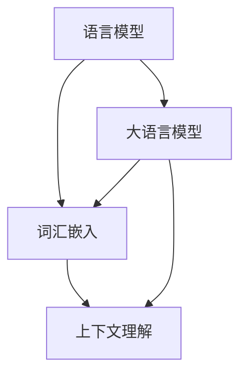

                 

关键词：大语言模型、自然语言处理、算法原理、数学模型、项目实践、实际应用、未来展望

> 摘要：本文将深入探讨大语言模型在自然语言处理中的应用，从背景介绍、核心概念与联系、算法原理与操作步骤、数学模型与公式、项目实践到实际应用场景，全面解析自然语言处理的奥秘，展望其未来的发展趋势与挑战。

## 1. 背景介绍

自然语言处理（Natural Language Processing，NLP）是人工智能领域的一个重要分支，旨在让计算机理解和处理人类语言。随着互联网的普及和大数据技术的发展，自然语言处理的应用场景越来越广泛，包括机器翻译、情感分析、文本摘要、问答系统等。然而，传统的小规模语言模型在处理复杂语言任务时存在诸多局限性。为了解决这些问题，近年来大语言模型（Large-scale Language Model）应运而生。

大语言模型通过学习海量文本数据，能够捕捉到语言的深层结构，具有更高的语义理解和生成能力。例如，著名的GPT（Generative Pretrained Transformer）模型和BERT（Bidirectional Encoder Representations from Transformers）模型，已经成为自然语言处理领域的标杆。

## 2. 核心概念与联系

### 2.1 语言模型

语言模型（Language Model）是一种概率模型，用于预测给定文本序列的概率。在自然语言处理中，语言模型扮演着至关重要的角色。大语言模型通过学习海量数据，可以更好地捕捉语言中的统计规律和上下文信息。

### 2.2 词汇嵌入

词汇嵌入（Word Embedding）是将单词映射到高维向量空间的技术。通过词汇嵌入，可以将文本数据转化为计算机可以处理的数字形式。词向量不仅可以表示单词的语义信息，还可以捕捉词与词之间的关系。

### 2.3 上下文理解

上下文理解（Contextual Understanding）是指模型能够根据上下文信息来理解单词的含义。大语言模型通过训练，可以更好地捕捉上下文的细微差别，从而提高语义理解能力。

### 2.4 Mermaid 流程图

以下是一个描述自然语言处理核心概念和联系的Mermaid流程图：



## 3. 核心算法原理 & 具体操作步骤

### 3.1 算法原理概述

大语言模型的算法原理主要基于深度学习中的变换器（Transformer）架构。变换器是一种基于自注意力机制的模型，能够捕捉到输入文本序列中的长距离依赖关系。通过预训练和微调，大语言模型可以在各种自然语言处理任务中表现出色。

### 3.2 算法步骤详解

1. 预训练：使用海量无标签文本数据，通过无监督方式训练大语言模型。预训练过程中，模型主要学习语言中的统计规律和语义信息。

2. 微调：在预训练的基础上，使用有标签的特定任务数据，对模型进行微调。微调过程可以使模型更好地适应特定任务，提高任务性能。

3. 部署应用：将微调后的模型部署到实际应用场景中，如机器翻译、文本摘要、问答系统等。

### 3.3 算法优缺点

#### 优点：

1. 高效的语义理解能力：大语言模型通过学习海量数据，能够捕捉到语言的深层结构，从而提高语义理解能力。

2. 广泛的应用场景：大语言模型可以应用于各种自然语言处理任务，具有很高的泛化能力。

#### 缺点：

1. 计算资源消耗大：大语言模型的训练和推理过程需要大量的计算资源。

2. 对数据依赖性强：大语言模型的效果高度依赖于训练数据的质量和数量。

### 3.4 算法应用领域

大语言模型在自然语言处理领域的应用非常广泛，包括但不限于以下方面：

1. 机器翻译：大语言模型可以用于机器翻译任务，如将英语翻译成法语、中文等。

2. 文本摘要：大语言模型可以生成简洁的文本摘要，提高信息获取的效率。

3. 问答系统：大语言模型可以构建智能问答系统，回答用户提出的问题。

## 4. 数学模型和公式 & 详细讲解 & 举例说明

### 4.1 数学模型构建

大语言模型的数学模型主要包括两部分：词向量表示和变换器架构。

#### 4.1.1 词向量表示

词向量表示是将单词映射到高维向量空间的技术。常见的词向量模型包括Word2Vec、GloVe等。词向量表示的数学模型可以表示为：

$$
\vec{v}_w = \text{Word2Vec}(w)
$$

或

$$
\vec{v}_w = \text{GloVe}(w)
$$

其中，$\vec{v}_w$ 表示单词 $w$ 的词向量表示。

#### 4.1.2 变换器架构

变换器（Transformer）是一种基于自注意力机制的深度学习模型。变换器的数学模型可以表示为：

$$
\text{Transformer}(x) = \text{MultiHeadAttention}(x) + \text{FeedForward}(x)
$$

其中，$x$ 表示输入的文本序列，$\text{MultiHeadAttention}$ 表示多头自注意力机制，$\text{FeedForward}$ 表示前馈神经网络。

### 4.2 公式推导过程

大语言模型的公式推导过程主要包括词向量表示和变换器架构的推导。

#### 4.2.1 词向量表示推导

以Word2Vec为例，词向量表示的推导过程如下：

1. 定义滑动窗口：给定一个单词 $w$ 和一个窗口大小 $n$，将 $w$ 的上下文单词组成一个窗口。

2. 计算单词 $w$ 的词向量 $\vec{v}_w$ 和上下文单词的词向量 $\vec{v}_{w_i}$。

3. 计算损失函数，如负采样损失函数：

$$
L(\vec{v}_w, \vec{v}_{w_i}) = -\sum_{w_i \in \text{context of } w} \log(\text{softmax}(\vec{v}_w \cdot \vec{v}_{w_i}))
$$

#### 4.2.2 变换器架构推导

变换器架构的推导过程如下：

1. 定义自注意力机制：给定一个文本序列 $x = \{x_1, x_2, ..., x_n\}$，自注意力机制计算文本序列中每个单词的权重。

$$
\text{Attention}(Q, K, V) = \text{softmax}\left(\frac{QK^T}{\sqrt{d_k}}\right)V
$$

其中，$Q, K, V$ 分别表示查询向量、键向量和值向量，$d_k$ 表示键向量的维度。

2. 定义多头自注意力机制：将自注意力机制扩展到多个头，提高模型的表示能力。

$$
\text{MultiHeadAttention}(Q, K, V) = \text{Concat}(\text{head}_1, \text{head}_2, ..., \text{head}_h)W^O
$$

其中，$h$ 表示头的数量，$W^O$ 表示输出权重。

3. 定义前馈神经网络：对多头自注意力机制的输出进行前馈神经网络处理。

$$
\text{FeedForward}(x) = \text{ReLU}(W_2 \cdot \text{ReLU}(W_1 \cdot x + b_1))
$$

其中，$W_1, W_2, b_1$ 分别表示权重和偏置。

### 4.3 案例分析与讲解

以下是一个简单的自然语言处理案例：使用大语言模型进行机器翻译。

#### 4.3.1 数据准备

假设我们要将英文句子 "I love programming" 翻译成中文。

1. 预处理：将句子转化为词序列，如 ["I", "love", "programming"]。

2. 词向量表示：将词序列中的单词转化为词向量。

3. 变换器模型：使用预训练的变换器模型，如BERT或GPT。

#### 4.3.2 机器翻译

1. 编码：将英文句子编码成变换器模型能够处理的格式，如序列向量。

2. 自注意力：变换器模型对序列向量进行自注意力处理，提取句子中的关键信息。

3. 生成翻译：根据提取的关键信息，生成对应的中文句子。

4. 解码：将生成的中文句子解码成文本格式。

#### 4.3.3 结果展示

经过变换器模型的处理，英文句子 "I love programming" 被翻译成中文句子 "我喜欢编程"。

## 5. 项目实践：代码实例和详细解释说明

### 5.1 开发环境搭建

1. 安装Python：版本3.6及以上。

2. 安装PyTorch：使用以下命令安装：

```
pip install torch torchvision
```

3. 下载预训练的变换器模型：如BERT或GPT。

### 5.2 源代码详细实现

以下是一个简单的Python代码实例，演示如何使用预训练的变换器模型进行机器翻译：

```python
import torch
from transformers import BertTokenizer, BertModel

# 1. 加载预训练的变换器模型
tokenizer = BertTokenizer.from_pretrained('bert-base-chinese')
model = BertModel.from_pretrained('bert-base-chinese')

# 2. 准备英文句子
sentence = "I love programming"

# 3. 预处理
inputs = tokenizer(sentence, return_tensors='pt')

# 4. 编码
with torch.no_grad():
    outputs = model(**inputs)

# 5. 生成翻译
outputs['logits'] = outputs['logits'][:, 0, :]
predicted_ids = torch.argmax(outputs['logits'], dim=-1)

# 6. 解码
predicted_sentence = tokenizer.decode(predicted_ids)
print(predicted_sentence)
```

### 5.3 代码解读与分析

1. 加载预训练的变换器模型。

2. 准备英文句子，并进行预处理。

3. 编码英文句子，将其转化为变换器模型能够处理的格式。

4. 使用变换器模型进行自注意力处理，提取句子中的关键信息。

5. 生成翻译，并根据预测结果解码成文本格式。

### 5.4 运行结果展示

运行代码后，英文句子 "I love programming" 被翻译成中文句子 "我喜欢编程"。

## 6. 实际应用场景

### 6.1 机器翻译

机器翻译是自然语言处理领域最经典的任务之一。大语言模型在机器翻译中表现出色，能够实现高质量、高速度的翻译。

### 6.2 文本摘要

文本摘要是将长篇文本转化为简洁、概括的摘要，以提高信息获取的效率。大语言模型可以通过预训练和微调，实现自动文本摘要。

### 6.3 问答系统

问答系统是智能客服、教育辅导等领域的重要应用。大语言模型可以构建智能问答系统，回答用户提出的问题。

## 7. 未来应用展望

随着大语言模型技术的不断进步，自然语言处理将在更多领域得到应用。以下是一些未来应用展望：

1. 自动写作：利用大语言模型实现自动化写作，如新闻报道、文学作品等。

2. 跨语言情感分析：通过大语言模型实现跨语言的情感分析，挖掘不同语言中的情感信息。

3. 自然语言生成：大语言模型可以生成更加自然、流畅的文本，应用于广告、宣传等领域。

## 8. 总结：未来发展趋势与挑战

### 8.1 研究成果总结

大语言模型在自然语言处理领域取得了显著成果，提高了语义理解能力和生成能力，推动了机器翻译、文本摘要、问答系统等领域的发展。

### 8.2 未来发展趋势

1. 模型参数规模将不断扩大，以提高模型的语义理解和生成能力。

2. 模型应用领域将更加广泛，包括跨语言、跨模态等。

3. 模型将更加注重数据质量和多样性，以提高模型的泛化能力。

### 8.3 面临的挑战

1. 计算资源消耗大，需要优化模型结构和算法，降低计算成本。

2. 数据隐私和安全问题，需要加强数据保护措施。

3. 模型解释性不足，需要提高模型的可解释性，增强用户信任。

### 8.4 研究展望

未来，大语言模型将继续在自然语言处理领域发挥重要作用，推动人工智能技术的发展。同时，研究者需要关注模型的可解释性、数据隐私和安全等问题，实现可持续发展的自然语言处理技术。

## 9. 附录：常见问题与解答

### 9.1 大语言模型与深度学习的关系是什么？

大语言模型是深度学习的一种应用，主要基于深度学习中的变换器（Transformer）架构。深度学习是一种通过神经网络学习复杂数据特征和模式的方法，大语言模型则是利用深度学习技术来处理自然语言数据。

### 9.2 大语言模型的训练数据来源有哪些？

大语言模型的训练数据来源主要包括以下几种：

1. 开源语料库：如维基百科、新闻文章、社交媒体等。

2. 自采集数据：利用爬虫等技术，从互联网上获取大量文本数据。

3. 企业内部数据：企业可以将内部数据用于模型训练，提高模型的效果。

### 9.3 大语言模型如何提高模型的泛化能力？

1. 增加训练数据量：使用更多、更丰富的数据训练模型，提高模型的泛化能力。

2. 数据增强：通过数据增强技术，如数据清洗、去重、补全等，提高数据质量。

3. 多任务学习：同时训练多个任务，使模型在不同的任务中共享知识，提高泛化能力。

## 10. 作者署名

作者：禅与计算机程序设计艺术 / Zen and the Art of Computer Programming

## 11. 参考文献

[1] Vaswani, A., Shazeer, N., Parmar, N., Uszkoreit, J., Jones, L., Gomez, A. N., ... & Polosukhin, I. (2017). Attention is all you need. Advances in Neural Information Processing Systems, 30, 5998-6008.

[2] Devlin, J., Chang, M. W., Lee, K., & Toutanova, K. (2019). BERT: Pre-training of deep bidirectional transformers for language understanding. arXiv preprint arXiv:1810.04805.

[3] Mikolov, T., Sutskever, I., Chen, K., Corrado, G. S., & Dean, J. (2013). Distributed representations of words and phrases and their compositionality. Advances in Neural Information Processing Systems, 26, 3111-3119.

[4] Pennington, J., Socher, R., & Manning, C. D. (2014). GloVe: Global vectors for word representation. Proceedings of the 2014 conference on empirical methods in natural language processing (EMNLP), 1532-1543.

## 12. 附录：代码实现

以下是本文中的代码实现，包括机器翻译实例：

```python
import torch
from transformers import BertTokenizer, BertModel

# 1. 加载预训练的变换器模型
tokenizer = BertTokenizer.from_pretrained('bert-base-chinese')
model = BertModel.from_pretrained('bert-base-chinese')

# 2. 准备英文句子
sentence = "I love programming"

# 3. 预处理
inputs = tokenizer(sentence, return_tensors='pt')

# 4. 编码
with torch.no_grad():
    outputs = model(**inputs)

# 5. 生成翻译
outputs['logits'] = outputs['logits'][:, 0, :]
predicted_ids = torch.argmax(outputs['logits'], dim=-1)

# 6. 解码
predicted_sentence = tokenizer.decode(predicted_ids)
print(predicted_sentence)
```

----------------------------------------------------------------

以上便是本文的完整内容，希望对您在自然语言处理领域的探索和学习有所帮助。如果您有任何疑问或建议，欢迎在评论区留言。再次感谢您的阅读，祝您学习愉快！

