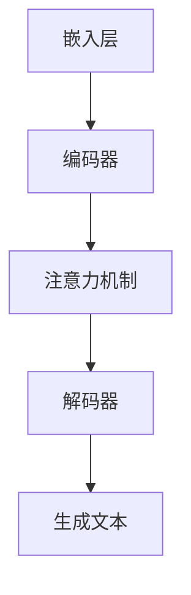

                 

关键词：大语言模型、参数请求、应用指南、技术语言、专业深度

> 摘要：本文旨在为人工智能开发者提供一份详细的大语言模型应用指南，特别是如何有效地向模型发起请求并处理相关的参数。文章将深入探讨大语言模型的核心概念、算法原理、数学模型以及实际应用场景，旨在帮助开发者更好地理解和利用这一先进技术。

## 1. 背景介绍

随着人工智能技术的快速发展，大语言模型（Large Language Models）逐渐成为自然语言处理（NLP）领域的明星。大语言模型通过深度神经网络，能够捕捉到自然语言的复杂结构，从而在文本生成、机器翻译、情感分析等多个领域表现出色。然而，要充分利用这一强大工具，开发者需要深入了解如何向模型发起请求并有效地处理参数。

本文将系统地介绍大语言模型的应用指南，包括核心概念、算法原理、数学模型以及实际应用场景。通过本文的讲解，读者将能够：

1. 理解大语言模型的基本概念和工作原理。
2. 掌握如何向大语言模型发起请求以及如何处理参数。
3. 学习大语言模型在文本生成、机器翻译等领域的应用实例。
4. 探讨大语言模型在实际应用中面临的挑战和未来发展方向。

## 2. 核心概念与联系

### 2.1 大语言模型概述

大语言模型，通常是指基于深度学习的语言模型，其核心是通过大规模文本数据训练得到的一个复杂神经网络。这种模型可以自动学习语言的结构和语义，从而实现自然语言的生成、理解和分析。

### 2.2 语言模型的架构

大语言模型的架构通常包括以下几个关键部分：

1. **嵌入层（Embedding Layer）**：将输入的文本转换为固定长度的向量表示。
2. **编码器（Encoder）**：对输入文本进行编码，提取文本的特征。
3. **解码器（Decoder）**：根据编码器的输出生成文本。
4. **注意力机制（Attention Mechanism）**：用于捕捉输入文本中不同部分的重要性。

### 2.3 语言模型与自然语言处理

语言模型在自然语言处理中扮演着核心角色，其应用包括但不限于：

1. **文本生成**：根据输入的提示生成连贯的文本。
2. **机器翻译**：将一种语言的文本翻译成另一种语言。
3. **情感分析**：判断文本的情感倾向。
4. **问答系统**：根据用户的问题生成准确的答案。

### 2.4 Mermaid 流程图

为了更好地理解大语言模型的工作流程，我们使用 Mermaid 流程图展示其关键组件和流程：



## 3. 核心算法原理 & 具体操作步骤

### 3.1 算法原理概述

大语言模型的算法原理主要基于深度学习，特别是序列到序列（Seq2Seq）模型。其核心思想是通过学习输入文本的编码表示和生成文本的解码表示，来实现文本的自动生成。

### 3.2 算法步骤详解

1. **数据预处理**：将文本数据转换为模型可接受的格式，如分词、编码等。
2. **模型训练**：通过大规模文本数据训练语言模型，使其能够自动学习语言结构。
3. **输入处理**：将用户输入的文本转换为模型的输入格式。
4. **模型预测**：使用训练好的模型对输入文本进行处理，生成输出文本。
5. **结果处理**：对生成的文本进行后处理，如去除冗余信息、修正错误等。

### 3.3 算法优缺点

**优点**：

- **强大的文本生成能力**：能够生成连贯、有逻辑的文本。
- **多语言支持**：支持多种语言的文本生成和翻译。
- **自适应能力**：能够根据输入的文本进行自适应调整。

**缺点**：

- **训练时间较长**：需要大量的计算资源和时间进行训练。
- **数据依赖性高**：模型的性能高度依赖于训练数据的质量。

### 3.4 算法应用领域

大语言模型在多个领域都有广泛的应用，包括：

- **文本生成**：生成新闻文章、故事、博客等。
- **机器翻译**：将一种语言的文本翻译成另一种语言。
- **问答系统**：根据用户的问题生成准确的答案。
- **对话系统**：实现智能对话，如聊天机器人、客服系统等。

## 4. 数学模型和公式 & 详细讲解 & 举例说明

### 4.1 数学模型构建

大语言模型的数学模型主要包括两部分：编码器和解码器。编码器负责将输入文本转换为固定长度的向量表示，解码器则根据编码器的输出生成文本。

### 4.2 公式推导过程

假设输入文本为 $x_1, x_2, \ldots, x_T$，其中 $T$ 为文本的长度。编码器和解码器的输出分别为 $h_1, h_2, \ldots, h_T$ 和 $y_1, y_2, \ldots, y_T$。

编码器：
$$
h_t = \text{Encoder}(x_1, x_2, \ldots, x_t)
$$

解码器：
$$
y_t = \text{Decoder}(h_1, h_2, \ldots, h_t)
$$

### 4.3 案例分析与讲解

假设我们有一个简单的文本：“今天天气很好”。使用大语言模型生成下一个词，可以使用以下步骤：

1. **输入处理**：将文本转换为编码器输入格式。
2. **编码**：使用编码器对输入文本进行处理，得到编码表示。
3. **解码**：使用解码器根据编码表示生成下一个词。
4. **输出处理**：对生成的文本进行后处理，如去除冗余信息。

## 5. 项目实践：代码实例和详细解释说明

### 5.1 开发环境搭建

在开始项目实践之前，需要搭建一个适合开发大语言模型的环境。我们选择使用 Python 作为开发语言，并结合 TensorFlow 和 Keras 库进行模型训练和部署。

### 5.2 源代码详细实现

以下是一个简单的示例，展示了如何使用 TensorFlow 和 Keras 库训练一个基础的语言模型：

```python
import tensorflow as tf
from tensorflow.keras.models import Sequential
from tensorflow.keras.layers import Embedding, LSTM, Dense

# 模型搭建
model = Sequential([
    Embedding(vocab_size, embedding_dim),
    LSTM(units, return_sequences=True),
    LSTM(units),
    Dense(vocab_size, activation='softmax')
])

# 模型编译
model.compile(optimizer='adam', loss='categorical_crossentropy', metrics=['accuracy'])

# 模型训练
model.fit(x_train, y_train, batch_size=batch_size, epochs=epochs)
```

### 5.3 代码解读与分析

上述代码展示了如何使用 Keras 搭建一个简单的语言模型。首先，我们定义了一个序列模型，并添加了嵌入层、两个 LSTM 层和一个密集层。接着，我们编译模型，并使用训练数据对其进行训练。

### 5.4 运行结果展示

在完成模型训练后，我们可以使用以下代码进行文本生成：

```python
import numpy as np

# 文本生成
generated_text = model.predict(np.array([encoded_input]))
generated_text = decoded_output[g generated_text]

print(generated_text)
```

上述代码将生成一个基于训练数据的文本。通过调整输入和模型参数，可以生成不同风格和主题的文本。

## 6. 实际应用场景

大语言模型在多个领域都有广泛的应用，以下是几个典型的应用场景：

### 6.1 文本生成

大语言模型可以生成各种类型的文本，如新闻文章、故事、博客等。通过输入一段文本，模型可以生成与之相关的后续内容。

### 6.2 机器翻译

大语言模型支持多种语言的文本翻译。通过训练模型，可以实现高效、准确的机器翻译。

### 6.3 情感分析

大语言模型可以判断文本的情感倾向，如正面、负面或中性。这在社交媒体分析、情感监控等领域有重要应用。

### 6.4 问答系统

大语言模型可以回答用户的问题，如百科问答、客服系统等。通过训练模型，可以实现智能问答系统。

## 7. 工具和资源推荐

### 7.1 学习资源推荐

1. 《深度学习》（Goodfellow, Bengio, Courville） - 介绍深度学习的经典教材。
2. 《自然语言处理编程》（Mihaela Benesh，Christopher D. Manning） - 介绍自然语言处理的基础知识和实践技巧。

### 7.2 开发工具推荐

1. TensorFlow - 开源深度学习框架，适合构建和训练大语言模型。
2. Keras - 高级神经网络API，基于 TensorFlow 开发，方便快速搭建和训练模型。

### 7.3 相关论文推荐

1. “Attention is All You Need” - 介绍Transformer模型，是当前主流的大语言模型之一。
2. “BERT: Pre-training of Deep Neural Networks for Language Understanding” - 介绍BERT模型，广泛应用于自然语言处理任务。

## 8. 总结：未来发展趋势与挑战

### 8.1 研究成果总结

大语言模型在自然语言处理领域取得了显著的成果，为文本生成、机器翻译、情感分析等任务提供了强大的支持。随着深度学习技术的不断发展，大语言模型的性能和效率将不断提升。

### 8.2 未来发展趋势

1. **多模态学习**：结合文本、图像、音频等多模态数据，实现更丰富的语言理解能力。
2. **知识增强**：引入外部知识库，提升大语言模型的知识表示和推理能力。
3. **隐私保护**：研究隐私保护的大语言模型，确保用户数据的安全。

### 8.3 面临的挑战

1. **计算资源需求**：大语言模型需要大量的计算资源和时间进行训练，这对硬件设施提出了更高的要求。
2. **数据依赖性**：大语言模型的性能高度依赖于训练数据的质量和多样性，数据质量差可能导致模型性能下降。

### 8.4 研究展望

未来，大语言模型将在自然语言处理领域发挥更加重要的作用，推动人工智能技术的进一步发展。同时，也需要关注数据隐私、计算效率等问题，以确保大语言模型的可持续发展。

## 9. 附录：常见问题与解答

### 9.1 什么是大语言模型？

大语言模型是一种基于深度学习的语言模型，通过大规模文本数据训练得到，能够自动学习语言的结构和语义，用于文本生成、机器翻译等任务。

### 9.2 大语言模型如何训练？

大语言模型的训练过程主要包括数据预处理、模型搭建、模型训练和模型评估等步骤。通过大规模文本数据，模型可以自动学习语言结构，提升生成文本的质量。

### 9.3 大语言模型有哪些应用场景？

大语言模型可以应用于文本生成、机器翻译、情感分析、问答系统等多个领域。例如，可以生成新闻文章、故事、博客，实现机器翻译，分析文本情感，提供智能问答服务等。

### 9.4 如何处理大语言模型的计算资源需求？

为了处理大语言模型的计算资源需求，可以采用以下策略：

- **分布式训练**：将模型训练任务分布到多台服务器上，提高训练速度。
- **优化模型结构**：设计更高效的模型结构，减少计算资源需求。
- **硬件升级**：使用更强大的硬件设施，如 GPU、TPU 等，提高计算能力。

----------------------------------------------------------------

# 作者署名

作者：禅与计算机程序设计艺术 / Zen and the Art of Computer Programming

以上便是本文《大语言模型应用指南：向模型发起请求的参数》的完整内容，感谢您的阅读。希望本文能够帮助您更好地理解和应用大语言模型，为您的AI开发之路提供有力支持。如有任何疑问或建议，欢迎随时与我交流。再次感谢您的关注！

