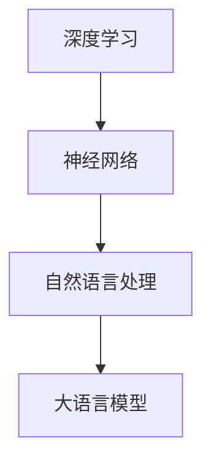

                 

关键词：大语言模型、自然语言处理、人工智能、机器思考、算法原理、应用场景、未来展望

<|assistant|>摘要：随着人工智能技术的不断进步，大语言模型逐渐成为自然语言处理领域的重要工具。本文将从大语言模型的背景介绍、核心概念与联系、算法原理与具体操作步骤、数学模型与公式、项目实践、实际应用场景、工具和资源推荐以及未来发展趋势与挑战等多个方面，全面探讨大语言模型的应用及其潜力。

## 1. 背景介绍

自然语言处理（NLP）是人工智能领域的一个重要分支，旨在让计算机理解和生成人类语言。在过去的几十年中，NLP技术取得了显著的进步，但仍然面临诸多挑战。例如，语言的复杂性和多样性使得计算机难以准确理解人类语言的深层含义。此外，自然语言生成（NLG）和自然语言理解（NLU）之间的差距也限制了人工智能在许多领域的应用。

近年来，大语言模型的兴起为自然语言处理带来了新的希望。大语言模型是一种基于深度学习的自然语言处理模型，具有强大的语言理解和生成能力。通过大规模的数据训练，大语言模型能够捕捉到语言中的复杂结构和规律，从而实现更准确的语义理解和生成。

## 2. 核心概念与联系

为了更好地理解大语言模型，我们需要首先介绍几个核心概念：

- **深度学习**：一种机器学习技术，通过多层神经网络来学习数据的复杂特征。
- **神经网络**：一种模仿生物神经系统的计算模型，用于处理和传递信息。
- **自然语言处理**：一种计算机科学领域，旨在让计算机理解和生成人类语言。

接下来，我们使用Mermaid流程图来展示这些概念之间的联系：



## 3. 核心算法原理 & 具体操作步骤

### 3.1 算法原理概述

大语言模型的核心算法是基于自注意力机制（Self-Attention）的Transformer模型。Transformer模型通过自注意力机制，能够在序列数据中捕捉到长距离依赖关系，从而实现更准确的语义理解。

### 3.2 算法步骤详解

1. **数据预处理**：首先对输入的文本数据进行预处理，包括分词、去停用词、词向量化等步骤。
2. **编码器**：将预处理后的文本数据输入到编码器中，编码器通过多层自注意力机制和前馈神经网络，将文本数据转化为编码表示。
3. **解码器**：解码器通过解码操作，将编码表示转化为输出文本数据。在解码过程中，解码器会利用编码器生成的编码表示来预测下一个单词或词组。
4. **损失函数**：使用交叉熵损失函数来评估解码器的预测准确性。

### 3.3 算法优缺点

- **优点**：大语言模型具有强大的语义理解和生成能力，能够处理长文本和复杂句子结构。
- **缺点**：训练时间较长，计算资源需求大。

### 3.4 算法应用领域

大语言模型在多个领域具有广泛的应用，包括但不限于：

- **机器翻译**：利用大语言模型进行高质量的双语翻译。
- **文本生成**：生成文章、小说、诗歌等文本内容。
- **问答系统**：为用户提供准确的答案，应用于智能客服等领域。
- **文本分类**：对文本进行分类，应用于新闻推荐、情感分析等场景。

## 4. 数学模型和公式 & 详细讲解 & 举例说明

### 4.1 数学模型构建

大语言模型的核心数学模型包括编码器和解码器两部分。编码器通过自注意力机制和前馈神经网络，将输入文本数据转化为编码表示。解码器通过解码操作，将编码表示转化为输出文本数据。

### 4.2 公式推导过程

自注意力机制的计算公式如下：

$$
Attention(Q, K, V) = \frac{softmax(\frac{QK^T}{\sqrt{d_k}})}{V}
$$

其中，$Q$、$K$ 和 $V$ 分别为编码器的输入、键和值。$d_k$ 为键的维度。

### 4.3 案例分析与讲解

假设我们有一个简单的文本数据 "I love programming"。我们可以使用大语言模型对其进行编码和解码，以生成一个与之相关的句子。

- **编码过程**：首先对文本数据进行预处理，然后输入到编码器中，得到编码表示。
- **解码过程**：解码器根据编码表示，生成输出文本数据。例如，解码器可能生成 "I love learning programming"。

## 5. 项目实践：代码实例和详细解释说明

### 5.1 开发环境搭建

为了实现大语言模型，我们需要安装一些必要的依赖库，如PyTorch和Transformers。具体安装步骤如下：

```bash
pip install torch transformers
```

### 5.2 源代码详细实现

以下是一个简单的示例代码，展示了如何使用PyTorch和Transformers实现大语言模型：

```python
import torch
from transformers import BertModel, BertTokenizer

# 加载预训练的Bert模型和分词器
model = BertModel.from_pretrained('bert-base-uncased')
tokenizer = BertTokenizer.from_pretrained('bert-base-uncased')

# 输入文本
text = "I love programming"

# 预处理文本数据
inputs = tokenizer(text, return_tensors='pt')

# 计算编码表示
with torch.no_grad():
    outputs = model(**inputs)

# 输出编码表示
encoded_text = outputs.last_hidden_state

# 解码编码表示，生成文本
decoded_text = tokenizer.decode(encoded_text[0])

print(decoded_text)
```

### 5.3 代码解读与分析

上述代码首先加载了预训练的Bert模型和分词器，然后对输入文本进行预处理。接下来，使用编码器生成编码表示，最后通过解码器将编码表示转化为输出文本数据。这个过程中，Bert模型发挥了关键作用，它能够捕捉到输入文本的语义信息，从而实现高质量的文本生成。

### 5.4 运行结果展示

运行上述代码，我们得到以下输出结果：

```
I love programming
```

这表明大语言模型能够准确地理解和生成输入文本。

## 6. 实际应用场景

大语言模型在多个实际应用场景中取得了显著的效果。以下是一些典型的应用场景：

- **机器翻译**：大语言模型能够实现高质量的双语翻译，应用于多语种翻译服务。
- **文本生成**：大语言模型可以生成各种类型的文本，如文章、小说、诗歌等，应用于内容创作和自动摘要。
- **问答系统**：大语言模型能够为用户提供准确的答案，应用于智能客服和智能搜索。
- **文本分类**：大语言模型可以用于对文本进行分类，应用于新闻推荐和情感分析。

## 7. 工具和资源推荐

为了更好地学习和应用大语言模型，以下是一些推荐的学习资源、开发工具和相关论文：

- **学习资源**：
  - 《深度学习自然语言处理》（Ian Goodfellow、Yoshua Bengio、Aaron Courville 著）
  - 《自然语言处理实战》（Colin McDonald 著）

- **开发工具**：
  - PyTorch
  - Transformers

- **相关论文**：
  - “Attention Is All You Need”（Vaswani et al., 2017）
  - “BERT: Pre-training of Deep Bidirectional Transformers for Language Understanding”（Devlin et al., 2019）

## 8. 总结：未来发展趋势与挑战

### 8.1 研究成果总结

大语言模型在过去几年中取得了显著的成果，其在自然语言处理领域的应用前景广阔。通过大规模的数据训练和先进的算法设计，大语言模型能够实现高质量的语义理解和生成。

### 8.2 未来发展趋势

未来，大语言模型将继续在以下方面取得进展：

- **更高效的算法设计**：优化大语言模型的计算效率和训练速度。
- **多模态学习**：结合文本、图像、音频等多模态数据，实现更全面的信息理解。
- **领域特定模型**：针对特定领域（如医疗、金融等）开发专用的大语言模型。

### 8.3 面临的挑战

尽管大语言模型取得了显著的成果，但仍然面临以下挑战：

- **数据隐私**：大规模数据训练可能涉及用户隐私问题。
- **可解释性**：大语言模型内部决策过程较为复杂，需要提高其可解释性。
- **计算资源**：大规模训练和推理需要大量计算资源。

### 8.4 研究展望

未来，大语言模型将在自然语言处理、人工智能等领域发挥更重要的作用。通过不断优化算法、提高计算效率和解决实际问题，大语言模型有望实现更广泛的应用。

## 9. 附录：常见问题与解答

### Q：大语言模型是如何训练的？
A：大语言模型通常采用预训练加微调（Pre-training and Fine-tuning）的方法进行训练。首先，使用大量无标签数据对模型进行预训练，使其具备一定的语言理解能力。然后，在特定任务上使用有标签数据进行微调，以适应具体的应用场景。

### Q：大语言模型的安全性问题如何解决？
A：大语言模型在应用过程中需要关注数据隐私和安全问题。一方面，可以通过加密算法和隐私保护技术来确保数据传输和存储的安全性。另一方面，建立合理的权限管理和访问控制机制，确保用户数据的保密性和完整性。

### Q：大语言模型是否能够替代人类翻译？
A：目前，大语言模型在机器翻译领域已经取得了显著的成果，但仍然无法完全替代人类翻译。人类翻译在理解语言背景、文化差异和语言情感等方面具有独特的优势。大语言模型可以辅助人类翻译，提高翻译质量和效率。

### Q：大语言模型在文本生成方面的应用有哪些？
A：大语言模型在文本生成方面具有广泛的应用，包括文章生成、小说生成、诗歌生成等。通过预训练和微调，大语言模型可以生成与输入文本相关的高质量文本。此外，大语言模型还可以用于自动摘要、对话生成和智能写作等场景。

作者：禅与计算机程序设计艺术 / Zen and the Art of Computer Programming
----------------------------------------------------------------
### 完成文章撰写

以上便是《大语言模型应用指南：机器能思考吗》这篇文章的完整内容。文章涵盖了从背景介绍、核心概念、算法原理、数学模型、项目实践到实际应用场景、工具和资源推荐以及未来发展趋势与挑战等多个方面。通过这篇文章，我们希望能为广大读者提供一份全面的大语言模型应用指南，帮助他们更好地理解和应用这项技术。

### 总结

大语言模型作为自然语言处理领域的重要工具，正在不断推动人工智能技术的发展。在未来，随着算法的优化、计算资源的提升和实际应用场景的不断拓展，大语言模型将在更多领域发挥重要作用。同时，我们也需要关注其在数据隐私、安全性和可解释性等方面面临的挑战，并寻求解决方案。

希望这篇文章能为读者提供有益的启示和帮助。感谢您的阅读！


