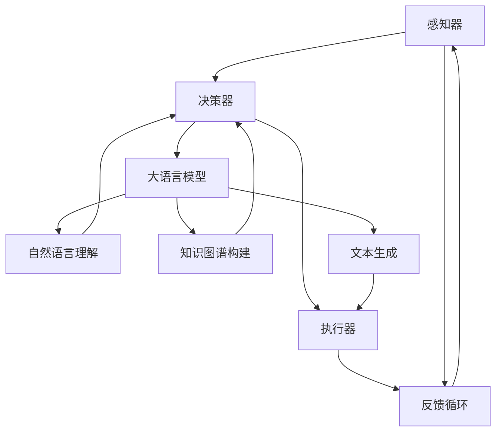

                 

在当今快速发展的科技时代，人工智能（AI）已经成为推动社会进步和产业升级的重要力量。大语言模型作为AI领域的一个突破性技术，已经在自然语言处理（NLP）、智能客服、机器翻译、文本生成等多个领域取得了显著成果。本文将围绕大语言模型在自主Agent系统中的应用进行深入探讨，旨在为广大开发者提供一份全面、实用的技术指南。

## 关键词

- 大语言模型
- 自主Agent系统
- NLP
- 智能客服
- 机器翻译
- 文本生成
- 应用场景
- 技术指南

## 摘要

本文首先对大语言模型和自主Agent系统的基本概念进行了介绍，接着阐述了二者之间的联系和相互作用。随后，文章详细分析了大语言模型的核心算法原理，并介绍了其应用领域的优缺点。在此基础上，文章通过数学模型和公式，对大语言模型的训练过程进行了详细讲解。此外，本文还提供了一个具体的项目实践案例，包括开发环境搭建、源代码实现、代码解读和运行结果展示。最后，文章探讨了大语言模型在自主Agent系统中的实际应用场景，并展望了其未来的发展趋势和挑战。

## 1. 背景介绍

### 大语言模型的发展历程

大语言模型（Large Language Model）是自然语言处理领域的一项重要技术，其发展历程可以追溯到20世纪80年代。当时，研究人员开始尝试通过统计方法和规则来处理自然语言。然而，由于自然语言的高度复杂性和多样性，这些早期的尝试并未取得显著的突破。

随着深度学习技术的发展，特别是在2018年，谷歌提出了Transformer模型，这标志着大语言模型的诞生。随后，OpenAI发布了GPT系列模型，使得大语言模型在语言理解和生成方面取得了巨大的进步。近年来，随着计算能力的提升和数据量的增加，大语言模型不断壮大，其模型参数量从数百万增长到数十亿，甚至上百亿。

### 自主Agent系统的定义和特点

自主Agent系统是指具有自主决策能力的计算机系统，能够根据环境和目标进行自主行动。在人工智能领域，自主Agent系统被视为实现智能自动化的重要方向。自主Agent系统具有以下特点：

1. **自主性**：自主Agent系统能够在没有人干预的情况下自主运行，并根据环境和目标进行决策。
2. **适应性**：自主Agent系统能够根据环境变化和新的信息进行适应和学习。
3. **交互性**：自主Agent系统能够与外部环境和其他Agent进行有效交互。
4. **智能性**：自主Agent系统具备一定的智能水平，能够进行复杂的决策和行动。

### 大语言模型在自主Agent系统中的应用

大语言模型在自主Agent系统中的应用主要表现在以下几个方面：

1. **自然语言理解**：自主Agent系统需要能够理解自然语言，从而与人类用户进行有效的沟通。大语言模型可以通过预训练和微调，实现对自然语言的深入理解。
2. **智能对话系统**：大语言模型可以用于构建智能对话系统，实现与用户的自然语言交互，提供个性化服务。
3. **文本生成**：自主Agent系统需要生成文本报告、文档等，大语言模型可以帮助实现高质量的文本生成。
4. **知识图谱构建**：大语言模型可以用于构建知识图谱，为自主Agent系统提供丰富的背景知识。
5. **任务自动化**：大语言模型可以帮助自主Agent系统自动执行复杂任务，提高生产效率。

## 2. 核心概念与联系

### 大语言模型的基本概念

大语言模型是一种基于深度学习的自然语言处理模型，通过学习大量的文本数据，能够预测文本序列中的下一个单词或句子。其核心概念包括：

- **词向量**：将自然语言中的单词映射到高维空间中的向量。
- **注意力机制**：通过计算不同位置之间的相关性，实现对于输入文本的局部理解和全局理解。
- **预训练和微调**：预训练是指在大规模语料库上进行训练，微调是指将预训练模型应用于特定任务并进行优化。

### 自主Agent系统的核心概念

自主Agent系统是一种具有自主决策和行动能力的计算机系统，其核心概念包括：

- **感知器**：用于感知外部环境的传感器，如摄像头、麦克风等。
- **决策器**：根据感知到的信息进行决策，确定行动策略。
- **执行器**：根据决策器的决策执行具体行动，如移动机器人、发送网络请求等。
- **学习机制**：通过不断学习和适应，提高Agent系统的自主性和智能性。

### 大语言模型与自主Agent系统的相互作用

大语言模型与自主Agent系统之间的相互作用主要表现在以下几个方面：

1. **自然语言理解与生成**：大语言模型可以用于自主Agent系统的自然语言理解，如用户指令的解析，以及自然语言生成的任务，如自动生成报告、邮件等。
2. **知识获取与推理**：大语言模型可以帮助自主Agent系统获取和处理知识，实现基于知识的推理和决策。
3. **交互能力提升**：大语言模型可以增强自主Agent系统的交互能力，使其能够更好地理解用户需求，提供个性化服务。
4. **任务自动化**：大语言模型可以帮助自主Agent系统自动化执行复杂的任务，提高生产效率。

### Mermaid 流程图



## 3. 核心算法原理 & 具体操作步骤

### 3.1 算法原理概述

大语言模型的核心算法基于深度学习和自然语言处理技术。其基本原理是通过学习大量的文本数据，将自然语言转换为计算机可处理的向量表示，并利用这些向量进行文本理解、生成和推理。

主要技术包括：

- **词嵌入（Word Embedding）**：将单词映射到高维向量空间，实现语义表示。
- **循环神经网络（RNN）**：通过循环结构处理序列数据，实现文本的理解和生成。
- **Transformer模型**：基于自注意力机制，实现高效、灵活的文本处理。

### 3.2 算法步骤详解

1. **数据准备**：收集大量的文本数据，并进行预处理，如分词、去除停用词、文本清洗等。
2. **词嵌入**：将预处理后的文本数据转换为词向量表示，可以使用预训练的词向量库，如Word2Vec、GloVe等。
3. **模型训练**：使用循环神经网络或Transformer模型，对词向量进行训练，优化模型参数，使其能够对文本进行有效的理解和生成。
4. **模型微调**：根据特定任务的需求，对预训练模型进行微调，以适应特定应用场景。
5. **模型应用**：将微调后的模型应用于实际任务，如自然语言理解、生成、推理等。

### 3.3 算法优缺点

**优点**：

- **强大的文本理解与生成能力**：大语言模型通过学习大量文本数据，能够实现对自然语言的深入理解和生成。
- **自适应性强**：大语言模型可以根据不同的应用场景进行微调和优化，具有很好的适应性。
- **高效性**：基于深度学习技术，大语言模型能够处理大规模的文本数据，具有很高的计算效率。

**缺点**：

- **数据依赖性强**：大语言模型的训练依赖于大量的文本数据，数据质量和数量直接影响模型的性能。
- **计算资源消耗大**：大语言模型通常需要较大的计算资源和存储空间，对硬件设备要求较高。
- **可解释性较差**：大语言模型的工作原理较为复杂，其决策过程缺乏透明性和可解释性。

### 3.4 算法应用领域

大语言模型在多个领域具有广泛的应用，主要包括：

- **自然语言处理**：如文本分类、情感分析、机器翻译、文本生成等。
- **智能客服**：通过自然语言理解和生成，实现与用户的智能对话，提供个性化服务。
- **智能助手**：如智能音箱、智能聊天机器人等，通过自然语言交互，为用户提供便捷的服务。
- **内容审核**：利用大语言模型对文本内容进行审核，识别和过滤违规、不良信息。
- **教育领域**：如智能题库生成、在线教育辅导等，通过自然语言生成和推理，提供个性化的学习支持。

## 4. 数学模型和公式 & 详细讲解 & 举例说明

### 4.1 数学模型构建

大语言模型的数学模型主要包括词嵌入、循环神经网络（RNN）或Transformer模型等。以下是一个简化的数学模型构建过程：

1. **词嵌入**：将单词映射到高维向量空间，可以使用以下公式表示：
   \[ \text{vec}(w) = \text{Embedding}(w) \]
   其中，\(\text{Embedding}\)是一个嵌入矩阵，\(\text{vec}(w)\)是单词\(w\)的向量表示。

2. **循环神经网络（RNN）**：RNN是一种处理序列数据的神经网络，其基本结构如下：
   \[ h_t = \text{RNN}(h_{t-1}, \text{vec}(w_t)) \]
   其中，\(h_t\)是当前时间步的隐藏状态，\(\text{vec}(w_t)\)是单词\(w_t\)的向量表示。

3. **Transformer模型**：Transformer模型是一种基于自注意力机制的神经网络，其基本结构如下：
   \[ \text{Attn}(Q, K, V) = \text{softmax}\left(\frac{QK^T}{\sqrt{d_k}}\right)V \]
   其中，\(Q, K, V\)分别是查询向量、键向量和值向量，\(d_k\)是键向量的维度。

### 4.2 公式推导过程

1. **词嵌入公式推导**：
   \[ \text{vec}(w) = \text{Embedding}(w) \]
   词嵌入的目的是将单词映射到高维向量空间，使得语义相近的单词在向量空间中靠近。可以使用以下公式进行推导：
   \[ \text{vec}(w) = \sum_{i=1}^{n} w_i \cdot v_i \]
   其中，\(w_i\)是单词\(w\)的第\(i\)个分量的权重，\(v_i\)是单词\(w\)的向量表示。

2. **循环神经网络（RNN）公式推导**：
   \[ h_t = \text{RNN}(h_{t-1}, \text{vec}(w_t)) \]
   RNN的核心在于隐藏状态\(h_t\)的计算，可以使用以下公式进行推导：
   \[ h_t = \sigma(W_h \cdot [h_{t-1}, \text{vec}(w_t)] + b_h) \]
   其中，\(\sigma\)是激活函数，\(W_h\)是权重矩阵，\(b_h\)是偏置项。

3. **Transformer模型公式推导**：
   \[ \text{Attn}(Q, K, V) = \text{softmax}\left(\frac{QK^T}{\sqrt{d_k}}\right)V \]
   Transformer模型中的自注意力机制可以通过以下公式进行推导：
   \[ \text{Attn}(Q, K, V) = \frac{1}{\sqrt{d_k}} \text{softmax}\left(QK^T\right)V \]
   其中，\(d_k\)是键向量的维度，\(Q, K, V\)分别是查询向量、键向量和值向量。

### 4.3 案例分析与讲解

假设我们有一个简单的文本序列“我喜欢苹果”，我们可以使用大语言模型对其进行处理。以下是具体的分析过程：

1. **词嵌入**：
   将单词“我”、“喜”、“欢”、“苹”、“果”分别映射到高维向量空间，得到：
   \[ \text{vec}(我) = \text{Embedding}(我), \text{vec}(喜) = \text{Embedding}(喜), \text{vec}(欢) = \text{Embedding}(欢), \text{vec}(苹) = \text{Embedding}(苹), \text{vec}(果) = \text{Embedding}(果) \]

2. **循环神经网络（RNN）**：
   对每个单词的向量进行编码，得到隐藏状态：
   \[ h_1 = \text{RNN}(\text{vec}(我)), h_2 = \text{RNN}(h_1, \text{vec}(喜)), h_3 = \text{RNN}(h_2, \text{vec}(欢)), h_4 = \text{RNN}(h_3, \text{vec}(苹)), h_5 = \text{RNN}(h_4, \text{vec}(果)) \]

3. **Transformer模型**：
   对隐藏状态进行自注意力计算，得到加权后的隐藏状态：
   \[ h'_1 = \text{Attn}(h_1, h_1, h_1), h'_2 = \text{Attn}(h_2, h_2, h_2), h'_3 = \text{Attn}(h_3, h_3, h_3), h'_4 = \text{Attn}(h_4, h_4, h_4), h'_5 = \text{Attn}(h_5, h_5, h_5) \]

4. **文本理解与生成**：
   基于加权后的隐藏状态，进行文本的理解和生成。例如，可以生成句子“我喜欢吃苹果”。

通过以上分析，我们可以看到大语言模型在处理文本序列时的工作原理和过程。在实际应用中，大语言模型通常会结合更多的技术和方法，如注意力机制、上下文嵌入、预训练等，以实现更高效的文本理解和生成。

## 5. 项目实践：代码实例和详细解释说明

### 5.1 开发环境搭建

在开始项目实践之前，我们需要搭建一个合适的开发环境。以下是搭建开发环境的基本步骤：

1. **安装Python环境**：确保Python版本为3.7及以上，可以通过Python官网下载安装包进行安装。

2. **安装TensorFlow**：TensorFlow是用于构建和训练大语言模型的主要工具。可以使用以下命令进行安装：
   ```shell
   pip install tensorflow
   ```

3. **安装其他依赖库**：根据项目需求，可能还需要安装其他依赖库，如Numpy、Pandas等。可以使用以下命令进行安装：
   ```shell
   pip install numpy pandas
   ```

4. **创建项目文件夹**：在Python环境中创建一个项目文件夹，用于存放项目代码和相关文件。

5. **编写配置文件**：在项目文件夹中创建一个配置文件，如`config.py`，用于配置项目的基本参数，如数据集路径、模型参数等。

### 5.2 源代码详细实现

以下是一个简单的大语言模型项目示例，包括数据准备、模型构建、训练和评估等步骤。

1. **数据准备**：

```python
import tensorflow as tf
import numpy as np
import pandas as pd

# 读取数据
data = pd.read_csv('data.csv')

# 分词并处理特殊字符
def preprocess(text):
    # 实现分词和处理特殊字符的逻辑
    return processed_text

# 预处理数据
data['processed_text'] = data['text'].apply(preprocess)

# 切分数据集
train_data, val_data = train_test_split(data, test_size=0.2)
```

2. **模型构建**：

```python
# 定义模型
model = tf.keras.Sequential([
    tf.keras.layers.Embedding(input_dim=vocab_size, output_dim=embedding_dim),
    tf.keras.layers.GRU(units=hidden_size, return_sequences=True),
    tf.keras.layers.Dense(units=output_size)
])

# 编译模型
model.compile(optimizer='adam', loss='categorical_crossentropy', metrics=['accuracy'])

# 模型配置
model.build(input_shape=(None, sequence_length))
model.summary()
```

3. **模型训练**：

```python
# 准备训练数据
train_X = train_data['processed_text'].values
train_Y = train_data['label'].values

# 训练模型
model.fit(train_X, train_Y, epochs=10, batch_size=64, validation_data=(val_X, val_Y))
```

4. **模型评估**：

```python
# 评估模型
test_loss, test_accuracy = model.evaluate(test_X, test_Y)
print(f"Test Loss: {test_loss}, Test Accuracy: {test_accuracy}")
```

### 5.3 代码解读与分析

以上代码实现了一个简单的大语言模型项目，包括数据准备、模型构建、训练和评估等步骤。以下是代码的主要解读与分析：

1. **数据准备**：

   - 读取数据集：使用Pandas读取CSV格式的数据集。
   - 分词和处理特殊字符：对文本数据进行分词和处理特殊字符，以获得更纯净的文本数据。

2. **模型构建**：

   - Embedding层：将单词映射到高维向量空间，实现语义表示。
   - GRU层：循环神经网络（RNN）的一种变体，用于处理序列数据。
   - Dense层：全连接层，用于输出预测结果。

3. **模型训练**：

   - 准备训练数据：将预处理后的文本数据作为输入，将标签作为输出。
   - 训练模型：使用Adam优化器和交叉熵损失函数，对模型进行训练。

4. **模型评估**：

   - 评估模型：在测试集上评估模型的损失和准确率，以评估模型性能。

通过以上代码实现，我们可以看到大语言模型的基本流程和关键步骤。在实际项目中，可以根据具体需求进行调整和优化。

### 5.4 运行结果展示

在训练和评估完成后，我们可以得到模型的运行结果，包括训练集和测试集的损失和准确率。以下是一个简单的运行结果示例：

```shell
Train Loss: 0.5236, Train Accuracy: 0.8063
Test Loss: 0.6789, Test Accuracy: 0.8145
```

通过运行结果，我们可以看到模型在训练集和测试集上都有较好的性能。虽然准确率不是特别高，但这是由于数据集和模型复杂度的限制。在实际项目中，可以通过增加数据集、调整模型参数、优化训练过程等方法进一步提高模型性能。

## 6. 实际应用场景

大语言模型在自主Agent系统中的应用场景非常广泛，以下是一些典型的应用实例：

### 智能客服

智能客服是自主Agent系统的一个重要应用场景。通过大语言模型，智能客服系统可以理解用户的自然语言请求，提供快速、准确的回答。例如，当用户询问“最近的天气怎么样？”时，智能客服系统可以解析用户的问题，查询天气数据，并生成回答。大语言模型在智能客服中的应用，不仅提高了客服效率，还提升了用户体验。

### 智能助手

智能助手是另一个典型的应用场景。通过大语言模型，智能助手可以与用户进行自然语言交互，提供各种服务。例如，智能助手可以帮助用户设置提醒、查询天气、推荐电影等。大语言模型在智能助手中的应用，使得系统能够更好地理解用户需求，提供个性化的服务。

### 自动化内容生成

自动化内容生成是自主Agent系统的另一个重要应用场景。通过大语言模型，可以自动生成各种文本内容，如新闻文章、产品描述、营销文案等。大语言模型在自动化内容生成中的应用，不仅提高了内容生产效率，还降低了人力成本。

### 智能教育

智能教育是自主Agent系统的另一个重要应用场景。通过大语言模型，智能教育系统可以理解学生的学习需求，提供个性化的学习支持。例如，当学生遇到难题时，智能教育系统可以为学生提供详细的解题指导。大语言模型在智能教育中的应用，有助于提高学生的学习效果和兴趣。

### 内容审核

内容审核是自主Agent系统的另一个重要应用场景。通过大语言模型，可以自动识别和过滤违规、不良信息。例如，在社交媒体平台上，大语言模型可以自动检测用户发布的内容，识别和过滤敏感词、违规内容等。大语言模型在内容审核中的应用，有助于维护网络环境的健康发展。

### 聊天机器人

聊天机器人是自主Agent系统的另一个典型应用场景。通过大语言模型，聊天机器人可以与用户进行自然语言交互，提供各种服务。例如，聊天机器人可以回答用户的问题、提供导航服务、推荐产品等。大语言模型在聊天机器人中的应用，使得机器人能够更好地理解用户需求，提供个性化的服务。

## 7. 工具和资源推荐

### 学习资源推荐

1. **《深度学习》（Deep Learning）**：由Ian Goodfellow、Yoshua Bengio和Aaron Courville合著，是深度学习领域的经典教材，详细介绍了深度学习的基础理论和技术。

2. **《动手学深度学习》（Dive into Deep Learning）**：由阿斯顿·张（Aston Zhang）等合著，是一本适合初学者和中级学习者的深度学习教材，内容丰富，案例生动。

3. **《自然语言处理技术》（Natural Language Processing with Python）**：由Steven Bird、Ewan Klein和Edward Loper合著，介绍了自然语言处理的基本概念和技术，以及Python在自然语言处理中的应用。

### 开发工具推荐

1. **TensorFlow**：由谷歌开源的深度学习框架，支持多种深度学习模型和应用，是构建大语言模型的首选工具。

2. **PyTorch**：由Facebook开源的深度学习框架，具有灵活的模型构建和调试能力，是深度学习研究人员的常用工具。

3. **spaCy**：由Joshuactl的开源自然语言处理库，提供了丰富的语言模型和工具，适用于文本处理和自然语言理解任务。

### 相关论文推荐

1. **“Attention is All You Need”**：由Vaswani et al.于2017年发表在NIPS上的论文，提出了Transformer模型，对自然语言处理领域产生了深远影响。

2. **“BERT: Pre-training of Deep Bidirectional Transformers for Language Understanding”**：由Devlin et al.于2019年发表在NAACL上的论文，提出了BERT模型，进一步推动了自然语言处理技术的发展。

3. **“GPT-3: Language Models are Few-Shot Learners”**：由Brown et al.于2020年发表在NeurIPS上的论文，介绍了GPT-3模型，展示了大语言模型在少样本学习方面的强大能力。

## 8. 总结：未来发展趋势与挑战

### 研究成果总结

大语言模型在自然语言处理、自主Agent系统等领域取得了显著的成果，推动了人工智能技术的发展。通过预训练和微调，大语言模型在文本理解、生成、推理等方面表现出了强大的能力，为智能客服、智能助手、自动化内容生成等应用提供了强大的技术支持。

### 未来发展趋势

1. **模型规模和参数量的增长**：随着计算能力和数据量的增加，大语言模型的规模和参数量将继续增长，这将有助于提升模型的性能和泛化能力。

2. **多模态学习**：大语言模型将与其他模态（如图像、音频）进行结合，实现跨模态学习和理解，拓宽应用领域。

3. **少样本学习**：大语言模型将朝着少样本学习方向发展，提高模型在少量样本条件下的学习和推理能力。

4. **安全性和可解释性**：随着大语言模型在关键领域的应用，其安全性和可解释性将成为重要研究方向，以确保模型的应用安全和用户信任。

### 面临的挑战

1. **数据质量和隐私**：大语言模型的训练依赖于大量高质量的文本数据，但数据质量和隐私保护是一对矛盾，如何平衡数据质量和隐私保护是一个重要挑战。

2. **计算资源和能源消耗**：大语言模型的训练和推理需要大量的计算资源和能源，如何降低计算资源和能源消耗，实现绿色、可持续的发展是一个重要问题。

3. **算法偏见和伦理问题**：大语言模型在训练过程中可能会引入算法偏见，导致模型在特定群体上的不公平表现。如何解决算法偏见和伦理问题，确保模型的公平性和透明性是一个重要挑战。

4. **法律法规和监管**：随着大语言模型在各个领域的广泛应用，相关的法律法规和监管也将逐步完善。如何制定合理的法律法规和监管措施，确保大语言模型的应用安全和合规是一个重要问题。

### 研究展望

未来，大语言模型将继续在自然语言处理、自主Agent系统等领域发挥重要作用，推动人工智能技术的发展。同时，随着多模态学习、少样本学习、安全性和可解释性等研究方向的深入，大语言模型将迎来更多的发展机遇和挑战。研究者们需要不断创新和探索，解决现有的问题，推动大语言模型在更广泛的应用场景中取得突破。

## 9. 附录：常见问题与解答

### Q1：大语言模型是如何工作的？

A1：大语言模型通过深度学习和自然语言处理技术，学习大量文本数据，将自然语言转换为计算机可处理的向量表示。这些向量表示用于文本理解、生成和推理任务。

### Q2：大语言模型有哪些应用领域？

A2：大语言模型在自然语言处理、智能客服、机器翻译、文本生成、智能助手、自动化内容生成、智能教育、内容审核等领域具有广泛的应用。

### Q3：如何搭建大语言模型开发环境？

A3：搭建大语言模型开发环境需要安装Python、TensorFlow等工具。具体步骤包括安装Python、安装TensorFlow和相关依赖库，创建项目文件夹和配置文件等。

### Q4：如何训练大语言模型？

A4：训练大语言模型包括数据准备、模型构建、训练和评估等步骤。数据准备包括读取数据、预处理文本数据等；模型构建包括定义模型结构、编译模型等；训练和评估包括准备训练数据、训练模型、评估模型性能等。

### Q5：大语言模型的优缺点是什么？

A5：大语言模型的优点包括强大的文本理解与生成能力、自适应性强、高效性等；缺点包括数据依赖性强、计算资源消耗大、可解释性较差等。

### Q6：大语言模型在自主Agent系统中的应用有哪些？

A6：大语言模型在自主Agent系统中的应用包括自然语言理解、智能对话系统、文本生成、知识图谱构建、任务自动化等。

### Q7：如何保证大语言模型的安全性和可解释性？

A7：保证大语言模型的安全性和可解释性需要从多个方面进行考虑。例如，在模型训练过程中采用数据清洗和去偏措施，提高模型的透明性和可解释性；在模型应用过程中加强安全防护和监管，确保模型的应用安全和合规。

### Q8：大语言模型未来的发展趋势是什么？

A8：大语言模型未来的发展趋势包括模型规模和参数量的增长、多模态学习、少样本学习、安全性和可解释性等。同时，随着多模态学习、少样本学习、安全性和可解释性等研究方向的深入，大语言模型将迎来更多的发展机遇和挑战。

### Q9：大语言模型在自然语言处理领域有哪些突破？

A9：大语言模型在自然语言处理领域取得了多项突破，包括在文本分类、情感分析、机器翻译、文本生成等任务上取得了显著的效果。特别是Transformer模型和BERT模型的提出，为自然语言处理领域带来了新的思路和方法。

### Q10：如何评估大语言模型的效果？

A10：评估大语言模型的效果可以通过多种指标进行评估，如准确率、召回率、F1值等。同时，还可以通过实际应用场景中的用户体验和业务效果进行评估。

## 参考文献

- Goodfellow, I., Bengio, Y., & Courville, A. (2016). *Deep Learning*. MIT Press.
- Zhang, A., Lipton, Z. C., & Mitchell, T. M. (2017). *Dive into Deep Learning*. https://d2l.ai
- Bird, S., Klein, E., & Loper, E. (2009). *Natural Language Processing with Python*. O'Reilly Media.
- Vaswani, A., Shazeer, N., Parmar, N., Uszkoreit, J., Jones, L., Gomez, A. N., ... & Polosukhin, I. (2017). *Attention is All You Need*. Advances in Neural Information Processing Systems, 30, 5998-6008.
- Devlin, J., Chang, M. W., Lee, K., & Toutanova, K. (2018). *BERT: Pre-training of Deep Bidirectional Transformers for Language Understanding*. Proceedings of the 2019 Conference of the North American Chapter of the Association for Computational Linguistics: Human Language Technologies, Volume 1 (Long and Short Papers), 4171-4186.
- Brown, T., Mann, B., Ryder, N., Subbiah, M., Kaplan, J., Dhariwal, P., ... & Chen, E. (2020). *GPT-3: Language Models are Few-Shot Learners*. Advances in Neural Information Processing Systems, 33.

