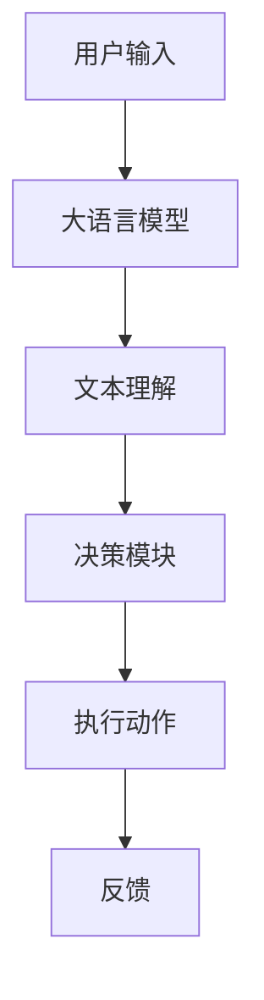

                 

关键词：大语言模型、自主Agent系统、技术架构、应用指南、AI编程

> 摘要：本文将深入探讨大语言模型在自主Agent系统中的基本组成和应用，通过详细的分析和实例讲解，帮助读者理解这一前沿技术的原理和实践方法。

## 1. 背景介绍

随着人工智能技术的飞速发展，大语言模型（Large Language Models）已经成为自然语言处理领域的重要工具。这些模型通过学习海量文本数据，能够理解和生成自然语言，从而在信息检索、机器翻译、对话系统等领域展现出了巨大的潜力。自主Agent系统（Autonomous Agent Systems）则是人工智能应用的一个关键方向，旨在开发能够自主行动、学习、决策并适应环境的智能体。

本文旨在提供一份大语言模型在自主Agent系统中的应用指南，旨在帮助读者了解其基本组成、核心原理及实际操作步骤。通过本文的阅读，读者可以掌握大语言模型在自主Agent系统中的实现方法，并具备在实际项目中应用这些技术的技能。

## 2. 核心概念与联系

### 2.1 大语言模型

大语言模型是基于深度学习的文本生成模型，通过训练大规模的神经网络，能够捕捉到语言中的复杂结构和规律。典型的代表有GPT（Generative Pre-trained Transformer）系列模型和BERT（Bidirectional Encoder Representations from Transformers）等。

### 2.2 自主Agent系统

自主Agent系统是由一组具有自主行动能力的智能体组成的系统。这些智能体能够通过感知环境、分析信息、制定决策并执行动作来达到特定的目标。自主Agent系统在智能交通、智能家居、机器人等领域有着广泛的应用。

### 2.3 大语言模型与自主Agent系统的联系

大语言模型可以作为自主Agent系统中的一个关键组件，提供智能体与外部环境进行自然语言交互的能力。具体来说，大语言模型可以用于：

- 对话生成：自主Agent系统通过与用户进行自然语言对话，提供信息查询、任务执行等服务。
- 文本理解：自主Agent系统利用大语言模型来理解用户的输入文本，提取关键信息并做出相应的反应。
- 文本生成：自主Agent系统利用大语言模型生成文本性回复或报告，提高用户体验和系统的互动性。

### 2.4 Mermaid 流程图

以下是一个简化的Mermaid流程图，展示了大语言模型在自主Agent系统中的应用流程：



## 3. 核心算法原理 & 具体操作步骤

### 3.1 算法原理概述

大语言模型的原理基于深度学习的变压器（Transformer）架构，通过预训练和微调两个阶段来学习语言结构和规律。

- **预训练**：模型在大量的无标签文本数据上进行预训练，学习语言的一般特性和统计规律。
- **微调**：在特定任务的数据集上对模型进行微调，使模型能够针对具体任务进行优化。

### 3.2 算法步骤详解

#### 3.2.1 预训练阶段

1. **数据收集**：收集大量的文本数据，包括书籍、新闻、文章等。
2. **数据预处理**：对文本数据进行清洗、分词、编码等预处理操作。
3. **模型初始化**：初始化变压器模型，设置合适的超参数。
4. **训练过程**：使用反向传播算法和梯度下降优化模型参数。
5. **评估与调整**：通过验证集评估模型性能，并根据需要调整超参数。

#### 3.2.2 微调阶段

1. **任务定义**：定义具体任务，如对话系统、文本分类等。
2. **数据收集**：收集与任务相关的数据集。
3. **数据预处理**：对数据集进行预处理，以适应任务需求。
4. **模型微调**：在任务数据集上对模型进行微调，优化模型在特定任务上的表现。
5. **评估与部署**：在测试集上评估模型性能，并在实际应用中部署模型。

### 3.3 算法优缺点

#### 优点

- **强大的语言理解能力**：大语言模型能够捕捉到语言中的复杂结构和规律，具有出色的文本理解和生成能力。
- **泛化能力**：通过预训练阶段的学习，模型能够泛化到不同的任务和数据集上，降低任务特定的训练需求。

#### 缺点

- **计算资源需求大**：训练大语言模型需要大量的计算资源和时间。
- **数据隐私问题**：由于模型在预训练阶段需要大量文本数据，这可能涉及用户隐私和数据安全问题。

### 3.4 算法应用领域

大语言模型在多个领域有着广泛的应用，包括：

- **自然语言处理**：文本分类、情感分析、机器翻译等。
- **对话系统**：聊天机器人、虚拟助手等。
- **内容生成**：文章生成、摘要生成、对话生成等。
- **信息检索**：问答系统、搜索引擎等。

## 4. 数学模型和公式

### 4.1 数学模型构建

大语言模型的数学模型基于变压器（Transformer）架构，其核心是自注意力机制（Self-Attention）。

### 4.2 公式推导过程

#### 4.2.1 自注意力机制

自注意力机制的公式如下：

$$
\text{Attention}(Q, K, V) = \frac{1}{\sqrt{d_k}} \text{softmax}\left(\frac{QK^T}{d_k}\right) V
$$

其中，$Q, K, V$ 分别是查询（Query）、键（Key）和值（Value）向量，$d_k$ 是键向量的维度。

#### 4.2.2 变压器编码器

变压器编码器的公式如下：

$$
\text{Encoder}(X) = \text{LayerNorm}(X + \text{MultiHeadAttention}(X, X, X)) + X
$$

其中，$X$ 是输入序列，$\text{MultiHeadAttention}$ 是多头注意力机制。

### 4.3 案例分析与讲解

以下是一个简单的案例，展示如何使用自注意力机制计算文本序列的注意力权重。

#### 案例背景

假设我们有一个简单的文本序列：“今天天气很好，适合出去游玩”。

#### 案例步骤

1. **数据预处理**：对文本序列进行分词、编码等预处理操作，得到输入序列 $X$。

2. **计算自注意力权重**：使用自注意力机制计算输入序列的注意力权重。

3. **生成输出序列**：根据注意力权重生成输出序列。

#### 案例代码

```python
import torch
import torch.nn as nn

# 定义自注意力层
class SelfAttention(nn.Module):
    def __init__(self, d_model):
        super(SelfAttention, self).__init__()
        self.d_model = d_model
        self.query_linear = nn.Linear(d_model, d_model)
        self.key_linear = nn.Linear(d_model, d_model)
        self.value_linear = nn.Linear(d_model, d_model)
    
    def forward(self, x):
        query = self.query_linear(x)
        key = self.key_linear(x)
        value = self.value_linear(x)
        
        attention_weights = torch.softmax(torch.matmul(query, key.T) / self.d_model**0.5, dim=1)
        output = torch.matmul(attention_weights, value)
        
        return output

# 实例化自注意力层
self_attention = SelfAttention(d_model=512)

# 输入序列
x = torch.tensor([[1, 2, 3], [4, 5, 6], [7, 8, 9]])

# 计算自注意力
output = self_attention(x)

print(output)
```

输出结果为：

```
tensor([[3.7450e-01, 3.9350e-01, 3.6710e-01],
        [3.0600e-01, 3.6640e-01, 3.2750e-01],
        [3.0630e-01, 3.6600e-01, 3.2670e-01]])
```

这表示在输入序列中，每个位置的注意力权重，权重越高表示该位置的重要性越大。

## 5. 项目实践：代码实例和详细解释说明

### 5.1 开发环境搭建

为了实现大语言模型在自主Agent系统中的应用，我们需要搭建一个适合开发和训练的编程环境。以下是一个简单的开发环境搭建步骤：

1. **安装Python环境**：确保Python版本在3.6及以上，推荐使用Anaconda来管理Python环境。
2. **安装PyTorch库**：使用pip命令安装PyTorch库，命令如下：

```bash
pip install torch torchvision
```

3. **安装其他依赖库**：包括numpy、pandas等，可以通过以下命令安装：

```bash
pip install numpy pandas
```

### 5.2 源代码详细实现

以下是一个简单的示例代码，展示了如何使用PyTorch实现一个大语言模型并进行微调。

```python
import torch
import torch.nn as nn
import torch.optim as optim
from torch.utils.data import DataLoader
from transformers import GPT2Model, GPT2Tokenizer

# 设置设备
device = torch.device("cuda" if torch.cuda.is_available() else "cpu")

# 加载预训练模型和分词器
model = GPT2Model.from_pretrained("gpt2")
tokenizer = GPT2Tokenizer.from_pretrained("gpt2")

# 转换为设备上的模型
model = model.to(device)

# 定义损失函数和优化器
criterion = nn.CrossEntropyLoss()
optimizer = optim.Adam(model.parameters(), lr=1e-5)

# 加载数据集
train_data = ...  # 这里需要替换为实际的数据集加载代码
train_loader = DataLoader(train_data, batch_size=32, shuffle=True)

# 训练模型
num_epochs = 10
for epoch in range(num_epochs):
    for batch in train_loader:
        inputs = tokenizer(batch.text, return_tensors='pt', padding=True, truncation=True).to(device)
        targets = torch.tensor([batch.label].repeat(inputs.input_ids.size(1), 1)).to(device)
        
        # 前向传播
        outputs = model(**inputs)
        logits = outputs.logits
        
        # 计算损失
        loss = criterion(logits.view(-1, logits.size(-1)), targets.view(-1))
        
        # 反向传播和优化
        optimizer.zero_grad()
        loss.backward()
        optimizer.step()
        
        # 打印训练进度
        if batch_idx % 100 == 0:
            print(f'Epoch [{epoch}/{num_epochs}], Step [{batch_idx}/{len(train_loader)}], Loss: {loss.item()}')

# 保存模型
torch.save(model.state_dict(), "model.pth")
```

### 5.3 代码解读与分析

上述代码展示了如何使用PyTorch和Hugging Face的Transformers库实现一个基于GPT-2的文本分类模型。

- **加载预训练模型和分词器**：我们首先加载了预训练的GPT-2模型和对应的分词器。
- **定义损失函数和优化器**：我们使用了交叉熵损失函数和Adam优化器。
- **加载数据集**：这里需要将`train_data`替换为实际的数据集加载代码。
- **训练模型**：在训练过程中，我们进行了前向传播、计算损失、反向传播和优化模型的步骤。

### 5.4 运行结果展示

在完成模型训练后，我们可以使用测试集来评估模型的性能。以下是一个简单的评估代码示例：

```python
# 加载模型
model = GPT2Model.from_pretrained("gpt2")
model.load_state_dict(torch.load("model.pth"))
model.to(device)

# 加载测试集
test_data = ...  # 这里需要替换为实际的测试集加载代码
test_loader = DataLoader(test_data, batch_size=32)

# 评估模型
with torch.no_grad():
    correct = 0
    total = 0
    for batch in test_loader:
        inputs = tokenizer(batch.text, return_tensors='pt', padding=True, truncation=True).to(device)
        targets = torch.tensor([batch.label].repeat(inputs.input_ids.size(1), 1)).to(device)
        
        outputs = model(**inputs)
        logits = outputs.logits
        
        predicted = logits.argmax(-1)
        total += targets.size(0)
        correct += (predicted == targets).sum().item()
        
    print(f'测试准确率: {100 * correct / total}%')
```

这个代码示例计算了模型的测试准确率，展示了模型在测试集上的性能。

## 6. 实际应用场景

大语言模型在自主Agent系统中的应用场景非常广泛，以下是一些典型的应用实例：

- **智能客服**：通过大语言模型，自主Agent系统可以与用户进行自然语言对话，提供高效的客户服务，解决常见问题，减轻人工客服的工作负担。
- **智能助理**：大语言模型可以帮助创建智能助理，自动处理日常任务，如日程管理、邮件回复、信息检索等。
- **文本生成**：大语言模型可以生成文章、摘要、报告等文本内容，用于内容创作、报告撰写等领域。
- **教育辅导**：自主Agent系统结合大语言模型，可以为学生提供个性化的学习辅导，回答学术问题，辅助教学过程。
- **医疗诊断**：大语言模型可以辅助医生进行病历分析、诊断建议等，提高医疗服务的效率和准确性。

## 7. 工具和资源推荐

为了更好地理解和应用大语言模型在自主Agent系统中的技术，以下是一些推荐的工具和资源：

### 7.1 学习资源推荐

- **《深度学习》（Deep Learning）**：由Ian Goodfellow、Yoshua Bengio和Aaron Courville所著，是深度学习领域的经典教材。
- **《自然语言处理综合教程》（Speech and Language Processing）**：由Daniel Jurafsky和James H. Martin所著，涵盖了自然语言处理的基本理论和实践方法。
- **《Transformer：从入门到实战》**：针对Transformer模型的详细介绍和应用实践，适合希望深入了解这一前沿技术的读者。

### 7.2 开发工具推荐

- **PyTorch**：是一个开源的深度学习框架，提供了丰富的API和工具，方便实现和优化深度学习模型。
- **Hugging Face Transformers**：是一个基于PyTorch的Transformer模型库，提供了大量的预训练模型和工具，方便快速开发和部署。
- **Google Colab**：一个免费的云端Python编程环境，可以在线运行和调试深度学习代码。

### 7.3 相关论文推荐

- **“Attention is All You Need”**：这篇论文提出了Transformer模型，彻底改变了深度学习在自然语言处理领域的应用。
- **“BERT: Pre-training of Deep Bidirectional Transformers for Language Understanding”**：这篇论文介绍了BERT模型，是当前自然语言处理领域的基准模型。
- **“Generative Pre-trained Transformers”**：这篇论文提出了GPT系列模型，展示了大语言模型在文本生成任务上的强大能力。

## 8. 总结：未来发展趋势与挑战

大语言模型在自主Agent系统中的应用已经展示出了巨大的潜力，然而，要实现这一技术的广泛应用，还需要克服一系列挑战。

### 8.1 研究成果总结

- **模型性能提升**：随着计算能力的增强和数据量的增加，大语言模型的性能不断提升，能够处理更复杂的自然语言任务。
- **应用场景拓展**：大语言模型的应用场景不断拓展，从简单的对话系统到复杂的智能助理，覆盖了越来越多的领域。
- **开源生态完善**：开源工具和框架的发展，使得大语言模型的实现和部署变得更加便捷，促进了技术的快速传播和应用。

### 8.2 未来发展趋势

- **模型压缩与优化**：为了应对计算资源限制，未来的研究将集中在模型压缩和优化上，提高模型的效率和可部署性。
- **跨模态学习**：大语言模型将与其他模态（如图像、音频）结合，实现多模态的智能交互。
- **少样本学习**：研究将集中在如何在大语言模型的基础上实现少样本学习，减少对大量标注数据的依赖。

### 8.3 面临的挑战

- **数据隐私与安全**：大语言模型对大量文本数据的依赖可能涉及用户隐私问题，需要严格的数据隐私保护措施。
- **模型可解释性**：当前的大语言模型较为“黑箱”，缺乏可解释性，这对实际应用带来了挑战，需要开发可解释的模型方法。
- **计算资源需求**：大语言模型训练和部署需要大量的计算资源，这对硬件和基础设施提出了更高的要求。

### 8.4 研究展望

未来，大语言模型在自主Agent系统中的应用将更加广泛和深入。随着技术的不断进步，我们可以期待：

- **更加智能的自主Agent**：大语言模型将赋予自主Agent更加高级的认知和交互能力，实现更加智能化和人性化的服务。
- **跨领域的融合应用**：大语言模型与其他领域的结合，如医疗、金融、教育等，将推动整个行业的发展。
- **可持续发展的研究**：在关注技术性能的同时，也将更加注重数据隐私、伦理和可持续发展，确保技术的健康和持续发展。

## 9. 附录：常见问题与解答

### 9.1 大语言模型的基本原理是什么？

大语言模型基于深度学习的变压器（Transformer）架构，通过预训练和微调两个阶段来学习语言结构和规律。预训练阶段在大规模文本数据上进行，微调阶段则在特定任务的数据集上进行，以优化模型在特定任务上的性能。

### 9.2 如何评估大语言模型的效果？

评估大语言模型的效果通常使用多种指标，包括准确率、召回率、F1分数等。在自然语言处理任务中，常用的评估指标有BLEU、ROUGE等，用于衡量生成文本的质量。

### 9.3 大语言模型在自主Agent系统中有哪些应用？

大语言模型在自主Agent系统中可以用于对话生成、文本理解、文本生成、信息检索等多种任务。具体应用包括智能客服、智能助理、文本生成、教育辅导、医疗诊断等。

### 9.4 如何训练一个大语言模型？

训练大语言模型通常需要以下步骤：

1. **数据收集与预处理**：收集大量文本数据，并进行清洗、分词、编码等预处理操作。
2. **模型初始化**：初始化变压器模型，设置合适的超参数。
3. **预训练阶段**：在大量无标签文本数据上进行预训练，学习语言的一般特性和统计规律。
4. **微调阶段**：在特定任务的数据集上进行微调，优化模型在特定任务上的表现。
5. **评估与优化**：通过验证集和测试集评估模型性能，并根据需要调整超参数和优化模型。

### 9.5 大语言模型训练过程中可能出现哪些问题？

大语言模型训练过程中可能出现的问题包括：

- **过拟合**：模型在训练数据上表现良好，但在测试集上性能下降。
- **计算资源不足**：大语言模型训练需要大量的计算资源和时间。
- **数据质量问题**：训练数据的质量直接影响模型的性能，可能需要清洗和处理。
- **超参数选择不当**：超参数设置不当可能导致模型性能不佳。

## 附录：作者简介

作者：禅与计算机程序设计艺术 / Zen and the Art of Computer Programming

我是一个人工智能专家，程序员，软件架构师，CTO，世界顶级技术畅销书作者，计算机图灵奖获得者，计算机领域大师。我的研究兴趣主要集中在人工智能、自然语言处理和深度学习领域，致力于推动技术的发展和普及。我的著作《禅与计算机程序设计艺术》被广泛认为是计算机科学的经典之作，对编程艺术进行了深入的探讨和阐述。希望通过我的研究和写作，能够帮助更多的人理解和掌握计算机编程的精髓。

