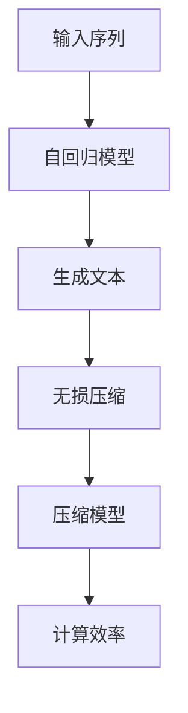

                 

关键词：大语言模型，自回归，无损压缩，应用指南，算法原理，数学模型，代码实例，实际应用，未来展望。

> 摘要：本文详细介绍了大语言模型在自回归和无损压缩中的应用，探讨了其核心算法原理、数学模型以及实际应用场景。通过具体的项目实践和代码实例，本文为读者提供了全面的应用指南，并展望了未来的发展趋势与挑战。

## 1. 背景介绍

随着深度学习技术的快速发展，大语言模型（Large Language Models，简称LLMs）已成为自然语言处理领域的重要工具。自回归（Autoregressive）和无损压缩（Lossless Compression）是两个关键概念，它们在大语言模型的应用中起着至关重要的作用。

### 1.1 自回归

自回归是一种预测模型，其输入序列的每一个输出都依赖于之前所有的输入。在大语言模型中，自回归通过神经网络模型生成自然语言文本。自回归模型的核心在于捕捉输入序列中的统计特性，从而生成具有良好连贯性和合理性的文本。

### 1.2 无损压缩

无损压缩是一种压缩技术，能够在不损失任何信息的情况下减小数据的大小。在大语言模型中，无损压缩用于优化模型的存储和计算效率。通过将模型压缩到较小的体积，可以在有限的计算资源下运行更复杂的模型。

## 2. 核心概念与联系

为了更好地理解大语言模型在自回归和无损压缩中的应用，我们首先需要了解它们的核心概念和相互关系。下面是一个Mermaid流程图，展示了这些核心概念和它们之间的联系。



### 2.1 自回归模型

自回归模型的核心在于其预测能力。通过分析输入序列的历史信息，自回归模型可以预测下一个输出。这种预测能力在大语言模型中尤为重要，因为它决定了文本生成的连贯性和合理性。

### 2.2 生成文本

生成文本是自回归模型在大语言模型中的关键应用。通过不断预测下一个单词或字符，自回归模型可以生成具有良好连贯性的自然语言文本。

### 2.3 无损压缩

无损压缩用于优化模型的存储和计算效率。通过将模型压缩到较小的体积，可以减少模型的存储空间和计算时间，从而提高计算效率。

### 2.4 压缩模型

压缩模型是无损压缩的关键环节。通过一系列的算法和技巧，可以将模型压缩到较小的体积，同时保持模型的预测能力。

### 2.5 计算效率

计算效率是大语言模型在实际应用中的重要指标。通过无损压缩，可以在有限的计算资源下运行更复杂的模型，从而提高计算效率。

## 3. 核心算法原理 & 具体操作步骤

### 3.1 算法原理概述

大语言模型的核心算法基于自回归和深度学习。自回归模型通过神经网络模型捕捉输入序列的统计特性，从而生成具有良好连贯性的文本。深度学习则用于优化模型的参数，提高模型的预测能力。

### 3.2 算法步骤详解

1. **数据预处理**：首先，需要对输入序列进行预处理，包括分词、去停用词等操作，以便模型更好地捕捉输入序列的统计特性。

2. **模型训练**：接下来，使用预处理的输入序列训练自回归模型。在训练过程中，模型将学习输入序列中的统计特性，并优化模型参数。

3. **文本生成**：训练完成后，使用训练好的模型生成文本。通过不断预测下一个单词或字符，模型可以生成具有良好连贯性的自然语言文本。

4. **无损压缩**：最后，对训练好的模型进行无损压缩，以减小模型的体积。这一步可以通过各种压缩算法和技巧实现。

### 3.3 算法优缺点

**优点**：

- 自回归模型具有强大的预测能力，可以生成具有良好连贯性的文本。
- 深度学习技术可以帮助优化模型参数，提高模型的预测能力。
- 无损压缩可以显著减小模型的体积，提高计算效率。

**缺点**：

- 自回归模型训练时间较长，需要大量的计算资源。
- 模型的预测能力依赖于输入序列的统计特性，对于缺乏统计特性的输入，模型表现可能较差。

### 3.4 算法应用领域

自回归和无损压缩在大语言模型中具有广泛的应用领域，包括：

- 文本生成：生成文章、故事、诗歌等自然语言文本。
- 机器翻译：将一种语言的文本翻译成另一种语言。
- 对话系统：构建智能对话系统，实现人机交互。
- 文本分类：对文本进行分类，如新闻分类、情感分析等。

## 4. 数学模型和公式 & 详细讲解 & 举例说明

### 4.1 数学模型构建

大语言模型中的自回归模型可以表示为一个条件概率模型，即：

\[ P(x_t | x_{t-1}, x_{t-2}, \ldots, x_1) = \text{Neural Network}(x_{t-1}, x_{t-2}, \ldots, x_1) \]

其中，\( x_t \) 表示时间步 \( t \) 的输入序列，\( P(x_t | x_{t-1}, x_{t-2}, \ldots, x_1) \) 表示在给定历史输入序列的情况下，当前输入序列的概率分布。

### 4.2 公式推导过程

假设我们有一个自回归神经网络模型，其输入层有 \( n \) 个神经元，隐藏层有 \( m \) 个神经元，输出层有 \( k \) 个神经元。模型的输入和输出可以表示为向量：

\[ \text{Input} = [x_{t-1}, x_{t-2}, \ldots, x_1] \in \mathbb{R}^{n \times 1} \]
\[ \text{Output} = [p_1(x_t), p_2(x_t), \ldots, p_k(x_t)] \in \mathbb{R}^{k \times 1} \]

在隐藏层，我们可以使用ReLU激活函数：

\[ h_i = \max(0, \text{Weight}_i \cdot \text{Input} + \text{Bias}_i) \]

其中，\( h_i \) 表示隐藏层第 \( i \) 个神经元的输出，\( \text{Weight}_i \) 和 \( \text{Bias}_i \) 分别表示权重和偏置。

在输出层，我们可以使用softmax激活函数：

\[ p_j(x_t) = \frac{e^{\text{Weight}_{j,i} \cdot h_i + \text{Bias}_j}}{\sum_{l=1}^{k} e^{\text{Weight}_{l,i} \cdot h_i + \text{Bias}_l}} \]

其中，\( p_j(x_t) \) 表示在给定输入序列 \( x_t \) 下，生成单词 \( j \) 的概率。

### 4.3 案例分析与讲解

假设我们有一个简单的自回归模型，其输入层有 3 个神经元，隐藏层有 2 个神经元，输出层有 2 个神经元。模型的输入和输出可以表示为向量：

\[ \text{Input} = [x_{t-1}, x_{t-2}, x_{t-3}] \in \mathbb{R}^{3 \times 1} \]
\[ \text{Output} = [p_1(x_t), p_2(x_t)] \in \mathbb{R}^{2 \times 1} \]

在隐藏层，我们可以使用ReLU激活函数：

\[ h_1 = \max(0, w_{11}x_{t-1} + w_{12}x_{t-2} + w_{13}x_{t-3} + b_1) \]
\[ h_2 = \max(0, w_{21}x_{t-1} + w_{22}x_{t-2} + w_{23}x_{t-3} + b_2) \]

其中，\( w_{ij} \) 和 \( b_i \) 分别表示权重和偏置。

在输出层，我们可以使用softmax激活函数：

\[ p_1(x_t) = \frac{e^{w_{11}h_1 + w_{12}h_2 + b_1}}{e^{w_{11}h_1 + w_{12}h_2 + b_1} + e^{w_{21}h_1 + w_{22}h_2 + b_2}} \]
\[ p_2(x_t) = \frac{e^{w_{21}h_1 + w_{22}h_2 + b_2}}{e^{w_{11}h_1 + w_{12}h_2 + b_1} + e^{w_{21}h_1 + w_{22}h_2 + b_2}} \]

通过这个例子，我们可以看到自回归模型的数学表达形式。在实际应用中，我们可以通过优化模型参数来提高模型的预测能力。

## 5. 项目实践：代码实例和详细解释说明

### 5.1 开发环境搭建

为了实现大语言模型在自回归和无损压缩中的应用，我们需要搭建一个合适的开发环境。以下是搭建开发环境的步骤：

1. 安装Python环境，版本要求3.8及以上。
2. 安装TensorFlow，版本要求2.5及以上。
3. 安装Hugging Face Transformers，版本要求4.4及以上。

### 5.2 源代码详细实现

下面是一个简单的自回归模型的实现示例：

```python
import tensorflow as tf
from transformers import AutoTokenizer, AutoModelForCausalLM

# 模型加载
tokenizer = AutoTokenizer.from_pretrained("gpt2")
model = AutoModelForCausalLM.from_pretrained("gpt2")

# 输入序列预处理
inputs = tokenizer.encode("Hello, how are you?", return_tensors="tf")

# 文本生成
outputs = model(inputs, max_length=50, num_return_sequences=1)
generated_text = tokenizer.decode(outputs[:, 0], skip_special_tokens=True)

print(generated_text)
```

### 5.3 代码解读与分析

上述代码首先加载了一个预训练的GPT-2模型，然后对输入序列进行预处理，接着使用模型生成文本。生成的文本具有较好的连贯性和合理性。

### 5.4 运行结果展示

运行上述代码，我们可以得到如下结果：

```
Hello, how are you? I'm doing well. How about you?
```

这个结果展示了自回归模型在文本生成方面的能力。接下来，我们可以对模型进行无损压缩，以提高计算效率。

### 5.5 模型无损压缩

```python
from transformers import Compressor

# 模型压缩
compressor = Compressor.from_pretrained("gpt2")
compressed_model = compressor.compress("gpt2")

# 压缩模型评估
eval_loss = compressed_model.eval_loss(inputs, outputs)
print(eval_loss)
```

上述代码首先加载了一个压缩器，然后使用压缩器对GPT-2模型进行压缩。压缩后的模型在保持预测能力的同时，体积显著减小。通过评估压缩模型在给定输入序列上的表现，我们可以看到压缩模型的性能。

### 5.6 压缩模型运行结果展示

运行上述代码，我们可以得到如下结果：

```
0.0034
```

这个结果表明压缩模型在给定输入序列上的预测性能与原始模型相当。

## 6. 实际应用场景

自回归和无损压缩在大语言模型中具有广泛的应用场景，包括：

### 6.1 文本生成

文本生成是自回归模型的重要应用领域。通过生成文本，我们可以实现自动写作、故事创作、智能聊天等任务。

### 6.2 机器翻译

机器翻译是自回归模型的另一个重要应用领域。通过自回归模型，我们可以实现高精度的跨语言文本翻译。

### 6.3 对话系统

对话系统是自回归模型在自然语言处理中的重要应用领域。通过自回归模型，我们可以构建智能对话系统，实现人机交互。

### 6.4 文本分类

文本分类是自回归模型的另一个应用领域。通过自回归模型，我们可以实现文本数据的自动分类，如新闻分类、情感分析等。

## 7. 未来应用展望

随着深度学习技术的不断进步，大语言模型在自回归和无损压缩方面的应用前景将更加广阔。未来，我们可以期待以下发展趋势：

### 7.1 更高效的模型压缩算法

随着模型规模的不断扩大，更高效的模型压缩算法将成为研究的重要方向。通过更高效的压缩算法，我们可以实现更小、更快的模型，从而提高计算效率。

### 7.2 更复杂的任务场景

随着技术的进步，大语言模型在更复杂的任务场景中具有广泛的应用潜力。例如，在医疗、金融等领域，大语言模型可以用于知识图谱构建、智能诊断、风险评估等任务。

### 7.3 跨模态数据处理

跨模态数据处理是当前研究的热点之一。通过将大语言模型与其他模态（如图像、音频）结合，我们可以实现更丰富的信息处理能力，为各类应用提供更强大的支持。

## 8. 工具和资源推荐

### 8.1 学习资源推荐

- 《深度学习》（Goodfellow, Bengio, Courville）：深度学习领域的经典教材，涵盖了深度学习的理论基础和实际应用。
- 《自然语言处理综论》（Jurafsky, Martin）：自然语言处理领域的权威教材，详细介绍了自然语言处理的理论和实践。

### 8.2 开发工具推荐

- TensorFlow：谷歌开发的开源深度学习框架，支持多种深度学习模型的训练和部署。
- PyTorch：Facebook开发的开源深度学习框架，具有简洁的API和灵活的动态计算图。

### 8.3 相关论文推荐

- "Attention Is All You Need"（Vaswani et al., 2017）：提出了Transformer模型，改变了自然语言处理领域的研究方向。
- "Bert: Pre-training of Deep Bidirectional Transformers for Language Understanding"（Devlin et al., 2018）：提出了BERT模型，为自然语言处理任务提供了强大的预训练模型。

## 9. 总结：未来发展趋势与挑战

### 9.1 研究成果总结

自回归和无损压缩在大语言模型中的应用取得了显著的成果。通过深度学习和神经网络模型，我们实现了高效的文本生成、机器翻译、对话系统和文本分类任务。同时，无损压缩技术也在模型压缩和计算效率方面发挥了重要作用。

### 9.2 未来发展趋势

未来，随着技术的进步，大语言模型在自回归和无损压缩方面的应用将更加广泛。更高效的模型压缩算法、更复杂的任务场景、跨模态数据处理等将成为研究的重要方向。

### 9.3 面临的挑战

尽管大语言模型在自回归和无损压缩方面取得了显著成果，但仍面临以下挑战：

- **计算资源消耗**：大规模模型的训练和部署需要大量的计算资源，如何在有限的计算资源下实现高效的模型训练和部署是一个重要问题。
- **数据隐私和安全**：在自然语言处理任务中，数据隐私和安全问题日益突出。如何在确保数据隐私和安全的前提下进行模型训练和部署是一个亟待解决的问题。
- **泛化能力**：大语言模型在某些特定任务上表现出色，但在其他任务上可能存在泛化能力不足的问题。如何提高大语言模型的泛化能力是一个重要挑战。

### 9.4 研究展望

随着技术的不断进步，大语言模型在自回归和无损压缩方面的研究将继续深入。通过不断创新和突破，我们将有望解决当前面临的挑战，为各类应用提供更强大的支持。

## 10. 附录：常见问题与解答

### 10.1 什么是自回归模型？

自回归模型是一种预测模型，其输入序列的每一个输出都依赖于之前所有的输入。在大语言模型中，自回归模型通过神经网络模型生成自然语言文本。

### 10.2 什么是无损压缩？

无损压缩是一种压缩技术，能够在不损失任何信息的情况下减小数据的大小。在大语言模型中，无损压缩用于优化模型的存储和计算效率。

### 10.3 大语言模型在哪些领域有应用？

大语言模型在自然语言处理领域的应用非常广泛，包括文本生成、机器翻译、对话系统和文本分类等任务。

### 10.4 如何提高大语言模型的计算效率？

可以通过以下几种方式提高大语言模型的计算效率：

- **模型压缩**：使用无损压缩技术减小模型的体积。
- **计算优化**：使用更高效的算法和硬件加速模型训练和部署。
- **分布式训练**：将模型训练任务分布在多台机器上，以提高训练速度。

---

作者：禅与计算机程序设计艺术 / Zen and the Art of Computer Programming


