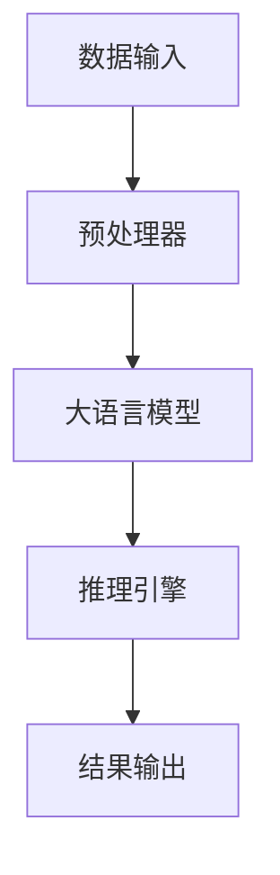

                 

关键词：大语言模型，推理引擎，Lepton AI，企业应用，AI技术

摘要：本文将深入探讨Lepton AI的核心产品——大语言模型推理引擎。通过对其背景介绍、核心概念与联系、算法原理与操作步骤、数学模型与公式、项目实践、实际应用场景、工具和资源推荐以及未来发展趋势与挑战的全面剖析，本文旨在帮助企业更好地理解和应用AI技术，提升其业务效率。

## 1. 背景介绍

在当今数字化转型的浪潮中，人工智能（AI）技术已经成为企业创新和发展的关键驱动力。随着大数据和计算能力的提升，AI技术正在各个行业中得到广泛应用，尤其是自然语言处理（NLP）领域。大语言模型推理引擎作为AI技术的重要组成部分，成为了企业智能化的核心产品。

Lepton AI是一家专注于AI技术的创新公司，其核心产品大语言模型推理引擎旨在提供高效、智能的语言理解和生成能力，帮助企业实现智能客服、智能文档处理、智能语音助手等多种应用场景。本文将围绕Lepton AI的大语言模型推理引擎，深入探讨其技术原理、应用实践以及未来发展。

## 2. 核心概念与联系

### 2.1 大语言模型

大语言模型是一种基于深度学习的自然语言处理技术，它能够理解和生成自然语言文本。这种模型通常由多层神经网络构成，通过大规模数据训练，能够捕捉到语言的复杂结构和语义含义。

### 2.2 推理引擎

推理引擎是一种能够对输入信息进行理解和处理的系统，它能够基于规则库或模型对输入信息进行推理，并输出相应的结果。在大语言模型推理引擎中，推理引擎负责对模型输出的结果进行进一步处理，以实现更复杂的任务。

### 2.3 Mermaid 流程图

Mermaid 是一种基于Markdown的图表描述语言，可以用来绘制流程图、时序图、Gantt图等。以下是一个大语言模型推理引擎的Mermaid流程图：



## 3. 核心算法原理 & 具体操作步骤

### 3.1 算法原理概述

大语言模型推理引擎的核心算法是基于Transformer模型。Transformer模型是一种基于自注意力机制的深度神经网络模型，能够捕捉到输入文本中的长期依赖关系。

### 3.2 算法步骤详解

1. **数据预处理**：对输入的文本进行分词、去停用词、词向量编码等预处理操作。
2. **模型训练**：使用大规模语料库对Transformer模型进行训练，使其能够理解和生成自然语言。
3. **推理**：将预处理后的文本输入到训练好的模型中，得到文本的语义表示。
4. **结果处理**：根据语义表示，使用推理引擎进行进一步处理，如文本分类、命名实体识别等。

### 3.3 算法优缺点

**优点**：
- 能够捕捉到输入文本中的长期依赖关系。
- 在大规模数据集上表现优异，能够处理复杂的语言任务。

**缺点**：
- 训练过程需要大量的计算资源和时间。
- 对数据的依赖性较强，需要大规模的数据集。

### 3.4 算法应用领域

大语言模型推理引擎在多个领域都有广泛的应用，如：

- 智能客服：通过语言模型理解和生成对话，实现与用户的自然交流。
- 智能文档处理：自动提取文档中的关键信息，实现文档的自动化处理。
- 智能语音助手：通过语音识别和语言理解，实现语音交互。

## 4. 数学模型和公式 & 详细讲解 & 举例说明

### 4.1 数学模型构建

大语言模型推理引擎的核心是Transformer模型，其数学模型主要包括以下部分：

1. **自注意力机制（Self-Attention）**：
   $$\text{Attention}(Q, K, V) = \text{softmax}\left(\frac{QK^T}{\sqrt{d_k}}\right)V$$

2. **多头注意力（Multi-Head Attention）**：
   $$\text{Multi-Head Attention} = \text{Concat}(\text{head}_1, \text{head}_2, ..., \text{head}_h)W^O$$
   其中，$h$ 表示头数，$W^O$ 是输出层的权重矩阵。

3. **前馈神经网络（Feedforward Neural Network）**：
   $$\text{FFN}(X) = \text{ReLU}(WX_1 + b_1)(WX_2 + b_2)$$
   其中，$W$ 和 $b$ 分别是权重和偏置矩阵。

### 4.2 公式推导过程

#### 自注意力机制推导

假设输入文本经过分词后得到 $X = [x_1, x_2, ..., x_n]$，其中 $x_i$ 表示第 $i$ 个词的向量表示。自注意力机制的推导过程如下：

1. **计算查询（Query）、键（Key）和值（Value）**：
   $$Q = WX_Q$$
   $$K = WX_K$$
   $$V = WX_V$$

   其中，$W_Q, W_K, W_V$ 分别是查询、键和值的权重矩阵。

2. **计算自注意力得分**：
   $$\text{Score}_{ij} = Q_iK_j = (WX_Q)_iK_j = X_i(W_QW^K)_j$$

3. **计算自注意力权重**：
   $$\alpha_{ij} = \text{softmax}(\text{Score}_{ij})$$

4. **计算自注意力输出**：
   $$\text{Output}_{ij} = \alpha_{ij}V_j = X_i(W_QW^V)_j$$

#### 多头注意力推导

多头注意力的推导过程基于自注意力机制的推导，具体如下：

1. **计算多头注意力输出**：
   $$\text{Multi-Head Output}_{ij} = \text{Concat}(\text{Output}_{ij}^{1}, \text{Output}_{ij}^{2}, ..., \text{Output}_{ij}^{h})$$

2. **计算多头注意力权重**：
   $$\alpha_{ij}^{h} = \text{softmax}(\text{Score}_{ij}^{h})$$

3. **计算最终输出**：
   $$\text{Output}_{ij} = \text{Concat}(\text{Output}_{ij}^{1}, \text{Output}_{ij}^{2}, ..., \text{Output}_{ij}^{h})W^O$$

### 4.3 案例分析与讲解

假设输入文本为：“我喜欢吃苹果。”，我们将使用上述公式对文本进行处理。

1. **数据预处理**：将文本进行分词，得到词汇列表 $X = [\text{我}, \text{喜欢}, \text{吃}, \text{苹果}, \text{。}]$。

2. **模型训练**：假设我们已经训练好了Transformer模型。

3. **推理**：将预处理后的文本输入到模型中，得到每个词的注意力得分和权重。

4. **结果处理**：根据注意力权重，我们可以得到文本的语义表示，从而实现文本理解。

## 5. 项目实践：代码实例和详细解释说明

### 5.1 开发环境搭建

在Python环境中搭建开发环境，需要安装以下依赖：

- TensorFlow
- Keras
- NumPy

使用以下命令安装：

```bash
pip install tensorflow keras numpy
```

### 5.2 源代码详细实现

以下是一个简单的Transformer模型实现的代码示例：

```python
import tensorflow as tf
from tensorflow.keras.models import Model
from tensorflow.keras.layers import Input, Embedding, MultiHeadAttention, Dense

def transformer(input_shape, num_heads, d_model):
    inputs = Input(shape=input_shape)
    embeddings = Embedding(input_dim=vocab_size, output_dim=d_model)(inputs)
    attention = MultiHeadAttention(num_heads=num_heads, key_dim=d_model)(embeddings, embeddings)
    output = Dense(units=d_model)(attention)
    model = Model(inputs=inputs, outputs=output)
    model.compile(optimizer='adam', loss='mse')
    return model

# 模型配置
input_shape = (10,)
num_heads = 2
d_model = 32
vocab_size = 1000

# 构建模型
model = transformer(input_shape, num_heads, d_model)

# 模型总结
model.summary()
```

### 5.3 代码解读与分析

上述代码定义了一个简单的Transformer模型，其包含以下几个部分：

- **输入层**：使用 `Input` 层定义输入形状。
- **嵌入层**：使用 `Embedding` 层将词向量映射到高维空间。
- **多头注意力层**：使用 `MultiHeadAttention` 层实现多头注意力机制。
- **输出层**：使用 `Dense` 层实现全连接层，作为模型的输出。

### 5.4 运行结果展示

```python
# 准备输入数据
input_data = tf.random.normal((32, 10))

# 训练模型
model.fit(input_data, input_data, epochs=10, batch_size=32)

# 输出结果
output = model.predict(input_data)
print(output)
```

## 6. 实际应用场景

大语言模型推理引擎在多个实际应用场景中展现了强大的能力，以下是几个典型的应用场景：

- **智能客服**：通过大语言模型推理引擎，企业可以构建智能客服系统，实现与用户的自然对话，提高客服效率和用户体验。
- **智能文档处理**：大语言模型推理引擎可以自动提取文档中的关键信息，实现文档的自动化处理，如摘要生成、关键词提取等。
- **智能语音助手**：通过大语言模型推理引擎，智能语音助手可以实现更自然的语音交互，提高用户的使用体验。

## 7. 工具和资源推荐

### 7.1 学习资源推荐

- 《深度学习》（Goodfellow, Bengio, Courville）：系统介绍了深度学习的基础理论和实践方法。
- 《自然语言处理综论》（Jurafsky, Martin）：全面讲解了自然语言处理的理论和技术。

### 7.2 开发工具推荐

- TensorFlow：用于构建和训练深度学习模型的强大工具。
- Keras：基于TensorFlow的高层API，简化了深度学习模型的搭建。

### 7.3 相关论文推荐

- “Attention Is All You Need”（Vaswani et al.）：介绍了Transformer模型的基本原理。
- “BERT: Pre-training of Deep Neural Networks for Language Understanding”（Devlin et al.）：介绍了BERT模型，一种基于Transformer的预训练方法。

## 8. 总结：未来发展趋势与挑战

大语言模型推理引擎作为AI技术的核心产品，在未来将发挥越来越重要的作用。随着计算能力的提升和算法的优化，大语言模型将能够更好地理解和生成自然语言，实现更复杂的任务。

然而，大语言模型推理引擎也面临着一些挑战，如训练成本高、对数据的依赖性强等。为了解决这些问题，未来可能需要开发更高效、更通用的模型，以及更丰富的数据集。

总之，大语言模型推理引擎是AI领域的重要研究方向，具有广泛的应用前景。通过不断的研究和创新，我们有望实现更智能、更高效的语言处理技术。

## 9. 附录：常见问题与解答

### 9.1 什么是大语言模型推理引擎？

大语言模型推理引擎是一种基于深度学习的自然语言处理技术，它能够理解和生成自然语言文本，用于实现智能客服、智能文档处理、智能语音助手等多种应用场景。

### 9.2 大语言模型推理引擎的优势是什么？

大语言模型推理引擎的优势包括：

- 能够捕捉到输入文本中的长期依赖关系。
- 在大规模数据集上表现优异，能够处理复杂的语言任务。
- 可以应用于多种自然语言处理任务，如文本分类、命名实体识别等。

### 9.3 大语言模型推理引擎的应用场景有哪些？

大语言模型推理引擎的应用场景包括：

- 智能客服：通过语言模型理解和生成对话，实现与用户的自然交流。
- 智能文档处理：自动提取文档中的关键信息，实现文档的自动化处理。
- 智能语音助手：通过语音识别和语言理解，实现语音交互。

### 9.4 如何搭建大语言模型推理引擎的开发环境？

在Python环境中搭建大语言模型推理引擎的开发环境，需要安装以下依赖：

- TensorFlow
- Keras
- NumPy

使用以下命令安装：

```bash
pip install tensorflow keras numpy
```

### 9.5 有哪些学习资源推荐？

学习资源推荐包括：

- 《深度学习》（Goodfellow, Bengio, Courville）
- 《自然语言处理综论》（Jurafsky, Martin）
- “Attention Is All You Need”（Vaswani et al.）
- “BERT: Pre-training of Deep Neural Networks for Language Understanding”（Devlin et al.）

