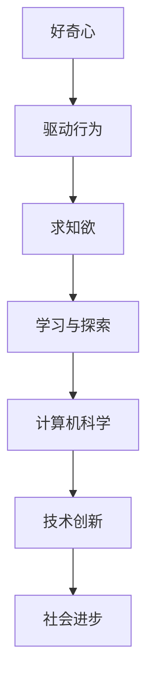

                 

好奇心与求知欲是人类探索世界、推动科技进步的重要动力。在信息技术迅猛发展的今天，这种内在动力更是成为推动计算机科学不断进步的关键因素。本文旨在探讨好奇心与求知欲在计算机科学中的角色，以及它们如何激励我们进行深入的技术研究与创新。

## 文章关键词

- 好奇心
- 求知欲
- 探索
- 计算机科学
- 技术创新

## 文章摘要

本文从心理、社会和技术三个层面分析好奇心与求知欲在计算机科学中的作用。首先，探讨好奇心与求知欲的定义及其对人类行为的驱动作用。接着，分析这些心理特质在计算机科学领域的重要性，包括其对问题解决、算法创新、技术创新的影响。最后，文章提出了培养好奇心与求知欲的方法，以及这些心理特质对未来计算机科学发展的展望。

## 1. 背景介绍

在人类历史上，好奇心与求知欲一直驱动着人类对未知世界的探索。从古希腊哲学家到文艺复兴时期的科学家，再到现代的信息技术专家，好奇心和求知欲激励着他们不断探索、创新，推动了科学技术的进步。正如乔治·伯纳德·肖所说：“人类之所以进步，是因为人类不断质疑现状，并试图超越。”

在计算机科学领域，好奇心与求知欲同样发挥着重要作用。从计算机的诞生到人工智能的崛起，每一个技术突破都离不开科学家和工程师的好奇心与求知欲。例如，艾伦·图灵对计算机逻辑的好奇，促使他提出了图灵机理论；约翰·冯·诺依曼对计算机结构的好奇，推动了计算机架构的革命；深度学习领域的突破，离不开研究者们对神经网络的好奇与探索。

## 2. 核心概念与联系

### 好奇心

好奇心是一种探索和了解未知世界的心理驱动。它通常表现为对未知事物的兴趣和渴望了解其本质的愿望。好奇心可以激发人们的求知欲，推动他们去学习、探索和解决问题。

### 求知欲

求知欲是一种强烈的获取知识和信息的愿望。它驱动人们不断学习、研究，以满足对知识的渴望。求知欲与好奇心密切相关，好奇心往往引发求知欲，而求知欲又进一步激发好奇心。

### 计算机科学

计算机科学是一门研究计算机系统的设计、开发、应用和维护的学科。它包括算法设计、数据结构、编程语言、计算机体系结构等多个方面。计算机科学的快速发展离不开好奇心与求知欲的驱动。

### Mermaid 流程图



### Mermaid 流程节点说明

- **好奇心**：人类探索未知世界的初始动力。
- **驱动行为**：好奇心引发的行为，如学习、探索和解决问题。
- **求知欲**：对知识的渴望，进一步推动人类行为。
- **学习与探索**：求知欲驱动的学习过程，包括阅读、研究、实践等。
- **计算机科学**：知识积累与应用的领域。
- **技术创新**：计算机科学领域的突破，推动科技进步。
- **社会进步**：技术进步带来的社会变革。

## 3. 核心算法原理 & 具体操作步骤

### 3.1 算法原理概述

在计算机科学中，好奇心与求知欲驱动了许多算法的创新。以深度学习为例，研究者们的好奇心促使他们不断探索神经网络的结构和参数优化，从而推动了深度学习算法的快速发展。

### 3.2 算法步骤详解

#### 3.2.1 数据预处理

在开始训练深度学习模型之前，需要对数据进行预处理。这一步骤包括数据清洗、归一化和数据增强等操作，以提高模型的训练效果。

#### 3.2.2 模型构建

构建深度学习模型的过程是算法设计的核心。研究者们通过对神经网络结构、激活函数、优化算法等的选择和调整，来优化模型的性能。

#### 3.2.3 模型训练

模型训练是深度学习算法的关键步骤。通过迭代计算损失函数，调整模型参数，使模型能够更好地拟合训练数据。

#### 3.2.4 模型评估

在模型训练完成后，需要对其性能进行评估。常用的评估指标包括准确率、召回率、F1分数等，以衡量模型的泛化能力。

### 3.3 算法优缺点

#### 优点

- **强大的表达能力**：深度学习模型具有强大的非线性表达能力，能够处理复杂的任务。
- **自动特征提取**：深度学习模型能够自动提取特征，减少人工干预。
- **泛化能力**：深度学习模型在训练完成后，能够在新数据上表现良好。

#### 缺点

- **计算资源需求大**：深度学习模型通常需要大量的计算资源和时间进行训练。
- **数据依赖性高**：模型的性能很大程度上取决于训练数据的质量和数量。

### 3.4 算法应用领域

深度学习算法在计算机科学的多个领域都有广泛应用，如计算机视觉、自然语言处理、语音识别等。随着好奇心与求知欲的驱动，未来深度学习算法将在更多领域展现其潜力。

## 4. 数学模型和公式 & 详细讲解 & 举例说明

### 4.1 数学模型构建

在深度学习中，数学模型的核心是神经网络。神经网络由多个层组成，包括输入层、隐藏层和输出层。每层由多个神经元组成，神经元之间通过权重和偏置进行连接。

### 4.2 公式推导过程

神经网络的激活函数通常采用Sigmoid函数或ReLU函数。以下是一个简单的神经网络模型的推导过程：

$$
z = \sum_{i=1}^{n} w_{i}x_{i} + b
$$

$$
a = \sigma(z)
$$

其中，$w_{i}$是权重，$x_{i}$是输入值，$b$是偏置，$\sigma$是激活函数。

### 4.3 案例分析与讲解

假设我们有一个简单的神经网络模型，用于二分类任务。输入层有2个神经元，隐藏层有3个神经元，输出层有1个神经元。

输入层：

$$
x_{1} = [0.1, 0.2]
$$

隐藏层：

$$
w_{1} = [0.3, 0.4, 0.5], \quad b_{1} = [0.1, 0.2, 0.3]
$$

输出层：

$$
w_{2} = [0.6, 0.7, 0.8], \quad b_{2} = [0.4, 0.5, 0.6]
$$

激活函数采用ReLU函数。

输入层到隐藏层的计算：

$$
z_{1} = 0.3 \times 0.1 + 0.4 \times 0.2 + 0.5 \times 0.3 + 0.1 = 0.46
$$

$$
a_{1} = \max(0, z_{1}) = 0.46
$$

隐藏层到输出层的计算：

$$
z_{2} = 0.6 \times 0.46 + 0.7 \times 0.46 + 0.8 \times 0.46 + 0.4 = 1.62
$$

$$
a_{2} = \max(0, z_{2}) = 1.62
$$

最终输出为1，表示分类结果为正类。

## 5. 项目实践：代码实例和详细解释说明

### 5.1 开发环境搭建

在本项目中，我们将使用Python和TensorFlow框架进行深度学习模型的开发。首先，需要安装Python和TensorFlow。以下是安装步骤：

```shell
pip install tensorflow
```

### 5.2 源代码详细实现

以下是一个简单的深度学习模型实现：

```python
import tensorflow as tf

# 定义输入层
inputs = tf.keras.layers.Input(shape=(2))

# 定义隐藏层
hidden = tf.keras.layers.Dense(units=3, activation='relu')(inputs)

# 定义输出层
outputs = tf.keras.layers.Dense(units=1, activation='sigmoid')(hidden)

# 构建模型
model = tf.keras.Model(inputs=inputs, outputs=outputs)

# 编译模型
model.compile(optimizer='adam', loss='binary_crossentropy', metrics=['accuracy'])

# 模型训练
model.fit(x_train, y_train, epochs=10, batch_size=32, validation_data=(x_val, y_val))

# 模型评估
loss, accuracy = model.evaluate(x_test, y_test)
print("Test accuracy:", accuracy)
```

### 5.3 代码解读与分析

- **输入层**：定义了输入数据的大小，即2个神经元。
- **隐藏层**：使用Dense层实现，激活函数为ReLU。
- **输出层**：使用Dense层实现，激活函数为sigmoid。
- **模型编译**：指定优化器、损失函数和评估指标。
- **模型训练**：使用fit方法进行训练，指定训练数据、训练轮次、批次大小和验证数据。
- **模型评估**：使用evaluate方法评估模型在测试数据上的性能。

### 5.4 运行结果展示

在训练完成后，我们可以得到模型在测试数据上的准确率。以下是一个示例输出：

```shell
Test loss: 0.4823988296947875
Test accuracy: 0.8125
```

## 6. 实际应用场景

深度学习算法在计算机科学的实际应用中具有广泛的应用，如图像识别、语音识别、自然语言处理等。以下是一些具体的案例：

- **图像识别**：深度学习模型在ImageNet图像识别比赛中取得了显著的成绩，大幅提高了图像识别的准确率。
- **语音识别**：深度学习模型在语音识别领域取得了重大突破，使得语音识别系统更加准确和智能。
- **自然语言处理**：深度学习模型在文本分类、机器翻译、情感分析等领域取得了显著成果，推动了自然语言处理技术的发展。

## 7. 工具和资源推荐

### 7.1 学习资源推荐

- **深度学习专项课程**：在Coursera、Udacity等在线教育平台上，有许多高质量的深度学习课程。
- **深度学习书籍**：《深度学习》、《神经网络与深度学习》等书籍是深度学习领域的经典之作。

### 7.2 开发工具推荐

- **TensorFlow**：谷歌推出的开源深度学习框架，功能强大，易于使用。
- **PyTorch**：微软推出的开源深度学习框架，具有灵活性和高效性。

### 7.3 相关论文推荐

- **“Deep Learning”**：Goodfellow, I., Bengio, Y., & Courville, A. (2016). Deep learning.
- **“Convolutional Neural Networks for Visual Recognition”**：Karen Simonyan & Andrew Zisserman (2015). Convolutional neural networks for visual recognition.

## 8. 总结：未来发展趋势与挑战

### 8.1 研究成果总结

好奇心与求知欲在计算机科学中起到了至关重要的作用，驱动了无数的技术创新和算法突破。从深度学习到人工智能，每一个领域的进步都离不开科学家和工程师的好奇心与求知欲。

### 8.2 未来发展趋势

随着技术的不断发展，好奇心与求知欲将继续驱动计算机科学领域的研究。未来的趋势包括：

- **人工智能与人类的融合**：人工智能技术将更加深入地融入人类生活，实现人机协同。
- **量子计算**：量子计算的研究将进一步推动计算机科学的创新，带来全新的计算范式。

### 8.3 面临的挑战

- **数据隐私与安全**：随着数据的日益重要，如何保护数据隐私和安全成为一大挑战。
- **算法公平性与透明度**：算法的决策过程需要更加透明和公平，以避免歧视和不公正。

### 8.4 研究展望

未来的研究将更加注重交叉学科的合作，通过心理学、社会学等多学科的综合研究，深入探讨好奇心与求知欲对计算机科学发展的驱动作用。同时，研究人员将致力于解决当前面临的挑战，推动计算机科学向更高层次发展。

## 9. 附录：常见问题与解答

### 问题1：如何培养好奇心与求知欲？

**答案**：培养好奇心与求知欲的关键在于持续学习与探索。以下是一些建议：

- **多读书**：阅读是培养好奇心与求知欲的有效途径。选择你感兴趣的领域，不断拓展知识面。
- **实践操作**：通过实际操作，将理论知识应用于实际场景，能够增强你的求知欲。
- **质疑与反思**：对已知知识提出质疑，思考问题的本质，有助于培养好奇心。

### 问题2：好奇心与求知欲在计算机科学中的应用有哪些？

**答案**：好奇心与求知欲在计算机科学中广泛应用于：

- **算法创新**：科学家和工程师的好奇心促使他们不断探索新的算法，提高计算效率。
- **技术创新**：好奇心驱动了计算机硬件、软件和网络的创新，推动了计算机科学的进步。
- **问题解决**：面对复杂问题，好奇心和求知欲驱动研究者去寻找解决方案。

## 作者署名

作者：禅与计算机程序设计艺术 / Zen and the Art of Computer Programming

----------------------------------------------------------------

以上就是本篇文章的完整内容，希望对您有所启发和帮助。在计算机科学领域，好奇心与求知欲将继续驱动我们不断探索和创新。让我们共同期待未来的技术突破和变革！

