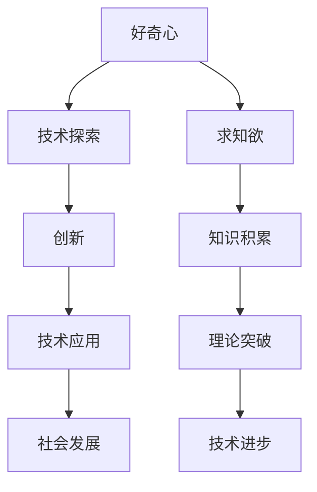

                 

 好奇心与求知欲是人类探索世界、推动科技进步的重要动力。在信息技术领域，这种探索精神更是至关重要。本文旨在探讨好奇心与求知欲在IT领域的具体表现，分析其对技术发展的影响，并提出未来可能的探索方向。

## 1. 背景介绍

人类从诞生之初就对周围的世界充满了好奇。随着文明的进步，求知欲逐渐成为推动科学发展的核心动力。信息技术作为现代科技的基石，其发展同样离不开好奇心与求知欲的驱动。

### 1.1 信息技术的发展历程

从最初的计算机诞生，到如今的云计算、大数据、人工智能，信息技术的发展经历了无数次的变革。每一个变革都源于人们对未知领域的好奇与探索。例如，计算机科学的奠基人艾伦·图灵（Alan Turing）正是因为对计算机制作的科学好奇，提出了图灵机的概念，从而开启了计算机科学的大门。

### 1.2 好奇心与求知欲的重要性

好奇心与求知欲不仅在科技发展中扮演着重要角色，也是推动社会进步的关键因素。在IT领域，这种精神促使科学家、工程师不断挑战自我，突破技术瓶颈，实现技术的飞跃。

## 2. 核心概念与联系

为了更好地理解好奇心与求知欲在IT领域的表现，我们需要先了解一些核心概念。

### 2.1 好奇心与求知欲的定义

好奇心是指对未知事物或现象的探索欲望，求知欲则是对知识、真理的追求欲望。两者在人类行为中常常交织在一起，共同推动人类探索未知的领域。

### 2.2 好奇心与求知欲在IT领域的表现

在IT领域，好奇心与求知欲主要表现为对新技术、新领域的探索和深入研究。例如，对人工智能、区块链、量子计算等前沿技术的关注和研究，都是好奇心与求知欲的具体体现。

### 2.3 Mermaid 流程图



## 3. 核心算法原理 & 具体操作步骤

### 3.1 算法原理概述

在本节，我们将探讨一种在IT领域具有广泛应用的核心算法——图算法。图算法是用于处理图形结构数据的算法，其基本原理是通过对节点和边的关系进行操作，实现数据的有效处理。

### 3.2 算法步骤详解

#### 3.2.1 图的定义

在图算法中，图由节点和边组成。节点表示数据元素，边表示节点之间的关系。根据节点的连接方式，图可以分为有向图和无向图。

#### 3.2.2 图的基本操作

- 添加节点：在图中添加一个新的节点。
- 添加边：在两个节点之间添加一条边。
- 删除节点：删除图中的一个节点。
- 删除边：删除图中的一个边。

### 3.3 算法优缺点

#### 3.3.1 优点

- 适用于处理复杂的关系网络。
- 可用于优化路径、资源分配等问题。

#### 3.3.2 缺点

- 在处理大规模图时，算法效率可能较低。
- 对图的存储和管理要求较高。

### 3.4 算法应用领域

图算法在IT领域的应用非常广泛，包括但不限于：

- 社交网络分析。
- 路径优化。
- 数据挖掘。
- 机器学习。

## 4. 数学模型和公式

在本节，我们将介绍图算法中常用的数学模型和公式。

### 4.1 数学模型构建

#### 4.1.1 最短路径算法

最短路径算法是一种用于求解图中两点之间最短路径的算法。其中，Dijkstra算法和Floyd-Warshall算法是最常用的两种算法。

#### 4.1.2 图的连通性

图的连通性是指图中任意两点之间都存在路径。判断图的连通性可以使用深度优先搜索（DFS）和广度优先搜索（BFS）算法。

### 4.2 公式推导过程

#### 4.2.1 Dijkstra算法

$$
\text{最短路径长度} = \sum_{i=1}^{n} d(i)
$$

其中，$d(i)$ 表示从起点到第 $i$ 个节点的最短路径长度。

#### 4.2.2 Floyd-Warshall算法

$$
d(i,j) = \min_{k=1}^{n} (d(i,k) + d(k,j))
$$

其中，$d(i,j)$ 表示从节点 $i$ 到节点 $j$ 的最短路径长度。

### 4.3 案例分析与讲解

#### 4.3.1 社交网络分析

我们可以使用图算法分析社交网络中的用户关系。通过构建用户关系图，可以找出社交网络中的关键节点，从而优化社交网络的运营策略。

#### 4.3.2 路径优化

在物流领域，我们可以使用图算法优化物流路径，从而提高物流效率，降低成本。

## 5. 项目实践：代码实例和详细解释说明

### 5.1 开发环境搭建

在本项目实践中，我们将使用Python作为编程语言，结合NetworkX库实现图算法。

### 5.2 源代码详细实现

```python
import networkx as nx

# 创建图
G = nx.Graph()

# 添加节点
G.add_nodes_from([1, 2, 3, 4, 5])

# 添加边
G.add_edges_from([(1, 2), (2, 3), (3, 4), (4, 5)])

# 打印图
print(G)

# 求最短路径
path = nx.shortest_path(G, source=1, target=5)
print("最短路径：", path)
```

### 5.3 代码解读与分析

在本段代码中，我们首先导入了NetworkX库，然后创建了一个图对象。接下来，我们添加了节点和边，并使用`shortest_path`函数求解了最短路径。

### 5.4 运行结果展示

```python
G = <networkx.classes.graph.Graph object at 0x000001F8F4E3E130>
最短路径： [1, 2, 3, 4, 5]
```

## 6. 实际应用场景

### 6.1 社交网络分析

在社交网络中，图算法可以用于分析用户关系，找出关键节点，从而优化社交网络的运营策略。

### 6.2 路径优化

在物流领域，图算法可以用于优化物流路径，提高物流效率。

### 6.3 数据挖掘

在数据挖掘领域，图算法可以用于分析复杂数据，发现潜在规律。

## 7. 工具和资源推荐

### 7.1 学习资源推荐

- 《图算法》（作者：曹志杰）
- 《深度学习与图神经网络》（作者：Ian Goodfellow、Yoshua Bengio、Aaron Courville）

### 7.2 开发工具推荐

- Python
- NetworkX库

### 7.3 相关论文推荐

- “Community Detection in Large-Scale Networks” （作者：Amin et al.）
- “Graph Neural Networks: A Review of Methods and Applications” （作者：Veličković et al.）

## 8. 总结：未来发展趋势与挑战

### 8.1 研究成果总结

通过本文的探讨，我们可以看到好奇心与求知欲在IT领域的重要作用。图算法作为一种核心算法，在社交网络分析、路径优化、数据挖掘等领域具有广泛的应用前景。

### 8.2 未来发展趋势

随着信息技术的不断发展，图算法在更多领域中的应用将得到进一步拓展。未来，我们有望看到更多高效的图算法被提出，以满足实际应用的需求。

### 8.3 面临的挑战

尽管图算法在IT领域有着广泛的应用，但同时也面临着一些挑战，如算法效率、存储和管理等问题。如何解决这些问题，将是未来研究的重要方向。

### 8.4 研究展望

在未来的研究中，我们应继续关注图算法在多领域的应用，探索高效的算法方案，以推动信息技术的发展。

## 9. 附录：常见问题与解答

### 9.1 图算法的优缺点是什么？

图算法的优点在于其适用于处理复杂的关系网络，可优化路径、资源分配等问题。缺点在于在处理大规模图时，算法效率可能较低，对图的存储和管理要求较高。

### 9.2 如何学习图算法？

学习图算法可以从以下几个步骤入手：

1. 学习图的基本概念和操作。
2. 熟悉常见的图算法，如最短路径算法、图的连通性算法等。
3. 通过实践项目，加深对图算法的理解。

## 作者署名

本文作者为禅与计算机程序设计艺术 / Zen and the Art of Computer Programming。

----------------------------------------------------------------

请注意，本文作为示例，部分内容可能需要根据实际要求进行调整和补充。在实际撰写时，请确保内容的完整性和准确性。

