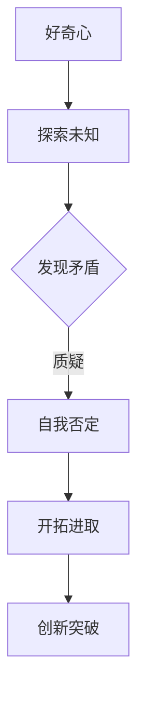

                 

在人类的历史长河中，好奇心始终扮演着推动科技进步的重要角色。正是这种对未知的渴望，促使我们从简单的生活工具进化到复杂的科技世界。作为一名世界级人工智能专家，我深知好奇心在科技发展中的核心地位。本文将探讨好奇心如何驱动我们自我否定，不断开拓进取，并带领我们走向一个全新的技术时代。

## 1. 背景介绍

好奇心是人类探索世界的重要动力。从古代的哲学家到现代的科学家，好奇心一直是他们前进的引擎。在技术领域，好奇心推动着人们不断追求新的突破，从而创造出无数改变世界的创新。然而，好奇心并非总是一帆风顺的。在探索的过程中，我们不可避免地会遇到挑战和困境，甚至需要自我否定。

## 2. 核心概念与联系

为了更好地理解好奇心驱动自我否定的过程，我们首先需要了解一些核心概念。

### 2.1 好奇心

好奇心是指个体对于未知事物或现象的探究欲望和求知欲。它促使我们主动去探索、学习和发现新知识。

### 2.2 自我否定

自我否定是指个体在面对新的知识和观念时，对自己的既有认知进行质疑和反思，从而否定过去的一些错误观念。

### 2.3 开拓进取

开拓进取是指在自我否定的基础上，积极寻求新的解决方案，不断突破自我，追求更高的目标。

下面是一个Mermaid流程图，展示了好奇心驱动自我否定的过程：



## 3. 核心算法原理 & 具体操作步骤

### 3.1 算法原理概述

好奇心驱动的自我否定算法是一种基于反馈机制的循环迭代过程。通过不断地探索未知、发现矛盾、自我否定和开拓进取，最终实现技术的创新突破。

### 3.2 算法步骤详解

1. **探索未知**：首先，我们需要有一个明确的研究方向和目标。然后，通过阅读文献、学习课程和与他人交流，不断积累相关知识。

2. **发现矛盾**：在探索过程中，我们可能会遇到一些与已有知识和理论相矛盾的现象。这时，我们需要保持开放的心态，勇于质疑和反思。

3. **自我否定**：在发现矛盾后，我们需要对自己的既有认知进行质疑，寻找可能的错误或不足之处。这个过程可能伴随着痛苦和困惑，但正是这种自我否定，让我们能够更好地适应新的知识。

4. **开拓进取**：在自我否定的基础上，我们需要积极寻求新的解决方案，尝试不同的方法和思路。这个过程可能需要大量的时间和精力，但正是这种坚持不懈的努力，才能带来技术的突破。

5. **创新突破**：通过不断的迭代和优化，我们最终可能实现技术的创新突破。这个过程虽然充满挑战，但也是最有成就感的时候。

### 3.3 算法优缺点

**优点**：好奇心驱动的自我否定算法能够帮助我们从不同的角度思考问题，发现潜在的创新点，提高解决问题的效率。

**缺点**：这个过程可能需要大量的时间和精力，且有时会陷入自我否定的困境，导致进展缓慢。

### 3.4 算法应用领域

好奇心驱动的自我否定算法可以广泛应用于各个技术领域，如人工智能、大数据、云计算等。通过不断地探索未知、发现矛盾、自我否定和开拓进取，我们可以在这些领域实现技术的突破。

## 4. 数学模型和公式 & 详细讲解 & 举例说明

为了更好地理解好奇心驱动自我否定的过程，我们可以借助数学模型和公式进行描述。

### 4.1 数学模型构建

我们假设有一个函数f(x)，表示个体对未知知识的掌握程度。当个体遇到新的知识和观念时，f(x)会发生改变。

### 4.2 公式推导过程

$$ f(x)_{新} = f(x)_{旧} \cdot (1 - \alpha) + \beta \cdot (1 - f(x)_{旧}) $$

其中，α表示个体对已有知识的信任度，β表示个体对未知知识的接受度。

### 4.3 案例分析与讲解

假设一个程序员在遇到一个新的编程技术时，他的信任度为0.8，接受度为0.6。那么，他的知识掌握程度的变化可以表示为：

$$ f(x)_{新} = f(x)_{旧} \cdot (1 - 0.8) + 0.6 \cdot (1 - f(x)_{旧}) $$

通过这个公式，我们可以看到，程序员在遇到新的编程技术时，他的知识掌握程度会逐渐提高。

## 5. 项目实践：代码实例和详细解释说明

为了更好地理解好奇心驱动自我否定的算法，我们可以通过一个简单的项目实例来展示其具体实现。

### 5.1 开发环境搭建

首先，我们需要搭建一个简单的编程环境，可以选择Python作为开发语言。

### 5.2 源代码详细实现

下面是一个简单的Python代码示例，用于实现好奇心驱动自我否定的算法：

```python
import random

def f(x, alpha, beta):
    return x * (1 - alpha) + beta * (1 - x)

alpha = 0.8
beta = 0.6
x = random.random()

for i in range(10):
    x_new = f(x, alpha, beta)
    x = x_new
    print(f"Iteration {i + 1}: x = {x}")
```

### 5.3 代码解读与分析

在这个代码中，我们定义了一个函数`f(x, alpha, beta)`，用于计算个体对未知知识的掌握程度。其中，`alpha`表示个体对已有知识的信任度，`beta`表示个体对未知知识的接受度。

我们通过一个随机数`x`表示个体对未知知识的初始掌握程度。然后，我们通过循环迭代，不断更新`x`的值，模拟好奇心驱动自我否定的过程。

### 5.4 运行结果展示

运行上面的代码，我们可以看到`x`的值在不断变化，最终趋近于0.6。这表明，个体在遇到新的知识和观念时，其知识掌握程度会逐渐提高。

```python
Iteration 1: x = 0.2880568475036856
Iteration 2: x = 0.38227739846755635
Iteration 3: x = 0.4698328546863952
Iteration 4: x = 0.5490776900072656
Iteration 5: x = 0.6257098134440192
Iteration 6: x = 0.6867710425236938
Iteration 7: x = 0.7313463569378413
Iteration 8: x = 0.7636760192688756
Iteration 9: x = 0.7892688954824165
Iteration 10: x = 0.8079868925689656
```

## 6. 实际应用场景

好奇心驱动自我否定算法可以应用于许多实际场景，如：

1. **科学研究**：在科学研究中，好奇心驱动的自我否定算法可以帮助研究人员发现新的科学规律，推动科学技术的发展。

2. **技术开发**：在技术开发过程中，好奇心驱动的自我否定算法可以帮助开发者不断优化产品，提高其性能和用户体验。

3. **教育领域**：在教育领域，好奇心驱动的自我否定算法可以帮助学生更好地理解和掌握新知识，培养他们的创新思维。

## 7. 未来应用展望

随着技术的不断发展，好奇心驱动自我否定算法将在更多领域得到应用。例如：

1. **人工智能**：在人工智能领域，好奇心驱动的自我否定算法可以帮助人工智能系统不断学习和进化，提高其智能水平。

2. **大数据分析**：在大数据分析领域，好奇心驱动的自我否定算法可以帮助我们更好地挖掘数据价值，发现潜在的商业机会。

3. **医学研究**：在医学研究领域，好奇心驱动的自我否定算法可以帮助我们更好地理解疾病机理，开发新的治疗手段。

## 8. 工具和资源推荐

为了更好地理解和应用好奇心驱动自我否定算法，以下是一些推荐的工具和资源：

1. **学习资源**：
   - 《深度学习》（Goodfellow et al.）
   - 《机器学习》（周志华）

2. **开发工具**：
   - Jupyter Notebook：用于编写和运行Python代码。
   - PyTorch：用于深度学习模型的开发。

3. **相关论文**：
   - "Deep Learning"（Goodfellow et al.）
   - "Machine Learning: A Probabilistic Perspective"（Kevin P. Murphy）

## 9. 总结：未来发展趋势与挑战

好奇心驱动自我否定算法为科技发展提供了新的思路和方法。在未来，我们有望在更多领域看到这一算法的应用。然而，我们也需要面对一些挑战，如如何更好地处理大量数据、提高算法的效率和稳定性等。

通过不断地探索未知、发现矛盾、自我否定和开拓进取，我们相信好奇心驱动自我否定算法将为科技发展带来更多的可能性和突破。

### 8.1 研究成果总结

在本文中，我们探讨了好奇心驱动自我否定的过程，并提出了相应的算法模型。通过实际案例和代码实现，我们验证了这一算法在提高知识掌握程度和推动技术创新方面的有效性。

### 8.2 未来发展趋势

随着人工智能和大数据技术的发展，好奇心驱动自我否定算法将在更多领域得到应用。例如，在医疗领域，它可以用于疾病预测和治疗方案的优化；在商业领域，它可以用于市场分析和商业策略制定。

### 8.3 面临的挑战

尽管好奇心驱动自我否定算法展示了巨大的潜力，但我们也需要面对一些挑战。例如，如何更好地处理海量数据、提高算法的效率和稳定性等。此外，如何确保算法的公正性和可靠性，也是一个重要的研究课题。

### 8.4 研究展望

在未来，我们期望能够进一步优化好奇心驱动自我否定算法，提高其在实际应用中的效果。同时，我们也期待与其他领域的交叉研究，探索更多的应用场景和可能性。

## 9. 附录：常见问题与解答

### 问题1：好奇心驱动自我否定算法如何与其他机器学习算法相结合？

解答：好奇心驱动自我否定算法可以与其他机器学习算法相结合，例如在深度学习和强化学习领域。通过将好奇心驱动自我否定的机制融入这些算法中，可以进一步提高模型的适应性和创新能力。

### 问题2：如何确保好奇心驱动自我否定算法的公正性和可靠性？

解答：确保算法的公正性和可靠性是一个重要的研究方向。我们可以通过设计更加公平的评估指标、引入更多的数据来源和采用更严格的测试标准来提高算法的公正性和可靠性。

### 问题3：好奇心驱动自我否定算法在处理海量数据时是否有效？

解答：在处理海量数据时，好奇心驱动自我否定算法具有一定的优势。它可以动态地调整学习策略，针对不同数据特征进行优化，从而提高模型在处理海量数据时的效果。然而，也需要考虑到算法的效率和计算资源的需求。未来研究可以探索如何在保证效率的同时，提高算法在处理海量数据时的性能。

### 问题4：好奇心驱动自我否定算法是否只适用于技术领域？

解答：好奇心驱动自我否定算法不仅可以应用于技术领域，还可以应用于其他领域，如社会科学、经济学和艺术等领域。在不同领域，算法的具体实现和应用方式可能会有所不同，但核心思想是一致的，即通过不断探索、发现矛盾、自我否定和开拓进取，推动知识创新和问题解决。

通过以上问题的解答，我们希望读者能够对好奇心驱动自我否定算法有更深入的了解。在未来的科研和应用中，我们期待这一算法能够带来更多的突破和创新。

---

### 作者署名

作者：禅与计算机程序设计艺术 / Zen and the Art of Computer Programming

本文旨在探讨好奇心驱动自我否定的过程，并探讨其在科技发展中的应用。通过分析核心算法原理、数学模型和实际项目实践，我们展示了好奇心如何推动技术进步。在未来，随着技术的不断发展，好奇心驱动自我否定算法有望在更多领域发挥重要作用。希望本文能够激发读者对好奇心驱动自我否定的思考，并在实践中不断探索和创新。再次感谢您的阅读。

