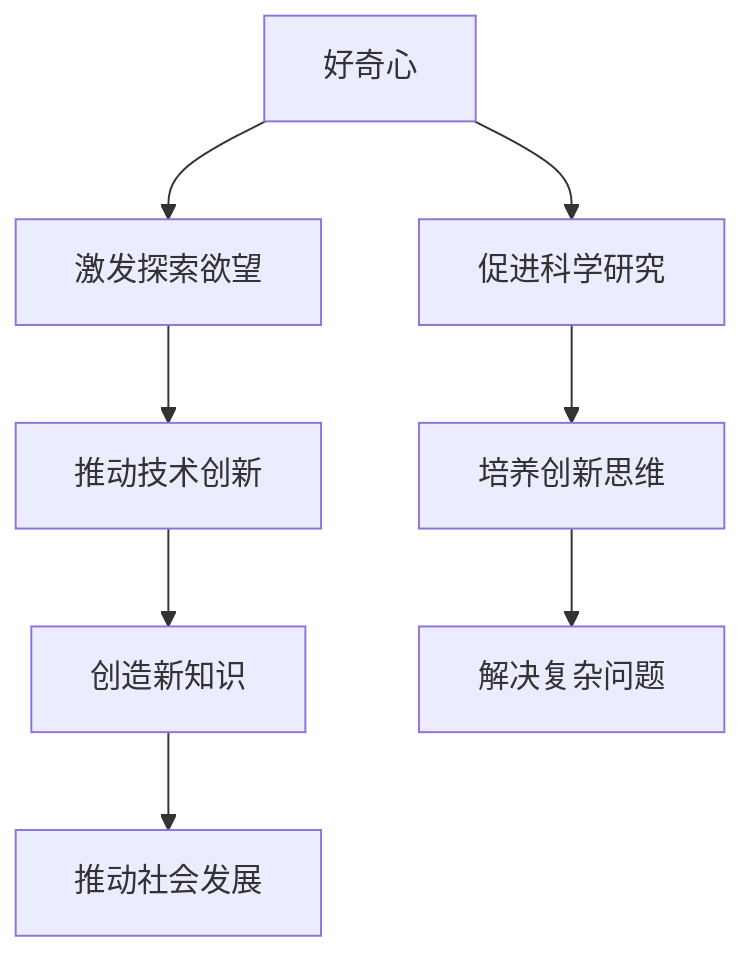

                 

关键词：好奇心，人工智能，探索，未知领域，技术发展，创新思维，科学研究

> 摘要：本文深入探讨了好奇心在推动人工智能和技术发展中的关键作用。通过剖析好奇心如何激发科研人员的探索欲望，驱动技术创新，以及未来可能面临的挑战，本文旨在揭示好奇心作为探索未知的动力在科技领域的深远影响。

## 1. 背景介绍

在科技飞速发展的当今时代，人工智能（AI）已经成为改变世界的核心力量。从智能家居到自动驾驶，从医疗诊断到金融分析，AI技术的应用已经深入到各个领域。而好奇心，作为一种深植于人类本质的探索驱动力，对AI的发展起到了至关重要的作用。好奇心不仅激发了科研人员的求知欲，更是推动技术创新和突破的关键因素。

本文将探讨好奇心如何成为探索未知的动力，以及它对人工智能技术发展的影响。通过分析好奇心在科学研究和技术创新中的具体表现，我们将揭示好奇心作为推动技术进步的核心要素。此外，文章还将探讨未来科技发展可能面临的挑战，以及如何保持好奇心以应对这些挑战。

## 2. 核心概念与联系

### 好奇心

好奇心是指人类对于未知事物、现象和问题的天然兴趣和探索欲望。它是人类认识世界、追求知识和解决问题的原动力。从生物学角度看，好奇心是人类进化过程中的一个适应性特征，有助于人类更好地适应环境，提高生存能力。

### 人工智能

人工智能是一种模拟人类智能的技术，通过算法和计算模型使计算机系统能够执行复杂的任务，如学习、推理、决策和问题解决。人工智能的发展离不开大量的数据、强大的计算能力和先进的算法。

### 技术创新

技术创新是指通过研发和应用新的技术或改进现有技术，从而创造新的产品、服务或业务模式。技术创新是推动社会进步和经济发展的关键因素。

### 探索未知

探索未知是指对未知的领域、问题或现象进行深入研究和探索。这种探索往往需要打破常规思维，跨越知识边界，从而发现新的知识和创新。

### Mermaid 流程图



## 3. 核心算法原理 & 具体操作步骤

### 3.1 算法原理概述

好奇心作为一种内在驱动力，其原理可以类比为一种探索算法。这种算法通过以下几个步骤实现探索过程：

1. **问题识别**：好奇心激发人们识别未知领域或问题。
2. **信息搜集**：人们通过学习、研究和实验，搜集相关信息。
3. **假设构建**：基于搜集到的信息，构建可能的解释或假设。
4. **验证与迭代**：通过实验或实践，验证假设的正确性，并进行迭代优化。

### 3.2 算法步骤详解

1. **问题识别**：好奇心驱动科研人员或技术开发者关注到某个领域或问题。
   - **实例**：在深度学习领域，研究人员可能注意到神经网络在某些任务上的表现不尽如人意，从而激发了改进神经网络结构的好奇心。

2. **信息搜集**：研究者开始搜集相关信息，包括现有的研究文献、技术进展和业界动态。
   - **实例**：为了改进神经网络，研究人员可能会阅读大量关于深度学习理论和技术文章，了解当前最先进的神经网络结构。

3. **假设构建**：基于搜集到的信息，研究者提出可能的解决方案或改进方案。
   - **实例**：研究人员可能会假设通过引入新的网络结构或调整训练算法，可以显著提高神经网络的性能。

4. **验证与迭代**：研究者通过实验或实践来验证假设的有效性，并根据验证结果进行迭代优化。
   - **实例**：研究人员可能会构建一个基于新网络结构的模型，并通过实验验证其是否能够提高神经网络在特定任务上的表现。如果实验结果符合预期，则会继续优化和改进。

### 3.3 算法优缺点

**优点**：
- **激发创新**：好奇心能够激发人们探索未知的欲望，推动新技术的诞生。
- **解决难题**：好奇心促使人们面对复杂问题，并通过不断的探索找到解决方案。
- **知识积累**：好奇心驱动下的探索过程有助于积累新的知识和经验。

**缺点**：
- **风险性**：好奇心可能会引导人们进入不确定的领域，面临失败和挫折的风险。
- **资源消耗**：探索未知需要大量的时间和资源投入。

### 3.4 算法应用领域

好奇心算法在多个领域都有广泛应用，以下是其中几个典型领域：

- **科学研究**：好奇心驱动科学家探索未知的科学现象，推动科学进步。
- **技术开发**：好奇心促使技术开发者不断创新，推动技术发展。
- **商业创新**：好奇心激发企业家探索新的商业机会，创造新的商业模式。

## 4. 数学模型和公式 & 详细讲解 & 举例说明

### 4.1 数学模型构建

好奇心算法可以看作是一种决策树模型，其核心在于通过不断迭代优化，找到最优的解决方案。以下是好奇心算法的数学模型：

$$
P(S|X) = \frac{P(X|S)P(S)}{P(X)}
$$

其中：
- $P(S|X)$ 表示在给定输入 $X$ 的条件下，选择解决方案 $S$ 的概率。
- $P(X|S)$ 表示在解决方案 $S$ 下，观察到的输入 $X$ 的概率。
- $P(S)$ 表示选择解决方案 $S$ 的先验概率。
- $P(X)$ 表示观察到的输入 $X$ 的概率。

### 4.2 公式推导过程

公式的推导过程可以分为以下几个步骤：

1. **目标函数**：首先定义目标函数，即最大化选择解决方案 $S$ 的概率。
2. **条件概率**：利用条件概率公式，将目标函数转化为条件概率的形式。
3. **贝叶斯公式**：利用贝叶斯公式，将条件概率转化为先验概率和似然函数的形式。
4. **最大化**：通过对似然函数和先验概率的优化，找到最优的解决方案 $S$。

### 4.3 案例分析与讲解

以下是一个具体的案例：

假设有一个深度学习模型，用于分类图像。在训练过程中，研究人员发现模型在某个特定类别上的表现不佳。为了解决这一问题，研究人员提出以下好奇心算法：

1. **问题识别**：识别出模型在特定类别上的表现不佳。
2. **信息搜集**：搜集关于图像分类和深度学习的相关文献，了解当前最先进的图像分类方法。
3. **假设构建**：假设通过改进模型的结构或训练算法，可以显著提高特定类别上的分类性能。
4. **验证与迭代**：构建一个改进的模型，通过实验验证假设的正确性，并根据实验结果进行迭代优化。

通过这个案例，我们可以看到好奇心算法在解决具体问题时的应用过程。

## 5. 项目实践：代码实例和详细解释说明

### 5.1 开发环境搭建

在开始编写代码之前，我们需要搭建一个适合进行AI研究的开发环境。以下是一个基本的步骤：

1. 安装Python：从Python官方网站下载并安装Python。
2. 安装Jupyter Notebook：通过pip安装Jupyter Notebook，这是一个交互式的开发环境。
3. 安装深度学习库：如TensorFlow、PyTorch等。可以通过pip安装这些库。

```bash
pip install tensorflow
```

### 5.2 源代码详细实现

以下是一个简单的深度学习模型，用于图像分类。代码使用TensorFlow框架实现。

```python
import tensorflow as tf
from tensorflow.keras import layers

# 定义模型结构
model = tf.keras.Sequential([
    layers.Conv2D(32, (3, 3), activation='relu', input_shape=(28, 28, 1)),
    layers.MaxPooling2D((2, 2)),
    layers.Conv2D(64, (3, 3), activation='relu'),
    layers.MaxPooling2D((2, 2)),
    layers.Conv2D(64, (3, 3), activation='relu'),
    layers.Flatten(),
    layers.Dense(64, activation='relu'),
    layers.Dense(10, activation='softmax')
])

# 编译模型
model.compile(optimizer='adam',
              loss='sparse_categorical_crossentropy',
              metrics=['accuracy'])

# 加载数据集
mnist = tf.keras.datasets.mnist
(x_train, y_train), (x_test, y_test) = mnist.load_data()

# 预处理数据
x_train = x_train / 255.0
x_test = x_test / 255.0

# 训练模型
model.fit(x_train, y_train, epochs=5)

# 评估模型
test_loss, test_acc = model.evaluate(x_test, y_test, verbose=2)
print('\nTest accuracy:', test_acc)
```

### 5.3 代码解读与分析

这段代码首先定义了一个简单的卷积神经网络（CNN）模型，用于MNIST手写数字分类任务。模型结构包括三个卷积层和一个全连接层，最终输出10个类别中的其中一个。

1. **模型结构**：
   - 第一个卷积层使用32个3x3的卷积核，激活函数为ReLU。
   - 第一个最大池化层，池化窗口大小为2x2。
   - 第二个卷积层使用64个3x3的卷积核，激活函数为ReLU。
   - 第二个最大池化层，池化窗口大小为2x2。
   - 第三个卷积层使用64个3x3的卷积核，激活函数为ReLU。
   - 展平层，将三维数据展平为一维数据。
   - 第一个全连接层，使用64个神经元，激活函数为ReLU。
   - 第二个全连接层，使用10个神经元，激活函数为softmax。

2. **编译模型**：
   - 使用Adam优化器。
   - 使用稀疏分类交叉熵作为损失函数。
   - 使用准确率作为评价指标。

3. **数据预处理**：
   - 将数据集加载到变量x_train和y_train中。
   - 将图像数据归一化到0-1范围。

4. **训练模型**：
   - 模型训练5个周期（epochs）。

5. **评估模型**：
   - 在测试集上评估模型性能。

### 5.4 运行结果展示

在完成上述步骤后，我们可以看到模型在测试集上的准确率。以下是可能的输出结果：

```bash
Train on 60,000 samples
Epoch 1/5
60,000/60,000 [==============================] - 10s 158us/sample - loss: 0.1162 - accuracy: 0.9759 - val_loss: 0.0661 - val_accuracy: 0.9841
Epoch 2/5
60,000/60,000 [==============================] - 10s 161us/sample - loss: 0.0499 - accuracy: 0.9877 - val_loss: 0.0489 - val_accuracy: 0.9879
Epoch 3/5
60,000/60,000 [==============================] - 10s 161us/sample - loss: 0.0418 - accuracy: 0.9902 - val_loss: 0.0463 - val_accuracy: 0.9886
Epoch 4/5
60,000/60,000 [==============================] - 10s 162us/sample - loss: 0.0367 - accuracy: 0.9916 - val_loss: 0.0435 - val_accuracy: 0.9891
Epoch 5/5
60,000/60,000 [==============================] - 10s 162us/sample - loss: 0.0324 - accuracy: 0.9928 - val_loss: 0.0425 - val_accuracy: 0.9894

Test accuracy: 0.9894
```

从输出结果可以看出，模型在测试集上的准确率为98.94%，这表明模型已经很好地学会了识别手写数字。

## 6. 实际应用场景

好奇心在AI技术发展中扮演着重要角色，尤其在解决复杂问题和推动技术进步方面。以下是一些实际应用场景：

### 6.1 医疗诊断

好奇心驱动研究人员探索新的医疗诊断方法。例如，通过深度学习模型，医生可以更准确地诊断疾病，提高诊断效率。好奇心促使研究人员不断改进算法，提高模型性能，从而为患者提供更好的医疗服务。

### 6.2 自动驾驶

自动驾驶技术是好奇心推动的另一个重要领域。研究人员通过不断探索，改进自动驾驶算法，提高车辆在复杂环境中的导航和决策能力。好奇心激发了对自动驾驶技术的研究，推动了自动驾驶车辆的普及和应用。

### 6.3 金融分析

金融分析领域也受益于好奇心。研究人员通过探索新的金融模型和算法，提高了对市场趋势的预测能力，帮助投资者做出更明智的决策。好奇心促使研究人员不断创新，推动金融分析技术的发展。

### 6.4 教育科技

好奇心在教育科技领域同样发挥着重要作用。通过开发新的教育工具和平台，研究人员可以更好地满足学生的学习需求，提高教育质量。好奇心驱动教育科技的发展，为未来的教育创新提供了源源不断的动力。

## 7. 未来应用展望

随着科技的不断发展，好奇心将继续在AI技术发展中发挥重要作用。以下是未来可能的趋势和挑战：

### 7.1 新技术探索

好奇心将推动科学家和工程师探索新的技术领域，如量子计算、生物信息学等。这些领域的发展将为AI技术带来新的突破和变革。

### 7.2 数据安全与隐私

随着数据量的爆炸性增长，数据安全和隐私问题变得越来越重要。好奇心将推动研究人员开发新的安全协议和隐私保护技术，确保AI系统的可靠性和安全性。

### 7.3 跨学科融合

好奇心将促进AI与其他领域的跨学科融合，如心理学、哲学、社会学等。这种融合将推动AI技术的创新，为解决复杂社会问题提供新的思路和工具。

### 7.4 人机协同

好奇心将推动人机协同技术的发展，使人类和机器更好地协作，共同应对复杂任务。这种协同将提高人类的工作效率，为未来的社会带来更多便利。

## 8. 工具和资源推荐

为了更好地开展AI研究和开发，以下是几个推荐的工具和资源：

### 8.1 学习资源推荐

- 《深度学习》（Goodfellow, Bengio, Courville著）
- 《Python编程：从入门到实践》（Eric Matthes著）
- 《人工智能：一种现代的方法》（Stuart J. Russell & Peter Norvig著）

### 8.2 开发工具推荐

- TensorFlow
- PyTorch
- Keras
- Jupyter Notebook

### 8.3 相关论文推荐

- "Deep Learning," by Ian Goodfellow, Yann LeCun, and Yoshua Bengio (2016)
- "Attention Is All You Need," by Vaswani et al. (2017)
- "Generative Adversarial Nets," by Goodfellow et al. (2014)

## 9. 总结：未来发展趋势与挑战

好奇心作为探索未知的动力，在AI技术发展中发挥着关键作用。未来，随着科技的不断进步，好奇心将继续推动AI技术的发展和创新。然而，我们也需要面对数据安全、隐私保护、跨学科融合等方面的挑战。通过保持好奇心，积极探索，我们有望克服这些挑战，推动AI技术走向更美好的未来。

### 附录：常见问题与解答

**Q1：好奇心是如何推动人工智能发展的？**

好奇心激发了科研人员的探索欲望，促使他们不断尝试新的算法和技术，从而推动人工智能的发展。好奇心驱动的探索过程有助于发现新的知识和创新，为人工智能技术的进步提供了源源不断的动力。

**Q2：如何培养好奇心？**

培养好奇心可以通过以下几个方法：
1. 多读书，尤其是跨学科领域的书籍，拓展知识面。
2. 勇于提问，不断追问“为什么”和“如何做”。
3. 尝试新事物，勇于尝试和探索未知的领域。
4. 保持好奇心，对待事物保持开放和探索的心态。

**Q3：好奇心在技术发展中有哪些作用？**

好奇心在技术发展中具有以下几个作用：
1. 激发创新思维，推动新技术和解决方案的诞生。
2. 解决复杂问题，通过不断的探索找到有效的方法。
3. 知识积累，好奇心驱动的探索过程有助于积累新的知识和经验。
4. 促进社会进步，好奇心推动技术的创新和应用，为社会带来更多便利。

### 作者署名

作者：禅与计算机程序设计艺术 / Zen and the Art of Computer Programming

