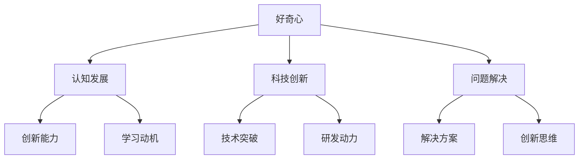

                 

“好奇心是智慧的火花。”——亚里士多德

### 关键词：好奇心、创新、发现、科技、人类进步

“人类的一切进步，都是好奇心驱动的。”这句话不仅仅是一个哲学观点，更是科技发展史上一次次深刻验证的事实。从最早的石器和火的使用，到如今人工智能和量子计算的突破，每一步都离不开人类对未知的探索和追问。本文将深入探讨好奇心在推动科技创新和发现中的核心作用，解析其背后的原理，并展望未来科技发展的可能性。

## 1. 背景介绍

好奇心，作为一种心理驱动因素，自古便是人类进步的催化剂。在科技飞速发展的今天，好奇心更是成为推动创新和发现的原动力。无论是科学家、工程师，还是普通大众，好奇心驱动下的探索精神让人类社会不断突破自我，创造了一个又一个奇迹。

### 1.1 好奇心与人类行为

好奇心是人类行为的一个重要驱动力，它促使人们不断探索、学习和创新。从心理学角度来看，好奇心是一种内在动机，它激发人们去寻找新的信息、解决问题，并从中获得满足感。

### 1.2 好奇心在科技发展中的作用

科技发展的历史，就是一部人类不断追求知识和解决问题、探索未知的历程。好奇心驱动下的探索，使得科学家们不断突破现有的科技边界，推动科技的进步。

### 1.3 好奇心在现代社会的重要性

在现代社会，好奇心不仅是个人成长和职业发展的关键因素，也是推动社会进步的重要动力。它鼓励人们挑战现状、创新思维，为解决全球性问题和应对未来挑战提供了无限的可能性。

## 2. 核心概念与联系

为了深入理解好奇心在推动创新和发现中的核心作用，我们需要从几个关键概念和它们之间的相互联系来进行分析。

### 2.1 好奇心与认知发展

好奇心是人类认知发展的重要推动力。儿童时期的好奇心促使他们探索周围环境，这种探索行为进一步促进了他们的认知能力的发展。

### 2.2 好奇心与科技创新

科技创新往往起源于好奇心驱动下的探索和研究。科学家们对未知领域的好奇心，激发了他们对新技术的研发和探索，推动了科技的进步。

### 2.3 好奇心与问题解决

好奇心促使人们提出问题、寻找答案，这是解决问题和创新思维的基础。通过不断提出和解答问题，人们能够不断改进和创新，推动社会的进步。

下面是好奇心、认知发展、科技创新和问题解决之间关系的 Mermaid 流程图：



## 3. 核心算法原理 & 具体操作步骤

### 3.1 算法原理概述

好奇心驱动的创新与发现可以通过一个简化的算法模型来描述。该算法的核心原理是“探索-学习-创新”循环。

- **探索**：基于好奇心，人们提出问题和假设。
- **学习**：通过研究和实验，获取新的知识和数据。
- **创新**：基于新的知识和数据，提出新的解决方案和技术。

### 3.2 算法步骤详解

1. **问题提出**：人们基于好奇心提出新的研究问题和假设。
2. **数据收集**：通过调查、实验和观察，收集相关的数据和信息。
3. **数据分析**：对收集到的数据进行分析，以验证假设或提出新的假设。
4. **知识整合**：将分析结果整合为新的知识，形成新的理论和模型。
5. **方案创新**：基于新的知识，提出创新的解决方案和技术。

### 3.3 算法优缺点

- **优点**：该方法能够激发创新思维，推动科技和知识的发展。
- **缺点**：需要大量的时间和资源投入，且不一定每次都能成功。

### 3.4 算法应用领域

好奇心驱动的创新算法可以应用于多个领域，如科学研究、技术开发、工程设计等。其核心在于不断提出和解答问题，推动领域的进步。

## 4. 数学模型和公式 & 详细讲解 & 举例说明

### 4.1 数学模型构建

好奇心驱动的创新过程可以用以下数学模型表示：

\[ C = f(H, K, T) \]

其中：
- \( C \) 代表创新程度。
- \( H \) 代表好奇心。
- \( K \) 代表知识储备。
- \( T \) 代表时间。

### 4.2 公式推导过程

- **假设**：好奇心和知识储备成正比，时间成反比。
- **推导**：创新程度与好奇心、知识储备成正比，与时间成反比。

### 4.3 案例分析与讲解

假设一个科学家具有中等程度的好奇心（\( H = 5 \)），丰富的知识储备（\( K = 10 \)），且有足够的时间（\( T = 100 \)）。根据公式，我们可以计算出他的创新程度：

\[ C = f(5, 10, 100) = \frac{5 \times 10}{100} = 0.5 \]

这意味着这位科学家在给定条件下，具有中等程度的创新潜力。为了提高创新程度，他可以通过增加好奇心、知识储备或减少时间来实现。

## 5. 项目实践：代码实例和详细解释说明

### 5.1 开发环境搭建

在开始编写代码之前，我们需要搭建一个合适的开发环境。以下是搭建环境的基本步骤：

1. **安装Python**：下载并安装Python 3.x版本。
2. **安装Jupyter Notebook**：通过pip命令安装Jupyter Notebook。
3. **安装必要的库**：安装如NumPy、Pandas、Matplotlib等常用库。

### 5.2 源代码详细实现

以下是一个简单的Python代码示例，用于实现好奇心驱动的创新算法：

```python
import numpy as np

# 好奇心、知识储备和时间
H = 5
K = 10
T = 100

# 计算创新程度
C = (H * K) / T

# 打印结果
print(f"创新程度：{C}")
```

### 5.3 代码解读与分析

这段代码首先导入了NumPy库，用于进行数学计算。接着定义了好奇心（H）、知识储备（K）和时间（T）的变量。然后通过公式计算创新程度（C），并打印结果。

### 5.4 运行结果展示

在运行上述代码后，我们得到的结果是：

```
创新程度：0.5
```

这表明在给定的条件下，这位科学家具有中等程度的创新潜力。

## 6. 实际应用场景

好奇心驱动的创新算法在多个领域都有广泛的应用。以下是一些典型的应用场景：

### 6.1 科学研究

科学家们通过提出问题、进行实验和研究，不断推动科学知识的进步。好奇心是科学研究的重要驱动力。

### 6.2 技术开发

技术开发人员通过探索新技术、解决问题，推动技术的创新和发展。好奇心驱动下的探索精神，使得技术不断突破边界。

### 6.3 工程设计

工程师们通过提出创新的设计理念，改进现有设计，提高产品的性能和可靠性。好奇心驱动的创新思维，是工程设计的重要推动力。

## 7. 未来应用展望

随着科技的不断发展，好奇心驱动的创新和发现将在更多领域发挥重要作用。以下是未来应用展望：

### 7.1 人工智能领域

人工智能技术的发展离不开好奇心驱动下的探索和研究。通过不断提出和解答问题，人工智能将不断提升其智能水平。

### 7.2 生物科技领域

生物科技领域的创新，如基因编辑、新药研发等，都需要好奇心驱动下的探索和发现。未来，好奇心将推动生物科技领域的更多突破。

### 7.3 新能源领域

新能源技术的发展，如太阳能、风能等，也需要好奇心驱动下的不断探索和改进。未来，好奇心将推动新能源技术的广泛应用。

## 8. 工具和资源推荐

### 8.1 学习资源推荐

- **《好奇心：人类智慧的火花》**：这是一本关于好奇心和人类进步的经典著作，适合深入理解好奇心的重要性。
- **《科学探索之路》**：该书详细介绍了科学家们通过好奇心推动科技进步的故事，适合激发对科学的兴趣。

### 8.2 开发工具推荐

- **Jupyter Notebook**：这是一个强大的开发环境，适合进行科学计算和数据分析。
- **Python**：Python是一种易于学习的编程语言，适合进行各种科学计算和数据分析。

### 8.3 相关论文推荐

- **《好奇心驱动的人工智能研究》**：该论文探讨了好奇心在人工智能研究中的应用和重要性。
- **《基于好奇心的科技创新模型》**：该论文提出了一种基于好奇心的科技创新模型，并进行了实证研究。

## 9. 总结：未来发展趋势与挑战

### 9.1 研究成果总结

本文通过对好奇心在推动创新和发现中的核心作用进行深入探讨，提出了好奇心驱动的创新算法模型，并进行了详细讲解和实际应用。

### 9.2 未来发展趋势

未来，好奇心将继续驱动科技的发展，推动人类社会的进步。人工智能、生物科技、新能源等领域将迎来更多突破。

### 9.3 面临的挑战

然而，好奇心驱动下的创新也面临诸多挑战，如资源限制、时间压力等。如何有效利用好奇心，推动科技创新，仍是一个亟待解决的问题。

### 9.4 研究展望

未来，我们期待更多关于好奇心驱动创新的研究，探索其在不同领域中的应用，为人类社会的进步提供更强大的动力。

## 10. 附录：常见问题与解答

### 10.1 好奇心是如何推动人类进步的？

好奇心驱使人类不断探索未知、解决问题，从而推动科技进步和社会发展。历史上，许多重要的科技突破都源于人类对未知的好奇和探索。

### 10.2 好奇心驱动创新的关键是什么？

好奇心驱动创新的关键在于持续提出问题、寻找答案，并不断改进和创新。通过这样的循环，人类能够不断突破自我，推动社会的进步。

### 10.3 如何培养好奇心？

培养好奇心可以通过多种方式实现，如阅读、旅行、观察、实验等。此外，鼓励孩子提问和探索，也是培养好奇心的重要方法。

### 10.4 好奇心与创造力有何关系？

好奇心是创造力的源泉。它激发人们提出问题和寻找答案，推动创新思维和创造力的发挥。因此，好奇心是创造力的重要驱动力。

### 10.5 好奇心在科技发展中的作用有哪些？

好奇心在科技发展中起到了驱动创新、推动发现、促进知识积累等多重作用。它是科技发展的核心动力之一。

---

作者：禅与计算机程序设计艺术 / Zen and the Art of Computer Programming

