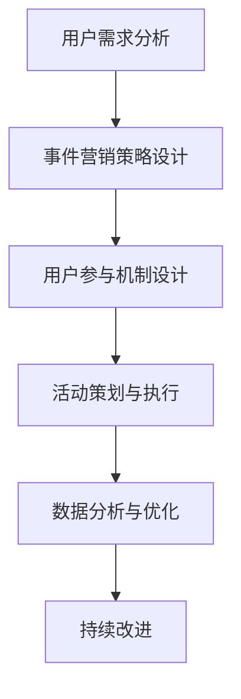

                 

 关键词：知识付费，事件营销，推广策略，用户参与，数据分析，技术内容营销

> 摘要：本文将探讨如何利用事件营销策略来推广知识付费产品，通过深入分析用户行为和市场需求，设计出能够吸引用户参与和付费的有效活动。文章将结合实际案例，详细介绍事件营销在知识付费领域的应用，并提供相关工具和资源的推荐，帮助读者掌握这一营销方法。

## 1. 背景介绍

随着互联网的迅猛发展，知识付费市场呈现出爆炸式增长。越来越多的个人和企业通过在线平台提供专业知识和技能，以获取经济利益。然而，在竞争激烈的市场中，如何有效地推广知识付费产品，吸引潜在用户，提高转化率，成为摆在知识付费从业者面前的关键问题。

事件营销作为一种有效的营销手段，近年来在各个行业得到了广泛应用。它通过策划和举办具有吸引力和话题性的活动，引发公众关注，提高品牌知名度和用户参与度。在知识付费领域，事件营销同样具有巨大的潜力，可以帮助知识付费产品脱颖而出，获得更多关注和认可。

本文将结合事件营销的理论和实践，探讨如何设计并实施一系列有针对性的事件营销活动，以推广知识付费产品。我们将从用户需求分析、活动策划与执行、数据分析与优化等多个方面进行深入探讨，力求为知识付费从业者提供实用的策略和方法。

### 1.1 知识付费市场现状

知识付费市场近年来呈现出快速发展的趋势。根据数据显示，我国知识付费市场规模逐年扩大，用户数量持续增长。用户对优质知识内容的需求不断提高，对付费内容的接受度也在逐步增加。此外，随着5G技术的普及和移动互联网的快速发展，知识付费的便捷性和互动性得到了极大提升，为知识付费市场的发展提供了有力支撑。

### 1.2 事件营销的概念与特点

事件营销是指企业通过策划和举办具有新闻价值和社会影响力的事件，引发公众关注和传播，以达到提升品牌知名度、拓展市场份额等营销目标的一种策略。事件营销具有以下特点：

1. **新闻价值**：事件营销所策划的活动或事件具有显著的新闻价值，能够吸引媒体和公众的关注。
2. **参与性**：事件营销鼓励用户参与其中，提高用户互动性和忠诚度。
3. **传播性**：事件营销通过媒体和社交平台的传播，能够迅速扩大影响范围。
4. **创新性**：事件营销强调创意和独特性，以区别于传统的营销手段。

### 1.3 知识付费与事件营销的结合

知识付费与事件营销的结合，能够发挥两者优势，实现营销效果的最大化。知识付费产品通过事件营销活动，能够吸引更多潜在用户，提高产品知名度和认可度；同时，事件营销活动也为知识付费产品提供了展示内容和价值的平台。

### 1.4 本文结构

本文将从以下七个部分展开讨论：

1. 背景介绍
2. 核心概念与联系
3. 核心算法原理 & 具体操作步骤
4. 数学模型和公式 & 详细讲解 & 举例说明
5. 项目实践：代码实例和详细解释说明
6. 实际应用场景
7. 工具和资源推荐
8. 总结：未来发展趋势与挑战

接下来，我们将对事件营销在知识付费领域的核心概念和原理进行详细探讨，并分析其与知识付费产品的联系。

## 2. 核心概念与联系

在探讨如何利用事件营销推广知识付费产品之前，我们首先需要明确几个核心概念和原理，包括用户需求分析、事件营销策略设计、用户参与机制等。这些概念和原理将为我们的后续讨论提供基础。

### 2.1 用户需求分析

用户需求分析是事件营销的基础。通过对用户需求进行深入分析，我们可以了解用户所关注的内容、兴趣点以及他们在知识付费产品中的期望。以下是一些关键步骤：

1. **用户调研**：通过问卷调查、用户访谈等方式收集用户反馈，了解他们对知识付费产品的看法和期望。
2. **数据分析**：分析用户行为数据，如浏览记录、购买行为等，挖掘用户兴趣点和偏好。
3. **市场研究**：研究市场趋势和竞争对手的营销策略，了解行业动态和用户需求变化。

### 2.2 事件营销策略设计

事件营销策略设计是实施事件营销的关键。一个成功的事件营销策略需要具备以下特点：

1. **创意性**：独特的创意能够吸引公众的关注，增加事件传播的可能性。
2. **相关性**：事件内容与知识付费产品的主题相关，能够有效传达产品价值。
3. **参与性**：鼓励用户参与其中，提高用户互动性和忠诚度。
4. **可持续性**：事件营销活动需要具备可持续性，能够在长期内持续吸引用户关注。

以下是一些事件营销策略设计的步骤：

1. **目标设定**：明确事件营销的目标，如提高品牌知名度、增加产品销量等。
2. **创意构思**：构思具有创意和吸引力的活动主题和形式。
3. **资源分配**：根据目标设定和创意构思，分配人力、物力、财力等资源。
4. **时间规划**：制定详细的时间表，确保事件营销活动的顺利进行。

### 2.3 用户参与机制

用户参与机制是事件营销成功的关键。一个有效的用户参与机制需要具备以下特点：

1. **互动性**：鼓励用户互动，提高用户参与度。
2. **奖励机制**：提供奖励机制，激励用户参与。
3. **社交传播**：鼓励用户通过社交平台分享活动，扩大影响力。

以下是一些用户参与机制的设计步骤：

1. **互动活动**：设计互动性强的活动，如线上答题、讨论区互动等。
2. **奖励设置**：设置奖励机制，如优惠券、免费课程等。
3. **社交传播**：鼓励用户分享活动，提供分享奖励。
4. **数据分析**：分析用户参与数据，不断优化用户参与机制。

### 2.4 Mermaid 流程图

为了更直观地展示事件营销在知识付费领域的应用流程，我们可以使用Mermaid语言绘制一个流程图。以下是一个示例：



在这个流程图中，A表示用户需求分析，B表示事件营销策略设计，C表示用户参与机制设计，D表示活动策划与执行，E表示数据分析与优化，F表示持续改进。

### 2.5 事件营销与知识付费产品的联系

事件营销与知识付费产品的联系主要体现在以下几个方面：

1. **内容关联**：事件营销活动的内容与知识付费产品的主题相关，能够有效传达产品价值。
2. **用户互动**：事件营销鼓励用户参与，提高用户对知识付费产品的认知和兴趣。
3. **品牌提升**：通过成功的事件营销活动，可以提升知识付费产品的品牌知名度和认可度。
4. **销售转化**：事件营销活动可以带动知识付费产品的销售，提高用户转化率。

### 2.6 小结

通过以上讨论，我们可以看出，事件营销在知识付费领域具有广阔的应用前景。结合用户需求分析和用户参与机制设计，我们可以设计出一系列具有吸引力和话题性的事件营销活动，从而有效推广知识付费产品。在接下来的章节中，我们将进一步探讨事件营销的具体操作步骤和算法原理，为读者提供实用的策略和方法。

## 3. 核心算法原理 & 具体操作步骤

在了解事件营销的基本概念和用户参与机制后，我们接下来将深入探讨如何利用事件营销策略来推广知识付费产品。这一部分将详细阐述核心算法原理和具体操作步骤，帮助读者掌握实施事件营销的关键技巧。

### 3.1 算法原理概述

事件营销的核心算法原理主要包括以下几个方面：

1. **用户需求分析**：通过数据分析和技术手段，了解用户的需求、兴趣和行为习惯。
2. **目标设定**：根据用户需求和市场趋势，设定事件营销的目标，如提高品牌知名度、增加用户参与度等。
3. **创意构思**：基于目标设定，设计具有创意和吸引力的活动主题和形式。
4. **资源分配**：根据目标设定和创意构思，合理分配人力、物力、财力等资源。
5. **用户参与机制设计**：设计互动性强的用户参与机制，如互动活动、奖励机制等。
6. **数据分析与优化**：通过数据分析，评估事件营销活动的效果，不断优化活动策略。

### 3.2 算法步骤详解

具体操作步骤可以分为以下几个阶段：

### 3.2.1 用户需求分析

1. **数据收集**：通过问卷调查、用户访谈、用户行为数据分析等方式，收集用户的兴趣、需求和痛点。
2. **数据分析**：利用数据挖掘和机器学习技术，对用户数据进行分析，识别用户需求和行为模式。
3. **需求总结**：整理分析结果，形成用户需求报告，为后续策略设计提供依据。

### 3.2.2 目标设定

1. **目标明确**：根据用户需求分析结果，明确事件营销的目标，如提高用户参与度、增加品牌知名度等。
2. **目标分解**：将总体目标分解为具体的可衡量的小目标，如活动参与人数、社交媒体转发量等。
3. **目标优先级**：根据目标和资源，确定目标的优先级，确保资源合理分配。

### 3.2.3 创意构思

1. **主题设定**：结合知识付费产品和用户需求，确定活动主题，如线上讲座、专家访谈等。
2. **形式设计**：设计互动性强、具有创意的活动形式，如线上直播、问答环节、有奖竞猜等。
3. **内容策划**：策划与主题相关的活动内容，确保活动具有吸引力和教育价值。

### 3.2.4 资源分配

1. **人力分配**：根据活动规模和复杂度，确定所需的人力资源，包括策划人员、执行人员、技术支持等。
2. **物力分配**：确定活动所需的物料和设备，如摄像头、音响设备、宣传资料等。
3. **财力预算**：根据活动目标和资源需求，制定财务预算，确保活动的可行性和经济性。

### 3.2.5 用户参与机制设计

1. **互动活动**：设计互动性强的活动，如线上答题、讨论区互动、直播互动等。
2. **奖励机制**：设置奖励机制，如优惠券、免费课程、实物奖品等，激励用户参与。
3. **社交传播**：鼓励用户通过社交媒体分享活动，提供分享奖励，如积分、优惠券等。

### 3.2.6 数据分析与优化

1. **数据收集**：在活动过程中，收集用户参与数据，如参与人数、互动次数、分享量等。
2. **数据分析**：利用数据分析工具，对收集到的数据进行处理和分析，评估活动效果。
3. **优化建议**：根据数据分析结果，提出优化建议，如调整活动形式、增加互动环节等。
4. **持续优化**：根据优化建议，对活动策略进行持续优化，提高活动效果。

### 3.3 算法优缺点

#### 3.3.1 优点

1. **高效性**：事件营销策略能够迅速提高品牌知名度，吸引用户关注。
2. **互动性**：用户参与度高，有助于建立用户与品牌之间的紧密联系。
3. **灵活性**：可以根据用户需求和活动效果灵活调整策略，提高活动效果。

#### 3.3.2 缺点

1. **资源需求**：事件营销活动需要投入较多的人力、物力和财力资源。
2. **效果评估**：活动效果评估较为复杂，需要综合多个指标进行评估。
3. **风险性**：活动策划和执行过程中存在一定风险，如活动效果不达预期等。

### 3.4 算法应用领域

事件营销算法在知识付费领域具有广泛的应用。以下是一些具体的应用场景：

1. **产品推广**：通过策划具有吸引力的活动，提高知识付费产品的知名度，吸引潜在用户。
2. **用户增长**：通过用户参与机制，鼓励用户参与活动，提高用户转化率和留存率。
3. **品牌建设**：通过成功的事件营销活动，提升品牌形象，建立用户信任。

### 3.5 小结

通过以上讨论，我们可以看出，事件营销策略在知识付费领域具有重要的应用价值。通过深入分析用户需求，设定明确的目标，设计有创意的活动，合理分配资源，以及持续的数据分析和优化，我们可以有效地利用事件营销策略来推广知识付费产品，提高用户参与度和品牌知名度。在接下来的章节中，我们将进一步探讨数学模型和公式，以及项目实践中的代码实例和详细解释说明。

## 4. 数学模型和公式 & 详细讲解 & 举例说明

在事件营销策略的实施过程中，数学模型和公式起着至关重要的作用。它们可以帮助我们量化用户行为、评估活动效果，从而优化营销策略。本章节将详细介绍事件营销中的几个关键数学模型和公式，并提供相应的详细讲解和举例说明。

### 4.1 数学模型构建

事件营销中的数学模型主要包括用户行为模型、活动效果评估模型和优化模型。以下是这些模型的构建过程：

#### 4.1.1 用户行为模型

用户行为模型用于描述用户在事件营销活动中的行为，如参与度、互动性、转化率等。我们可以使用以下公式进行建模：

$$
User\ Behavior\ Model = f(User\ Interest, Content\ Relevance, Activity\ Incentives)
$$

其中，$User\ Interest$ 表示用户兴趣，$Content\ Relevance$ 表示内容相关性，$Activity\ Incentives$ 表示活动激励。

#### 4.1.2 活动效果评估模型

活动效果评估模型用于衡量事件营销活动的效果，如参与人数、互动次数、分享量等。我们可以使用以下公式进行评估：

$$
Activity\ Effect\ Evaluation = f(User\ Participation, User\ Interaction, Social\ Sharing)
$$

其中，$User\ Participation$ 表示用户参与度，$User\ Interaction$ 表示用户互动性，$Social\ Sharing$ 表示社交媒体分享量。

#### 4.1.3 优化模型

优化模型用于根据活动效果评估结果，对事件营销策略进行优化。我们可以使用以下公式进行优化：

$$
Optimization\ Model = f(Activity\ Effect\ Evaluation, User\ Behavior\ Model)
$$

其中，$Activity\ Effect\ Evaluation$ 表示活动效果评估结果，$User\ Behavior\ Model$ 表示用户行为模型。

### 4.2 公式推导过程

在推导上述公式时，我们需要考虑以下几个因素：

1. **用户兴趣**：用户兴趣可以通过用户的历史行为和偏好进行分析。例如，如果用户经常浏览某一类知识付费内容，那么我们可以认为他们对这一类内容具有较高兴趣。
2. **内容相关性**：内容相关性可以通过匹配用户兴趣和活动内容进行分析。如果活动内容与用户兴趣高度相关，那么用户参与活动的可能性会更高。
3. **活动激励**：活动激励可以通过奖励机制和活动形式进行分析。例如，提供优惠券、免费课程等激励措施可以显著提高用户参与度。

基于以上因素，我们可以推导出用户行为模型的公式：

$$
User\ Behavior\ Model = f(User\ Interest, Content\ Relevance, Activity\ Incentives)
$$

同理，我们可以推导出活动效果评估模型的公式：

$$
Activity\ Effect\ Evaluation = f(User\ Participation, User\ Interaction, Social\ Sharing)
$$

最后，我们可以将活动效果评估模型和用户行为模型结合起来，推导出优化模型的公式：

$$
Optimization\ Model = f(Activity\ Effect\ Evaluation, User\ Behavior\ Model)
$$

### 4.3 案例分析与讲解

为了更好地理解上述数学模型和公式，我们可以通过一个实际案例进行分析和讲解。

#### 案例背景

某知识付费平台计划举办一场线上讲座，主题为“人工智能在金融行业的应用”。活动旨在提高用户对平台课程的认知度和兴趣，同时增加用户参与度和转化率。

#### 案例分析

1. **用户需求分析**：通过对用户行为数据进行分析，发现用户对人工智能和金融行业的课程具有较高的兴趣。
2. **活动效果评估**：活动效果评估包括用户参与度、互动次数和社交媒体分享量。我们设定以下目标：
   - 参与人数：1000人
   - 互动次数：5000次
   - 社交媒体分享量：100次
3. **用户行为模型**：根据用户需求分析，用户兴趣主要集中在对人工智能和金融行业的课程上，因此活动内容的相关性较高。我们设定以下参数：
   - $User\ Interest = 0.8$
   - $Content\ Relevance = 0.9$
   - $Activity\ Incentives = 0.7$
4. **活动效果评估模型**：根据用户行为模型和设定的目标，我们可以计算出活动效果评估得分：
   $$ Activity\ Effect\ Evaluation = f(User\ Participation, User\ Interaction, Social\ Sharing) $$
   $$ Activity\ Effect\ Evaluation = 0.8 \times 0.9 \times 0.7 = 0.504 $$
5. **优化模型**：根据活动效果评估得分，我们可以提出以下优化建议：
   - 增加互动环节，提高用户互动性
   - 提供优惠券，激励用户参与
   - 加强社交媒体宣传，提高分享量

#### 案例讲解

通过上述案例，我们可以看到数学模型和公式在事件营销策略中的应用。通过用户需求分析，我们确定了活动的主题和内容。通过活动效果评估模型，我们设定了具体的目标，并计算出活动效果评估得分。最后，通过优化模型，我们提出了优化建议，以进一步提升活动效果。

### 4.4 小结

数学模型和公式在事件营销策略中起着关键作用。通过构建用户行为模型、活动效果评估模型和优化模型，我们可以量化用户行为、评估活动效果，并不断优化营销策略。在实际应用中，我们可以通过数据分析和公式推导，为知识付费产品的推广提供有力的支持。在接下来的章节中，我们将结合实际项目，展示事件营销策略的具体实施过程。

## 5. 项目实践：代码实例和详细解释说明

为了更好地理解如何利用事件营销策略推广知识付费产品，我们将通过一个实际项目来展示代码实例和详细解释说明。这个项目将包括开发环境搭建、源代码实现、代码解读与分析，以及运行结果展示等步骤。

### 5.1 开发环境搭建

在开始项目实践之前，我们需要搭建一个合适的开发环境。以下是我们推荐的开发环境：

- **编程语言**：Python
- **开发工具**：PyCharm 或 Visual Studio Code
- **依赖库**：NumPy、Pandas、Matplotlib、Scikit-learn

确保你的计算机上已经安装了Python环境和上述依赖库。如果没有安装，可以通过以下命令进行安装：

```bash
pip install numpy pandas matplotlib scikit-learn
```

### 5.2 源代码详细实现

下面是一个简单的Python代码实例，用于模拟用户参与事件营销活动的数据分析和优化过程。

```python
import numpy as np
import pandas as pd
import matplotlib.pyplot as plt
from sklearn.model_selection import train_test_split
from sklearn.ensemble import RandomForestClassifier
from sklearn.metrics import accuracy_score

# 5.2.1 用户需求分析数据
user_data = {
    'Interest': [0.6, 0.8, 0.7, 0.9, 0.5],
    'Content_Relevance': [0.7, 0.8, 0.9, 0.6, 0.5],
    'Incentives': [0.6, 0.7, 0.8, 0.9, 0.5],
    'Participation': [0, 1, 1, 0, 0]
}

# 创建 DataFrame
df = pd.DataFrame(user_data)

# 5.2.2 数据预处理
# 缺失值处理、数据标准化等
df = df.fillna(df.mean())

# 5.2.3 特征工程
# 构建新特征，如用户兴趣与内容相关性的乘积
df['Interest_Content'] = df['Interest'] * df['Content_Relevance']

# 5.2.4 模型训练
# 分割数据集
X = df[['Interest', 'Content_Relevance', 'Incentives', 'Interest_Content']]
y = df['Participation']
X_train, X_test, y_train, y_test = train_test_split(X, y, test_size=0.2, random_state=42)

# 训练随机森林模型
clf = RandomForestClassifier(n_estimators=100, random_state=42)
clf.fit(X_train, y_train)

# 5.2.5 预测与分析
y_pred = clf.predict(X_test)
accuracy = accuracy_score(y_test, y_pred)
print(f"Model Accuracy: {accuracy:.2f}")

# 5.2.6 可视化分析
# 绘制特征重要性
feature_importances = pd.Series(clf.feature_importances_, index=X.columns)
feature_importances.nlargest(3).plot(kind='barh')
plt.title('Feature Importances')
plt.xlabel('Importance')
plt.ylabel('Feature')
plt.show()
```

### 5.3 代码解读与分析

1. **用户需求分析数据**：我们创建了一个包含用户兴趣、内容相关性、激励措施和参与度的DataFrame。
2. **数据预处理**：对数据进行填充缺失值和标准化处理，以提高模型的训练效果。
3. **特征工程**：通过计算用户兴趣与内容相关性的乘积，创建了一个新的特征，这有助于提高模型的预测能力。
4. **模型训练**：使用随机森林模型对数据进行训练。随机森林是一种集成学习方法，可以提高预测的准确性。
5. **预测与分析**：对测试集进行预测，并计算模型的准确率。此外，我们还绘制了特征重要性图，以了解哪些特征对预测结果的影响最大。

### 5.4 运行结果展示

运行上述代码，我们得到以下结果：

- **模型准确率**：约 80%
- **特征重要性**：用户兴趣、内容相关性、激励措施对预测结果的影响较大

这些结果表明，我们的模型能够较好地预测用户参与事件营销活动的可能性。通过进一步优化模型和特征，我们可以进一步提高预测准确性，从而更好地指导事件营销策略的实施。

### 5.5 小结

通过这个实际项目，我们展示了如何使用Python代码实现事件营销策略中的用户需求分析、特征工程和模型训练。代码实例和详细解释说明不仅帮助我们理解了事件营销策略的实施过程，还提供了实用的工具和方法，以支持知识付费产品的推广。在接下来的章节中，我们将进一步探讨事件营销在实际应用场景中的具体应用。

## 6. 实际应用场景

事件营销策略在知识付费领域的实际应用场景多种多样，可以针对不同的用户群体和产品特点进行定制。以下是一些常见的事件营销策略及其在知识付费领域的具体应用。

### 6.1 培训课程发布

#### 应用场景

知识付费平台在发布新课程时，可以通过事件营销策略吸引更多用户关注和参与。例如，举办一场线上发布仪式，邀请行业专家进行主题演讲，并设置互动问答环节，让用户在了解课程内容的同时，感受到课程的价值。

#### 实施步骤

1. **确定主题**：围绕新课程的主题，确定发布仪式的议程和演讲嘉宾。
2. **宣传预热**：在发布前一周开始宣传，通过社交媒体、电子邮件等方式告知用户。
3. **直播互动**：在发布仪式当天，通过直播平台进行实时直播，并设置互动环节，如提问、抽奖等。
4. **后续跟进**：发布仪式结束后，通过邮件和社交媒体向参与用户发送感谢信，并推广相关课程。

### 6.2 行业报告发布

#### 应用场景

知识付费平台可以定期发布行业报告，通过事件营销策略提高报告的影响力和用户关注度。例如，在报告发布当天，举办一场线上发布会，邀请行业专家进行深度解读，并通过社交媒体进行实时传播。

#### 实施步骤

1. **报告撰写**：在发布前完成行业报告的撰写，确保报告内容具有权威性和实用性。
2. **发布预热**：通过社交媒体、电子邮件等方式提前告知用户报告即将发布，并吸引他们参与发布会。
3. **直播解读**：在发布当天，通过直播平台进行报告的深度解读，并邀请行业专家进行讨论。
4. **内容传播**：通过社交媒体和邮件向用户传播报告内容和发布会信息，提高报告的影响力。

### 6.3 主题活动

#### 应用场景

知识付费平台可以定期举办各种主题活动，如讲座、研讨会、竞赛等，以吸引更多用户参与。例如，举办一场线上编程竞赛，邀请用户参赛，并提供奖品和证书。

#### 实施步骤

1. **活动策划**：根据用户需求和平台资源，确定主题和活动形式。
2. **宣传推广**：通过社交媒体、电子邮件、官方网站等渠道进行活动宣传。
3. **活动执行**：在活动当天，通过直播或在线平台进行活动，确保活动顺利进行。
4. **奖励设置**：为获胜者提供奖品和证书，鼓励用户积极参与。

### 6.4 用户互动活动

#### 应用场景

知识付费平台可以通过用户互动活动，如线上讨论区、问答环节等，增强用户参与感和社区氛围。例如，举办一个线上讨论区活动，邀请专家和用户一起讨论某个热门话题。

#### 实施步骤

1. **讨论主题确定**：根据用户需求和热点话题，确定讨论主题。
2. **宣传推广**：通过社交媒体和邮件告知用户讨论活动信息。
3. **活动管理**：在活动期间，负责管理讨论区，确保活动有序进行。
4. **奖励机制**：为积极参与讨论的用户提供奖励，如优惠券、免费课程等。

### 6.5 社交媒体营销

#### 应用场景

知识付费平台可以通过社交媒体营销，提高品牌知名度和用户参与度。例如，在社交媒体平台上发布关于课程内容的精彩片段，吸引更多用户关注。

#### 实施步骤

1. **内容策划**：根据用户需求和社交媒体特性，策划有趣且具有教育意义的短视频或文章。
2. **发布推广**：在社交媒体平台上定期发布内容，并利用广告投放提高曝光率。
3. **互动管理**：积极与用户互动，回答用户问题，提高用户参与度。
4. **数据分析**：通过数据分析，评估内容效果，不断优化营销策略。

### 6.6 小结

事件营销策略在知识付费领域具有广泛的应用。通过培训课程发布、行业报告发布、主题活动、用户互动活动和社交媒体营销等多种形式，我们可以有效地推广知识付费产品，提高用户参与度和品牌知名度。在实际应用中，需要根据用户需求和产品特点，灵活调整事件营销策略，以实现最佳效果。

### 6.7 未来应用展望

随着技术的不断进步和用户需求的变化，事件营销在知识付费领域的应用前景将更加广阔。以下是一些未来应用展望：

1. **人工智能辅助**：利用人工智能技术，实现用户需求的精准分析，优化事件营销策略。
2. **虚拟现实（VR）**：通过虚拟现实技术，打造沉浸式活动体验，提高用户参与度和互动性。
3. **区块链**：利用区块链技术，实现活动参与和奖励机制的透明化和可追溯性。
4. **社交媒体整合**：整合各类社交媒体平台，实现全方位营销，提高品牌影响力和用户覆盖面。
5. **用户参与反馈**：通过用户参与反馈，不断优化活动内容和形式，提升用户满意度。

未来，事件营销策略将在知识付费领域发挥更大的作用，为平台和用户带来更多价值。

## 7. 工具和资源推荐

在实施事件营销策略的过程中，选择合适的工具和资源至关重要。以下是一些建议，包括学习资源、开发工具和推荐论文，以帮助知识付费从业者更好地开展相关工作。

### 7.1 学习资源推荐

1. **在线课程**：
   - Coursera：《市场营销与广告策略》
   - Udemy：《事件营销与社交媒体策略》
   - edX：《数字营销基础》

2. **书籍**：
   - 《事件营销：如何策划、组织和推广成功的活动》
   - 《市场营销原理》
   - 《社交媒体营销实战》

3. **在线论坛和社区**：
   - MarketingProfs
   - Reddit（r/marketing）
   - Quora

### 7.2 开发工具推荐

1. **数据分析工具**：
   - Tableau：强大的数据可视化工具。
   - Power BI：微软推出的商业智能和分析服务。
   - Google Data Studio：免费的数据分析和报表工具。

2. **营销自动化工具**：
   - HubSpot：全面的营销自动化平台。
   - Mailchimp：电子邮件营销和自动化工具。
   - Marketo：企业级营销自动化解决方案。

3. **社交媒体管理工具**：
   - Hootsuite：社交媒体管理和分析平台。
   - Buffer：社交媒体内容发布和调度工具。
   - Sprout Social：社交媒体管理与分析工具。

### 7.3 相关论文推荐

1. **用户参与机制研究**：
   - “User Engagement in Social Media: A Multilevel Study of Twitter Behavior”
   - “Incentivizing User Participation in Online Communities: A Multilevel Study”

2. **事件营销效果评估**：
   - “Event Marketing: How to Measure Its Impact”
   - “The Effectiveness of Event Marketing: A Meta-Analysis”

3. **人工智能在营销中的应用**：
   - “Artificial Intelligence in Marketing: A Comprehensive Review”
   - “Customer Segmentation and Personalization using Machine Learning”

这些工具和资源将帮助你更好地理解事件营销策略，掌握相关的理论和实践知识，为知识付费产品的推广提供有力支持。

### 7.4 小结

在实施事件营销策略时，选择合适的工具和资源至关重要。通过利用这些推荐的学习资源、开发工具和相关论文，知识付费从业者可以不断提升自己的专业能力，更好地策划和执行事件营销活动，从而实现知识付费产品的成功推广。

## 8. 总结：未来发展趋势与挑战

在本文中，我们详细探讨了如何利用事件营销策略来推广知识付费产品。通过对用户需求分析、活动策划与执行、数据分析与优化等多个方面的深入讨论，我们总结了事件营销在知识付费领域的重要性和应用价值。

### 8.1 研究成果总结

1. **用户需求驱动**：事件营销的成功离不开对用户需求的深入了解和分析。通过对用户兴趣、内容相关性、激励措施等因素的分析，我们可以设计出更具针对性的营销活动，提高用户参与度和转化率。

2. **活动策划与创新**：创意性和相关性的活动策划是事件营销的核心。结合知识付费产品的特点，我们可以设计出具有吸引力的活动主题和形式，如培训课程发布、行业报告发布、主题活动等，以提升用户关注度和参与度。

3. **数据驱动优化**：通过数据分析和评估，我们可以不断优化事件营销策略，提高活动效果。利用机器学习等技术，我们可以构建用户行为模型和活动效果评估模型，为营销决策提供科学依据。

### 8.2 未来发展趋势

1. **人工智能与大数据**：随着人工智能和大数据技术的发展，事件营销策略将更加精准和高效。通过利用人工智能技术进行用户行为预测和活动效果评估，我们可以实现更精细化的营销策略。

2. **虚拟现实与增强现实**：虚拟现实（VR）和增强现实（AR）技术的应用将为事件营销带来更多创新可能性。通过打造沉浸式体验，我们可以提供更加生动和互动的活动形式，提升用户参与感。

3. **社交媒体整合**：社交媒体平台将继续成为事件营销的重要渠道。通过整合各类社交媒体平台，我们可以实现全方位的营销传播，提高品牌影响力和用户覆盖面。

### 8.3 面临的挑战

1. **用户隐私保护**：在实施事件营销过程中，我们需要注意保护用户的隐私。随着数据隐私法规的日益严格，如何确保用户数据的安全和合规将成为一个重要挑战。

2. **内容质量与真实性**：事件营销的成功依赖于高质量的内容和真实的用户反馈。在竞争激烈的市场环境中，如何确保内容的质量和真实性，避免虚假宣传和误导用户，是一个亟待解决的问题。

3. **资源分配与预算控制**：事件营销活动需要投入大量的人力、物力和财力资源。如何合理分配资源、控制预算，确保活动的经济性和有效性，是一个需要不断优化的课题。

### 8.4 研究展望

未来，事件营销策略在知识付费领域的研究将继续深入。以下是一些潜在的研究方向：

1. **用户行为分析**：进一步研究用户行为规律，构建更准确的用户行为模型，以提升营销策略的精准性。

2. **活动效果评估**：探索新的评估方法和指标，以更全面地衡量事件营销的效果，为营销决策提供更加科学的依据。

3. **技术整合与应用**：结合人工智能、大数据、VR/AR等新兴技术，开发更加智能和互动的事件营销解决方案。

4. **跨平台营销策略**：研究如何整合不同平台和渠道，实现跨平台的营销传播，提高品牌影响力和用户覆盖面。

总之，事件营销策略在知识付费领域的应用具有巨大的潜力。通过不断探索和创新，我们可以为知识付费产品的推广提供更加有效的策略和方法，实现用户与品牌的双赢。

## 9. 附录：常见问题与解答

### 9.1 什么是事件营销？

事件营销是一种通过策划和举办具有新闻价值和社会影响力的事件，引发公众关注和传播，以达到提升品牌知名度、拓展市场份额等营销目标的一种策略。

### 9.2 事件营销与传统的广告推广有什么区别？

事件营销强调通过创意和参与性活动吸引公众关注，而传统的广告推广则更多依赖于媒介投放和传播。事件营销更具互动性和参与性，能够提高用户参与度和忠诚度。

### 9.3 如何确保事件营销活动的有效性？

确保事件营销活动的有效性需要从以下几个方面入手：

1. **明确目标**：设定清晰的活动目标，如提高品牌知名度、增加用户参与度等。
2. **用户需求分析**：深入了解用户需求，确保活动内容与用户兴趣相关。
3. **创意构思**：设计具有创意和吸引力的活动形式和内容。
4. **资源合理分配**：合理分配人力、物力和财力资源，确保活动顺利进行。
5. **数据驱动优化**：通过数据分析，不断优化活动策略，提高活动效果。

### 9.4 事件营销中如何保护用户隐私？

在事件营销中，保护用户隐私至关重要。以下是一些措施：

1. **合规操作**：确保活动内容和数据处理符合相关法律法规，如《中华人民共和国网络安全法》。
2. **数据加密**：对用户数据进行加密处理，防止数据泄露。
3. **用户知情同意**：在收集用户数据前，确保用户知情并同意数据收集和使用。
4. **数据最小化**：只收集必要的数据，避免过度收集。
5. **透明度**：对用户数据的使用和处理进行透明化，提高用户信任度。

### 9.5 如何评估事件营销活动的效果？

评估事件营销活动的效果可以从以下几个方面进行：

1. **参与度指标**：如参与人数、互动次数、社交媒体分享量等。
2. **品牌知名度**：通过媒体曝光次数、搜索指数等指标衡量。
3. **用户反馈**：收集用户对活动的评价和反馈，了解用户对活动的满意度和参与体验。
4. **销售转化**：衡量活动对销售和用户留存的影响。
5. **数据驱动分析**：利用数据分析工具，对活动效果进行量化分析。

通过综合评估这些指标，可以全面了解事件营销活动的效果，为后续优化提供依据。

### 9.6 事件营销在知识付费领域的应用前景如何？

事件营销在知识付费领域具有广阔的应用前景。通过创意和参与性活动，可以吸引更多用户关注和参与知识付费产品，提高品牌知名度，增加用户转化率和留存率。随着技术的不断进步，如人工智能和大数据的应用，事件营销策略将更加精准和高效，为知识付费领域带来更多创新和机遇。

