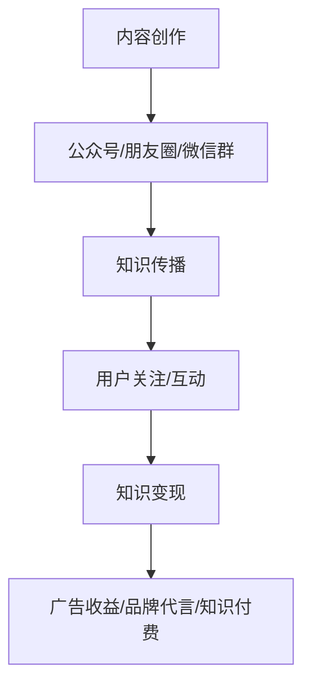

                 

关键词：微信生态圈、知识变现、个人品牌、内容创作、社群运营

> 摘要：随着移动互联网的快速发展，微信已成为人们日常沟通交流的主要平台。如何利用微信生态圈实现知识变现，已成为越来越多知识型个体和企业关注的热点。本文将深入探讨微信生态圈的特点，以及如何通过内容创作、社群运营和个人品牌建设等途径，实现知识的有效传播和价值的最大化。

## 1. 背景介绍

微信作为一款集社交、支付、内容创作等多功能于一体的超级应用，已深入渗透到我国人们的日常生活之中。根据官方数据显示，截至2022年，微信的月活跃用户数已超过12亿。这样一个庞大的用户群体，无疑为知识型个体和企业提供了巨大的市场机会。如何在这个生态圈中实现知识变现，已成为一个值得探讨的课题。

知识变现，简单来说，就是通过知识的传播和应用，将知识转化为经济价值的过程。在微信生态圈中，知识变现的形式多种多样，包括但不限于知识付费、广告收益、品牌代言等。如何巧妙地利用微信生态圈的各种工具和功能，实现知识变现，是本文要探讨的核心问题。

## 2. 核心概念与联系

### 2.1 微信生态圈的概念

微信生态圈是指以微信为核心，包括朋友圈、公众号、小程序、微信支付、微信群等多个组成部分的生态体系。这个生态圈为用户提供了丰富的社交、支付、内容创作等功能，也为知识型个体和企业提供了广阔的舞台。

### 2.2 知识变现的概念

知识变现，如前所述，是指通过知识的传播和应用，将知识转化为经济价值的过程。在微信生态圈中，知识变现的形式主要包括知识付费、广告收益、品牌代言等。

### 2.3 微信生态圈与知识变现的联系

微信生态圈为知识变现提供了丰富的工具和平台。例如，公众号可以为知识型个体和企业提供一个展示知识和技能的舞台，朋友圈和微信群则为知识的传播提供了便捷的渠道。通过巧妙地利用这些工具和平台，知识型个体和企业可以有效地实现知识变现。

### 2.4 Mermaid 流程图

以下是一个简单的Mermaid流程图，展示了微信生态圈中知识变现的流程：



## 3. 核心算法原理 & 具体操作步骤

### 3.1 算法原理概述

在微信生态圈中，知识变现的核心算法原理主要包括以下几个方面：

- 内容创作：通过高质量的内容创作，吸引关注和互动。
- 知识传播：通过朋友圈、公众号、微信群等渠道，将知识传播给更多用户。
- 用户关注和互动：通过互动和粉丝管理，增加用户粘性，提高用户转化率。
- 知识变现：通过广告收益、品牌代言、知识付费等多种形式，实现知识的商业化。

### 3.2 算法步骤详解

1. 内容创作：首先，需要确定自己的知识领域和目标受众，然后进行高质量的内容创作。内容形式可以包括文章、图片、视频、直播等。

2. 知识传播：将创作的内容发布到公众号、朋友圈、微信群等渠道，利用微信的社交属性，实现知识的广泛传播。

3. 用户关注和互动：积极与用户互动，回答用户的问题，提供专业的建议。通过互动，增加用户的粘性，提高用户转化率。

4. 知识变现：根据用户的需求，提供有针对性的知识服务。例如，可以开设线上课程、提供咨询服务、出售知识产品等。

### 3.3 算法优缺点

**优点：**

- 面向广泛的用户群体，市场潜力巨大。
- 利用微信的社交属性，可以实现知识的快速传播。
- 可以根据用户需求，提供个性化的知识服务。

**缺点：**

- 需要持续的内容创作和用户互动，工作量大。
- 需要一定的技术门槛，例如公众号运营、内容创作等。

### 3.4 算法应用领域

- 教育培训：通过线上课程，实现知识付费。
- 专业咨询：提供专业的咨询服务，实现知识变现。
- 内容创作：通过创作高质量的内容，实现广告收益。
- 品牌代言：通过个人品牌的建设，实现品牌代言收益。

## 4. 数学模型和公式 & 详细讲解 & 举例说明

### 4.1 数学模型构建

在微信生态圈中，知识变现的数学模型可以构建为：

\[ R = f(C, U, I) \]

其中，\( R \) 表示知识变现的收益，\( C \) 表示内容创作的质量，\( U \) 表示用户互动的数量，\( I \) 表示知识传播的广度。

### 4.2 公式推导过程

- \( C \)：内容创作的质量是知识变现的关键因素。高质量的内容可以吸引更多的用户关注和互动，从而提高变现收益。
- \( U \)：用户互动的数量反映了用户对知识的认可程度。互动越多，用户粘性越高，知识变现的潜力越大。
- \( I \)：知识传播的广度决定了知识的覆盖范围。传播越广，潜在的用户数量越多，变现的收益也越高。

### 4.3 案例分析与讲解

假设有一个教育培训账号，其内容创作质量 \( C \) 为 80 分，用户互动数量 \( U \) 为 1000 人，知识传播广度 \( I \) 为 10000 人。根据数学模型，其知识变现收益 \( R \) 为：

\[ R = f(C, U, I) = f(80, 1000, 10000) \]

假设每个用户的平均知识变现收益为 10 元，则：

\[ R = 10 \times 1000 = 10000 \text{ 元} \]

如果通过优化内容创作质量、增加用户互动数量和扩大知识传播广度，假设每个用户的平均知识变现收益提高到 20 元，则：

\[ R = 20 \times 1000 = 20000 \text{ 元} \]

可以看出，通过优化各个因素，知识变现的收益可以大幅提高。

## 5. 项目实践：代码实例和详细解释说明

### 5.1 开发环境搭建

在微信生态圈中实现知识变现，需要搭建一个良好的开发环境。这包括：

- 开通微信公众号：用于发布知识和内容。
- 注册小程序：用于提供知识服务和互动功能。
- 申请微信支付：用于知识变现。

### 5.2 源代码详细实现

以下是一个简单的微信小程序示例代码，用于实现知识付费功能：

```javascript
// pages/knowledge-pay/knowledge-pay.js
Page({
  data: {
    // 知识价格
    price: 99.99,
    // 支付按钮文字
    payButtonText: "立即购买"
  },
  // 支付按钮点击事件
  onPayButtonClick: function() {
    // 调用微信支付API
    wx.requestPayment({
      // 支付参数
      timeStamp: '',
      nonceStr: '',
      package: '',
      signType: '',
      paySign: '',
      success: (res) => {
        // 支付成功，跳转到知识内容页面
        wx.navigateTo({
          url: '/pages/knowledge-content/knowledge-content'
        })
      },
      fail: (res) => {
        // 支付失败，提示用户
        wx.showToast({
          title: '支付失败',
          icon: 'none'
        })
      }
    })
  }
})
```

### 5.3 代码解读与分析

- `data` 对象用于存储页面状态，包括知识价格和支付按钮文字。
- `onPayButtonClick` 方法用于处理支付按钮点击事件。调用微信支付API，进行支付操作。
- 支付成功后，跳转到知识内容页面；支付失败，提示用户。

### 5.4 运行结果展示

支付成功后，用户可以进入知识内容页面，获取到购买的知识服务。例如，可以查看课程视频、阅读专业书籍等。

## 6. 实际应用场景

### 6.1 教育培训

通过微信生态圈，教育机构可以开设线上课程，实现知识变现。例如，一个专注于编程教育的公众号，可以通过发布高质量的课程内容，吸引学员关注和付费学习。

### 6.2 专业咨询

专业领域的专家可以通过微信生态圈，提供专业的咨询服务。例如，一个心理咨询师可以开设公众号，通过回答用户的问题，提供咨询服务，实现知识变现。

### 6.3 内容创作

内容创作者可以通过微信生态圈，创作高质量的内容，实现广告收益。例如，一个科技博客，可以通过发布科技文章，吸引广告商投放广告。

### 6.4 品牌代言

个人品牌可以通过微信生态圈，实现品牌代言收益。例如，一个知名科技博主，可以通过自己的影响力，为某个品牌代言，获得代言费。

## 7. 工具和资源推荐

### 7.1 学习资源推荐

- 《微信营销实战：从入门到精通》：这本书详细介绍了微信营销的各种方法和技巧，对于想要在微信生态圈中实现知识变现的人来说，是一本非常有用的参考书。

- 《新媒体营销实战手册》：这本书涵盖了新媒体营销的各种策略和工具，对于想要在微信生态圈中开展知识变现活动的人来说，也是一本很好的教材。

### 7.2 开发工具推荐

- 微信开发者工具：这是微信官方提供的开发工具，用于开发微信小程序和公众号。

- HBuilderX：这是一个强大的前端开发工具，支持微信小程序、Web等多种开发模式。

### 7.3 相关论文推荐

- 《微信生态圈下的知识传播与知识变现研究》

- 《基于微信生态圈的知识服务模式研究》

## 8. 总结：未来发展趋势与挑战

### 8.1 研究成果总结

本文通过分析微信生态圈的特点，探讨了如何利用微信生态圈实现知识变现。研究发现，通过内容创作、社群运营和个人品牌建设等途径，可以有效实现知识的传播和价值的最大化。

### 8.2 未来发展趋势

随着移动互联网的不断发展，微信生态圈将进一步扩大，为知识变现提供更多的机会。未来，知识变现的形式将更加多样，包括但不限于知识付费、广告收益、品牌代言等。

### 8.3 面临的挑战

- 激烈的竞争：随着越来越多的人进入微信生态圈，竞争将越来越激烈。

- 技术门槛：微信生态圈中的知识变现，需要一定的技术门槛，例如公众号运营、内容创作等。

- 用户隐私保护：在微信生态圈中，如何保护用户的隐私，是亟待解决的问题。

### 8.4 研究展望

未来，我们期望通过更多的研究，找到更高效、更可靠的微信生态圈知识变现方法。同时，也期待更多的研究者和技术人员，能够共同推动微信生态圈的发展，为知识的传播和价值创造提供更多的可能性。

## 9. 附录：常见问题与解答

### 9.1 如何开通微信公众号？

- 在微信公众平台上注册账号，填写相关信息，完成认证。
- 选择公众号类型（订阅号或服务号），并根据要求提交相关材料。

### 9.2 如何搭建微信小程序？

- 在微信开发者工具中创建小程序项目，选择模板或手动开发。
- 根据小程序的功能需求，编写前端代码、后端代码等。
- 通过微信开发者工具测试小程序，并提交审核。

### 9.3 如何实现微信支付？

- 在微信公众平台上开通微信支付功能。
- 在小程序或公众号中接入微信支付API，实现支付功能。
- 处理支付结果，提供用户反馈。

### 9.4 如何提高知识变现效果？

- 提高内容创作质量，吸引用户关注。
- 积极与用户互动，提高用户粘性。
- 不断优化运营策略，提高变现效率。

---

作者：禅与计算机程序设计艺术 / Zen and the Art of Computer Programming

