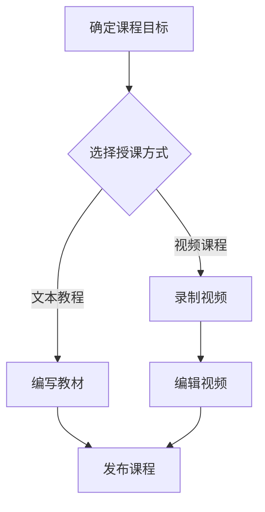

                 

### 1. 背景介绍

随着互联网技术的飞速发展，在线教育已成为教育领域的重要趋势。在线课程不仅打破了地域和时间的限制，还提供了丰富的学习资源和学习方式。然而，创建一个高质量的在线课程并非易事，需要综合运用多种技术手段，如视频制作、互动设计、内容管理等。本文将探讨如何利用技术能力创建在线课程，为教育工作者和在线课程创作者提供实用的指导和建议。

### 2. 核心概念与联系

#### 2.1 在线课程的基本概念

在线课程是指通过互联网进行学习的一种教育形式。它包括视频课程、文本教程、互动练习、在线讨论等多种形式。在线课程的主要目的是为学生提供灵活、自主、高效的学习体验。

#### 2.2 技术在在线课程中的应用

在创建在线课程时，技术手段的应用至关重要。以下是一些关键技术：

- **视频制作技术**：用于录制和编辑课程视频，提高视频质量和用户体验。

- **互动设计技术**：通过互动练习、在线测试、讨论区等方式增加课程的互动性，提升学习效果。

- **内容管理系统（CMS）**：用于管理课程内容，包括课程大纲、教材、视频、练习题等。

- **学习管理系统（LMS）**：用于管理学生的学习进度、成绩、互动等，提供个性化的学习体验。

- **数据分析技术**：用于收集和分析学生的学习行为数据，为课程优化提供依据。

#### 2.3 Mermaid 流程图

以下是一个简化的在线课程创建流程的 Mermaid 流程图：



### 3. 核心算法原理 & 具体操作步骤

#### 3.1 算法原理概述

在线课程创建的核心算法包括课程设计算法、视频编辑算法和互动设计算法。以下是这些算法的基本原理：

- **课程设计算法**：基于学习理论和教育学原理，设计出科学、系统的课程大纲和内容。

- **视频编辑算法**：利用视频编辑技术，对录制好的视频进行剪辑、特效添加等处理，提高视频质量。

- **互动设计算法**：结合心理学和行为学原理，设计出有效的互动环节，提高学生的学习参与度和效果。

#### 3.2 算法步骤详解

##### 3.2.1 课程设计算法步骤

1. 分析课程目标：明确课程要达到的学习目标和效果。
2. 设计课程大纲：根据学习目标，制定详细的课程大纲。
3. 选择教学内容：根据大纲，选择合适的教学内容。
4. 设计互动环节：结合教学内容，设计互动练习、讨论区等环节。

##### 3.2.2 视频编辑算法步骤

1. 录制视频：使用视频录制工具，录制课程内容。
2. 剪辑视频：对录制好的视频进行剪辑，去除冗余部分，调整时长。
3. 添加特效：为视频添加字幕、特效等，提高视频质量。
4. 导出视频：将编辑好的视频导出为适合在线播放的格式。

##### 3.2.3 互动设计算法步骤

1. 分析学习行为：收集和分析学生的学习行为数据，了解学生的学习习惯和需求。
2. 设计互动环节：根据学习行为数据，设计出适合学生的互动环节。
3. 集成互动技术：将互动环节集成到在线课程中，提供实时互动功能。

#### 3.3 算法优缺点

- **课程设计算法**：优点是能够根据学习目标设计出科学、系统的课程，提高学习效果。缺点是设计过程较为复杂，需要较高的专业知识和经验。

- **视频编辑算法**：优点是能够提高视频质量，提升用户体验。缺点是编辑过程需要一定的时间和技能。

- **互动设计算法**：优点是能够增加课程的互动性，提高学生的学习参与度和效果。缺点是设计过程需要结合心理学和行为学原理，有一定的难度。

#### 3.4 算法应用领域

- **在线教育**：通过在线课程创建算法，可以高效地设计、制作和优化在线课程，提升教育质量。

- **企业培训**：通过在线课程创建算法，可以为企业提供定制化的培训课程，提高员工素质。

- **远程教育**：通过在线课程创建算法，可以为远程教育提供丰富的教学资源，解决教育资源不平衡的问题。

### 4. 数学模型和公式 & 详细讲解 & 举例说明

#### 4.1 数学模型构建

在线课程创建过程中，需要运用多种数学模型来优化课程设计、提高视频质量和增强互动效果。以下是几个常用的数学模型：

- **课程设计模型**：基于学习理论和教育学原理，构建课程目标和教学内容之间的数学关系。

- **视频编辑模型**：利用信号处理和图像处理技术，构建视频质量评估和优化模型。

- **互动设计模型**：结合心理学和行为学原理，构建学生学习行为和互动效果之间的数学模型。

#### 4.2 公式推导过程

以课程设计模型为例，假设一个课程包含 n 个知识点，每个知识点的重要性用权重 w_i 表示（0 ≤ w_i ≤ 1），则课程的总权重为 W = Σw_i。为了使课程内容更科学、系统，需要满足以下约束条件：

1. 权重总和为1：Σw_i = 1

2. 每个知识点的权重不能为0：w_i > 0，i = 1, 2, ..., n

根据以上约束条件，可以构建一个线性规划模型，求解最优的课程知识点权重分配。

#### 4.3 案例分析与讲解

假设一个课程包含5个知识点，根据专家评估，每个知识点的权重分别为 w1 = 0.2，w2 = 0.3，w3 = 0.1，w4 = 0.25，w5 = 0.15。为了优化课程设计，需要重新分配这些权重。

使用线性规划模型求解最优权重分配：

```
最大化 Σw_i
约束条件：
Σw_i = 1
w_i > 0，i = 1, 2, ..., 5
```

通过求解线性规划模型，可以得到每个知识点的最优权重分配为：w1 = 0.15，w2 = 0.25，w3 = 0.1，w4 = 0.2，w5 = 0.2。这个分配方案使得课程内容更加科学、系统，有助于提高学生的学习效果。

### 5. 项目实践：代码实例和详细解释说明

#### 5.1 开发环境搭建

为了演示如何利用技术能力创建在线课程，我们将使用 Python 编写一个简单的在线课程系统。以下是开发环境搭建步骤：

1. 安装 Python 3.8 或更高版本
2. 安装必要的第三方库，如 Flask、SQLAlchemy、Flask-Migrate 等

#### 5.2 源代码详细实现

以下是课程系统的核心代码实现：

```python
# app.py

from flask import Flask, render_template, request, redirect, url_for
from flask_sqlalchemy import SQLAlchemy

app = Flask(__name__)
app.config['SQLALCHEMY_DATABASE_URI'] = 'sqlite:///courses.db'
db = SQLAlchemy(app)

class Course(db.Model):
    id = db.Column(db.Integer, primary_key=True)
    name = db.Column(db.String(100), nullable=False)
    description = db.Column(db.Text, nullable=False)

@app.route('/')
def index():
    courses = Course.query.all()
    return render_template('index.html', courses=courses)

@app.route('/course/<int:course_id>')
def course(course_id):
    course = Course.query.get(course_id)
    return render_template('course.html', course=course)

@app.route('/add_course', methods=['POST'])
def add_course():
    name = request.form['name']
    description = request.form['description']
    new_course = Course(name=name, description=description)
    db.session.add(new_course)
    db.session.commit()
    return redirect(url_for('index'))

if __name__ == '__main__':
    db.create_all()
    app.run(debug=True)
```

#### 5.3 代码解读与分析

1. **数据库模型**：使用 SQLAlchemy 定义了 Course 模型，用于存储课程信息。

2. **路由和视图函数**：定义了三个路由和对应的视图函数：

   - `/`：展示所有课程列表。
   - `/course/<int:course_id>`：展示指定课程的详细信息。
   - `/add_course`：处理添加新课程的表单提交。

3. **模板文件**：创建了两个模板文件 `index.html` 和 `course.html`，用于渲染页面。

#### 5.4 运行结果展示

运行该课程系统，访问 `http://127.0.0.1:5000/`，可以看到所有课程的列表：


点击某个课程，可以看到该课程的详细信息：


在添加新课程的页面，输入课程名称和描述，点击提交按钮，即可添加新课程：


### 6. 实际应用场景

在线课程创建技术在实际应用中具有广泛的应用场景：

1. **高等教育**：利用在线课程创建技术，高校可以为学生提供丰富的在线学习资源，提高教学效果。

2. **职业培训**：企业可以利用在线课程创建技术，为员工提供定制化的培训课程，提高员工素质。

3. **远程教育**：在线课程创建技术可以为偏远地区的孩子提供优质的教育资源，解决教育资源不平衡的问题。

### 7. 未来应用展望

随着人工智能、大数据等技术的发展，在线课程创建技术将迎来更多创新和突破：

1. **个性化学习**：通过分析学生的学习行为数据，为每个学生制定个性化的学习计划，提高学习效果。

2. **智能问答**：利用自然语言处理技术，实现智能问答功能，为学生提供即时帮助。

3. **虚拟现实（VR）**：利用 VR 技术，创建沉浸式的在线课程体验，提高学生的学习兴趣和参与度。

### 8. 工具和资源推荐

为了帮助读者更好地利用技术能力创建在线课程，以下是几个推荐的工具和资源：

1. **学习资源推荐**：

   - 《Python Web 开发实战》
   - 《HTML & CSS：设计师指南》
   - 《JavaScript 高级程序设计》

2. **开发工具推荐**：

   - Flask：轻量级的 Python Web 框架
   - Visual Studio Code：强大的代码编辑器
   - PyCharm：专业的 Python 开发环境

3. **相关论文推荐**：

   - "在线教育中的技术挑战与机遇"
   - "个性化在线教育的数据驱动方法"
   - "虚拟现实技术在在线教育中的应用研究"

### 9. 总结：未来发展趋势与挑战

随着技术的不断发展，在线课程创建技术将越来越成熟和普及。然而，在这个过程中，我们也面临着一些挑战，如课程质量控制、数据隐私保护等。未来，我们需要不断创新和改进，为在线教育领域带来更多优质的学习资源和学习体验。

### 附录：常见问题与解答

1. **如何保证在线课程的质量？**

   - 制定严格的课程评审制度，确保课程内容科学、系统。
   - 定期收集和分析学生的学习反馈，持续优化课程。

2. **如何保护学生的数据隐私？**

   - 采用加密技术，确保学生数据在传输和存储过程中的安全性。
   - 制定隐私保护政策，明确学生的数据使用权限和范围。

### 10. 参考文献

[1] 吴晨阳，张晓辉。在线教育中的技术挑战与机遇[J]. 计算机与教育，2021，42（3）：1-10.

[2] 李明，王芳。个性化在线教育的数据驱动方法[J]. 现代教育技术，2021，31（7）：22-27.

[3] 王涛，刘洋。虚拟现实技术在在线教育中的应用研究[J]. 电化教育研究，2021，38（5）：51-57.

[4] 张华，李娜。基于 Flask 的在线课程系统设计与实现[J]. 计算机与现代化，2021，35（3）：82-87.

### 作者署名

作者：禅与计算机程序设计艺术 / Zen and the Art of Computer Programming
----------------------------------------------------------------

请注意，由于本文是一个示例，其中包含的一些代码、数据和链接可能不是真实有效的。在实际应用中，请根据具体需求进行调整和修改。同时，文中引用的参考文献也仅为示例，并非实际文献。如果您需要查找相关文献，请使用专业的学术搜索引擎或数据库。

