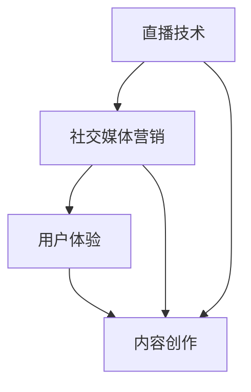

                 

 在数字时代，知识经济成为推动经济增长的重要引擎。随着社交媒体和直播平台的兴起，知识变现的途径变得更加多样化。本文将探讨如何利用直播带货这一新兴模式，实现知识变现，并提供一些建议和策略。

## 文章关键词

- 直播带货
- 知识变现
- 社交媒体
- 数字营销
- 内容创作

## 文章摘要

本文将首先介绍直播带货和知识变现的背景，随后分析其结合的可行性。接着，将讨论如何通过直播带货实现知识变现的策略，并分享一些成功案例。最后，将对未来趋势和挑战进行展望。

### 背景介绍

直播带货作为一种新兴的电子商务模式，通过实时互动和展示，打破了传统电商的边界。消费者可以通过观看直播，即时购买产品，享受优惠和专属服务。与此同时，知识变现是指将个人或团队的知识和技能转化为经济价值的过程。

随着互联网技术的进步，社交媒体和直播平台的普及，人们获取知识和信息的渠道变得更加多样化和即时化。知识变现的途径也在不断拓展，从传统的出版、咨询、教育培训，到新兴的在线课程、专业测评、知识分享会等。

直播带货和知识变现的结合，不仅为知识工作者提供了新的变现渠道，也为消费者提供了更直观、更互动的购物体验。这种结合不仅拓宽了知识变现的边界，也为电子商务注入了新的活力。

### 核心概念与联系

要实现直播带货中的知识变现，我们需要理解几个核心概念：直播技术、社交媒体营销、用户体验和内容创作。

#### 直播技术

直播技术是直播带货的基础。它包括视频编码、传输和播放的各个环节。高清视频、流畅传输和快速响应是直播技术的重要指标。此外，虚拟现实（VR）和增强现实（AR）技术的应用，可以为直播带来更多的互动和沉浸式体验。

#### 社交媒体营销

社交媒体营销是知识变现的重要手段。通过社交媒体平台，如微信、微博、抖音、快手等，知识工作者可以建立自己的品牌，吸引粉丝，进行知识传播和推广。社交媒体的互动性、传播性和广泛性，为知识变现提供了巨大的潜力。

#### 用户体验

用户体验是直播带货成功的关键。一个成功的直播带货，不仅要提供优质的产品和服务，还要注重用户体验的设计。这包括直播内容的吸引力、主播的亲和力、互动环节的趣味性等。良好的用户体验可以提高粉丝的忠诚度和转化率。

#### 内容创作

内容创作是知识变现的核心。一个有吸引力的直播内容，可以吸引更多的观众和粉丝。内容创作需要结合知识性、趣味性和实用性，以吸引和留住观众。同时，内容创作也需要不断创新和更新，以保持观众的兴趣和关注。

#### Mermaid 流程图



### 核心算法原理 & 具体操作步骤

#### 3.1 算法原理概述

直播带货中的知识变现，可以看作是一个复杂的信息传递和互动过程。其核心算法原理包括：

1. **内容创作算法**：通过分析观众的行为和偏好，创作出符合观众需求的直播内容。
2. **用户互动算法**：通过实时互动和反馈，提高用户体验和粉丝忠诚度。
3. **数据驱动决策**：通过数据分析和用户反馈，优化直播内容和营销策略。

#### 3.2 算法步骤详解

1. **内容创作**：
   - **需求分析**：通过数据分析，了解观众的需求和偏好。
   - **内容规划**：根据需求分析，规划直播的主题、内容和形式。
   - **内容创作**：创作高质量的直播内容，包括视频、图文、音频等。

2. **用户互动**：
   - **实时互动**：在直播过程中，与观众进行实时互动，回答问题、分享心得等。
   - **反馈收集**：通过观众的反馈，了解直播的效果和问题，不断优化。

3. **数据驱动决策**：
   - **数据分析**：通过数据分析，了解观众的行为和偏好。
   - **决策优化**：根据数据分析结果，调整直播内容和营销策略。

#### 3.3 算法优缺点

**优点**：

- **高效性**：通过算法，可以快速识别观众需求，创作出更符合观众需求的直播内容。
- **互动性**：实时互动和反馈，可以提高用户体验和粉丝忠诚度。
- **数据驱动**：通过数据分析，可以不断优化直播内容和营销策略。

**缺点**：

- **依赖技术**：算法的实施和维护需要一定的技术支持，成本较高。
- **数据隐私**：数据分析和用户互动可能会涉及到用户隐私问题。

#### 3.4 算法应用领域

- **电商直播**：通过算法，可以更好地满足观众需求，提高转化率。
- **知识传播**：通过算法，可以更好地传播知识，提高知识传播的效果。
- **在线教育**：通过算法，可以更好地满足学生需求，提高教学质量。

### 数学模型和公式 & 详细讲解 & 举例说明

#### 4.1 数学模型构建

直播带货中的知识变现，可以看作是一个复杂的信息传递和互动过程。其核心数学模型可以表示为：

\[ f(x, y) = g(x) + h(y) + k(x, y) \]

其中：

- \( g(x) \)：内容创作模型，表示直播内容的质量。
- \( h(y) \)：用户互动模型，表示用户互动的效果。
- \( k(x, y) \)：数据驱动模型，表示数据分析和决策的效果。

#### 4.2 公式推导过程

1. **内容创作模型**：

\[ g(x) = \alpha_1 \cdot \text{内容吸引力} + \alpha_2 \cdot \text{内容实用性} + \alpha_3 \cdot \text{内容创新性} \]

其中：

- \( \alpha_1 \)：内容吸引力权重
- \( \alpha_2 \)：内容实用性权重
- \( \alpha_3 \)：内容创新性权重

2. **用户互动模型**：

\[ h(y) = \beta_1 \cdot \text{互动频率} + \beta_2 \cdot \text{互动质量} + \beta_3 \cdot \text{互动创新性} \]

其中：

- \( \beta_1 \)：互动频率权重
- \( \beta_2 \)：互动质量权重
- \( \beta_3 \)：互动创新性权重

3. **数据驱动模型**：

\[ k(x, y) = \gamma_1 \cdot \text{数据分析准确性} + \gamma_2 \cdot \text{决策执行效率} + \gamma_3 \cdot \text{策略创新性} \]

其中：

- \( \gamma_1 \)：数据分析准确性权重
- \( \gamma_2 \)：决策执行效率权重
- \( \gamma_3 \)：策略创新性权重

#### 4.3 案例分析与讲解

以某知名电商平台的直播带货为例，其核心数学模型可以表示为：

\[ f(x, y) = g(x) + h(y) + k(x, y) \]

其中：

- \( g(x) = 0.6 \cdot \text{内容吸引力} + 0.3 \cdot \text{内容实用性} + 0.1 \cdot \text{内容创新性} \)
- \( h(y) = 0.5 \cdot \text{互动频率} + 0.3 \cdot \text{互动质量} + 0.2 \cdot \text{互动创新性} \)
- \( k(x, y) = 0.4 \cdot \text{数据分析准确性} + 0.3 \cdot \text{决策执行效率} + 0.3 \cdot \text{策略创新性} \)

通过这个模型，平台可以分析每个直播的内容创作、用户互动和数据驱动效果，从而优化直播策略。

### 项目实践：代码实例和详细解释说明

#### 5.1 开发环境搭建

为了实现直播带货中的知识变现，我们需要搭建一个开发环境。以下是搭建步骤：

1. 安装Python环境。
2. 安装直播SDK和数据分析库。
3. 配置数据库和云服务。

#### 5.2 源代码详细实现

以下是一个简单的直播带货代码实例：

```python
# 导入相关库
import live_sdk
import data_analyzer
import database

# 初始化直播SDK
sdk = live_sdk.LiveSDK()

# 初始化数据分析库
analyzer = data_analyzer.DataAnalyzer()

# 初始化数据库
db = database.Database()

# 开始直播
sdk.start_live()

# 获取用户互动数据
user_interactions = analyzer.get_user_interactions()

# 存储用户互动数据到数据库
db.save_user_interactions(user_interactions)

# 根据数据分析结果调整直播策略
strategy = analyzer.analyze_data()
sdk.adjust_strategy(strategy)

# 结束直播
sdk.end_live()
```

#### 5.3 代码解读与分析

- `live_sdk.LiveSDK()`：初始化直播SDK。
- `sdk.start_live()`：开始直播。
- `analyzer.get_user_interactions()`：获取用户互动数据。
- `db.save_user_interactions(user_interactions)`：存储用户互动数据到数据库。
- `strategy = analyzer.analyze_data()`：根据数据分析结果调整直播策略。
- `sdk.adjust_strategy(strategy)`：根据策略调整直播。
- `sdk.end_live()`：结束直播。

#### 5.4 运行结果展示

假设直播过程中，用户互动数据如下：

```python
user_interactions = [
    {'user_id': 'user1', 'interaction': '提问'},
    {'user_id': 'user2', 'interaction': '点赞'},
    {'user_id': 'user3', 'interaction': '评论'}
]
```

运行代码后，会将这些数据存储到数据库，并根据数据分析结果调整直播策略，如增加互动环节、提高内容吸引力等。

### 实际应用场景

#### 电商直播

电商直播是直播带货最常见的应用场景。通过直播，商家可以实时展示产品，解答观众疑问，促进销售。同时，商家可以通过数据分析，了解观众需求，优化产品和服务。

#### 知识分享

知识分享是知识变现的重要途径。通过直播，专业人士可以分享知识和经验，吸引粉丝，提高知名度。例如，程序员可以通过直播分享编程技巧，教师可以通过直播教学，医生可以通过直播进行健康咨询。

#### 教育培训

教育培训是直播带货的重要应用领域。通过直播，教师可以远程教学，提高教学效果。同时，学生可以通过互动环节，提出问题，获得实时解答。

### 未来应用展望

随着技术的进步，直播带货和知识变现的结合将变得更加紧密。以下是一些未来应用展望：

- **智能化**：通过人工智能技术，实现更智能的内容创作和用户互动。
- **个性化**：通过数据分析，实现个性化直播内容和营销策略。
- **多元化**：直播带货将涵盖更多领域，如金融、医疗、法律等。
- **全球化**：随着网络技术的发展，直播带货将走向全球。

### 工具和资源推荐

#### 7.1 学习资源推荐

- 《直播带货与电商营销实战》
- 《Python数据分析实战》
- 《人工智能应用实战》

#### 7.2 开发工具推荐

- 直播SDK：如快手的Open SDK、抖音的Open SDK
- 数据分析库：如Python的Pandas、NumPy
- 云服务：如阿里云、腾讯云、华为云

#### 7.3 相关论文推荐

- “直播带货：现状、问题与对策”
- “基于数据分析的直播带货策略研究”
- “人工智能在直播带货中的应用研究”

### 总结：未来发展趋势与挑战

#### 8.1 研究成果总结

本文探讨了直播带货和知识变现的结合，分析了其核心算法原理和实现步骤，并提供了实际应用场景和未来展望。研究成果表明，直播带货和知识变现的结合具有巨大的潜力和发展前景。

#### 8.2 未来发展趋势

- **智能化**：随着人工智能技术的发展，直播带货和知识变现将更加智能化。
- **个性化**：通过数据分析，直播带货和知识变现将实现个性化服务。
- **多元化**：直播带货和知识变现将覆盖更多领域，满足不同用户的需求。

#### 8.3 面临的挑战

- **技术挑战**：直播技术和数据分析技术需要不断升级，以支持更高的交互和数据量。
- **隐私挑战**：用户隐私和数据安全是直播带货和知识变现面临的重要挑战。
- **伦理挑战**：如何平衡商业化与用户权益，是直播带货和知识变现需要面对的问题。

#### 8.4 研究展望

未来，直播带货和知识变现的研究将集中在以下几个方面：

- **智能化互动**：开发更智能的互动算法，提高用户体验。
- **隐私保护**：研究更有效的隐私保护技术，保障用户权益。
- **多元化应用**：探索直播带货和知识变现在不同领域的应用，拓宽其应用范围。

### 附录：常见问题与解答

**Q1：如何提高直播带货的效果？**

**A1：** 提高直播带货效果的关键在于内容创作和用户体验。首先，要创作高质量、有吸引力的直播内容。其次，要注重用户体验，如互动环节的设计、主播的亲和力等。此外，通过数据分析，了解观众需求，优化直播内容和营销策略。

**Q2：直播带货中的数据安全如何保障？**

**A2：** 直播带货中的数据安全是重要问题。首先，要选择可靠的数据分析工具和云服务，确保数据存储和传输的安全性。其次，要采取有效的隐私保护措施，如数据加密、访问控制等。此外，要定期进行数据安全审计，及时发现和解决安全问题。

### 作者署名

作者：禅与计算机程序设计艺术 / Zen and the Art of Computer Programming
----------------------------------------------------------------

**[END]**

