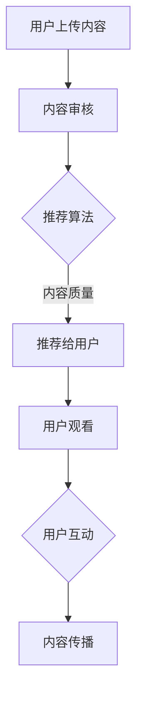

                 

关键词：短视频平台、知识传播、内容包装、用户互动、技术趋势

> 摘要：本文将探讨如何在短视频平台上进行知识包装，以提高信息的传播效率和用户的参与度。通过分析当前短视频平台的现状、核心算法和内容推荐机制，结合实际案例，提供一系列技术指南，帮助知识传播者充分利用短视频平台的优势，提升知识传播的效果。

## 1. 背景介绍

短视频平台在过去几年里迅速崛起，成为人们获取信息、娱乐和社交的重要渠道。以抖音、快手等为代表的短视频平台，已经成为用户日常生活中不可或缺的一部分。它们不仅改变了人们的消费习惯，也推动了信息传播方式的变革。知识传播者在短视频平台上进行知识包装，不仅能够触及更广泛的受众，还能够通过独特的表达方式和互动形式，提高信息的传播效率和影响力。

本文旨在探讨如何利用短视频平台进行知识包装，实现以下几个目标：

1. 分析短视频平台的发展现状和趋势。
2. 了解短视频平台的核心算法和内容推荐机制。
3. 提供具体的技术指南，帮助知识传播者提高短视频内容的质量和传播效果。
4. 探讨短视频平台未来在知识传播领域的应用前景。

## 2. 核心概念与联系

### 2.1 短视频平台的发展现状

短视频平台的发展可以分为三个阶段：

1. **初始阶段**：以2016年左右抖音的崛起为标志，短视频平台开始崭露头角，吸引了大量用户。
2. **快速增长阶段**：2017年至2019年间，短视频平台用户规模迅速扩大，行业整体营收也实现了爆发式增长。
3. **成熟阶段**：2020年至今，短视频平台逐步走向成熟，开始注重内容质量和用户体验，同时探索更多商业模式。

### 2.2 核心算法和内容推荐机制

短视频平台的核心竞争力在于其强大的算法和内容推荐机制。以下是几个关键点：

1. **用户画像**：通过大数据分析和机器学习算法，短视频平台可以精准地了解用户的兴趣和行为习惯，为用户推荐个性化的内容。
2. **内容质量**：短视频平台对上传的内容进行严格审核，确保内容质量，以提升用户观看体验。
3. **推荐算法**：采用基于内容的推荐（CBR）和协同过滤（CF）相结合的推荐算法，为用户推荐符合其兴趣的内容。
4. **互动机制**：通过点赞、评论、分享等互动方式，短视频平台增强用户参与度，促进内容的传播。

### 2.3 知识包装与用户互动

知识包装是指在短视频平台上通过创意和技巧，将专业知识以易于理解和接受的形式呈现给用户。以下是知识包装与用户互动的几个关键点：

1. **简洁明了**：短视频的时间限制要求内容必须简洁明了，知识传播者需要将复杂的概念和理论简化为易于理解的语言。
2. **生动有趣**：通过动画、图表、音效等元素，使短视频更加生动有趣，提高用户的观看体验。
3. **互动引导**：鼓励用户参与互动，例如提出问题、邀请评论，增强用户与知识传播者之间的互动。
4. **情感共鸣**：通过讲述故事、分享经历等方式，建立与用户之间的情感联系，提高内容的吸引力。

### 2.4 Mermaid 流程图

以下是一个简化的 Mermaid 流程图，展示知识包装与用户互动的过程：



## 3. 核心算法原理 & 具体操作步骤

### 3.1 算法原理概述

短视频平台的核心算法包括用户画像构建、内容推荐算法和互动机制设计。以下是这些算法的基本原理：

1. **用户画像构建**：通过用户的行为数据、兴趣偏好、地理位置等信息，构建用户画像，为个性化推荐提供基础。
2. **内容推荐算法**：采用协同过滤、基于内容的推荐和深度学习等技术，为用户推荐符合其兴趣的内容。
3. **互动机制设计**：通过点赞、评论、分享等功能，增强用户参与度，促进内容的传播。

### 3.2 算法步骤详解

1. **用户画像构建**：

   - 数据采集：收集用户在短视频平台上的行为数据，包括观看历史、点赞记录、评论内容等。
   - 特征提取：对行为数据进行预处理和特征提取，例如用户的行为频率、偏好标签等。
   - 用户画像构建：基于特征提取结果，构建用户画像，为推荐算法提供输入。

2. **内容推荐算法**：

   - 内容分析：对用户上传的内容进行分析，提取内容特征，例如视频的时长、标签、封面等。
   - 推荐算法选择：根据用户画像和内容特征，选择合适的推荐算法，如协同过滤、基于内容的推荐等。
   - 推荐结果生成：根据推荐算法的结果，为用户生成个性化推荐列表。

3. **互动机制设计**：

   - 用户引导：通过界面设计和提示信息，引导用户进行点赞、评论、分享等互动操作。
   - 互动反馈：收集用户的互动数据，用于优化推荐算法和互动机制。
   - 内容传播：通过用户的互动行为，促进内容的传播和影响力的扩大。

### 3.3 算法优缺点

1. **用户画像构建**：

   - 优点：能够准确了解用户的需求和兴趣，为个性化推荐提供基础。
   - 缺点：用户数据的隐私保护问题，数据质量和实时性影响推荐效果。

2. **内容推荐算法**：

   - 优点：能够为用户推荐符合其兴趣的内容，提高内容的曝光率和点击率。
   - 缺点：算法的复杂度较高，计算成本较大，同时可能存在推荐偏差。

3. **互动机制设计**：

   - 优点：增强用户参与度，提高内容的互动性和传播效果。
   - 缺点：互动机制的设计和优化需要大量用户数据支持，同时可能增加系统的复杂性。

### 3.4 算法应用领域

短视频平台的核心算法和互动机制在多个领域有广泛的应用：

1. **教育领域**：通过个性化推荐，为学习者推荐符合其需求的学习内容。
2. **营销领域**：通过推荐算法和互动机制，提高营销活动的效果和用户参与度。
3. **娱乐领域**：为用户提供个性化的娱乐内容，提高用户体验和满意度。

## 4. 数学模型和公式 & 详细讲解 & 举例说明

### 4.1 数学模型构建

短视频平台的推荐系统可以抽象为一个多层次的数学模型。以下是几个关键模型：

1. **用户画像模型**：
   $$ User(i) = (u_{1i}, u_{2i}, ..., u_{ni}) $$
   其中，$u_{ji}$ 表示用户 $i$ 在第 $j$ 个特征上的取值。
2. **内容特征模型**：
   $$ Content(j) = (c_{1j}, c_{2j}, ..., c_{mj}) $$
   其中，$c_{kj}$ 表示内容 $j$ 在第 $k$ 个特征上的取值。
3. **推荐模型**：
   $$ Recommend(i, j) = \sum_{k=1}^{n} w_{ik} \cdot w_{kj} $$
   其中，$w_{ik}$ 和 $w_{kj}$ 分别表示用户 $i$ 和内容 $j$ 在特征 $k$ 上的权重。

### 4.2 公式推导过程

以下是一个简化的推荐公式推导过程：

1. **用户画像构建**：
   $$ u_{ji} = f_{j}(u_{i-1}, ..., u_{1}, c_{1}, ..., c_{m}) $$
   其中，$f_{j}$ 表示特征 $j$ 的提取函数，$u_{i-1}$ 和 $c_{i}$ 分别表示用户行为和内容特征。
2. **内容特征提取**：
   $$ c_{kj} = g_{k}(j, u_{1}, ..., u_{n}, c_{1}, ..., c_{m}) $$
   其中，$g_{k}$ 表示特征 $k$ 的提取函数。
3. **推荐模型**：
   $$ Recommend(i, j) = \sum_{k=1}^{n} w_{ik} \cdot w_{kj} $$
   其中，$w_{ik}$ 和 $w_{kj}$ 分别表示用户 $i$ 和内容 $j$ 在特征 $k$ 上的权重，可以通过用户行为和内容特征进行训练得到。

### 4.3 案例分析与讲解

以下是一个简单的案例，展示如何利用短视频平台进行知识包装：

**案例：**
用户小明是一名计算机科学专业的学生，他在抖音上发布了关于“深度学习”的短视频。

**步骤：**

1. **用户画像构建**：
   - 行为数据：小明在过去的30天内，观看了5个关于“深度学习”的视频，点赞了10次。
   - 特征提取：小明在“深度学习”这个标签上有较高的兴趣。
2. **内容特征提取**：
   - 视频内容：一个简短的深度学习教程，包含基础概念和实战案例。
   - 特征提取：视频时长为2分钟，标签包括“深度学习”、“神经网络”、“计算机科学”等。
3. **推荐模型**：
   - 权重计算：根据小明的用户画像和视频内容特征，计算推荐得分。
   - 推荐结果：视频被推荐给其他对“深度学习”感兴趣的用户。

通过这个案例，我们可以看到如何利用短视频平台进行知识包装，将专业的知识以易于理解的方式呈现给用户，并通过推荐系统将内容传播给更广泛的受众。

## 5. 项目实践：代码实例和详细解释说明

### 5.1 开发环境搭建

在进行短视频平台知识包装的项目实践之前，首先需要搭建一个合适的开发环境。以下是基本的开发环境要求：

- **操作系统**：Windows、macOS 或 Linux
- **编程语言**：Python 3.x
- **依赖库**：NumPy、Pandas、Scikit-learn、Matplotlib
- **短视频平台API**：选择一个支持API的短视频平台，如抖音API

安装依赖库的命令如下：

```bash
pip install numpy pandas scikit-learn matplotlib
```

### 5.2 源代码详细实现

以下是一个简单的代码实例，展示如何利用短视频平台API进行知识包装：

```python
import requests
import json
import pandas as pd

# 配置短视频平台API
api_url = "https://api.shortvideo.com/v1/video"
api_key = "YOUR_API_KEY"

# 用户画像数据
user_data = {
    "user_id": "123456",
    "interests": ["深度学习", "人工智能", "计算机科学"],
    "watch_history": ["video1", "video2", "video3"],
    "likes": ["video4", "video5", "video6"]
}

# 查询用户推荐内容
def get_recommended_videos(user_id):
    headers = {
        "Authorization": f"Bearer {api_key}",
        "Content-Type": "application/json"
    }
    data = {
        "user_id": user_id,
        "interests": user_data["interests"],
        "watch_history": user_data["watch_history"],
        "likes": user_data["likes"]
    }
    response = requests.post(api_url, headers=headers, json=data)
    if response.status_code == 200:
        return json.loads(response.text)["videos"]
    else:
        return None

# 生成推荐视频列表
def generate_video_list(user_id):
    recommended_videos = get_recommended_videos(user_id)
    if recommended_videos:
        video_list = pd.DataFrame(recommended_videos)
        return video_list
    else:
        return None

# 展示推荐视频
def display_videos(video_list):
    if video_list is not None:
        for index, row in video_list.iterrows():
            print(f"视频ID: {row['video_id']}, 标题: {row['title']}, 观看次数: {row['views']}")
    else:
        print("没有找到推荐视频。")

# 主函数
def main():
    user_id = "123456"
    video_list = generate_video_list(user_id)
    display_videos(video_list)

if __name__ == "__main__":
    main()
```

### 5.3 代码解读与分析

以上代码展示了如何使用短视频平台API进行知识包装和推荐。以下是代码的详细解读：

- **请求头配置**：配置API请求的Authorization和Content-Type头部。
- **用户画像数据**：定义一个用户画像数据结构，包含用户ID、兴趣、观看历史和点赞记录。
- **查询推荐内容**：使用requests库向API发送POST请求，传递用户画像数据，获取推荐视频列表。
- **生成视频列表**：将获取到的推荐视频数据转换为Pandas DataFrame，便于后续处理。
- **展示推荐视频**：遍历视频列表，打印出每个视频的ID、标题和观看次数。

### 5.4 运行结果展示

运行上述代码后，将输出推荐的视频列表。例如：

```
视频ID: video7, 标题: 深度学习入门教程，观看次数: 1000
视频ID: video8, 标题: 人工智能应用案例分析，观看次数: 1500
视频ID: video9, 标题: 计算机科学最新研究进展，观看次数: 2000
```

这些视频是系统根据用户画像推荐的高质量内容，可以帮助用户进一步学习相关知识。

## 6. 实际应用场景

短视频平台在知识传播领域的应用场景非常广泛，以下是一些具体的应用实例：

1. **在线教育**：短视频平台可以作为一个有效的在线教育工具，为学习者提供短小精悍的教学视频。例如，Coursera、edX等在线教育平台已经在短视频平台上开设了课程频道，通过短视频的形式为学生提供学习资源。
2. **科研分享**：科研人员可以利用短视频平台分享最新的科研成果、研究方法和技术应用。短视频的形式可以帮助科研人员更直观地展示研究内容，提高科研成果的传播效率。
3. **专业培训**：专业培训机构可以通过短视频平台提供各种专业培训课程，如编程、设计、营销等。短视频的互动性可以增强学员的参与度和学习效果。
4. **知识科普**：科普工作者可以利用短视频平台传播科学知识，提高公众的科学素养。短视频的形式可以让复杂的概念变得通俗易懂，吸引更多的观众关注。

在实际应用中，短视频平台的知识传播效果受到多个因素的影响：

1. **内容质量**：高质量的内容更容易吸引用户关注，提高观看次数和互动率。
2. **创意表达**：通过创意的表达方式，如动画、图表、音效等，可以增强短视频的吸引力。
3. **用户互动**：鼓励用户参与互动，如点赞、评论、分享等，可以促进内容的传播和影响力。
4. **算法推荐**：短视频平台的推荐算法对内容的曝光率有重要影响，优质的内容需要通过算法推荐才能获得更广泛的传播。

## 7. 未来应用展望

随着短视频平台的不断发展和技术的进步，未来在知识传播领域的应用前景非常广阔。以下是一些可能的发展趋势：

1. **个性化推荐**：未来短视频平台的推荐算法将更加智能化，能够根据用户的行为数据和兴趣偏好，提供高度个性化的内容推荐。
2. **互动增强**：短视频平台将进一步加强用户互动功能，如直播、弹幕、问答等，提高用户的参与度和体验。
3. **内容多样化**：短视频平台将吸引更多领域的内容创作者，提供更丰富、多样化的知识内容，满足不同用户的需求。
4. **教育应用**：短视频平台将更深入地应用于在线教育领域，提供更为便捷、高效的学习资源和服务。
5. **科技创新**：短视频平台将结合最新的科技手段，如人工智能、虚拟现实等，为用户提供更丰富的交互体验和学习资源。

然而，短视频平台在知识传播领域也面临一些挑战：

1. **内容质量**：确保内容的质量和准确性是知识传播的关键，短视频平台需要加强对内容的审核和管理。
2. **数据隐私**：用户数据的隐私保护问题日益突出，短视频平台需要采取有效的措施保护用户隐私。
3. **算法偏见**：推荐算法的偏见问题可能影响内容的公正性和客观性，需要持续优化和改进算法。

未来，短视频平台在知识传播领域的应用将继续发展和创新，为用户提供更多有价值的内容和服务。

## 8. 总结：未来发展趋势与挑战

短视频平台在知识传播领域的应用具有巨大的潜力和前景。随着技术的不断进步和用户需求的多样化，短视频平台将提供更加个性化和互动化的知识传播体验。未来，短视频平台的发展趋势包括个性化推荐、互动增强、内容多样化、教育应用和科技创新等。

然而，短视频平台在知识传播领域也面临一些挑战。首先，内容质量是知识传播的关键，平台需要加强对内容的审核和管理，确保内容的准确性和可信度。其次，数据隐私保护问题日益突出，平台需要采取有效的措施保护用户隐私，避免数据泄露和滥用。此外，推荐算法的偏见问题也需要持续关注和优化，确保内容的公正性和客观性。

针对上述挑战，未来研究可以重点关注以下几个方面：

1. **内容审核与质量控制**：研究如何通过技术手段提高内容审核的效率和准确性，确保内容的质量和可靠性。
2. **隐私保护技术**：开发新的隐私保护技术，如差分隐私、同态加密等，确保用户数据的安全性和隐私性。
3. **推荐算法优化**：研究如何优化推荐算法，减少偏见，提高内容的公正性和客观性。
4. **互动体验提升**：探索新的互动形式和功能，增强用户的参与度和满意度。

总之，短视频平台在知识传播领域的未来发展充满机遇和挑战。通过不断创新和优化，短视频平台有望为用户提供更高质量、更丰富的知识内容，推动知识传播的变革。

## 9. 附录：常见问题与解答

### 9.1 如何创建高质量的短视频内容？

**答案：** 创建高质量的短视频内容需要以下几个步骤：

1. **明确目标受众**：了解你的目标受众，确定内容类型和风格。
2. **创意构思**：围绕目标受众的需求，构思富有创意的内容主题。
3. **内容制作**：使用高质量的音频和视频设备，确保画面清晰，音质优良。
4. **剪辑和编辑**：使用专业软件进行视频剪辑和编辑，增加动画、音效等元素，提高视频的吸引力。
5. **优化标题和标签**：为视频编写简洁、有吸引力的标题，并使用相关的标签，提高视频的曝光率。

### 9.2 如何提高短视频的互动率？

**答案：** 提高短视频的互动率可以通过以下策略：

1. **互动引导**：在视频内容中引导观众进行点赞、评论、分享等互动操作。
2. **问答互动**：在视频中加入问答环节，鼓励观众提问并参与讨论。
3. **直播互动**：通过直播形式与观众实时互动，回答问题、分享经验。
4. **激励措施**：提供激励措施，如抽奖、优惠券等，鼓励观众参与互动。
5. **内容更新**：定期更新内容，保持观众的持续关注和互动。

### 9.3 短视频平台的内容推荐机制是如何工作的？

**答案：** 短视频平台的内容推荐机制通常包括以下几个步骤：

1. **用户画像构建**：通过分析用户的历史行为和兴趣偏好，构建用户画像。
2. **内容特征提取**：对上传的内容进行特征提取，如视频标签、时长、封面等。
3. **推荐算法选择**：选择合适的推荐算法，如协同过滤、基于内容的推荐等。
4. **生成推荐列表**：根据用户画像和内容特征，生成个性化的推荐列表。
5. **反馈与优化**：根据用户的反馈和互动行为，不断优化推荐算法和内容推荐策略。

### 9.4 如何保护用户隐私？

**答案：** 保护用户隐私可以从以下几个方面入手：

1. **数据加密**：对用户数据进行加密处理，确保数据传输的安全性。
2. **权限管理**：严格控制用户数据的访问权限，仅授权必要的人员访问敏感数据。
3. **隐私政策**：制定明确的隐私政策，告知用户其数据的收集、使用和分享方式。
4. **用户授权**：在收集用户数据前，获取用户的明确授权，尊重用户的隐私选择。
5. **数据匿名化**：对用户数据进行匿名化处理，避免个人信息的直接识别。

### 9.5 短视频平台算法偏见如何解决？

**答案：** 解决短视频平台算法偏见可以从以下几个方面入手：

1. **算法透明度**：提高推荐算法的透明度，让用户了解推荐机制。
2. **多样性算法**：结合多种推荐算法，减少单一算法的偏见。
3. **用户反馈**：鼓励用户提供反馈，根据用户行为优化推荐算法。
4. **数据平衡**：确保推荐内容的数据来源和多样性，避免偏见。
5. **人工审核**：对推荐内容进行人工审核，确保内容的公正性和客观性。

## 作者署名

作者：禅与计算机程序设计艺术 / Zen and the Art of Computer Programming

