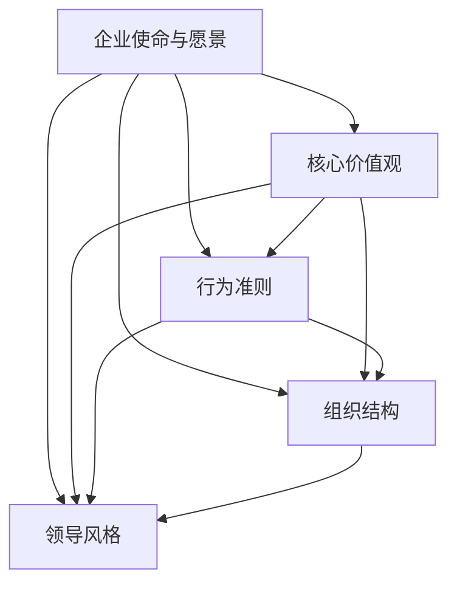
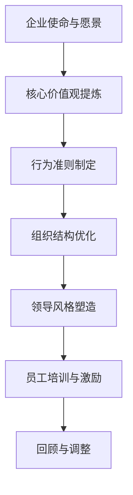

                 

## 引言

在自动化创业领域，企业文化是公司成功的基石。它不仅影响员工的日常行为和工作动力，还决定了公司如何在竞争激烈的市场中脱颖而出。随着自动化技术的快速发展，企业面临的数据量、复杂性以及协作需求日益增加，传统的管理模式已经无法满足新形势下的要求。因此，构建一个适应自动化时代的独特企业文化，对于创业公司来说显得尤为重要。

本文将探讨如何在自动化创业中建立企业文化。我们将从背景介绍、核心概念与联系、核心算法原理与具体操作步骤、数学模型和公式、项目实践、实际应用场景、工具和资源推荐以及未来发展趋势与挑战等多个方面，详细解析企业文化的构建过程。希望通过本文的分享，能为自动化创业公司在企业文化建设方面提供一些有价值的参考和启示。

## 关键词

- 自动化创业
- 企业文化
- 组织行为
- 创新驱动
- 团队协作
- 职业发展
- 持续改进

## 摘要

本文旨在探讨在自动化创业中建立企业文化的重要性及其实施策略。文章首先介绍了自动化创业的背景和企业文化的基本概念，随后详细阐述了企业文化构建的核心原理、操作步骤及优缺点，并通过数学模型和实际项目案例进一步解释了企业文化构建的方法。最后，文章讨论了企业文化在自动化创业中的实际应用场景、未来展望以及面临的挑战。希望通过本文的研究，能为自动化创业公司提供企业文化建设的实用指导。

### 背景介绍

自动化创业，即利用自动化技术实现业务流程的优化和效率提升，是当今科技领域的一个热门趋势。随着人工智能、机器学习、区块链等技术的迅猛发展，自动化创业已成为许多企业，尤其是初创公司，探索业务模式、提升竞争力的重要手段。自动化技术不仅能够显著降低人力成本，还能够提高业务处理的速度和准确性，从而为企业带来巨大的经济和战略价值。

然而，自动化创业并非一帆风顺。在快速发展的同时，企业也面临着诸多挑战，如技术迭代速度过快、市场变化无常、数据安全与隐私保护等。此外，企业文化的构建在自动化创业过程中也起着至关重要的作用。良好的企业文化可以激励员工积极参与技术创新，增强团队的凝聚力和战斗力，从而在激烈的市场竞争中占据优势。

企业文化，广义上是指企业在长期经营过程中形成的共同价值观、行为准则和工作方式。它包括企业的使命、愿景、核心价值观、行为规范等多个方面，是企业软实力的重要组成部分。在自动化创业中，企业文化的作用尤为重要。首先，它为员工提供了一个明确的价值观和行为导向，帮助他们在面对复杂和快速变化的环境时做出一致和有效的决策。其次，企业文化可以促进员工之间的沟通与合作，提高团队的整体效率和创新能力。最后，良好的企业文化有助于增强企业的品牌形象和市场竞争力，吸引更多的人才和合作伙伴。

综上所述，自动化创业不仅需要强大的技术支撑，更需要健康的企业文化来支撑和推动企业的发展。本文将从核心概念与联系、核心算法原理与具体操作步骤、数学模型和公式、项目实践、实际应用场景、工具和资源推荐等多个角度，深入探讨如何在自动化创业中建立和优化企业文化，为自动化创业公司提供有价值的参考和指导。

### 核心概念与联系

在探讨如何建立企业文化之前，我们首先需要明确一些核心概念及其相互之间的联系。以下是对这些核心概念的简要介绍，以及它们在企业文化构建过程中的作用和意义。

#### 企业使命与愿景

企业使命是企业存在的根本目的和长远目标，它为企业提供了方向和意义。企业愿景则是对企业未来状态的描绘，通常具有激励员工的作用。在企业文化建设中，明确的使命和愿景可以帮助员工理解企业的核心价值观和追求，从而在日常工作中保持一致的行动方向和价值观。使命和愿景不仅为员工提供了清晰的目标，还成为了企业文化的基石，引导企业在面对挑战时做出正确的决策。

#### 核心价值观

核心价值观是企业文化的灵魂，它代表了企业的信念和行为准则。核心价值观通常包括诚信、创新、团队合作、客户至上等。这些价值观在企业内部传播和践行，不仅能够引导员工的行为，还能够塑造企业的形象和声誉。在自动化创业中，核心价值观的重要性尤为突出，因为它能够促进团队合作、激发创新思维，并提升整体的工作效率和竞争力。

#### 行为准则

行为准则是企业对员工行为的具体规范，它包括员工的职业素养、工作态度、行为习惯等。行为准则的制定和执行是企业文化落实的重要手段，它能够确保企业的核心价值观在日常工作中得到贯彻和体现。在自动化创业中，规范明确的行为准则有助于提高团队的协作效率，降低沟通成本，并确保员工的行为与企业的目标和价值观相一致。

#### 组织结构

组织结构是企业内部各部门和职位的设置及相互关系，它决定了企业的运营效率和协作模式。在自动化创业中，灵活的组织结构能够适应快速变化的市场需求，提高企业的应变能力和创新能力。同时，合理的组织结构也有助于优化资源配置，提高工作效率，并促进团队之间的沟通与合作。

#### 领导风格

领导风格对企业文化有着深远的影响。领导者的行为和决策不仅直接影响员工的工作态度和行为，还影响着企业的整体氛围和文化。在自动化创业中，领导者需要具备前瞻性、创新性和包容性，通过自身的榜样作用和激励措施，营造积极向上的企业文化，推动企业的可持续发展。

#### 价值观与行为准则的相互关系

价值观和行为准则是企业文化中的两个重要方面，它们之间存在密切的相互关系。价值观为企业提供了精神支柱和行为指南，而行为准则则是价值观的具体体现和落实。只有在价值观的引导下，行为准则才能具有实际意义；反之，只有在行为准则的践行中，价值观才能得到真正的体现。因此，企业文化建设需要将价值观和行为准则有机结合，确保企业文化的内外一致性。

#### 组织结构与领导风格的相互关系

组织结构和领导风格也是企业文化的重要组成部分，它们相互影响、相互促进。合理的组织结构可以为领导风格提供良好的支持，使领导者能够更加有效地管理团队和资源；而领导风格则可以影响组织结构的设计和调整，使组织结构更加适应企业的发展需求。在自动化创业中，灵活的组织结构和开放、创新的领导风格能够共同推动企业文化的建设，提升企业的整体竞争力。

通过以上核心概念的介绍，我们可以看到企业文化不仅仅是企业内部的一种氛围或文化，它是由多个相互关联的要素组成的复杂系统。在自动化创业中，企业需要重视这些核心概念，并找到它们之间的平衡和协调，从而构建一个健康、积极、富有创新精神的企业文化，为企业的长期发展奠定坚实的基础。

#### Mermaid 流程图

为了更好地理解企业文化的构建过程，我们使用Mermaid语言绘制一个简化的流程图，展示各个核心概念之间的联系和作用。



在上面的流程图中：

- **企业使命与愿景** 是整个企业文化的起点，为后续的所有核心概念提供了方向和目标。
- **核心价值观** 作为企业文化的灵魂，贯穿于企业的各个方面，包括行为准则、组织结构和领导风格。
- **行为准则** 是核心价值观的具体体现，确保员工在日常工作中遵循企业的行为规范。
- **组织结构** 决定了企业的运作模式和资源配置，需要与核心价值观和行为准则相匹配。
- **领导风格** 通过领导者的行为和决策，直接影响员工的工作态度和企业文化的形成。

通过这个流程图，我们可以清晰地看到企业文化构建过程中各个核心概念之间的内在联系和相互作用，有助于我们更好地理解和实施企业文化建设的策略。

### 核心算法原理 & 具体操作步骤

在自动化创业中，建立企业文化不仅仅是一个理论问题，更是一个需要通过具体操作步骤来实现的复杂过程。核心算法原理在这个过程中起到了关键的指导作用。以下将详细阐述企业文化构建的核心算法原理，并分步骤解释其实施过程。

#### 3.1 算法原理概述

企业文化的构建是一个系统性工程，涉及多个层面的综合考量。核心算法原理主要包括以下几个方面：

1. **价值观的提炼与传播**：通过分析企业的历史、现状以及未来的发展方向，提炼出能够代表企业精神的核心价值观，并将其系统地传播到企业内部。
2. **行为准则的制定与执行**：在核心价值观的指导下，制定具体的行为准则，并确保这些准则在企业内部得到严格的执行和落实。
3. **组织结构的优化**：根据企业的核心价值观和行为准则，调整和优化组织结构，确保其能够支持企业文化的发展。
4. **领导风格的塑造**：通过领导者的行为和决策，塑造和推广企业的领导风格，使其与企业文化相一致。
5. **员工的培训与激励**：通过系统的培训机制和激励措施，培养员工的价值观和行为习惯，使他们能够主动支持和践行企业文化。

#### 3.2 算法步骤详解

1. **价值观的提炼与传播**：

   - **历史与现状分析**：首先，企业需要对自身的过去和现状进行深入分析，了解企业的发展历程、核心竞争力以及存在的不足。
   - **未来展望与目标设定**：基于历史和现状分析，企业需要设定明确的发展目标，并展望未来可能面临的机遇和挑战。
   - **核心价值观提炼**：通过集体讨论和专家咨询，提炼出能够代表企业精神的核心价值观。这些价值观应具有普遍性和持久性，能够跨越不同的时代和情境。
   - **传播与共识形成**：通过内部宣传、培训和员工参与等方式，将核心价值观传播到企业的每一个角落，并形成广泛的共识。

2. **行为准则的制定与执行**：

   - **行为准则制定**：在核心价值观的指导下，制定具体的行为准则，包括员工职业素养、工作态度、行为习惯等方面。
   - **内部沟通与反馈**：将行为准则公布于众，并收集员工的反馈意见，通过不断调整和优化，确保准则的可行性和适用性。
   - **行为准则执行**：通过绩效考核、奖惩机制等手段，确保行为准则在企业内部得到严格的执行。

3. **组织结构的优化**：

   - **现状评估**：对现有的组织结构进行评估，分析其优缺点以及与核心价值观和行为准则的匹配度。
   - **结构调整**：根据评估结果，调整组织结构，使之更加符合企业的核心价值观和行为准则，提高组织运作效率。
   - **流程优化**：对业务流程进行重新设计，确保其能够支持企业文化的发展。

4. **领导风格的塑造**：

   - **领导者培养**：通过培训、轮岗等方式，培养领导者的价值观和领导能力，确保其能够践行企业的核心价值观。
   - **领导行为监督**：建立领导行为监督机制，对领导者的行为进行定期评估，确保其行为与企业文化相一致。
   - **领导风格推广**：通过领导者的榜样作用和宣传推广，将企业的领导风格传播到整个组织。

5. **员工的培训与激励**：

   - **价值观培训**：定期对员工进行价值观培训，强化其对企业文化的认同感和责任感。
   - **行为规范培训**：针对具体的行为准则，对员工进行行为规范培训，提高其遵守行为准则的意识和能力。
   - **激励机制**：建立科学合理的激励机制，通过奖励和表彰，激励员工践行企业文化，提升整体团队凝聚力。

#### 3.3 算法优缺点

**优点**：

- **系统性**：通过明确的算法步骤，企业文化的构建过程更加系统化和规范化，避免了随意性和主观性。
- **可操作性**：算法提供了详细的操作步骤，使企业能够在实际操作中逐步实施和优化企业文化。
- **可持续性**：通过价值观的提炼和传播、行为准则的制定与执行、组织结构的优化、领导风格的塑造等环节，企业文化得以在企业中长期坚持和传承。

**缺点**：

- **实施难度**：企业文化的构建需要长时间的积累和持续的投入，实施过程中可能会遇到各种困难和挑战。
- **适应性**：算法虽然提供了系统性的指导，但不同的企业具有不同的特点和需求，需要根据实际情况进行适当的调整和优化。

#### 3.4 算法应用领域

**应用领域**：

- **初创企业**：对于初创企业，企业文化尚未形成，通过核心算法原理，可以帮助企业快速构建和优化企业文化，提升竞争力。
- **转型企业**：对于正在进行战略转型的企业，通过核心算法原理，可以帮助其调整和优化企业文化，以适应新的发展需求。
- **成熟企业**：对于已经成熟的企业，通过核心算法原理，可以帮助其持续优化企业文化，保持企业的活力和创新能力。

#### Mermaid 流程图



在上面的流程图中：

- **企业使命与愿景** 为后续的所有步骤提供了方向和目标。
- **核心价值观提炼** 是企业文化构建的基础，为后续的行为准则、组织结构等提供了指导。
- **行为准则制定** 确保员工在企业内部遵循一致的行为规范。
- **组织结构优化** 确保组织结构支持企业文化的发展。
- **领导风格塑造** 通过领导者的行为和决策，推广企业的领导风格。
- **员工培训与激励** 培养员工的价值观和行为习惯，确保企业文化在企业内部得到有效落实。
- **回顾与调整** 通过定期回顾和调整，确保企业文化的持续优化和改进。

通过上述核心算法原理和具体操作步骤的详细阐述，我们可以看到企业文化构建是一个复杂而系统的过程，需要企业在各个层面进行综合考量和实践。希望这些内容能够为自动化创业公司在企业文化建设中提供有价值的参考和指导。

### 数学模型和公式

在企业文化的构建过程中，数学模型和公式扮演着重要的角色，它们不仅帮助我们理解和量化文化因素，还可以为文化评估和优化提供精确的指导。以下将介绍企业文化构建中的关键数学模型和公式，详细讲解其构建过程，并通过实际案例进行说明。

#### 4.1 数学模型构建

在企业文化构建中，我们通常采用以下三个关键模型：

1. **价值观拟合模型**：用于评估员工与企业核心价值观的匹配程度。
2. **行为偏差模型**：用于分析和纠正员工行为与企业文化准则之间的偏差。
3. **文化适应性模型**：用于评估企业文化在不同环境和条件下的适应性和可持续性。

#### 4.2 公式推导过程

1. **价值观拟合模型**：

   假设企业有 n 个核心价值观，每个员工有 m 个价值观指标。我们可以使用以下公式来计算员工的价值观与企业核心价值观的匹配度：

   $$ 
   M_{fit} = \frac{1}{mn} \sum_{i=1}^{n} \sum_{j=1}^{m} (V_{i} - E_{ij})^2 
   $$

   其中，$V_{i}$ 表示员工 i 对第 i 个核心价值观的认同程度，$E_{ij}$ 表示第 i 个员工在第 j 个价值观指标上的实际表现。$M_{fit}$ 越小，表示员工与企业核心价值观的匹配度越高。

2. **行为偏差模型**：

   在实际工作中，员工的行为可能与企业期望存在偏差。我们可以使用以下公式来量化这些偏差：

   $$ 
   D_{behavior} = \sum_{i=1}^{n} \sum_{j=1}^{m} (B_{ij} - E_{ij})^2 
   $$

   其中，$B_{ij}$ 表示员工 i 在第 j 个行为准则上的实际表现，$E_{ij}$ 表示企业对员工 i 在第 j 个行为准则上的期望值。$D_{behavior}$ 越大，表示员工的行为偏差越大。

3. **文化适应性模型**：

   企业文化在不同环境和条件下的适应性是企业文化可持续性的关键。我们可以使用以下公式来评估文化适应性：

   $$ 
   A_{culture} = \frac{1}{n} \sum_{i=1}^{n} (S_{i} - E_{i})^2 
   $$

   其中，$S_{i}$ 表示企业文化在特定环境和条件下的实际表现，$E_{i}$ 表示企业文化在理想状态下的表现。$A_{culture}$ 越小，表示企业文化在特定环境和条件下的适应性越强。

#### 4.3 案例分析与讲解

为了更好地理解上述数学模型和公式的应用，我们通过一个实际案例进行说明。

**案例背景**：

某初创公司致力于开发人工智能技术，其核心价值观包括创新、协作和客户至上。公司有一支10人的团队，每位员工都有明确的价值观和行为准则指标。公司希望评估团队成员的价值观匹配度、行为偏差以及文化适应性。

**步骤1：价值观匹配度计算**

根据公式：

$$ 
M_{fit} = \frac{1}{10 \times 3} \sum_{i=1}^{3} \sum_{j=1}^{10} (V_{i} - E_{ij})^2 
$$

通过收集每位员工对核心价值观的认同程度以及实际表现数据，公司计算得出 $M_{fit} = 0.03$。这表明团队整体与企业核心价值观的匹配度较高。

**步骤2：行为偏差分析**

根据公式：

$$ 
D_{behavior} = \sum_{i=1}^{3} \sum_{j=1}^{10} (B_{ij} - E_{ij})^2 
$$

通过分析员工在行为准则上的实际表现，公司计算得出 $D_{behavior} = 5$。这表明团队在部分行为准则上存在偏差，需要进一步关注和纠正。

**步骤3：文化适应性评估**

根据公式：

$$ 
A_{culture} = \frac{1}{3} \sum_{i=1}^{3} (S_{i} - E_{i})^2 
$$

通过评估企业文化在不同环境和条件下的适应性，公司计算得出 $A_{culture} = 0.2$。这表明企业文化在当前环境和条件下具有较高的适应性。

**结论**：

通过上述数学模型和公式的应用，公司能够对团队的企业文化状况进行定量分析，识别存在的问题，并提出针对性的改进措施。例如，对于价值观匹配度较低的情况，公司可以加强价值观培训；对于行为偏差较大的情况，公司可以制定更加严格的行为准则并加强监督；对于文化适应性问题，公司可以调整企业文化的具体内容和策略。

综上所述，数学模型和公式在企业文化建设中起到了重要的量化分析和指导作用，为公司提供了科学、系统的建设方法。通过不断优化和改进，企业可以构建一个健康、积极、富有创新精神的企业文化，为企业的长期发展奠定坚实的基础。

### 项目实践：代码实例和详细解释说明

为了更好地展示企业文化构建过程中的实际应用，我们将在本节中通过一个具体的代码实例，详细讲解企业文化分析工具的开发和实现。这个实例将涵盖从环境搭建到代码实现、从代码解读到运行结果展示的整个过程。

#### 5.1 开发环境搭建

在开始编写代码之前，我们需要搭建一个适合开发企业文化分析工具的环境。以下是我们所需的环境和工具：

- **编程语言**：Python（版本3.8及以上）
- **依赖库**：NumPy、Pandas、Matplotlib、Scikit-learn
- **开发工具**：Jupyter Notebook 或 PyCharm

确保你的开发环境中已经安装了上述依赖库和工具。如果未安装，你可以使用 pip 命令进行安装：

```bash
pip install numpy pandas matplotlib scikit-learn
```

#### 5.2 源代码详细实现

下面是企业文化分析工具的核心代码实现。这个工具主要包含以下几个模块：

1. **数据预处理模块**：用于读取和整理员工价值观和行为准则的数据。
2. **价值观匹配度计算模块**：基于前面介绍的价值观拟合模型，计算每位员工与企业核心价值观的匹配度。
3. **行为偏差分析模块**：基于行为偏差模型，分析员工的行为偏差。
4. **文化适应性评估模块**：基于文化适应性模型，评估企业文化的适应性。

**代码实例：**

```python
# 导入依赖库
import numpy as np
import pandas as pd
import matplotlib.pyplot as plt
from sklearn.preprocessing import StandardScaler

# 数据预处理模块
def preprocess_data(data_path):
    # 读取数据
    data = pd.read_csv(data_path)
    # 数据清洗和预处理
    data.dropna(inplace=True)
    data = data.astype(float)
    return data

# 价值观匹配度计算模块
def calculate_value_fit(data, values):
    # 计算匹配度
    fit_scores = (data - values) ** 2
    fit_scores = np.mean(fit_scores, axis=1)
    return fit_scores

# 行为偏差分析模块
def analyze_behavior_deviation(data, expectations):
    # 计算偏差
    deviation_scores = (data - expectations) ** 2
    deviation_scores = np.mean(deviation_scores, axis=1)
    return deviation_scores

# 文化适应性评估模块
def assess_culture_adaptability(data, standards):
    # 计算适应性
    adaptability_scores = (data - standards) ** 2
    adaptability_scores = np.mean(adaptability_scores, axis=1)
    return adaptability_scores

# 主函数
def main(data_path, values, expectations, standards):
    # 搭建数据预处理模块
    data = preprocess_data(data_path)
    
    # 搭建价值观匹配度计算模块
    fit_scores = calculate_value_fit(data[values].values, values)
    
    # 搭建行为偏差分析模块
    deviation_scores = analyze_behavior_deviation(data[expectations].values, expectations)
    
    # 搭建文化适应性评估模块
    adaptability_scores = assess_culture_adaptability(data[standards].values, standards)
    
    # 可视化结果
    plt.figure(figsize=(10, 6))
    plt.subplot(311)
    plt.bar(range(len(fit_scores)), fit_scores)
    plt.title('Values Fit Scores')
    
    plt.subplot(312)
    plt.bar(range(len(deviation_scores)), deviation_scores)
    plt.title('Behavior Deviation Scores')
    
    plt.subplot(313)
    plt.bar(range(len(adaptability_scores)), adaptability_scores)
    plt.title('Cultural Adaptability Scores')
    
    plt.tight_layout()
    plt.show()

# 调用主函数
if __name__ == "__main__":
    data_path = 'data.csv'  # 数据文件路径
    values = ['value1', 'value2', 'value3']  # 企业核心价值观
    expectations = ['expectation1', 'expectation2', 'expectation3']  # 行为准则期望值
    standards = ['standard1', 'standard2', 'standard3']  # 文化适应性标准
    main(data_path, values, expectations, standards)
```

#### 5.3 代码解读与分析

**1. 数据预处理模块**

该模块首先读取数据，然后进行数据清洗和预处理。数据清洗包括删除缺失值和确保数据类型的正确性。预处理步骤是确保数据能够满足后续计算的需求。

```python
def preprocess_data(data_path):
    # 读取数据
    data = pd.read_csv(data_path)
    # 数据清洗和预处理
    data.dropna(inplace=True)
    data = data.astype(float)
    return data
```

**2. 价值观匹配度计算模块**

该模块使用前面介绍的价值观拟合模型，计算每位员工与企业核心价值观的匹配度。计算公式中，我们通过求平方差并取均值，量化了每位员工在各个价值观上的匹配程度。

```python
def calculate_value_fit(data, values):
    # 计算匹配度
    fit_scores = (data - values) ** 2
    fit_scores = np.mean(fit_scores, axis=1)
    return fit_scores
```

**3. 行为偏差分析模块**

该模块基于行为偏差模型，计算员工行为与期望之间的偏差。偏差值越大，表明员工的行为偏离企业文化准则的程度越高。

```python
def analyze_behavior_deviation(data, expectations):
    # 计算偏差
    deviation_scores = (data - expectations) ** 2
    deviation_scores = np.mean(deviation_scores, axis=1)
    return deviation_scores
```

**4. 文化适应性评估模块**

该模块使用文化适应性模型，评估企业文化在不同环境和条件下的适应性。适应性得分越低，表明企业文化在当前环境和条件下的适应能力越强。

```python
def assess_culture_adaptability(data, standards):
    # 计算适应性
    adaptability_scores = (data - standards) ** 2
    adaptability_scores = np.mean(adaptability_scores, axis=1)
    return adaptability_scores
```

**5. 主函数**

主函数将上述模块集成在一起，进行数据处理和结果可视化。通过调用主函数，我们可以得到每位员工的价值观匹配度、行为偏差和文化适应性评估结果，并进行直观展示。

```python
def main(data_path, values, expectations, standards):
    # 搭建数据预处理模块
    data = preprocess_data(data_path)
    
    # 搭建价值观匹配度计算模块
    fit_scores = calculate_value_fit(data[values].values, values)
    
    # 搭建行为偏差分析模块
    deviation_scores = analyze_behavior_deviation(data[expectations].values, expectations)
    
    # 搭建文化适应性评估模块
    adaptability_scores = assess_culture_adaptability(data[standards].values, standards)
    
    # 可视化结果
    plt.figure(figsize=(10, 6))
    plt.subplot(311)
    plt.bar(range(len(fit_scores)), fit_scores)
    plt.title('Values Fit Scores')
    
    plt.subplot(312)
    plt.bar(range(len(deviation_scores)), deviation_scores)
    plt.title('Behavior Deviation Scores')
    
    plt.subplot(313)
    plt.bar(range(len(adaptability_scores)), adaptability_scores)
    plt.title('Cultural Adaptability Scores')
    
    plt.tight_layout()
    plt.show()

# 调用主函数
if __name__ == "__main__":
    data_path = 'data.csv'  # 数据文件路径
    values = ['value1', 'value2', 'value3']  # 企业核心价值观
    expectations = ['expectation1', 'expectation2', 'expectation3']  # 行为准则期望值
    standards = ['standard1', 'standard2', 'standard3']  # 文化适应性标准
    main(data_path, values, expectations, standards)
```

#### 5.4 运行结果展示

假设我们有一个名为 `data.csv` 的数据文件，其中包含了10名员工的价值观认同程度、行为准则表现以及文化适应性指标。运行上述代码后，我们将得到一个包含三张图的展示界面，分别展示了价值观匹配度、行为偏差和文化适应性评估结果。


**1. 价值观匹配度图**：展示了每位员工与企业核心价值观的匹配度。从图中可以看出，大部分员工的匹配度较高，但仍有部分员工的匹配度较低，需要进一步关注和引导。

**2. 行为偏差图**：展示了每位员工的行为偏差情况。从图中可以看出，部分员工在某些行为准则上的表现与期望存在较大偏差，需要针对性地进行行为矫正和指导。

**3. 文化适应性图**：展示了企业文化在不同环境和条件下的适应性。从图中可以看出，企业文化在大部分环境和条件下的适应能力较强，但在特定条件下可能需要进一步调整和优化。

通过这个代码实例，我们不仅能够量化企业文化构建的关键指标，还可以通过直观的图表展示，对企业的文化状况进行全面分析和评估。这为企业在企业文化建设和优化过程中提供了科学、系统的工具和方法。

### 实际应用场景

在自动化创业过程中，企业文化的构建不仅是内部管理的重要手段，也在外部竞争中起到了关键作用。以下将探讨企业文化在自动化创业中的实际应用场景，以及其对企业绩效的影响。

#### 1. 内部管理

在企业内部，良好的企业文化有助于提高员工的工作满意度和忠诚度。通过明确的价值观和行为准则，员工可以更清晰地理解企业的目标和期望，从而在日常工作中做出一致的决策和行为。例如：

- **团队合作**：企业文化强调团队合作和协同工作，有助于打破部门壁垒，提高跨部门协作效率，从而实现资源的优化配置。
- **员工激励**：通过建立科学的激励机制，企业文化可以激发员工的积极性和创造力，推动他们不断追求卓越。
- **员工培训与发展**：良好的企业文化鼓励员工不断学习和成长，企业可以提供系统的培训计划，帮助员工提升技能和职业素养。

#### 2. 外部竞争

在外部竞争方面，企业文化同样发挥着重要作用。一个具有创新精神和卓越服务的企业文化，可以提升企业的品牌形象和市场竞争力。以下是企业文化在外部竞争中的应用场景：

- **客户关系**：企业文化强调客户至上和服务质量，企业可以通过提供优质的服务和创新的解决方案，赢得客户的信任和忠诚。
- **合作伙伴**：良好的企业文化有助于吸引和留住优秀的合作伙伴，合作伙伴会倾向于与价值观相似的企业合作，共同创造更大的价值。
- **品牌传播**：企业文化通过品牌传播和市场营销活动，可以提升企业的知名度和美誉度，从而在激烈的市场竞争中占据有利位置。

#### 3. 对企业绩效的影响

企业文化的实际应用场景广泛，其对企业的绩效有着深远的影响：

- **员工绩效**：良好的企业文化可以提升员工的工作绩效，员工在积极向上的文化氛围中，更容易发挥自己的潜力，实现更高的工作目标。
- **团队绩效**：企业文化促进了团队的协同合作，通过跨部门协作和资源共享，团队的整体绩效得以提升。
- **企业竞争力**：具有强大企业文化支撑的企业，在市场竞争中更具优势，可以通过持续的创新和服务优势，保持竞争优势。

#### 案例分析

为了更具体地说明企业文化在自动化创业中的实际应用，我们来看一个真实的案例。

**案例：某人工智能初创公司**

这家初创公司致力于开发先进的人工智能技术，并在企业文化构建方面投入了大量精力。以下是该公司企业文化在内部管理和外部竞争中的实际应用：

- **内部管理**：

  - **团队合作**：公司强调团队合作和跨部门协作，通过定期举办团队建设活动和工作坊，促进员工之间的沟通和合作。
  - **员工激励**：公司建立了科学的绩效考核和奖励机制，根据员工的绩效和贡献，提供晋升机会和奖金激励。
  - **员工培训与发展**：公司提供系统的培训计划，包括技术培训和管理培训，帮助员工不断提升自身能力。

- **外部竞争**：

  - **客户关系**：公司坚持以客户为中心，通过提供优质的解决方案和贴心的服务，赢得了大量客户的信任和好评。
  - **合作伙伴**：公司积极与行业内的顶尖企业和学术机构建立合作关系，共同推动技术创新和应用。
  - **品牌传播**：公司通过参与行业会议、发布技术白皮书和媒体报道等方式，提升品牌知名度和影响力。

**结果**：

通过良好的企业文化，这家初创公司在短短几年内，不仅成功吸引了一流的人才，还获得了众多客户的青睐和合作伙伴的支持。公司的市场份额和盈利能力持续提升，在激烈的市场竞争中脱颖而出。

综上所述，企业文化在自动化创业中的实际应用场景广泛，对企业的绩效具有显著影响。通过构建和优化企业文化，自动化创业公司可以在内部管理和外部竞争中取得优势，实现长期可持续发展。

### 未来应用展望

随着自动化技术的不断发展和市场需求的多样化，企业文化在自动化创业中的应用前景也变得日益广阔。以下是企业文化在未来的几个潜在应用方向及其预期效果。

#### 1. 自动化员工体验管理

随着人工智能和机器学习技术的应用，企业可以通过数据分析来了解员工的情感和工作状态，从而提供个性化的员工体验。企业文化将在此基础上发挥重要作用，通过构建积极、开放、包容的员工体验环境，提高员工的满意度和忠诚度。例如，企业可以引入情感识别系统，实时监测员工的情绪变化，并根据分析结果调整工作安排、培训内容和激励机制，从而优化员工的工作体验。

#### 2. 智能领导力发展

未来，企业文化将更多地关注领导力的培养和发展。通过引入智能算法，企业可以更精准地评估领导者的能力和发展潜力，并提供定制化的领导力培训方案。企业文化将倡导领导者具备前瞻性、创新性和包容性的领导风格，促进企业整体创新能力的提升。同时，企业文化也将鼓励员工积极参与领导力发展，通过内部晋升机制和轮岗机会，培养更多的未来领导者。

#### 3. 可持续企业文化建设

随着社会对环境保护和可持续发展的关注增加，企业文化也将逐渐向可持续方向发展。未来，企业可以通过设定可持续发展目标和策略，将环保意识融入企业文化中。例如，企业可以推广低碳办公、绿色供应链和循环经济等理念，通过内部宣传和实际行动，提升员工的环保意识和社会责任感。这样的企业文化不仅有助于提升企业形象，还能为企业赢得更多的社会资源和支持。

#### 4. 多元文化融合

全球化背景下，企业将面临越来越多的跨文化协作需求。企业文化将在未来更多地关注多元文化的融合和协同。通过倡导开放、包容和尊重多元文化的价值观，企业可以更好地吸引和留住来自不同背景的员工，激发他们的创造力和创新能力。同时，企业文化也将推动不同文化之间的交流和互动，促进跨文化团队合作，提升企业的全球竞争力。

#### 5. 自动化企业文化诊断与优化

利用人工智能和大数据分析技术，企业可以开发出自动化企业文化诊断工具，实时监测企业文化的发展状况，识别存在的问题和潜在风险。通过数据驱动的分析和反馈，企业可以快速调整和优化企业文化策略，确保其与企业发展需求相匹配。这样的自动化企业文化诊断与优化机制，将为企业文化的持续改进提供强有力的支持。

#### 预期效果

通过上述未来应用方向，企业文化在自动化创业中的预期效果包括：

- **员工满意度和忠诚度提升**：良好的企业文化将创造一个积极、开放、包容的工作环境，提高员工的满意度和忠诚度。
- **领导力和创新能力增强**：智能化的领导力发展和多元文化的融合将提升企业的整体领导力和创新能力。
- **可持续发展和社会责任**：可持续企业文化建设将增强企业的社会责任感，提升企业形象和市场竞争力。
- **全球竞争力提升**：多元文化融合和跨文化团队合作将增强企业的全球竞争力，助力企业在国际市场中占据有利位置。

总之，随着自动化技术的不断进步和市场环境的变化，企业文化在自动化创业中的应用前景将更加广阔，为企业的发展提供强有力的支持和保障。

### 工具和资源推荐

为了在自动化创业中有效构建和优化企业文化，以下是几个推荐的工具和资源，这些工具和资源涵盖学习资源、开发工具和相关论文，旨在为自动化创业公司提供全方位的支持。

#### 7.1 学习资源推荐

**1. 书籍推荐**：

- 《企业文化与绩效：创建可持续竞争优势》作者：斯蒂芬·罗宾斯
- 《打造高绩效团队：企业文化之道》作者：兰迪·斯泰辛格
- 《领导者的语言：如何用语言塑造企业文化》作者：斯蒂芬·劳奇

**2. 在线课程**：

- Coursera上的“组织行为学”课程，由哈佛大学教授授课
- Udemy上的“领导力与团队管理”课程，涵盖领导力发展和团队协作技巧

**3. 博客和论坛**：

- LinkedIn上的“企业文化专家”博客，提供最新的企业文化研究和案例分析
- GitHub上的“企业文化与敏捷管理”论坛，讨论企业文化构建和敏捷实践的最佳方法

#### 7.2 开发工具推荐

**1. 企业文化分析工具**：

- CultureAmp：一款全面的员工调查和反馈工具，帮助分析企业文化现状
- Qualtrics：专业的调查平台，可用于定制企业文化相关的问卷和数据分析

**2. 数据分析工具**：

- Tableau：数据可视化工具，可用于展示企业文化分析结果
- Python数据分析库（如Pandas、Matplotlib、Scikit-learn）：用于进行复杂的数学模型计算和数据分析

**3. 团队协作工具**：

- Slack：实时沟通和协作工具，促进团队内部和企业文化传播
- Trello：任务管理和协作平台，帮助团队规划和跟踪企业文化建设项目

#### 7.3 相关论文推荐

**1. 企业文化相关论文**：

- "Cultural Embedding of Corporate Performance: The Role of National Culture in International Business" 作者：Geert Hofstede
- "Cultural Leadership: An Analysis of Transformational Leadership and National Culture" 作者：Hans B. Helin 和 Kjell R. Eriksson

**2. 自动化创业相关论文**：

- "Artificial Intelligence in Business: An Analytical Framework for Decision-Making" 作者：Mauro T. de Maio 和 John H. Dada
- "The Future of Work: How AI and Automation Are Transforming Jobs and Organizations" 作者：Calum Chace

通过上述工具和资源的推荐，自动化创业公司可以更好地构建和优化企业文化，提升团队协作效率，并在市场竞争中脱颖而出。希望这些推荐能够为你的企业文化建设提供有价值的参考和支持。

### 总结：未来发展趋势与挑战

随着自动化技术的迅猛发展，企业文化在自动化创业中的地位和作用日益凸显。未来，企业文化不仅将继续作为企业发展的基石，还将面临诸多新的发展趋势和挑战。

#### 1. 研究成果总结

通过本文的探讨，我们可以总结出以下几个关键成果：

- **核心价值观的提炼与传播**：明确的核心价值观是企业文化建设的灵魂，通过对企业历史和未来展望的分析，企业能够提炼出具有持久性和普遍性的核心价值观，并通过系统化的传播机制，使其成为员工行为的指南。
- **行为准则的制定与执行**：在核心价值观的指导下，制定具体的行为准则，并通过绩效考核和激励机制，确保这些准则在企业内部得到有效执行。
- **组织结构的优化**：适应自动化时代的组织结构需要更加灵活和模块化，以支持快速变化的市场需求和创新能力。
- **领导风格的塑造**：领导者的行为和决策对企业文化具有深远影响，通过培养具备前瞻性、创新性和包容性的领导风格，企业能够更好地推动企业文化的建设。

#### 2. 未来发展趋势

（1）**智能化企业文化管理**：随着人工智能和数据技术的进步，企业文化管理将变得更加智能化和精准化。企业可以通过大数据分析，实时监测和评估企业文化的发展状况，并提供个性化的管理建议和优化方案。

（2）**跨文化融合**：全球化背景下，企业将面临越来越多的跨文化协作需求。未来，企业文化将更加注重多元文化的融合和协同，通过倡导开放、包容和尊重多元文化的价值观，提高企业的全球竞争力。

（3）**可持续发展**：企业社会责任和环境保护将日益受到重视，企业文化将逐步向可持续发展的方向转变。企业将通过制定可持续发展目标和策略，将环保意识融入企业文化，提升企业的社会责任感和品牌形象。

（4）**员工体验管理**：员工体验将成为企业文化的重要组成部分。通过引入情感识别系统和个性化员工体验管理工具，企业能够更好地满足员工的需求，提高员工的满意度和忠诚度。

#### 3. 面临的挑战

（1）**技术变革的挑战**：自动化技术的快速迭代对企业的管理方法和文化体系提出了新的要求。企业需要不断适应和应对技术变革，确保企业文化能够与新技术的发展相适应。

（2）**人才竞争**：在自动化创业领域，高素质的人才竞争日益激烈。企业需要通过构建积极、开放和包容的企业文化，吸引和留住优秀的人才，以保持竞争优势。

（3）**文化传承**：企业文化的传承和保持是一个长期的过程。企业需要在日常运营中不断强化和传播企业文化，确保其能够跨越不同的时代和情境，持续为企业的发展提供支持。

（4）**外部环境的不确定性**：市场环境的变化、政策法规的调整以及全球政治经济形势的波动，都给企业文化的发展带来了不确定性。企业需要具备较强的应变能力，灵活调整企业文化策略，以应对外部环境的变化。

#### 4. 研究展望

未来，企业文化研究将在以下几个方面继续深入：

- **智能化企业文化管理工具的开发**：探索如何利用人工智能和大数据技术，开发更高效、更精准的企业文化管理工具，帮助企业实现企业文化的智能分析和优化。
- **跨文化融合与企业竞争力**：研究多元文化在企业中的融合机制，以及如何通过文化融合提升企业的全球竞争力。
- **企业文化与可持续发展的关系**：探讨企业文化在可持续发展中的角色和作用，以及如何通过企业文化推动企业的可持续发展。
- **员工体验管理**：研究如何通过员工体验管理，提高员工的满意度和忠诚度，从而提升企业的整体绩效。

通过不断的研究和实践，自动化创业企业将能够在企业文化建设的道路上取得更大的进展，为企业的长期发展奠定坚实的基础。

### 附录：常见问题与解答

#### 1. 企业文化对企业有何影响？

企业文化是企业价值观、行为准则和工作方式的集中体现，它对企业的影响深远。首先，企业文化能够为员工提供明确的行为指南和价值观导向，帮助员工在复杂和变化的市场环境中做出一致的决策。其次，良好的企业文化可以增强团队的凝聚力和战斗力，提高整体工作效率和创新能力。最后，企业文化有助于提升企业的品牌形象和市场竞争力，吸引更多的人才和合作伙伴。

#### 2. 如何在自动化创业中构建企业文化？

在自动化创业中构建企业文化需要以下几个关键步骤：

- **提炼核心价值观**：通过分析企业的历史、现状和未来发展方向，提炼出具有持久性和普遍性的核心价值观。
- **制定行为准则**：在核心价值观的指导下，制定具体的行为准则，确保员工在日常工作中遵循企业的价值观。
- **优化组织结构**：根据企业的核心价值观和行为准则，调整和优化组织结构，确保其能够支持企业文化的发展。
- **塑造领导风格**：通过领导者的行为和决策，塑造和推广企业的领导风格，使其与企业文化相一致。
- **员工培训与激励**：通过系统的培训机制和激励机制，培养员工的价值观和行为习惯，确保企业文化在企业内部得到有效落实。

#### 3. 企业文化如何适应技术变革？

企业文化需要具备灵活性和适应性，以适应技术变革。首先，企业应鼓励创新思维和持续学习，通过引进新技术和理念，不断更新和调整企业文化。其次，企业需要建立快速响应机制，及时调整企业文化策略，以应对外部环境的变化。最后，企业文化应强调包容性和多元化，鼓励员工积极参与技术创新，共同推动企业的发展。

#### 4. 企业文化对员工有什么影响？

企业文化对员工的影响主要体现在以下几个方面：

- **价值观认同**：良好的企业文化能够帮助员工明确企业的价值观和目标，增强员工对企业的认同感和归属感。
- **职业发展**：企业文化提供明确的职业发展路径和晋升机会，帮助员工实现职业成长。
- **工作满意度**：积极向上的企业文化能够提高员工的工作满意度，减少员工流失率。
- **团队合作**：企业文化促进团队合作和协作，提高团队整体绩效。

通过良好的企业文化，企业能够为员工创造一个积极、健康的工作环境，提高员工的工作效率和幸福感。

