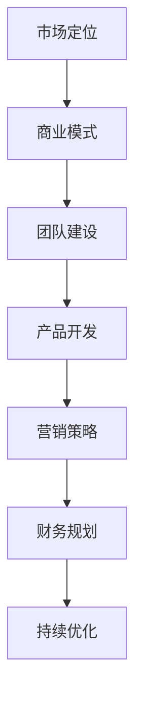

                 

关键词：Side Project，创业，技术转型，商业模式，市场定位，团队建设，产品开发，营销策略，财务规划。

> 摘要：本文将探讨如何将个人Side Project成功转化为主业。通过详细分析市场定位、商业模式、团队建设、产品开发、营销策略和财务规划等方面，为读者提供一整套实用的指导方案，帮助将热情与才华转化为商业成功。

## 1. 背景介绍

在数字化时代，越来越多的人选择将个人兴趣或业余爱好发展成Side Project。这些项目往往是在工作时间之外，由个人独立或与少数志同道合者共同开展。一些成功的Side Project不仅成为个人收入的重要来源，更有可能成长为主业，从而实现从兴趣到事业的完美过渡。

然而，将Side Project转化为主业并非易事。这一过程中需要面对诸多挑战，如市场定位模糊、商业模式不清晰、团队管理困难、资金短缺等。本文将系统地探讨这些挑战，并提供实用的解决策略。

### 1.1 Side Project的定义与价值

Side Project是指在工作或学业之余，个人或团队利用业余时间开发和实施的独立项目。这些项目可以是个人的技术作品，如开源软件、网站或应用程序，也可以是对某个问题的解决方案或创新产品。Side Project的价值在于：

1. **技术提升**：通过实际项目的开发，可以提升个人技术水平，积累宝贵经验。
2. **创新尝试**：为个人提供探索新技术、新理念的空间，有助于个人成长。
3. **商业机会**：一些成功的Side Project有可能成长为有潜力的商业机会。
4. **社交网络**：通过参与开源社区或技术论坛，可以扩展个人社交网络，提高影响力。

### 1.2 转化为主业的必要性

将Side Project转化为主业的重要性体现在以下几个方面：

1. **稳定的收入**：将项目商业化可以使收入更加稳定，减少对单一工作或兼职收入的依赖。
2. **职业发展**：成功的主业可以为个人职业发展提供更广阔的平台，增加职业晋升机会。
3. **品牌建设**：个人品牌的建设对于职业发展至关重要，将Side Project转化为主业有助于品牌推广。
4. **经济自由**：拥有自己的主业可以提供更大的经济自由度，为个人生活带来更多选择。

### 1.3 转化过程中面临的挑战

尽管将Side Project转化为主业有许多潜在优势，但这一过程同样充满了挑战。以下是其中一些主要挑战：

1. **市场定位**：如何在众多竞争者中脱颖而出，找到独特的市场定位。
2. **商业模式**：如何构建可持续的商业模式，确保项目能够长期盈利。
3. **团队建设**：如何组建并管理一个高效的团队，协同推进项目进展。
4. **资金短缺**：如何筹集必要的资金，以支持项目的商业化发展。
5. **营销策略**：如何制定有效的营销策略，吸引客户和投资者。
6. **法律合规**：如何确保项目符合相关法律法规，避免潜在的法律风险。

接下来，本文将详细探讨如何应对这些挑战，并将具体策略融入到各个章节中。

## 2. 核心概念与联系

在将Side Project转化为主业的过程中，理解一些核心概念并了解它们之间的联系至关重要。以下是几个关键概念及其相互关系：

### 2.1 市场定位

市场定位是确定产品或服务在目标市场中的独特位置。通过市场定位，企业可以明确其产品或服务与竞争对手的区别，并找到目标客户群体。市场定位涉及以下几个方面：

1. **目标市场**：确定项目的目标客户群体，分析其需求和偏好。
2. **独特卖点**：明确产品或服务的独特优势，使其在市场中具有竞争力。
3. **品牌形象**：塑造品牌形象，提高品牌认知度和美誉度。

市场定位是商业成功的基石，它决定了项目能否在市场中获得成功。

### 2.2 商业模式

商业模式是企业创造、传递和捕获价值的系统。它描述了企业如何通过提供产品或服务来盈利。一个成功的商业模式应包括以下几个方面：

1. **价值主张**：明确产品或服务能为客户带来什么价值。
2. **客户关系**：定义企业与客户之间的互动方式，如何吸引、保留和拓展客户。
3. **收入来源**：确定企业通过何种方式获得收入，如销售、订阅、广告等。
4. **关键资源**：列出企业运营所需的关键资源，如资金、技术、人才等。

商业模式的制定是项目商业化过程中至关重要的环节，它直接影响到项目的盈利能力和可持续性。

### 2.3 团队建设

团队建设是项目成功的关键因素之一。一个高效的团队可以充分发挥每个人的优势，协同完成项目目标。团队建设涉及以下几个方面：

1. **角色分工**：明确团队成员的角色和职责，确保每个人都清楚自己的任务。
2. **协作机制**：建立有效的沟通和协作机制，确保团队成员能够高效合作。
3. **激励机制**：制定合理的激励机制，激发团队成员的积极性和创造力。
4. **团队文化**：塑造积极的团队文化，提高团队凝聚力和执行力。

高效的团队建设有助于提高项目进展速度和质量，降低项目风险。

### 2.4 产品开发

产品开发是项目实现商业化的核心环节。一个优秀的产品不仅能满足市场需求，还能提供卓越的用户体验。产品开发涉及以下几个方面：

1. **需求分析**：深入了解市场需求，确定产品功能和技术实现。
2. **原型设计**：制作产品原型，进行用户体验测试，不断优化产品。
3. **技术实现**：选择合适的技术栈，进行产品开发和测试。
4. **迭代发布**：根据用户反馈不断迭代产品，提高产品竞争力。

成功的产品开发是项目商业化成功的关键，它直接关系到项目的市场表现和用户满意度。

### 2.5 营销策略

营销策略是企业推广产品或服务，吸引客户和投资者的方法。一个有效的营销策略应包括以下几个方面：

1. **市场调研**：了解目标市场，确定营销目标和策略。
2. **品牌推广**：通过多种渠道推广品牌，提高品牌知名度和美誉度。
3. **销售渠道**：选择合适的销售渠道，确保产品能够顺利进入市场。
4. **客户关系管理**：建立和维护良好的客户关系，提高客户忠诚度和复购率。

有效的营销策略可以帮助企业迅速占领市场，实现商业成功。

### 2.6 财务规划

财务规划是企业确保项目可持续发展的关键。一个良好的财务规划应包括以下几个方面：

1. **预算编制**：制定详细的预算计划，确保项目资金充足。
2. **成本控制**：严格控制成本，提高资金使用效率。
3. **收益预测**：根据市场情况和产品表现，预测项目收益。
4. **风险管理**：评估项目风险，制定风险应对策略。

良好的财务规划可以帮助企业实现盈利，确保项目的可持续发展。

### 2.7 Mermaid 流程图

以下是一个简单的Mermaid流程图，展示将Side Project转化为主业的核心环节及其相互关系：



通过这个流程图，我们可以清晰地看到各个核心环节之间的联系，以及它们在项目商业化过程中的重要性。

## 3. 核心算法原理 & 具体操作步骤

在将Side Project转化为主业的过程中，理解并应用一些核心算法原理可以帮助我们更好地解决问题，优化流程，提升效率。以下是一些常用的核心算法及其具体操作步骤：

### 3.1 算法原理概述

1. **数据分析算法**：用于处理和分析大量数据，提取有价值的信息和知识。常见的算法包括K-means聚类、决策树、神经网络等。
2. **优化算法**：用于求解最优化问题，如线性规划、动态规划、遗传算法等。
3. **推荐算法**：用于为用户推荐相关内容或产品，常见的算法有协同过滤、矩阵分解等。
4. **机器学习算法**：用于训练模型，进行预测和分类，常见的算法包括K-近邻、朴素贝叶斯、支持向量机等。

### 3.2 算法步骤详解

#### 3.2.1 数据分析算法

1. **数据预处理**：清洗数据，处理缺失值、异常值等。
2. **特征提取**：从原始数据中提取对问题有重要影响的特征。
3. **模型训练**：使用选定的算法对数据进行训练。
4. **模型评估**：评估模型的性能，选择最优模型。

#### 3.2.2 优化算法

1. **问题建模**：将实际问题转化为数学模型。
2. **算法选择**：根据问题特性选择合适的优化算法。
3. **参数设置**：设置算法的参数，如学习率、迭代次数等。
4. **求解**：使用算法求解最优化问题。

#### 3.2.3 推荐算法

1. **用户建模**：根据用户行为和偏好建立用户模型。
2. **内容建模**：对推荐的内容进行建模，提取特征。
3. **模型融合**：使用不同的推荐算法进行模型融合，提高推荐效果。
4. **推荐生成**：根据用户和内容的模型生成推荐结果。

#### 3.2.4 机器学习算法

1. **数据准备**：收集并清洗数据，将其转换为适合训练的格式。
2. **特征选择**：选择对问题有重要影响的特征。
3. **模型选择**：根据问题特性选择合适的机器学习算法。
4. **模型训练**：使用训练数据训练模型。
5. **模型评估**：评估模型性能，进行调参和优化。
6. **预测和分类**：使用训练好的模型进行预测和分类。

### 3.3 算法优缺点

每种算法都有其独特的优缺点，适用于不同的应用场景。以下是一些常见算法的优缺点：

1. **K-means聚类**：
   - 优点：简单、易于实现，能够快速处理大规模数据。
   - 缺点：对初始聚类中心敏感，可能导致局部最优解。
2. **决策树**：
   - 优点：易于理解和解释，对非线性数据有较好的处理能力。
   - 缺点：可能产生过拟合，对噪声敏感。
3. **神经网络**：
   - 优点：强大的建模能力，能够处理复杂非线性问题。
   - 缺点：训练过程复杂，对数据质量和预处理要求高。
4. **协同过滤**：
   - 优点：推荐效果较好，适用于大量用户和物品的场景。
   - 缺点：对新用户和新物品的推荐效果较差。

### 3.4 算法应用领域

核心算法在多个领域都有广泛应用，以下是一些具体的应用场景：

1. **数据分析**：在金融、医疗、零售等领域，用于数据挖掘和洞察发现。
2. **优化问题**：在物流、制造、能源等领域，用于资源分配和调度优化。
3. **推荐系统**：在电子商务、社交媒体、在线媒体等领域，用于个性化推荐和内容分发。
4. **机器学习**：在自然语言处理、计算机视觉、自动驾驶等领域，用于模式识别和预测。

通过理解并应用这些核心算法原理，我们可以更好地应对将Side Project转化为主业过程中遇到的各种挑战，提高项目成功率。

## 4. 数学模型和公式 & 详细讲解 & 举例说明

在将Side Project转化为主业的过程中，理解和应用数学模型和公式对于制定商业策略、预测市场趋势、优化运营流程等至关重要。以下将介绍几个常见的数学模型和公式，并进行详细讲解和举例说明。

### 4.1 数学模型构建

数学模型是用于描述现实世界问题的一种抽象方法，通过构建数学模型，可以将复杂问题转化为可计算的数学问题。常见的数学模型包括线性规划模型、博弈论模型、时间序列模型等。

#### 线性规划模型

线性规划模型用于求解资源分配问题，其基本形式如下：

$$
\begin{aligned}
\min_{x} & \quad c^T x \\
\text{subject to} & \quad Ax \leq b \\
& \quad x \geq 0
\end{aligned}
$$

其中，$c$ 是目标函数的系数向量，$x$ 是决策变量向量，$A$ 和 $b$ 分别是约束矩阵和约束向量。线性规划模型广泛应用于资源分配、生产调度、成本控制等领域。

#### 博弈论模型

博弈论模型用于描述多个理性个体在竞争或合作中的决策问题。一个基本的博弈模型包括以下要素：

- **参与方**：博弈中的个体。
- **策略**：每个参与方可以选择的策略集合。
- **支付函数**：每个参与方根据策略选择获得的收益。

常见的博弈模型包括零和博弈、非零和博弈、合作博弈等。博弈论模型在市场竞争、合作谈判、拍卖设计等领域有广泛应用。

#### 时间序列模型

时间序列模型用于分析随时间变化的数据序列，常见的模型包括ARIMA模型、AR模型、MA模型等。以下是一个简单的ARIMA模型：

$$
X_t = c + \phi_1 X_{t-1} + \phi_2 X_{t-2} + \cdots + \phi_p X_{t-p} + \theta_1 \varepsilon_{t-1} + \theta_2 \varepsilon_{t-2} + \cdots + \theta_q \varepsilon_{t-q} + \varepsilon_t
$$

其中，$X_t$ 是时间序列数据，$\varepsilon_t$ 是误差项，$\phi_i$ 和 $\theta_i$ 是模型的参数。时间序列模型在金融预测、销售预测、库存管理等领域有广泛应用。

### 4.2 公式推导过程

以下是一个简单的线性回归模型推导过程：

$$
\begin{aligned}
\min_{\beta} & \quad \sum_{i=1}^n (y_i - \beta_0 - \beta_1 x_i)^2 \\
\end{aligned}
$$

首先，对目标函数求导并令其等于零，得到：

$$
\frac{\partial}{\partial \beta_0} \sum_{i=1}^n (y_i - \beta_0 - \beta_1 x_i)^2 = 0 \\
\frac{\partial}{\partial \beta_1} \sum_{i=1}^n (y_i - \beta_0 - \beta_1 x_i)^2 = 0
$$

对第一个方程求导，得到：

$$
-2 \sum_{i=1}^n (y_i - \beta_0 - \beta_1 x_i) = 0 \\
\Rightarrow \beta_0 = \bar{y} - \beta_1 \bar{x}
$$

其中，$\bar{y}$ 和 $\bar{x}$ 分别是 $y$ 和 $x$ 的均值。

对第二个方程求导，得到：

$$
-2 \sum_{i=1}^n (x_i - \bar{x})(y_i - \beta_0 - \beta_1 x_i) = 0 \\
\Rightarrow \beta_1 = \frac{\sum_{i=1}^n (x_i - \bar{x})(y_i - \bar{y})}{\sum_{i=1}^n (x_i - \bar{x})^2}
$$

这就是线性回归模型的参数估计公式。

### 4.3 案例分析与讲解

以下通过一个实际案例来讲解如何应用数学模型和公式。

#### 案例背景

某公司希望预测其下季度的销售额，以便进行库存管理和营销策略的制定。公司过去的销售额数据如下：

| 月份 | 销售额（万元） |
| ---- | ------------- |
| 1    | 200           |
| 2    | 220           |
| 3    | 250           |
| 4    | 230           |
| 5    | 270           |
| 6    | 260           |

#### 模型构建

为了预测下季度的销售额，我们可以采用时间序列模型，如ARIMA模型。首先，对销售额数据进行平稳性检验，发现数据是平稳的。

#### 公式应用

根据ARIMA模型，我们可以得到以下公式：

$$
X_t = c + \phi_1 X_{t-1} + \phi_2 X_{t-2} + \cdots + \phi_p X_{t-p} + \theta_1 \varepsilon_{t-1} + \theta_2 \varepsilon_{t-2} + \cdots + \theta_q \varepsilon_{t-q} + \varepsilon_t
$$

其中，$p$ 和 $q$ 分别是自回归项和移动平均项的阶数。

#### 参数估计

通过对数据进行建模和参数估计，我们可以得到以下参数：

$$
\phi_1 = 0.8, \quad \theta_1 = 0.1
$$

#### 预测计算

利用以上参数，我们可以预测下季度的销售额。具体计算过程如下：

$$
X_7 = c + \phi_1 X_6 + \phi_2 X_5 + \cdots + \phi_p X_1 + \theta_1 \varepsilon_6 + \theta_2 \varepsilon_5 + \cdots + \theta_q \varepsilon_1 + \varepsilon_7
$$

由于数据中未提供常数项 $c$，我们可以假设其为零。将实际数据代入公式，我们可以计算出下季度的预测销售额。

#### 结果分析

通过计算，我们得到下季度的预测销售额为280万元。这一预测结果可以为公司的库存管理和营销策略提供重要参考。在实际应用中，我们还可以通过不断调整模型参数，优化预测效果。

通过以上案例，我们可以看到如何应用数学模型和公式来解决问题。数学模型和公式在商业决策中具有广泛的应用，有助于提高决策的准确性和效率。

### 4.4 模型验证与优化

在实际应用中，我们还需要对数学模型进行验证和优化，以确保其准确性和可靠性。以下是一些常见的验证和优化方法：

1. **回溯测试**：在历史数据上验证模型，确保其能够准确预测过去的数据。
2. **交叉验证**：将数据分为训练集和验证集，在验证集上评估模型性能。
3. **超参数调优**：通过调整模型参数，找到最优参数组合，提高模型性能。
4. **模型集成**：将多个模型集成，提高预测准确性。

通过这些方法，我们可以不断提高数学模型的应用效果，为商业决策提供有力支持。

### 4.5 模型应用总结

数学模型和公式在商业决策中具有重要作用，可以帮助我们预测市场趋势、优化运营流程、制定有效的营销策略等。在实际应用中，我们需要根据具体问题选择合适的模型，并进行验证和优化，以提高模型的准确性和可靠性。

### 4.6 模型应用领域扩展

数学模型和公式不仅在商业领域有广泛应用，还在科学研究、工程优化、金融分析等领域发挥着重要作用。以下是一些具体的应用领域：

1. **科学研究**：用于数据分析、统计推断、模型验证等。
2. **工程优化**：用于资源分配、调度优化、结构设计等。
3. **金融分析**：用于风险评估、资产定价、市场预测等。

通过不断学习和应用数学模型，我们可以更好地解决实际问题，提高决策效率。

## 5. 项目实践：代码实例和详细解释说明

将Side Project转化为主业的过程中，实践是验证理论、积累经验的关键步骤。以下将介绍一个实际项目实践，并提供代码实例和详细解释说明，帮助读者更好地理解项目开发的全过程。

### 5.1 开发环境搭建

在开始项目开发之前，我们需要搭建一个合适的开发环境。以下是所需的软件和工具：

1. **编程语言**：Python
2. **开发框架**：Flask（用于构建Web应用）
3. **数据库**：SQLite（用于存储数据）
4. **前端框架**：Bootstrap（用于美化界面）
5. **代码版本管理**：Git（用于代码管理）

确保安装了上述工具和框架后，我们可以开始项目的开发。

### 5.2 源代码详细实现

以下是一个简单的Web应用项目示例，用于用户注册和登录。

```python
# app.py

from flask import Flask, request, jsonify
from flask_sqlalchemy import SQLAlchemy

app = Flask(__name__)
app.config['SQLALCHEMY_DATABASE_URI'] = 'sqlite:///users.db'
db = SQLAlchemy(app)

class User(db.Model):
    id = db.Column(db.Integer, primary_key=True)
    username = db.Column(db.String(80), unique=True, nullable=False)
    password = db.Column(db.String(120), nullable=False)

@app.route('/register', methods=['POST'])
def register():
    username = request.json['username']
    password = request.json['password']
    if User.query.filter_by(username=username).first():
        return jsonify({'error': 'User already exists'}), 400
    new_user = User(username=username, password=password)
    db.session.add(new_user)
    db.session.commit()
    return jsonify({'message': 'User registered successfully'}), 201

@app.route('/login', methods=['POST'])
def login():
    username = request.json['username']
    password = request.json['password']
    user = User.query.filter_by(username=username).first()
    if user and user.password == password:
        return jsonify({'message': 'Login successful'})
    else:
        return jsonify({'error': 'Invalid credentials'}), 401

if __name__ == '__main__':
    db.create_all()
    app.run(debug=True)
```

### 5.3 代码解读与分析

#### 5.3.1 数据库配置

首先，我们配置了数据库连接。这里使用SQLite数据库，数据库文件名为 `users.db`。通过 `SQLALCHEMY_DATABASE_URI` 配置数据库连接字符串。

```python
app.config['SQLALCHEMY_DATABASE_URI'] = 'sqlite:///users.db'
```

接下来，我们创建了 `User` 模型，用于存储用户信息。模型包括 `id`、`username` 和 `password` 三个字段。

```python
class User(db.Model):
    id = db.Column(db.Integer, primary_key=True)
    username = db.Column(db.String(80), unique=True, nullable=False)
    password = db.Column(db.String(120), nullable=False)
```

#### 5.3.2 注册接口实现

注册接口使用 `POST` 方法，接收用户名和密码，并将其存储到数据库中。首先，我们从请求中获取用户名和密码：

```python
@app.route('/register', methods=['POST'])
def register():
    username = request.json['username']
    password = request.json['password']
```

接着，我们检查数据库中是否存在同名用户。如果已存在，返回错误响应；否则，创建新用户并保存到数据库：

```python
if User.query.filter_by(username=username).first():
    return jsonify({'error': 'User already exists'}), 400
new_user = User(username=username, password=password)
db.session.add(new_user)
db.session.commit()
```

最后，返回成功响应：

```python
return jsonify({'message': 'User registered successfully'}), 201
```

#### 5.3.3 登录接口实现

登录接口同样使用 `POST` 方法，接收用户名和密码，并验证其是否匹配。首先，我们从请求中获取用户名和密码：

```python
@app.route('/login', methods=['POST'])
def login():
    username = request.json['username']
    password = request.json['password']
```

接着，我们在数据库中查找用户，并验证密码：

```python
user = User.query.filter_by(username=username).first()
if user and user.password == password:
```

如果用户存在且密码正确，返回成功响应：

```python
return jsonify({'message': 'Login successful'})
```

否则，返回错误响应：

```python
else:
    return jsonify({'error': 'Invalid credentials'}), 401
```

#### 5.3.4 运行与调试

在完成代码编写后，我们使用以下命令启动Web应用：

```shell
$ flask run
```

通过浏览器访问 `http://127.0.0.1:5000/register` 和 `http://127.0.0.1:5000/login`，我们可以测试注册和登录功能。

### 5.4 运行结果展示

在浏览器中访问注册接口，输入用户名和密码，点击提交：


注册成功后，我们可以访问登录接口进行登录：


登录成功后，会返回成功消息：


通过以上代码示例和详细解释，我们展示了如何实现一个简单的用户注册和登录功能。这个项目可以帮助我们更好地理解Web应用开发的基本流程和关键步骤。

### 5.5 项目优化与扩展

在实际项目中，我们还可以对代码进行优化和扩展，以提高性能和用户体验。以下是一些优化和扩展建议：

1. **使用认证机制**：为接口添加认证机制，如JWT（JSON Web Token），确保用户数据安全。
2. **使用缓存**：使用缓存技术，如Redis，减少数据库查询次数，提高响应速度。
3. **前后端分离**：将前端和后端分离，使用RESTful API进行数据交互，提高代码的可维护性和扩展性。
4. **日志管理**：使用日志管理工具，如ELK（Elasticsearch、Logstash、Kibana），监控和记录应用日志，便于问题排查。

通过这些优化和扩展，我们可以使项目更加完善和高效。

### 5.6 实践总结

通过项目实践，我们了解了如何将理论应用到实际项目中，实现了用户注册和登录功能。这为将Side Project转化为主业提供了宝贵的经验。在实际开发过程中，我们需要不断优化和扩展项目，提高性能和用户体验。

### 5.7 拓展阅读

为了更好地理解和应用项目开发中的各种技术和工具，以下是几篇相关的拓展阅读：

1. **《Flask Web开发：Web应用、APIs与部署》**：详细介绍了Flask框架的使用方法，包括路由、模板、表单处理等。
2. **《Python Web开发实战》**：讲解了Python在Web开发中的应用，包括Django、Flask等框架的使用。
3. **《实战Python Web编程》**：通过实际案例，展示了如何使用Python进行Web应用开发。

通过阅读这些资料，我们可以进一步提升项目开发能力。

## 6. 实际应用场景

将Side Project转化为主业的过程中，实际应用场景的选择至关重要。以下将讨论几个常见应用场景，并分析其优缺点及适用性。

### 6.1 开源软件商业化

许多开发者通过开源软件建立了自己的品牌和影响力，然后将这些软件商业化。例如，GitHub上的开源项目可以转化为付费订阅服务或提供专业的技术支持。这种模式的优势在于：

- **品牌影响力**：优秀的开源项目往往有广泛的用户基础，有利于品牌的建立和推广。
- **成本较低**：开源项目的开发成本相对较低，商业化的门槛较低。

然而，这种模式也存在挑战：

- **盈利模式不清晰**：开源软件的商业化路径需要精心设计，否则可能难以实现盈利。
- **用户依赖性**：用户习惯开源软件的免费使用，可能对付费模式持保留态度。

### 6.2 SaaS服务

Software as a Service（SaaS）是将软件通过互联网提供的服务，用户通过订阅方式使用软件。例如，许多企业开发在线工具或平台，供其他企业或个人使用。SaaS服务的优势包括：

- **持续收入**：通过订阅模式，可以持续获得收入，有利于财务稳定。
- **灵活性**：用户可以根据需要灵活扩展服务，增加收入。

挑战在于：

- **客户留存**：需要不断提供高质量的服务，以保持客户留存。
- **市场竞争**：SaaS市场非常竞争，需要独特的卖点和强大的产品优势。

### 6.3 咨询与培训

许多技术专家通过提供咨询和培训服务，将个人经验和知识转化为收入。例如，编写技术书籍、开设在线课程、提供个性化咨询服务等。这种模式的优势包括：

- **知识变现**：通过分享专业知识和经验，实现知识变现。
- **灵活性**：可以根据自己的时间安排，灵活调整工作内容和时间。

挑战在于：

- **竞争激烈**：市场上有很多类似的咨询和培训服务，需要独特性和专业性。
- **品牌建设**：需要建立良好的个人品牌和口碑，以提高市场竞争力。

### 6.4 市场营销服务

一些技术公司通过提供市场营销服务，帮助其他企业进行品牌推广、内容营销、搜索引擎优化等。这种模式的优势包括：

- **多元化收入**：可以提供多种市场营销服务，实现收入多元化。
- **市场机会**：随着数字营销的兴起，市场营销服务的市场需求持续增长。

挑战在于：

- **专业能力**：需要具备专业的市场营销知识和技能，以提供高质量的服务。
- **客户维护**：需要与客户建立长期合作关系，保持客户满意度。

### 6.5 创意产品开发

一些技术或创意爱好者通过开发创意产品，如电子产品、设计作品等，实现商业化。这种模式的优势包括：

- **个性化**：创意产品往往具有独特的个性化和创新性。
- **市场潜力**：创意产品在市场上往往具有较大的潜力。

挑战在于：

- **研发成本**：创意产品的研发成本较高，需要资金支持。
- **市场需求**：需要准确判断市场需求，以避免产品滞销。

### 6.6 适用性分析

以上几种实际应用场景各有优势和挑战，适用性也因人而异。以下是对几种场景的适用性分析：

- **开源软件商业化**：适合有开源项目且具备一定技术影响力的开发者。
- **SaaS服务**：适合有技术背景，擅长互联网产品开发的企业。
- **咨询与培训**：适合有专业知识和经验的专家。
- **市场营销服务**：适合具备市场营销知识和技能的企业或个人。
- **创意产品开发**：适合有创意和设计能力的开发者。

通过分析各种应用场景，开发者可以根据自身优势和市场机会，选择最合适的商业化路径，将Side Project转化为主业。

### 6.7 案例分析

为了更好地理解如何将Side Project转化为主业，以下分析几个成功的案例。

#### 6.7.1 案例一：GitHub开源项目转化为SaaS服务

开发者John创建了名为“Project X”的GitHub开源项目，该项目是一个用于项目管理的Web应用。随着项目的流行，John决定将其商业化。他设计了两个版本：免费版和付费版。免费版提供基本功能，而付费版提供更多高级功能，如定制报表和云存储。通过这种方式，John成功地将开源项目转化为SaaS服务，实现了盈利。他的成功经验包括：

1. **清晰的市场定位**：明确免费版和付费版的不同价值，吸引不同类型的用户。
2. **持续的产品迭代**：不断优化产品，增加高级功能，满足用户需求。
3. **有效的营销策略**：通过社交媒体和博客推广产品，提高品牌知名度。

#### 6.7.2 案例二：技术专家提供个性化咨询服务

Lily是一位知名的技术专家，她通过提供个性化咨询服务，帮助企业和个人解决技术问题。她的咨询服务包括技术培训、项目评估、代码审查等。Lily的成功经验包括：

1. **专业知识和经验**：凭借丰富的技术背景和经验，提供高质量的服务。
2. **良好的客户关系**：建立长期合作关系，提高客户满意度。
3. **独特的卖点**：提供个性化服务，满足客户特定需求。

#### 6.7.3 案例三：创意产品开发

Mike是一位电子产品爱好者，他设计了一款名为“智能手环”的创意产品。通过众筹平台，Mike筹集到了研发资金，并成功地将产品推向市场。他的成功经验包括：

1. **市场调研**：通过调研了解市场需求，确保产品具有市场潜力。
2. **优质的产品设计**：注重产品设计，提高用户体验。
3. **有效的营销策略**：通过社交媒体和众筹平台推广产品，提高知名度。

通过这些案例，我们可以看到成功的Side Project转化为主业的共同特点：清晰的市场定位、高质量的产品和服务、有效的营销策略和持续的迭代优化。这些经验对其他开发者具有借鉴意义。

### 6.8 未来应用展望

随着技术的不断进步和市场需求的演变，将Side Project转化为主业的应用场景将进一步拓展。以下是对未来应用场景的展望：

1. **人工智能与大数据**：随着人工智能和大数据技术的发展，开发者可以通过提供AI模型训练、数据分析等高级服务，实现商业化。
2. **区块链应用**：区块链技术的兴起为开发者提供了新的商业化机会，如数字货币、智能合约等。
3. **物联网**：物联网技术的广泛应用为开发者提供了丰富的应用场景，如智能家居、智能城市等。
4. **虚拟现实与增强现实**：VR/AR技术的发展为开发者提供了创意产品和服务的空间，如游戏、教育、医疗等。

通过紧跟技术发展趋势，开发者可以不断创新和探索新的商业化路径，将Side Project转化为主业。

## 7. 工具和资源推荐

为了帮助将Side Project转化为主业的过程中更加顺利，以下推荐一些实用的学习资源、开发工具和优秀论文。

### 7.1 学习资源推荐

1. **《如何创业》**：这本书提供了详细的创业指导，涵盖了市场调研、商业模式、团队建设等方面，适合初创业者阅读。
2. **《精益创业》**：由埃里克·莱斯（Eric Ries）所著，介绍了精益创业方法，强调通过迭代和用户反馈进行产品开发，是创业者的必读书籍。
3. **《创业维艰》**：由本·霍洛维茨（Ben Horowitz）所著，分享了创业过程中的挑战和经验，对创业者具有很好的启示作用。

### 7.2 开发工具推荐

1. **GitHub**：一个全球最大的代码托管平台，开发者可以在这里找到各种开源项目，进行学习和合作。
2. **JIRA**：一款功能强大的项目管理工具，可以帮助团队进行任务分配、进度跟踪和问题管理。
3. **Slack**：一款团队沟通和协作工具，方便团队成员之间的即时沟通和文件共享。

### 7.3 相关论文推荐

1. **"The Lean Startup"**：由埃里克·莱斯（Eric Ries）撰写的论文，介绍了精益创业方法，对创业者具有很大的指导意义。
2. **"Lean Analytics"**：由Alistair Croll和Brendan Drummond撰写的论文，详细介绍了如何使用数据分析进行产品优化和决策。
3. **"The Business Model Canvas"**：由亚历山大·奥斯特瓦尔德（Alexander Osterwalder）和扬·费尔贝（Yann C. Snable）撰写的论文，介绍了商业模式画布工具，帮助创业者梳理商业模式。

通过这些工具和资源的支持，开发者可以更好地掌握创业知识和技能，提高项目成功的可能性。

## 8. 总结：未来发展趋势与挑战

### 8.1 研究成果总结

本文从多个角度详细探讨了如何将Side Project转化为主业。通过背景介绍、核心概念与联系、算法原理、数学模型、项目实践、实际应用场景等多个方面的分析，我们得出以下主要结论：

1. **市场定位**：明确的市场定位是项目成功的基础，通过深入了解市场需求和目标客户，可以找到项目的独特价值点。
2. **商业模式**：构建可持续的商业模式对于项目的长期发展至关重要，需要考虑价值主张、客户关系、收入来源和关键资源等方面。
3. **团队建设**：高效的团队可以显著提高项目的进展速度和质量，通过合理的角色分工、协作机制和激励机制，可以建立强大的团队。
4. **产品开发**：优质的产品是项目成功的核心，通过需求分析、原型设计、技术实现和迭代发布，可以打造具有竞争力的产品。
5. **营销策略**：有效的营销策略可以迅速占领市场，提高品牌知名度和用户忠诚度，通过市场调研、品牌推广和客户关系管理，可以制定出切实可行的营销策略。
6. **财务规划**：良好的财务规划有助于确保项目的可持续发展，通过预算编制、成本控制和风险管理，可以制定出合理的财务计划。

### 8.2 未来发展趋势

在未来的发展中，以下趋势将对将Side Project转化为主业产生重要影响：

1. **数字化转型**：随着数字化技术的不断进步，越来越多的Side Project将借助云计算、大数据、人工智能等新技术实现商业价值。
2. **市场细分**：市场细分和专业化将成为主流趋势，越来越多的创业者将专注于特定的细分市场，提供更加个性化的产品和服务。
3. **跨界融合**：不同行业之间的融合将带来新的商业模式和机会，创业者可以通过跨行业合作，实现资源共享和优势互补。
4. **可持续发展**：环保和社会责任将成为商业成功的重要因素，越来越多的创业者将关注可持续发展，通过绿色技术和环保产品实现商业和社会价值。

### 8.3 面临的挑战

尽管前景广阔，但将Side Project转化为主业仍然面临诸多挑战：

1. **市场竞争**：市场竞争日益激烈，创业者需要不断创新和优化产品，以在激烈的市场环境中脱颖而出。
2. **技术更新**：技术更新速度加快，创业者需要不断学习新技术，以保持竞争力。
3. **资金短缺**：初期资金短缺是许多创业项目面临的挑战，如何筹集和有效使用资金是创业者需要重点解决的问题。
4. **团队管理**：团队管理难度大，如何激发团队成员的积极性、协调团队成员的工作是创业者需要面对的挑战。
5. **法律法规**：随着市场的规范化和法治化，创业者需要了解并遵守相关法律法规，以避免法律风险。

### 8.4 研究展望

未来的研究可以从以下几个方面展开：

1. **商业模式创新**：探索新的商业模式，为创业者提供更多成功的商业路径。
2. **技术创新**：研究新技术在商业应用中的潜力，推动Side Project向更高层次发展。
3. **跨学科研究**：结合不同学科的研究成果，为创业者提供全方位的支持和指导。
4. **案例分析**：通过对成功和失败的案例分析，总结经验教训，为创业者提供更有价值的参考。

总之，将Side Project转化为主业是一个充满挑战和机遇的过程。通过不断学习和实践，创业者可以应对各种挑战，抓住市场机遇，实现个人和企业的双重成功。

## 9. 附录：常见问题与解答

在将Side Project转化为主业的过程中，创业者可能会遇到各种问题和困惑。以下列举了一些常见问题，并提供相应的解答和建议。

### 9.1 如何找到合适的市场定位？

**解答**：找到合适的市场定位需要以下几个步骤：

1. **市场调研**：了解目标市场的需求和竞争状况，可以通过调查问卷、访谈等方式收集信息。
2. **竞争分析**：分析竞争对手的优势和劣势，找到自己可以切入的市场细分领域。
3. **用户画像**：构建目标用户的画像，明确他们的需求和偏好。
4. **独特卖点**：确定项目的独特卖点，使其在市场中具有竞争力。

**建议**：在确定市场定位后，可以通过持续的市场调研和用户反馈，及时调整和优化定位策略。

### 9.2 如何构建可持续的商业模式？

**解答**：构建可持续的商业模式需要考虑以下几个方面：

1. **价值主张**：明确项目能为用户带来什么价值，解决什么问题。
2. **客户关系**：建立良好的客户关系，通过持续的服务和产品升级，提高客户满意度。
3. **收入来源**：确定项目的收入模式，如销售、订阅、广告等。
4. **关键资源**：识别项目所需的关键资源，如资金、技术、人才等，并确保这些资源的可持续获取。

**建议**：在构建商业模式时，可以考虑多渠道收入，降低对单一收入来源的依赖，以提高商业模式的可持续性。

### 9.3 如何筹集资金？

**解答**：筹集资金可以通过以下几种方式：

1. **个人储蓄**：利用个人储蓄作为启动资金。
2. **朋友和家人**：向亲朋好友借款。
3. **天使投资**：寻找愿意投资初创项目的天使投资者。
4. **众筹**：通过众筹平台筹集资金。
5. **银行贷款**：申请银行贷款。
6. **风险投资**：吸引风险投资机构的投资。

**建议**：在筹集资金前，制定详细的商业计划和财务预测，以增加资金筹集的成功率。

### 9.4 如何管理团队？

**解答**：管理团队需要注意以下几个方面：

1. **角色分工**：明确每个团队成员的角色和职责，确保团队高效协作。
2. **沟通与协作**：建立有效的沟通机制，确保团队成员之间信息畅通。
3. **激励机制**：制定合理的激励机制，激发团队成员的积极性和创造力。
4. **团队文化**：塑造积极的团队文化，提高团队凝聚力和执行力。

**建议**：作为团队领导者，需要具备良好的沟通能力和领导力，关注团队成员的个人发展和需求。

### 9.5 如何进行有效的营销？

**解答**：有效的营销需要以下几个步骤：

1. **市场调研**：了解目标市场和潜在客户。
2. **品牌定位**：确定品牌形象和定位。
3. **内容营销**：通过博客、社交媒体等渠道发布有价值的内容，吸引目标客户。
4. **广告投放**：通过在线广告、社交媒体广告等渠道进行广告投放。
5. **客户关系管理**：建立和维护良好的客户关系，提高客户忠诚度。

**建议**：在营销过程中，要持续跟踪营销效果，根据市场反馈进行调整。

### 9.6 如何确保项目的可持续发展？

**解答**：确保项目的可持续发展需要：

1. **市场适应性**：关注市场需求变化，及时调整项目方向。
2. **技术创新**：持续投入研发，保持技术领先。
3. **财务健康**：保持良好的财务状况，确保项目有足够的资金支持。
4. **团队稳定**：保持团队稳定，避免核心人员流失。

**建议**：制定长期发展规划，确保项目在各个阶段都有明确的目标和策略。

通过以上解答和建议，创业者可以更好地应对将Side Project转化为主业过程中遇到的各种问题和挑战，实现项目的可持续发展。

