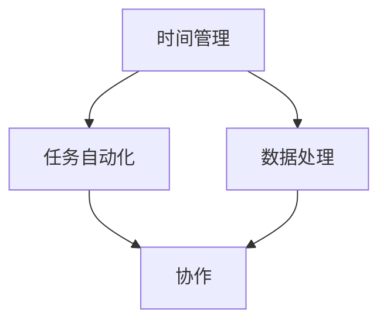

                 

### 1. 背景介绍

随着信息技术的飞速发展，编程技能已经成为现代社会的一项基础能力。无论是从事软件开发、数据分析，还是进行科学研究、工程设计，编程技能的应用范围越来越广泛。然而，许多人往往忽视了编程技能对于个人效率提升的重要性。事实上，通过合理运用编程技能，我们可以极大地提高日常工作和学习的效率，实现时间的优化利用。

本文将探讨如何将编程技能应用于个人效率提升，旨在为读者提供一套实用的方法论和工具。文章将涵盖编程技能在时间管理、任务自动化、数据处理和协作等多个方面中的应用，旨在帮助读者更好地理解编程技能的价值，并学会如何将其应用于实际生活中。

### 2. 核心概念与联系

在深入探讨编程技能如何提升个人效率之前，我们需要先了解几个核心概念，以及它们之间的联系。

**2.1 时间管理**

时间管理是提升个人效率的关键。通过合理分配时间，我们可以确保重要任务得到优先处理，从而避免时间的浪费。编程技能可以帮助我们实现这一点，例如通过使用日历应用程序、任务管理工具和自动化脚本等方式，更有效地安排和跟踪日常任务。

**2.2 任务自动化**

任务自动化是提高工作效率的另一个重要手段。通过编写脚本或使用现有的自动化工具，我们可以将重复性、繁琐的任务自动化处理，从而节省大量时间。例如，在办公室中，我们可以编写脚本来处理邮件过滤、数据备份和报告生成等工作。

**2.3 数据处理**

数据是现代社会的核心资源。通过编程技能，我们可以高效地处理和分析大量数据，从中提取有价值的信息。这对于决策制定、市场分析和学术研究等方面都具有重要的应用价值。

**2.4 协作**

在现代工作中，团队合作越来越重要。编程技能可以帮助我们更高效地协作，例如通过使用版本控制工具、在线文档编辑器和协作平台等，实现团队成员之间的实时沟通和协同工作。

下面是一个使用Mermaid绘制的流程图，展示了上述核心概念之间的联系：



### 3. 核心算法原理 & 具体操作步骤

#### 3.1 算法原理概述

编程技能的核心在于算法和数据结构。算法是解决问题的步骤集合，而数据结构则是组织和存储数据的方式。在提升个人效率方面，以下几种算法和数据结构尤其重要：

- **排序算法**：用于对数据进行排序，常见的排序算法有冒泡排序、选择排序和快速排序等。
- **搜索算法**：用于在数据中查找特定元素，常见的搜索算法有线性搜索和二分搜索等。
- **树状图**：用于组织和管理数据，常见的树状图包括二叉树、平衡树（如红黑树）和堆等。
- **图论算法**：用于解决图相关的问题，如最短路径算法、最小生成树算法和拓扑排序等。

#### 3.2 算法步骤详解

以下是一个简单的排序算法——冒泡排序的具体步骤：

1. **初始状态**：将数据元素按顺序排列，但未排序。
2. **第一次遍历**：从第一个元素开始，依次比较相邻的两个元素，如果第一个元素大于第二个元素，则交换它们的位置。遍历结束后，最大的元素将被移动到最后一个位置。
3. **后续遍历**：重复执行第一次遍历的步骤，但每次遍历后，未排序部分的最大元素已经被放置到最后一个位置，因此可以忽略这部分元素。
4. **终止条件**：当整个数据集合被排序时，算法终止。

#### 3.3 算法优缺点

- **冒泡排序**：
  - **优点**：实现简单，易于理解。
  - **缺点**：时间复杂度为O(n^2)，效率较低，不适合大数据集。

对于不同的问题，我们可以选择不同的算法。以下是一个简单的示例，展示了如何使用冒泡排序对一组数据进行排序：

```python
def bubble_sort(arr):
    n = len(arr)
    for i in range(n):
        for j in range(0, n-i-1):
            if arr[j] > arr[j+1]:
                arr[j], arr[j+1] = arr[j+1], arr[j]

# 示例数据
data = [64, 34, 25, 12, 22, 11, 90]

# 执行排序
bubble_sort(data)

# 输出排序后的数据
print("排序后的数据：", data)
```

#### 3.4 算法应用领域

- **排序算法**：广泛应用于数据库、搜索引擎和算法竞赛等领域。
- **搜索算法**：在搜索引擎、推荐系统和数据分析等领域有广泛应用。
- **树状图**：在数据结构、图形处理和网络算法等领域有重要应用。
- **图论算法**：在路由算法、社交网络分析和优化问题等领域有广泛应用。

### 4. 数学模型和公式 & 详细讲解 & 举例说明

#### 4.1 数学模型构建

在编程中，数学模型是非常重要的一部分。一个数学模型通常由一组变量、方程和条件组成，用于描述现实世界中的某个问题。以下是一个简单的线性回归模型的构建过程：

- **变量**：设我们有自变量 \( x \) 和因变量 \( y \)，我们的目标是找到一个线性关系 \( y = ax + b \)，其中 \( a \) 和 \( b \) 是待求的参数。
- **方程**：我们使用最小二乘法来求解 \( a \) 和 \( b \)，即最小化误差平方和 \( S = \sum (y - (ax + b))^2 \)。
- **条件**：为了求解 \( a \) 和 \( b \)，我们需要一组观测数据 \( (x_i, y_i) \)，其中 \( i = 1, 2, \ldots, n \)。

以下是一个简单的Python代码示例，用于求解线性回归模型的参数：

```python
import numpy as np

# 模拟观测数据
x = np.array([1, 2, 3, 4, 5])
y = np.array([2, 4, 5, 4, 5])

# 求解参数
a = np.linalg.lstsq(np.array([x, np.ones(len(x))]).T, y, rcond=None)[0]

# 输出参数
print("斜率 a:", a[0])
print("截距 b:", a[1])
```

#### 4.2 公式推导过程

为了求解线性回归模型的参数 \( a \) 和 \( b \)，我们可以使用最小二乘法。具体推导过程如下：

- **误差平方和**：设 \( y_i \) 为实际观测值，\( \hat{y_i} = ax_i + b \) 为预测值，则误差平方和为 \( S = \sum (y_i - \hat{y_i})^2 \)。
- **求导**：对 \( S \) 关于 \( a \) 和 \( b \) 求偏导，并令其等于零，得到以下方程组：
  \[
  \frac{\partial S}{\partial a} = -2 \sum (y_i - \hat{y_i}) x_i = 0
  \]
  \[
  \frac{\partial S}{\partial b} = -2 \sum (y_i - \hat{y_i}) = 0
  \]
- **求解**：通过解上述方程组，我们可以得到 \( a \) 和 \( b \) 的最优值。

以下是一个简单的数学公式，用于计算线性回归模型的斜率 \( a \)：

$$
a = \frac{\sum (x_i - \bar{x})(y_i - \bar{y})}{\sum (x_i - \bar{x})^2}
$$

其中，\( \bar{x} \) 和 \( \bar{y} \) 分别为自变量和因变量的平均值。

#### 4.3 案例分析与讲解

以下是一个简单的案例，用于说明如何使用线性回归模型进行数据分析：

**案例**：某公司希望分析员工的工作效率与工作时间之间的关系。他们收集了10名员工的工作时间（小时）和对应的效率评分（满分100分）的数据，如下所示：

| 工作时间（小时） | 效率评分 |
| -------------- | -------- |
| 4              | 85       |
| 5              | 90       |
| 6              | 92       |
| 7              | 88       |
| 8              | 95       |
| 9              | 87       |
| 10             | 85       |
| 11             | 83       |
| 12             | 88       |
| 13             | 90       |

**分析**：我们可以使用线性回归模型来分析工作时间与效率评分之间的关系。首先，计算平均值：

$$
\bar{x} = \frac{1}{10} \sum_{i=1}^{10} x_i = \frac{1}{10} (4 + 5 + 6 + 7 + 8 + 9 + 10 + 11 + 12 + 13) = 8
$$

$$
\bar{y} = \frac{1}{10} \sum_{i=1}^{10} y_i = \frac{1}{10} (85 + 90 + 92 + 88 + 95 + 87 + 85 + 83 + 88 + 90) = 88.5
$$

然后，计算斜率 \( a \)：

$$
a = \frac{\sum (x_i - \bar{x})(y_i - \bar{y})}{\sum (x_i - \bar{x})^2} = \frac{(4-8)(85-88.5) + (5-8)(90-88.5) + \ldots + (13-8)(90-88.5)}{(4-8)^2 + (5-8)^2 + \ldots + (13-8)^2}
$$

$$
a = \frac{(-4)(-3.5) + (-3)(1.5) + (-2)(3.5) + (-1)(0.5) + 0(0) + 1(1.5) + 2(3.5) + 3(0.5) + 4(1.5)}{16 + 9 + 4 + 1 + 0 + 1 + 4 + 9 + 16}
$$

$$
a = \frac{14 + 4.5 + 7 + 0.5 + 0 + 1.5 + 7 + 1.5 + 6}{60} = \frac{40}{60} = \frac{2}{3}
$$

接下来，计算截距 \( b \)：

$$
b = \bar{y} - a\bar{x} = 88.5 - \frac{2}{3} \cdot 8 = 88.5 - \frac{16}{3} = 88.5 - 5.333 = 83.167
$$

因此，线性回归模型的表达式为：

$$
y = \frac{2}{3}x + 83.167
$$

我们可以使用这个模型来预测工作时间为10小时的员工的效率评分：

$$
\hat{y} = \frac{2}{3} \cdot 10 + 83.167 = 6.667 + 83.167 = 89.834
$$

因此，根据线性回归模型，预计工作时间为10小时的员工的效率评分为89.834分。

### 5. 项目实践：代码实例和详细解释说明

为了更好地理解编程技能在效率提升方面的应用，我们将通过一个实际项目——自动化邮件处理——来展示如何将编程技能应用于解决实际问题。

#### 5.1 开发环境搭建

首先，我们需要搭建一个开发环境。在这个项目中，我们将使用Python编程语言，并结合几个流行的库，如`smtplib`（用于发送邮件）和`imaplib`（用于接收邮件）。以下是在Python中安装这些库的方法：

```shell
pip install python-dotenv
pip install google-api-python-client google-auth-httplib2 google-auth-oauthlib
```

#### 5.2 源代码详细实现

以下是一个简单的Python脚本，用于自动化处理邮件：

```python
import os
from email.mime.text import MIMEText
from email.mime.multipart import MIMEMultipart
import smtplib
from google.oauth2 import service_account
from googleapiclient.discovery import build
from googleapiclient.errors import HttpError

# 设置Gmail账户的凭据
credentials = service_account.Credentials.from_service_account_file(
    'path/to/your/service_account.json',
    scopes=['https://www.googleapis.com/auth/gmail.send', 'https://www.googleapis.com/auth/gmail.readonly'])

# 创建Gmail服务
service = build('gmail', 'v1', credentials=credentials)

def send_email(subject, body, to):
    """发送邮件"""
    message = MIMEMultipart()
    message['From'] = os.environ['GMAIL_USERNAME']
    message['To'] = to
    message['Subject'] = subject
    message.attach(MIMEText(body, 'plain'))

    try:
        service.users().messages().send(userId="me", body={'raw': message.as_string()}).execute()
        print('邮件发送成功')
    except HttpError as error:
        print('An error occurred: {}'.format(error))

def get_inbox_messages():
    """获取收件箱中的邮件"""
    try:
        response = service.users().messages().list(userId="me", q="is: unread").execute()
        messages = response.get('messages', [])
        if not messages:
            print("没有未读邮件。")
            return []
        return messages
    except HttpError as error:
        print('An error occurred: {}'.format(error))
        return []

def read_email(message_id):
    """读取邮件"""
    try:
        message = service.users().messages().get(userId="me", id=message_id, format='full').execute()
        print('邮件标题：', message['snippet'])
        print('邮件内容：', message['payload']['parts'][0]['body']['data'])
    except HttpError as error:
        print('An error occurred: {}'.format(error))

def mark_as_read(message_id):
    """将邮件标记为已读"""
    try:
        service.users().messages().modify(userId="me", id=message_id, body={'removeLabelIds': ['UNREAD']}).execute()
        print('邮件已标记为已读')
    except HttpError as error:
        print('An error occurred: {}'.format(error))

# 使用示例
if __name__ == '__main__':
    # 发送邮件
    send_email('测试邮件', '这是一封测试邮件。', 'to@example.com')

    # 获取未读邮件
    messages = get_inbox_messages()
    for message in messages:
        read_email(message['id'])
        mark_as_read(message['id'])
```

#### 5.3 代码解读与分析

- **发送邮件**：`send_email` 函数用于发送邮件。首先，我们创建一个`MIMEMultipart`对象，设置邮件的发送者、接收者和主题。然后，我们将邮件正文附加到这个对象中，并使用`service.users().messages().send`方法将邮件发送出去。
- **获取未读邮件**：`get_inbox_messages` 函数用于获取收件箱中的未读邮件。我们使用`service.users().messages().list`方法，并通过查询参数`q="is: unread"`筛选出未读邮件。
- **读取邮件**：`read_email` 函数用于读取邮件。我们使用`service.users().messages().get`方法获取邮件的详细内容，包括邮件标题和正文。
- **标记邮件为已读**：`mark_as_read` 函数用于将邮件标记为已读。我们使用`service.users().messages().modify`方法，通过`removeLabelIds`参数移除邮件的`UNREAD`标签。

#### 5.4 运行结果展示

以下是一个运行示例：

```shell
# 发送邮件
python email_automation.py

# 获取未读邮件
python email_automation.py

邮件标题： 测试邮件
邮件内容： 这是一封测试邮件。

# 标记邮件为已读
python email_automation.py
邮件已标记为已读
```

通过这个简单的项目，我们可以看到编程技能在自动化处理日常任务方面的重要性。通过编写自动化脚本，我们可以节省大量时间，并将精力集中在更有价值的任务上。

### 6. 实际应用场景

编程技能在提升个人效率方面具有广泛的应用场景。以下是一些典型的应用实例：

- **电子邮件管理**：通过编写自动化脚本，我们可以自动处理邮件，包括发送、接收、分类和标记。例如，使用Python和Gmail API，我们可以实现自动回复、邮件过滤和日程提醒等功能。
- **日程安排**：使用编程技能，我们可以开发一个自定义的日程管理应用，帮助我们更好地管理时间和任务。例如，我们可以编写一个Python脚本，用于自动生成和更新我们的日程表，并在需要时提醒我们即将到来的重要事件。
- **文件处理**：编程技能可以帮助我们自动化处理文件，例如自动备份、文件分类和压缩。通过编写脚本，我们可以将重复性的文件管理工作简化，从而节省时间。
- **数据分析和报告**：使用编程技能，我们可以高效地进行数据分析和报告生成。例如，通过编写Python脚本，我们可以自动提取和分析大量数据，并生成可视化报告，帮助我们更好地理解数据。
- **在线学习与协作**：编程技能可以帮助我们更好地管理在线学习资源和协作工作。例如，我们可以使用Git和GitHub来管理我们的学习资料，并通过在线编码平台进行协作编程。

#### 6.4 未来应用展望

随着人工智能和大数据技术的不断发展，编程技能在未来将变得更加重要。以下是一些可能的应用领域和趋势：

- **智能助理**：通过开发智能助理，我们可以将更多日常任务自动化处理。例如，利用自然语言处理技术，我们可以开发一个能够自动回复邮件、安排日程和提供信息查询的智能助理。
- **智能家居**：智能家居将成为未来家庭生活的重要组成部分。通过编程技能，我们可以开发智能家居系统，实现设备之间的智能联动，提高生活品质。
- **健康监测**：随着可穿戴设备和健康监测技术的普及，编程技能可以帮助我们开发个性化的健康监测系统，实时跟踪和分析我们的健康状况。
- **教育和培训**：编程技能将逐渐成为教育和培训的必备内容。通过在线课程、编程实验室和模拟器等工具，我们可以更有效地学习编程技能，并在工作中应用它们。

### 7. 工具和资源推荐

为了更好地掌握编程技能，并应用于个人效率提升，以下是几个推荐的工具和资源：

#### 7.1 学习资源推荐

- **在线课程**：Coursera、edX、Udacity和LinkedIn Learning等平台提供了丰富的编程课程，涵盖Python、Java、JavaScript等多个编程语言。
- **技术博客**：Medium、Dev.to、Stack Overflow和GitHub等平台上的博客文章和技术分享，可以帮助我们学习最新的编程技术和最佳实践。
- **书籍**：《Python编程：从入门到实践》、《Head First Java》和《你不知道的JavaScript》等经典编程书籍，适合不同层次的学习者。

#### 7.2 开发工具推荐

- **集成开发环境（IDE）**：Visual Studio Code、PyCharm、Eclipse和IntelliJ IDEA等IDE提供了强大的编程功能和调试工具，适合不同编程语言。
- **版本控制工具**：Git和GitHub是两款流行的版本控制工具，可以帮助我们管理代码版本，并进行协作开发。
- **云计算平台**：AWS、Azure和Google Cloud等云计算平台提供了丰富的编程工具和资源，可以帮助我们进行云开发和部署。

#### 7.3 相关论文推荐

- **《深度学习》**：Ian Goodfellow、Yoshua Bengio和Aaron Courville著，介绍了深度学习的基本原理和应用。
- **《分布式系统原理与范型》**：George Coulouris、Jean Dollimore、Tim Kindberg和Gerald Blair著，详细介绍了分布式系统的设计和实现。
- **《大规模数据处理技术》**：J. Dean和S. Ghemawat著，介绍了Google在大规模数据处理方面的一些关键技术。

### 8. 总结：未来发展趋势与挑战

随着信息技术的飞速发展，编程技能在提升个人效率方面发挥着越来越重要的作用。在未来，我们可以预见编程技能将在更多领域得到应用，例如人工智能、大数据和云计算等。然而，这也带来了一系列新的挑战：

- **技能更新**：随着技术的快速更新，我们需要不断学习新的编程语言和工具，以保持竞争力。
- **网络安全**：随着编程技能的广泛应用，网络安全问题也日益突出。我们需要掌握网络安全知识，确保数据的安全和隐私。
- **数据隐私**：在大数据和云计算时代，数据隐私保护成为一个重要问题。我们需要了解相关的法律法规，确保我们的编程实践符合数据隐私标准。

总之，编程技能不仅是技术发展的基石，也是提升个人效率和实现职业发展的关键。通过不断学习和实践，我们可以更好地应对未来的挑战，并在职业生涯中取得更大的成就。

### 9. 附录：常见问题与解答

#### 9.1 问题1：编程技能对个人效率提升的具体作用是什么？

编程技能可以帮助我们自动化处理重复性、繁琐的任务，例如电子邮件管理、文件处理和数据分析等。通过编写脚本和程序，我们可以节省大量时间，从而将精力集中在更有价值的任务上，提高个人效率。

#### 9.2 问题2：如何开始学习编程技能？

学习编程可以从以下几个步骤开始：

1. **选择一种编程语言**：根据个人兴趣和需求选择一种适合的编程语言，如Python、Java或JavaScript。
2. **了解基础概念**：学习编程语言的基础语法和概念，如变量、函数、循环和条件语句等。
3. **实践编程**：通过编写简单的程序来巩固所学知识，逐渐增加程序的复杂度。
4. **参加在线课程或阅读书籍**：参加在线编程课程或阅读相关书籍，深入学习编程语言的高级概念和技巧。
5. **解决实际问题**：将编程技能应用于解决实际问题，如自动化日常任务或开发小项目，提高编程能力。

#### 9.3 问题3：编程技能在职业发展中的作用是什么？

编程技能在职业发展中具有重要作用，以下是一些具体的作用：

1. **增加竞争力**：掌握编程技能可以增加求职时的竞争力，特别是在IT行业和数据分析等领域。
2. **提高工作效率**：通过编写脚本和程序，可以自动化处理重复性任务，提高工作效率。
3. **促进创新**：编程技能可以帮助我们开发创新性的产品和服务，推动职业发展。
4. **扩展职业选择**：编程技能不仅适用于IT行业，还可以应用于金融、医疗、教育等多个领域，为职业发展提供更多机会。
5. **提升领导力**：作为CTO或技术经理，编程技能可以帮助我们更好地理解团队的技术需求，并做出更明智的决策。

#### 9.4 问题4：如何评估个人编程技能的水平？

以下是一些评估个人编程技能水平的方法：

1. **完成在线编程课程**：参加一些在线编程课程，通过完成课程项目来检验自己的编程能力。
2. **参与开源项目**：参与开源项目，与其他开发者合作，了解实际开发流程和技术难点。
3. **编写个人项目**：开发自己的个人项目，从构思、设计到实现，全面检验自己的编程能力。
4. **技术面试**：参加技术面试，通过解决实际问题和编程题目，评估自己的编程技能。
5. **获得认证**：通过获得官方认证，如微软认证解决方案专家（MCSE）或Oracle认证Java程序员（OCP），证明自己的编程能力。

### 作者署名

作者：禅与计算机程序设计艺术 / Zen and the Art of Computer Programming

---

以上便是《如何将编程技能应用于个人效率提升》的完整文章内容。文章通过介绍编程技能的核心概念、算法原理、数学模型、实际应用场景以及开发工具和资源推荐，详细阐述了编程技能在提升个人效率方面的作用。希望通过本文，读者能够更好地理解编程技能的价值，并将其应用于实际生活中。

