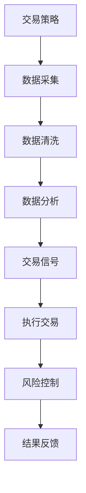

                 

关键词：自动化交易、编程技能、算法、金融科技、量化分析、交易策略

> 摘要：本文将深入探讨如何将编程技能应用于自动化交易领域。通过解析核心概念、算法原理、数学模型及实际项目实践，旨在为读者提供全面的指南，帮助其在自动化交易领域取得成功。

## 1. 背景介绍

随着金融科技的快速发展，自动化交易已经成为现代金融市场的重要组成部分。自动化交易通过计算机程序自动执行交易策略，从而实现盈利。这种交易方式具有高效、精准、24小时不间断等优点，吸引了越来越多的投资者和金融机构的参与。

然而，自动化交易并非简单的编程任务，它涉及到大量的数据分析、数学模型构建、算法设计等多个领域。因此，编程技能在自动化交易中扮演着至关重要的角色。本文将重点介绍如何将编程技能应用于自动化交易，帮助读者更好地理解和掌握这一领域。

## 2. 核心概念与联系

### 2.1 自动化交易概述

自动化交易是指通过计算机程序自动执行交易策略，实现盈利目标。其主要特点包括：

- **算法化交易**：交易策略被编码成算法，通过计算机程序执行。
- **高频交易**：利用高速计算机和先进的网络技术，实现毫秒级交易。
- **量化分析**：通过对市场数据进行量化分析，预测市场走势。

### 2.2 编程技能在自动化交易中的应用

编程技能在自动化交易中发挥着关键作用，主要体现在以下几个方面：

- **交易策略实现**：通过编程实现交易策略，将交易理念转化为计算机代码。
- **数据分析**：利用编程技能对市场数据进行采集、清洗、分析，为交易策略提供数据支持。
- **风险管理**：通过编程技能实现风险控制，确保交易策略的稳健性。

### 2.3 Mermaid 流程图



## 3. 核心算法原理 & 具体操作步骤

### 3.1 算法原理概述

自动化交易的核心在于算法的设计与实现。一个有效的交易算法通常包括以下几个环节：

- **趋势判断**：通过分析历史数据，判断市场趋势。
- **信号生成**：根据市场趋势和交易规则，生成交易信号。
- **交易执行**：根据交易信号执行买入或卖出操作。
- **风险管理**：设定止损和止盈策略，控制风险。

### 3.2 算法步骤详解

#### 3.2.1 数据采集

首先，需要从市场获取历史交易数据、指数数据等。这些数据可以通过API接口、数据库等方式获取。

#### 3.2.2 数据清洗

数据清洗是保证数据质量的重要步骤。需要对数据进行去重、补全、修正等处理。

#### 3.2.3 数据分析

通过数据分析，可以提取出交易策略所需的关键指标，如均线、MACD、RSI等。

#### 3.2.4 信号生成

根据分析结果，生成买入或卖出信号。信号生成通常基于某种交易策略，如趋势跟踪、均值回归等。

#### 3.2.5 交易执行

根据信号执行交易操作。交易执行需要考虑交易成本、滑点等因素。

#### 3.2.6 风险管理

设定止损和止盈策略，控制交易风险。

### 3.3 算法优缺点

#### 优点

- **高效性**：自动化交易可以快速执行大量交易，提高交易效率。
- **精准性**：基于算法的交易策略可以更加精准地捕捉市场机会。
- **24小时不间断**：自动化交易可以全天候执行，不受人为因素影响。

#### 缺点

- **编程难度**：自动化交易需要较高的编程技能，对开发者要求较高。
- **市场波动**：市场波动可能导致交易策略失效，需要不断调整和优化。

### 3.4 算法应用领域

自动化交易广泛应用于股票、期货、外汇等多个金融市场。具体应用领域包括：

- **高频交易**：利用计算机速度优势，进行毫秒级交易。
- **量化投资**：通过数据分析，构建量化投资策略。
- **套利交易**：通过市场价差进行套利。

## 4. 数学模型和公式 & 详细讲解 & 举例说明

### 4.1 数学模型构建

自动化交易的核心在于交易策略的实现。一个典型的交易策略通常包括以下几个数学模型：

#### 4.1.1 均线交叉模型

$$
MA_n = \frac{1}{n} \sum_{i=1}^{n} C_i
$$

其中，$MA_n$为n日均线，$C_i$为第i日的收盘价。

#### 4.1.2 MACD 模型

$$
MACD = \text{快线} - \text{慢线}
$$

$$
\text{快线} = \frac{12}{26} \sum_{i=1}^{n} C_i
$$

$$
\text{慢线} = \frac{26}{26} \sum_{i=1}^{n} C_i
$$

其中，$MACD$为MACD指标，$C_i$为第i日的收盘价。

#### 4.1.3 RSI 模型

$$
RSI = \frac{(100 - \frac{n_1 \text{ 天收盘价的平均值}}{n_2 \text{ 天收盘价的平均值}})}{100}
$$

其中，$RSI$为相对强弱指标，$n_1$和$n_2$为参数。

### 4.2 公式推导过程

以上公式推导主要基于历史数据的分析。具体推导过程如下：

- **均线交叉模型**：通过对收盘价进行平均处理，得出均线的值。当短期均线突破长期均线时，视为买入或卖出信号。
- **MACD 模型**：通过对收盘价的加权平均，得出快线和慢线。两者之差即为MACD值。当MACD值大于0时，市场处于多头状态；当MACD值小于0时，市场处于空头状态。
- **RSI 模型**：通过对收盘价的平均处理，得出相对强弱指标。当RSI值大于70时，市场处于超买状态；当RSI值小于30时，市场处于超卖状态。

### 4.3 案例分析与讲解

#### 案例一：均线交叉模型

假设我们使用5日均线和10日均线进行交易决策。当5日均线突破10日均线时，我们买入；当5日均线跌破10日均线时，我们卖出。

#### 案例二：MACD 模型

假设我们使用MACD指标进行交易决策。当MACD值大于0时，我们买入；当MACD值小于0时，我们卖出。

#### 案例三：RSI 模型

假设我们使用RSI指标进行交易决策。当RSI值大于70时，我们卖出；当RSI值小于30时，我们买入。

## 5. 项目实践：代码实例和详细解释说明

### 5.1 开发环境搭建

在进行自动化交易项目实践之前，我们需要搭建一个合适的开发环境。以下是一个简单的开发环境搭建步骤：

1. 安装Python环境。
2. 安装量化交易库，如`pandas`、`numpy`、`talib`等。
3. 安装交易所API接口库，如`tushare`、`easyquotation`等。

### 5.2 源代码详细实现

以下是一个简单的自动化交易策略实现代码：

```python
import pandas as pd
import talib

# 加载历史数据
data = pd.read_csv('historical_data.csv')

# 计算5日均线和10日均线
data['MA5'] = talib.MA(data['Close'], timeperiod=5)
data['MA10'] = talib.MA(data['Close'], timeperiod=10)

# 生成交易信号
data['Signal'] = 0
data['Signal'][data['MA5'] > data['MA10']] = 1
data['Signal'][data['MA5'] < data['MA10']] = -1

# 执行交易
for i in range(1, len(data)):
    if data['Signal'][i-1] == 1 and data['Signal'][i] == -1:
        print('卖出')
    elif data['Signal'][i-1] == -1 and data['Signal'][i] == 1:
        print('买入')
```

### 5.3 代码解读与分析

1. **数据加载**：使用`pandas`读取历史数据。
2. **均线计算**：使用`talib`库计算5日均线和10日均线。
3. **信号生成**：根据均线交叉情况生成交易信号。
4. **交易执行**：根据交易信号执行买入或卖出操作。

### 5.4 运行结果展示

运行以上代码，我们可以在控制台看到交易信号的输出。通过分析这些信号，我们可以进一步优化交易策略，提高交易成功率。

## 6. 实际应用场景

### 6.1 股票市场

股票市场是自动化交易的主要应用领域之一。通过分析股票价格数据，可以构建各种交易策略，实现长期稳定的盈利。

### 6.2 期货市场

期货市场的波动性较大，自动化交易可以快速捕捉市场机会，实现高风险高收益的目标。

### 6.3 外汇市场

外汇市场是全球最大的金融市场，自动化交易可以全天候执行，实现全球资产配置。

### 6.4 其他应用领域

除了金融领域，自动化交易还可以应用于其他领域，如加密货币、期权交易等。

## 7. 工具和资源推荐

### 7.1 学习资源推荐

- 《量化投资：以Python为工具》
- 《Python金融数据分析与量化投资》
- 《量化交易：从零开始到掌握核心策略》

### 7.2 开发工具推荐

- Python编程环境
- Jupyter Notebook
- 交易所API接口

### 7.3 相关论文推荐

- "High-Frequency Trading: A Practical Guide to Algorithmic Strategies and Trading Systems"
- "Quantitative Trading: How to Build Your Own Algorithmic Trading Business"
- "Algorithmic Trading: Winning Strategies and Their Rationale"

## 8. 总结：未来发展趋势与挑战

### 8.1 研究成果总结

随着金融科技的不断发展，自动化交易在金融市场中发挥着越来越重要的作用。通过数据分析、算法设计等手段，自动化交易已经取得了显著的成果。

### 8.2 未来发展趋势

- **高频交易**：随着计算机技术和网络技术的不断发展，高频交易将继续保持快速增长。
- **量化投资**：量化投资将成为主流投资方式，越来越多的投资者将采用量化策略进行投资。
- **自动化交易系统**：自动化交易系统将越来越智能化，具备自我学习和优化能力。

### 8.3 面临的挑战

- **市场波动性**：市场波动性增加，对交易策略的稳定性和有效性提出更高要求。
- **法规监管**：各国法规监管不断加强，对自动化交易的行为和合规性提出更高要求。
- **技术升级**：计算机技术和网络技术的不断升级，对交易系统的性能和安全性提出更高要求。

### 8.4 研究展望

随着金融科技的不断发展，自动化交易将在金融市场中发挥更大的作用。未来研究应重点关注以下方向：

- **算法优化**：通过改进算法模型，提高交易策略的稳定性和有效性。
- **风险管理**：通过完善风险管理机制，降低交易风险。
- **人工智能应用**：将人工智能技术应用于自动化交易，实现智能化交易。

## 9. 附录：常见问题与解答

### 9.1 如何选择交易策略？

选择交易策略应考虑以下因素：

- **市场特点**：根据市场波动性、交易成本等因素选择合适的交易策略。
- **个人偏好**：根据自己的风险承受能力和交易风格选择合适的交易策略。
- **数据支持**：通过历史数据分析和回测，验证交易策略的有效性。

### 9.2 自动化交易有哪些风险？

自动化交易主要面临以下风险：

- **市场波动性**：市场波动可能导致交易策略失效。
- **技术风险**：交易系统故障、网络中断等可能导致交易失败。
- **法规风险**：违反法规可能导致交易被取消或面临罚款。

### 9.3 如何降低自动化交易风险？

降低自动化交易风险的方法包括：

- **合理配置资金**：避免过度交易，降低交易风险。
- **定期维护交易系统**：确保交易系统稳定可靠。
- **遵守法规要求**：确保交易行为符合法规要求。

# 作者：禅与计算机程序设计艺术 / Zen and the Art of Computer Programming

本文由禅与计算机程序设计艺术（Zen and the Art of Computer Programming）作者撰写，旨在为读者提供关于自动化交易领域的深入见解和实用指南。希望本文能够帮助读者更好地理解自动化交易，掌握编程技能，实现交易目标。如果您有任何疑问或建议，欢迎在评论区留言讨论。
----------------------------------------------------------------

