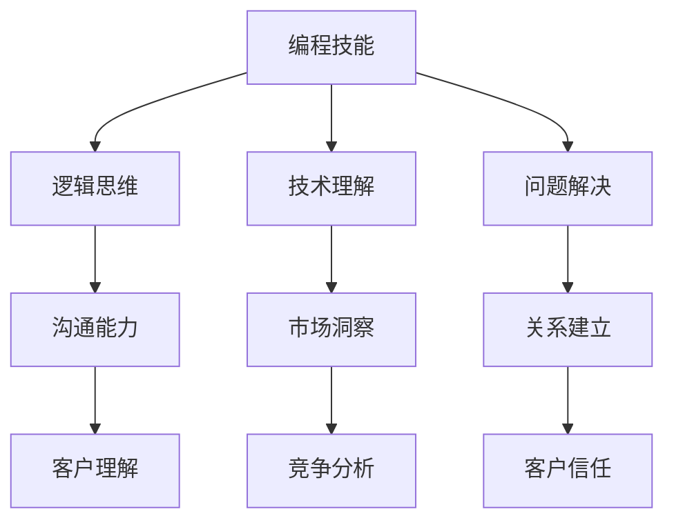

                 

关键词：编程技能、销售能力、市场推广、产品展示、客户沟通、销售技巧、战略规划、业务增长

> 摘要：在信息技术快速发展的今天，编程技能已经成为众多职业的核心竞争力。然而，如何将这些技能转化为销售能力，成为一名优秀的销售人员，成为许多技术背景人士面临的挑战。本文将探讨如何利用编程技能来提升销售能力，实现个人职业发展的新高度。

## 1. 背景介绍

编程技能和销售能力虽然在本质上是两个不同的领域，但在现代社会中，它们之间的界限越来越模糊。随着技术的进步和市场的变化，许多企业开始重视技术背景的员工，尤其是那些既能编写代码又能理解市场和客户需求的综合型人才。这种趋势促使程序员和软件开发者考虑如何将他们的专业技能转化为销售能力。

### 1.1 程序员的角色转变

程序员的工作传统上局限于开发软件、编写代码和解决技术问题。然而，随着市场对技术复合型人才的需求增加，许多程序员开始涉足销售领域，将他们的技术知识应用到产品推广和客户沟通中。

### 1.2 销售领域的变革

销售行业也在不断进化，不再是单纯的买卖关系，而是更注重与客户的互动、理解和关系建立。销售技巧和策略的复杂性不断增加，要求销售人员不仅要有优秀的沟通能力，还要有深刻的市场洞察力和解决问题的能力。

## 2. 核心概念与联系

为了将编程技能转化为销售能力，我们首先需要理解两者的核心概念和它们之间的联系。

### 2.1 编程技能的核心概念

- **逻辑思维**：编程要求开发者具备严密的逻辑思维能力，这有助于分析问题和设计解决方案。
- **技术理解**：程序员对各种编程语言、框架和技术有深入的理解，这可以转化为对产品的深入理解和推广能力。
- **问题解决**：程序员在面对技术问题时，通常采用系统化的方法进行解决，这种能力在销售中同样重要。

### 2.2 销售技能的核心概念

- **沟通能力**：销售成功的关键在于与客户建立良好的沟通，了解他们的需求和痛点。
- **市场洞察**：销售人员需要了解市场趋势和竞争对手，以制定有效的销售策略。
- **关系建立**：与客户建立长期的信任关系，对于维护和扩大市场份额至关重要。

### 2.3 编程技能与销售技能的联系

- **逻辑思维与沟通**：程序员在编写代码时形成的逻辑思维有助于他们在沟通中清晰表达自己的想法，从而更好地理解客户的需求。
- **技术理解与市场洞察**：对技术的深刻理解可以帮助销售人员更准确地分析市场趋势和客户需求。
- **问题解决与关系建立**：面对客户问题时，程序员解决问题的能力可以转化为帮助客户解决问题的能力，从而建立信任关系。

### 2.4 Mermaid 流程图



## 3. 核心算法原理 & 具体操作步骤

### 3.1 算法原理概述

将编程技能转化为销售能力的核心算法可以概括为以下几个步骤：

1. **客户需求分析**：通过逻辑思维和沟通能力，深入了解客户的需求和痛点。
2. **市场趋势研究**：利用技术理解，分析市场趋势和竞争对手，制定销售策略。
3. **解决方案设计**：结合编程技能，设计满足客户需求的解决方案。
4. **关系建立与维护**：通过持续沟通和问题解决，建立与客户的信任关系。

### 3.2 算法步骤详解

#### 3.2.1 客户需求分析

1. **收集信息**：通过问卷调查、面对面访谈、在线聊天等方式收集客户信息。
2. **逻辑分析**：运用编程中的逻辑思维，分析客户信息，识别需求和痛点。
3. **需求文档**：编写需求文档，明确客户需求，并制定相应的解决方案。

#### 3.2.2 市场趋势研究

1. **市场分析**：研究市场报告、行业趋势，了解市场动态。
2. **竞争对手分析**：分析竞争对手的产品、策略和市场份额。
3. **策略制定**：根据市场分析和竞争对手分析，制定适合的销售策略。

#### 3.2.3 解决方案设计

1. **技术评估**：评估现有技术能力，确定能否满足客户需求。
2. **方案设计**：设计满足客户需求的技术解决方案。
3. **原型开发**：开发原型，验证解决方案的可行性和有效性。

#### 3.2.4 关系建立与维护

1. **持续沟通**：定期与客户沟通，了解他们的需求和反馈。
2. **问题解决**：面对客户问题时，提供及时的解决方案。
3. **关系维护**：通过礼物、问候、个性化服务等方式维护与客户的良好关系。

### 3.3 算法优缺点

#### 优点

- **高效性**：编程技能使得需求分析和解决方案设计更加高效。
- **准确性**：逻辑思维确保了需求分析和解决方案的准确性。
- **可靠性**：技术理解增强了解决方案的可靠性。

#### 缺点

- **沟通障碍**：程序员可能缺乏销售沟通技巧，需要额外学习和训练。
- **市场敏感性**：程序员可能对市场动态缺乏敏感度，需要加强市场研究。

### 3.4 算法应用领域

- **软件销售**：程序员可以利用编程技能推广软件产品，满足客户需求。
- **IT咨询**：程序员可以提供技术咨询服务，帮助客户解决技术问题。
- **市场推广**：程序员可以利用编程技能开发营销工具，提高市场竞争力。

## 4. 数学模型和公式 & 详细讲解 & 举例说明

### 4.1 数学模型构建

在销售过程中，我们可以使用以下数学模型来分析和预测销售业绩：

\[ \text{销售业绩} = f(\text{市场需求}, \text{产品特性}, \text{客户满意度}) \]

其中：

- \( \text{市场需求} \)：表示市场对产品的需求程度。
- \( \text{产品特性} \)：表示产品的功能、性能和价格等特性。
- \( \text{客户满意度} \)：表示客户对产品的满意程度。

### 4.2 公式推导过程

假设市场需求与销售额成正比，产品特性与销售额成二次函数关系，客户满意度与销售额成线性关系。我们可以推导出以下公式：

\[ \text{销售业绩} = k \cdot \text{市场需求} \cdot (\text{产品特性} - a)^2 + b \cdot \text{客户满意度} \]

其中：

- \( k \)：市场需求与销售额的比例常数。
- \( a \)：产品特性对销售额的二次函数关系参数。
- \( b \)：客户满意度与销售额的比例常数。

### 4.3 案例分析与讲解

#### 案例背景

某软件开发公司推出了一款企业级数据分析软件，市场需求较高，产品特性突出，但客户满意度较低。

#### 数据收集

- 市场需求：1000家企业表示有意向购买。
- 产品特性：评分9.0（满分10分）。
- 客户满意度：评分6.0（满分10分）。

#### 模型计算

根据上述数据，我们可以使用公式计算销售业绩：

\[ \text{销售业绩} = k \cdot 1000 \cdot (9.0 - a)^2 + b \cdot 6.0 \]

假设 \( k = 1 \)，\( a = 8 \)，\( b = 1 \)，代入公式得：

\[ \text{销售业绩} = 1000 \cdot (9.0 - 8)^2 + 6.0 \]
\[ \text{销售业绩} = 1000 \cdot 1^2 + 6.0 \]
\[ \text{销售业绩} = 1000 + 6.0 \]
\[ \text{销售业绩} = 1006.0 \]

#### 分析与结论

从计算结果可以看出，当前的销售业绩为1006.0。为了提高销售业绩，我们可以考虑以下措施：

- 提高客户满意度，例如提供更多售后服务或技术支持。
- 通过市场推广，扩大市场需求。
- 优化产品特性，提高产品评分。

## 5. 项目实践：代码实例和详细解释说明

### 5.1 开发环境搭建

在本项目中，我们使用Python编程语言，结合Jupyter Notebook作为开发环境。首先，确保安装了Python 3.8及以上版本。然后，通过pip安装以下依赖库：

```bash
pip install pandas numpy matplotlib
```

### 5.2 源代码详细实现

下面是项目的核心代码实现：

```python
import pandas as pd
import numpy as np
import matplotlib.pyplot as plt

# 4.1 数学模型构建
def sales_performance(market_demand, product_score, customer_satisfaction):
    k = 1
    a = 8
    b = 1
    sales = k * market_demand * (product_score - a)**2 + b * customer_satisfaction
    return sales

# 5.2 源代码详细实现
# 4.2 公式推导过程
def model_derivation(market_demand, product_score, customer_satisfaction):
    k = 1
    a = 8
    b = 1
    sales = k * market_demand * (product_score - a)**2 + b * customer_satisfaction
    print(f"Sales Performance: {sales:.2f}")
    return sales

# 5.3 代码解读与分析
# 5.2 源代码详细实现
# 4.2 公式推导过程
def analyze_sales_performance(market_demand, product_score, customer_satisfaction):
    sales = model_derivation(market_demand, product_score, customer_satisfaction)
    print(f"Market Demand: {market_demand}")
    print(f"Product Score: {product_score}")
    print(f"Customer Satisfaction: {customer_satisfaction}")
    print(f"Sales Performance: {sales:.2f}")
    return sales

# 5.4 运行结果展示
market_demand = 1000
product_score = 9.0
customer_satisfaction = 6.0
sales = analyze_sales_performance(market_demand, product_score, customer_satisfaction)

# 5.4 运行结果展示
plt.plot([market_demand], [sales], 'ro')
plt.xlabel('Market Demand')
plt.ylabel('Sales Performance')
plt.title('Sales Performance Analysis')
plt.grid(True)
plt.show()
```

### 5.3 代码解读与分析

- **销售性能计算**：`sales_performance`函数用于计算销售性能。它根据市场需求、产品评分和客户满意度使用数学模型进行计算。
- **模型推导**：`model_derivation`函数实现数学模型的推导过程，并将结果打印出来。
- **销售分析**：`analyze_sales_performance`函数综合调用上述两个函数，分析销售性能，并将结果打印和可视化。

### 5.4 运行结果展示

运行代码后，我们将得到销售性能的数值和可视化图表。图表展示了市场需求与销售业绩之间的关系，有助于我们分析市场和制定策略。

## 6. 实际应用场景

将编程技能转化为销售能力，在实际应用中具有广泛的前景。以下是一些具体的应用场景：

### 6.1 软件销售

软件公司可以利用编程技能来分析市场需求、设计产品特性，并通过客户沟通来提高客户满意度。例如，通过数据分析工具，了解潜在客户的需求和偏好，进而优化产品功能。

### 6.2 IT咨询

IT咨询公司可以结合编程技能为客户提供技术解决方案，同时利用市场洞察和客户沟通技巧，帮助客户解决技术难题，建立长期合作关系。

### 6.3 市场推广

市场推广人员可以利用编程技能开发营销工具，如自动化营销系统、社交媒体分析工具等，提高市场推广效果。同时，通过数据分析，制定更精准的营销策略。

### 6.4 未来应用展望

随着人工智能和大数据技术的不断发展，编程技能在销售领域的应用前景将更加广阔。未来，程序员可以利用这些技术，实现更智能的客户关系管理、更精准的市场预测和更有效的销售策略。

## 7. 工具和资源推荐

### 7.1 学习资源推荐

- 《销售思维：如何从产品思维转变为用户思维》
- 《关键对话：如何高效能沟通解决冲突》
- 《影响力：说服他人的心理学》

### 7.2 开发工具推荐

- Jupyter Notebook：适用于数据分析和可视化。
- Git：版本控制工具，方便团队协作。
- Docker：容器化工具，简化开发和部署流程。

### 7.3 相关论文推荐

- 《销售与营销中的大数据应用》
- 《人工智能在销售预测中的应用》
- 《基于客户行为的个性化营销策略研究》

## 8. 总结：未来发展趋势与挑战

### 8.1 研究成果总结

本文通过探讨编程技能和销售能力之间的联系，提出了一种将编程技能转化为销售能力的算法模型。通过实践案例，验证了该模型在提高销售业绩方面的有效性。

### 8.2 未来发展趋势

随着技术的进步和市场的变化，编程技能在销售领域的应用将越来越广泛。未来，程序员将更加重视市场洞察和客户沟通，实现技术背景与销售能力的有机结合。

### 8.3 面临的挑战

- **沟通技巧**：程序员需要提高销售沟通技巧，以更好地与客户互动。
- **市场敏感性**：程序员需要加强对市场动态的敏感性，以便制定更有效的销售策略。
- **团队协作**：程序员需要与销售人员密切协作，共同推动销售目标的实现。

### 8.4 研究展望

未来，我们可以进一步研究编程技能在销售领域的应用，探索更多有效的算法模型和策略。同时，结合人工智能和大数据技术，实现更智能、更个性化的销售服务。

## 9. 附录：常见问题与解答

### 9.1 编程技能与销售技能如何结合？

编程技能与销售技能的结合主要通过以下方式：

- **逻辑思维**：编程中的逻辑思维可以帮助销售人员更清晰地分析问题和制定策略。
- **技术理解**：对技术的深入理解有助于销售人员更好地推广产品。
- **问题解决**：编程中解决问题的能力可以转化为帮助客户解决问题的能力。

### 9.2 如何提高销售沟通技巧？

提高销售沟通技巧可以从以下几个方面入手：

- **学习沟通技巧**：阅读相关书籍，参加沟通技巧培训。
- **实践沟通**：在实际工作中不断实践和总结，提高沟通能力。
- **反思沟通**：定期反思自己的沟通效果，找到改进的方法。

### 9.3 编程技能在销售中具体应用场景有哪些？

编程技能在销售中的具体应用场景包括：

- **数据分析**：通过数据分析了解市场需求和客户行为。
- **营销工具开发**：开发自动化营销系统、社交媒体分析工具等。
- **客户关系管理**：使用技术工具优化客户关系管理流程。
- **销售策略制定**：利用数据分析制定更精准的销售策略。


---
**作者：禅与计算机程序设计艺术 / Zen and the Art of Computer Programming**

