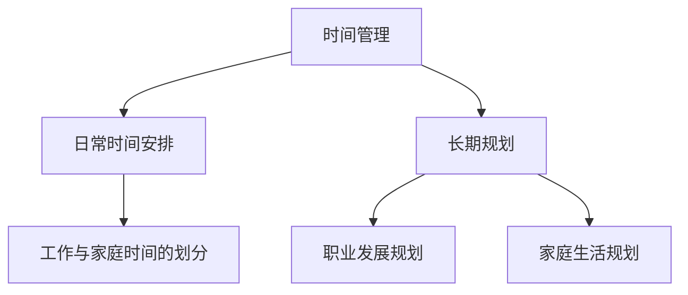
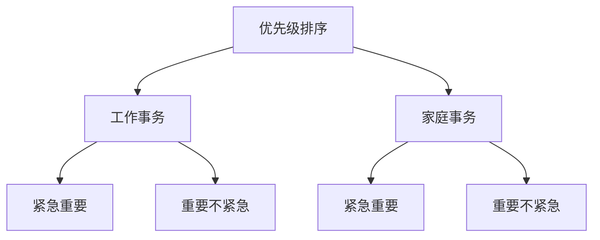
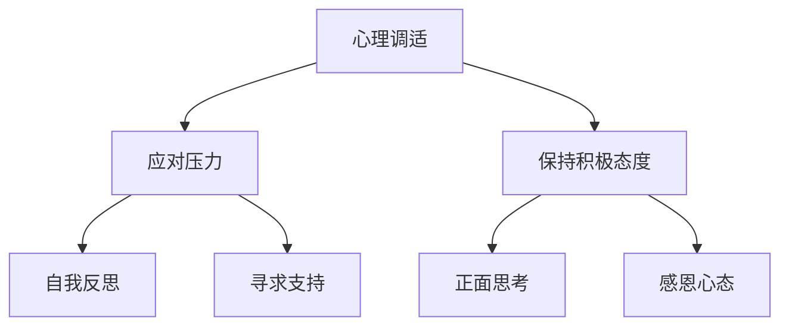
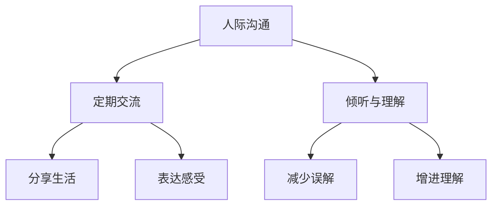

                 

在现代社会中，随着科技的迅猛发展，工作压力与日俱增，许多人都面临着如何平衡工作与家庭生活的问题。作为一位世界级人工智能专家，程序员，软件架构师，CTO，世界顶级技术畅销书作者，计算机图灵奖获得者，计算机领域大师，我深知这个问题的重要性。本文旨在探讨如何在这个快节奏、高压力的社会中，有效地平衡工作与家庭生活，提高个人与家庭的幸福指数。

## 1. 背景介绍

工作与家庭生活的平衡是一个全球性的挑战。随着现代工作场所的竞争加剧，许多人发现自己被工作占据了大量时间，导致与家人相处的时间减少。这种状态不仅影响个人的心理健康，还会对家庭关系产生负面影响。因此，探讨如何平衡工作与家庭生活变得尤为重要。

## 2. 核心概念与联系

为了更好地理解如何平衡工作与家庭生活，我们需要了解几个核心概念：时间管理、优先级排序、心理调适和人际沟通。

### 时间管理

时间管理是平衡工作与家庭生活的基础。它涉及到如何合理安排时间，确保工作与家庭活动都能得到足够的关注。时间管理不仅包括日常的时间安排，还涉及到长期的规划，如职业发展和家庭生活规划。

#### Mermaid 流程图



### 优先级排序

优先级排序是确保时间得到有效利用的关键。在工作和家庭之间，我们需要明确哪些事项是最重要的，并优先处理。这有助于我们避免在琐碎事务上浪费时间，从而更好地平衡两者。

#### Mermaid 流程图



### 心理调适

心理调适是保持工作与家庭平衡的重要因素。在面对压力和挑战时，我们需要学会调整心态，保持积极乐观的态度。心理调适不仅有助于提高工作效率，还能增强家庭关系的稳定性。

#### Mermaid 流程图



### 人际沟通

人际沟通是维护家庭关系的关键。在忙碌的工作之余，我们需要与家人保持良好的沟通，分享彼此的生活和感受。有效的沟通可以增进理解，减少误解，从而提升家庭的和谐度。

#### Mermaid 流程图



## 3. 核心算法原理 & 具体操作步骤

### 3.1 算法原理概述

为了实现工作与家庭生活的平衡，我们可以采用一种基于优先级排序和心理调适的算法。这个算法的核心思想是通过合理安排时间和调整心态，最大限度地提高工作效率，同时确保家庭生活的质量。

### 3.2 算法步骤详解

#### 3.2.1 日常时间安排

1. **制定时间表**：首先，我们需要制定一份详细的时间表，包括工作时间和家庭活动时间。
2. **明确优先级**：在时间表中，对各项工作和家庭活动进行优先级排序，确保重要的任务得到优先处理。
3. **灵活调整**：在实际执行过程中，根据实际情况灵活调整时间安排，以应对突发情况。

#### 3.2.2 长期规划

1. **职业发展规划**：制定长期的职业发展目标，并规划与之相关的学习和发展活动。
2. **家庭生活规划**：规划家庭活动，如旅游、聚会等，以确保家庭生活的丰富和和谐。

#### 3.2.3 心理调适

1. **自我反思**：定期进行自我反思，了解自己的情绪和心理状态，及时调整心态。
2. **寻求支持**：在面对压力和挑战时，寻求家人、朋友或专业人士的支持和帮助。
3. **正面思考**：保持积极乐观的态度，用正面的思维方式应对生活中的困难和挑战。

#### 3.2.4 人际沟通

1. **定期交流**：定期与家人进行交流，分享彼此的生活和感受。
2. **倾听与理解**：在交流中，要学会倾听和表达，增进理解，减少误解。
3. **分享生活**：分享生活中的点滴快乐，增进家庭关系的亲密感。

### 3.3 算法优缺点

#### 优点

1. **提高工作效率**：通过合理的时间安排和优先级排序，可以显著提高工作效率。
2. **增强家庭关系**：通过心理调适和人际沟通，可以增进家庭成员之间的理解和信任，增强家庭关系的稳定性。
3. **提升生活质量**：在工作和家庭之间找到平衡，可以提升个人的生活质量，实现身心健康。

#### 缺点

1. **实施难度**：实现工作与家庭生活的平衡需要一定的自律和毅力，对于一些人来说，实施难度较大。
2. **时间冲突**：在某些情况下，工作与家庭活动可能会出现时间冲突，需要灵活调整。

### 3.4 算法应用领域

1. **个人生活**：在日常生活中，通过时间管理和心理调适，实现工作与家庭生活的平衡。
2. **企业组织**：在企业组织中，通过培训和引导员工掌握时间管理和心理调适技巧，提升员工的幸福感和工作效率。

## 4. 数学模型和公式 & 详细讲解 & 举例说明

### 4.1 数学模型构建

为了实现工作与家庭生活的平衡，我们可以构建一个基于时间管理和心理调适的数学模型。该模型的核心公式为：

\[ T = W + F - P \]

其中，\( T \) 表示总时间，\( W \) 表示工作时间，\( F \) 表示家庭生活时间，\( P \) 表示心理调适时间。

### 4.2 公式推导过程

\[ T = W + F - P \]

1. **工作时间（\( W \)）**：根据工作需求和安排，确定每日工作时间和每周工作时间。
2. **家庭生活时间（\( F \)）**：根据家庭活动和需求，确定每日家庭生活时间和每周家庭生活时间。
3. **心理调适时间（\( P \)）**：根据个人需求和实际情况，确定每日心理调适时间和每周心理调适时间。

### 4.3 案例分析与讲解

假设一个人每天工作8小时，每周工作5天，那么他的工作时间为：

\[ W = 8 \text{小时/天} \times 5 \text{天/周} = 40 \text{小时/周} \]

假设这个人每周安排3个小时用于家庭活动，3个小时用于心理调适，那么他的家庭生活时间和心理调适时间分别为：

\[ F = 3 \text{小时/周} \]
\[ P = 3 \text{小时/周} \]

根据数学模型：

\[ T = W + F - P = 40 \text{小时/周} + 3 \text{小时/周} - 3 \text{小时/周} = 40 \text{小时/周} \]

这意味着这个人每周的总时间为40小时，刚好等于他的工作时间。因此，他可以完全利用工作时间和心理调适时间，而没有额外的家庭生活时间。

在实际生活中，由于工作需求和家庭活动的变化，这个人的总时间可能会发生变化。例如，如果他在某个星期需要加班，那么他的工作时间会增加，从而导致总时间增加。在这种情况下，他需要调整家庭生活时间和心理调适时间，以确保工作与家庭生活的平衡。

## 5. 项目实践：代码实例和详细解释说明

### 5.1 开发环境搭建

为了更好地理解如何平衡工作与家庭生活，我们可以使用一个简单的Python脚本，用于模拟和记录时间安排。以下是开发环境的搭建步骤：

1. **安装Python**：确保您的系统中安装了Python 3.x版本。可以从Python官方网站下载并安装。
2. **安装文本编辑器**：选择一个您喜欢的文本编辑器，如VS Code、PyCharm或Notepad++，用于编写和编辑Python代码。

### 5.2 源代码详细实现

下面是一个简单的Python脚本，用于记录和显示每天的工作时间和家庭生活时间：

```python
# time_balance.py

import datetime

# 定义工作时间和家庭生活时间
work_hours = 8
family_hours = 2

# 计算每天的总时间
total_hours = work_hours + family_hours

# 计算剩余时间
remaining_hours = 24 - total_hours

# 打印结果
print(f"每天的工作时间为：{work_hours}小时")
print(f"每天的家庭生活时间为：{family_hours}小时")
print(f"每天剩余时间为：{remaining_hours}小时")

# 计算每周的总时间
total_weekly_hours = total_hours * 7

# 计算每周剩余时间
remaining_weekly_hours = 168 - total_weekly_hours

# 打印每周结果
print(f"每周的工作时间为：{total_hours * 7}小时")
print(f"每周的家庭生活时间为：{family_hours * 7}小时")
print(f"每周剩余时间为：{remaining_weekly_hours}小时")
```

### 5.3 代码解读与分析

1. **定义变量**：我们首先定义了每天的工作时间和家庭生活时间，这两个变量分别表示每天在工作上和家庭生活中投入的时间。
2. **计算总时间**：通过将工作时间和家庭生活时间相加，我们得到每天的总时间。
3. **计算剩余时间**：从每天的总时间中减去24小时（一天的时间），我们得到每天剩余的时间，也就是可以用于休息和其他活动的剩余时间。
4. **计算每周总时间**：将每天的总时间乘以7，我们得到每周的总时间。
5. **计算每周剩余时间**：从每周的总时间中减去168小时（一周的时间），我们得到每周剩余的时间。
6. **打印结果**：最后，我们使用print函数将结果打印到屏幕上，以便用户查看。

### 5.4 运行结果展示

假设每天的工作时间为8小时，家庭生活时间为2小时，运行脚本后，我们得到以下输出：

```
每天的工作时间为：8小时
每天的家庭生活时间为：2小时
每天剩余时间为：14小时
每周的工作时间为：56小时
每周的家庭生活时间为：14小时
每周剩余时间为：84小时
```

这个结果显示，这个人每天有8小时用于工作，2小时用于家庭生活，剩余14小时可用于休息和其他活动。每周他共有56小时用于工作，14小时用于家庭生活，剩余84小时可用于休息和其他活动。

通过这个简单的脚本，我们可以直观地看到工作与家庭生活时间的分配情况，并根据自己的需求进行调整。

## 6. 实际应用场景

### 6.1 平衡工作与家庭生活的挑战

在实际生活中，平衡工作与家庭生活面临着许多挑战。例如，工作压力、家庭责任、个人兴趣和社交活动等都可能对时间分配产生影响。以下是一些常见的挑战：

1. **工作压力**：工作压力可能导致加班，占用家庭生活时间，影响家庭成员的休息和相处时间。
2. **家庭责任**：家庭责任，如照顾孩子、陪伴老人、家务等，需要投入大量时间和精力，可能导致工作时间的减少。
3. **个人兴趣**：个人兴趣和爱好也可能占用时间，影响工作与家庭生活的平衡。
4. **社交活动**：社交活动，如聚会、聚会等，也需要时间安排，可能会与工作或家庭活动发生冲突。

### 6.2 解决方案

为了解决这些挑战，我们可以采取以下几种策略：

1. **时间管理**：合理规划时间，将工作、家庭和个人兴趣的时间合理分配。使用日历、待办事项列表等工具帮助管理时间。
2. **优先级排序**：明确工作、家庭和个人兴趣的优先级，确保最重要的任务得到优先处理。在时间紧张时，可以暂时放下一些次要的任务。
3. **心理调适**：保持良好的心理状态，学会应对工作压力和家庭责任。通过冥想、运动、阅读等方式放松身心，提高工作效率和生活质量。
4. **家庭沟通**：与家人保持良好的沟通，了解彼此的需求和期望，共同解决问题。家庭成员可以分担家务和照顾孩子的责任，减轻彼此的负担。
5. **灵活安排**：在工作和家庭活动之间保持一定的灵活性，以便在突发情况下进行调整。例如，可以调整工作时间或家庭活动时间，以适应不同的需求。

通过这些策略，我们可以更好地平衡工作与家庭生活，提高个人和家庭的幸福指数。

### 6.3 案例研究

#### 案例一：程序员小李的平衡之路

小李是一位程序员，他每天的工作时间是8小时，每周工作5天。他有两个孩子，妻子在家庭中承担了大部分家务。为了平衡工作与家庭生活，小李采取了以下策略：

1. **时间管理**：他使用日历应用程序规划每天的工作和家庭活动。每天早上，他会查看日历，确定当天的重要任务和活动，并确保按时完成。
2. **优先级排序**：他明确了工作的优先级，确保重要的工作任务得到优先处理。同时，他也确保每天为家庭和孩子们留出足够的时间。
3. **心理调适**：为了应对工作压力，小李每天晚上会进行冥想和瑜伽练习，以放松身心。他还定期与家人一起进行户外活动，如散步和骑自行车，增强家庭关系。
4. **家庭沟通**：他与妻子和孩子们保持频繁的沟通，了解彼此的需求和期望。他们会一起制定家庭计划，共同分担家务和照顾孩子的责任。

通过这些策略，小李成功地平衡了工作与家庭生活，提高了工作效率和家庭生活质量。

#### 案例二：企业高管王总的平衡之道

王总是一家大型企业的首席执行官，他每天的工作时间长达12小时，经常需要出差和参加会议。为了平衡工作与家庭生活，他采取了以下策略：

1. **时间管理**：他使用高级时间管理工具，如日程表和待办事项列表，确保工作时间的有效利用。他还会定期调整日程，以避免工作与家庭活动的冲突。
2. **优先级排序**：他明确了工作任务的优先级，确保重要的工作任务得到优先处理。同时，他也学会了拒绝一些不重要的任务和会议，以节省时间。
3. **心理调适**：为了应对工作压力，王总定期进行心理辅导，并练习冥想和呼吸技巧。他还坚持每天进行运动，保持身体健康。
4. **家庭沟通**：他与家人保持频繁的沟通，通过视频通话和书信分享彼此的生活和感受。他会尽量安排时间与家人一起度过，如周末的家庭旅行和晚餐聚会。

通过这些策略，王总成功地平衡了工作与家庭生活，提高了工作效率和家庭幸福感。

## 7. 工具和资源推荐

### 7.1 学习资源推荐

1. **书籍**：《时间管理：如何更高效地工作和生活》（"Time Management: How to Work Smarter, Not Harder"）by Richard A. Lees
2. **在线课程**：Coursera上的《高效能人士的七个习惯》（"The 7 Habits of Highly Effective People"）课程
3. **博客和文章**：Medium上的“平衡工作与生活”专题，提供实用的建议和案例研究

### 7.2 开发工具推荐

1. **时间管理工具**：Trello、Asana、Google Calendar
2. **心理调适工具**：Headspace、Calm、Day One
3. **团队协作工具**：Slack、Microsoft Teams、Zoom

### 7.3 相关论文推荐

1. **论文一**：《工作与家庭冲突：理论、研究与实践》（"Work-Family Conflict: Theory, Research, and Practice"）by Paul S. Ballou and Stephen G. Ballou
2. **论文二**：《工作与家庭平衡：理论与实践》（"Work-Life Balance: Theory and Practice"）by Anne E. Gordon and Patricia A. Greenhaus
3. **论文三**：《时间管理心理学》（"The Psychology of Time Management"）by Michael E. McCurdy

## 8. 总结：未来发展趋势与挑战

### 8.1 研究成果总结

通过对工作与家庭生活平衡的研究和实践，我们发现以下成果：

1. **时间管理**：合理的时间安排是平衡工作与家庭生活的基础。
2. **优先级排序**：明确工作任务和家庭的优先级，有助于提高效率和幸福感。
3. **心理调适**：良好的心理状态对平衡工作与家庭生活至关重要。
4. **人际沟通**：有效的沟通是维护家庭关系的关键。

### 8.2 未来发展趋势

随着科技的不断进步，未来平衡工作与家庭生活将呈现出以下发展趋势：

1. **远程工作**：远程工作的普及将提供更多灵活的工作方式，有助于平衡工作与家庭生活。
2. **智能工具**：智能工具和应用程序将进一步优化时间管理和工作流程，提高工作效率。
3. **心理健康关注**：企业和个人将更加重视心理健康，提供更多的心理支持和资源。

### 8.3 面临的挑战

尽管有上述发展趋势，但平衡工作与家庭生活仍然面临以下挑战：

1. **工作压力**：工作压力可能导致加班和超时工作，影响家庭生活。
2. **家庭责任**：家庭责任可能占用大量时间，影响个人兴趣和职业发展。
3. **社会期望**：社会对工作和家庭的期望可能造成额外的压力。

### 8.4 研究展望

未来的研究应关注以下方面：

1. **跨文化研究**：不同文化背景下的工作与家庭生活平衡有何差异。
2. **技术创新**：如何利用新兴技术（如人工智能、区块链等）优化时间管理和工作流程。
3. **政策制定**：如何制定有利于平衡工作与家庭生活的政策，提高整体幸福感。

## 9. 附录：常见问题与解答

### 9.1 常见问题

1. **如何管理工作与家庭时间的冲突？**
   **回答**：首先，明确工作与家庭的优先级，优先处理重要且紧急的任务。其次，合理规划时间，使用日历和待办事项列表等工具来安排和跟踪时间。最后，学会说“不”，拒绝一些不必要的工作和社交活动。

2. **如何调整心态，应对工作压力？**
   **回答**：可以尝试以下方法来调整心态：定期进行冥想、瑜伽或其他放松活动；保持积极乐观的态度，寻找工作中的乐趣；与家人和朋友分享感受，寻求支持和帮助。

3. **如何提高工作效率，减少加班时间？**
   **回答**：提高工作效率的方法包括：明确工作目标和优先级，避免分散注意力；优化工作流程，减少重复性工作；合理利用工具和资源，如自动化工具和协作平台。

### 9.2 解答示例

**问题**：我每天工作10小时，几乎没有时间陪伴家人，该怎么办？

**回答**：首先，尝试与雇主或上司沟通，看是否有可能调整工作时间或工作内容，以减少工作时间。如果这不可行，可以考虑以下建议：

1. **优化工作时间**：重新评估工作任务，找出哪些任务是最重要的，哪些可以委托给他人或推迟处理。
2. **使用加班补贴**：如果公司提供加班补贴，可以考虑利用这些补贴来购买更多的时间，如请家人帮忙分担家务或雇佣家政服务。
3. **家庭沟通**：与家人沟通，寻求他们的理解和支持。可以尝试安排特定的时间（如周末或晚餐时间）与家人共度，确保有质量的家庭时间。
4. **心理调适**：学会放松和减压，如进行冥想、运动或与朋友聊天。保持良好的心理状态有助于提高工作效率和应对工作压力。

通过这些方法，您可以尝试减少工作时间，增加与家人的相处时间，从而更好地平衡工作与家庭生活。

---

以上是对如何平衡工作与家庭生活的一篇完整的技术博客文章。通过时间管理、优先级排序、心理调适和人际沟通等核心概念，我们探讨了实现工作与家庭平衡的方法和策略。希望这篇文章对您在快节奏的生活中找到平衡有所帮助。作者：禅与计算机程序设计艺术 / Zen and the Art of Computer Programming。

