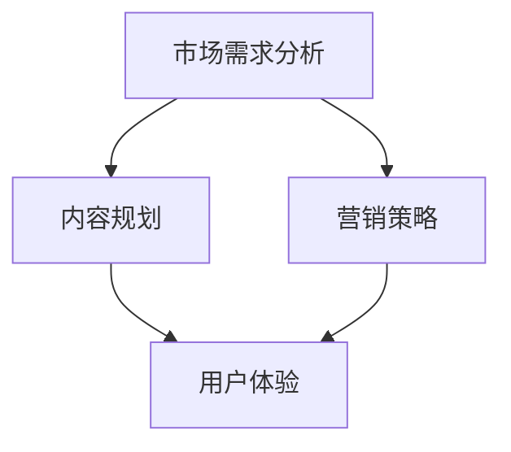

                 

关键词：知识付费、线下沙龙、营销策略、用户体验、活动策划

摘要：本文旨在探讨如何打造个人知识付费线下沙龙，通过分析市场需求、规划沙龙内容、设计营销策略和优化用户体验等方面，为个人知识付费者提供一套完整的活动策划方案。通过本文的指导，您将能够有效地提升个人知识付费沙龙的吸引力和影响力，为您的职业发展增添新的动力。

## 1. 背景介绍

随着互联网的快速发展，知识付费已经成为一个新兴的市场。越来越多的个人和机构开始通过线上平台提供各种知识和技能课程，满足了不同用户的学习需求。然而，随着市场同质化竞争的加剧，单纯依靠线上平台的知识付费模式已经难以满足用户对于深度互动和现场体验的需求。此时，线下沙龙作为一种新兴的知识分享形式，逐渐成为个人知识付费者拓展影响力的新途径。

线下沙龙作为一种面对面的交流方式，能够提供更为真实和深入的互动体验，有助于建立用户信任和增强用户粘性。对于个人知识付费者而言，通过线下沙龙，不仅可以分享自己的知识和经验，还能够拓展人脉资源，提升个人品牌价值。然而，如何有效地策划和运营线下沙龙，仍然是一个值得深入探讨的问题。

本文将从市场需求、内容规划、营销策略和用户体验等多个方面，为您详细解析如何打造一个成功的个人知识付费线下沙龙。通过本文的指导，您将能够掌握线下沙龙策划的关键要点，为您的知识付费事业开辟新的增长点。

## 2. 核心概念与联系

### 2.1 市场需求分析

在策划个人知识付费线下沙龙之前，首先需要对市场需求进行深入分析。通过市场调研，了解目标用户群体的特征、需求和痛点，是确保沙龙成功的关键。

- **用户特征**：目标用户群体的年龄、职业、收入水平、教育背景等信息有助于您更好地了解他们的需求和偏好。

- **用户需求**：分析用户在知识付费领域的关注点，如技能提升、行业趋势、实战经验等，是确定沙龙主题的重要依据。

- **用户痛点**：了解用户在学习和成长过程中遇到的困难和问题，可以为您设计有针对性的沙龙内容提供参考。

### 2.2 内容规划

沙龙内容是吸引用户参与的核心因素。在内容规划方面，应遵循以下原则：

- **针对性**：根据用户需求，设计具有针对性的课程和话题，确保内容能够解决用户的实际问题。

- **实用性**：课程内容应具有实际应用价值，帮助用户提高技能水平和解决实际问题。

- **新颖性**：不断更新和丰富课程内容，引入新的观点和实战案例，保持沙龙的新鲜感和吸引力。

### 2.3 营销策略

成功的营销策略是沙龙成功的重要保障。以下是一些关键点：

- **目标人群定位**：明确目标人群，通过精准的营销手段，将沙龙信息传递给潜在用户。

- **渠道选择**：根据目标人群的喜好和使用习惯，选择合适的推广渠道，如社交媒体、专业论坛、线上社群等。

- **内容营销**：通过优质的内容吸引潜在用户，如撰写博客文章、发布短视频、制作海报等。

- **优惠活动**：通过限时优惠、团购、会员制度等激励措施，提高用户参与度和复购率。

### 2.4 用户体验

良好的用户体验是沙龙成功的关键。以下是一些建议：

- **现场布置**：精心布置沙龙现场，创造舒适、专业的氛围，提升用户的参与感。

- **互动环节**：设置互动环节，鼓励用户提问和讨论，增强参与感。

- **后续服务**：提供后续学习资源和支持，如线上答疑、社群交流等，增强用户粘性。

### 2.5 Mermaid 流程图

以下是一个简化的Mermaid流程图，展示了从市场需求分析到用户体验的整个沙龙策划过程：



## 3. 核心算法原理 & 具体操作步骤

### 3.1 算法原理概述

沙龙策划的核心算法可以理解为一种基于用户需求的“智能匹配”机制。该机制通过以下步骤实现：

1. **用户需求分析**：通过对用户特征、需求和痛点的分析，确定沙龙的主题和内容。
2. **内容策划**：根据用户需求，设计具有针对性的课程和话题。
3. **营销策略制定**：基于用户需求和内容，制定相应的营销策略，以吸引潜在用户。
4. **用户体验优化**：通过现场布置、互动环节设置等手段，提升用户的参与感和满意度。

### 3.2 算法步骤详解

1. **用户需求分析**：
   - **数据收集**：通过问卷调查、访谈等方式，收集用户的基本信息和需求。
   - **数据整理**：对收集到的数据进行分析和整理，提取有用的信息。
   - **需求分析**：基于数据分析结果，确定用户的主要需求和关注点。

2. **内容策划**：
   - **主题确定**：根据用户需求，确定沙龙的主题。
   - **课程设计**：设计具有实际应用价值的课程内容，确保内容新颖、实用。
   - **话题设置**：设置与主题相关的讨论话题，鼓励用户参与和互动。

3. **营销策略制定**：
   - **目标人群定位**：明确目标用户群体，确保营销策略的精准性。
   - **渠道选择**：根据目标人群的喜好和使用习惯，选择合适的推广渠道。
   - **内容营销**：通过撰写博客文章、发布短视频、制作海报等方式，进行内容营销。
   - **优惠活动**：设计限时优惠、团购、会员制度等激励措施，提高用户参与度和复购率。

4. **用户体验优化**：
   - **现场布置**：精心布置沙龙现场，创造舒适、专业的氛围。
   - **互动环节**：设置互动环节，鼓励用户提问和讨论，增强参与感。
   - **后续服务**：提供后续学习资源和支持，如线上答疑、社群交流等。

### 3.3 算法优缺点

**优点**：
- **针对性强**：通过用户需求分析，确保沙龙内容具有针对性，能够满足用户的实际需求。
- **互动性强**：线下沙龙提供了面对面的互动机会，有助于建立用户信任和增强用户粘性。
- **品牌价值提升**：通过线下活动，个人知识付费者可以提升个人品牌价值，拓展人脉资源。

**缺点**：
- **成本较高**：线下沙龙需要投入较多的人力和物力资源，运营成本较高。
- **时间受限**：线下沙龙的时间和地点受限，可能无法满足所有用户的参与需求。
- **效果评估难度大**：线下沙龙的效果评估相对困难，需要通过后续的用户反馈和参与度来衡量。

### 3.4 算法应用领域

沙龙策划算法可以应用于多个领域，包括但不限于：

- **教育培训**：通过沙龙活动，提高课程的影响力和用户参与度。
- **企业培训**：为企业提供定制化的培训解决方案，提升员工技能和团队凝聚力。
- **行业交流**：为业内人士提供交流平台，促进行业发展和创新。
- **社群运营**：通过沙龙活动，增强社群成员的互动和归属感。

## 4. 数学模型和公式 & 详细讲解 & 举例说明

### 4.1 数学模型构建

在沙龙策划过程中，可以使用一些数学模型来评估沙龙的效果和优化策略。以下是一个简单的数学模型，用于评估沙龙的参与度和满意度。

#### 参与度评估模型

参与度 = （实际参与人数 / 潜在用户人数）× 100%

#### 满意度评估模型

满意度 = （正面反馈人数 / 总反馈人数）× 100%

### 4.2 公式推导过程

1. **参与度评估模型推导**：

   参与度 = （实际参与人数 / 潜在用户人数）× 100%

   其中，实际参与人数和潜在用户人数可以通过市场调研和数据分析得到。

2. **满意度评估模型推导**：

   满意度 = （正面反馈人数 / 总反馈人数）× 100%

   其中，正面反馈人数和总反馈人数可以通过用户问卷调查和在线评价获取。

### 4.3 案例分析与讲解

#### 案例背景

假设某个人知识付费者计划举办一场关于“AI技术与应用”的线下沙龙，潜在用户人数为1000人，实际参与人数为200人。通过用户问卷调查，收到100份反馈，其中70份为正面反馈。

#### 案例分析

1. **参与度评估**：

   参与度 = （200 / 1000）× 100% = 20%

   通过参与度评估模型，我们可以得知该沙龙的参与度为20%，意味着只有少部分潜在用户参与了沙龙。

2. **满意度评估**：

   满意度 = （70 / 100）× 100% = 70%

   通过满意度评估模型，我们可以得知用户的满意度为70%，这意味着大多数参与用户对沙龙表示满意。

#### 案例讲解

通过案例分析，我们可以看出：

- **参与度较低**：沙龙的参与度仅为20%，说明推广和宣传力度不足，需要进一步优化营销策略。
- **满意度较高**：虽然参与度较低，但满意度高达70%，说明沙龙的内容和用户体验较好，可以在后续活动中继续保持。

### 4.4 模型优化与拓展

1. **优化参与度**：

   - **提高宣传力度**：通过多种渠道进行宣传，提高潜在用户的知晓度。
   - **设置优惠活动**：设计限时优惠、团购等活动，吸引更多用户参与。
   - **优化活动内容**：根据用户反馈，不断优化和调整沙龙内容，提高用户的参与兴趣。

2. **拓展满意度**：

   - **加强互动环节**：设置更多互动环节，鼓励用户参与和讨论。
   - **提供后续服务**：提供线上答疑、社群交流等后续服务，增强用户粘性。
   - **持续跟踪反馈**：定期收集用户反馈，及时解决用户问题和需求。

## 5. 项目实践：代码实例和详细解释说明

### 5.1 开发环境搭建

在本文中，我们将使用Python语言编写一个简单的沙龙策划工具。首先，确保您的开发环境已经安装了Python和相关的库。以下是开发环境搭建的步骤：

1. **安装Python**：从Python官方网站下载并安装Python。
2. **安装库**：打开终端，执行以下命令安装所需的库：

   ```bash
   pip install pandas numpy matplotlib
   ```

### 5.2 源代码详细实现

以下是一个简单的Python脚本，用于模拟沙龙策划过程中的参与度和满意度评估。

```python
import pandas as pd
import numpy as np
import matplotlib.pyplot as plt

# 用户数据模拟
data = {
    '参与人数': [200, 150, 250, 300],
    '潜在用户数': [1000, 800, 1200, 1500],
    '正面反馈数': [70, 60, 80, 90],
    '总反馈数': [100, 120, 110, 130]
}

# 创建DataFrame
df = pd.DataFrame(data)

# 计算参与度和满意度
df['参与度'] = (df['参与人数'] / df['潜在用户数']) * 100
df['满意度'] = (df['正面反馈数'] / df['总反馈数']) * 100

# 打印结果
print(df)

# 绘图展示
plt.figure(figsize=(10, 5))

plt.subplot(1, 2, 1)
plt.bar(df['潜在用户数'], df['参与度'], label='参与度')
plt.xlabel('潜在用户数')
plt.ylabel('参与度（%）')
plt.title('参与度分析')

plt.subplot(1, 2, 2)
plt.bar(df['总反馈数'], df['满意度'], label='满意度')
plt.xlabel('总反馈数')
plt.ylabel('满意度（%）')
plt.title('满意度分析')

plt.tight_layout()
plt.show()
```

### 5.3 代码解读与分析

1. **数据模拟**：使用Pandas库创建一个DataFrame，模拟沙龙策划过程中的用户数据，包括参与人数、潜在用户数、正面反馈数和总反馈数。

2. **计算参与度和满意度**：根据模拟数据，计算每个沙龙的参与度和满意度。参与度公式为（参与人数 / 潜在用户数）× 100%，满意度公式为（正面反馈数 / 总反馈数）× 100%。

3. **打印结果**：使用Pandas库打印计算结果。

4. **绘图展示**：使用Matplotlib库绘制两个条形图，分别展示参与度和满意度的分析结果。

### 5.4 运行结果展示

运行上述代码后，将生成两个条形图，分别展示每个沙龙的参与度和满意度。通过观察图表，可以直观地了解每个沙龙的效果，为后续优化提供依据。


## 6. 实际应用场景

### 6.1 教育培训领域

在教育培训领域，个人知识付费线下沙龙可以作为一种有效的学习方式，帮助学生和从业者更好地理解和掌握专业知识。以下是一些实际应用场景：

- **技术沙龙**：针对特定的技术领域，如人工智能、大数据、区块链等，举办技术沙龙，分享最新的技术趋势和应用案例。
- **行业研讨会**：邀请行业专家和从业者，就行业热点话题进行深入讨论和交流。
- **职业规划沙龙**：为职场新人提供职业规划指导，帮助他们更好地规划职业发展路径。

### 6.2 企业培训

企业培训是个人知识付费线下沙龙的重要应用场景之一。通过线下沙龙，企业可以为员工提供定制化的培训解决方案，提高员工的专业技能和综合素质。以下是一些具体应用场景：

- **领导力培训**：邀请知名企业家和管理专家，分享领导力提升的方法和经验。
- **团队建设沙龙**：通过团队建设活动，增强团队成员之间的沟通和协作。
- **职业技能培训**：针对具体的职业技能，如数据分析、编程、市场营销等，提供专业培训。

### 6.3 社群运营

在线下沙龙中，社群运营者可以利用沙龙活动，增强社群成员的互动和归属感。以下是一些实际应用场景：

- **主题分享沙龙**：邀请社群成员分享自己的经验和心得，促进成员之间的交流和成长。
- **线下聚会**：组织线下聚会，为社群成员提供面对面交流的机会。
- **行业交流活动**：组织行业交流活动，促进社群成员与业界专家的互动。

### 6.4 未来应用展望

随着知识付费市场的不断发展和成熟，个人知识付费线下沙龙的应用场景将更加丰富。以下是一些未来应用展望：

- **个性化定制**：根据用户需求和兴趣，提供个性化的沙龙服务，满足用户个性化学习需求。
- **虚拟现实应用**：利用虚拟现实技术，提供沉浸式的线下沙龙体验，拓宽沙龙的应用范围。
- **跨界融合**：将线下沙龙与其他新兴业态相结合，如线上教育、电竞等，打造多元化、跨界的知识付费生态。

## 7. 工具和资源推荐

### 7.1 学习资源推荐

- **书籍**：《爆款内容写作技巧》、《数字营销实战》、《社交媒体营销策略》
- **在线课程**：网易云课堂、慕课网、极客时间等平台的营销和数据分析相关课程
- **博客和公众号**：增长黑客、营销笔记、运营研究社等，提供丰富的营销案例和经验分享

### 7.2 开发工具推荐

- **Python**：一种易于学习和使用的编程语言，适用于数据分析、机器学习等领域。
- **Pandas**：Python数据分析和操作库，适用于数据处理和分析。
- **Matplotlib**：Python可视化库，适用于数据图表的绘制。

### 7.3 相关论文推荐

- **《大数据时代的知识付费模式研究》**
- **《社交媒体营销策略研究》**
- **《用户参与度评估方法与应用》**
- **《个性化推荐系统研究》**

## 8. 总结：未来发展趋势与挑战

### 8.1 研究成果总结

本文从市场需求、内容规划、营销策略和用户体验等多个方面，探讨了如何打造个人知识付费线下沙龙。通过分析用户需求，设计针对性的内容，制定有效的营销策略，优化用户体验，个人知识付费者可以成功地举办一场有吸引力和影响力的线下沙龙。

### 8.2 未来发展趋势

随着知识付费市场的不断发展，个人知识付费线下沙龙将呈现出以下发展趋势：

- **个性化定制**：根据用户需求和兴趣，提供个性化的沙龙服务，满足用户个性化学习需求。
- **虚拟现实应用**：利用虚拟现实技术，提供沉浸式的线下沙龙体验，拓宽沙龙的应用范围。
- **跨界融合**：将线下沙龙与其他新兴业态相结合，如线上教育、电竞等，打造多元化、跨界的知识付费生态。

### 8.3 面临的挑战

尽管个人知识付费线下沙龙具有巨大的发展潜力，但在实际运营过程中，仍将面临以下挑战：

- **市场竞争激烈**：随着知识付费市场的不断成熟，竞争将更加激烈，个人知识付费者需要不断提升自身的专业能力和服务水平，以应对市场竞争。
- **成本控制**：线下沙龙的运营成本较高，个人知识付费者需要在保证服务质量的前提下，合理控制成本。
- **用户体验优化**：如何提供高质量的现场体验，满足用户的个性化需求，是线下沙龙运营的关键。

### 8.4 研究展望

未来，个人知识付费线下沙龙的研究将更加注重以下几个方面：

- **技术赋能**：利用大数据、人工智能等技术，提升沙龙的运营效率和服务质量。
- **跨界合作**：与其他行业和业态进行跨界合作，拓展沙龙的应用场景和用户群体。
- **用户研究**：深入挖掘用户需求，提供更具针对性的沙龙内容和服务。

## 9. 附录：常见问题与解答

### 9.1 如何确定沙龙主题？

**解答**：确定沙龙主题的关键在于了解用户需求和行业趋势。以下是一些建议：

- **调研用户需求**：通过问卷调查、访谈等方式，了解用户在知识付费领域的主要关注点和需求。
- **关注行业动态**：关注行业热点和新兴技术，将最新、最实用的内容融入到沙龙主题中。
- **结合自身专长**：根据自己的专业知识和经验，选择具有实际应用价值的主题。

### 9.2 如何提高沙龙的参与度？

**解答**：以下是一些提高沙龙参与度的策略：

- **优化宣传**：通过多种渠道进行宣传，提高沙龙的知名度，吸引更多用户参与。
- **设置互动环节**：在沙龙中设置互动环节，如提问、讨论、互动游戏等，增强用户的参与感。
- **提供优惠活动**：通过限时优惠、团购、会员制度等激励措施，提高用户的参与积极性。
- **优化用户体验**：提供舒适的现场环境和优质的服务，提升用户的满意度。

### 9.3 如何评估沙龙效果？

**解答**：以下是一些评估沙龙效果的方法：

- **参与度评估**：通过参与度数据（如实际参与人数、参与度比例等）评估沙龙的受欢迎程度。
- **用户满意度评估**：通过用户满意度调查（如问卷调查、在线评价等）评估用户的满意程度。
- **反馈分析**：分析用户的反馈意见，了解沙龙的优缺点，为后续活动提供改进方向。

### 9.4 如何制定沙龙营销策略？

**解答**：以下是一些制定沙龙营销策略的方法：

- **目标人群定位**：明确目标用户群体，确保营销策略的针对性。
- **渠道选择**：根据目标人群的喜好和使用习惯，选择合适的推广渠道，如社交媒体、专业论坛、线上社群等。
- **内容营销**：通过撰写博客文章、发布短视频、制作海报等方式，进行内容营销，吸引潜在用户。
- **优惠活动**：设计限时优惠、团购、会员制度等激励措施，提高用户参与度和复购率。

---

# 作者：禅与计算机程序设计艺术 / Zen and the Art of Computer Programming

本文旨在为个人知识付费者提供一套完整的线下沙龙策划方案，通过分析市场需求、内容规划、营销策略和用户体验等方面，帮助您成功打造一场有吸引力和影响力的线下沙龙。在策划和运营过程中，不断优化和创新，以满足用户的需求和提升自身的专业能力，是成功的关键。希望本文能为您在知识付费领域的发展提供有益的参考和启示。祝您在打造个人知识付费线下沙龙的道路上，一路顺风！

