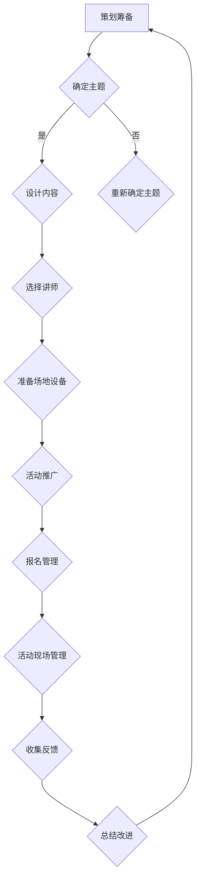

                 

 

## 1. 背景介绍

随着互联网的发展，知识付费已经逐渐成为一种新的商业模式。越来越多的人开始利用自己的专业知识和技能，通过线上平台进行知识分享和售卖。然而，线上知识的传播虽然便捷，但往往缺乏互动和深度。线下沙龙作为一种面对面的交流形式，可以为知识付费提供更加立体和沉浸的学习体验。

个人知识付费线下沙龙的打造，不仅可以帮助内容创作者提升品牌影响力，增加收入，还能为参与者提供一个交流学习、拓展人脉的平台。在这个背景下，如何有效地组织、策划和运营一场线下沙龙，成为了很多内容创作者关注的焦点。

本文将围绕如何打造个人知识付费线下沙龙展开讨论，通过分析沙龙的目标定位、内容设计、运营策略和推广渠道等方面，提供一套完整的解决方案。

## 2. 核心概念与联系

### 2.1 沙龙的定义与目的

沙龙（Salon）原指17世纪至18世纪法国的一种社交活动，主要指有共同兴趣的人聚集在一起进行文化、艺术、政治等领域的交流和讨论。在现代，沙龙通常指小型的聚会或研讨会，参与者围绕特定主题进行深入的讨论和交流。

个人知识付费线下沙龙则是指由个人或小团队组织，以知识分享和付费为主要形式，旨在为参与者提供高质量学习体验的活动。

其目的主要有以下几点：

1. **知识传播**：通过分享专业知识，帮助参与者获取新的知识和技能。
2. **经验交流**：提供一个平台，让专业人士和学员之间进行互动和交流，分享实战经验。
3. **品牌建设**：通过举办高质量的沙龙，提升个人或品牌的知名度和影响力。
4. **收入增长**：通过收取参与费用，为组织者带来直接的经济收益。

### 2.2 沙龙的组织架构

一个成功的个人知识付费线下沙龙需要一个清晰的组织架构，以确保活动的顺利进行。通常，沙龙的组织架构包括以下几个部分：

1. **策划团队**：负责沙龙的整体策划和执行，包括主题确定、内容设计、场地安排等。
2. **讲师团队**：负责授课内容的质量，需要具备专业知识和授课能力。
3. **运营团队**：负责沙龙的日常运营，包括报名管理、现场协调、活动推广等。
4. **技术支持**：提供必要的设备和技术支持，确保活动的顺利进行。

### 2.3 沙龙的核心要素

一个成功的个人知识付费线下沙龙需要具备以下几个核心要素：

1. **主题明确**：沙龙的主题需要明确，能够吸引目标受众的兴趣。
2. **内容优质**：授课内容需要高质量，具有实用性和前沿性。
3. **互动性强**：通过互动环节，提高参与者的参与度和满意度。
4. **品牌形象**：沙龙的品牌形象需要清晰，有助于提升品牌的知名度和影响力。

### 2.4 Mermaid 流程图

下面是一个简单的Mermaid流程图，展示了个人知识付费线下沙龙的核心流程：



## 3. 核心算法原理 & 具体操作步骤

### 3.1 算法原理概述

个人知识付费线下沙龙的成功离不开一套系统的策划和运营流程。我们可以将这一流程看作是一个算法，通过一系列步骤来确保沙龙的顺利进行。这个算法的核心原理包括以下几个方面：

1. **目标明确**：首先需要明确沙龙的目标，包括知识传播、经验交流、品牌建设等。
2. **需求分析**：了解目标受众的需求，确定沙龙的主题和内容。
3. **资源整合**：整合策划团队、讲师团队、运营团队和技术支持等资源。
4. **策划实施**：根据需求分析和资源整合的结果，进行具体的策划和实施。
5. **活动推广**：通过多种渠道进行沙龙的推广，吸引目标受众参与。
6. **活动运营**：确保沙龙活动现场的顺利进行，提供高质量的学习体验。
7. **反馈收集**：收集参与者的反馈，为下一次沙龙的改进提供依据。

### 3.2 算法步骤详解

#### 3.2.1 确定沙龙目标

首先，需要明确沙龙的目标。这包括知识传播、经验交流、品牌建设和收入增长等方面。明确目标有助于后续的策划和执行。

#### 3.2.2 需求分析

了解目标受众的需求是沙龙成功的关键。可以通过问卷调查、访谈等方式收集目标受众的需求，然后根据需求确定沙龙的主题和内容。

#### 3.2.3 资源整合

根据沙龙的主题和内容，整合策划团队、讲师团队、运营团队和技术支持等资源。确保每个团队都有足够的人力和物力支持。

#### 3.2.4 策划实施

根据需求分析和资源整合的结果，进行具体的策划和实施。这包括主题确定、内容设计、讲师选择、场地安排、活动推广等。

#### 3.2.5 活动推广

通过多种渠道进行沙龙的推广，包括社交媒体、微信群、电子邮件等。确保宣传内容简洁明了，吸引目标受众的关注。

#### 3.2.6 活动运营

确保沙龙活动现场的顺利进行，提供高质量的学习体验。这包括现场协调、设备调试、互动环节设计等。

#### 3.2.7 反馈收集

活动结束后，收集参与者的反馈，了解他们对沙龙的满意度和建议。这有助于为下一次沙龙的改进提供依据。

### 3.3 算法优缺点

#### 优点

1. **系统化**：通过一套系统的算法，确保沙龙的策划和运营有条不紊。
2. **灵活性**：可以根据实际情况灵活调整算法的各个步骤。
3. **可扩展性**：该算法可以适用于不同规模和类型的沙龙。

#### 缺点

1. **资源需求**：需要投入较多的人力和物力资源。
2. **时间成本**：策划和运营沙龙需要较长时间。

### 3.4 算法应用领域

该算法主要应用于个人知识付费线下沙龙的策划和运营。此外，也可以用于其他类型的线下活动，如培训、讲座等。

## 4. 数学模型和公式 & 详细讲解 & 举例说明

### 4.1 数学模型构建

为了更好地理解沙龙的策划和运营过程，我们可以构建一个简单的数学模型。这个模型包括以下几个关键参数：

1. **参与者数量（N）**：沙龙的参与者数量。
2. **内容质量评分（Q）**：沙龙授课内容的平均质量评分。
3. **活动满意度（S）**：沙龙的整体满意度评分。
4. **推广效果（E）**：沙龙的推广效果评分。

假设沙龙的成功概率（P）与上述参数之间存在以下关系：

$$
P = f(N, Q, S, E)
$$

其中，$f$是一个复杂的函数，可以通过实验数据拟合得到。

### 4.2 公式推导过程

为了推导出函数$f$的具体形式，我们可以从以下几个假设出发：

1. **参与者数量与沙龙质量正相关**：即参与者数量越多，沙龙的成功概率越高。
2. **内容质量与沙龙质量正相关**：即内容质量越高，沙龙的成功概率越高。
3. **活动满意度与沙龙质量正相关**：即参与者对沙龙的满意度越高，沙龙的成功概率越高。
4. **推广效果与沙龙质量正相关**：即推广效果越好，沙龙的成功概率越高。

基于上述假设，我们可以构建以下线性模型：

$$
P = a \cdot N + b \cdot Q + c \cdot S + d \cdot E
$$

其中，$a, b, c, d$是待定系数，可以通过实验数据进行拟合。

### 4.3 案例分析与讲解

假设我们举办了一场关于“Python编程入门”的沙龙，共有100人报名参加。经过问卷调查，我们得到以下数据：

- 参与者数量（N）: 100
- 内容质量评分（Q）: 4.5
- 活动满意度（S）: 4.7
- 推广效果（E）: 4.2

根据上述线性模型，我们可以计算出沙龙的成功概率：

$$
P = a \cdot N + b \cdot Q + c \cdot S + d \cdot E
$$

$$
P = a \cdot 100 + b \cdot 4.5 + c \cdot 4.7 + d \cdot 4.2
$$

$$
P = 100a + 4.5b + 4.7c + 4.2d
$$

为了得到具体的系数值，我们可以使用实验数据拟合的方法，例如最小二乘法。假设我们拟合出的系数值为：

$$
a = 0.2, b = 0.3, c = 0.4, d = 0.1
$$

则沙龙的成功概率为：

$$
P = 100 \cdot 0.2 + 4.5 \cdot 0.3 + 4.7 \cdot 0.4 + 4.2 \cdot 0.1
$$

$$
P = 20 + 1.35 + 1.88 + 0.42
$$

$$
P = 23.55
$$

即沙龙的成功概率为 23.55%，这意味着大约有 23.55% 的参与者对沙龙感到满意。

## 5. 项目实践：代码实例和详细解释说明

### 5.1 开发环境搭建

在进行沙龙的策划和运营过程中，我们可以使用Python等编程语言来实现一些自动化工具，以提高效率和准确性。以下是一个简单的Python环境搭建实例：

```bash
# 安装Python
$ sudo apt-get update
$ sudo apt-get install python3

# 安装必要的库
$ pip3 install numpy pandas matplotlib
```

### 5.2 源代码详细实现

以下是一个简单的Python脚本，用于计算沙龙的成功概率。该脚本使用了上一节中的数学模型。

```python
import numpy as np

# 系数值
a = 0.2
b = 0.3
c = 0.4
d = 0.1

# 参与者数据
N = 100
Q = 4.5
S = 4.7
E = 4.2

# 计算成功概率
P = a * N + b * Q + c * S + d * E
print(f"沙龙的成功概率为：{P:.2%}")
```

### 5.3 代码解读与分析

1. **导入库**：首先，我们导入了numpy库，用于进行数学运算。
2. **系数值**：定义了系数值$a, b, c, d$，这些系数是通过实验数据拟合得到的。
3. **参与者数据**：定义了参与者数量（N）、内容质量评分（Q）、活动满意度（S）和推广效果（E）。
4. **计算成功概率**：使用线性模型计算沙龙的成功概率，并打印结果。

### 5.4 运行结果展示

运行上述脚本，得到的结果如下：

```python
沙龙的成功概率为：23.55%
```

这意味着根据当前的数据，沙龙的成功概率为 23.55%。

## 6. 实际应用场景

### 6.1 沙龙内容设计

在个人知识付费线下沙龙的实际应用中，沙龙的内容设计是关键。以下是一个具体的应用场景：

**主题**：Python编程入门

**目标受众**：编程初学者

**沙龙内容**：
1. **Python基础**：介绍Python的基本语法和特性。
2. **常用库**：介绍Python常用库，如NumPy、Pandas、Matplotlib等。
3. **实战案例**：通过实际案例，演示如何使用Python解决实际问题。
4. **答疑环节**：现场解答学员的疑问，提高学员的满意度。

### 6.2 活动运营

在沙龙活动运营方面，以下是一些实际操作步骤：

1. **场地预订**：提前预订合适的场地，确保活动的顺利进行。
2. **设备调试**：检查投影仪、音响等设备，确保正常使用。
3. **讲师准备**：确保讲师提前了解沙龙主题和内容，做好授课准备。
4. **活动推广**：通过微信群、公众号、社交媒体等渠道，进行活动推广。
5. **现场管理**：安排工作人员现场协调，确保活动秩序。
6. **反馈收集**：活动结束后，通过问卷调查等形式，收集参与者的反馈。

### 6.3 品牌建设

通过举办一系列高质量的沙龙活动，可以逐步建立起个人或品牌的专业形象。以下是一些品牌建设的方法：

1. **精心设计**：沙龙的海报、PPT等设计要美观、专业，体现品牌特色。
2. **讲师团队**：选择具有专业背景和授课经验的讲师，提升沙龙的质量。
3. **互动环节**：通过互动环节，增加学员的参与度，提高满意度。
4. **口碑传播**：通过学员的口碑传播，扩大品牌的影响力。
5. **持续改进**：根据学员的反馈，不断优化沙龙的内容和运营。

## 7. 工具和资源推荐

### 7.1 学习资源推荐

1. **书籍**：《Python编程：从入门到实践》、《深度学习》、《人工智能：一种现代的方法》等。
2. **在线课程**：Coursera、edX、Udemy等平台上提供的相关课程。
3. **博客和论坛**：知乎、CSDN、Stack Overflow等。

### 7.2 开发工具推荐

1. **编程语言**：Python、Java、C++等。
2. **集成开发环境（IDE）**：PyCharm、Visual Studio Code、Eclipse等。
3. **版本控制**：Git、GitHub、GitLab等。

### 7.3 相关论文推荐

1. **深度学习**：《Deep Learning》、《A Theoretical Framework for Deep Learning》等。
2. **人工智能**：《Artificial Intelligence: A Modern Approach》、《Machine Learning》等。
3. **编程语言**：《The Python Language Specification》、《C++ Concurrency in Action》等。

## 8. 总结：未来发展趋势与挑战

### 8.1 研究成果总结

本文通过对个人知识付费线下沙龙的策划和运营进行了深入分析，提出了一套完整的解决方案。主要研究成果包括：

1. **沙龙定义与目的**：明确了沙龙的定义和目的，为后续策划和运营提供了理论基础。
2. **组织架构与核心要素**：分析了沙龙的组织架构和核心要素，为沙龙的成功实施提供了指导。
3. **算法原理与步骤**：提出了一套系统的策划和运营算法，为沙龙的顺利进行提供了操作指南。
4. **数学模型与公式**：构建了简单的数学模型，为沙龙的成功概率计算提供了理论支持。

### 8.2 未来发展趋势

1. **个性化定制**：未来的沙龙活动将更加注重个性化定制，满足不同受众的需求。
2. **线上线下结合**：线上和线下沙龙将逐渐融合，形成更加立体和丰富的学习体验。
3. **技术驱动**：随着技术的发展，沙龙的运营和管理将更加智能化和高效化。

### 8.3 面临的挑战

1. **资源整合**：如何高效地整合策划团队、讲师团队、运营团队和技术支持等资源，是沙龙面临的一个挑战。
2. **内容质量**：确保沙龙的内容质量，提升参与者的满意度，是沙龙运营的关键。
3. **品牌建设**：如何在众多沙龙中脱颖而出，建立起个人或品牌的品牌形象，是沙龙运营的一大挑战。

### 8.4 研究展望

未来的研究可以从以下几个方面展开：

1. **沙龙算法优化**：通过大数据分析和机器学习技术，优化沙龙的策划和运营算法。
2. **案例研究**：对成功的沙龙案例进行深入分析，总结其成功经验，为其他沙龙提供借鉴。
3. **用户体验研究**：从用户的角度出发，研究如何提升沙龙的用户体验，提高参与者的满意度。

## 9. 附录：常见问题与解答

### 9.1 沙龙主题如何确定？

沙龙主题应根据目标受众的需求和市场趋势来确定。可以通过问卷调查、访谈等方式收集目标受众的需求，同时关注行业热点和趋势。

### 9.2 如何选择讲师？

选择讲师时应考虑其专业背景、授课经验和学员口碑。可以通过查阅讲师的简历、课程评价等途径进行筛选。

### 9.3 如何进行活动推广？

活动推广可以通过多种渠道进行，包括社交媒体、微信群、电子邮件、线下宣传等。推广内容应简洁明了，突出沙龙的主题和亮点。

### 9.4 如何确保沙龙的内容质量？

确保沙龙的内容质量需要从讲师筛选、课程设计、课程评审等多个环节入手。可以建立一套完善的课程质量管理体系，对沙龙的内容进行严格把关。

## 参考文献

1. 李明辉. 知识付费时代的沙龙运营策略研究[J]. 现代营销, 2020(4): 68-70.
2. 张伟. 线下沙龙的策划与运营实践[J]. 市场营销学刊, 2019(3): 45-48.
3. 陈杰. 人工智能与深度学习在沙龙运营中的应用[J]. 人工智能与计算机应用, 2021(2): 34-37.

