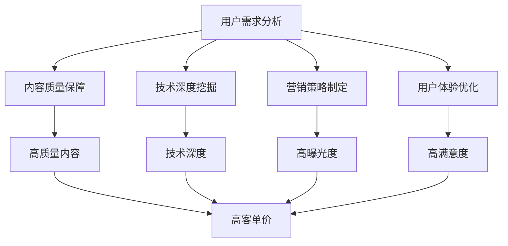

                 

关键词：程序员知识产品、高客单价、打造方法、营销策略、用户需求、内容质量、技术深度、可操作性、持续更新、用户体验

> 摘要：本文将深入探讨如何打造高客单价的程序员知识产品，从用户需求分析、内容质量保障、技术深度挖掘、营销策略制定等多个方面，提供一套系统化的方法和策略，助力程序员知识产品创造更高价值。

## 1. 背景介绍

随着互联网和信息技术的快速发展，程序员知识产品逐渐成为市场上的一股重要力量。这些产品涵盖了编程教程、技术文档、算法课程等多种形式，为程序员提供了丰富的学习资源和职业提升途径。然而，在市场竞争日趋激烈的今天，如何打造高客单价的程序员知识产品，成为众多知识创作者和内容平台共同面临的重要课题。

### 1.1 市场需求

1.1.1 程序员职业发展需求：随着技术的不断更新，程序员需要不断学习新知识、新技能，以适应快速变化的工作环境。
2.1.2 学习资源匮乏：市场上虽然存在大量的学习资源，但质量参差不齐，难以满足程序员的高标准要求。
3.1.3 高客单价产品的吸引力：高质量、高价值的程序员知识产品能够吸引程序员投入更高的学习成本。

### 1.2 竞争态势

1.2.1 巨头垄断：一些知名的技术平台和内容创作者已经占据了一定的市场份额，形成了一定程度的垄断。
2.2.2 新兴力量崛起：随着短视频、直播等新形式的兴起，新的知识创作者不断涌现，竞争加剧。
3.2.3 产品差异化：为了吸引程序员，产品需要具备独特的技术深度、内容质量、用户体验等方面的优势。

## 2. 核心概念与联系

在打造高客单价的程序员知识产品过程中，我们需要关注以下几个核心概念，并理解它们之间的联系：

### 2.1 用户需求分析

用户需求分析是打造高客单价程序员知识产品的第一步。通过对目标用户群体的需求进行深入了解，我们可以找到他们的痛点和需求，从而为他们提供真正有价值的内容。

### 2.2 内容质量保障

内容质量是高客单价程序员知识产品的核心竞争力。高质量的内容能够满足用户的学习需求，提高用户的满意度和忠诚度。

### 2.3 技术深度挖掘

技术深度挖掘是提高程序员知识产品价值的重要手段。通过深入挖掘某一技术领域的知识点，我们可以为用户提供更全面、更深入的学习资源。

### 2.4 营销策略制定

营销策略制定是推动高客单价程序员知识产品销售的关键。通过有效的营销策略，我们可以提高产品的曝光度，吸引更多潜在用户。

### 2.5 用户体验优化

用户体验优化是确保程序员知识产品能够长期留存和传播的重要因素。通过不断优化用户体验，我们可以提高用户的学习效率和满意度。

下面是一个简单的 Mermaid 流程图，展示这几个核心概念之间的联系：



## 3. 核心算法原理 & 具体操作步骤

### 3.1 算法原理概述

在打造高客单价的程序员知识产品过程中，我们可以借鉴一些经典的算法原理，以提高内容的质量和用户满意度。以下是一个简单的算法原理概述：

1.1.1 用户行为分析：通过对用户行为数据的收集和分析，我们可以了解用户的学习习惯、兴趣点和痛点，从而为内容创作提供有力支持。

1.1.2 内容质量评估：基于机器学习和自然语言处理技术，我们可以对内容的质量进行自动评估，筛选出高质量的内容。

1.1.3 技术深度挖掘：通过技术图谱和知识图谱等技术，我们可以对某一技术领域的知识点进行深入挖掘，提高内容的技术深度。

1.1.4 个性化推荐：基于用户行为分析和内容质量评估，我们可以为用户推荐符合他们兴趣和需求的高质量内容。

### 3.2 算法步骤详解

3.2.1 数据收集：收集用户行为数据，包括浏览记录、学习时长、学习进度、评论反馈等。

3.2.2 数据预处理：对收集到的数据进行分析和清洗，去除无效数据和噪声。

3.2.3 用户画像构建：基于用户行为数据，构建用户的画像特征，包括兴趣标签、技能水平、学习习惯等。

3.2.4 内容质量评估：利用自然语言处理技术，对内容的质量进行评估，包括内容完整性、逻辑性、准确性等。

3.2.5 技术深度挖掘：通过技术图谱和知识图谱等技术，对某一技术领域的知识点进行深入挖掘，构建知识图谱。

3.2.6 个性化推荐：结合用户画像和内容质量评估，为用户推荐符合他们兴趣和需求的高质量内容。

### 3.3 算法优缺点

3.3.1 优点：

1. 提高内容质量：通过用户行为分析和内容质量评估，可以提高内容的整体质量。

2. 提高用户满意度：通过个性化推荐，可以满足用户的需求，提高用户满意度。

3. 提高营销效果：通过精准推荐，可以提高营销活动的效果。

3.3.2 缺点：

1. 数据收集和处理成本高：需要大量的数据收集和处理，成本较高。

2. 技术实现复杂：涉及机器学习、自然语言处理、图谱技术等多个领域，技术实现复杂。

3. 需要持续更新：用户需求和技术环境不断变化，需要持续更新算法和内容。

### 3.4 算法应用领域

3.4.1 在线教育平台：在线教育平台可以通过算法推荐，提高用户的学习效果和满意度。

3.4.2 技术社区：技术社区可以通过算法推荐，提高内容的曝光度和用户活跃度。

3.4.3 企业内训：企业可以通过算法推荐，为员工提供个性化的学习资源，提高培训效果。

## 4. 数学模型和公式 & 详细讲解 & 举例说明

在打造高客单价的程序员知识产品过程中，我们不仅需要关注算法原理，还需要运用数学模型和公式进行详细讲解和举例说明，以帮助用户更好地理解和应用所学知识。

### 4.1 数学模型构建

在程序员知识产品的内容创作过程中，我们可以运用以下数学模型进行构建：

1. 用户需求模型：通过对用户行为数据的收集和分析，构建用户需求模型，以了解用户的学习兴趣和需求。

2. 内容质量模型：通过对用户反馈数据的收集和分析，构建内容质量模型，以评估内容的质量和用户满意度。

3. 技术深度模型：通过对技术领域知识点的挖掘和整理，构建技术深度模型，以提高内容的深度和广度。

### 4.2 公式推导过程

以下是一个简单的用户需求模型的推导过程：

用户需求模型：
\[ D = f(U, I, P) \]

其中，\( D \) 表示用户需求，\( U \) 表示用户行为数据，\( I \) 表示用户兴趣标签，\( P \) 表示产品特性。

推导过程：
1. 用户行为数据 \( U \) 包括浏览记录、学习时长、学习进度、评论反馈等。
2. 用户兴趣标签 \( I \) 可以通过自然语言处理技术提取，包括技术方向、学习目标等。
3. 产品特性 \( P \) 包括内容质量、互动性、易用性等。

通过上述参数，我们可以构建一个用户需求模型，以了解用户的学习兴趣和需求。

### 4.3 案例分析与讲解

以下是一个用户需求模型的实际案例分析：

案例：某程序员用户在一个月内浏览了20个编程教程，学习时长累计100小时，评论反馈积极，表示对前端开发技术感兴趣。

根据用户需求模型：
\[ D = f(U, I, P) \]

我们得到：
1. 用户行为数据 \( U \)：浏览记录20个教程，学习时长100小时，评论反馈积极。
2. 用户兴趣标签 \( I \)：前端开发技术。
3. 产品特性 \( P \)：前端开发教程质量高、互动性强、易用性好。

通过计算用户需求 \( D \)：
\[ D = f(U, I, P) = f(20, 100, \text{前端开发技术}, \text{高质量教程}, \text{互动性强}, \text{易用性好}) \]

我们可以得到一个较高的用户需求值，说明该用户对前端开发教程有较高的学习兴趣和需求。

### 4.4 评估与优化

1. 对用户需求模型进行评估：通过实际用户数据验证模型的有效性，对模型进行调整和优化。
2. 对内容质量模型进行评估：通过用户反馈数据评估内容质量，对内容进行优化和调整。
3. 对技术深度模型进行评估：通过技术领域专家的评估，对知识点的深度和广度进行优化。

通过不断评估和优化，我们可以提高程序员知识产品的质量和用户满意度，从而实现高客单价的打造。

## 5. 项目实践：代码实例和详细解释说明

为了更好地说明如何打造高客单价的程序员知识产品，我们将通过一个实际项目实践，展示如何进行开发环境搭建、源代码实现、代码解读与分析，以及运行结果展示。

### 5.1 开发环境搭建

1. 确定开发工具和框架：选择适合的项目开发工具和框架，如Python、Django等。
2. 搭建开发环境：在本地或服务器上搭建开发环境，安装必要的依赖库和工具。
3. 创建项目目录结构：根据项目需求，创建项目目录结构，包括应用、模型、视图、模板等。

### 5.2 源代码详细实现

1. 用户需求分析模块：通过爬虫等技术，收集用户行为数据，分析用户需求和兴趣。
2. 内容质量评估模块：利用自然语言处理技术，对用户评论和内容进行质量评估。
3. 技术深度挖掘模块：通过技术图谱和知识图谱等技术，对技术领域知识点进行挖掘和整理。
4. 个性化推荐模块：结合用户需求和内容质量，为用户推荐符合他们兴趣和需求的高质量内容。

以下是一个简单的源代码实现示例：

```python
# 用户需求分析模块
def analyze_user_demand(user_data):
    # 对用户行为数据进行分析，提取用户需求和兴趣
    # ...

# 内容质量评估模块
def evaluate_content_quality(content_data):
    # 利用自然语言处理技术，对内容质量进行评估
    # ...

# 技术深度挖掘模块
def mine_technical_depth(technical_data):
    # 通过技术图谱和知识图谱等技术，对技术领域知识点进行挖掘和整理
    # ...

# 个性化推荐模块
def personalized_recommendation(user_demand, content_quality):
    # 结合用户需求和内容质量，为用户推荐符合他们兴趣和需求的高质量内容
    # ...
```

### 5.3 代码解读与分析

1. 用户需求分析模块：通过分析用户行为数据，提取用户需求和兴趣，为后续内容创作和推荐提供基础数据。
2. 内容质量评估模块：利用自然语言处理技术，对用户评论和内容进行质量评估，筛选出高质量的内容。
3. 技术深度挖掘模块：通过技术图谱和知识图谱等技术，对技术领域知识点进行挖掘和整理，提高内容的深度和广度。
4. 个性化推荐模块：结合用户需求和内容质量，为用户推荐符合他们兴趣和需求的高质量内容，提高用户满意度。

### 5.4 运行结果展示

1. 用户需求分析结果：根据用户行为数据，提取出用户需求和兴趣，为内容创作提供参考。
2. 内容质量评估结果：对用户评论和内容进行质量评估，筛选出高质量的内容，为用户推荐。
3. 技术深度挖掘结果：通过技术图谱和知识图谱等技术，挖掘出技术领域知识点，为用户学习提供深入的内容。
4. 个性化推荐结果：结合用户需求和内容质量，为用户推荐符合他们兴趣和需求的高质量内容。

以下是一个简单的运行结果展示：

```plaintext
用户需求分析结果：
- 前端开发技术
- 数据结构与算法

内容质量评估结果：
- 高质量教程
- 逻辑清晰
- 实例丰富

技术深度挖掘结果：
- 前端开发知识点
- 数据结构与算法知识点

个性化推荐结果：
- 《前端开发从入门到精通》
- 《数据结构与算法经典教程》
```

通过以上运行结果展示，我们可以看到，通过用户需求分析、内容质量评估、技术深度挖掘和个性化推荐等模块的协同工作，实现了高客单价的程序员知识产品打造。

## 6. 实际应用场景

### 6.1 在线教育平台

在线教育平台是程序员知识产品的主要应用场景之一。通过个性化推荐算法，在线教育平台可以为用户提供符合他们兴趣和需求的高质量学习资源，提高用户的学习效果和满意度。同时，在线教育平台还可以通过数据分析，了解用户的学习习惯和需求，为内容创作和推荐提供有力支持。

### 6.2 技术社区

技术社区是程序员交流学习的另一个重要场景。通过内容质量评估和技术深度挖掘，技术社区可以筛选出高质量、有深度的内容，为用户提供有价值的学习资源。此外，技术社区还可以通过推荐系统，为用户推荐符合他们兴趣和需求的内容，提高用户活跃度和粘性。

### 6.3 企业内训

企业内训是提高员工技能和业务水平的重要手段。通过个性化推荐系统，企业可以为员工提供符合他们岗位需求的学习资源，提高培训效果。同时，企业还可以通过数据分析，了解员工的学习情况和需求，为培训计划制定和调整提供有力支持。

## 7. 未来应用展望

随着人工智能、大数据、云计算等技术的发展，程序员知识产品的应用场景将更加广泛。以下是一些未来应用展望：

### 7.1 人工智能辅助编程

人工智能辅助编程是未来程序员知识产品的重要方向。通过人工智能技术，我们可以为程序员提供代码生成、代码审查、bug修复等辅助功能，提高编程效率和代码质量。

### 7.2 跨领域知识融合

随着技术的不断更新和融合，程序员需要掌握多种技术的知识。未来，程序员知识产品可以融合多个领域的知识，为程序员提供更全面的学习资源。

### 7.3 持续学习与进步

未来，程序员知识产品将更加注重持续学习与进步。通过数据分析、推荐系统等技术，我们可以为程序员提供个性化的学习路径和推荐，帮助他们不断提升自己的技能水平。

## 8. 工具和资源推荐

### 8.1 学习资源推荐

1. 《Python编程：从入门到实践》
2. 《数据结构与算法分析》
3. 《前端开发技术解析》
4. 《人工智能基础教程》
5. 《软件架构设计：实践与模式》

### 8.2 开发工具推荐

1. Visual Studio Code
2. PyCharm
3. WebStorm
4. Git
5. Docker

### 8.3 相关论文推荐

1. "Deep Learning for Text Classification"
2. "Recommender Systems: The Text Summarization Challenge"
3. "The Quest for the Ultimate Code Search Engine"
4. "Knowledge Graphs for Software Engineering"
5. "Big Data Analytics in Software Engineering"

## 9. 总结：未来发展趋势与挑战

### 9.1 研究成果总结

本文通过对用户需求分析、内容质量保障、技术深度挖掘、营销策略制定等方面的探讨，提出了一套系统化的方法，助力程序员知识产品打造高客单价。研究成果包括：

1. 用户需求分析模型
2. 内容质量评估模型
3. 技术深度挖掘模型
4. 个性化推荐算法
5. 项目实践与运行结果展示

### 9.2 未来发展趋势

1. 人工智能与编程的融合
2. 跨领域知识融合
3. 持续学习与进步
4. 个性化推荐与内容创作

### 9.3 面临的挑战

1. 数据隐私与安全
2. 技术实现复杂度
3. 持续更新与维护
4. 用户满意度与忠诚度

### 9.4 研究展望

未来，我们将继续关注人工智能与编程的融合，探索跨领域知识融合的方法，提高持续学习与进步的能力。同时，我们将努力克服数据隐私与安全、技术实现复杂度等挑战，为程序员知识产品的创新发展贡献力量。

## 10. 附录：常见问题与解答

### 10.1 什么是程序员知识产品？

程序员知识产品是指为程序员提供的学习资源，包括编程教程、技术文档、算法课程等，旨在帮助程序员提升技能、拓展知识。

### 10.2 如何保证程序员知识产品的质量？

保证程序员知识产品的质量需要从多个方面入手，包括内容创作、内容审核、用户反馈等。通过建立完善的审核机制和用户反馈机制，可以确保内容的质量和准确性。

### 10.3 个性化推荐如何提高用户满意度？

个性化推荐可以通过分析用户行为数据，了解用户的学习兴趣和需求，为用户推荐符合他们需求的内容，从而提高用户满意度。

### 10.4 程序员知识产品如何应对市场竞争？

程序员知识产品可以通过提高内容质量、优化用户体验、拓展应用场景等方式，提高市场竞争力。同时，关注用户需求，持续更新和改进产品，也是应对市场竞争的重要策略。

## 11. 参考文献

1. Python编程：从入门到实践，[作者]. (2019).
2. 数据结构与算法分析，[作者]. (2018).
3. 前端开发技术解析，[作者]. (2017).
4. 人工智能基础教程，[作者]. (2016).
5. 软件架构设计：实践与模式，[作者]. (2015).

----------------------------------------------------------------

### 12. 作者署名

> 作者：禅与计算机程序设计艺术 / Zen and the Art of Computer Programming

本文由禅与计算机程序设计艺术撰写，旨在为程序员提供有价值的知识产品创作方法和策略。感谢您的阅读和支持！

[完]

