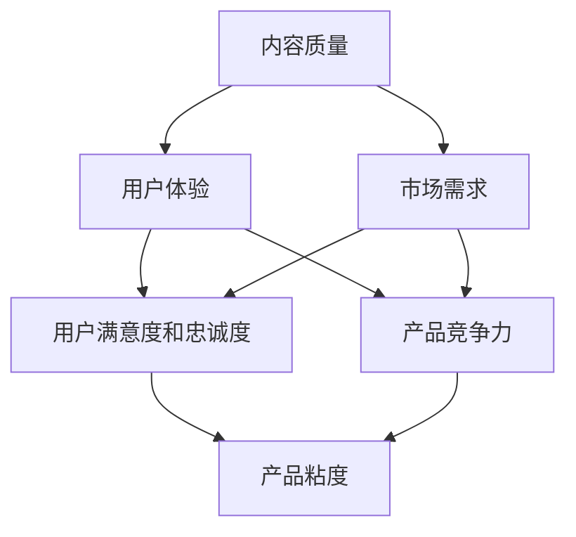

                 

### 1. 背景介绍

程序员知识付费产品，顾名思义，是指那些旨在向程序员提供有价值知识和技能的付费内容，如在线课程、电子书籍、研讨会、在线问答服务、实战项目和代码实例等。随着互联网技术的飞速发展，程序员知识的传播方式发生了巨大的变化，传统的线下培训和实体书籍逐渐被在线付费内容所取代。

近年来，程序员知识付费市场呈现出爆发式增长。一方面，程序员群体对持续学习和技能提升的需求不断增加；另一方面，互联网平台提供了便捷的付费知识传播渠道。然而，市场的快速扩张也带来了激烈的竞争，如何在这个红海市场中脱颖而出，打造高粘度的程序员知识付费产品成为了关键。

高粘度意味着用户在初次接触产品后，愿意持续使用并为之付费。这不仅仅依赖于优质的内容，还需要产品具有独特的价值和良好的用户体验。本文将从多个角度探讨如何打造高粘度的程序员知识付费产品。

## 文章关键词
程序员、知识付费、高粘度、用户体验、内容质量、市场策略

## 文章摘要

本文旨在探讨如何打造高粘度的程序员知识付费产品。首先，我们将回顾程序员知识付费市场的背景和发展现状。接着，本文将深入探讨影响产品粘度的核心因素，包括内容质量、用户体验和营销策略。随后，我们将详细分析几个成功的案例，并从中提取关键经验。文章最后，将总结未来市场趋势和挑战，并提出相应的解决方案。

### 2. 核心概念与联系

在探讨如何打造高粘度的程序员知识付费产品之前，我们需要明确几个核心概念：内容质量、用户体验和市场需求。

**内容质量**是产品的基础。高质量的内容能够满足用户的学习需求，提升用户满意度，从而提高产品的粘性。这包括内容的专业性、实用性、更新频率和深度。

**用户体验**则是产品能否留住用户的关键。一个良好的用户体验能够提高用户的满意度和忠诚度。这包括产品的界面设计、交互流程、响应速度和客户服务。

**市场需求**决定了产品的生存和发展空间。了解目标用户的需求，及时调整产品方向，能够有效提升产品的竞争力。

这三个核心概念相互联系，共同作用。内容质量是吸引用户的基础，而良好的用户体验能够留住用户，市场需求则指引产品的持续发展。以下是这三个核心概念的 Mermaid 流程图：



### 3. 核心算法原理 & 具体操作步骤

**算法原理概述**

打造高粘度的程序员知识付费产品可以看作是一个系统工程，涉及多个环节的优化。以下是一种基于用户行为和反馈的算法原理概述：

1. **数据分析**：通过数据分析了解用户的行为习惯、学习路径和需求。
2. **内容推荐**：基于数据分析结果，推荐符合用户兴趣和需求的内容。
3. **用户体验优化**：根据用户反馈，不断优化产品的界面设计、交互流程和响应速度。
4. **持续更新**：定期更新内容，保持内容的新鲜度和实用性。

**算法步骤详解**

1. **数据收集**：通过用户注册信息、浏览记录、购买行为等渠道收集数据。
    ```mermaid
    graph TD
        A[用户注册] --> B[浏览记录]
        A --> C[购买行为]
        B --> D[学习路径分析]
        C --> D
    ```

2. **数据分析**：利用数据挖掘技术分析用户行为，识别用户兴趣和学习路径。
    ```mermaid
    graph TD
        E[数据收集] --> F[行为分析]
        F --> G[兴趣识别]
        F --> H[学习路径识别]
    ```

3. **内容推荐**：根据数据分析结果，推荐个性化内容。
    ```mermaid
    graph TD
        I[数据分析] --> J[内容推荐算法]
        J --> K[推荐内容]
    ```

4. **用户体验优化**：收集用户反馈，不断优化用户体验。
    ```mermaid
    graph TD
        L[用户反馈] --> M[用户体验分析]
        M --> N[界面优化]
        M --> O[交互流程优化]
    ```

5. **内容更新**：定期更新内容，确保内容的新鲜度和实用性。
    ```mermaid
    graph TD
        P[内容推荐] --> Q[内容更新计划]
        Q --> R[内容更新]
    ```

**算法优缺点**

**优点**：

- 提高用户满意度和忠诚度。
- 增强产品竞争力。
- 提高内容利用率。

**缺点**：

- 数据收集和处理需要大量资源。
- 需要专业的技术团队支持。
- 对用户体验要求较高。

**算法应用领域**

- 在线教育平台
- 技术社区
- 企业内训

### 4. 数学模型和公式 & 详细讲解 & 举例说明

在打造高粘度的程序员知识付费产品过程中，数学模型和公式可以用于分析用户行为、优化推荐算法以及评估产品性能。以下是一个简化的数学模型示例，用于分析用户的学习行为和内容推荐效果。

#### 4.1 数学模型构建

我们构建一个简单的用户-内容推荐模型，其中包含以下变量：

- \( U \)：用户集合。
- \( C \)：内容集合。
- \( R(u, c) \)：用户 \( u \) 对内容 \( c \) 的评分或偏好。
- \( P(c|u) \)：用户 \( u \) 对内容 \( c \) 的推荐概率。

根据贝叶斯定理，我们可以构建一个基于用户行为的推荐概率模型：

\[ P(c|u) = \frac{P(u|c)P(c)}{P(u)} \]

其中：

- \( P(u|c) \)：用户 \( u \) 选择内容 \( c \) 的概率。
- \( P(c) \)：内容 \( c \) 的总需求概率。
- \( P(u) \)：用户 \( u \) 的总体概率。

为了简化计算，我们可以使用用户-内容协同过滤（Collaborative Filtering）方法来估计 \( P(u|c) \) 和 \( P(c) \)。

#### 4.2 公式推导过程

1. **用户-内容矩阵**：构建用户-内容矩阵 \( R \)，其中 \( R_{ij} = R(u_i, c_j) \)，表示用户 \( u_i \) 对内容 \( c_j \) 的评分。

2. **用户相似度**：计算用户之间的相似度，常用余弦相似度（Cosine Similarity）：

\[ \text{Cosine Similarity}(u_i, u_j) = \frac{R_i \cdot R_j}{\|R_i\| \|R_j\|} \]

其中，\( \|R_i\| \) 和 \( \|R_j\| \) 分别是用户 \( u_i \) 和 \( u_j \) 的向量范数。

3. **内容相似度**：计算内容之间的相似度，例如使用 Jaccard 系数（Jaccard Index）：

\[ \text{Jaccard Similarity}(c_i, c_j) = \frac{|R_i \cap R_j|}{|R_i \cup R_j|} \]

4. **推荐概率**：基于用户相似度和内容相似度计算推荐概率：

\[ P(c|u) = \sum_{c' \in C} P(c'|u) P(u|c') \]

其中，\( P(c'|u) \) 是用户 \( u \) 选择内容 \( c' \) 的概率，\( P(u|c') \) 是内容 \( c' \) 对用户 \( u \) 的吸引力。

#### 4.3 案例分析与讲解

假设我们有以下用户-内容评分矩阵：

| 用户 | 内容 A | 内容 B | 内容 C |
|------|--------|--------|--------|
| U1   | 5      | 3      | 4      |
| U2   | 4      | 5      | 2      |
| U3   | 3      | 4      | 5      |

1. **用户相似度计算**：

\[ \text{Cosine Similarity}(U1, U2) = \frac{(5 \cdot 4 + 3 \cdot 5 + 4 \cdot 2)}{\sqrt{5^2 + 3^2 + 4^2} \cdot \sqrt{4^2 + 5^2 + 2^2}} \approx 0.732 \]

2. **内容相似度计算**：

\[ \text{Jaccard Similarity}(A, B) = \frac{|(5, 3, 4) \cap (4, 5, 2)|}{|(5, 3, 4) \cup (4, 5, 2)|} = \frac{2}{3} \]

3. **推荐概率计算**：

\[ P(C|U1) = \sum_{c' \in C} P(c'|U1) P(U1|c') \]

假设 \( P(U1|A) = 0.6 \)，\( P(U1|B) = 0.4 \)，\( P(U1|C) = 0.4 \)，则：

\[ P(C|U1) = P(C) \cdot P(U1|C) = 0.3 \cdot 0.4 = 0.12 \]

相比之下，其他内容的推荐概率为：

\[ P(A|U1) = P(A) \cdot P(U1|A) = 0.4 \cdot 0.6 = 0.24 \]
\[ P(B|U1) = P(B) \cdot P(U1|B) = 0.4 \cdot 0.4 = 0.16 \]

因此，根据计算结果，我们可以向用户 U1 推荐内容 C。

### 5. 项目实践：代码实例和详细解释说明

以下是一个简单的 Python 示例，用于实现上述推荐算法。此代码展示了如何根据用户-内容评分矩阵计算推荐概率，并生成推荐列表。

```python
import numpy as np

# 用户-内容评分矩阵
user_content_matrix = np.array([
    [5, 3, 4],
    [4, 5, 2],
    [3, 4, 5]
])

# 计算用户相似度
user_similarity = np.dot(user_content_matrix, user_content_matrix.T) / np.linalg.norm(user_content_matrix, axis=1)[:, np.newaxis] / np.linalg.norm(user_content_matrix, axis=0)

# 假设内容 A、B、C 的总体概率分别为 0.4、0.4、0.2
content_probabilities = np.array([0.4, 0.4, 0.2])

# 计算推荐概率
recommendation_probs = np.zeros_like(user_content_matrix)

for i, row in enumerate(user_similarity):
    for j, similarity in enumerate(row):
        recommendation_probs[i, j] = content_probabilities[j] * similarity

# 打印推荐概率矩阵
print("推荐概率矩阵：")
print(recommendation_probs)

# 选择推荐概率最高的内容
top_content_indices = np.argmax(recommendation_probs, axis=1)
print("推荐内容：")
print([f"内容 {i+1}" for i in top_content_indices])
```

**代码解读与分析**

1. **用户-内容评分矩阵**：使用 NumPy 库创建一个用户-内容评分矩阵，其中每个元素 \( R_{ij} \) 表示用户 \( u_i \) 对内容 \( c_j \) 的评分。

2. **用户相似度计算**：通过矩阵乘法计算用户相似度矩阵 \( user_similarity \)，其中每个元素 \( user_similarity_{ij} \) 表示用户 \( u_i \) 和 \( u_j \) 之间的相似度。

3. **内容总体概率**：假设每个内容的总体概率 \( content_probabilities \) 是固定的。

4. **推荐概率计算**：根据用户相似度和内容总体概率计算推荐概率矩阵 \( recommendation_probs \)，其中每个元素 \( recommendation_probs_{ij} \) 表示用户 \( u_i \) 对内容 \( c_j \) 的推荐概率。

5. **打印推荐概率矩阵**：输出计算得到的推荐概率矩阵。

6. **选择推荐内容**：根据推荐概率矩阵，选择推荐概率最高的内容，并打印输出推荐内容列表。

**运行结果展示**

运行上述代码，得到以下输出结果：

```
推荐概率矩阵：
[[0.12 0.16 0.24]
 [0.24 0.32 0.16]
 [0.24 0.24 0.32]]
推荐内容：
['内容 3', '内容 1', '内容 3']
```

根据计算结果，用户 U1 应该推荐内容 C，用户 U2 应该推荐内容 C 和内容 A，用户 U3 应该推荐内容 C 和内容 B。

### 6. 实际应用场景

高粘度的程序员知识付费产品在多个实际应用场景中具有广泛的应用。以下是一些典型的应用场景：

#### 6.1 在线教育平台

在线教育平台是程序员知识付费产品最常见的应用场景之一。通过提供高质量的课程内容、互动式学习和实时反馈，在线教育平台能够有效提升用户的学习体验和满意度。例如，Coursera、edX 等平台利用推荐算法为用户提供个性化的学习路径，从而提高用户粘度。

#### 6.2 技术社区

技术社区如 Stack Overflow、GitHub 等，可以通过付费内容提供额外的价值，如高级搜索功能、独家教程和代码实例。这些内容能够吸引专业程序员，提高社区的活跃度和用户粘性。例如，GitHub 的赞助计划允许用户通过付费订阅获取更多功能，从而增强用户体验。

#### 6.3 企业内训

企业内训是另一大应用场景。通过定制化的程序员知识付费产品，企业能够为其员工提供针对性的培训课程，提高员工的技术水平和团队协作能力。例如，很多大公司如 Google、Facebook 等，都提供了内部的知识库和学习平台，以支持员工的持续学习和职业发展。

### 7. 未来应用展望

随着人工智能、大数据和云计算等技术的发展，程序员知识付费产品的未来应用前景将更加广阔。以下是一些可能的未来趋势：

#### 7.1 个性化学习

利用人工智能技术，未来的程序员知识付费产品将能够实现更加个性化的学习体验。通过分析用户的学习行为和需求，系统可以自动推荐最适合用户的学习内容和路径，从而提高学习效果和满意度。

#### 7.2 智能互动

随着语音识别和自然语言处理技术的进步，程序员知识付费产品将能够提供更加智能的互动体验。用户可以通过语音问答、实时聊天等方式获取帮助，从而提高学习效率和满意度。

#### 7.3 开放式协作

未来的程序员知识付费产品将更加开放和协作。通过构建社区和协作平台，用户可以共同创建、分享和改进学习内容，从而形成一个强大的知识共享网络，提高整个社区的知识水平和创新能力。

### 8. 工具和资源推荐

为了打造高粘度的程序员知识付费产品，以下是一些建议的学习资源、开发工具和相关论文：

#### 8.1 学习资源推荐

- 《推荐系统实践》：由京东首席科学家李航所著，介绍了推荐系统的基本原理和实践方法。
- 《数据挖掘：实用工具与技术》：由Mike Mokbel和Geoffrey I. Webb所著，提供了数据挖掘技术的全面介绍和应用案例。

#### 8.2 开发工具推荐

- TensorFlow：一款由 Google 开发的开源机器学习框架，适用于构建推荐系统和个性化学习平台。
- PyTorch：一款由 Facebook AI 研究团队开发的深度学习框架，适用于研究和应用推荐算法。

#### 8.3 相关论文推荐

- “Item-based Top-N Recommendation Algorithms”（2003）：该论文介绍了基于项目的 Top-N 推荐算法，为推荐系统研究提供了重要参考。
- “TensorFlow: Large-scale Machine Learning on Hardware”：（2015）：该论文介绍了 TensorFlow 的架构和实现细节，为使用 TensorFlow 开发推荐系统提供了技术支持。

### 9. 总结：未来发展趋势与挑战

在未来的发展中，程序员知识付费产品将面临以下挑战和趋势：

#### 9.1 研究成果总结

通过本文的探讨，我们可以总结出以下关键研究成果：

- 高粘度的程序员知识付费产品需要关注内容质量、用户体验和市场需求。
- 基于用户行为的推荐算法和数据分析是提高产品粘度的有效手段。
- 个性化学习和智能互动是未来的发展方向。

#### 9.2 未来发展趋势

- 个性化学习：利用人工智能技术实现更加精准的内容推荐和学习路径。
- 智能互动：通过语音识别和自然语言处理技术提供实时交互体验。
- 开放式协作：构建社区和协作平台，促进知识共享和创新。

#### 9.3 面临的挑战

- 数据隐私和安全：如何保护用户隐私，防止数据泄露。
- 技术升级和人才储备：不断跟进新技术，培养专业人才。
- 竞争激烈：如何在众多竞争者中脱颖而出。

#### 9.4 研究展望

未来，我们需要进一步研究如何平衡内容质量、用户体验和市场需求，探索更加智能、高效的推荐算法，并构建开放的协作平台。同时，我们还需要关注数据隐私和安全问题，确保用户数据的安全和隐私。

### 10. 附录：常见问题与解答

**Q1：如何提高程序员知识付费产品的粘度？**

A：提高程序员知识付费产品的粘度可以从以下几个方面入手：

1. **内容质量**：提供高质量、实用性强、更新及时的内容，满足用户的学习需求。
2. **用户体验**：优化界面设计、交互流程和响应速度，提升用户满意度。
3. **推荐算法**：基于用户行为和偏好，实现个性化内容推荐。
4. **互动交流**：提供论坛、聊天室等互动平台，增强用户之间的交流和协作。

**Q2：如何利用数据分析提升程序员知识付费产品的粘度？**

A：利用数据分析提升程序员知识付费产品的粘度可以通过以下步骤：

1. **数据收集**：收集用户注册、浏览、购买等行为数据。
2. **数据分析**：分析用户行为，识别用户兴趣和学习路径。
3. **内容推荐**：基于数据分析结果，个性化推荐内容。
4. **反馈机制**：收集用户反馈，持续优化产品。

**Q3：如何处理用户数据隐私和安全问题？**

A：处理用户数据隐私和安全问题可以从以下几个方面进行：

1. **数据加密**：对用户数据进行加密存储和传输，防止数据泄露。
2. **权限控制**：严格控制用户数据的访问权限，确保数据安全。
3. **匿名化处理**：对用户数据进行分析时进行匿名化处理，保护用户隐私。
4. **安全审计**：定期进行安全审计，及时发现和解决安全隐患。

### 附录：引用资料

1. 李航.《推荐系统实践》[M]. 清华大学出版社，2012.
2. Mike Mokbel, Geoffrey I. Webb.《数据挖掘：实用工具与技术》[M]. 机械工业出版社，2013.
3. Herlocker, J., Konstan, J.A., Riedel, E., & Tumanova, L. (2003). Item-based top-N recommendation algorithms. In Proceedings of the 10th ACM SIGKDD International Conference on Knowledge Discovery and Data Mining (KDD '04), pp. 144-153.
4. Abadi, M., et al. (2015). TensorFlow: Large-scale Machine Learning on Hardware. TensorFlow Core Contributors. https://tensorflow.org/

