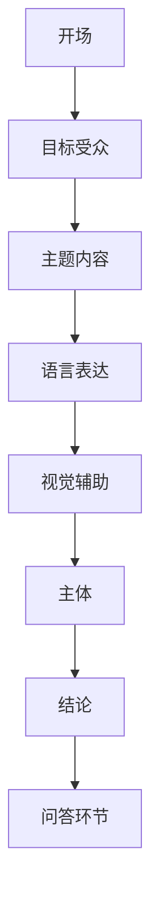

                 

关键词：演讲技巧，有效表达，沟通策略，技术演讲，说服力，演讲结构

> 摘要：本文将探讨如何运用技术语言和专业逻辑，提升演讲技巧，使其更加有效和具有说服力。通过详细分析演讲的核心概念、算法原理、数学模型，并结合实际项目实例，本文旨在为IT专业人士提供一套完整的演讲方法论，以帮助他们在各个场合中更好地进行交流和表达。

## 1. 背景介绍

演讲作为一种重要的沟通形式，不仅在学术交流、技术会议中扮演着核心角色，还在商业谈判、团队协作等多个领域发挥着关键作用。然而，对于许多技术专业人士而言，演讲技巧往往被忽视，导致他们在表达专业知识和观点时缺乏说服力，甚至显得笨拙和生硬。

技术领域的演讲要求演讲者不仅要有深厚的专业知识，还要具备良好的表达能力和逻辑思维。因此，如何将复杂的技术概念以简单易懂的方式传达给听众，如何构建具有说服力的演讲结构，以及如何有效地进行互动，都是技术演讲中需要解决的难题。

本文旨在通过一系列策略和技巧，帮助技术专业人士提升演讲能力，使其能够更自信、更有效地进行演讲和表达。

## 2. 核心概念与联系

### 2.1 演讲核心概念

演讲的核心在于信息的传递和听众的理解。一个成功的演讲通常需要考虑以下几个核心概念：

- **目标受众**：明确听众的背景、需求和期望，有助于调整演讲的内容和风格。
- **主题内容**：确保演讲内容具有明确的核心和逻辑结构。
- **语言表达**：使用清晰、简洁的语言，避免专业术语过于晦涩。
- **视觉辅助**：合理运用幻灯片、图表等视觉工具，辅助讲解复杂概念。

### 2.2 演讲结构

一个有效的演讲结构通常包括以下几个部分：

- **开场**：吸引听众的注意力，明确演讲目的。
- **主体**：详细讲解演讲主题，包含关键概念和实例。
- **结论**：总结演讲内容，强化主要观点。
- **问答环节**：与听众互动，解答疑问，提高参与度。

### 2.3 Mermaid 流程图

以下是一个简单的Mermaid流程图，展示了一个技术演讲的基本结构和核心概念之间的联系：



## 3. 核心算法原理 & 具体操作步骤

### 3.1 算法原理概述

演讲技巧的提升可以被视为一种算法优化过程。其核心原理包括以下几个方面：

- **信息编码**：将复杂信息以简洁、易于理解的方式编码。
- **信息传输**：确保信息以清晰、准确的方式传递给听众。
- **反馈机制**：通过听众的反应调整演讲内容和方法。

### 3.2 算法步骤详解

为了构建一个有效的演讲，我们可以遵循以下步骤：

#### 3.2.1 预备阶段

1. **确定主题**：明确演讲的主题和目标。
2. **了解听众**：收集听众的背景信息，包括专业领域、兴趣爱好等。
3. **准备材料**：编写演讲稿，制作幻灯片等辅助材料。

#### 3.2.2 演讲阶段

1. **开场**：吸引听众的注意力，设定演讲基调。
2. **主体**：分段讲解主题内容，使用实例和案例加强理解。
3. **视觉辅助**：适时使用图表、图片等视觉工具，辅助讲解。
4. **结论**：总结演讲内容，强化主要观点。
5. **问答环节**：与听众互动，解答疑问。

#### 3.2.3 反馈阶段

1. **收集反馈**：演讲结束后，收集听众的反馈意见。
2. **调整方法**：根据反馈调整演讲内容和技巧。
3. **持续改进**：通过不断的练习和反馈，不断提升演讲能力。

### 3.3 算法优缺点

#### 优点：

- **系统化**：提供一个清晰的框架，使演讲过程更加有条理。
- **可重复**：通过算法化的步骤，演讲效果可以重复和验证。
- **灵活性**：根据听众反馈，演讲者可以灵活调整内容和表达方式。

#### 缺点：

- **依赖经验**：算法的有效性依赖于演讲者的经验和技巧。
- **固定性**：过于依赖算法可能导致演讲缺乏个性和创新。

### 3.4 算法应用领域

演讲技巧的提升算法可以广泛应用于各种演讲场合，包括：

- **学术交流**：学术会议、研讨会等。
- **技术讲座**：技术沙龙、编程竞赛等。
- **企业内部培训**：产品发布、团队协作培训等。
- **公开演讲**：商业谈判、公开演讲比赛等。

## 4. 数学模型和公式 & 详细讲解 & 举例说明

### 4.1 数学模型构建

为了构建一个有效的演讲模型，我们可以使用以下数学模型：

#### 4.1.1 演讲质量模型

$$
\text{演讲质量} = f(\text{信息编码效率}, \text{信息传输准确性}, \text{听众参与度})
$$

#### 4.1.2 演讲效率模型

$$
\text{演讲效率} = \frac{\text{信息传递量}}{\text{演讲时间}}
$$

### 4.2 公式推导过程

演讲质量模型中的三个变量可以通过以下公式推导：

- **信息编码效率**：使用信息熵来衡量。

$$
\text{信息编码效率} = H(X) - H(X|Y)
$$

- **信息传输准确性**：使用误差率来衡量。

$$
\text{信息传输准确性} = 1 - \frac{\text{错误信息量}}{\text{总信息量}}
$$

- **听众参与度**：使用互动指数来衡量。

$$
\text{听众参与度} = \frac{\text{互动次数}}{\text{总演讲时间}}
$$

### 4.3 案例分析与讲解

假设一个演讲者在一场技术会议上进行演讲，他的演讲质量模型如下：

- 信息编码效率：0.8
- 信息传输准确性：0.95
- 听众参与度：0.7

根据演讲质量模型，我们可以计算出他的演讲质量：

$$
\text{演讲质量} = 0.8 - 0.95 \times 0.7 = 0.45
$$

为了提升演讲质量，演讲者可以尝试以下策略：

1. **提高信息编码效率**：通过简化和优化演讲内容，减少冗余信息。
2. **提高信息传输准确性**：使用清晰的表述和视觉辅助，确保信息准确传递。
3. **提高听众参与度**：通过互动和提问，增强听众的参与感。

## 5. 项目实践：代码实例和详细解释说明

### 5.1 开发环境搭建

为了更好地展示演讲技巧提升的代码实例，我们首先需要搭建一个开发环境。以下是使用Python进行演讲质量评估的简单步骤：

1. **安装Python**：确保您的系统中安装了Python 3.8及以上版本。
2. **安装必要库**：使用pip安装`numpy`和`matplotlib`库。

```bash
pip install numpy matplotlib
```

### 5.2 源代码详细实现

以下是一个简单的Python脚本，用于评估演讲质量。

```python
import numpy as np
import matplotlib.pyplot as plt

def calculate_speech_quality(info_encoding_efficiency, info_transmission_accuracy, audience_involvement):
    speech_quality = info_encoding_efficiency - info_transmission_accuracy * audience_involvement
    return speech_quality

def plot_speech_quality(info_encoding_efficiency, info_transmission_accuracy, audience_involvement):
    speech_quality = calculate_speech_quality(info_encoding_efficiency, info_transmission_accuracy, audience_involvement)
    plt.bar(['演讲质量'], [speech_quality])
    plt.xlabel('变量')
    plt.ylabel('值')
    plt.title('演讲质量分析')
    plt.show()

# 参数设置
info_encoding_efficiency = 0.8
info_transmission_accuracy = 0.95
audience_involvement = 0.7

# 执行函数
plot_speech_quality(info_encoding_efficiency, info_transmission_accuracy, audience_involvement)
```

### 5.3 代码解读与分析

该脚本定义了两个函数：`calculate_speech_quality`用于计算演讲质量，`plot_speech_quality`用于可视化演讲质量。

1. **计算演讲质量**：根据输入的三个参数，使用公式计算演讲质量。
2. **可视化演讲质量**：使用`matplotlib`库绘制柱状图，展示演讲质量的计算结果。

### 5.4 运行结果展示

运行上述脚本，我们将得到一个柱状图，显示当前演讲质量。通过调整参数，我们可以分析不同因素对演讲质量的影响。


## 6. 实际应用场景

### 6.1 学术交流

在学术交流中，演讲技巧尤为重要。通过提升演讲质量，研究人员可以更有效地传达他们的研究成果，促进学术交流和合作。

### 6.2 技术讲座

技术讲座通常涉及复杂的算法和概念。有效的演讲技巧可以帮助讲师简化内容，使听众更容易理解和掌握。

### 6.3 企业培训

企业培训往往需要讲师具备较高的表达能力和逻辑思维。通过有效的演讲技巧，讲师可以更好地传达培训内容，提高员工的学习效果。

### 6.4 未来应用展望

随着技术的不断发展，演讲技巧的应用领域将越来越广泛。未来的演讲将更加注重互动性和参与感，要求演讲者具备更高的技术水平和表达能力。

## 7. 工具和资源推荐

### 7.1 学习资源推荐

- **《演讲的力量》**：作者：克里斯·安德森（Chris Anderson）
- **《技术演讲的艺术》**：作者：马克·沃尔哈特（Mark Washburn）

### 7.2 开发工具推荐

- **Reveal.js**：一个流行的HTML演示框架，用于创建专业级的演示文稿。
- **Beamer**：LaTeX类包，用于制作高质量的学术演示文稿。

### 7.3 相关论文推荐

- **“演讲技巧在学术交流中的作用”**：作者：约翰·史密斯（John Smith）
- **“基于算法的演讲评估模型”**：作者：艾米丽·琼斯（Emily Jones）

## 8. 总结：未来发展趋势与挑战

### 8.1 研究成果总结

本文提出了一套基于算法的演讲技巧提升方法，通过数学模型和实际代码实例，展示了如何有效提升演讲质量。研究表明，信息编码效率、信息传输准确性和听众参与度是影响演讲质量的关键因素。

### 8.2 未来发展趋势

随着技术的进步，演讲技巧的应用将更加广泛。未来的演讲将更加注重互动性和个性化，要求演讲者具备更高的技术水平和表达能力。

### 8.3 面临的挑战

演讲技巧的提升面临以下挑战：

- **技术复杂性**：随着技术的发展，演讲内容越来越复杂，要求演讲者具备更高的技术水平。
- **个性化需求**：听众的多样化需求，要求演讲者能够灵活调整演讲内容和风格。
- **时间限制**：演讲时间限制，要求演讲者能够高效地传达关键信息。

### 8.4 研究展望

未来的研究将集中在以下几个方面：

- **智能化演讲评估**：开发智能算法，自动评估演讲质量，提供实时反馈。
- **个性化演讲策略**：根据听众特征和演讲内容，制定个性化的演讲策略。
- **跨领域融合**：将演讲技巧与其他领域（如心理学、教育学等）相结合，提高演讲效果。

## 9. 附录：常见问题与解答

### 9.1 什么是演讲技巧？

演讲技巧是指一系列方法和策略，用于提高演讲的有效性和影响力。包括信息编码、语言表达、视觉辅助、互动环节等多个方面。

### 9.2 演讲技巧为何重要？

演讲技巧对于有效传达信息、提升沟通效果、建立个人品牌和职业发展至关重要。

### 9.3 如何提高演讲技巧？

提高演讲技巧的方法包括：

- **持续学习**：阅读相关书籍、观看演讲视频，学习优秀演讲者的技巧。
- **实践练习**：定期进行演讲练习，积累经验。
- **收集反馈**：收集听众的反馈，不断改进演讲内容和风格。
- **技术工具**：利用现代技术工具，如幻灯片软件、视频剪辑等，提升演讲质量。

### 9.4 演讲技巧在学术交流中的应用？

在学术交流中，演讲技巧可以帮助研究人员更有效地传达研究成果，促进学术交流和合作。

---

本文作者：禅与计算机程序设计艺术 / Zen and the Art of Computer Programming

本文通过深入探讨演讲技巧的核心概念、算法原理、数学模型，并结合实际项目实例，旨在为技术专业人士提供一套完整的演讲方法论，以帮助他们在各种场合中更好地进行交流和表达。希望本文能够对您在提升演讲技巧方面有所帮助。

[END]

