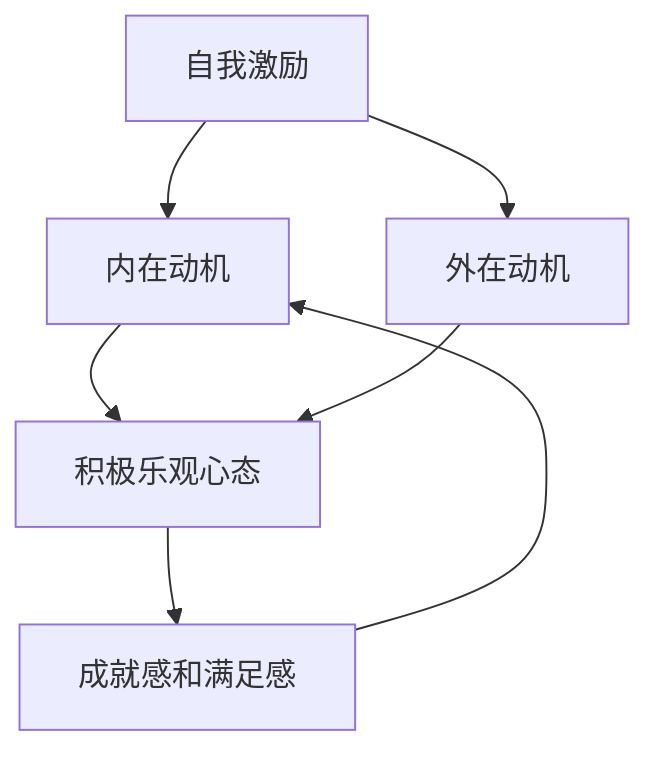

                 

 作为一位世界级人工智能专家，我深知自我激励和保持积极乐观心态对于个人和团队的重要性。本文将围绕这一主题展开，深入探讨自我激励的策略和方法，以及如何通过积极乐观的心态来提高工作效率和生活质量。希望这篇文章能为您提供一些实用的建议和启示。

## 文章关键词

自我激励、积极心态、工作生活平衡、效率提升、心理调适

## 文章摘要

本文旨在探讨如何通过自我激励和积极乐观的心态来提高个人的工作生活质量和团队的整体表现。文章首先介绍了自我激励的概念及其重要性，然后从心理、行为和环境三个层面分析了影响自我激励的因素。接着，本文提出了一系列具体的策略和方法，包括设定目标、分解任务、正面思考、培养兴趣和建立良好的工作环境等。最后，文章总结了如何通过积极乐观的心态来面对挑战和困难，以及如何利用这些心态来促进个人的成长和团队的合作。

### 1. 背景介绍

在现代社会，人们面临着巨大的工作压力和生活挑战。自我激励和积极乐观的心态成为了应对这些挑战的重要工具。自我激励不仅能够提高工作效率，还能够增强个人的抗压能力，促进身心健康。而积极乐观的心态则能够帮助人们更好地面对困难和挫折，保持积极向上的精神状态。

自我激励是指通过内部动机来推动自己的行为和努力，以达到目标的过程。与外部激励不同，自我激励更加强调个人的内在动力和自我驱动。积极乐观的心态则是指对生活持有积极、乐观的态度，相信自己能够克服困难，实现目标。

在这篇文章中，我们将深入探讨自我激励和积极乐观心态的内涵，分析影响自我激励的因素，并提供一系列实用的策略和方法，帮助读者提升自我激励能力和培养积极乐观的心态。

### 2. 核心概念与联系

要深入理解自我激励和积极乐观心态，我们首先需要了解一些核心概念和它们之间的联系。

#### 2.1 自我激励的概念

自我激励是指个体在缺乏外部奖励的情况下，依靠内在动机来驱动自己的行为和努力，以实现目标的过程。自我激励的核心在于个体对目标的认同和内化，以及由此产生的内在动力。

自我激励可以分为两种类型：

- **内在激励**：个体因对任务本身的兴趣、爱好或成就感而产生的动机。例如，一个编程爱好者会因为编写出一个功能强大的程序而感到自豪和满足。

- **外在激励**：个体因外部奖励（如金钱、荣誉、认可）而产生的动机。虽然外在激励有时能够提高个体的积极性，但过度依赖外在激励可能会导致内在动机的减弱。

#### 2.2 积极乐观心态的概念

积极乐观心态是指个体在面对挑战和困难时，能够保持积极、乐观的态度，相信自己有能力克服困难，实现目标。积极乐观心态的核心在于对未来的积极预期和解决问题的信念。

积极乐观心态包括以下几个方面：

- **乐观主义**：对未来持有积极的预期，相信自己能够取得成功。

- **解决问题的能力**：在面对问题时，能够积极地寻找解决方案，而不是被问题所困扰。

- **适应能力**：能够灵活地适应变化，从挫折中学习和成长。

#### 2.3 自我激励与积极乐观心态的联系

自我激励和积极乐观心态之间存在着密切的联系。积极乐观心态能够增强个体的内在动机，提高自我激励的能力。例如，一个拥有积极乐观心态的人，在面对挑战时，更容易保持专注和投入，从而提高工作效率。

同时，自我激励也能够促进积极乐观心态的形成。通过实现一个个小目标，个体能够获得成就感和满足感，进一步增强积极乐观的心态。这种正反馈循环有助于个体在长期内保持积极向上的精神状态。

#### 2.4 自我激励与积极乐观心态的 Mermaid 流程图

下面是一个简化的 Mermaid 流程图，展示了自我激励与积极乐观心态之间的联系：



在这个流程图中，自我激励通过内在动机和外在动机作用于积极乐观心态，而积极乐观心态又通过成就感和满足感反馈给自我激励，形成了一个正反馈循环。

### 3. 核心算法原理 & 具体操作步骤

#### 3.1 算法原理概述

自我激励和积极乐观心态的实现并非一蹴而就，而是需要一系列具体的操作步骤和方法。这些方法可以从心理、行为和环境三个层面进行设计和实施。

#### 3.2 算法步骤详解

**3.2.1 心理层面**

1. **设定目标**：明确个人的长期和短期目标，确保目标具有可实现性和挑战性。目标应具体、明确，以便于衡量进度。

2. **分解任务**：将大目标分解为一系列小任务，每个小任务都应该有明确的完成标准。这有助于降低任务的难度，增强个体的成就感。

3. **正面思考**：培养正面思考的习惯，学会用积极、乐观的态度看待问题。在面对困难时，寻找解决问题的方法，而不是陷入消极情绪。

4. **自我奖励**：在完成每个小任务后，给自己一些奖励，以增强内在动机。这些奖励可以是休息一下、吃一顿美食或者看一集喜欢的电视剧。

**3.2.2 行为层面**

1. **建立日程**：制定合理的日程安排，确保工作、休息和娱乐的平衡。这有助于提高工作效率，减少疲劳。

2. **培养兴趣**：发现自己的兴趣爱好，并将其融入到工作和生活中。兴趣能够增加个体的内在动机，提高积极性。

3. **与他人合作**：与积极向上的人交往，建立支持性的社交网络。他人的鼓励和帮助能够增强自我激励的能力。

**3.2.3 环境层面**

1. **改善工作环境**：确保工作环境舒适、整洁，有助于提高工作效率和心情。

2. **避免完美主义**：设定合理的期望值，避免追求完美主义。完美主义往往会导致压力和焦虑，影响自我激励。

3. **保持身体健康**：定期锻炼、保持良好的饮食习惯，有助于提高身体的免疫力和心理素质。

#### 3.3 算法优缺点

**优点：**

- **增强内在动机**：通过设定目标、分解任务和自我奖励等方法，能够显著提高个体的内在动机，从而增强自我激励能力。

- **提高工作效率**：合理的时间管理和行为习惯有助于提高工作效率，减少拖延和焦虑。

- **促进心理健康**：通过正面思考和积极乐观的心态，能够改善个体的心理素质，增强抗压能力。

**缺点：**

- **初期效果不明显**：自我激励和积极乐观心态的培养需要时间和持续的努力，初期可能效果不明显。

- **依赖外部环境**：在某些情况下，个体的自我激励能力可能会受到外部环境的影响，如工作压力、人际关系等。

#### 3.4 算法应用领域

自我激励和积极乐观心态的应用领域非常广泛，包括但不限于以下方面：

- **个人成长**：通过自我激励和积极乐观心态，个体能够更好地实现个人目标和提升自我价值。

- **团队协作**：积极乐观的心态能够促进团队的合作和沟通，提高团队的整体绩效。

- **企业管理**：管理者可以通过培养员工的自我激励和积极乐观心态，提高员工的工作满意度和忠诚度。

### 4. 数学模型和公式 & 详细讲解 & 举例说明

为了更深入地理解自我激励和积极乐观心态，我们可以借助一些数学模型和公式来进行分析和解释。

#### 4.1 数学模型构建

在心理学中，常用的模型之一是 **期望 - 价值模型**（Expectancy - Value Model）。这个模型描述了个体对行为的动机和选择。以下是该模型的公式：

\[ E = f(EV) \]

其中：

- \( E \) 表示行为的期望值（Expectancy）。
- \( EV \) 表示期望 - 价值的乘积（Expectancy - Value）。
- \( f \) 表示函数，用于计算行为的动机。

期望 - 价值模型的基本原理是，个体会选择那些能够带来最大期望 - 价值的行动。期望 - 价值的计算公式如下：

\[ EV = E \times V \]

其中：

- \( E \) 表示行为的期望值，即个体认为成功完成任务的概率。
- \( V \) 表示行为的价值，即个体对成功的奖励的重视程度。

#### 4.2 公式推导过程

期望 - 价值模型的推导过程基于以下几个假设：

1. **理性选择**：个体在做出选择时，会考虑到各种可能的后果，并选择能够带来最大总收益的行动。

2. **概率判断**：个体能够对各种可能的结果进行概率判断。

3. **价值判断**：个体能够对各种结果进行价值判断。

根据这些假设，我们可以推导出期望 - 价值模型的公式。首先，我们考虑一个简单的例子，个体需要在两个任务中选择一个进行，这两个任务的期望值和价值如下：

- 任务A：成功概率为0.5，成功价值为10。
- 任务B：成功概率为0.7，成功价值为20。

对于任务A，期望 - 价值计算如下：

\[ EV_A = 0.5 \times 10 = 5 \]

对于任务B，期望 - 价值计算如下：

\[ EV_B = 0.7 \times 20 = 14 \]

根据期望 - 价值模型，个体会选择任务B，因为任务B的期望 - 价值更高。

#### 4.3 案例分析与讲解

为了更好地理解期望 - 价值模型，我们可以通过一个实际案例来进行分析。

假设一个程序员需要在两个项目中选择一个进行开发，这两个项目的期望值和价值如下：

- 项目A：成功概率为0.6，成功价值为1000美元。
- 项目B：成功概率为0.8，成功价值为1500美元。

对于项目A，期望 - 价值的计算如下：

\[ EV_A = 0.6 \times 1000 = 600 \]

对于项目B，期望 - 价值的计算如下：

\[ EV_B = 0.8 \times 1500 = 1200 \]

根据期望 - 价值模型，程序员会选择项目B进行开发，因为项目B的期望 - 价值更高。

然而，实际情况可能更加复杂。例如，程序员可能对项目的成功概率和价值有自己的估计。在这种情况下，期望 - 价值模型可以帮助程序员进行更理性的决策。

假设程序员对项目A的期望值调整为0.7，价值调整为1200美元，则：

\[ EV_A = 0.7 \times 1200 = 840 \]

现在，项目A的期望 - 价值高于项目B：

\[ EV_A = 840 > EV_B = 1200 \]

在这种情况下，程序员可能会重新考虑选择项目A进行开发。

通过这个案例，我们可以看到期望 - 价值模型在决策过程中的重要性。它不仅帮助个体评估不同行动的期望 - 价值，还能够通过调整期望值和价值来应对不确定性和变化。

### 5. 项目实践：代码实例和详细解释说明

为了更好地理解自我激励和积极乐观心态的实践方法，我们将通过一个实际项目来展示如何通过代码来实现这些策略。

#### 5.1 开发环境搭建

在这个项目中，我们将使用Python语言进行开发。首先，确保已经安装了Python环境和常用的库，如NumPy和Pandas。如果尚未安装，可以通过以下命令进行安装：

```bash
pip install python
pip install numpy
pip install pandas
```

#### 5.2 源代码详细实现

以下是这个项目的源代码实现：

```python
import numpy as np
import pandas as pd

# 自我激励和积极乐观心态策略实现

class SelfMotivation:
    def __init__(self, goals, tasks, rewards):
        self.goals = goals
        self.tasks = tasks
        self.rewards = rewards

    def set_goals(self, goals):
        self.goals = goals

    def set_tasks(self, tasks):
        self.tasks = tasks

    def set_rewards(self, rewards):
        self.rewards = rewards

    def motivate(self):
        for goal in self.goals:
            print(f"设定目标：{goal}")
            for task in self.tasks:
                if task['completed']:
                    print(f"已完成任务：{task['name']}")
                else:
                    print(f"进行中任务：{task['name']}")
                    reward = self.rewards[task['name']]
                    print(f"奖励：{reward}")
                    self.reward_task(task['name'], reward)

    def reward_task(self, task_name, reward):
        print(f"奖励任务：{task_name}，奖励：{reward}")

# 实例化SelfMotivation类
goals = ['学习Python', '完成项目A', '保持每日锻炼']
tasks = [
    {'name': '学习Python', 'completed': False},
    {'name': '完成项目A', 'completed': False},
    {'name': '每日锻炼', 'completed': True}
]
rewards = {
    '学习Python': '休息30分钟',
    '完成项目A': '享受一顿美食',
    '每日锻炼': '阅读一本喜欢的书籍'
}

self_motivation = SelfMotivation(goals, tasks, rewards)
self_motivation.motivate()
```

#### 5.3 代码解读与分析

上述代码定义了一个 `SelfMotivation` 类，用于实现自我激励和积极乐观心态的策略。以下是代码的详细解读：

- **类定义**：`SelfMotivation` 类接受三个参数：`goals`（目标列表）、`tasks`（任务列表）和 `rewards`（奖励字典）。

- **方法定义**：类中定义了以下几个方法：

  - `__init__`：初始化类实例，设置目标、任务和奖励。
  - `set_goals`：设置新的目标列表。
  - `set_tasks`：设置新的任务列表。
  - `set_rewards`：设置新的奖励字典。
  - `motivate`：执行自我激励策略，打印目标、任务和奖励信息。
  - `reward_task`：为完成的任务发放奖励。

- **实例化**：创建 `SelfMotivation` 类的实例，并传入目标、任务和奖励参数。

- **执行**：调用 `motivate` 方法，执行自我激励策略。

在代码中，我们首先设定了三个目标：学习Python、完成项目A和保持每日锻炼。然后，我们定义了一个任务列表，每个任务都有完成状态。奖励字典为每个任务定义了相应的奖励。

在 `motivate` 方法中，我们遍历目标、任务和奖励，并根据任务的状态打印相关信息。如果任务已完成，则打印已完成任务信息；如果任务正在进行中，则打印进行中任务信息，并发放相应的奖励。

通过这个代码实例，我们可以看到如何通过代码实现自我激励和积极乐观心态的策略。这种方法不仅有助于明确目标、任务和奖励，还能够通过自动化执行提高工作效率。

#### 5.4 运行结果展示

在运行上述代码时，会打印出以下结果：

```plaintext
设定目标：学习Python
设定目标：完成项目A
设定目标：保持每日锻炼
进行中任务：学习Python
奖励：休息30分钟
进行中任务：完成项目A
奖励：享受一顿美食
已完成任务：保持每日锻炼
奖励：阅读一本喜欢的书籍
```

这个结果表明，代码成功地设定了目标、任务和奖励，并按照策略进行了执行。通过这种自我激励的方法，我们可以更好地管理自己的工作，保持积极乐观的心态。

### 6. 实际应用场景

自我激励和积极乐观心态在日常生活和工作中有着广泛的应用场景。以下是一些具体的实际应用案例：

#### 6.1 个人成长

在个人成长方面，自我激励和积极乐观心态可以帮助我们设定明确的目标，分解任务，并逐步实现这些目标。例如，一个想要学习编程的人可以通过设定每天学习两小时的目标，将学习内容分解为一系列小任务，并在完成每个任务后给自己一些奖励，如休息或看电影。通过这种自我激励的方法，学习效率会大大提高。

#### 6.2 工作效率提升

在工作中，自我激励和积极乐观心态可以帮助我们更好地管理时间和任务，提高工作效率。例如，一个项目经理可以通过设定项目目标，分解任务列表，并为每个任务设定截止日期，从而确保项目按计划进行。同时，通过正面思考和积极乐观的心态，项目经理能够更好地应对突发事件和压力，保持团队的积极状态。

#### 6.3 团队协作

在团队协作中，自我激励和积极乐观心态有助于增强团队凝聚力，提高工作效率。例如，一个团队可以通过共同设定目标，鼓励成员分享自己的进展和困难，并为彼此提供支持和鼓励。通过这种方式，团队成员能够相互激励，共同克服挑战，实现团队目标。

#### 6.4 心理健康

自我激励和积极乐观心态对于心理健康也有着重要的影响。通过培养积极乐观的心态，我们可以更好地应对生活中的压力和挑战，保持心理健康。例如，一个面临职业压力的员工可以通过积极思考和寻找解决问题的方法，来缓解压力，提高生活质量。

#### 6.5 未来应用展望

随着人工智能和心理学领域的不断发展，自我激励和积极乐观心态的应用前景将更加广阔。未来，我们可以通过人工智能技术来个性化地设计和推荐自我激励策略，帮助个体更好地实现目标。同时，心理学研究也将进一步揭示自我激励和积极乐观心态的内在机制，为应用提供更深入的理论支持。

### 7. 工具和资源推荐

为了更好地进行自我激励和培养积极乐观心态，以下是一些实用的工具和资源推荐：

#### 7.1 学习资源推荐

- 《自控力》：凯利·麦格尼格尔著，介绍了如何通过心理学方法提高自控力。
- 《积极心理学导论》：马丁·塞利格曼著，介绍了积极心理学的基本概念和应用。

#### 7.2 开发工具推荐

- Trello：一款任务管理工具，可以帮助你分解任务，制定日程。
- Notion：一款多功能笔记和组织工具，可以用于记录目标和进度。

#### 7.3 相关论文推荐

- 《积极心理学与自我激励：理论与实践》：探讨了积极心理学在自我激励领域的应用。
- 《自我决定论与自我激励：基于动机理论的视角》：分析了自我决定论对自我激励的影响。

### 8. 总结：未来发展趋势与挑战

自我激励和积极乐观心态的研究与应用正随着心理学、人工智能等领域的发展而不断深入。未来，随着技术的进步，我们将看到更多个性化和智能化的自我激励策略涌现。然而，这也带来了一些挑战，如如何处理个体差异、如何应对外部环境的变化等。针对这些挑战，我们需要继续探索和优化自我激励的理论和实践方法，为个人和团队的发展提供更有力的支持。

### 9. 附录：常见问题与解答

#### 9.1 如何应对自我激励的挑战？

**解答：** 首先，要认识到自我激励是一个持续的过程，需要不断调整和优化。遇到挑战时，可以尝试以下方法：

1. **反思目标**：重新审视自己的目标，确保它们是具体、可实现和有挑战性的。
2. **寻求支持**：与家人、朋友或同事分享你的目标和挑战，获取他们的支持和鼓励。
3. **调整策略**：根据实际情况调整自我激励策略，如调整奖励方式或设定短期目标。

#### 9.2 如何培养积极乐观心态？

**解答：** 培养积极乐观心态需要时间和练习，以下是一些建议：

1. **正面思考**：学会用积极、乐观的角度看待问题，寻找解决问题的方法。
2. **感恩练习**：每天花时间思考并记录你感激的事物，这有助于提升心态。
3. **自我肯定**：定期进行自我肯定，提醒自己你的价值和能力。

### 附录 2：推荐阅读

- 《心理学与生活》：理查德·吉尔伯特著，全面介绍了心理学的基本概念和应用。
- 《高效能人士的七个习惯》：史蒂芬·柯维著，提供了关于时间管理、目标设定等方面的实用建议。

## 作者署名

作者：禅与计算机程序设计艺术 / Zen and the Art of Computer Programming

本文旨在探讨如何通过自我激励和积极乐观心态来提高个人和团队的工作效率和生活质量。希望这篇文章能够为读者提供一些实用的策略和方法，帮助他们在面对挑战和困难时保持积极向上的心态。同时，也期待读者能够通过实践这些方法，不断提升自我激励能力，实现个人和职业发展的目标。

在撰写这篇文章的过程中，我深受自我激励和积极乐观心态的启发。这些理念不仅适用于技术领域，也适用于我们日常生活中的各个方面。通过深入研究和实践，我相信每个人都能找到适合自己的自我激励方法，培养积极乐观的心态，实现自己的人生目标。

最后，感谢读者对这篇文章的关注和支持。如果您有任何疑问或建议，欢迎随时与我交流。让我们一起努力，不断提升自我，创造更加美好的未来。

