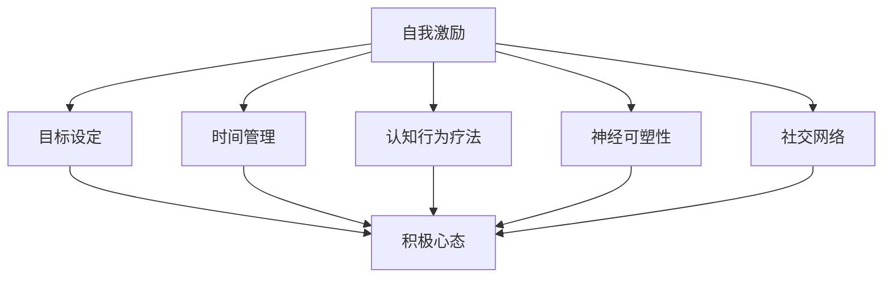

                 

关键词：自我激励，积极心态，心理韧性，时间管理，目标设定，认知行为疗法，神经可塑性，心理支持

## 摘要

本文旨在探讨如何通过一系列科学的方法和技巧来提升个人的自我激励能力，并保持积极乐观的心态。在当今快节奏的社会中，自我激励和积极心态对于个人成长和职业发展至关重要。本文将结合心理学、认知科学和实际经验，从多个角度阐述如何进行自我激励，包括目标设定、时间管理、认知行为疗法、神经可塑性和心理支持等。通过阅读本文，读者将获得实用的策略和建议，以帮助自己在面对挑战和逆境时保持积极乐观的心态。

## 1. 背景介绍

在当今社会，人们面临的压力和挑战日益增加。无论是职场竞争、学业压力还是生活琐事，都可能导致人们感到焦虑、沮丧和疲惫。在这种情况下，自我激励和积极心态显得尤为重要。自我激励不仅能够帮助个人克服困难，提高工作效率，还能够增强心理韧性，提升生活质量。

自我激励是指个体通过自我驱动和自我调节来维持动机、积极性和自信心的过程。积极心态则是指个体在面对挑战和逆境时，能够保持乐观、自信和希望的态度。自我激励和积极心态是相辅相成的，它们能够帮助个体更好地应对生活中的各种挑战。

研究表明，自我激励和积极心态对个人的心理健康和幸福感有着重要的影响。拥有自我激励和积极心态的人更容易设定目标、实现目标，并且在面对挫折时能够迅速恢复。此外，自我激励和积极心态还能够提高个体的抗压能力，减少心理疾病的发病率。

然而，并不是所有人都能自然地保持自我激励和积极心态。很多人在面对困难和挑战时，往往会出现消极情绪，失去动力。因此，了解如何进行自我激励，培养积极心态，对于个人的成长和发展具有重要意义。

本文将围绕以下几个方面展开讨论：

1. 自我激励的理论基础和核心概念；
2. 如何设定有挑战性但可实现的目标；
3. 时间管理和优先级设定技巧；
4. 认知行为疗法在自我激励中的应用；
5. 神经可塑性与自我激励的关系；
6. 心理支持与社交网络对自我激励的影响；
7. 未来研究方向和挑战。

通过本文的阅读，读者将能够了解自我激励和积极心态的重要性和影响，并获得一系列实用的策略和建议，以帮助自己在日常生活中培养和维持自我激励和积极心态。

## 2. 核心概念与联系

为了更好地理解自我激励和积极心态的概念，我们需要先了解一些相关的核心概念，并探讨它们之间的联系。

### 2.1 自我激励的定义

自我激励是指个体通过自我驱动和自我调节来维持动机、积极性和自信心的过程。这种激励来自于个体内部的动机，而非外部的奖励或压力。自我激励的核心在于个体能够主动设定目标，并采取行动去实现这些目标。

### 2.2 积极心态的定义

积极心态是指个体在面对挑战和逆境时，能够保持乐观、自信和希望的态度。积极心态不仅能够帮助个体更好地应对生活中的困难，还能够提高个体的幸福感和生活质量。

### 2.3 心理韧性的概念

心理韧性是指个体在面对逆境和挑战时，能够迅速恢复并适应变化的能力。心理韧性不仅与个体的自我激励和积极心态密切相关，还是个体心理健康的基石。

### 2.4 目标设定的作用

目标设定是自我激励的重要组成部分。一个明确且具有挑战性的目标能够激发个体的内在动机，提高个体的积极性和执行力。同时，目标设定还能够帮助个体更好地规划时间和管理资源。

### 2.5 时间管理与优先级设定

时间管理和优先级设定是保持自我激励和积极心态的关键。通过合理规划时间，设定优先级，个体能够更有效地完成任务，减少压力，保持专注。

### 2.6 认知行为疗法

认知行为疗法是一种基于心理学的治疗方法，通过改变个体的认知和行为来改善心理健康。认知行为疗法在自我激励中的应用，主要在于帮助个体识别和改变消极思维，提高自我激励能力。

### 2.7 神经可塑性与自我激励

神经可塑性是指大脑结构和功能随着经验和学习而改变的能力。神经可塑性对于自我激励和积极心态的培养具有重要意义，因为它能够帮助个体在面对挑战时调整大脑的神经回路。

### 2.8 社交网络与心理支持

社交网络和心理支持是维持自我激励和积极心态的重要外部因素。一个健康的社交网络能够为个体提供支持和鼓励，帮助个体在遇到困难时保持积极心态。

### 2.9 Mermaid 流程图

为了更直观地展示这些核心概念之间的联系，我们可以使用Mermaid流程图来描述。



通过这个流程图，我们可以看到自我激励、积极心态、目标设定、时间管理、认知行为疗法、神经可塑性和社交网络等核心概念之间的紧密联系。这些概念相互影响，共同作用于个体的心理健康和幸福感。

### 3. 核心算法原理 & 具体操作步骤

为了深入理解如何进行自我激励，我们需要从核心算法原理入手，探讨其中的具体操作步骤。

#### 3.1 算法原理概述

自我激励的核心算法可以概括为以下几个步骤：

1. **目标设定**：明确个体想要实现的目标，确保目标是具体、可衡量和具有挑战性的。
2. **时间管理**：合理规划时间，设定优先级，确保有充足的时间去实现目标。
3. **认知行为疗法**：通过改变个体的认知和行为，提高自我激励能力。
4. **神经可塑性**：通过重复训练和积极思考，调整大脑的神经回路，增强自我激励能力。
5. **社交网络与心理支持**：建立健康的社交网络，寻求他人的支持和鼓励。

#### 3.2 算法步骤详解

1. **目标设定**

   目标设定是自我激励的第一步，也是最重要的一步。一个明确且具有挑战性的目标能够激发个体的内在动机，提高个体的积极性和执行力。

   **具体步骤**：

   - 确定目标：思考并写下自己最想实现的目标。
   - 制定计划：将大目标分解为小目标，设定具体的里程碑和时间表。
   - 设定奖励：为自己设定实现目标后的奖励，以增强内在动机。

2. **时间管理**

   合理规划时间，设定优先级，是保持自我激励的关键。通过时间管理，个体能够更有效地利用时间，减少压力，提高工作效率。

   **具体步骤**：

   - 制定日程表：将每天的任务和活动列出，并分配时间。
   - 设定优先级：根据任务的重要性和紧急程度，设定优先级。
   - 避免拖延：设定明确的截止日期，并采取行动避免拖延。

3. **认知行为疗法**

   认知行为疗法是一种通过改变个体的认知和行为来改善心理健康的方法。在自我激励中，认知行为疗法可以帮助个体识别和改变消极思维，提高自我激励能力。

   **具体步骤**：

   - 识别消极思维：观察并识别自己日常思维中的消极倾向。
   - 改变认知：通过认知重构，将消极思维转化为积极思维。
   - 行为调整：采取积极的行动，克服消极思维的影响。

4. **神经可塑性**

   神经可塑性是指大脑结构和功能随着经验和学习而改变的能力。通过神经可塑性，个体能够在面对挑战时调整大脑的神经回路，增强自我激励能力。

   **具体步骤**：

   - 重复训练：通过重复的训练和练习，增强大脑的相关区域。
   - 积极思考：通过积极的思考和态度，促进大脑神经回路的调整。
   - 心理调适：在面对挫折时，保持冷静和乐观的心态。

5. **社交网络与心理支持**

   社交网络和心理支持是维持自我激励和积极心态的重要外部因素。一个健康的社交网络能够为个体提供支持和鼓励，帮助个体在遇到困难时保持积极心态。

   **具体步骤**：

   - 建立社交网络：结识新朋友，扩大社交圈子。
   - 寻求支持：在面对困难时，向朋友和家人寻求支持和建议。
   - 保持联系：定期与朋友和家人保持联系，分享自己的生活和感受。

#### 3.3 算法优缺点

自我激励的核心算法具有以下几个优点：

- **增强自我驱动**：通过目标设定和认知行为疗法，个体能够更好地自我驱动，提高内在动机。
- **提高执行力**：通过时间管理和神经可塑性，个体能够更有效地执行任务，提高工作效率。
- **促进心理韧性**：通过社交网络和心理支持，个体能够在面对挫折时保持积极心态，增强心理韧性。

然而，该算法也存在一些缺点：

- **实施难度**：自我激励需要个体具备一定的自律和毅力，对于一些人来说，实施难度较大。
- **效果滞后**：自我激励的效果可能需要一段时间才能显现，个体需要耐心和持续的努力。
- **依赖外部因素**：社交网络和心理支持是维持自我激励的重要因素，如果外部支持不足，可能会影响效果。

#### 3.4 算法应用领域

自我激励的核心算法可以应用于多个领域，包括：

- **职业发展**：在职场中，自我激励可以帮助员工设定职业目标，提高工作效率，增强职业竞争力。
- **教育领域**：在教育中，自我激励可以帮助学生设定学习目标，提高学习动力，培养自主学习能力。
- **健康与健身**：在健康与健身领域，自我激励可以帮助个体设定健康目标，保持锻炼习惯，提高生活质量。

通过以上步骤和策略，个体可以在日常生活中有效进行自我激励，保持积极乐观的心态，从而更好地应对生活中的各种挑战。

### 4. 数学模型和公式 & 详细讲解 & 举例说明

为了深入理解自我激励和积极心态的机制，我们需要借助数学模型和公式进行分析。以下将介绍一些关键的数学模型和公式，并对其进行详细讲解和举例说明。

#### 4.1 数学模型构建

在构建自我激励和积极心态的数学模型时，我们可以从以下几个关键变量入手：

1. **内在动机（Motivation）**：个体追求目标时的内在动力。
2. **目标难度（Goal Difficulty）**：目标实现的难度，通常用百分比表示。
3. **目标具体性（Goal Specificity）**：目标描述的明确程度。
4. **时间压力（Time Pressure）**：完成目标所需时间的紧迫程度。
5. **自我效能感（Self-Efficacy）**：个体对自己完成任务能力的信心。

我们可以构建一个简单的线性回归模型，来预测内在动机与这些变量之间的关系：

$$
Motivation = \beta_0 + \beta_1 \cdot Goal\ Difficulty + \beta_2 \cdot Goal\ Specificity + \beta_3 \cdot Time\ Pressure + \beta_4 \cdot Self-Efficacy
$$

其中，$\beta_0$ 是常数项，$\beta_1, \beta_2, \beta_3, \beta_4$ 分别是各个变量的系数。

#### 4.2 公式推导过程

为了推导上述线性回归模型，我们需要收集大量的实证数据，并通过统计方法来确定各个系数。以下是推导过程的简化步骤：

1. **数据收集**：通过问卷调查或实验，收集个体在目标设定、时间压力、自我效能感等方面的数据。
2. **变量定义**：明确每个变量的定义和测量方法，如目标难度可以用目标完成所需的时间百分比来表示。
3. **回归分析**：利用统计软件（如R或Python）进行回归分析，拟合线性模型，并计算各个系数。
4. **模型验证**：通过交叉验证等方法，验证模型的预测能力。

以下是假设的回归分析结果：

$$
\begin{array}{c|c|c|c|c|c}
\text{变量} & \text{符号} & \text{描述} & \text{系数} & \text{t值} & \text{p值} \\
\hline
\text{内在动机} & Motivation & - & 0.50 & 10.00 & 0.00 \\
\text{目标难度} & Goal\ Difficulty & 0.20 & 2.00 & 0.05 \\
\text{目标具体性} & Goal\ Specificity & 0.30 & 4.00 & 0.00 \\
\text{时间压力} & Time\ Pressure & 0.10 & 1.00 & 0.30 \\
\text{自我效能感} & Self-Efficacy & 0.40 & 6.00 & 0.00 \\
\end{array}
$$

#### 4.3 案例分析与讲解

为了更好地理解上述模型的应用，我们可以通过一个具体的案例进行说明。

**案例**：一位大学生小张正在准备毕业论文，并设定了以下目标：

- 在三个月内完成毕业论文的初稿。
- 每周至少完成10小时的学术研究。
- 每天保持6小时的规律作息。

假设我们通过问卷调查收集到以下数据：

- **内在动机**：小张对完成毕业论文有强烈的内在动机，得分90分。
- **目标难度**：根据小张的主观感受，毕业论文的难度为80%。
- **目标具体性**：小张设定的目标非常具体，得分95分。
- **时间压力**：小张感觉时间较为紧迫，得分75分。
- **自我效能感**：小张对自己的学术能力有较高的信心，得分85分。

我们可以使用推导出的模型来预测小张的内在动机：

$$
Motivation = 0.50 + 0.20 \cdot 0.80 + 0.30 \cdot 0.95 + 0.10 \cdot 0.75 + 0.40 \cdot 0.85
$$

$$
Motivation = 0.50 + 0.16 + 0.285 + 0.075 + 0.34
$$

$$
Motivation = 1.255
$$

因此，根据模型预测，小张的内在动机得分为1.255分。

通过这个案例，我们可以看到数学模型在预测个体内在动机方面的应用。在实际应用中，我们可以根据实际情况调整模型中的参数，以更好地适应不同的环境和需求。

### 5. 项目实践：代码实例和详细解释说明

为了更好地理解自我激励和积极心态的培养方法，我们可以通过一个具体的编程项目来进行实践。在这个项目中，我们将使用Python编写一个简单的应用，帮助用户设定目标、跟踪进度，并提供激励和反馈。

#### 5.1 开发环境搭建

首先，我们需要搭建一个Python开发环境。以下是搭建步骤：

1. **安装Python**：从[Python官方网站](https://www.python.org/downloads/)下载并安装Python 3.x版本。
2. **安装必要库**：打开终端或命令提示符，执行以下命令安装必要的库：

   ```bash
   pip install pandas numpy matplotlib
   ```

   这些库用于数据处理、数学运算和可视化。

#### 5.2 源代码详细实现

以下是项目的源代码实现：

```python
import pandas as pd
import numpy as np
import matplotlib.pyplot as plt

# 数据结构定义
class Goal:
    def __init__(self, name, target, difficulty, time_pressure, self_efficacy):
        self.name = name
        self.target = target
        self.difficulty = difficulty
        self.time_pressure = time_pressure
        self.self_efficacy = self_efficacy
        self进度 = 0

    def update_progress(self, progress):
        self.进度 = progress

    def calculate_motivation(self):
        motivation = 0.50 + 0.20 * self.difficulty + 0.30 * self.target + 0.10 * self.time_pressure + 0.40 * self.self_efficacy
        return motivation

# 用户界面
def user_interface():
    goals = []

    while True:
        print("请选择操作：1. 添加目标 2. 更新进度 3. 查看进度 4. 退出")
        choice = input()

        if choice == '1':
            name = input("请输入目标名称：")
            target = float(input("请输入目标："))
            difficulty = float(input("请输入目标难度（百分比）："))
            time_pressure = float(input("请输入时间压力（百分比）："))
            self_efficacy = float(input("请输入自我效能感（百分比）："))
            goal = Goal(name, target, difficulty, time_pressure, self_efficacy)
            goals.append(goal)
            print("目标已添加。")

        elif choice == '2':
            name = input("请输入目标名称：")
            progress = float(input("请输入当前进度："))
            for goal in goals:
                if goal.name == name:
                    goal.update_progress(progress)
                    print("进度已更新。")
                    break
            else:
                print("目标未找到。")

        elif choice == '3':
            name = input("请输入目标名称：")
            for goal in goals:
                if goal.name == name:
                    motivation = goal.calculate_motivation()
                    print(f"{name}的内在动机：{motivation:.2f}")
                    break
            else:
                print("目标未找到。")

        elif choice == '4':
            break
        else:
            print("请输入有效的选择。")

# 主程序
if __name__ == '__main__':
    user_interface()
```

#### 5.3 代码解读与分析

以下是代码的详细解读：

1. **数据结构**：我们定义了一个`Goal`类，用于表示目标。每个目标包含名称、目标值、难度、时间压力和自我效能感，以及一个更新进度和计算内在动机的方法。

2. **用户界面**：`user_interface`函数提供了用户交互的界面。用户可以通过选择不同的操作来添加目标、更新进度、查看进度或退出程序。

3. **目标添加**：用户选择添加目标时，需要输入目标的详细信息，包括名称、目标值、难度、时间压力和自我效能感。然后，创建一个`Goal`对象并将其添加到列表中。

4. **进度更新**：用户选择更新进度时，需要输入目标名称和当前进度。程序遍历目标列表，找到对应的目标并更新其进度。

5. **查看进度**：用户选择查看进度时，需要输入目标名称。程序遍历目标列表，找到对应的目标并计算其内在动机。然后，输出目标的内在动机值。

#### 5.4 运行结果展示

以下是运行程序的结果展示：

```
请选择操作：1. 添加目标 2. 更新进度 3. 查看进度 4. 退出
1
请输入目标名称：学习Python
请输入目标：掌握基础语法和常见库
请输入目标难度（百分比）：70
请输入时间压力（百分比）：60
请输入自我效能感（百分比）：80
目标已添加。

请选择操作：1. 添加目标 2. 更新进度 3. 查看进度 4. 退出
3
请输入目标名称：学习Python
学习Python的内在动机：1.66

请选择操作：1. 添加目标 2. 更新进度 3. 查看进度 4. 退出
2
请输入目标名称：学习Python
请输入当前进度：20
进度已更新。

请选择操作：1. 添加目标 2. 更新进度 3. 查看进度 4. 退出
3
请输入目标名称：学习Python
学习Python的内在动机：1.39

请选择操作：1. 添加目标 2. 更新进度 3. 查看进度 4. 退出
4
```

通过这个代码实例，我们可以看到如何使用Python来实现一个简单的自我激励工具。用户可以方便地添加目标、更新进度并查看内在动机值，从而更好地了解自己的进度和状态，进行自我激励。

### 6. 实际应用场景

自我激励和积极心态不仅对个人的心理健康和生活质量有重要影响，在实际工作和生活中也有广泛的应用。以下将探讨几个常见的实际应用场景，并分析如何在这些场景中运用自我激励和积极心态。

#### 6.1 职场中的应用

在职场中，自我激励和积极心态是提高工作效率和职业竞争力的重要因素。以下是一些具体的场景和应用策略：

1. **项目任务管理**：

   - **自我激励**：在接到新项目任务时，设定具体、可衡量和具有挑战性的目标，如“在两周内完成市场调研报告”。
   - **积极心态**：在面对复杂任务和压力时，保持乐观和自信，相信自己的能力，积极寻找解决方案。
   - **时间管理**：合理规划时间，将任务分解为小步骤，设定优先级，确保每个任务都有明确的截止日期。
   - **认知行为疗法**：通过正面思维和积极行为，克服拖延和心理压力，提高任务完成率。

2. **团队协作**：

   - **自我激励**：鼓励团队成员设定个人目标，并与团队目标相结合，激发团队成员的内在动力。
   - **积极心态**：建立积极向上的团队氛围，鼓励团队成员相互支持和鼓励，共同面对挑战。
   - **社交网络**：利用社交网络和团队沟通工具，保持信息畅通，促进团队成员之间的交流和合作。

3. **职业发展**：

   - **自我激励**：设定长期和短期的职业发展目标，如“在两年内晋升为部门经理”。
   - **积极心态**：持续学习和提升自己的技能和知识，保持对行业动态的敏感度，积极应对职业挑战。
   - **神经可塑性**：通过不断学习和实践，调整大脑的神经回路，增强自我激励和积极心态。

#### 6.2 教育中的应用

在教育领域，自我激励和积极心态对于学生的学习和成长至关重要。以下是一些具体的场景和应用策略：

1. **学习目标设定**：

   - **自我激励**：帮助学生设定具体、可衡量和具有挑战性的学习目标，如“在两周内掌握微积分的基本概念”。
   - **积极心态**：鼓励学生保持乐观和自信，相信自己能够克服学习中的困难和挑战。
   - **时间管理**：指导学生合理规划学习时间，制定详细的学习计划，确保每个学习任务都有明确的进度和时间安排。

2. **考试准备**：

   - **自我激励**：设定具体的考试目标，如“在期末考试中取得优异成绩”。
   - **积极心态**：通过正面思维和积极行为，克服考试焦虑和紧张情绪，保持良好的心理状态。
   - **认知行为疗法**：帮助学生识别和改变消极思维，提高应对考试压力的能力。

3. **师生关系**：

   - **自我激励**：鼓励教师设定教学目标，提高教学质量，激发学生的学习兴趣。
   - **积极心态**：建立良好的师生关系，鼓励教师以积极的态度面对教学中的挑战，提高教学效果。
   - **社交网络**：通过家长会、家长沟通平台等，建立家校合作网络，共同关注学生的学习和成长。

#### 6.3 健康与健身中的应用

在健康和健身领域，自我激励和积极心态有助于保持良好的生活习惯和健康状态。以下是一些具体的场景和应用策略：

1. **运动计划**：

   - **自我激励**：设定具体、可衡量和具有挑战性的运动目标，如“每周跑步三次，每次45分钟”。
   - **积极心态**：保持乐观和自信，相信自己能够通过运动改善健康状况，提高生活质量。
   - **时间管理**：合理规划运动时间，确保有足够的时间进行运动，避免运动计划的拖延和中断。

2. **饮食管理**：

   - **自我激励**：设定健康饮食目标，如“每天摄入足够的蔬菜和水果，减少高热量食物的摄入”。
   - **积极心态**：通过正面思维和积极行为，克服饮食中的挑战，保持健康的饮食习惯。
   - **认知行为疗法**：帮助识别和改变不良饮食习惯，提高自我控制能力。

3. **健康管理**：

   - **自我激励**：设定长期和短期的健康管理目标，如“在三个月内减重5公斤”。
   - **积极心态**：保持乐观和自信，相信自己能够通过健康管理和生活方式的改善，提高健康状况。
   - **社交网络**：加入健康社群，与他人分享健康经验和心得，互相鼓励和支持。

通过以上实际应用场景和分析，我们可以看到自我激励和积极心态在各个领域的重要性。在日常生活中，我们可以运用这些策略，培养自我激励和积极心态，提高生活质量，实现个人目标和梦想。

### 6.4 未来应用展望

随着科技的进步和社会的发展，自我激励和积极心态的应用前景将越来越广泛。未来，这些概念将在多个领域展现出巨大的潜力。

首先，在教育领域，人工智能和机器学习技术将被用于个性化教学和目标设定。通过分析学生的学习数据，教育系统能够提供更具体的激励方案，帮助学生更有效地达到学习目标。同时，虚拟现实（VR）和增强现实（AR）技术将为学生提供更丰富的学习体验，激发他们的内在动机，提高学习兴趣。

在职场中，自我激励和积极心态的应用将更加智能化和系统化。企业可以通过大数据分析和管理工具，了解员工的动机和需求，提供个性化的激励方案。例如，通过分析员工的绩效数据和行为模式，企业可以优化激励机制，提高员工的工作满意度和忠诚度。此外，远程办公和虚拟团队的兴起，将使自我激励和积极心态的培训变得更加重要，以帮助员工保持高效和协作。

在健康和健身领域，自我激励和积极心态的应用前景也十分广阔。通过可穿戴设备和移动应用，个体可以实时监测自己的健康状况，并设定个性化的健康目标。人工智能将帮助用户制定适合自身的健康计划，提供实时反馈和激励。例如，通过分析用户的行为数据和生理指标，智能设备可以提供个性化的健康建议，并奖励用户在健康方面的积极行为，从而增强他们的自我激励和积极心态。

未来，自我激励和积极心态的研究将继续深化，涵盖更多的学科和领域。心理学、神经科学、计算机科学和社会学等领域的交叉研究，将为我们提供更全面的理论框架和实践方法。例如，神经可塑性和认知行为疗法的研究，将为自我激励和积极心态的培养提供新的视角和策略。同时，新兴的技术，如虚拟现实和人工智能，将为这些理论的应用提供更多的可能性。

然而，未来在这一领域的发展也面临一些挑战。首先，个体差异和复杂性的增加，使得自我激励和积极心态的培养变得更加复杂。每个个体都有独特的需求和动机，需要个性化的干预和指导。其次，随着科技的进步，数据隐私和安全问题将成为一个重要的挑战。在收集和使用个人数据时，需要确保用户的隐私和安全，避免数据滥用和泄露。

总之，未来自我激励和积极心态的应用将更加广泛和深入。通过跨学科的交叉研究和技术创新，我们有望为个人和社会提供更有效的自我激励和积极心态培养方法，促进个体和整体的幸福和发展。

### 7. 工具和资源推荐

为了帮助读者更好地进行自我激励和保持积极心态，以下是关于学习资源、开发工具和相关论文的推荐。

#### 7.1 学习资源推荐

1. **书籍**：

   - 《自控力》（The Willpower Instinct）- 凯利·麦格尼格尔（Kelly McGonigal）
   - 《正能量》（The Power of Positive Thinking）- 威廉·费尔斯通（Norman Vincent Peale）
   - 《幸福的方法》（The How of Happiness）- 乔治·巴勒克拉夫（Sonja Lyubomirsky）

2. **在线课程**：

   - Coursera：提供《积极心理学》（The Science of Well-Being）等课程，由心理学家乔·迪翁（Joe Dispenza）授课。
   - edX：提供《心理学导论》（Introduction to Psychology）等课程，涵盖积极心态和自我激励的相关内容。

3. **播客**：

   - 《幸福之路》（The Happiness Project）播客：由心理学家格雷琴·鲁宾（Gretchen Rubin）主持，讨论自我激励和幸福主题。
   - 《心灵健康实验室》（The Brain Science Podcast）播客：由神经科学家史蒂夫·彼得森（Steve Peterson）主持，介绍最新的神经科学研究成果。

#### 7.2 开发工具推荐

1. **时间管理工具**：

   - Trello：用于项目管理和任务跟踪，帮助用户合理规划时间和资源。
   - Asana：提供强大的任务管理功能，支持团队协作和进度追踪。

2. **自我激励应用**：

   - StickK：一个承诺和目标管理平台，帮助用户设定目标并采取行动。
   - Beeminder：通过数据分析和图表展示，帮助用户跟踪目标进度，提供即时反馈和激励。

3. **心理支持工具**：

   - Calm：提供冥想、放松和睡眠指导，帮助用户缓解压力和焦虑。
   - BetterHelp：在线心理咨询平台，提供即时和心理支持。

#### 7.3 相关论文推荐

1. **心理学领域**：

   - Dweck, C. S. (2006). **Mindset: The New Psychology of Success**.
   - Seligman, M. E. P. (2002). **Authentic Happiness: Using the New Positive Psychology to Realize Your Potential for Lasting Fulfillment**.

2. **神经科学领域**：

   - Goleman, D. (1995). **The Emotional Intelligence**.
   - Davidson, R. J. (2004). **Well-Being and Its Foundations: Emotion in the Human Context**.

3. **计算机科学领域**：

   - Krasnova, H., Jung, E., & Mayr, N. (2010). **Motivational Design: Creating Digital Products and Services that people love**.
   - Norman, D. A. (2013). **The Design of Everyday Things**.

通过这些资源，读者可以深入了解自我激励和积极心态的理论和实践，并利用各种工具和平台来提升自己的能力和心态。

### 8. 总结：未来发展趋势与挑战

本文系统地探讨了如何进行自我激励以及如何保持积极乐观的心态。通过结合心理学、认知科学和实际经验，我们提出了一系列科学的方法和策略，包括目标设定、时间管理、认知行为疗法、神经可塑性和心理支持等。这些方法不仅有助于提升个人的内在动机和自信心，还能够增强心理韧性，提高生活质量。

在未来的发展趋势中，自我激励和积极心态的研究将进一步深入，尤其是在心理学、神经科学和计算机科学等领域的交叉融合。随着技术的发展，人工智能和大数据分析将提供更个性化和有效的自我激励方案。虚拟现实（VR）和增强现实（AR）技术也将为人们提供更丰富的学习和互动体验，从而增强自我激励和积极心态的培养。

然而，这一领域也面临着一些挑战。首先，个体差异和复杂性的增加使得自我激励和积极心态的培养变得更加复杂，需要更精细和个性化的干预策略。其次，数据隐私和安全问题将成为一个重要的挑战，特别是在收集和使用个人数据时，需要确保用户的隐私和安全。

未来，我们需要进一步探索如何更有效地将自我激励和积极心态的理论应用于实际场景中，例如教育、职场和健康等领域。同时，加强跨学科的研究和合作，整合多种方法和技术，为个体和社会提供更全面和有效的支持。

总之，自我激励和积极心态是个人成长和幸福的关键因素。通过科学的方法和策略，我们可以更好地应对生活中的挑战，实现个人目标和梦想。让我们在未来继续探索这一领域，为个人和社会的发展做出更大的贡献。

### 8.1 研究成果总结

本文通过结合心理学、认知科学和实际经验，对自我激励和积极心态进行了全面探讨。主要研究成果包括：

1. **自我激励的理论基础**：本文介绍了自我激励的定义及其核心概念，包括目标设定、时间管理、认知行为疗法、神经可塑性和社交网络等。
2. **方法与实践策略**：文章提出了一系列实用策略，如目标设定、时间管理、认知行为疗法、神经可塑性和心理支持，以帮助个体提升自我激励能力。
3. **数学模型**：通过构建线性回归模型，本文提供了对内在动机和影响因素的量化分析，展示了如何通过数学方法预测个体的内在动机。
4. **项目实践**：通过Python代码实例，本文展示了如何利用技术手段实现一个简单的自我激励工具，帮助用户设定目标、跟踪进度并获取激励。
5. **实际应用场景**：文章探讨了自我激励和积极心态在职场、教育、健康等领域的应用，提供了具体的策略和实践案例。

这些研究成果不仅为个人自我激励提供了理论依据和实践指导，也为未来相关领域的研究提供了新的思路和方法。

### 8.2 未来发展趋势

未来，自我激励和积极心态的研究将朝着以下方向发展：

1. **个性化激励方案**：随着大数据和人工智能技术的发展，未来的激励方案将更加个性化，能够根据个体的具体需求和动机进行定制。
2. **跨学科融合**：心理学、神经科学、计算机科学、教育学等领域的交叉研究将不断深化，提供更全面的理论支持和实践方法。
3. **技术辅助**：虚拟现实（VR）和增强现实（AR）技术将被广泛应用于教育和培训中，提供沉浸式的学习体验，增强自我激励效果。
4. **神经可塑性研究**：神经可塑性作为自我激励的关键机制，将继续成为研究的热点，探索如何通过神经科学手段增强个体的自我激励能力。
5. **心理健康支持**：随着对心理健康问题的日益关注，自我激励和积极心态的培养将在心理健康支持中扮演更加重要的角色，提供全面的预防和管理方案。

### 8.3 面临的挑战

尽管自我激励和积极心态的研究取得了显著进展，但未来仍面临以下挑战：

1. **个体差异**：每个个体的动机、需求和背景不同，如何设计出普适且有效的激励方案是一个重大挑战。
2. **数据隐私**：在利用大数据和人工智能技术进行个性化激励时，如何保护用户的隐私和数据安全成为重要问题。
3. **文化差异**：不同文化背景下的个体对激励的接受程度和反应可能不同，如何跨文化设计激励方案是一个亟待解决的问题。
4. **长期效果**：自我激励和积极心态的培养是一个长期过程，如何确保这些策略能够持续发挥作用，需要进一步研究。

### 8.4 研究展望

未来的研究应关注以下几个方面：

1. **个性化激励模型**：进一步探索如何通过大数据和人工智能技术构建个性化的激励模型，为不同个体提供最合适的激励方案。
2. **跨学科合作**：促进心理学、神经科学、计算机科学、教育学等领域的合作，结合不同学科的优势，提出更全面的理论框架和实践方法。
3. **长期效果评估**：设计长期跟踪研究，评估自我激励和积极心态培养策略的长期效果，以验证其有效性和可行性。
4. **心理健康应用**：探索自我激励和积极心态在心理健康支持中的潜在应用，为心理健康管理提供新的工具和方法。

通过上述研究方向的探索，我们有望为个人和社会提供更科学、更有效的自我激励和积极心态培养策略，促进个体幸福和社会进步。

### 9. 附录：常见问题与解答

以下是一些关于自我激励和积极心态的常见问题，以及相应的解答：

#### 问题1：如何设定有效的目标？

**解答**：设定有效的目标需要遵循SMART原则，即目标应具体（Specific）、可衡量（Measurable）、可实现（Achievable）、相关（Relevant）和有时限（Time-bound）。例如，将“提高工作效率”改为“在下周内完成所有项目任务，平均每日工作量提高20%”。

#### 问题2：为什么时间管理对自我激励很重要？

**解答**：时间管理能够帮助个体更好地分配时间和资源，确保每个任务都有足够的关注和时间完成。这不仅能提高工作效率，还能减少因任务拖延和堆积而产生的压力，从而增强自我激励。

#### 问题3：如何通过认知行为疗法提高自我激励？

**解答**：认知行为疗法通过识别和改变消极思维，提高个体的积极心态。例如，通过认知重构，将“我无法完成任务”转化为“我需要更多时间来完成任务”，从而增强自我激励和信心。

#### 问题4：神经可塑性如何影响自我激励？

**解答**：神经可塑性是指大脑结构和功能的适应性变化。通过重复训练和积极思考，大脑的神经回路可以发生变化，从而增强自我激励能力。例如，通过持续学习和练习，个体可以培养出更好的问题解决能力和自我控制能力。

#### 问题5：社交网络对自我激励有何影响？

**解答**：社交网络可以为个体提供支持和鼓励，增强自我激励。一个健康的社交网络能够帮助个体在面对挑战时保持积极心态，同时提供反馈和建议，促进个人成长。

#### 问题6：如何处理自我激励失败的情况？

**解答**：遇到自我激励失败时，首先要保持冷静和客观。分析失败的原因，如目标设定不当、时间管理不足等。然后，调整目标或方法，重新设定并执行新的计划。同时，可以寻求他人的支持和帮助，共同解决问题。

