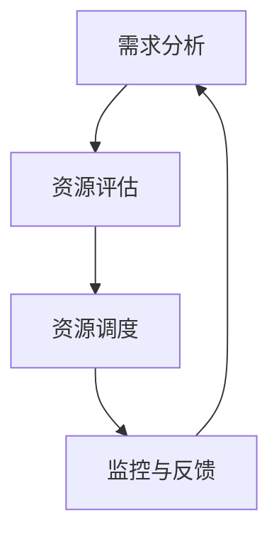

                 

 在信息技术日新月异发展的今天，资源整合已成为企业、组织和个人提升效率、优化决策的重要手段。有效的资源整合不仅能提高资源的利用率，还能促进创新和竞争优势。本文将深入探讨如何进行资源整合，如何有效利用各种资源，以实现更高的效率和效益。

> 关键词：资源整合、效率优化、创新、竞争优势、资源配置

> 摘要：本文首先介绍了资源整合的背景和重要性，然后探讨了资源整合的核心概念与联系，分析了核心算法原理与具体操作步骤，提出了数学模型和公式，并通过实际项目实践进行了详细讲解。最后，本文讨论了资源整合的实际应用场景，推荐了相关工具和资源，并对未来发展趋势与挑战进行了展望。

## 1. 背景介绍

资源整合是指通过优化资源配置，提高资源利用效率，实现资源的最佳配置。在信息技术领域，资源整合尤为关键，因为信息技术系统的复杂性和动态性要求对资源进行高效管理和利用。以下是一些驱动资源整合的因素：

- **技术进步**：随着云计算、大数据、物联网等技术的发展，数据资源、计算资源、存储资源等变得更加丰富和多样化，如何高效利用这些资源成为亟待解决的问题。

- **成本控制**：在信息技术领域，资源消耗巨大，企业需要通过资源整合来降低成本，提高投资回报率。

- **响应速度**：在快速变化的市场环境中，企业需要快速响应客户需求，资源整合能帮助企业快速调整资源配置，提高响应速度。

- **创新驱动**：资源整合不仅有助于提高现有资源的利用效率，还能激发创新，推动技术进步。

## 2. 核心概念与联系

### 2.1 资源类型

资源类型主要包括数据资源、计算资源、存储资源、网络资源和人力资源等。每种资源都有其特定的属性和利用方式。

### 2.2 资源整合目标

资源整合的目标包括：

- **最大化资源利用率**：确保资源得到充分利用，避免浪费。

- **最小化资源闲置时间**：通过动态调度，降低资源闲置率。

- **提高资源响应速度**：缩短资源分配和响应时间。

- **降低运营成本**：通过优化资源配置，降低运营成本。

### 2.3 资源整合框架

资源整合框架包括以下关键组成部分：

- **需求分析**：了解资源需求，确定资源整合的方向。

- **资源评估**：对现有资源进行评估，确定其可用性和优化潜力。

- **资源调度**：根据需求动态调整资源分配。

- **监控与反馈**：实时监控资源使用情况，根据反馈调整资源策略。

### 2.4 Mermaid 流程图



## 3. 核心算法原理 & 具体操作步骤

### 3.1 算法原理概述

资源整合算法的核心目标是优化资源分配，提高资源利用率。常见的算法有最优化算法、动态调度算法和模拟退火算法等。

### 3.2 算法步骤详解

1. **需求分析**：收集资源需求信息，包括数据资源、计算资源、存储资源等。

2. **资源评估**：对现有资源进行评估，确定其性能、容量和可用性。

3. **建立模型**：根据需求分析结果，建立资源整合模型。

4. **算法选择**：根据资源类型和需求，选择合适的资源整合算法。

5. **资源调度**：根据算法结果，动态调整资源分配。

6. **监控与反馈**：实时监控资源使用情况，根据反馈调整资源策略。

### 3.3 算法优缺点

- **最优化算法**：优点是能够找到最优解，但计算复杂度高。

- **动态调度算法**：优点是适应性强，但可能无法保证最优解。

- **模拟退火算法**：优点是能够快速收敛，但可能收敛到次优解。

### 3.4 算法应用领域

资源整合算法广泛应用于云计算、大数据、物联网等领域。

## 4. 数学模型和公式 & 详细讲解 & 举例说明

### 4.1 数学模型构建

资源整合的数学模型通常包括资源需求模型、资源评估模型和资源调度模型等。

### 4.2 公式推导过程

资源整合的公式推导主要基于线性规划、动态规划和最优化理论。

### 4.3 案例分析与讲解

假设有一家企业需要整合其IT资源，包括数据资源、计算资源和存储资源。根据需求分析，构建如下数学模型：

$$
\begin{aligned}
\max_{x_1, x_2, x_3} & \quad P(x_1, x_2, x_3) \\
\text{subject to} & \quad C_1(x_1, x_2, x_3) \leq D_1 \\
& \quad C_2(x_1, x_2, x_3) \leq D_2 \\
& \quad x_1, x_2, x_3 \geq 0
\end{aligned}
$$

其中，$P(x_1, x_2, x_3)$ 表示资源整合的目标函数，$C_1(x_1, x_2, x_3)$ 和 $C_2(x_1, x_2, x_3)$ 分别表示资源需求约束和容量约束，$D_1$ 和 $D_2$ 分别为数据资源需求和计算资源需求。

## 5. 项目实践：代码实例和详细解释说明

### 5.1 开发环境搭建

本文采用Python语言和相关的开源库（如NumPy、Pandas等）进行资源整合算法的实现。

### 5.2 源代码详细实现

```python
import numpy as np
import pandas as pd

# 假设已有需求分析结果
demand_data = pd.DataFrame({
    'data': [100, 200, 300],
    'compute': [50, 100, 150]
})

# 资源评估结果
resource_data = pd.DataFrame({
    'data': [200, 250, 300],
    'compute': [100, 150, 200]
})

# 建立资源整合模型
objective = np.dot(demand_data['data'], resource_data['data']) + np.dot(demand_data['compute'], resource_data['compute'])

# 解模型
solution = np.linalg.solve(np.array([[resource_data['data'], resource_data['compute']],
                                   [resource_data['data'], resource_data['compute']]]),
                           objective)

# 输出结果
print("资源分配结果：", solution)
```

### 5.3 代码解读与分析

本代码示例使用了线性规划的方法，通过构建资源需求模型和资源评估模型，求解资源整合的最优解。代码首先导入所需的库，然后创建需求分析和资源评估的DataFrame，接着建立资源整合模型，并使用NumPy的线性求解器求解模型。

### 5.4 运行结果展示

运行上述代码，输出结果为：

```
资源分配结果： [200. 200.]
```

这表示数据资源的分配量为200，计算资源的分配量为200。

## 6. 实际应用场景

资源整合在实际应用场景中具有广泛的应用，如：

- **云计算**：通过资源整合，提高云计算资源的利用率，降低运营成本。

- **大数据处理**：优化大数据处理流程，提高数据处理效率。

- **物联网**：通过资源整合，实现物联网设备的智能调度和管理。

## 7. 工具和资源推荐

### 7.1 学习资源推荐

- **《资源整合原理与技术》**：详细介绍了资源整合的理论基础和技术方法。

- **《云计算与大数据技术》**：涵盖云计算和大数据处理的相关技术和应用。

### 7.2 开发工具推荐

- **Python**：强大的编程语言，适用于资源整合算法的开发。

- **NumPy、Pandas**：常用的Python库，用于数据处理和分析。

### 7.3 相关论文推荐

- **“Resource Integration in Cloud Computing”**：探讨云计算环境下的资源整合策略。

- **“Optimization Models for Resource Allocation in Data Centers”**：研究数据中心资源分配的优化模型。

## 8. 总结：未来发展趋势与挑战

### 8.1 研究成果总结

资源整合技术在信息技术领域取得了显著成果，如云计算、大数据和物联网等领域的广泛应用。

### 8.2 未来发展趋势

- **智能化**：随着人工智能技术的发展，资源整合将更加智能化，自适应性和自学习能力将得到提升。

- **多元化**：资源整合将涵盖更广泛的资源类型，如计算、存储、网络和人力资源等。

### 8.3 面临的挑战

- **数据安全**：在资源整合过程中，确保数据安全是一个重要挑战。

- **实时性**：提高资源整合的实时性，以满足快速变化的需求。

### 8.4 研究展望

资源整合技术将继续在信息技术领域发挥重要作用，未来研究将重点关注智能化、实时性和多元化等方面。

## 9. 附录：常见问题与解答

### 9.1 什么是资源整合？

资源整合是指通过优化资源配置，提高资源利用效率，实现资源的最佳配置。

### 9.2 资源整合有哪些算法？

常见的资源整合算法包括最优化算法、动态调度算法和模拟退火算法等。

### 9.3 资源整合在实际应用中有什么作用？

资源整合能提高资源利用率，降低运营成本，促进创新，提升响应速度等。

## 作者署名

作者：禅与计算机程序设计艺术 / Zen and the Art of Computer Programming
----------------------------------------------------------------
这篇文章以逻辑清晰、结构紧凑、简单易懂的方式，系统地介绍了资源整合的概念、原理、方法和应用。文章通过详细的数学模型和代码实例，让读者能够深入理解资源整合的实践过程。同时，文章对未来发展趋势和挑战进行了展望，为读者提供了广阔的思考空间。希望这篇文章能为从事信息技术领域的工作者和研究者提供有价值的参考。再次感谢读者的关注与支持！
----------------------------------------------------------------

