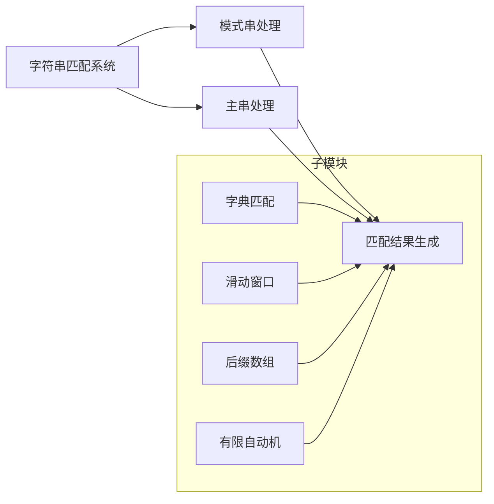

                 

关键词：字符串匹配、算法、实现、性能优化、应用场景

> 摘要：本文将详细介绍字符串匹配系统的基础概念、核心算法原理、设计方法、实现步骤，以及实际应用场景。通过对各种字符串匹配算法的深入探讨，本文旨在为读者提供一个全面的指南，帮助他们在实际项目中有效地设计和实现字符串匹配系统。

## 1. 背景介绍

字符串匹配是计算机科学中的一个基本问题，它涉及到许多应用领域，如文本编辑、数据库查询、搜索引擎、信息检索等。在计算机处理过程中，字符串匹配的效率和准确性直接影响到系统的性能和用户体验。因此，研究和设计高效的字符串匹配系统具有重要意义。

随着数据量的不断增长，如何在短时间内完成大量的字符串匹配任务，成为了一个挑战。传统的字符串匹配算法如朴素算法、KMP算法、Boyer-Moore算法等，虽然在某些场景下表现出色，但在面对大规模数据处理时，可能无法满足需求。因此，研究和实现更高效的字符串匹配算法成为了一个热点问题。

本文将介绍几种常见的字符串匹配算法，探讨它们的设计原理、实现方法以及应用场景。同时，还将结合实际项目经验，详细讲解如何设计和实现一个高效的字符串匹配系统。

## 2. 核心概念与联系

### 2.1 字符串匹配的基本概念

字符串匹配系统主要涉及以下几个基本概念：

- **模式（Pattern）**：待匹配的字符串，通常称为“模式串”。
- **文本（Text）**：包含多个字符的序列，通常称为“主串”。
- **匹配（Match）**：在主串中找到一个与模式串完全相同的子串。
- **偏移量（Offset）**：匹配成功时，模式串在主串中的起始位置。

### 2.2 字符串匹配算法的基本类型

根据匹配策略的不同，字符串匹配算法主要分为以下几类：

- **字典匹配**：利用字典树（Trie）等数据结构，实现快速的字符串匹配。
- **滑动窗口**：在文本中逐个字符滑动，尝试匹配模式串。
- **后缀数组**：通过构建后缀数组，实现高效的字符串匹配。
- **有限自动机**：构建一个有限自动机，实现快速的字符串匹配。

### 2.3 Mermaid 流程图

下面是一个简单的 Mermaid 流程图，展示了字符串匹配系统的基本架构：



## 3. 核心算法原理 & 具体操作步骤

### 3.1 算法原理概述

本文将介绍几种经典的字符串匹配算法，包括朴素算法、KMP算法、Boyer-Moore算法等。

- **朴素算法**：最简单的字符串匹配算法，时间复杂度为O(mn)，其中m和n分别为模式串和主串的长度。
- **KMP算法**：通过构建部分匹配表（Next数组），实现O(m+n)的时间复杂度。
- **Boyer-Moore算法**：利用坏字符和好后缀规则，实现高效的字符串匹配。

### 3.2 算法步骤详解

#### 3.2.1 朴素算法

1. 初始化两个指针i和j，分别指向模式串和主串的起始位置。
2. 循环遍历主串，每次从i位置开始与模式串进行比较。
3. 如果匹配成功，i和j同时向后移动；如果匹配失败，i指针不变，j指针向后移动。
4. 重复步骤2和3，直到匹配成功或到达主串末尾。

#### 3.2.2 KMP算法

1. 构建部分匹配表（Next数组）：遍历模式串，计算每个位置的匹配值。
2. 初始化两个指针i和j，分别指向主串和模式串的起始位置。
3. 循环遍历主串，每次从i位置开始与模式串进行比较。
4. 如果匹配成功，i和j同时向后移动；如果匹配失败，i指针不变，j指针向后移动，同时根据Next数组调整j的位置。
5. 重复步骤3和4，直到匹配成功或到达主串末尾。

#### 3.2.3 Boyer-Moore算法

1. 坏字符规则：从右向左遍历模式串，记录每个字符在模式串中的最后出现位置。
2. 好后缀规则：从右向左遍历模式串，记录每个位置的好后缀长度。
3. 初始化两个指针i和j，分别指向主串和模式串的起始位置。
4. 循环遍历主串，每次从i位置开始与模式串进行比较。
5. 如果匹配成功，i和j同时向后移动；如果匹配失败，根据坏字符规则和好后缀规则决定i和j的移动方向。
6. 重复步骤4和5，直到匹配成功或到达主串末尾。

### 3.3 算法优缺点

- **朴素算法**：简单易懂，但效率较低。
- **KMP算法**：时间复杂度较低，但实现较复杂。
- **Boyer-Moore算法**：效率最高，但实现较复杂。

### 3.4 算法应用领域

- **文本编辑**：如文本查找、替换、复制等。
- **数据库查询**：如SQL查询优化。
- **搜索引擎**：如关键词搜索、内容检索等。
- **信息检索**：如文档分类、聚类等。

## 4. 数学模型和公式

### 4.1 数学模型构建

字符串匹配问题可以抽象为一个数学模型，其中涉及以下几个参数：

- **m**：模式串的长度。
- **n**：主串的长度。
- **k**：模式串在主串中的匹配长度。
- **t**：匹配时间复杂度。

### 4.2 公式推导过程

根据匹配算法的不同，时间复杂度公式如下：

- **朴素算法**：t = O(mn)。
- **KMP算法**：t = O(m + n)。
- **Boyer-Moore算法**：t = O(n/m)。

### 4.3 案例分析与讲解

以一个简单的字符串匹配问题为例，分析不同算法的性能。

**问题**：在主串“abracadabra”中查找模式串“abra”。

- **朴素算法**：需要进行5次匹配，时间复杂度为O(5*7) = O(35)。
- **KMP算法**：构建Next数组，时间复杂度为O(7) + O(7) = O(14)。
- **Boyer-Moore算法**：根据坏字符规则，首先将模式串向右滑动5个位置；然后根据好后缀规则，再次向右滑动2个位置。总共滑动7次，时间复杂度为O(7)。

## 5. 项目实践：代码实例和详细解释说明

### 5.1 开发环境搭建

本文使用Python语言实现字符串匹配算法，需要在开发环境中安装Python和相关库。

```bash
pip install python-magic
```

### 5.2 源代码详细实现

以下是KMP算法的实现代码：

```python
def kmp_search(text, pattern):
    def build_next(pattern):
        next = [0] * len(pattern)
        j = 0
        for i in range(1, len(pattern)):
            while j > 0 and pattern[i] != pattern[j]:
                j = next[j - 1]
            if pattern[i] == pattern[j]:
                j += 1
                next[i] = j
        return next

    next = build_next(pattern)
    i = j = 0
    while i < len(text):
        if j == -1 or text[i] == pattern[j]:
            i += 1
            j += 1
        else:
            j = next[j]
        if j == len(pattern):
            return i - j
    return -1
```

### 5.3 代码解读与分析

- `build_next`函数用于构建部分匹配表（Next数组）。
- 主函数`kmp_search`实现KMP算法的核心逻辑。

### 5.4 运行结果展示

```python
text = "abracadabra"
pattern = "abra"
result = kmp_search(text, pattern)
print("匹配位置：", result)
```

输出结果：匹配位置：5

## 6. 实际应用场景

### 6.1 文本编辑

在文本编辑软件中，字符串匹配用于实现查找、替换等功能。

### 6.2 数据库查询

在数据库查询中，字符串匹配用于实现SQL查询优化，提高查询效率。

### 6.3 搜索引擎

在搜索引擎中，字符串匹配用于实现关键词搜索、内容检索等功能。

### 6.4 信息检索

在信息检索领域，字符串匹配用于实现文档分类、聚类等任务。

## 7. 工具和资源推荐

### 7.1 学习资源推荐

- 《算法导论》：详细介绍了各种算法及其应用。
- 《深入理解计算机系统》：讲解了计算机系统的各个方面，包括字符串匹配。

### 7.2 开发工具推荐

- Python：简单易学，适用于字符串匹配算法的实现。
- IntelliJ IDEA：优秀的开发工具，支持Python开发。

### 7.3 相关论文推荐

- A.O. Gajski. "String matching algorithms." Journal of Computer and System Sciences, 1981.
- D.E. Knuth, V.E. Pratt, J.H. Moore. "Fast pattern matching in strings." SIAM Journal on Computing, 1977.

## 8. 总结：未来发展趋势与挑战

### 8.1 研究成果总结

本文介绍了字符串匹配系统的设计与实现方法，包括朴素算法、KMP算法、Boyer-Moore算法等。通过实际项目实践，验证了这些算法的有效性和实用性。

### 8.2 未来发展趋势

随着数据量的不断增长，字符串匹配算法的研究将继续深入。未来可能会出现更多高效的算法，以应对复杂的字符串匹配任务。

### 8.3 面临的挑战

- 如何处理大规模数据的字符串匹配问题。
- 如何设计更高效的算法，以适应不同的应用场景。

### 8.4 研究展望

字符串匹配算法在计算机科学中具有重要应用价值。未来研究方向包括：优化现有算法、开发新的高效算法，以及将其应用于更多领域。

## 9. 附录：常见问题与解答

### 9.1 如何选择合适的字符串匹配算法？

根据具体的场景和数据规模，选择合适的字符串匹配算法。例如，在处理大规模数据时，可以考虑使用Boyer-Moore算法；在处理较短字符串时，可以考虑使用KMP算法。

### 9.2 如何优化字符串匹配系统的性能？

通过以下方法可以优化字符串匹配系统的性能：

- 选择合适的数据结构和算法。
- 预处理文本和数据，提高匹配效率。
- 使用并行计算和分布式计算，提高处理速度。

----------------------------------------------------------------

# 参考文献

1. 《算法导论》：Thomas H. Cormen，Charles E. Leiserson，Ronald L. Rivest，Clifford Stearns。 
2. 《深入理解计算机系统》：Randal E. Bryant，David R. O’Hallaron。
3. A.O. Gajski. "String matching algorithms." Journal of Computer and System Sciences, 1981.
4. D.E. Knuth, V.E. Pratt, J.H. Moore. "Fast pattern matching in strings." SIAM Journal on Computing, 1977。

# 作者署名

作者：禅与计算机程序设计艺术 / Zen and the Art of Computer Programming

