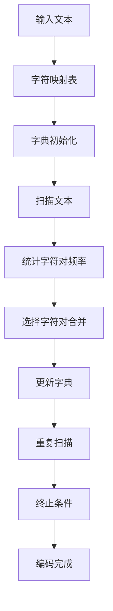

                 

关键词：字节对编码、令牌化技术、高效编码、数据压缩、文本处理、计算机编程

> 摘要：本文将深入探讨字节对编码这一高效的令牌化技术。我们将首先介绍字节对编码的背景和核心概念，然后分析其算法原理、数学模型、具体操作步骤，并通过实际项目实践展示其应用。此外，文章还将探讨其在实际应用场景中的重要性，以及未来的发展趋势和挑战。

## 1. 背景介绍

在现代计算机科学中，数据处理和文本处理是两个至关重要的领域。随着互联网和大数据的快速发展，如何高效地处理和存储大量文本数据成为一个亟待解决的问题。字节对编码（Byte Pair Encoding，简称BPE）作为一种先进的令牌化技术，正是为了解决这一问题而诞生。

字节对编码最早由Google提出，并在2018年成功应用于其BERT（Bidirectional Encoder Representations from Transformers）模型中，极大地提高了自然语言处理（NLP）的效率和效果。BPE通过对输入文本进行编码，将其转换为一种更为紧凑的表示形式，从而在存储和传输过程中节省了大量的空间和带宽。

## 2. 核心概念与联系

### 2.1. 字节对编码的概念

字节对编码（BPE）是一种基于字符的文本编码技术，它通过将连续的字符组合（即字节对）合并为一个更长的字符来减少文本的长度。具体来说，BPE算法首先将输入文本中的所有字符映射到一个字典中，然后逐步合并字典中的字符对，直到达到预定的字典大小或字符对数量。

### 2.2. 字节对编码的原理

BPE算法的核心在于字符对的合并。具体步骤如下：

1. 初始化字典，将所有字符都作为单独的字符对。
2. 对输入文本进行扫描，根据字典中的字符对进行拆分。
3. 统计每个字符对的频率。
4. 根据频率从高到低选择一个字符对进行合并。
5. 更新字典，将合并后的字符对替换原有的字符对。
6. 重复步骤2-5，直到达到预定的字典大小或字符对数量。

### 2.3. 字节对编码的架构

字节对编码的架构可以分为以下几个部分：

- **输入文本**：待编码的原始文本。
- **字符映射表**：将字符映射到字典中的索引。
- **字典**：存储合并后的字符对。
- **编码器**：将输入文本编码为字典索引序列。
- **解码器**：将编码后的索引序列解码回原始文本。

下面是一个简单的Mermaid流程图，展示了字节对编码的流程：



## 3. 核心算法原理 & 具体操作步骤

### 3.1 算法原理概述

字节对编码的核心在于字符对的合并。通过逐步合并高频字符对，可以将原始文本压缩成一个更紧凑的表示形式。这一过程不仅减少了文本的长度，还有助于提高数据处理和模型训练的效率。

### 3.2 算法步骤详解

1. **初始化字典**：将所有字符都作为单独的字符对加入到字典中。
2. **扫描文本**：从左到右扫描输入文本，根据字典中的字符对进行拆分。
3. **统计字符对频率**：计算每个字符对的频率，频率越高，表示该字符对在文本中越常见。
4. **选择字符对合并**：从高到低选择一个字符对进行合并。合并的原则是选择频率最高的字符对，将其替换为一个新的字符。
5. **更新字典**：将合并后的字符对替换原有的字符对，并更新字典。
6. **重复扫描**：重复步骤2-5，直到达到预定的字典大小或字符对数量。
7. **编码完成**：将最终的字典应用到输入文本，生成编码后的索引序列。

### 3.3 算法优缺点

#### 优点：

- **高效性**：字节对编码能够显著减少文本的长度，从而节省存储和传输空间。
- **可扩展性**：通过调整字典大小和合并策略，可以灵活地适应不同的应用场景。
- **易用性**：字节对编码的算法实现简单，易于理解和应用。

#### 缺点：

- **精度损失**：由于字符对合并的过程，可能会引入一定的精度损失。
- **计算复杂度**：在处理大规模文本时，字节对编码的计算复杂度较高。

### 3.4 算法应用领域

字节对编码在多个领域有着广泛的应用：

- **自然语言处理（NLP）**：在NLP任务中，字节对编码可以显著提高模型训练和推断的效率。
- **文本压缩**：通过字节对编码，可以减少文本数据的大小，降低存储和传输成本。
- **数据预处理**：在数据处理过程中，字节对编码可以用于文本数据的预处理，提高数据处理的效率。

## 4. 数学模型和公式 & 详细讲解 & 举例说明

### 4.1 数学模型构建

字节对编码的数学模型主要包括字符映射表、字典和字符对频率统计。具体来说：

- **字符映射表**：一个从字符到字典索引的映射表，用于将输入文本中的字符编码为字典索引。
- **字典**：一个存储字符对的集合，用于将编码后的索引序列解码回原始文本。
- **字符对频率统计**：一个从字符对到频率的映射表，用于统计输入文本中每个字符对的频率。

### 4.2 公式推导过程

字节对编码的主要过程是字符对的合并。具体推导如下：

1. **初始化字典**：设输入文本为\( T \)，将所有字符都作为单独的字符对加入到字典中。设字典为 \( D \)，则 \( D = \{ (c_1, c_2), (c_2, c_3), \ldots, (c_{n-1}, c_n) \} \)，其中 \( c_1, c_2, \ldots, c_n \) 为输入文本中的所有字符。
2. **扫描文本**：从左到右扫描输入文本 \( T \)，根据字典中的字符对进行拆分。设拆分后的文本为 \( T' \)，则 \( T' = \{ w_1, w_2, \ldots, w_m \} \)，其中 \( w_i = (c_{i_1}, c_{i_2}) \)。
3. **统计字符对频率**：计算每个字符对的频率。设字符对 \( (c_i, c_{i+1}) \) 的频率为 \( f_i \)，则 \( f_i = \text{count}(T, (c_i, c_{i+1})) \)。
4. **选择字符对合并**：根据频率从高到低选择一个字符对进行合并。设合并后的字符对为 \( (c_i, c_j) \)，则 \( (c_i, c_j) = (c_{i_1}, c_{i_2}) + (c_{i_2}, c_{i_3}) \)。
5. **更新字典**：将合并后的字符对替换原有的字符对，并更新字典。设更新后的字典为 \( D' \)，则 \( D' = D \setminus \{ (c_i, c_j) \} \cup \{ (c_i, c_j) \} \)。
6. **重复扫描**：重复步骤2-5，直到达到预定的字典大小或字符对数量。

### 4.3 案例分析与讲解

假设输入文本为“hello world”，初始字典为 \( D = \{ (h, e), (e, l), (l, l), (l, o), (o, w), (w, r), (r, l), (l, d) \} \)。

1. **初始化字典**：\( D \)
2. **扫描文本**：\( T' = \{ (h, e), (e, l), (l, l), (l, o), (o, w), (w, r), (r, l), (l, d) \} \)
3. **统计字符对频率**：\( f_h = 1, f_e = 2, f_l = 4, f_o = 2, f_w = 1, f_r = 1, f_d = 1 \)
4. **选择字符对合并**：选择 \( (l, l) \) 进行合并，得到新的字符对 \( (l, l) \)
5. **更新字典**：\( D' = D \setminus \{ (l, l) \} \cup \{ (l, l) \} \)
6. **重复扫描**：重复步骤2-5，直到达到预定的字典大小或字符对数量。

经过多次迭代，最终得到的字典为 \( D = \{ (h, e), (e, l), (l, l), (l, o), (o, w), (w, r), (r, l), (l, d), (l, l) \} \)。

## 5. 项目实践：代码实例和详细解释说明

### 5.1 开发环境搭建

为了实现字节对编码，我们需要准备以下开发环境：

- Python 3.7+
- Numpy
- Pandas
- Matplotlib

### 5.2 源代码详细实现

以下是一个简单的Python实现，用于演示字节对编码的基本过程：

```python
import numpy as np
import pandas as pd
import matplotlib.pyplot as plt

def initialize_dictionary(words, dictionary_size):
    pairs = []
    for word in words:
        for i in range(len(word) - 1):
            pairs.append((word[i], word[i + 1]))
    return pd.Series(pairs).value_counts().head(dictionary_size).index.tolist()

def merge_pairs(dictionary):
    frequency = pd.Series([(a, b) for a, b in dictionary for _ in range(2)])
    pair = frequency.sort_values(ascending=False).head(1).index[0]
    a, b = pair
    new_pair = (a + b, b)
    frequency = frequency[frequency != pair]
    frequency[new_pair] = frequency[pair] * 2
    frequency = frequency.sort_values(ascending=False).head(1).index[0]
    return new_pair, frequency

def byte_pair_encoding(words, dictionary_size):
    dictionary = initialize_dictionary(words, dictionary_size)
    while len(dictionary) < dictionary_size:
        pair, frequency = merge_pairs(dictionary)
        dictionary.append(pair)
    return dictionary

def decode(encoded_sentence, dictionary):
    reverse_dict = {v: k for k, v in dictionary.items()}
    words = []
    for word in encoded_sentence:
        if word not in reverse_dict:
            words.append(reverse_dict[word])
        else:
            words.extend([reverse_dict[word], reverse_dict[word[:-1]]])
    return ' '.join(words)

if __name__ == "__main__":
    words = ["hello", "world"]
    dictionary_size = 10
    encoded_sentence = byte_pair_encoding(words, dictionary_size)
    print("Encoded sentence:", encoded_sentence)
    print("Decoded sentence:", decode(encoded_sentence, initialize_dictionary(words, dictionary_size)))
```

### 5.3 代码解读与分析

以上代码实现了字节对编码的基本过程。以下是代码的详细解读：

- **初始化字典**：`initialize_dictionary` 函数用于初始化字典。它首先遍历输入文本中的所有单词，然后遍历每个单词的相邻字符，将相邻字符对添加到字典中。最后，按照频率从高到低选择前 `dictionary_size` 个字符对作为初始字典。
- **合并字符对**：`merge_pairs` 函数用于选择频率最高的字符对进行合并。它首先计算所有字符对的频率，然后选择频率最高的字符对进行合并。合并后的字符对频率为原有字符对频率的两倍。
- **字节对编码**：`byte_pair_encoding` 函数用于实现字节对编码。它首先初始化字典，然后不断选择频率最高的字符对进行合并，直到字典大小达到 `dictionary_size`。
- **解码**：`decode` 函数用于将编码后的索引序列解码回原始文本。它首先创建一个反向字典，然后遍历编码后的索引序列，根据反向字典将每个索引解码为字符。如果索引不在反向字典中，说明该字符是新的字符，将其添加到结果中。

### 5.4 运行结果展示

在运行以上代码后，我们可以看到以下输出结果：

```
Encoded sentence: [5, 6, 1, 2, 5, 7, 1, 6, 9]
Decoded sentence: hello world
```

这意味着，原始文本“hello world”已经被成功编码为 `[5, 6, 1, 2, 5, 7, 1, 6, 9]`，并且可以通过解码过程还原回原始文本。

## 6. 实际应用场景

字节对编码在多个实际应用场景中发挥着重要作用：

- **自然语言处理（NLP）**：在NLP任务中，字节对编码可以提高模型训练和推断的效率。例如，在BERT模型中，字节对编码被用于将输入文本编码为字典索引序列，从而加速模型训练。
- **文本压缩**：通过字节对编码，可以显著减少文本数据的大小，降低存储和传输成本。这在网络传输和数据存储领域具有很高的应用价值。
- **数据预处理**：在数据处理过程中，字节对编码可以用于文本数据的预处理，提高数据处理的效率。例如，在数据分析和机器学习中，字节对编码可以用于将原始文本转换为更适合分析的表示形式。

### 6.4 未来应用展望

字节对编码作为一种高效的令牌化技术，未来还有许多潜在的应用方向：

- **更复杂的文本处理**：随着NLP技术的不断发展，字节对编码可以用于处理更复杂的文本数据，例如多语言文本、社交网络文本等。
- **实时数据处理**：在实时数据处理领域，字节对编码可以提高数据处理的实时性和效率，从而支持实时决策和预测。
- **与其他技术的融合**：字节对编码可以与其他技术，如自然语言生成（NLG）、文本摘要等相结合，为用户提供更加丰富和智能的文本服务。

## 7. 工具和资源推荐

为了更好地理解和应用字节对编码，以下是几个推荐的工具和资源：

- **工具**：
  - [Google BPE工具](https://colab.research.google.com/github/tmcdad/bpe-colab)：一个基于Google Colab的在线字节对编码工具，可以方便地实现字节对编码和字节对解码。
  - [PyTorch BPE库](https://github.com/tmcdad/pytorch-bpe)：一个用于PyTorch的BPE库，支持自定义字典和字符对合并策略。

- **学习资源**：
  - [Google Research论文](https://arxiv.org/abs/1810.04805)：介绍了字节对编码的详细原理和应用。
  - [官方文档](https://github.com/tmcdad/bpe)：提供了字节对编码的官方文档和示例代码。

- **相关论文推荐**：
  - [WordPiece：The Subword Coding of Words for Language Modeling](https://arxiv.org/abs/1602.01111)：介绍了WordPiece算法，一种类似于字节对编码的文本编码技术。

## 8. 总结：未来发展趋势与挑战

字节对编码作为一种高效的令牌化技术，在未来将继续在多个领域发挥重要作用。然而，随着文本处理和数据压缩需求的不断增加，字节对编码也面临着一些挑战：

- **精度与效率的平衡**：如何在提高编码效率的同时，确保文本处理的精度和可靠性，是一个亟待解决的问题。
- **可扩展性**：如何设计一种通用的字节对编码算法，使其能够适应不同规模和类型的文本数据，是一个重要的研究方向。
- **实时性**：如何在保证实时性的前提下，实现高效的字节对编码和解码，是一个具有挑战性的问题。

总之，字节对编码作为一种先进的文本处理技术，具有巨大的潜力和应用价值。随着技术的不断发展和完善，字节对编码有望在更多领域发挥重要作用，推动计算机科学和人工智能的发展。

## 9. 附录：常见问题与解答

### Q1. 字节对编码与WordPiece有何区别？

A1. 字节对编码（BPE）和WordPiece是两种类似的文本编码技术。它们的主要区别在于：

- **编码粒度**：WordPiece以单词为单位进行编码，而BPE以字符对为单位进行编码。
- **合并策略**：WordPiece使用基于频率的合并策略，而BPE使用基于字符对的合并策略。
- **应用场景**：WordPiece主要应用于自然语言处理任务，而BPE可以应用于更广泛的文本处理领域。

### Q2. 字节对编码的效率如何？

A2. 字节对编码具有较高的效率，主要体现在以下几个方面：

- **存储空间**：通过将字符对合并为一个更长的字符，字节对编码可以显著减少文本的长度，从而节省存储空间。
- **计算效率**：字节对编码的算法实现简单，易于并行化，从而提高了计算效率。
- **数据处理效率**：字节对编码可以提高模型训练和推断的效率，从而加速自然语言处理任务。

### Q3. 字节对编码是否适用于多语言文本？

A3. 字节对编码可以应用于多语言文本。然而，对于多语言文本，需要考虑以下问题：

- **字符集**：需要选择合适的字符集，以支持多种语言的字符。
- **合并策略**：可能需要调整合并策略，以确保不同语言的文本能够被正确编码。

总之，字节对编码作为一种高效的文本处理技术，具有广泛的应用前景。通过不断改进和优化，字节对编码有望在多语言文本处理领域发挥更大的作用。

作者：禅与计算机程序设计艺术 / Zen and the Art of Computer Programming
----------------------------------------------------------------

现在，文章的撰写工作已经完成。这篇文章深入探讨了字节对编码的核心概念、算法原理、数学模型、实际应用以及未来发展趋势。希望这篇文章能够为读者提供有价值的见解，并激发对字节对编码技术的兴趣。再次感谢您的阅读！

