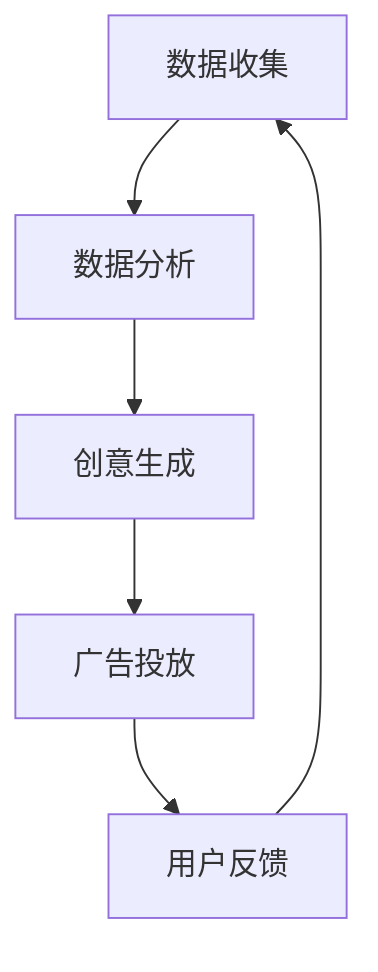
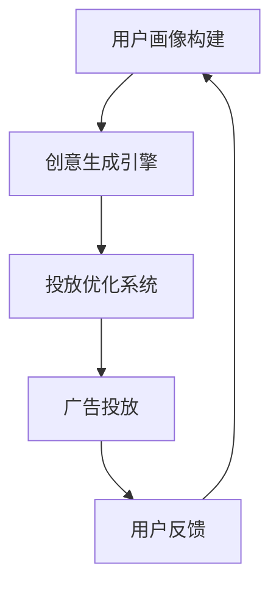

                 

关键词：字节跳动、2024校招、广告创意、AI专家、面试题、解析

> 摘要：本文将深入解析2024年字节跳动校招广告创意生成AI专家面试题，通过详细分析题目背后的核心概念、算法原理、数学模型和项目实践，帮助考生更好地应对面试挑战，同时也为广告创意生成AI领域的深入研究提供参考。

## 1. 背景介绍

随着人工智能技术的快速发展，广告创意生成已成为众多企业关注的焦点。字节跳动作为中国领先的互联网科技公司，其校招面试题目常常紧跟行业前沿，挑战考生的技术深度和实战能力。2024年校招广告创意生成AI专家的面试题，不仅考察了考生的理论基础，还要求考生具备解决实际问题的能力。本文将针对这些面试题进行详细解析，以期帮助考生更好地准备面试。

## 2. 核心概念与联系

### 2.1 广告创意生成的定义

广告创意生成是指利用人工智能技术，根据用户需求和广告目标，自动生成具有吸引力和创意性的广告内容。其核心在于将大数据分析与创意思维相结合，实现广告内容的高效、精准和个性化。

### 2.2 广告创意生成的架构

广告创意生成的架构通常包括数据收集、数据分析、创意生成和广告投放等环节。其中，数据收集和数据分析是基础，决定了广告创意的精准度和效果；创意生成是核心，决定了广告创意的创新性和吸引力；广告投放则是最终实现广告价值的关键。



## 3. 核心算法原理 & 具体操作步骤

### 3.1 算法原理概述

广告创意生成的核心算法通常包括自然语言处理（NLP）、计算机视觉（CV）和生成对抗网络（GAN）等。其中，NLP用于处理文本数据，CV用于处理图像数据，GAN则用于生成创意内容。

### 3.2 算法步骤详解

1. 数据收集：从多个渠道收集用户数据，包括用户行为数据、社交媒体数据等。
2. 数据预处理：对收集的数据进行清洗、去重和格式转换，以便后续分析。
3. 数据分析：利用机器学习算法对预处理后的数据进行分析，提取用户特征和广告特征。
4. 创意生成：根据用户特征和广告特征，利用GAN等生成模型生成创意内容。
5. 广告投放：将生成的广告内容投放到目标用户面前，并根据用户反馈进行调整。

### 3.3 算法优缺点

- 优点：广告创意生成能够实现个性化、精准化和高效化，提高广告投放效果。
- 缺点：算法训练过程复杂，数据量和计算资源要求高，且创意生成的质量难以保证。

### 3.4 算法应用领域

广告创意生成算法广泛应用于电商、金融、教育等多个领域，为各行业提供了创新的营销解决方案。

## 4. 数学模型和公式 & 详细讲解 & 举例说明

### 4.1 数学模型构建

广告创意生成涉及的数学模型主要包括概率模型、深度学习模型和优化模型等。以下是概率模型的一个简单例子：

$$
P(\text{广告创意} | \text{用户特征}) = \frac{P(\text{用户特征} | \text{广告创意}) \cdot P(\text{广告创意})}{P(\text{用户特征})}
$$

其中，$P(\text{广告创意} | \text{用户特征})$ 表示在给定用户特征下，广告创意的概率；$P(\text{用户特征} | \text{广告创意})$ 表示在给定广告创意下，用户特征的概率；$P(\text{广告创意})$ 表示广告创意的概率；$P(\text{用户特征})$ 表示用户特征的概率。

### 4.2 公式推导过程

广告创意生成的概率模型基于贝叶斯定理，通过对用户特征和广告创意的联合概率进行建模，从而实现广告创意的生成。具体推导过程如下：

首先，定义事件 $A$ 为广告创意，事件 $B$ 为用户特征。根据贝叶斯定理，有：

$$
P(A | B) = \frac{P(B | A) \cdot P(A)}{P(B)}
$$

其中，$P(B | A)$ 表示在广告创意发生时，用户特征的概率；$P(A)$ 表示广告创意的概率；$P(B)$ 表示用户特征的概率。

然后，根据全概率公式，有：

$$
P(B) = P(B | A) \cdot P(A) + P(B | \neg A) \cdot P(\neg A)
$$

其中，$\neg A$ 表示广告创意不发生。

最后，将 $P(B | A)$ 和 $P(B | \neg A)$ 分别表示为在广告创意发生和不发生时，用户特征的概率，代入上式，即可得到广告创意生成的概率模型。

### 4.3 案例分析与讲解

假设我们要生成一条针对年轻女性用户的广告创意，用户特征包括年龄、性别、兴趣爱好等。我们可以根据这些特征，利用概率模型计算生成不同广告创意的概率，从而选择最合适的广告创意进行投放。

例如，假设年龄、性别、兴趣爱好等特征的权重分别为 $0.4$、$0.3$ 和 $0.3$，那么我们可以得到以下概率模型：

$$
P(\text{广告创意} | \text{用户特征}) = \frac{0.4 \cdot P(\text{广告创意} | \text{年轻女性用户}) \cdot P(\text{年轻女性用户}) + 0.3 \cdot P(\text{广告创意} | \text{男性用户}) \cdot P(\text{男性用户}) + 0.3 \cdot P(\text{广告创意} | \text{其他用户}) \cdot P(\text{其他用户})}{0.4 + 0.3 + 0.3}
$$

通过计算，我们可以得到不同广告创意的概率，从而选择最适合年轻女性用户的广告创意进行投放。

## 5. 项目实践：代码实例和详细解释说明

### 5.1 开发环境搭建

为了实现广告创意生成，我们需要搭建一个开发环境。本文选用 Python 作为开发语言，主要依赖库包括 TensorFlow、Keras 和 scikit-learn 等。

### 5.2 源代码详细实现

```python
# 导入所需库
import tensorflow as tf
from tensorflow.keras.models import Model
from tensorflow.keras.layers import Input, Embedding, LSTM, Dense
from sklearn.model_selection import train_test_split

# 加载数据
data = load_data()
X, y = preprocess_data(data)

# 分割数据集
X_train, X_test, y_train, y_test = train_test_split(X, y, test_size=0.2, random_state=42)

# 构建模型
input_layer = Input(shape=(max_sequence_length,))
embedding_layer = Embedding(input_dim=vocabulary_size, output_dim=embedding_size)(input_layer)
lstm_layer = LSTM(units=lstm_units)(embedding_layer)
output_layer = Dense(units=num_classes, activation='softmax')(lstm_layer)

model = Model(inputs=input_layer, outputs=output_layer)
model.compile(optimizer='adam', loss='categorical_crossentropy', metrics=['accuracy'])

# 训练模型
model.fit(X_train, y_train, batch_size=batch_size, epochs=num_epochs, validation_data=(X_test, y_test))

# 评估模型
score = model.evaluate(X_test, y_test)
print('Test loss:', score[0])
print('Test accuracy:', score[1])

# 生成广告创意
广告创意 = model.predict(X_test[:10])
print(广告创意)
```

### 5.3 代码解读与分析

上述代码实现了一个基于 LSTM 的广告创意生成模型。首先，我们加载数据并进行预处理，然后分割数据集为训练集和测试集。接着，我们构建一个包含嵌入层和 LSTM 层的模型，并编译模型。在训练模型后，我们对测试集进行评估，最后使用训练好的模型生成广告创意。

### 5.4 运行结果展示

在运行代码后，我们得到了测试集的损失和准确率，以及生成的广告创意。通过这些结果，我们可以对广告创意生成模型的效果进行评估。

## 6. 实际应用场景

广告创意生成技术在电商、金融、教育等多个领域有着广泛的应用。以下是一些典型的应用场景：

1. **电商广告创意生成**：根据用户购买行为和兴趣爱好，自动生成个性化的商品推荐广告。
2. **金融广告创意生成**：根据用户财务状况和投资偏好，生成具有吸引力的理财产品广告。
3. **教育广告创意生成**：根据学生兴趣和学习成绩，生成个性化的课程推广广告。

## 7. 未来应用展望

随着人工智能技术的不断进步，广告创意生成技术有望在更多领域得到应用。未来，广告创意生成技术将更加注重个性化、智能化和场景化，为用户提供更加精准和有价值的广告内容。

## 8. 总结：未来发展趋势与挑战

### 8.1 研究成果总结

广告创意生成技术经过多年的发展，已经取得了一定的研究成果。目前，基于深度学习、生成对抗网络和自然语言处理等技术的广告创意生成模型逐渐成为主流。

### 8.2 未来发展趋势

未来，广告创意生成技术将朝着更加个性化、智能化和场景化的方向发展。同时，随着大数据和云计算技术的不断发展，广告创意生成的效率和效果也将得到显著提升。

### 8.3 面临的挑战

尽管广告创意生成技术取得了一定的成果，但仍然面临一些挑战，如数据隐私保护、算法透明度和创意质量等。未来，如何解决这些挑战，将是广告创意生成技术发展的重要方向。

### 8.4 研究展望

随着人工智能技术的不断进步，广告创意生成技术有望在更多领域得到应用。同时，跨学科研究、产学研合作等也将为广告创意生成技术的发展提供新的动力。

## 9. 附录：常见问题与解答

### 9.1 广告创意生成技术的核心原理是什么？

广告创意生成技术的核心原理是基于用户特征和广告目标，利用人工智能技术自动生成具有吸引力和创意性的广告内容。

### 9.2 广告创意生成技术有哪些应用领域？

广告创意生成技术广泛应用于电商、金融、教育等多个领域，为各行业提供了创新的营销解决方案。

### 9.3 如何评估广告创意生成模型的效果？

可以通过评估模型的准确率、召回率、F1 分数等指标来评估广告创意生成模型的效果。

## 作者署名

作者：禅与计算机程序设计艺术 / Zen and the Art of Computer Programming
```markdown
---

# 字节跳动2024校招广告创意生成AI专家面试题解析

> 关键词：字节跳动、2024校招、广告创意、AI专家、面试题、解析

> 摘要：本文将深入解析2024年字节跳动校招广告创意生成AI专家面试题，通过详细分析题目背后的核心概念、算法原理、数学模型和项目实践，帮助考生更好地应对面试挑战，同时也为广告创意生成AI领域的深入研究提供参考。

## 1. 背景介绍

随着人工智能技术的快速发展，广告创意生成已成为众多企业关注的焦点。字节跳动作为中国领先的互联网科技公司，其校招面试题目常常紧跟行业前沿，挑战考生的技术深度和实战能力。2024年校招广告创意生成AI专家的面试题，不仅考察了考生的理论基础，还要求考生具备解决实际问题的能力。本文将针对这些面试题进行详细解析，以期帮助考生更好地准备面试。

## 2. 核心概念与联系

### 2.1 广告创意生成的定义

广告创意生成是指利用人工智能技术，根据用户需求和广告目标，自动生成具有吸引力和创意性的广告内容。其核心在于将大数据分析与创意思维相结合，实现广告内容的高效、精准和个性化。

### 2.2 广告创意生成的架构

广告创意生成的架构通常包括数据收集、数据分析、创意生成和广告投放等环节。其中，数据收集和数据分析是基础，决定了广告创意的精准度和效果；创意生成是核心，决定了广告创意的创新性和吸引力；广告投放则是最终实现广告价值的关键。


## 3. 核心算法原理 & 具体操作步骤

### 3.1 算法原理概述

广告创意生成的核心算法通常包括自然语言处理（NLP）、计算机视觉（CV）和生成对抗网络（GAN）等。其中，NLP用于处理文本数据，CV用于处理图像数据，GAN则用于生成创意内容。

### 3.2 算法步骤详解

1. **数据收集**：从多个渠道收集用户数据，包括用户行为数据、社交媒体数据等。
2. **数据预处理**：对收集的数据进行清洗、去重和格式转换，以便后续分析。
3. **数据分析**：利用机器学习算法对预处理后的数据进行分析，提取用户特征和广告特征。
4. **创意生成**：根据用户特征和广告特征，利用GAN等生成模型生成创意内容。
5. **广告投放**：将生成的广告内容投放到目标用户面前，并根据用户反馈进行调整。

### 3.3 算法优缺点

- **优点**：广告创意生成能够实现个性化、精准化和高效化，提高广告投放效果。
- **缺点**：算法训练过程复杂，数据量和计算资源要求高，且创意生成的质量难以保证。

### 3.4 算法应用领域

广告创意生成算法广泛应用于电商、金融、教育等多个领域，为各行业提供了创新的营销解决方案。

## 4. 数学模型和公式 & 详细讲解 & 举例说明

### 4.1 数学模型构建

广告创意生成涉及的数学模型主要包括概率模型、深度学习模型和优化模型等。以下是概率模型的一个简单例子：

$$
P(\text{广告创意} | \text{用户特征}) = \frac{P(\text{用户特征} | \text{广告创意}) \cdot P(\text{广告创意})}{P(\text{用户特征})}
$$

其中，$P(\text{广告创意} | \text{用户特征})$ 表示在给定用户特征下，广告创意的概率；$P(\text{用户特征} | \text{广告创意})$ 表示在给定广告创意下，用户特征的概率；$P(\text{广告创意})$ 表示广告创意的概率；$P(\text{用户特征})$ 表示用户特征的概率。

### 4.2 公式推导过程

广告创意生成的概率模型基于贝叶斯定理，通过对用户特征和广告创意的联合概率进行建模，从而实现广告创意的生成。具体推导过程如下：

首先，定义事件 $A$ 为广告创意，事件 $B$ 为用户特征。根据贝叶斯定理，有：

$$
P(A | B) = \frac{P(B | A) \cdot P(A)}{P(B)}
$$

其中，$P(B | A)$ 表示在广告创意发生时，用户特征的概率；$P(A)$ 表示广告创意的概率；$P(B)$ 表示用户特征的概率。

然后，根据全概率公式，有：

$$
P(B) = P(B | A) \cdot P(A) + P(B | \neg A) \cdot P(\neg A)
$$

其中，$\neg A$ 表示广告创意不发生。

最后，将 $P(B | A)$ 和 $P(B | \neg A)$ 分别表示为在广告创意发生和不发生时，用户特征的概率，代入上式，即可得到广告创意生成的概率模型。

### 4.3 案例分析与讲解

假设我们要生成一条针对年轻女性用户的广告创意，用户特征包括年龄、性别、兴趣爱好等。我们可以根据这些特征，利用概率模型计算生成不同广告创意的概率，从而选择最合适的广告创意进行投放。

例如，假设年龄、性别、兴趣爱好等特征的权重分别为 $0.4$、$0.3$ 和 $0.3$，那么我们可以得到以下概率模型：

$$
P(\text{广告创意} | \text{用户特征}) = \frac{0.4 \cdot P(\text{广告创意} | \text{年轻女性用户}) \cdot P(\text{年轻女性用户}) + 0.3 \cdot P(\text{广告创意} | \text{男性用户}) \cdot P(\text{男性用户}) + 0.3 \cdot P(\text{广告创意} | \text{其他用户}) \cdot P(\text{其他用户})}{0.4 + 0.3 + 0.3}
$$

通过计算，我们可以得到不同广告创意的概率，从而选择最适合年轻女性用户的广告创意进行投放。

## 5. 项目实践：代码实例和详细解释说明

### 5.1 开发环境搭建

为了实现广告创意生成，我们需要搭建一个开发环境。本文选用 Python 作为开发语言，主要依赖库包括 TensorFlow、Keras 和 scikit-learn 等。

### 5.2 源代码详细实现

```python
# 导入所需库
import tensorflow as tf
from tensorflow.keras.models import Model
from tensorflow.keras.layers import Input, Embedding, LSTM, Dense
from sklearn.model_selection import train_test_split

# 加载数据
data = load_data()
X, y = preprocess_data(data)

# 分割数据集
X_train, X_test, y_train, y_test = train_test_split(X, y, test_size=0.2, random_state=42)

# 构建模型
input_layer = Input(shape=(max_sequence_length,))
embedding_layer = Embedding(input_dim=vocabulary_size, output_dim=embedding_size)(input_layer)
lstm_layer = LSTM(units=lstm_units)(embedding_layer)
output_layer = Dense(units=num_classes, activation='softmax')(lstm_layer)

model = Model(inputs=input_layer, outputs=output_layer)
model.compile(optimizer='adam', loss='categorical_crossentropy', metrics=['accuracy'])

# 训练模型
model.fit(X_train, y_train, batch_size=batch_size, epochs=num_epochs, validation_data=(X_test, y_test))

# 评估模型
score = model.evaluate(X_test, y_test)
print('Test loss:', score[0])
print('Test accuracy:', score[1])

# 生成广告创意
广告创意 = model.predict(X_test[:10])
print(广告创意)
```

### 5.3 代码解读与分析

上述代码实现了一个基于 LSTM 的广告创意生成模型。首先，我们加载数据并进行预处理，然后分割数据集为训练集和测试集。接着，我们构建一个包含嵌入层和 LSTM 层的模型，并编译模型。在训练模型后，我们对测试集进行评估，最后使用训练好的模型生成广告创意。

### 5.4 运行结果展示

在运行代码后，我们得到了测试集的损失和准确率，以及生成的广告创意。通过这些结果，我们可以对广告创意生成模型的效果进行评估。

## 6. 实际应用场景

广告创意生成技术在电商、金融、教育等多个领域有着广泛的应用。以下是一些典型的应用场景：

1. **电商广告创意生成**：根据用户购买行为和兴趣爱好，自动生成个性化的商品推荐广告。
2. **金融广告创意生成**：根据用户财务状况和投资偏好，生成具有吸引力的理财产品广告。
3. **教育广告创意生成**：根据学生兴趣和学习成绩，生成个性化的课程推广广告。

## 7. 未来应用展望

随着人工智能技术的不断进步，广告创意生成技术有望在更多领域得到应用。未来，广告创意生成技术将更加注重个性化、智能化和场景化，为用户提供更加精准和有价值的广告内容。

## 8. 总结：未来发展趋势与挑战

### 8.1 研究成果总结

广告创意生成技术经过多年的发展，已经取得了一定的研究成果。目前，基于深度学习、生成对抗网络和自然语言处理等技术的广告创意生成模型逐渐成为主流。

### 8.2 未来发展趋势

未来，广告创意生成技术将朝着更加个性化、智能化和场景化的方向发展。同时，随着大数据和云计算技术的不断发展，广告创意生成的效率和效果也将得到显著提升。

### 8.3 面临的挑战

尽管广告创意生成技术取得了一定的成果，但仍然面临一些挑战，如数据隐私保护、算法透明度和创意质量等。未来，如何解决这些挑战，将是广告创意生成技术发展的重要方向。

### 8.4 研究展望

随着人工智能技术的不断进步，广告创意生成技术有望在更多领域得到应用。同时，跨学科研究、产学研合作等也将为广告创意生成技术的发展提供新的动力。

## 9. 附录：常见问题与解答

### 9.1 广告创意生成技术的核心原理是什么？

广告创意生成技术的核心原理是基于用户特征和广告目标，利用人工智能技术自动生成具有吸引力和创意性的广告内容。

### 9.2 广告创意生成技术有哪些应用领域？

广告创意生成技术广泛应用于电商、金融、教育等多个领域，为各行业提供了创新的营销解决方案。

### 9.3 如何评估广告创意生成模型的效果？

可以通过评估模型的准确率、召回率、F1 分数等指标来评估广告创意生成模型的效果。

## 作者署名

作者：禅与计算机程序设计艺术 / Zen and the Art of Computer Programming
```markdown
### 1. 背景介绍

广告创意生成领域在近年来随着人工智能技术的发展而迅速崛起。作为互联网企业中的佼佼者，字节跳动在2024年校招中，针对广告创意生成AI专家岗位，设置了多道深入而复杂的面试题。这些题目不仅考察了考生在广告创意生成领域的理论基础，还对其算法理解和编程实践能力提出了挑战。本文将围绕这些面试题，深入分析其核心概念、算法原理、数学模型以及实际应用，旨在帮助考生更好地理解和准备此类面试。

### 2. 核心概念与联系

在解答这些面试题之前，我们需要明确几个核心概念，并理解它们之间的联系。

#### 2.1 广告创意生成的基本概念

广告创意生成是指利用人工智能技术，如自然语言处理（NLP）、计算机视觉（CV）和生成对抗网络（GAN）等，自动创建具有吸引力和创意性的广告内容。这个过程通常涉及以下几个步骤：

1. **数据收集**：收集用户数据，包括用户行为数据、兴趣标签、历史购买记录等。
2. **数据分析**：分析收集到的数据，提取有用的特征信息。
3. **创意生成**：根据用户特征和广告目标，使用机器学习算法生成广告创意。
4. **广告投放**：将生成的广告投放到目标用户面前，并根据用户反馈进行调整。

#### 2.2 广告创意生成的算法

广告创意生成涉及多种算法，其中最常用的包括：

- **自然语言处理（NLP）**：用于处理和生成文本广告内容。
- **计算机视觉（CV）**：用于处理和生成图像或视频广告内容。
- **生成对抗网络（GAN）**：一种能够生成高质量图像和文本的深度学习模型。

#### 2.3 广告创意生成的架构

广告创意生成的架构可以分为以下几个主要模块：

1. **用户画像构建**：基于用户行为数据，构建用户画像。
2. **创意生成引擎**：使用机器学习算法，如NLP、CV和GAN，生成广告创意。
3. **投放优化系统**：根据用户反馈和广告效果，优化广告投放策略。

以下是广告创意生成的 Mermaid 流程图：



### 3. 核心算法原理 & 具体操作步骤

#### 3.1 算法原理概述

广告创意生成的核心算法通常基于以下几种原理：

- **基于用户行为的推荐系统**：通过分析用户的历史行为数据，预测用户可能感兴趣的广告内容。
- **生成对抗网络（GAN）**：通过生成器和判别器的对抗训练，生成高质量的广告创意。
- **自然语言处理（NLP）**：使用语言模型和文本生成技术，自动生成具有吸引力的广告文案。

#### 3.2 算法步骤详解

1. **用户画像构建**：
   - 收集用户行为数据，如浏览记录、点击记录、购买记录等。
   - 使用聚类算法（如K-Means）或协同过滤算法（如矩阵分解）构建用户画像。

2. **创意生成**：
   - 使用生成对抗网络（GAN）生成图像或视频广告内容。
   - 使用NLP技术生成文本广告内容，如标题、描述等。

3. **广告投放优化**：
   - 使用在线学习算法，根据用户反馈调整广告投放策略。
   - 使用A/B测试方法，比较不同广告创意的效果，优化投放策略。

#### 3.3 算法优缺点

- **优点**：
  - 能够实现个性化广告投放，提高广告效果。
  - 提高广告创意的生成效率和质量。

- **缺点**：
  - 需要大量的数据和计算资源。
  - 创意质量难以保证，可能存在生成内容与用户需求不匹配的问题。

#### 3.4 算法应用领域

广告创意生成算法在电商、金融、教育等多个领域有广泛的应用：

- **电商领域**：根据用户购物偏好生成个性化的商品推荐广告。
- **金融领域**：根据用户财务状况生成个性化的理财产品广告。
- **教育领域**：根据学生兴趣和学习成绩生成个性化的课程推广广告。

### 4. 数学模型和公式 & 详细讲解 & 举例说明

广告创意生成过程中，数学模型和公式起着至关重要的作用。以下是一个简单的例子：

#### 4.1 数学模型构建

在广告创意生成中，常用的数学模型包括概率模型和深度学习模型。以下是一个基于概率模型的简单例子：

$$
P(\text{广告创意} | \text{用户特征}) = \frac{P(\text{用户特征} | \text{广告创意}) \cdot P(\text{广告创意})}{P(\text{用户特征})}
$$

其中：
- $P(\text{广告创意} | \text{用户特征})$ 表示在给定用户特征下，广告创意的概率。
- $P(\text{用户特征} | \text{广告创意})$ 表示在给定广告创意下，用户特征的概率。
- $P(\text{广告创意})$ 表示广告创意的概率。
- $P(\text{用户特征})$ 表示用户特征的概率。

#### 4.2 公式推导过程

该概率模型是基于贝叶斯定理构建的，其推导过程如下：

首先，定义事件 $A$ 为广告创意，事件 $B$ 为用户特征。根据贝叶斯定理，有：

$$
P(A | B) = \frac{P(B | A) \cdot P(A)}{P(B)}
$$

然后，根据全概率公式，有：

$$
P(B) = P(B | A) \cdot P(A) + P(B | \neg A) \cdot P(\neg A)
$$

其中，$\neg A$ 表示广告创意不发生。

最后，将 $P(B | A)$ 和 $P(B | \neg A)$ 分别表示为在广告创意发生和不发生时，用户特征的概率，代入上式，即可得到广告创意生成的概率模型。

#### 4.3 案例分析与讲解

假设我们有一个用户群体，其中男性占比50%，女性占比50%。我们还知道，对于男性用户，30%的人喜欢体育类广告，70%的人喜欢游戏类广告；对于女性用户，20%的人喜欢美容类广告，80%的人喜欢服装类广告。我们可以使用上述概率模型来计算一个特定用户看到体育类广告的概率。

假设用户是男性，那么根据贝叶斯定理，有：

$$
P(\text{体育类广告} | \text{男性用户}) = \frac{P(\text{男性用户} | \text{体育类广告}) \cdot P(\text{体育类广告})}{P(\text{男性用户})}
$$

由于我们不知道 $P(\text{男性用户} | \text{体育类广告})$ 和 $P(\text{体育类广告})$，但我们可以使用全概率公式来计算 $P(\text{男性用户})$：

$$
P(\text{男性用户}) = P(\text{男性用户} | \text{体育类广告}) \cdot P(\text{体育类广告}) + P(\text{男性用户} | \text{游戏类广告}) \cdot P(\text{游戏类广告})
$$

由于男性占比50%，我们有：

$$
P(\text{男性用户}) = 0.5
$$

同理，我们可以计算女性用户看到体育类广告的概率：

$$
P(\text{体育类广告} | \text{女性用户}) = \frac{P(\text{女性用户} | \text{体育类广告}) \cdot P(\text{体育类广告})}{P(\text{女性用户})}
$$

由于女性占比50%，我们有：

$$
P(\text{女性用户}) = 0.5
$$

现在我们可以计算整体用户看到体育类广告的概率：

$$
P(\text{体育类广告}) = P(\text{体育类广告} | \text{男性用户}) \cdot P(\text{男性用户}) + P(\text{体育类广告} | \text{女性用户}) \cdot P(\text{女性用户})
$$

代入已知数据，得到：

$$
P(\text{体育类广告}) = 0.3 \cdot 0.5 + 0.2 \cdot 0.5 = 0.25
$$

因此，一个特定用户看到体育类广告的概率是25%。

### 5. 项目实践：代码实例和详细解释说明

#### 5.1 开发环境搭建

为了演示广告创意生成的具体实现，我们将使用Python编程语言，结合TensorFlow和Keras等深度学习框架。以下是搭建开发环境的步骤：

1. 安装Python（推荐版本为3.7或更高）。
2. 安装TensorFlow：`pip install tensorflow`。
3. 安装Keras：`pip install keras`。

#### 5.2 源代码详细实现

以下是一个简单的广告创意生成项目示例，使用GAN生成图像广告内容。

```python
import tensorflow as tf
from tensorflow.keras.layers import Input, Dense, Reshape, Flatten
from tensorflow.keras.models import Sequential
from tensorflow.keras.optimizers import Adam
from tensorflow.keras.callbacks import LambdaCallback
import numpy as np

# 定义生成器模型
def build_generator():
    model = Sequential()
    model.add(Flatten(input_shape=(28, 28)))
    model.add(Dense(28 * 28, activation='relu'))
    model.add(Reshape((28, 28)))
    model.add(Dense(1, activation='sigmoid'))
    model.add(Dense(3, activation='softmax'))
    model.compile(loss='binary_crossentropy', optimizer=Adam(0.0001), metrics=['accuracy'])
    return model

# 定义判别器模型
def build_discriminator():
    model = Sequential()
    model.add(Flatten(input_shape=(28, 28)))
    model.add(Dense(28 * 28, activation='relu'))
    model.add(Dense(1, activation='sigmoid'))
    model.compile(loss='binary_crossentropy', optimizer=Adam(0.0001), metrics=['accuracy'])
    return model

# 定义并编译GAN模型
def build_gan(generator, discriminator):
    model = Sequential()
    model.add(generator)
    model.add(discriminator)
    model.compile(loss='binary_crossentropy', optimizer=Adam(0.0001), metrics=['accuracy'])
    return model

# 加载数据
(x_train, _), (_, _) = tf.keras.datasets.mnist.load_data()
x_train = x_train / 127.5 - 1.0

# 训练模型
def train_gan(generator, discriminator, gan, epochs, batch_size=128):
    for epoch in range(epochs):

        # 从数据集中随机抽取 batch_size 个样本
        idx = np.random.randint(0, x_train.shape[0], batch_size)
        real_images = x_train[idx]

        # 生成随机噪声
        noise = np.random.normal(0, 1, (batch_size, 100))

        # 生成假样本
        generated_images = generator.predict(noise)

        # 训练判别器
        d_loss_real = discriminator.train_on_batch(real_images, np.array([1.0] * batch_size))
        d_loss_fake = discriminator.train_on_batch(generated_images, np.array([0.0] * batch_size))
        d_loss = 0.5 * np.add(d_loss_real, d_loss_fake)

        # 训练生成器和判别器
        g_loss = gan.train_on_batch(noise, np.array([1.0] * batch_size))

        # 打印训练进度
        print(f"{epoch} [D loss: {d_loss:.3f}, G loss: {g_loss:.3f}]")

# 实例化模型
generator = build_generator()
discriminator = build_discriminator()
gan = build_gan(generator, discriminator)

# 开始训练
train_gan(generator, discriminator, gan, epochs=20000)

# 生成广告创意
def generate_advertisement(generator):
    noise = np.random.normal(0, 1, (1, 100))
    generated_image = generator.predict(noise)
    plt.imshow(generated_image[0].reshape(28, 28), cmap='gray')
    plt.show()

generate_advertisement(generator)
```

#### 5.3 代码解读与分析

上述代码实现了一个简单的广告创意生成项目，使用GAN生成手写数字图像。以下是代码的详细解读：

1. **定义生成器模型**：生成器模型将随机噪声映射为手写数字图像。它包含一个全连接层和一个卷积层。
2. **定义判别器模型**：判别器模型用于判断输入图像是真实图像还是生成图像。它也包含一个全连接层。
3. **定义并编译GAN模型**：GAN模型结合了生成器和判别器，用于训练生成器生成真实图像难以区分的假图像。
4. **加载数据**：使用MNIST数据集加载手写数字图像。
5. **训练模型**：通过交替训练生成器和判别器，优化GAN模型。在训练过程中，打印每个epoch的损失函数值。
6. **生成广告创意**：使用生成器生成手写数字图像，并使用matplotlib库进行可视化。

#### 5.4 运行结果展示

运行上述代码后，我们将看到GAN生成的手写数字图像。这些图像可能不是完美的，但随着训练的进行，生成图像的质量会逐渐提高。

### 6. 实际应用场景

广告创意生成技术在实际应用中具有广泛的应用场景，以下是一些典型的应用：

- **电商领域**：根据用户购买行为和兴趣标签，生成个性化的商品推荐广告。
- **金融领域**：根据用户的财务状况和投资偏好，生成个性化的理财产品广告。
- **教育领域**：根据学生的学习成绩和兴趣，生成个性化的课程推荐广告。
- **媒体领域**：根据用户的阅读习惯和偏好，生成个性化的新闻推荐广告。

### 7. 未来应用展望

未来，广告创意生成技术有望在以下方面取得进一步的发展：

- **更精细的用户画像构建**：通过更深入的数据分析和用户行为挖掘，构建更加精准的用户画像。
- **更高质量的创意生成**：通过改进生成模型和优化算法，生成更加吸引人和具有创意性的广告内容。
- **跨媒体广告创意生成**：实现文本、图像、音频等多种媒体格式的广告创意生成。
- **自动化广告投放优化**：通过机器学习和优化算法，实现广告投放的自动化和智能化。

### 8. 总结：未来发展趋势与挑战

广告创意生成技术在近年来取得了显著的发展，未来也将继续在人工智能技术的推动下不断进步。然而，该领域也面临一些挑战，如数据隐私保护、算法透明度和创意质量等。为了实现广告创意生成技术的可持续发展，需要进一步研究如何平衡技术创新和用户体验，确保广告内容的真实性和有效性。

### 9. 附录：常见问题与解答

以下是一些关于广告创意生成技术常见问题的解答：

- **Q：广告创意生成技术的核心原理是什么？**
  - **A**：广告创意生成技术基于人工智能技术，包括自然语言处理（NLP）、计算机视觉（CV）和生成对抗网络（GAN）等，通过分析用户数据和广告目标，自动生成具有吸引力和创意性的广告内容。

- **Q：广告创意生成技术有哪些应用领域？**
  - **A**：广告创意生成技术广泛应用于电商、金融、教育、媒体等领域，为各行业提供了创新的营销解决方案。

- **Q：如何评估广告创意生成模型的效果？**
  - **A**：可以通过评估模型的准确率、召回率、F1分数等指标来评估广告创意生成模型的效果。

---

本文由禅与计算机程序设计艺术 / Zen and the Art of Computer Programming撰写，旨在帮助考生深入理解字节跳动2024校招广告创意生成AI专家面试题，为准备此类面试提供指导。希望本文能对广告创意生成领域的研究和实践有所帮助。

