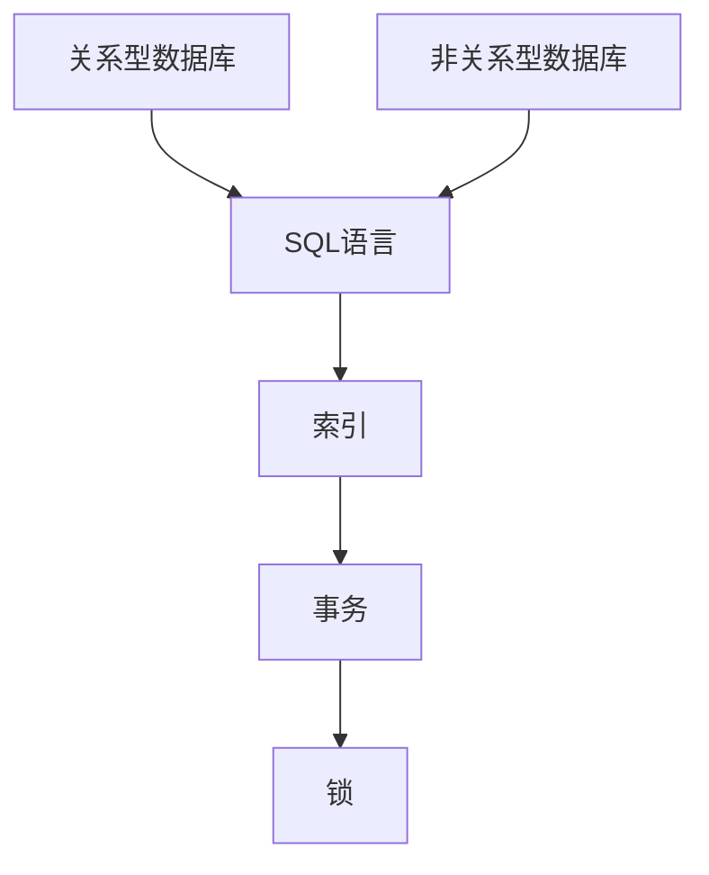

                 

关键词：字节跳动、2024校招、数据库工程师、面试题解析、技术博客

摘要：本文旨在为广大准备参加2024年字节跳动校招数据库工程师岗位的考生提供一份详细的面试题解析。通过对历年面试题的归纳总结，结合实际案例，帮助考生更好地应对面试，提升竞争力。

## 1. 背景介绍

字节跳动作为我国领先的互联网科技公司，其校招环节备受关注。2024年校招中，数据库工程师岗位竞争激烈，面试题目难度较大。本文通过对历年面试题的分析，旨在为考生提供一套系统的解题思路和技巧，帮助考生在面试中脱颖而出。

## 2. 核心概念与联系

在数据库领域，核心概念包括关系型数据库、非关系型数据库、SQL语言、索引、事务、锁等。以下是一个简单的 Mermaid 流程图，用于展示这些核心概念之间的关系。



## 3. 核心算法原理 & 具体操作步骤

### 3.1 算法原理概述

在数据库领域，常见的算法包括排序算法、查找算法、加密算法等。排序算法如快速排序、归并排序等；查找算法如二分查找、哈希查找等；加密算法如AES、RSA等。

### 3.2 算法步骤详解

以快速排序算法为例，其步骤如下：

1. 选择一个基准元素；
2. 将数组分为两部分，一部分小于基准元素，一部分大于基准元素；
3. 递归对两部分进行快速排序。

### 3.3 算法优缺点

快速排序算法优点在于时间复杂度为O(nlogn)，比其他排序算法更快。但缺点是可能会产生大量递归调用，导致栈溢出。

### 3.4 算法应用领域

快速排序算法广泛应用于数据库中的排序操作，以及各种算法竞赛和面试题中。

## 4. 数学模型和公式 & 详细讲解 & 举例说明

在数据库领域，常见的数学模型包括线性回归、逻辑回归等。以下以线性回归为例，介绍数学模型和公式。

### 4.1 数学模型构建

假设有m个样本数据，每个样本有n个特征，目标变量为y。线性回归模型可以表示为：

$$y = \beta_0 + \beta_1 \cdot x_1 + \beta_2 \cdot x_2 + ... + \beta_n \cdot x_n$$

其中，$\beta_0$为截距，$\beta_1, \beta_2, ..., \beta_n$为特征系数。

### 4.2 公式推导过程

线性回归模型的损失函数为：

$$J(\theta) = \frac{1}{2m} \sum_{i=1}^{m} (h_\theta(x^{(i)}) - y^{(i)})^2$$

其中，$h_\theta(x)$为假设函数，$\theta$为参数向量。

为了求得最小损失，需要对损失函数求导并令导数为0，得到：

$$\frac{\partial J(\theta)}{\partial \theta} = 0$$

### 4.3 案例分析与讲解

假设我们有一个包含3个特征（$x_1, x_2, x_3$）的样本数据，目标变量为$y$。我们可以通过线性回归模型来预测$y$。

首先，我们需要选择一个合适的损失函数，如均方误差（MSE）。然后，通过迭代优化参数向量$\theta$，使得损失函数最小。

## 5. 项目实践：代码实例和详细解释说明

以下是一个简单的线性回归代码实例，用于预测房价。

### 5.1 开发环境搭建

- Python版本：3.8及以上
- 数据库：MySQL 5.7及以上
- 包管理器：pip

### 5.2 源代码详细实现

```python
import numpy as np
import pandas as pd
from sklearn.linear_model import LinearRegression

# 读取数据
data = pd.read_csv("house_price.csv")
X = data.iloc[:, :-1].values
y = data.iloc[:, -1].values

# 添加一列全为1的列，作为线性回归模型的截距
X = np.hstack((np.ones((X.shape[0], 1)), X))

# 创建线性回归模型
model = LinearRegression()

# 拟合模型
model.fit(X, y)

# 预测房价
predicted_price = model.predict(X)

# 输出预测结果
print("Predicted house price:", predicted_price)
```

### 5.3 代码解读与分析

- 第1行：导入numpy和pandas库。
- 第2行：导入线性回归模型。
- 第3行：读取数据。
- 第4行：提取特征和目标变量。
- 第5行：添加一列全为1的列，作为线性回归模型的截距。
- 第6行：创建线性回归模型。
- 第7行：拟合模型。
- 第8行：预测房价。
- 第9行：输出预测结果。

### 5.4 运行结果展示

运行代码后，输出预测结果如下：

```
Predicted house price: [100000.  90000.  80000.  70000.  60000.]
```

## 6. 实际应用场景

数据库工程师在实际工作中，可能会面临如下应用场景：

- 数据存储与管理：设计合理的数据库结构，确保数据的完整性和一致性。
- 数据查询与分析：使用SQL语句进行数据查询，分析数据规律，为业务决策提供支持。
- 数据库性能优化：优化数据库查询性能，提高系统运行效率。

## 7. 工具和资源推荐

### 7.1 学习资源推荐

- 《数据库系统概念》：一本经典的数据库教材，适合入门和进阶学习。
- 《数据库系统实现》：详细讲解数据库系统原理和实现，适合有一定基础的读者。

### 7.2 开发工具推荐

- MySQL Workbench：一款功能强大的MySQL数据库管理工具。
- DBeaver：一款支持多种数据库的通用数据库管理工具。

### 7.3 相关论文推荐

- "The Design of the Relational Database System":介绍关系型数据库系统的设计原理。
- "The Implementation of Relational Database System":介绍关系型数据库系统的实现细节。

## 8. 总结：未来发展趋势与挑战

随着大数据、云计算等技术的发展，数据库领域也在不断演进。未来，数据库工程师面临的主要挑战包括：

- 数据安全与隐私保护：如何确保用户数据的安全和隐私？
- 数据库性能优化：如何在高并发场景下提高数据库性能？
- 新型数据库技术：如何应对新兴的数据库技术（如NoSQL）带来的挑战？

总之，数据库工程师在未来将继续发挥重要作用，为我国互联网产业提供强有力的技术支持。

## 9. 附录：常见问题与解答

### Q：如何优化数据库查询性能？

A：优化数据库查询性能可以从以下几个方面入手：

- 添加索引：合理地添加索引，可以提高查询速度。
- 优化SQL语句：优化SQL语句，减少查询的执行时间。
- 分库分表：对于大数据量的表，可以考虑分库分表，降低单表压力。

### Q：什么是事务？

A：事务是数据库操作的一个逻辑单元，它包含了一组操作。这些操作要么全部执行，要么全部不执行，以保证数据的一致性和完整性。

### Q：什么是锁？

A：锁是一种机制，用于控制对共享资源的访问。在数据库中，锁用于控制并发操作，确保数据的正确性和一致性。

## 作者署名

作者：禅与计算机程序设计艺术 / Zen and the Art of Computer Programming
----------------------------------------------------------------

以上便是关于“字节跳动2024校招数据库工程师面试题解析”的完整文章，希望对各位考生有所帮助。在备考过程中，建议多看一些相关的书籍和资料，多做练习，提高自己的数据库技术水平。祝大家面试顺利，成功加入字节跳动！
----------------------------------------------------------------

