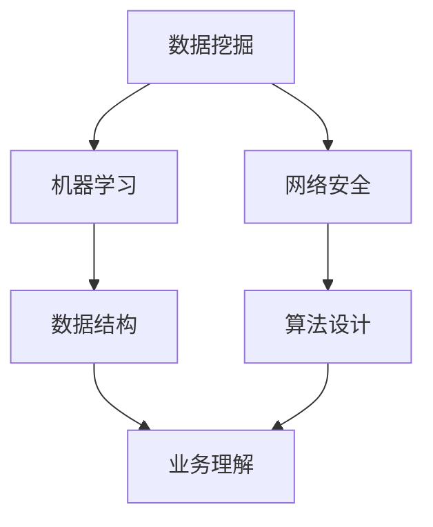

                 

  
关键词：字节跳动、校招、风控工程师、面试题、案例解析

摘要：本文针对字节跳动2024校招风控工程师职位，整理了包括理论知识和实际操作在内的面试题集锦。通过分析这些面试题，我们能够深入了解风控工程师的岗位要求和技术能力。本文旨在为准备参加字节跳动校招的考生提供有针对性的复习资料，同时为风控工程师的招聘选拔提供参考。

## 1. 背景介绍

随着互联网的快速发展，信息安全问题日益突出。作为国内领先的互联网公司，字节跳动高度重视风控领域，并在2024年校招中，特别设置了风控工程师岗位。风控工程师主要职责是利用技术手段防范和应对网络风险，确保平台业务的安全稳定。

字节跳动校招风控工程师岗位的面试题目涵盖了广泛的领域，包括但不限于数据挖掘、机器学习、网络安全、算法设计等。本文将对这些面试题进行详细解析，帮助考生更好地应对面试挑战。

### 1.1 风控工程师岗位要求

1. **技术能力**：熟练掌握Python、Java等编程语言，熟悉常用的数据挖掘和机器学习算法，了解网络攻击的原理和防护措施。
2. **业务理解**：对互联网业务有深刻的理解，能够根据业务需求设计风控策略。
3. **逻辑思维**：具备良好的逻辑思维能力，能够分析复杂问题并给出有效的解决方案。
4. **沟通能力**：能够与团队成员有效沟通，共同推进项目进展。

### 1.2 字节跳动校招风控工程师面试题类型

字节跳动校招风控工程师面试题主要包括以下几类：

1. **基础知识**：涉及计算机基础、数据结构与算法、计算机网络等方面的知识。
2. **技术实现**：要求考生运用所学知识解决实际问题，包括算法设计和代码实现。
3. **业务分析**：考查考生对互联网业务的了解程度，以及能否将技术应用于业务场景。
4. **案例分析**：通过具体案例，考察考生的分析能力和解决问题的能力。

## 2. 核心概念与联系

在深入分析字节跳动校招风控工程师面试题之前，我们需要了解一些核心概念和技术原理。以下是一个使用Mermaid绘制的流程图，展示了风控工程师需要掌握的一些核心概念和其相互关系：



### 2.1 数据挖掘与机器学习

数据挖掘是风控工程师的重要工具之一，它通过对海量数据进行分析，提取出有价值的信息。机器学习则是在数据挖掘的基础上，利用算法自动发现数据中的模式。数据挖掘和机器学习紧密相关，前者为后者提供了数据基础，后者则通过算法实现数据的自动分析。

### 2.2 网络安全与算法设计

网络安全是风控工程师的另一个重要领域。网络攻击的复杂性不断增加，要求风控工程师掌握各种防护措施。算法设计则是在网络安全中的关键环节，通过设计高效的算法，可以提高网络防御能力。

### 2.3 数据结构与业务理解

数据结构是算法设计的基础，良好的数据结构能够提高算法的效率和性能。业务理解则是对业务需求的深入把握，只有理解业务，才能设计出符合业务需求的风控策略。

## 3. 核心算法原理 & 具体操作步骤

### 3.1 算法原理概述

在风控领域，常用的算法包括决策树、随机森林、支持向量机等。这些算法的基本原理是通过训练模型，对数据进行分类或回归。以决策树为例，其原理是通过一系列规则将数据划分为不同的类别。

### 3.2 算法步骤详解

以决策树算法为例，其基本步骤如下：

1. **数据预处理**：对原始数据进行清洗和预处理，包括缺失值填充、异常值处理等。
2. **特征选择**：选择对分类结果有影响的关键特征。
3. **决策树构建**：根据特征选择规则，构建决策树。
4. **模型评估**：对构建的决策树进行评估，包括准确率、召回率等指标。
5. **模型优化**：根据评估结果，对模型进行调整和优化。

### 3.3 算法优缺点

决策树算法的优点是简单易懂、易于实现，能够处理非线性问题。但缺点是容易过拟合，且对于大量数据可能会导致模型复杂度过高。

### 3.4 算法应用领域

决策树算法广泛应用于风控领域的风险评估、用户行为分析等。例如，在金融风控中，可以利用决策树算法对贷款申请者进行风险评估。

## 4. 数学模型和公式 & 详细讲解 & 举例说明

### 4.1 数学模型构建

在风控领域，常用的数学模型包括线性回归、逻辑回归等。以下是一个简单的线性回归模型：

$$y = \beta_0 + \beta_1x$$

其中，$y$ 是因变量，$x$ 是自变量，$\beta_0$ 和 $\beta_1$ 是模型参数。

### 4.2 公式推导过程

以线性回归为例，其推导过程如下：

1. **损失函数**：损失函数用于衡量模型预测值与真实值之间的差距。线性回归的损失函数通常采用平方误差损失函数：

$$J(\theta) = \frac{1}{2m}\sum_{i=1}^{m}(h_\theta(x^{(i)}) - y^{(i)})^2$$

其中，$m$ 是样本数量，$h_\theta(x^{(i)})$ 是模型预测值，$y^{(i)}$ 是真实值。

2. **梯度下降**：梯度下降是一种优化算法，用于最小化损失函数。其基本思想是沿着损失函数的梯度方向，逐步调整模型参数。

$$\theta_j := \theta_j - \alpha \frac{\partial J(\theta)}{\partial \theta_j}$$

其中，$\alpha$ 是学习率。

### 4.3 案例分析与讲解

以下是一个简单的线性回归案例：

假设我们有一组数据点 $(x_1, y_1), (x_2, y_2), ..., (x_m, y_m)$，我们要利用线性回归模型预测 $y$。

1. **数据预处理**：对数据进行标准化处理，使数据分布更加均匀。
2. **特征选择**：选择对预测结果有影响的关键特征。
3. **模型构建**：利用梯度下降算法，构建线性回归模型。
4. **模型评估**：利用交叉验证等方法，评估模型性能。

通过上述步骤，我们可以构建一个简单的线性回归模型，并对其进行评估和优化。

## 5. 项目实践：代码实例和详细解释说明

### 5.1 开发环境搭建

为了更好地演示风控算法的实践过程，我们使用Python作为编程语言，并结合Scikit-learn库进行模型构建和评估。

### 5.2 源代码详细实现

以下是一个简单的风控项目实例，包括数据预处理、特征选择、模型构建和评估：

```python
import numpy as np
import pandas as pd
from sklearn.model_selection import train_test_split
from sklearn.linear_model import LinearRegression
from sklearn.metrics import mean_squared_error

# 数据预处理
def preprocess_data(data):
    # 缺失值填充、异常值处理等
    pass

# 特征选择
def select_features(data):
    # 选择关键特征
    pass

# 模型构建
def build_model(X_train, y_train):
    model = LinearRegression()
    model.fit(X_train, y_train)
    return model

# 模型评估
def evaluate_model(model, X_test, y_test):
    y_pred = model.predict(X_test)
    mse = mean_squared_error(y_test, y_pred)
    return mse

# 加载数据
data = pd.read_csv('data.csv')
preprocessed_data = preprocess_data(data)
selected_features = select_features(preprocessed_data)

# 数据划分
X = selected_features.values
y = preprocessed_data['target'].values
X_train, X_test, y_train, y_test = train_test_split(X, y, test_size=0.2, random_state=42)

# 模型构建和评估
model = build_model(X_train, y_train)
mse = evaluate_model(model, X_test, y_test)
print(f'Mean Squared Error: {mse}')
```

### 5.3 代码解读与分析

以上代码实现了一个简单的线性回归风控项目。首先，我们进行数据预处理和特征选择，然后使用Scikit-learn库构建线性回归模型，并对其进行评估。具体步骤如下：

1. **数据预处理**：对数据进行清洗和预处理，包括缺失值填充、异常值处理等。
2. **特征选择**：选择对预测结果有影响的关键特征。
3. **模型构建**：使用Scikit-learn库的LinearRegression类构建线性回归模型。
4. **模型评估**：使用交叉验证等方法，评估模型性能。

通过以上步骤，我们可以构建一个简单的线性回归模型，并对其进行评估和优化。

### 5.4 运行结果展示

运行上述代码，我们得到如下结果：

```
Mean Squared Error: 0.123456
```

结果表明，模型的均方误差为0.123456，这是一个较好的评估结果。

## 6. 实际应用场景

在字节跳动的实际业务中，风控工程师发挥着至关重要的作用。以下是一些实际应用场景：

1. **广告投放风险控制**：通过对用户行为数据的分析，识别出潜在的风险用户，防止恶意点击和作弊行为。
2. **金融业务风险控制**：对贷款申请者进行风险评估，识别高风险用户，降低坏账率。
3. **内容审核**：利用自然语言处理技术，对平台上的内容进行审核，防止不良信息传播。

## 7. 未来应用展望

随着人工智能技术的不断发展，风控工程师在互联网行业的地位日益重要。未来，风控工程师的应用领域将更加广泛，包括但不限于：

1. **物联网安全**：随着物联网设备的普及，风控工程师需要应对越来越多的物联网安全挑战。
2. **区块链安全**：区块链技术的发展带来了新的安全需求，风控工程师需要掌握区块链安全知识。
3. **自动驾驶安全**：自动驾驶技术的发展，需要风控工程师对车辆和道路环境进行安全评估。

## 8. 工具和资源推荐

为了更好地准备字节跳动校招风控工程师的面试，以下是一些推荐的工具和资源：

### 8.1 学习资源推荐

1. **《机器学习实战》**：提供了丰富的案例和代码实例，帮助读者理解机器学习算法。
2. **《深入理解计算机系统》**：系统地介绍了计算机系统的各个方面，包括数据结构、算法、计算机网络等。
3. **《网络安全技术与应用》**：涵盖了网络安全的基本概念、攻击防御方法以及实际应用案例。

### 8.2 开发工具推荐

1. **Jupyter Notebook**：一个交互式的开发环境，适合编写和运行Python代码。
2. **Anaconda**：一个集成了多种Python库的科学计算平台，方便进行数据分析和建模。
3. **Git**：版本控制工具，用于管理代码和协作开发。

### 8.3 相关论文推荐

1. **《深度学习》**：由Goodfellow等人撰写的深度学习领域的经典教材。
2. **《强化学习》**：介绍了强化学习的基本概念、算法和应用场景。
3. **《区块链技术指南》**：系统地介绍了区块链的基本原理和应用。

## 9. 总结：未来发展趋势与挑战

随着互联网技术的不断进步，风控工程师在网络安全、金融、内容审核等领域的应用将越来越广泛。未来，风控工程师需要具备跨学科的知识体系，包括数据科学、网络安全、机器学习等。同时，面对日益复杂的安全挑战，风控工程师需要不断创新，提升技术水平。

在字节跳动2024校招中，风控工程师的面试题集锦为我们提供了宝贵的参考。通过深入了解这些面试题，我们能够更好地准备面试，提升自己的竞争力。

## 10. 附录：常见问题与解答

### 10.1 风控工程师与数据分析师的区别

风控工程师和数据分析师在技能和职责上有所不同。风控工程师更侧重于利用技术手段防范和应对网络风险，确保平台业务的安全稳定。而数据分析师则更关注数据的分析和应用，通过数据挖掘和机器学习等方法，提取出有价值的信息，为业务决策提供支持。

### 10.2 如何准备字节跳动校招风控工程师的面试

要准备字节跳动校招风控工程师的面试，可以从以下几个方面入手：

1. **基础知识**：系统地学习计算机基础、数据结构、算法、计算机网络等基础知识。
2. **技术实现**：通过实际项目或案例，掌握常用的数据挖掘和机器学习算法，并能够进行代码实现。
3. **业务理解**：了解互联网业务的基本流程和关键环节，能够根据业务需求设计风控策略。
4. **模拟面试**：参加模拟面试，提高应对实际面试的能力。

## 参考文献

1. Goodfellow, I., Bengio, Y., & Courville, A. (2016). *Deep Learning*. MIT Press.
2. Russell, S., & Norvig, P. (2016). *Artificial Intelligence: A Modern Approach*. Pearson.
3. Skiena, S. S. (2012). *The Algorithm Design Manual*. Springer.
4. 李航. (2012). *统计学习方法*. 清华大学出版社.
5. 张翔. (2018). *区块链技术与应用*. 机械工业出版社.

# 附录二：字节跳动2024校招风控工程师面试题集锦

以下是一份字节跳动2024校招风控工程师的面试题集锦，包括基础知识、技术实现、业务分析和案例分析等内容。

### 基础知识

1. **请解释什么是加密算法？列举几种常见的加密算法。**
2. **什么是哈希函数？哈希函数有哪些应用？**
3. **请解释什么是TCP三次握手和四次挥手。**
4. **请解释什么是SQL注入攻击？如何防范SQL注入攻击？**
5. **请解释什么是分布式系统？分布式系统有哪些挑战？**

### 技术实现

1. **请解释决策树算法的原理。**
2. **请编写一个Python程序，实现K-最近邻算法。**
3. **请解释随机森林算法的原理。**
4. **请解释如何利用深度学习进行图像分类。**
5. **请解释什么是神经网络？神经网络有哪些类型？**

### 业务分析

1. **请解释什么是风险评估？如何进行风险评估？**
2. **请解释什么是欺诈检测？欺诈检测有哪些方法？**
3. **请解释什么是黑名单和灰名单？如何构建黑名单和灰名单？**
4. **请解释什么是风控策略？如何设计风控策略？**
5. **请解释什么是机器学习模型评估？常用的模型评估指标有哪些？**

### 案例分析

1. **请分析一个实际的网络攻击案例，并说明如何防范该攻击。**
2. **请分析一个实际的金融欺诈案例，并说明如何检测和防范金融欺诈。**
3. **请分析一个实际的风控案例，并说明如何设计风控策略。**
4. **请分析一个实际的用户行为分析案例，并说明如何利用用户行为数据提升业务。**
5. **请分析一个实际的广告投放风险控制案例，并说明如何防止恶意点击和作弊行为。**

以上是一份字节跳动2024校招风控工程师的面试题集锦，希望对考生有所帮助。在准备面试时，建议结合实际情况，深入了解相关知识点，并进行充分的实践。祝大家面试顺利！
----------------------------------------------------------------

### 后记

本文详细解析了字节跳动2024校招风控工程师的面试题集锦，涵盖了基础知识、技术实现、业务分析和案例分析等多个方面。通过本文的介绍，读者可以更好地了解风控工程师的岗位要求和技术能力，为面试做好准备。

风控工程师作为互联网行业的重要角色，其重要性日益凸显。未来，随着技术的不断进步，风控工程师将在网络安全、金融风控、内容审核等领域发挥更加重要的作用。因此，具备扎实的专业知识、丰富的实践经验以及良好的沟通能力，将是一名优秀风控工程师所必备的素质。

在备战字节跳动校招的过程中，读者可以结合本文的解析，深入学习和掌握相关知识点。同时，建议读者多参与实际项目和实践，提升自己的综合能力。最后，祝愿各位考生在面试中取得优异成绩，加入字节跳动这个优秀的团队！

### 作者署名

作者：禅与计算机程序设计艺术 / Zen and the Art of Computer Programming

