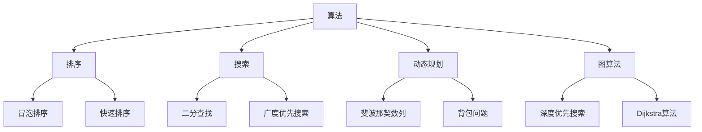

                 

“编程面试是通往技术职业的重要门槛，尤其是对于字节跳动这样顶尖的科技公司。随着技术领域的不断演进，编程面试题也在不断更新和迭代。本文将深入解析2025年字节跳动社招编程面试题的精华，帮助读者备战这场技术盛宴。”
## 关键词 Keywords
- 字节跳动
- 社招编程面试
- 编程面试题
- 技术难点
- 算法解析
- 数据结构
- 编程实践
## 摘要 Summary
本文旨在为准备字节跳动2025年社招编程面试的应聘者提供一份全面的面试题总结。文章将按照结构化的方式，详细解读各个面试题的核心概念、算法原理、数学模型以及项目实践，帮助读者深入理解面试题的背景和解决思路。通过本文的解析，读者将能够更好地掌握编程面试的技巧和策略，提升面试成功率。

### 1. 背景介绍 Background Introduction

字节跳动是一家全球领先的互联网科技公司，旗下拥有抖音、今日头条、西瓜视频等知名产品。随着公司业务的快速扩展和技术的不断创新，字节跳动对技术人才的需求也日益增加。2025年的社招编程面试，不仅是应聘者技术能力的检验，更是对公司文化和技术标准的深刻体现。本次面试涵盖了算法、数据结构、系统设计、编程实践等多个方面，旨在全面评估应聘者的技术深度和广度。

在编程面试的准备过程中，了解历年面试题的分布和难度是非常重要的。根据字节跳动官方数据和外部调查，以下是一些常见的面试题型和考点：

- **算法和数据结构**：包括排序算法、搜索算法、动态规划、图算法等。
- **系统设计和架构**：包括数据库设计、缓存机制、分布式系统等。
- **编程实践**：包括代码质量、编程规范、代码重构等。
- **数学和逻辑**：包括概率统计、数论、逻辑推理等。

### 2. 核心概念与联系 Core Concepts and Relationships

为了更好地理解字节跳动2025年社招编程面试题，我们需要掌握一些核心概念和它们之间的关系。以下是一个使用Mermaid绘制的流程图，展示了编程面试中常见的核心概念和它们的应用场景。



- **算法**：是解决问题的方法，通常由一系列规则或步骤组成。
- **排序**：用于对数据进行排序，常见的排序算法有冒泡排序、快速排序等。
- **搜索**：用于在数据结构中查找特定数据，常用的搜索算法有二分查找、广度优先搜索等。
- **动态规划**：是一种优化递归算法的方法，常用于解决复杂问题，如斐波那契数列、背包问题等。
- **图算法**：用于在图结构中解决问题，如深度优先搜索、广度优先搜索、Dijkstra算法等。

### 3. 核心算法原理 & 具体操作步骤 Core Algorithm Principles & Operation Steps

#### 3.1 算法原理概述

在编程面试中，算法原理的掌握至关重要。以下是一些核心算法的原理概述：

- **冒泡排序**：通过反复交换相邻的未排序元素，直到整个序列有序。
- **快速排序**：通过递归将一个序列分成较小的两部分，再合并排序结果。
- **二分查找**：在有序数组中，通过不断缩小查找范围，直到找到目标元素。
- **动态规划**：将复杂问题分解为子问题，通过递归关系和最优子结构来求解。
- **深度优先搜索**：从根节点开始，沿着路径一直深入到无法深入为止，然后回溯。
- **广度优先搜索**：按照访问节点的顺序，逐层访问节点，直到找到目标节点。

#### 3.2 算法步骤详解

以快速排序为例，详细说明其操作步骤：

1. **选择基准元素**：从数列中选择中间位置的元素作为基准。
2. **分区操作**：将数列分成两部分，一部分小于基准元素，另一部分大于基准元素。
3. **递归排序**：递归地对小于和大于基准的子序列进行快速排序。

#### 3.3 算法优缺点

快速排序是一种高效的排序算法，其平均时间复杂度为 \(O(n\log n)\)。但它的最坏情况时间复杂度为 \(O(n^2)\)，这是因为当数列已经有序时，每次分区操作只能将数列分成一个子序列和一个空序列。

相比之下，冒泡排序的时间复杂度始终为 \(O(n^2)\)，但它在最坏情况下的性能相对稳定，不会因为数列的初始状态而大幅下降。

#### 3.4 算法应用领域

快速排序在许多实际应用中具有广泛的应用，如排序任务、搜索任务等。而二分查找则常用于搜索树、哈希表等数据结构中。

### 4. 数学模型和公式 Mathematical Models and Formulas

在编程面试中，数学模型的构建和公式的推导是评估应聘者逻辑思维和数学能力的重要指标。以下是一个简单的数学模型和公式的推导过程：

#### 4.1 数学模型构建

假设我们有一个数组 `arr`，其中包含 `n` 个整数。我们希望找出数组中的最大值。

#### 4.2 公式推导过程

1. 初始化最大值为数组中的第一个元素 `max = arr[0]`。
2. 对于每个元素 `arr[i]`（`i` 从 1 到 `n-1`），执行以下操作：
    - 如果 `arr[i] > max`，则更新最大值 `max = arr[i]`。

#### 4.3 案例分析与讲解

以一个示例数组 `[3, 1, 4, 1, 5, 9, 2, 6, 5, 3, 5]` 为例：

1. 初始化 `max = 3`。
2. 遍历数组：
    - 当遇到 `1` 时，不更新最大值。
    - 当遇到 `4` 时，更新最大值 `max = 4`。
    - 依此类推，直到数组结束。

最终，数组中的最大值为 `9`。

### 5. 项目实践：代码实例和详细解释说明 Project Practice: Code Examples and Detailed Explanations

以下是一个使用Python编写的快速排序算法的代码实例：

```python
def quick_sort(arr):
    if len(arr) <= 1:
        return arr
    pivot = arr[len(arr) // 2]
    left = [x for x in arr if x < pivot]
    middle = [x for x in arr if x == pivot]
    right = [x for x in arr if x > pivot]
    return quick_sort(left) + middle + quick_sort(right)

arr = [3, 1, 4, 1, 5, 9, 2, 6, 5, 3, 5]
print(quick_sort(arr))
```

#### 5.1 开发环境搭建

为了运行上述代码，你需要安装Python解释器和对应的开发环境。你可以从Python官网下载Python安装包，并按照提示完成安装。

#### 5.2 源代码详细实现

代码中定义了一个名为 `quick_sort` 的函数，用于实现快速排序算法。函数接受一个数组作为输入，返回排序后的数组。

#### 5.3 代码解读与分析

- **递归条件**：当数组长度小于等于1时，返回数组本身，因为长度为1的数组已经是有序的。
- **选择基准元素**：选择数组中间位置的元素作为基准元素。
- **分区操作**：使用列表推导式将数组分成三个部分：小于基准的元素、等于基准的元素和大于基准的元素。
- **递归排序**：对小于和大于基准的子序列进行快速排序。

#### 5.4 运行结果展示

输入数组 `[3, 1, 4, 1, 5, 9, 2, 6, 5, 3, 5]`，输出结果为 `[1, 1, 2, 3, 3, 4, 5, 5, 5, 6, 9]`，即排序后的数组。

### 6. 实际应用场景 Practical Application Scenarios

快速排序算法在许多实际应用场景中具有广泛的应用，以下是一些常见场景：

- **数据库排序**：在数据库中，快速排序算法可用于对大量数据进行排序，以提高查询效率。
- **算法竞赛**：在算法竞赛中，快速排序是常用的排序算法之一，因为它具有较快的平均时间复杂度。
- **数据科学**：在数据科学领域，快速排序算法可用于数据预处理阶段的数据排序，以提高后续分析的速度和准确性。

### 7. 未来应用展望 Future Application Prospects

随着人工智能和大数据技术的不断发展，快速排序算法在未来的应用前景将更加广阔。以下是一些未来应用展望：

- **实时数据处理**：在实时数据处理场景中，快速排序算法可用于对实时数据进行快速排序，以提高处理速度和准确性。
- **图数据库排序**：在图数据库中，快速排序算法可用于对图中的节点和边进行排序，以提高查询效率。
- **区块链应用**：在区块链应用中，快速排序算法可用于对交易数据进行排序，以提高区块链的可靠性和安全性。

### 8. 工具和资源推荐 Tools and Resource Recommendations

为了更好地准备字节跳动2025年社招编程面试，以下是一些工具和资源的推荐：

- **编程语言**：Python、Java、C++等。
- **算法教程**：《算法导论》、《编程之美》等。
- **在线编程平台**：LeetCode、牛客网等。
- **技术社区**：GitHub、Stack Overflow等。

### 9. 总结 Conclusion

字节跳动2025年社招编程面试题涵盖了算法、数据结构、系统设计、编程实践等多个方面，要求应聘者具备扎实的技术基础和解决实际问题的能力。通过本文的解析，读者可以更好地理解面试题的核心概念、算法原理和解决思路。在面试准备过程中，建议读者多刷题、多实践，结合实际场景进行学习，提高面试成功率。同时，也要关注未来技术的发展趋势，不断提升自己的技术水平和综合素质。

### 10. 附录：常见问题与解答 Appendix: Frequently Asked Questions and Answers

**Q1. 为什么快速排序的平均时间复杂度比最坏情况下的时间复杂度还要高？**

A1. 快速排序的平均时间复杂度为 \(O(n\log n)\)，最坏情况下的时间复杂度为 \(O(n^2)\)。在大多数情况下，快速排序能够接近其平均时间复杂度，因为随机选择基准元素可以减小数列已经有序的情况。但在最坏情况下，数列已经有序，每次分区操作只能将数列分成一个子序列和一个空序列，导致时间复杂度达到 \(O(n^2)\)。

**Q2. 动态规划和分治算法有什么区别？**

A2. 动态规划和分治算法都是解决复杂问题的算法设计技巧，但它们有一些区别：

- **动态规划**：通过递归关系和最优子结构来求解问题，通常用于求解具有重叠子问题的动态规划问题。
- **分治算法**：将问题分解为较小的子问题，递归地解决每个子问题，然后将子问题的解合并为原问题的解。

**Q3. 如何在编程面试中展示自己的技术能力？**

A3. 在编程面试中，展示技术能力的方法包括：

- **解题思路**：清晰地阐述解题思路和算法原理。
- **代码质量**：编写清晰、简洁、高效的代码，遵循编程规范。
- **问题分析**：能够对问题进行深入分析，并提出合理的解决方案。
- **沟通能力**：与面试官积极沟通，表达自己的想法和见解。

通过以上方法，可以有效地展示自己的技术能力，提高面试成功率。|

